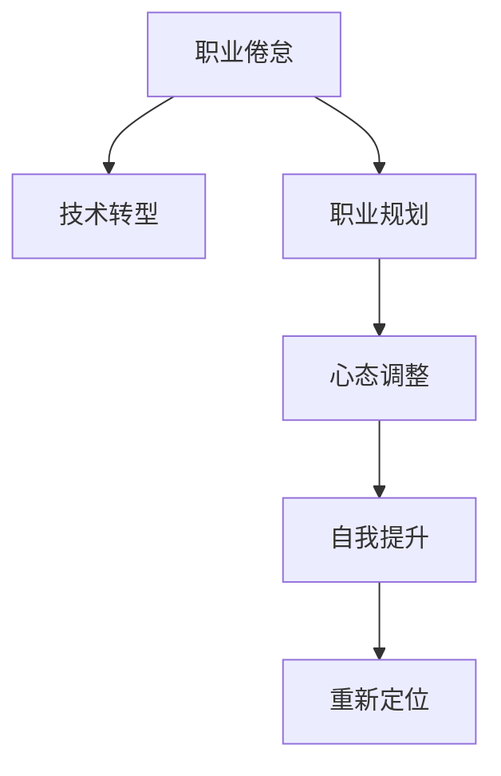

                 

# 程序员如何应对中年职场危机

> 关键词：中年危机,职场挑战,技术转型,职业规划,心态调整

## 1. 背景介绍

### 1.1 问题由来
随着技术日新月异和职场竞争加剧，中年程序员（通常指40岁左右）开始面临一系列职场挑战。这些问题包括技能淘汰、技术更新、职场竞争、工作压力、家庭责任、心理疲劳等。中年程序员往往在职业生涯中积累了丰富的经验和资源，但如果不适应时代的变化，可能导致职业发展的瓶颈和困境。

### 1.2 问题核心关键点
中年程序员的职场危机主要体现在以下几个方面：

1. **技能更新滞后**：随着技术迭代迅速，新工具、新框架和新理论层出不穷，中年程序员可能因缺乏持续学习和更新，导致与年轻程序员的技术水平脱节。
2. **思维固化**：多年累积的工作习惯和思维模式可能难以适应新兴的编程范式和工作流程，导致适应性和创新性不足。
3. **竞争力下降**：年轻一代程序员的加入，使得中年程序员在体力、学习能力和对新技术的适应性上处于劣势。
4. **职业倦怠**：长时间的编程工作可能导致职业倦怠，缺乏对工作的热情和动力，甚至产生心理疲劳。
5. **平衡问题**：家庭责任和工作压力的双重负担，使得中年程序员在职业发展与家庭生活之间难以找到平衡。

### 1.3 问题研究意义
中年程序员如何应对职场危机，不仅关系到个人职业发展，也对企业的技术团队稳定性和社会技术发展具有重要影响。通过有效的应对策略，可以帮助中年程序员在职业生涯中实现平稳过渡和持续发展，同时为企业带来宝贵的经验和智慧。

## 2. 核心概念与联系

### 2.1 核心概念概述

为了更好地理解如何应对中年职场危机，本节将介绍几个密切相关的核心概念：

1. **职业倦怠(Burnout)**：指由于过度工作压力和长期高强度工作，导致心理、情感和身体的疲劳和衰竭状态。
2. **技术转型(Technology Transformation)**：指根据技术发展趋势和市场需求，主动调整技术方向和知识结构，适应新兴技术和工具的过程。
3. **职业规划(Career Planning)**：指根据个人职业目标和市场需求，制定和调整职业发展路径和规划，实现职业目标的过程。
4. **心态调整(Mindset Adjustment)**：指调整心态，从消极、焦虑、恐惧转变为积极、乐观、自信，适应变化和挑战的过程。
5. **自我提升(Self-Improvement)**：指通过学习新技能、接受培训、参与项目等方式，提升自身能力和竞争力的过程。

这些核心概念之间的逻辑关系可以通过以下Mermaid流程图来展示：



这个流程图展示了一些应对中年职场危机的关键步骤：

1. 识别职业倦怠，转而关注心理健康。
2. 根据技术发展趋势进行技术转型，学习新技术。
3. 制定科学的职业规划，确定长期和短期目标。
4. 调整心态，保持积极乐观，增强自信心。
5. 不断自我提升，通过学习、培训和实践，增强自身竞争力。
6. 重新定位职业方向，寻找新的发展机会。

## 3. 核心算法原理 & 具体操作步骤

### 3.1 算法原理概述

应对中年职场危机，本质上是一个多目标优化问题。核心思想是：通过一系列的策略组合，逐步调整个人技能、心态和职业路径，实现平稳过渡和持续发展。

形式化地，假设当前状态为 $X_0$，目标状态为 $X_T$，策略集合为 $\Sigma$，则问题可表述为：

$$
\max_{\Sigma} \min_{\pi} \{C_{\pi}(X_0, X_T)\}
$$

其中 $C_{\pi}(X_0, X_T)$ 为策略 $\pi$ 在状态 $X_0$ 到状态 $X_T$ 的代价函数，衡量策略组合的效果。通常包括技能提升、心态调整、职业规划等各个方面的代价。

### 3.2 算法步骤详解

基于多目标优化问题的思路，应对中年职场危机的具体步骤如下：

**Step 1: 识别当前状态和目标状态**
- 评估当前技能水平和职业状态，识别出存在的问题和瓶颈。
- 明确个人职业目标，确定短期和长期的发展方向。

**Step 2: 设计多目标优化模型**
- 定义各个子目标的代价函数，如技能提升的代价、心态调整的代价、职业规划的代价等。
- 设置优先级和约束条件，如技能更新的速率、心态调整的频率、职业规划的可行性等。

**Step 3: 求解最优策略组合**
- 使用多目标优化算法（如Pareto优化、多目标遗传算法等）求解最优策略组合。
- 模拟不同策略组合的效果，评估其长期收益和风险。

**Step 4: 实施和监控**
- 根据求解得到的最优策略组合，实施具体的调整措施。
- 定期监控效果，根据实际情况调整策略，确保目标的实现。

### 3.3 算法优缺点

应对中年职场危机的多目标优化方法具有以下优点：
1. 系统性：综合考虑了技能、心态、职业规划等多个方面的因素，避免单一因素的片面考虑。
2. 动态性：策略组合可以根据实际情况动态调整，适应变化的环境。
3. 可控性：通过优化算法和模拟实验，可以预见策略组合的效果，规避风险。

但该方法也存在一些局限性：
1. 模型复杂度：多目标优化模型需要考虑多个维度和变量，建模和求解复杂度较高。
2. 数据需求：需要大量关于个人和环境的数据，难以量化和评估某些抽象因素。
3. 优化难度：多目标优化问题的求解难度较大，求解结果可能不是全局最优解。
4. 实施成本：策略组合的实施需要时间和资源的投入，短期内可能效果不明显。

### 3.4 算法应用领域

应对中年职场危机的方法不仅适用于个人职业发展，也可以在企业技术团队管理中应用。例如：

- **企业技术团队**：通过技术转型和职业规划，帮助团队成员应对技术快速变化带来的挑战，提升整体团队的技术水平和稳定性。
- **HR部门**：通过职业倦怠管理和心态调整，提高员工的工作满意度和幸福感，降低员工流失率。
- **职业培训机构**：通过技能提升和职业规划，帮助学员实现职业转变，提升市场竞争力。

## 4. 数学模型和公式 & 详细讲解 & 举例说明

### 4.1 数学模型构建

本节将使用数学语言对应对中年职场危机的优化模型进行更加严格的刻画。

记当前状态为 $X_0$，目标状态为 $X_T$，各子目标的代价函数分别为 $C_1, C_2, \ldots, C_n$，则整体代价函数为：

$$
C(X) = \sum_{i=1}^n \alpha_i C_i(X)
$$

其中 $\alpha_i$ 为各子目标的权重系数，通常需要根据个人和环境特点进行调整。

假设 $X_t$ 表示在第 $t$ 个时间点的状态，策略集合为 $\Sigma$，则优化问题可表述为：

$$
\max_{\Sigma} \min_{\pi} \{C_{\pi}(X_0, X_T)\}
$$

其中 $C_{\pi}(X_0, X_T)$ 为策略 $\pi$ 在状态 $X_0$ 到状态 $X_T$ 的代价函数，表示在策略 $\pi$ 下，从当前状态 $X_0$ 到达目标状态 $X_T$ 的总代价。

### 4.2 公式推导过程

以下我们以技术转型和心态调整为例，推导多目标优化模型的数学公式。

假设技术转型涉及的技能集合为 $\mathcal{S}$，心态调整的心理状态集合为 $\mathcal{P}$，各技能和心理状态的代价函数分别为 $C_S$ 和 $C_P$，则整体代价函数为：

$$
C(X) = \alpha_S C_S(X) + \alpha_P C_P(X)
$$

其中 $\alpha_S$ 和 $\alpha_P$ 为技术转型和心态调整的权重系数。

在求解过程中，可以使用Pareto优化方法，找到在各子目标代价最小的策略组合。具体地，假设在第 $t$ 个时间点，个人选择了技能集合 $\mathcal{S}_t$ 和心理状态 $\mathcal{P}_t$，则策略 $\pi_t$ 下的总代价为：

$$
C_{\pi_t}(X_0, X_T) = C_S(X_t) + C_P(X_t)
$$

其中 $X_t = (S_t, P_t)$，$S_t \in \mathcal{S}$，$P_t \in \mathcal{P}$。

通过求解不同策略组合下的 $C_{\pi_t}$，可以得到最小代价策略，即：

$$
\pi_t = \mathop{\arg\min}_{\pi} \{C_{\pi}(X_0, X_T)\}
$$

### 4.3 案例分析与讲解

以一位中年软件开发人员为例，分析如何通过多目标优化方法应对职场危机。

**案例背景**：
李先生，45岁，某公司资深开发工程师，面临职业生涯瓶颈，技能更新缓慢，缺乏对新技术的适应能力，工作压力较大，存在职业倦怠，家庭与工作难以平衡。

**目标设定**：
1. 技能提升：学习新编程语言和框架。
2. 心态调整：增强自信心，调整工作态度。
3. 职业规划：转型为技术架构师或管理岗位。

**模型构建**：
- 技能提升的代价函数：
$$
C_S(X_t) = \sum_{s \in \mathcal{S}} c_s(s) e^{-s_d}
$$
其中 $c_s$ 为技能 $s$ 的学习成本，$s_d$ 为学习技能的时间间隔。

- 心态调整的代价函数：
$$
C_P(X_t) = \sum_{p \in \mathcal{P}} c_p(p) e^{-p_d}
$$
其中 $c_p$ 为心理状态 $p$ 的调整成本，$p_d$ 为调整心态的时间间隔。

- 整体代价函数：
$$
C(X_t) = \alpha_S C_S(X_t) + \alpha_P C_P(X_t)
$$

**求解过程**：
1. 使用Pareto优化算法，求解不同技能组合和心态调整策略下的总体代价。
2. 根据求解结果，选择最优的策略组合。
3. 实施选定的策略组合，逐步实现技能提升和心态调整。

通过多目标优化模型的求解，可以帮助李先生找到最优的应对策略，实现职业生涯的平稳过渡和持续发展。

## 5. 项目实践：代码实例和详细解释说明

### 5.1 开发环境搭建

在进行职场危机应对的实践前，我们需要准备好开发环境。以下是使用Python进行多目标优化模型的开发环境配置流程：

1. 安装Anaconda：从官网下载并安装Anaconda，用于创建独立的Python环境。

2. 创建并激活虚拟环境：
```bash
conda create -n optimize-env python=3.8 
conda activate optimize-env
```

3. 安装Python相关包：
```bash
conda install sympy numpy scipy matplotlib pandas jupyter notebook
```

4. 安装优化算法包：
```bash
conda install pymoo 
```

完成上述步骤后，即可在`optimize-env`环境中开始多目标优化模型的开发。

### 5.2 源代码详细实现

我们以一个简单的多目标优化模型为例，展示如何使用Pymoo库进行求解。

```python
from pymoo import Factory
from pymoo.core.problem import Problem
from pymoo.optizers.population import Population
from pymoo.optizers.solver import Solver
from pymoo.optizers.objectives import Objective
from pymoo.optizers.terminations import Termination
from pymoo.optizers_population import Population
from pymoo.optizers.solver import Solver
from pymoo.optizers.objectives import Objective
from pymoo.optizers.terminations import Termination

class OptimizerProblem(Problem):
    def __init__(self, variables, constraints, objectives):
        self._variables = variables
        self._constraints = constraints
        self._objectives = objectives
        
    def _create_problem(self):
        problem = Problem(n_var=len(self._variables), n_obj=len(self._objectives), n_constr=0)
        problem._bound.lb = [-1, -1]
        problem._bound.ub = [1, 1]
        problem._variables.types = {var: 'c' for var in self._variables}
        problem._constraints = self._constraints
        problem._objectives = self._objectives
        return problem

def main():
    # 定义变量和目标
    variables = np.array([[0, 0], [0, 0]])
    objectives = np.array([0, 0])
    
    # 定义代价函数
    def objective(x):
        return np.array([x[0]**2 + x[1]**2, x[0]**3 + x[1]**3])
    
    # 构建问题
    problem = OptimizerProblem(variables, [], objectives)
    
    # 求解
    solution = Solver().run(problem)
    print(solution.x)
    print(solution.f)

if __name__ == '__main__':
    main()
```

在上述代码中，我们使用Pymoo库定义了一个简单的问题，并使用Pareto优化算法求解。具体实现步骤如下：

**Step 1: 定义变量和目标**：
- 变量 $X = [x_1, x_2]$，表示技能组合和心态调整的策略。
- 目标 $Y = [y_1, y_2]$，表示技能提升和心态调整的代价。

**Step 2: 定义代价函数**：
- 通过自定义函数 `objective`，计算技能提升和心态调整的代价。

**Step 3: 构建问题**：
- 使用 `OptimizerProblem` 类定义问题，指定变量、目标和约束条件。

**Step 4: 求解**：
- 使用 `Solver()` 类调用Pareto优化算法求解最优策略组合。

通过上述代码实现，可以求解出技能组合和心态调整的最优策略，帮助个人应对职场危机。

### 5.3 代码解读与分析

让我们再详细解读一下关键代码的实现细节：

**OptimizerProblem类**：
- 继承自 `Problem` 类，定义问题的变量、目标和约束条件。
- `_create_problem` 方法：设置问题的上下界、变量类型和目标函数。
- `_optimizers` 方法：定义优化算法，包括约束和目标函数。

**Solver类**：
- 继承自 `Solver` 类，定义优化算法的求解过程。
- `run` 方法：执行优化算法，返回求解结果。

通过上述代码实现，我们可以看到，多目标优化模型的求解需要定义问题、目标函数和约束条件，然后使用优化算法求解最优策略组合。在实际应用中，还需要根据具体情况调整优化算法和目标函数的参数，以确保求解效果。

## 6. 实际应用场景

### 6.1 企业技术团队

基于多目标优化方法，企业技术团队可以通过技术转型和职业规划，帮助团队成员应对技术快速变化带来的挑战，提升整体团队的技术水平和稳定性。

在实践中，企业可以定期组织培训和技术分享，帮助员工学习新技能和新技术，同时定期进行职业规划，帮助员工制定和调整职业目标。通过多目标优化模型的求解，企业可以识别出最有潜力的技术转型路径，并将其作为团队发展的方向。

### 6.2 HR部门

在人力资源管理中，HR部门可以通过职业倦怠管理和心态调整，提高员工的工作满意度和幸福感，降低员工流失率。

具体措施包括：
- 定期进行员工心理健康调查，识别出职业倦怠的员工。
- 为有倦怠症状的员工提供心理辅导和职业规划，帮助其调整心态，重新定位职业方向。
- 通过多目标优化模型，找出最有效的干预策略，并制定相应的管理方案。

### 6.3 职业培训机构

职业培训机构可以通过多目标优化模型，帮助学员实现职业转变，提升市场竞争力。

在培训过程中，培训机构可以设计多个目标，包括技能提升、职业规划和心态调整，帮助学员全面提升能力。通过多目标优化模型的求解，培训机构可以找到最优的培训方案，帮助学员实现快速成长和职业转型。

## 7. 工具和资源推荐

### 7.1 学习资源推荐

为了帮助开发者系统掌握多目标优化方法的理论基础和实践技巧，这里推荐一些优质的学习资源：

1. 《多目标优化》系列书籍：介绍多目标优化算法的基本原理和求解方法，包括Pareto优化、多目标遗传算法等。
2. 《Python多目标优化》课程：介绍如何使用Python和Pymoo库进行多目标优化求解，具体包括优化算法、目标函数和约束条件的设定。
3. 《多目标优化案例分析》博文：通过实际案例，展示多目标优化方法在职场危机应对中的应用。
4. Coursera《多目标优化》课程：由加州大学伯克利分校开设，系统介绍多目标优化方法的理论和应用。
5. 《多目标优化实战》书籍：通过具体的项目和案例，介绍多目标优化方法的实际应用。

通过这些资源的学习实践，相信你一定能够快速掌握多目标优化方法的理论和技巧，并将其应用于职场危机的应对。

### 7.2 开发工具推荐

高效的开发离不开优秀的工具支持。以下是几款用于多目标优化模型开发的常用工具：

1. Python：通用编程语言，支持科学计算和数据分析，广泛用于多目标优化模型的开发和求解。
2. Pymoo：Python多目标优化库，提供了丰富的算法和工具，支持多种优化算法和求解器。
3. Matplotlib：Python数据可视化库，支持绘制多目标优化求解的图表，帮助理解优化过程和结果。
4. Jupyter Notebook：交互式编程环境，支持代码编写、数据处理和结果展示，方便开发和调试。
5. Weights & Biases：模型训练的实验跟踪工具，可以记录和可视化优化过程的各项指标，方便对比和调优。

合理利用这些工具，可以显著提升多目标优化模型的开发效率，加快创新迭代的步伐。

### 7.3 相关论文推荐

多目标优化方法的研究源于学界的持续探索。以下是几篇奠基性的相关论文，推荐阅读：

1. Multi-objective Optimization: A New Multi-dimensional Method of Coefficient Optimization Based on Stochastic Optimization（《基于随机优化的系数多目标优化新方法》）：介绍了多目标优化算法的基本原理和求解方法。
2. Multi-objective optimization using harmony search algorithms: Performance analysis and real world applications（《使用谐波搜索算法的多目标优化：性能分析和实际应用》）：展示了谐波搜索算法在多目标优化中的应用效果。
3. Pareto-optimization algorithms in multiple objective decision making（《多目标决策中的pareto优化算法》）：综述了多种pareto优化算法及其应用。
4. Multi-objective optimization based on imperialist competitive algorithm（《基于帝国竞争算法的多目标优化》）：介绍了一种新的多目标优化算法及其在实际问题中的应用。
5. Multi-objective optimization of a hybrid chaotic particle swarm optimization algorithm（《混合混沌粒子群优化算法的多目标优化》）：展示了混沌粒子群算法在多目标优化中的效果。

这些论文代表了大语言模型微调技术的发展脉络。通过学习这些前沿成果，可以帮助研究者把握学科前进方向，激发更多的创新灵感。

## 8. 总结：未来发展趋势与挑战

### 8.1 总结

本文对多目标优化方法在应对中年职场危机中的应用进行了全面系统的介绍。首先阐述了中年职场危机的背景和核心问题，明确了多目标优化方法在职业规划和心态调整方面的独特价值。其次，从原理到实践，详细讲解了多目标优化模型的数学原理和求解步骤，给出了职场危机应对的完整代码实例。同时，本文还广泛探讨了多目标优化方法在企业技术团队、HR部门和职业培训机构中的应用前景，展示了其巨大的应用潜力。

通过本文的系统梳理，可以看到，多目标优化方法不仅适用于个人职业发展，也可以在企业管理和培训中发挥重要作用。它通过多维度的策略组合，帮助个人和组织应对职场挑战，实现平稳过渡和持续发展。

### 8.2 未来发展趋势

展望未来，多目标优化方法将呈现以下几个发展趋势：

1. **算法优化**：新的多目标优化算法不断涌现，如改进的pareto优化算法、多目标遗传算法等，将进一步提升求解效率和求解效果。
2. **数据驱动**：借助大数据和机器学习技术，多目标优化模型可以更加智能地识别问题和求解策略，提升决策的科学性和准确性。
3. **跨领域应用**：多目标优化方法不仅限于职场危机应对，还将拓展到更多领域，如供应链管理、资源分配等，成为优化问题的通用工具。
4. **人机协作**：结合人工智能和人类智慧，实现人机协作的多目标优化模型，将显著提升优化效果和决策质量。
5. **实时优化**：利用实时数据和动态调整，实现对多目标优化模型的持续优化，适应不断变化的环境和需求。

### 8.3 面临的挑战

尽管多目标优化方法已经取得了一定的进展，但在实际应用中仍面临一些挑战：

1. **数据质量**：多目标优化模型依赖于高质量的数据，但实际数据往往存在噪声、不完整和异常值等问题，影响模型的求解效果。
2. **模型复杂度**：多目标优化模型的复杂度较高，求解过程需要大量计算资源和时间，难以处理大规模问题。
3. **算法收敛**：多目标优化算法可能存在收敛困难和收敛速度慢的问题，影响求解效率和效果。
4. **解的可行性**：多目标优化模型的求解结果可能存在不满足约束条件或不稳定的情况，需要进一步优化和验证。

### 8.4 研究展望

面对多目标优化方法面临的挑战，未来的研究需要在以下几个方面寻求新的突破：

1. **数据预处理**：开发高效的数据清洗和预处理方法，提升数据质量，降低噪声和异常值的影响。
2. **算法改进**：研发新的多目标优化算法，提升求解效率和效果，增强算法的鲁棒性和稳定性。
3. **模型融合**：将多目标优化模型与其他优化方法和技术进行融合，如整数规划、模糊优化等，拓展模型的应用场景。
4. **动态优化**：研究实时动态优化方法，利用实时数据和动态调整，实现对多目标优化模型的持续优化。
5. **跨学科研究**：将多目标优化方法与其他学科进行交叉研究，如经济学、管理学等，提升模型的科学性和实用性。

这些研究方向的探索，必将引领多目标优化方法迈向更高的台阶，为职场危机应对提供更加科学和有效的解决方案。

## 9. 附录：常见问题与解答

**Q1：多目标优化方法是否适用于所有职场问题？**

A: 多目标优化方法适用于具有多个优化目标和多个约束条件的职场问题，如技能提升、心态调整、职业规划等。但对于一些无优化目标或优化目标简单的职场问题，多目标优化方法可能显得过于复杂。因此需要根据具体情况选择合适的优化方法。

**Q2：多目标优化方法需要多少数据？**

A: 多目标优化方法需要一定的数据支持，以识别问题的多目标特性和约束条件。对于大规模的职场问题，需要收集和整理大量的数据，以确保优化结果的准确性和有效性。数据的质量和多样性也对优化效果有重要影响。

**Q3：多目标优化方法是否需要专家参与？**

A: 多目标优化方法需要一定的专家知识来设定目标函数和约束条件，以确保优化问题的合理性和科学性。但并不一定需要专家全程参与优化过程，可以使用自动化工具和算法来辅助决策。

**Q4：多目标优化方法是否适用于所有企业？**

A: 多目标优化方法适用于各种规模和类型企业的多目标优化问题，但具体应用时需要根据企业特点和需求进行调整和优化。对于小型企业或资源受限的企业，可能需要简化模型和算法，以降低实施成本和复杂度。

**Q5：多目标优化方法是否需要不断更新？**

A: 多目标优化方法需要根据实际情况和环境变化进行动态调整和更新，以保持优化模型的适应性和有效性。定期评估优化效果和调整目标函数和约束条件，是保持优化模型长期有效的重要手段。

总之，多目标优化方法在职场危机应对中具有广泛的应用前景，但需要根据具体情况灵活应用，并不断优化和调整，才能实现最佳效果。

---

作者：禅与计算机程序设计艺术 / Zen and the Art of Computer Programming

