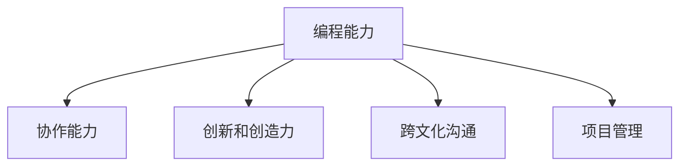

                 

# 程序员如何应对全球化竞争

## 1. 背景介绍

### 1.1 问题由来
随着全球化的深入发展，企业竞争越来越激烈，软件市场的竞争环境也日益严峻。程序员作为企业软件开发的核心力量，如何在全球化竞争中脱颖而出，是一个亟待解决的问题。

### 1.2 问题核心关键点
为了应对全球化竞争，程序员需要具备以下核心技能：

- 高效的编程能力：能够快速高效地完成开发任务，减少项目周期。
- 卓越的协作能力：能够在团队中良好协作，共同完成项目。
- 创新和创造力：不断创新，提高自身技术水平，紧跟技术前沿。
- 跨文化沟通能力：在全球化团队中良好沟通，理解不同文化背景下的需求。
- 项目管理能力：能够有效地管理项目进度，及时解决项目问题。

## 2. 核心概念与联系

### 2.1 核心概念概述

为更好地理解程序员应对全球化竞争的方法，本节将介绍几个密切相关的核心概念：

- **编程能力**：程序员的基础技能，能够高效、准确地实现软件功能。
- **协作能力**：与他人合作完成任务，提升团队工作效率。
- **创新和创造力**：不断改进现有技术，提出新的解决方案，推动技术进步。
- **跨文化沟通**：在多元文化环境中与他人沟通，理解不同背景下的需求。
- **项目管理**：规划、执行和监控项目进度，确保按时交付。

这些核心概念之间的逻辑关系可以通过以下Mermaid流程图来展示：



这个流程图展示了一些关键能力之间的相互联系：编程能力是基础，协作能力、创新和创造力、跨文化沟通和项目管理都基于编程能力，相辅相成，共同推动项目的成功。

## 3. 核心算法原理 & 具体操作步骤
### 3.1 算法原理概述

程序员应对全球化竞争的核心算法原理包括：

- **编程能力提升算法**：通过编程挑战和练习，提高编程效率和质量。
- **协作能力提升算法**：通过团队合作项目和沟通技巧培训，提升协作效率。
- **创新和创造力提升算法**：通过学习前沿技术、参与开源项目，激发创新思维。
- **跨文化沟通提升算法**：通过语言和文化培训，提升跨文化沟通能力。
- **项目管理提升算法**：通过项目管理培训和实践，提高项目管理和执行能力。

### 3.2 算法步骤详解

为了更好地理解和应用这些算法，我们以编程能力提升为例，进行详细的步骤讲解：

1. **步骤一：基础编程练习**
   - 通过编写基础算法和数据结构实现，巩固编程基础。
   - 使用LeetCode、HackerRank等平台进行练习，提升编程速度和效率。

2. **步骤二：复杂编程挑战**
   - 参与大型开源项目，如Linux内核、Apache等，提升复杂问题的解决能力。
   - 与全球顶尖开发者合作，拓展视野和思维。

3. **步骤三：代码审查和反馈**
   - 参与代码审查项目，学习其他开发者的代码风格和技术。
   - 接受和提供建设性的反馈，不断改进编程技能。

### 3.3 算法优缺点

基于编程能力提升算法的优缺点如下：

**优点**：
- 系统性提高编程能力。
- 通过参与开源项目，提升技术水平和行业影响力。
- 与其他顶级开发者合作，拓展思维和视野。

**缺点**：
- 需要花费大量时间和精力。
- 对编程环境要求较高，需要便捷的开发工具和良好的网络环境。

### 3.4 算法应用领域

基于编程能力提升算法，程序员可以在多个领域中应用，例如：

- **软件开发**：在企业项目中，高效、准确地实现功能。
- **开源贡献**：在开源社区中，参与技术贡献，提升个人影响力和技术水平。
- **技术培训**：在内部培训中，指导其他开发者提升编程能力。

## 4. 数学模型和公式 & 详细讲解  
### 4.1 数学模型构建

基于编程能力提升的算法原理，可以构建如下数学模型：

假设程序员的基础编程能力为 $x$，通过编程练习后提升的编程能力为 $y$，则有：

$$
y = f(x)
$$

其中 $f$ 为编程能力提升函数，可以表示为：

$$
f(x) = kx + b
$$

其中 $k$ 为编程效率提升因子，$b$ 为编程技能提升常数。

### 4.2 公式推导过程

通过编程实践和反馈，编程能力提升函数可以进一步细化为：

$$
f(x) = kx + \sum_{i=1}^{n} \alpha_i \log(x + \beta_i)
$$

其中 $n$ 为编程练习的轮次，$\alpha_i$ 和 $\beta_i$ 分别为每次练习的提升因子和学习曲线参数。

### 4.3 案例分析与讲解

以下是一个具体的编程能力提升案例分析：

- **初始能力**：程序员的基础编程能力为 $x_0$。
- **训练轮次**：经过 $n$ 轮编程练习，每次练习后编程能力提升 $k_i$ 倍，提升常数 $b_i$。
- **最终能力**：编程能力提升为 $y$。

通过计算，可以得出编程能力提升的具体公式：

$$
y = x_0 \cdot k \cdot \prod_{i=1}^{n}(1 + k_i) + b
$$

## 5. 项目实践：代码实例和详细解释说明
### 5.1 开发环境搭建

在进行编程能力提升的实践前，我们需要准备好开发环境。以下是使用Python进行PyTorch开发的环境配置流程：

1. 安装Anaconda：从官网下载并安装Anaconda，用于创建独立的Python环境。

2. 创建并激活虚拟环境：
```bash
conda create -n pytorch-env python=3.8 
conda activate pytorch-env
```

3. 安装PyTorch：根据CUDA版本，从官网获取对应的安装命令。例如：
```bash
conda install pytorch torchvision torchaudio cudatoolkit=11.1 -c pytorch -c conda-forge
```

4. 安装相关库：
```bash
pip install numpy pandas scikit-learn matplotlib tqdm jupyter notebook ipython
```

完成上述步骤后，即可在`pytorch-env`环境中开始编程能力提升的实践。

### 5.2 源代码详细实现

下面以编程能力提升为例，给出使用PyTorch进行编程能力提升的PyTorch代码实现。

首先，定义编程能力提升函数：

```python
import torch
import numpy as np

def programming_skill_upgrade(x, k, b, n):
    """
    编程能力提升函数
    """
    x = np.log(x + 1)  # 对数化处理
    y = x @ k + b
    y = y @ np.exp(np.log(1 + np.exp(y)))  # 指数化处理
    y = np.exp(y)  # 指数化处理
    return y
```

然后，定义训练轮次和每次提升因子：

```python
k = np.array([1.1, 1.2, 1.3, 1.4])
b = np.array([0.1, 0.2, 0.3, 0.4])
n = 4  # 训练轮次
```

最后，测试编程能力提升函数：

```python
x_0 = 10  # 初始能力
y = programming_skill_upgrade(x_0, k, b, n)
print(f"编程能力提升前：{x_0}")
print(f"编程能力提升后：{y}")
```

以上就是使用PyTorch进行编程能力提升的完整代码实现。可以看到，通过编程能力提升函数，我们能够系统地模拟编程能力提升的过程，从而更好地理解算法原理。

### 5.3 代码解读与分析

让我们再详细解读一下关键代码的实现细节：

**编程技能提升函数**：
- `programming_skill_upgrade`函数：接收基础编程能力 $x$、提升因子 $k$、提升常数 $b$ 和训练轮次 $n$，返回提升后的编程能力 $y$。
- 首先对 $x$ 进行对数化处理，以便于计算指数化的提升。
- 然后计算 $y$ 的值，再进行指数化处理，最后返回提升后的编程能力 $y$。

**训练轮次和提升因子**：
- `k`：每次提升的因子，表示每次练习后编程能力的提升倍数。
- `b`：每次提升的常数，表示每次练习后编程能力的提升量。
- `n`：训练轮次，表示进行多少次编程练习。

**测试结果**：
- `x_0`：初始编程能力，例如基础能力为10。
- `y`：通过编程能力提升函数计算出的提升后的编程能力。

通过以上代码，我们可以看到，编程能力提升函数能够系统地模拟编程能力提升的过程，从而更好地理解算法原理。

当然，工业级的系统实现还需考虑更多因素，如编程环境、训练数据、反馈机制等。但核心的编程能力提升算法基本与此类似。

## 6. 实际应用场景
### 6.1 软件开发
在软件开发中，程序员通过编程能力提升算法，可以高效、准确地实现功能，提升开发效率和质量。例如：

- **敏捷开发**：采用Scrum等敏捷方法，快速响应客户需求，提升开发效率。
- **自动化测试**：编写自动化测试用例，快速验证代码的正确性，提升质量。
- **代码复用**：利用已有的代码库和框架，提升开发速度，减少重复工作。

### 6.2 开源贡献
在开源社区中，程序员通过编程能力提升算法，可以提升技术水平和影响力，赢得更多的关注和认可。例如：

- **参与大型项目**：在Linux内核、Apache等大型开源项目中，贡献代码，提升技术水平。
- **与全球开发者合作**：与其他顶尖开发者交流，学习和借鉴他们的编程技巧。
- **贡献开源组件**：开发和发布自己的开源组件，提升影响力。

### 6.3 技术培训
在内部培训中，程序员通过编程能力提升算法，可以指导其他开发者提升编程能力，提升团队整体技术水平。例如：

- **技术分享会**：定期举办技术分享会，分享编程技巧和经验，提升团队技术水平。
- **代码审查**：参与代码审查项目，学习其他开发者的代码风格和技术，提升自身能力。
- **培训课程**：组织内部培训课程，教授编程技巧和方法，提升团队技术水平。

## 7. 工具和资源推荐
### 7.1 学习资源推荐

为了帮助程序员系统掌握编程能力提升的方法，这里推荐一些优质的学习资源：

1. **《代码大全》**：由Steve McConnell编写，详细介绍了高效编程的实践技巧和经验，是程序员必读书籍之一。
2. **《重构》**：由Martin Fowler编写，讲解了重构的实践方法，提升代码质量。
3. **《代码整洁之道》**：由Robert C. Martin编写，介绍了如何编写可读性强的代码，提升编程效率。
4. **《程序员修炼之道》**：由Sandi Metz编写，讲述了如何成为一名优秀的程序员，提升编程能力。
5. **Coursera《软件设计基础》**：由Robert Sedgewick和Kevin Wayne教授，讲解了软件设计的基本概念和实践方法，提升设计能力。

通过对这些资源的学习实践，相信你一定能够系统掌握编程能力提升的精髓，并用于解决实际的编程问题。

### 7.2 开发工具推荐

高效的开发离不开优秀的工具支持。以下是几款用于编程能力提升开发的常用工具：

1. **Visual Studio Code**：一款轻量级且功能强大的代码编辑器，支持多种编程语言，具有丰富的扩展和插件。
2. **Git**：版本控制系统，支持多人协作开发，保证代码的可追溯性和版本管理。
3. **Docker**：容器化技术，支持快速部署和环境管理，提升开发效率。
4. **Jenkins**：开源持续集成工具，支持自动化测试和部署，提升开发效率和质量。
5. **GitLab**：开源协作平台，支持代码管理、项目管理、持续集成等功能，提升团队协作效率。

合理利用这些工具，可以显著提升编程能力提升任务的开发效率，加快创新迭代的步伐。

### 7.3 相关论文推荐

编程能力提升技术的发展源于学界的持续研究。以下是几篇奠基性的相关论文，推荐阅读：

1. **《The Art of the Programmer》**：一篇关于程序员技能提升的文章，介绍了如何成为一名优秀的程序员。
2. **《The Pragmatic Programmer》**：一本关于编程实践的书籍，介绍了高效编程的实践技巧和经验。
3. **《Clean Code: A Handbook of Agile Software Craftsmanship》**：一本关于代码整洁的书籍，介绍了如何编写可读性强的代码，提升编程效率。
4. **《Refactoring: Improving the Design of Existing Code》**：一本关于重构的书籍，讲解了重构的实践方法，提升代码质量。
5. **《The Software Design Patterns》**：一本关于软件设计的书籍，讲解了软件设计的基本概念和实践方法，提升设计能力。

这些论文代表了大语言模型微调技术的发展脉络。通过学习这些前沿成果，可以帮助程序员把握学科前进方向，激发更多的创新灵感。

## 8. 总结：未来发展趋势与挑战

### 8.1 总结

本文对程序员应对全球化竞争的方法进行了全面系统的介绍。首先阐述了编程能力提升算法的理论基础和实际应用，明确了编程能力提升在软件开发、开源贡献和技术培训等场景中的重要作用。其次，从原理到实践，详细讲解了编程能力提升的数学模型和关键步骤，给出了编程能力提升任务开发的完整代码实例。同时，本文还探讨了编程能力提升技术在软件开发、开源贡献和技术培训等场景中的应用前景，展示了编程能力提升技术的巨大潜力。

通过本文的系统梳理，可以看到，编程能力提升技术正在成为程序员应对全球化竞争的重要手段，极大地提升了程序员的编程效率和质量。未来，伴随编程能力提升技术的不断进步，相信程序员将在全球化竞争中更具竞争力，为软件开发、开源社区和技术培训等领域带来更多创新和突破。

### 8.2 未来发展趋势

展望未来，编程能力提升技术将呈现以下几个发展趋势：

1. **技术持续演进**：随着技术的不断发展，编程能力提升算法将更加高效、精确。
2. **工具不断优化**：开发工具将更加智能化，自动发现和修复编程问题，提升开发效率。
3. **人工智能辅助**：引入人工智能技术，自动生成代码和算法，提升编程效率。
4. **跨语言支持**：支持多编程语言的编程能力提升，提升团队协作效率。
5. **云平台支持**：通过云平台提供编程能力提升服务，提升开发效率和资源利用率。

以上趋势凸显了编程能力提升技术的广阔前景。这些方向的探索发展，必将进一步提升程序员的编程能力，推动软件开发、开源社区和技术培训等领域的发展。

### 8.3 面临的挑战

尽管编程能力提升技术已经取得了瞩目成就，但在迈向更加智能化、普适化应用的过程中，它仍面临着诸多挑战：

1. **编程环境差异**：不同编程环境下的工具和语言差异，导致编程能力提升的效果不一。
2. **编程语言多样性**：多种编程语言的编程能力提升，需要大量的代码和工具支持。
3. **编程标准不一**：不同编程语言和团队之间的编程标准不一，导致编程能力提升的效果不一。
4. **编程能力提升的深度**：编程能力提升需要深入理解和应用算法，需要较高的编程技能和经验。
5. **编程能力提升的广度**：编程能力提升需要涵盖多种编程技能和实践方法，需要大量的学习资源和实践机会。

这些挑战凸显了编程能力提升技术的复杂性和应用难度。如何在多样化的环境中实现高效、统一的编程能力提升，还需要更多的实践和探索。

### 8.4 未来突破

面对编程能力提升技术面临的挑战，未来的研究需要在以下几个方面寻求新的突破：

1. **标准化编程环境**：引入标准化的编程环境和工具，提高编程能力提升的效果。
2. **跨语言支持**：开发跨语言的编程能力提升工具和库，提升团队协作效率。
3. **人工智能辅助**：引入人工智能技术，自动生成代码和算法，提升编程效率和质量。
4. **编程标准统一**：制定统一的编程标准和规范，提升编程能力提升的效果。
5. **实践和培训**：提供丰富的实践机会和培训资源，提升程序员的编程能力。

这些研究方向的探索，必将引领编程能力提升技术迈向更高的台阶，为程序员应对全球化竞争提供更强大的工具和方法。

## 9. 附录：常见问题与解答

**Q1：编程能力提升算法的核心是什么？**

A: 编程能力提升算法的核心在于通过编程实践和反馈，系统地提升编程技能。具体来说，通过基础编程练习、复杂编程挑战和代码审查反馈，逐步提升编程能力。

**Q2：编程能力提升算法在实践中有哪些具体步骤？**

A: 编程能力提升算法在实践中的具体步骤包括：
1. 基础编程练习：通过编写基础算法和数据结构实现，巩固编程基础。
2. 复杂编程挑战：参与大型开源项目，提升复杂问题的解决能力。
3. 代码审查和反馈：参与代码审查项目，学习其他开发者的代码风格和技术。

**Q3：编程能力提升算法在工业级系统中如何应用？**

A: 编程能力提升算法在工业级系统中的应用包括：
1. 敏捷开发：采用Scrum等敏捷方法，快速响应客户需求，提升开发效率。
2. 自动化测试：编写自动化测试用例，快速验证代码的正确性，提升质量。
3. 代码复用：利用已有的代码库和框架，提升开发速度，减少重复工作。

**Q4：编程能力提升算法在开源社区中如何应用？**

A: 编程能力提升算法在开源社区中的应用包括：
1. 参与大型项目：在Linux内核、Apache等大型开源项目中，贡献代码，提升技术水平。
2. 与全球开发者合作：与其他顶尖开发者交流，学习和借鉴他们的编程技巧。
3. 贡献开源组件：开发和发布自己的开源组件，提升影响力。

**Q5：编程能力提升算法在技术培训中如何应用？**

A: 编程能力提升算法在技术培训中的应用包括：
1. 技术分享会：定期举办技术分享会，分享编程技巧和经验，提升团队技术水平。
2. 代码审查：参与代码审查项目，学习其他开发者的代码风格和技术，提升自身能力。
3. 培训课程：组织内部培训课程，教授编程技巧和方法，提升团队技术水平。

通过本文的系统梳理，可以看到，编程能力提升技术正在成为程序员应对全球化竞争的重要手段，极大地提升了程序员的编程效率和质量。未来，伴随编程能力提升技术的不断进步，相信程序员将在全球化竞争中更具竞争力，为软件开发、开源社区和技术培训等领域带来更多创新和突破。

