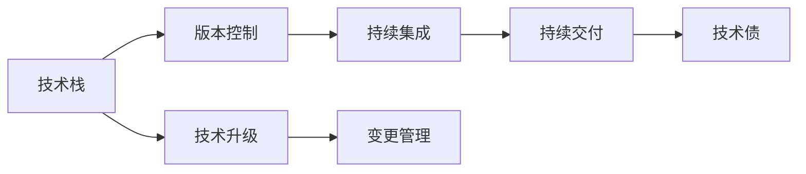
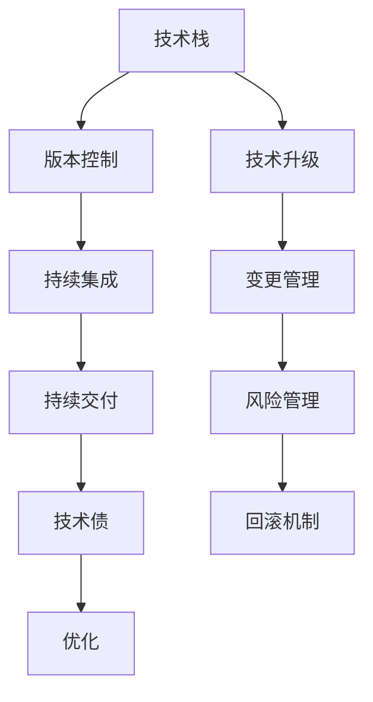

                 

## 1. 背景介绍

在信息技术高速发展的今天，程序员需要不断地学习和适应新技术，以保持竞争力和解决实际问题。技术升级与变更不仅影响软件开发过程，也关乎企业的技术创新和市场竞争力。本文将从背景介绍开始，探讨程序员应对技术升级与变更的策略。

## 2. 核心概念与联系

### 2.1 核心概念概述

为了深入理解如何应对技术升级与变更，本节将介绍几个核心概念：

- **技术栈 (Technical Stack)**: 开发项目中使用的所有工具和框架的集合。
- **版本控制 (Version Control)**: 管理代码变更、跟踪修改历史的过程，常用的有Git等。
- **持续集成 (Continuous Integration, CI)**: 自动化地构建和测试代码的流程，常用的有Jenkins等。
- **持续交付 (Continuous Delivery, CD)**: 将代码变更自动部署到生产环境的过程，包括测试、部署、回滚等环节。
- **技术债 (Technical Debt)**: 因追求快速开发而欠下的技术债务，如代码复用率低、架构不合理等。
- **技术升级 (Technology Upgrade)**: 替换旧的技术栈、框架或工具的过程，目的是提升代码质量、提升性能等。
- **变更管理 (Change Management)**: 有效管理和控制软件变更过程的实践，确保变更安全、高效。

这些概念之间的逻辑关系可以通过以下Mermaid流程图来展示：



这个流程图展示了一组与技术升级与变更相关的关键概念及其相互关系：

1. 技术栈作为开发项目的基础，需要通过版本控制和持续集成进行管理。
2. 持续交付是确保代码变更顺利进入生产环境的流程。
3. 技术债是开发过程中不可避免的问题，需要通过技术升级和变更管理来解决。
4. 技术升级是替换旧技术栈或工具的过程，目的是提升代码质量、性能等。
5. 变更管理是控制变更过程的关键实践，确保变更过程安全、高效。

### 2.2 核心概念原理和架构的 Mermaid 流程图



这个流程图示例展示了各个概念之间的互动关系，强调了变更管理在技术升级中的关键作用，以及优化和风险管理的重要性。

## 3. 核心算法原理 & 具体操作步骤

### 3.1 算法原理概述

技术升级与变更的本质是通过迭代优化和持续改进提升技术栈的性能、安全性和可维护性。以下是基于此核心概念的技术升级与变更流程的总体思路：

1. **识别技术债**: 通过代码审查、性能评估、架构评审等手段，识别出技术债。
2. **规划升级策略**: 根据技术债的严重程度、业务影响等因素，制定升级计划。
3. **设计变更方案**: 根据升级计划，设计具体的变更方案，包括技术选型、代码重构、架构重构等。
4. **实施升级方案**: 通过持续交付流程，逐步实施变更方案。
5. **评估变更效果**: 通过性能测试、代码审查、用户反馈等手段，评估变更效果。
6. **优化和迭代**: 根据评估结果，进行优化和迭代，持续改进技术栈。

### 3.2 算法步骤详解

技术升级与变更是一个迭代的过程，以下步骤详述了整个过程：

**Step 1: 识别技术债**

- **代码审查**：通过工具如SonarQube等，分析代码质量，识别出潜在的代码异味、性能瓶颈等问题。
- **性能评估**：通过Benchmark测试等手段，评估代码的性能瓶颈，识别出低效的算法、数据库操作等问题。
- **架构评审**：通过架构评审会议，识别出架构设计不合理、模块耦合度高、扩展性差等问题。

**Step 2: 规划升级策略**

- **风险评估**：评估技术债对业务的影响程度，优先处理高风险问题。
- **成本评估**：评估升级所需的成本，包括人力、时间和资源等。
- **时间规划**：根据成本评估和时间需求，制定升级的时间表。

**Step 3: 设计变更方案**

- **技术选型**：根据业务需求，选择合适的技术栈或框架，考虑性能、可维护性、扩展性等因素。
- **代码重构**：针对代码质量问题，进行重构，提升代码的可读性、可维护性。
- **架构重构**：针对架构设计不合理问题，进行重构，提升系统的扩展性和可维护性。

**Step 4: 实施升级方案**

- **持续集成**：使用Jenkins等工具，自动化地构建和测试代码变更。
- **持续交付**：通过CI/CD流程，逐步将代码变更部署到生产环境。
- **回滚机制**：在生产环境中设置回滚机制，应对不可预见的风险。

**Step 5: 评估变更效果**

- **性能测试**：通过性能测试工具如JMeter、Gatling等，评估代码变更对性能的影响。
- **代码审查**：通过代码审查工具如Codacy等，评估代码质量的变化。
- **用户反馈**：通过用户反馈，评估业务影响。

**Step 6: 优化和迭代**

- **持续优化**：根据评估结果，持续优化技术栈，提升性能和可维护性。
- **迭代改进**：根据技术债的新发现，进行迭代改进，提升技术栈的质量。

### 3.3 算法优缺点

技术升级与变更流程的优缺点如下：

#### 优点：

1. **提升性能**: 通过优化和重构，提升代码的性能和可维护性。
2. **减少技术债**: 通过系统化管理，减少技术债，提升代码质量。
3. **提高可维护性**: 通过规范化代码和架构设计，提高系统的可维护性。
4. **降低风险**: 通过风险评估和回滚机制，降低变更的风险。

#### 缺点：

1. **成本高**: 技术升级和变更需要大量的人力和时间投入，成本较高。
2. **业务影响大**: 技术升级和变更可能会对业务产生较大的影响，需要谨慎处理。
3. **依赖工具和框架**: 技术升级和变更依赖于工具和框架的选择，需要充分评估。

### 3.4 算法应用领域

技术升级与变更不仅限于软件开发，还广泛应用于其他领域。以下是几个典型应用场景：

1. **基础设施升级**: 在云计算环境中，对服务器、存储、网络等基础设施进行升级和优化。
2. **业务流程改进**: 对企业的业务流程进行优化，提升效率和灵活性。
3. **产品功能增强**: 对已有产品进行功能扩展和性能提升，满足用户需求。
4. **数据管理优化**: 对数据存储、处理和分析进行优化，提升数据管理能力。
5. **安全防护升级**: 对信息系统的安全防护措施进行升级，提升安全性。

## 4. 数学模型和公式 & 详细讲解 & 举例说明

### 4.1 数学模型构建

技术升级与变更过程涉及多个维度的优化和评估，可以通过数学模型来描述和量化。

**模型构建**：

- **技术债识别模型**：通过代码质量评估、性能评估和架构评审等手段，量化技术债的数量和严重程度。
- **升级成本评估模型**：评估升级所需的成本，包括人力、时间和资源等。
- **性能优化模型**：通过性能测试和分析，量化升级对性能的影响。

**公式推导**：

- **技术债量化公式**：
  $$
  TDA = S_{code} + S_{perf} + S_{arch}
  $$
  其中，$TDA$为技术债总数，$S_{code}$为代码质量评分，$S_{perf}$为性能评分，$S_{arch}$为架构评分。

- **升级成本评估公式**：
  $$
  CC = C_{time} + C_{person}
  $$
  其中，$CC$为升级成本，$C_{time}$为时间成本，$C_{person}$为人力成本。

- **性能优化公式**：
  $$
  P_{new} = P_{old} \times k
  $$
  其中，$P_{new}$为升级后的性能，$P_{old}$为原始性能，$k$为性能提升倍数。

### 4.2 公式推导过程

以性能优化公式为例，其推导过程如下：

设原始性能为 $P_{old}$，性能提升倍数为 $k$，则升级后的性能 $P_{new}$ 可以表示为：

$$
P_{new} = P_{old} \times k
$$

在实际应用中，$k$ 可以通过性能测试和分析得到。例如，通过Benchmark测试，可以得到原始性能 $P_{old}$，通过分析优化后的代码，可以得到性能提升倍数 $k$。

### 4.3 案例分析与讲解

**案例一：性能优化**

某电商平台需提升用户搜索体验，通过性能优化模型，评估了提升搜索速度的可行性。原始性能为 $P_{old}=0.5$ 秒，通过代码优化和数据库优化，性能提升倍数 $k=1.2$，则升级后的性能 $P_{new}$ 为：

$$
P_{new} = 0.5 \times 1.2 = 0.6
$$

**案例二：成本评估**

某企业需要升级其ERP系统，评估了升级所需的成本。时间成本为 $C_{time}=5$ 个月，人力成本为 $C_{person}=10$ 人月，则升级成本 $CC$ 为：

$$
CC = 5 + 10 = 15
$$

## 5. 项目实践：代码实例和详细解释说明

### 5.1 开发环境搭建

在进行技术升级与变更实践前，我们需要准备好开发环境。以下是使用Python进行持续集成(CI)开发的环境配置流程：

1. 安装Anaconda：从官网下载并安装Anaconda，用于创建独立的Python环境。

2. 创建并激活虚拟环境：
```bash
conda create -n ci-env python=3.8 
conda activate ci-env
```

3. 安装Python和必要的开发工具：
```bash
pip install numpy pandas matplotlib scikit-learn tqdm jupyter notebook ipython
```

4. 安装持续集成工具：
```bash
pip install pytest
```

5. 安装CI工具链：
```bash
pip install gitpy
```

完成上述步骤后，即可在`ci-env`环境中开始CI实践。

### 5.2 源代码详细实现

这里我们以性能优化为例，给出使用Python进行性能测试和代码优化的CI代码实现。

```python
import pytest
import time
from performance_optimization import optimize_code

# 原始性能测试
def test_performance():
    start_time = time.time()
    # 原始代码性能测试
    # ...
    end_time = time.time()
    elapsed_time = end_time - start_time
    print(f"原始性能测试耗时: {elapsed_time}")

# 性能优化测试
def test_optimized_performance():
    start_time = time.time()
    # 优化后的代码性能测试
    # ...
    end_time = time.time()
    elapsed_time = end_time - start_time
    print(f"优化后性能测试耗时: {elapsed_time}")

# 性能优化函数
def optimize_code():
    # 优化代码逻辑
    # ...
    return optimized_code

# 持续集成配置文件
def pytest_configure(config):
    # 加载优化后的代码
    optimized_code = optimize_code()
    config.hook.pytest_runtest_setup(item)
    config.hook.pytest_runtest_call(item)
    config.hook.pytest_runtest_teardown(item)

# 运行性能测试
if __name__ == "__main__":
    pytest.main()
```

### 5.3 代码解读与分析

让我们再详细解读一下关键代码的实现细节：

**性能测试函数**：

- `test_performance()` 函数：用于测试原始代码的性能。
- `test_optimized_performance()` 函数：用于测试优化后代码的性能。

**性能优化函数**：

- `optimize_code()` 函数：用于优化代码逻辑，并返回优化后的代码。

**持续集成配置**：

- `pytest_configure()` 函数：在测试运行前加载优化后的代码，并在测试后进行处理。

**运行测试脚本**：

- 通过 `pytest.main()` 函数运行测试脚本，即可自动执行性能测试。

## 6. 实际应用场景

### 6.1 企业ERP系统升级

某企业需要升级其ERP系统，以提升业务处理效率和用户体验。企业首先通过技术债识别模型，评估了现有系统的技术债总量。然后，设计了系统升级方案，包括更换数据库、优化代码和架构重构等。最后，通过持续集成和持续交付流程，逐步实施升级方案，并对系统性能进行评估和优化。

### 6.2 移动应用功能扩展

某移动应用开发团队，需要对现有应用进行功能扩展和性能优化。团队首先通过代码审查和性能测试，识别了技术债，评估了升级成本。然后，设计了功能扩展方案，包括引入新功能模块和优化代码性能。最后，通过持续集成和持续交付流程，逐步实施功能扩展，并对应用性能进行评估和优化。

### 6.3 大数据平台升级

某公司需要升级其大数据平台，以提升数据处理能力和用户满意度。公司首先通过技术债识别模型，评估了现有平台的性能和扩展性问题。然后，设计了平台升级方案，包括引入新技术和大数据工具，优化代码和架构设计。最后，通过持续集成和持续交付流程，逐步实施平台升级，并对系统性能进行评估和优化。

### 6.4 未来应用展望

随着技术栈的不断演进，技术升级与变更将越来越重要。未来，技术升级与变更将涵盖更多领域和层次，包括软件、硬件、网络和业务流程等。以下是对未来应用展望的几点思考：

1. **云原生技术的应用**：云原生技术如Kubernetes、Docker、微服务等，将极大简化技术升级和变更流程，提升系统的灵活性和可维护性。
2. **人工智能与机器学习的集成**：将AI与ML技术集成到技术升级与变更流程中，提升系统的智能化水平，优化性能和可维护性。
3. **自动化和智能化测试**：通过自动化和智能化测试工具，提升测试效率和质量，降低测试成本。
4. **数据驱动的持续优化**：通过数据分析和机器学习，持续优化技术栈，提升系统的性能和可维护性。
5. **DevOps文化的推广**：推广DevOps文化，提升团队协作和沟通效率，加快技术升级和变更的推进速度。

## 7. 工具和资源推荐

### 7.1 学习资源推荐

为了帮助开发者系统掌握技术升级与变更的理论基础和实践技巧，这里推荐一些优质的学习资源：

1. **《持续集成：一种软件开发生命周期方法》**：介绍持续集成和持续交付的实践方法和工具。
2. **《代码优化与重构的艺术》**：讲解代码优化和重构的基本原则和技巧。
3. **《软件架构设计与实践》**：探讨软件架构设计的原则和方法，提升系统的可维护性和扩展性。
4. **《DevOps文化与实践》**：介绍DevOps文化及其在软件开发和运维中的应用。
5. **《Git使用手册》**：详细介绍Git的使用方法和实践技巧。

通过对这些资源的学习实践，相信你一定能够快速掌握技术升级与变更的精髓，并用于解决实际的开发问题。

### 7.2 开发工具推荐

高效的开发离不开优秀的工具支持。以下是几款用于技术升级与变更开发的常用工具：

1. **Jenkins**：开源的持续集成和持续交付工具，支持丰富的插件和配置，方便构建和测试代码。
2. **GitLab CI/CD**：GitLab提供的持续集成和持续交付服务，支持CI/CD、代码审查、性能测试等功能。
3. **Selenium**：自动化测试工具，支持多种浏览器和平台，方便进行Web应用测试。
4. **Ansible**：自动化运维工具，支持配置管理、任务自动化、系统监控等功能。
5. **JMeter**：性能测试工具，支持多种协议和测试场景，方便进行性能评估。

合理利用这些工具，可以显著提升技术升级与变更的开发效率，加快创新迭代的步伐。

### 7.3 相关论文推荐

技术升级与变更的研究源于学界的持续研究。以下是几篇奠基性的相关论文，推荐阅读：

1. **《A Survey of Software Architecture Evolution Strategies》**：综述了软件架构演进的不同策略和方法。
2. **《Continuous Delivery: Automating the Software Release Process》**：介绍了持续交付的实践方法和工具。
3. **《From Bad to Good: An Empirical Study on Code Refactoring》**：通过实验研究了代码重构对代码质量和性能的影响。
4. **《Practical Performance Optimization Techniques for Web Applications》**：探讨了Web应用性能优化的基本技巧和方法。
5. **《DevOps: Automate the Future》**：介绍了DevOps文化及其在软件开发和运维中的应用。

这些论文代表了大规模技术升级与变更研究的发展脉络。通过学习这些前沿成果，可以帮助研究者把握学科前进方向，激发更多的创新灵感。

## 8. 总结：未来发展趋势与挑战

### 8.1 研究成果总结

本文对技术升级与变更流程进行了全面系统的介绍。首先阐述了技术升级与变更的背景和意义，明确了其对软件开发和业务流程优化的重要价值。其次，从原理到实践，详细讲解了技术升级与变更的数学模型和具体操作步骤，给出了技术升级与变更任务开发的完整代码实例。同时，本文还广泛探讨了技术升级与变更在企业ERP系统、移动应用、大数据平台等多个领域的实际应用，展示了技术升级与变更流程的广阔前景。最后，本文精选了技术升级与变更学习的各类资源，力求为开发者提供全方位的技术指引。

通过本文的系统梳理，可以看到，技术升级与变更流程在软件开发和运维中扮演着越来越重要的角色。技术升级与变更不仅仅是技术问题，更是管理问题和业务问题。只有在数据、算法、工程、业务等多个维度协同发力，才能真正实现技术升级与变更的目标，构建高质量的软件和系统。

### 8.2 未来发展趋势

展望未来，技术升级与变更技术将呈现以下几个发展趋势：

1. **云原生技术的普及**：云原生技术如Kubernetes、Docker、微服务等，将极大简化技术升级和变更流程，提升系统的灵活性和可维护性。
2. **自动化和智能化测试的推广**：通过自动化和智能化测试工具，提升测试效率和质量，降低测试成本。
3. **持续集成和持续交付的普及**：持续集成和持续交付（CI/CD）技术将全面普及，提升软件的发布效率和稳定性。
4. **数据驱动的持续优化**：通过数据分析和机器学习，持续优化技术栈，提升系统的性能和可维护性。
5. **DevOps文化的推广**：推广DevOps文化，提升团队协作和沟通效率，加快技术升级和变更的推进速度。

这些趋势凸显了技术升级与变更技术的广阔前景。这些方向的探索发展，必将进一步提升软件开发和运维的效率和质量，为企业的数字化转型提供坚实的基础。

### 8.3 面临的挑战

尽管技术升级与变更技术已经取得了显著成果，但在迈向更加智能化、普适化应用的过程中，它仍面临着诸多挑战：

1. **成本高**：技术升级和变更需要大量的人力和时间投入，成本较高。
2. **业务影响大**：技术升级和变更可能会对业务产生较大的影响，需要谨慎处理。
3. **依赖工具和框架**：技术升级和变更依赖于工具和框架的选择，需要充分评估。
4. **技术债**：技术债的存在会制约技术升级的进程，需要进行系统化管理。
5. **技术债**：技术债的存在会制约技术升级的进程，需要进行系统化管理。
6. **风险管理**：技术升级和变更过程中可能面临各种风险，需要有效的风险管理措施。

这些挑战需要在未来的研究中进行更多的探索和实践，以确保技术升级与变更顺利进行。

### 8.4 研究展望

未来技术升级与变更技术的研究需要在以下几个方面寻求新的突破：

1. **自动化和智能化测试**：探索更高效的自动化和智能化测试方法，提升测试效率和质量。
2. **持续集成和持续交付的优化**：优化持续集成和持续交付流程，提升软件的发布效率和稳定性。
3. **数据驱动的持续优化**：探索数据驱动的持续优化方法，提升系统的性能和可维护性。
4. **DevOps文化的推广**：推广DevOps文化，提升团队协作和沟通效率。
5. **云原生技术的集成**：探索云原生技术的集成方法，提升系统的灵活性和可维护性。

这些研究方向的探索，必将引领技术升级与变更技术迈向更高的台阶，为构建高质量的软件和系统提供坚实的基础。只有勇于创新、敢于突破，才能不断拓展技术升级与变更的边界，推动软件开发和运维向更加智能化、普适化的方向发展。

## 9. 附录：常见问题与解答

**Q1: 如何评估技术升级和变更的成本？**

A: 评估技术升级和变更的成本可以从时间和人力两个方面进行：

- **时间成本**：评估变更所需的时间，包括开发时间、测试时间、部署时间等。
- **人力成本**：评估变更所需的人力资源，包括开发人员、测试人员、运维人员等。

**Q2: 如何进行技术债的系统化管理？**

A: 系统化管理技术债需要从以下几个方面进行：

- **识别技术债**：通过代码审查、性能评估、架构评审等手段，识别出技术债。
- **评估技术债的影响**：评估技术债对系统性能、可维护性和安全性的影响。
- **制定技术债处理计划**：根据技术债的严重程度，制定处理计划，优先处理高风险问题。
- **实施技术债处理**：按照计划逐步处理技术债，并进行持续的监控和评估。

**Q3: 如何进行持续集成和持续交付的配置？**

A: 配置持续集成和持续交付需要从以下几个方面进行：

- **选择合适的工具**：选择合适的持续集成和持续交付工具，如Jenkins、GitLab CI/CD等。
- **配置自动化流程**：配置自动化流程，包括代码构建、测试、部署等环节。
- **设置触发机制**：设置触发机制，如代码推送、定时任务等，确保自动化流程能够及时执行。
- **监控和反馈**：监控自动化流程的执行情况，并及时反馈问题。

**Q4: 如何进行技术债的持续优化？**

A: 持续优化技术债需要从以下几个方面进行：

- **定期评估**：定期评估技术债的严重程度和影响，进行更新和优化。
- **引入新技术**：引入新技术和新方法，提升系统的性能和可维护性。
- **持续监控**：持续监控系统的性能和代码质量，及时发现和处理技术债。
- **团队培训**：对团队进行培训，提升技术债识别和管理能力。

**Q5: 如何进行技术升级的逐步实施？**

A: 逐步实施技术升级需要从以下几个方面进行：

- **制定升级计划**：制定详细的升级计划，包括时间表、里程碑和风险评估等。
- **进行功能验证**：在升级前，进行功能验证，确保升级后系统的稳定性和功能完备性。
- **分阶段实施**：分阶段实施升级，每个阶段进行评估和优化，确保每个阶段的成功。
- **回滚机制**：设置回滚机制，在出现问题时能够快速回滚，避免系统瘫痪。

---

作者：禅与计算机程序设计艺术 / Zen and the Art of Computer Programming

