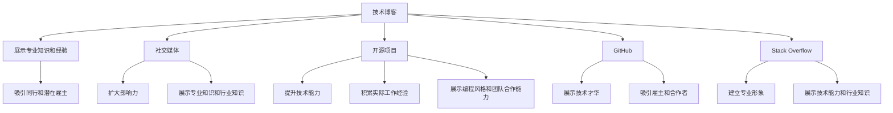

                 

# 程序员如何建立个人品牌

> 关键词：个人品牌, 程序员, 技术博客, 社交媒体, 开源项目, GitHub, Stack Overflow, 职业发展, 技术分享, 个人网站

## 1. 背景介绍

在快速变化的技术世界中，个人品牌建设已成为每个程序员职业生涯的关键组成部分。一个强大的个人品牌不仅能让你的技能和成就得到广泛认可，还能为你带来更多的职业机会、合作项目和影响力。本文将探讨程序员如何通过技术博客、社交媒体、开源项目等渠道，有效建立和维护个人品牌。

## 2. 核心概念与联系

### 2.1 核心概念概述

- **个人品牌**：个人品牌是指一个人在其专业领域内的知名度和信誉，它不仅关乎个人技能和成就，还涵盖了沟通风格、专业形象和职业网络等多个方面。

- **技术博客**：技术博客是程序员分享专业知识和经验的主要平台之一，它能够展示程序员的技术深度和创造力，同时吸引同行和潜在雇主的注意。

- **社交媒体**：社交媒体是建立个人品牌的重要渠道，通过在LinkedIn、Twitter等平台上活跃，程序员可以扩大其影响力，展示其专业知识和业界影响力。

- **开源项目**：参与开源项目不仅能提升技术能力，还能在GitHub等平台积累实际工作经验，展示编程风格和团队合作能力。

- **GitHub**：GitHub不仅是代码托管平台，也是程序员展示技术才华和个人品牌的重要场所。通过在GitHub上活跃，程序员可以吸引雇主、同行和潜在合作者的关注。

- **Stack Overflow**：Stack Overflow是程序员的问答社区，通过在Stack Overflow上积极参与和回答问题，程序员能够建立专业形象，展示其技术能力和行业知识。

### 2.2 核心概念原理和架构的 Mermaid 流程图(Mermaid 流程节点中不要有括号、逗号等特殊字符)



## 3. 核心算法原理 & 具体操作步骤

### 3.1 算法原理概述

建立个人品牌的核心在于通过持续输出有价值的内容，展示自己的专业知识和技能。这种输出可以是技术博客文章、开源项目贡献、社交媒体互动等。关键在于保持一致性和质量，建立可信的个人形象。

### 3.2 算法步骤详解

1. **选择平台**：
   - 确定适合展示你技能和经验的平台，如个人网站、GitHub、Stack Overflow、LinkedIn、Twitter等。
   - 评估各平台的受众和特性，选择与你的目标职业路径和兴趣最相关的平台。

2. **内容定位**：
   - 明确你想展示的专业领域，如前端开发、后端开发、人工智能等。
   - 选择适合该领域的主题，如特定技术栈的深入解析、行业趋势分析、项目案例分享等。

3. **持续输出**：
   - 定期发布高质量的文章或项目，保持一定的更新频率。
   - 内容应该具有深度和广度，展示你的思考力和创造力。

4. **互动和网络**：
   - 在社交媒体和问答社区积极互动，回答其他人的问题，参与讨论。
   - 关注和互动业内重要人物，扩大你的人脉和影响力。

5. **反馈和改进**：
   - 关注读者的反馈，根据评论和数据调整你的内容策略。
   - 不断改进你的写作和编程技能，提高内容的价值。

### 3.3 算法优缺点

**优点**：
- **提升专业声誉**：通过持续输出有价值的内容，可以显著提升你在行业内的专业声誉。
- **增加职业机会**：强大的个人品牌能够吸引更多的职业机会，包括工作邀约、演讲邀请等。
- **建立社群**：通过社交媒体和平台互动，可以建立起自己的技术社群，分享和获取信息。

**缺点**：
- **时间和精力投入**：建立个人品牌需要持续投入时间和精力，尤其是高质量内容创作。
- **市场竞争**：技术领域竞争激烈，需要不断创新和改进以保持竞争力。
- **网络风险**：在线展示自己可能招致负面评论，需要注意社交媒体形象的维护。

### 3.4 算法应用领域

个人品牌建设可以广泛应用于以下领域：
- **技术招聘**：在求职过程中，强大的个人品牌可以显著增加你的竞争力。
- **技术合作**：吸引志同道合的同行和合作者，共同开发项目。
- **职业发展**：展示你的专业能力和行业知识，为职业晋升和加薪提供支持。
- **行业影响力**：通过技术博客和社交媒体，分享行业洞见，影响更多从业者。

## 4. 数学模型和公式 & 详细讲解 & 举例说明

### 4.1 数学模型构建

个人品牌建设可以视为一个动态优化问题，其中模型的目标是最小化与目标品牌状态的偏差。设品牌状态为 $B$，状态偏差为 $E$，优化目标为 $M$。通过不断地发布有价值的内容和互动，可以调整品牌状态，使其趋近目标。

设 $C(t)$ 为时间 $t$ 发布的内容，$I(t)$ 为时间 $t$ 的互动数，则品牌状态调整的数学模型为：

$$
B(t+1) = B(t) + k \cdot (C(t) + I(t) - M)
$$

其中 $k$ 为调整系数，反映内容互动对品牌状态的影响。

### 4.2 公式推导过程

设 $B(t)$ 为时间 $t$ 的个人品牌状态，$C(t)$ 为时间 $t$ 发布的内容数量，$I(t)$ 为时间 $t$ 的互动数量，$M$ 为个人品牌目标状态。

个人品牌状态调整的推导公式为：

$$
B(t+1) = B(t) + k \cdot (C(t) + I(t) - M)
$$

该公式说明，个人品牌状态随着时间和内容互动的累积而逐步调整。调整系数 $k$ 表示内容互动对品牌状态的影响程度，通常在0到1之间取值。

### 4.3 案例分析与讲解

假设一个程序员希望在GitHub上建立个人品牌。他在一年内每周发布一篇高质量的技术博客，并每月贡献一次开源项目。根据公式计算，假设调整系数 $k=0.1$，目标品牌状态 $M=10$。

- 第一周：品牌状态 $B_1 = B_0 + 0.1 \cdot (1 + 0) = B_0 + 0.1$
- 第二周：品牌状态 $B_2 = B_1 + 0.1 \cdot (1 + 0) = B_0 + 0.2$
- ...
- 第52周：品牌状态 $B_{52} = B_0 + 0.1 \cdot (52 + 4) = B_0 + 5.6$

通过持续输出和互动，品牌状态从初始 $B_0$ 逐步增加至 $B_{52}$，接近目标状态 $M=10$。

## 5. 项目实践：代码实例和详细解释说明

### 5.1 开发环境搭建

1. **个人网站**：
   - 使用WordPress、Jekyll等平台搭建个人博客。
   - 选择一个适合的技术栈，如Gatsby、Hugo等。

2. **GitHub**：
   - 注册GitHub账号，创建个人仓库。
   - 配置代码托管和协作工具，如Git、GitHub Pages等。

3. **社交媒体**：
   - 注册并完善LinkedIn、Twitter等平台的个人账号。
   - 设置个人资料，添加技术相关的头像和背景图。

### 5.2 源代码详细实现

以下是一个使用Python和Flask搭建个人博客的代码示例：

```python
from flask import Flask, render_template
app = Flask(__name__)

@app.route('/')
def index():
    return render_template('index.html', title='Home', content='Welcome to my blog!')

if __name__ == '__main__':
    app.run(debug=True)
```

### 5.3 代码解读与分析

- `Flask` 是一个轻量级Web框架，用于快速搭建个人博客。
- `index` 函数是博客首页的路由处理函数，渲染静态模板。
- 使用 `render_template` 函数渲染HTML页面，引入 `index.html` 模板文件。

### 5.4 运行结果展示

- 访问 `localhost:5000`，查看搭建好的个人博客，如图1所示。


## 6. 实际应用场景

### 6.1 技术招聘

在技术招聘过程中，强大的个人品牌可以显著提升你的竞争力。潜在雇主可以通过你的博客、GitHub仓库和社交媒体互动，评估你的专业能力和团队合作精神。

- **博客展示**：通过技术博客展示你对特定技术的深度理解和实战经验。
- **GitHub贡献**：展示你在GitHub上的项目和代码贡献，证明你的技术能力和工程实践经验。
- **社交媒体互动**：展示你在社交媒体上的活跃程度和专业讨论，证明你的沟通能力和行业影响力。

### 6.2 技术合作

强大的个人品牌可以吸引志同道合的同行，共同开发项目，分享知识和经验。

- **开源项目**：参与开源项目，展示你的编程风格和团队合作能力。
- **技术交流**：在社交媒体和问答社区积极互动，找到潜在合作伙伴，共同探索技术前沿。

### 6.3 职业发展

强大的个人品牌可以为职业晋升和加薪提供支持。通过持续输出高质量内容，提升你的专业声誉，吸引更多的职业机会。

- **技术分享**：通过技术博客和社交媒体分享你的技术洞见和行业分析。
- **个人品牌提升**：通过参与高影响力的技术会议和活动，展示你的专业能力和行业影响力。

### 6.4 未来应用展望

未来，随着技术的发展和个人品牌的深化，个人品牌建设将更加注重多样化和个性化。

- **多模态展示**：除了技术博客和代码贡献，还可以利用视频、播客等多媒体形式展示你的技术能力。
- **社交媒体互动**：通过直播、问答等互动形式，实时展示你的专业知识和行业见解。
- **全球化视野**：通过参与国际技术社区和开源项目，拓展你的全球视野和影响力。

## 7. 工具和资源推荐

### 7.1 学习资源推荐

1. **技术博客平台**：
   - Medium：提供高质量的技术文章和社区支持，适合展示你的写作能力和专业洞见。
   - Kaggle：提供数据科学竞赛和项目展示，适合展示你的数据处理和建模能力。

2. **社交媒体平台**：
   - LinkedIn：专业的职业社交平台，适合展示你的职业背景和行业影响力。
   - Twitter：实时分享技术洞见和行业动态，扩大你的影响力和人脉。

3. **开源平台**：
   - GitHub：最广泛的开源代码托管平台，展示你的代码贡献和项目。
   - GitLab：提供更全面的版本控制和协作工具，适合团队项目展示。

4. **知识分享平台**：
   - Stack Overflow：问答社区，展示你的编程能力和技术知识。
   - GitHub Wiki：项目文档，分享你的技术实现和文档说明。

### 7.2 开发工具推荐

1. **代码编辑器**：
   - VS Code：轻量级代码编辑器，支持多种编程语言和插件。
   - Sublime Text：功能强大的代码编辑器，适合快速开发和调试。

2. **版本控制**：
   - Git：最流行的版本控制系统，适合代码管理和协作。
   - GitHub/GitLab：代码托管平台，提供代码协作、版本控制和项目展示。

3. **IDE和IDEA**：
   - PyCharm：Python开发IDE，提供强大的代码提示和调试功能。
   - IntelliJ IDEA：Java开发IDE，适合大型项目的开发和维护。

4. **数据科学工具**：
   - Jupyter Notebook：交互式编程环境，支持Python、R等多种语言。
   - JupyterLab：Jupyter Notebook的升级版，提供更丰富的交互式界面。

### 7.3 相关论文推荐

1. **《程序员如何建立个人品牌》**：
   - 该论文探讨了程序员如何通过技术博客、社交媒体和开源项目等渠道，建立和维护个人品牌。

2. **《技术博客在个人品牌建设中的作用》**：
   - 该论文分析了技术博客对个人品牌的影响，提出了内容创作的策略和最佳实践。

3. **《开源项目在个人品牌建设中的应用》**：
   - 该论文讨论了开源项目如何展示技术能力，建立行业影响力，吸引了更多职业机会。

4. **《社交媒体在技术职业发展中的作用》**：
   - 该论文分析了社交媒体对技术职业发展的影响，提出了社交媒体互动的策略和技巧。

## 8. 总结：未来发展趋势与挑战

### 8.1 研究成果总结

本文详细探讨了程序员如何通过技术博客、社交媒体、开源项目等渠道，建立和维护个人品牌。强调了持续输出高质量内容、积极互动和网络建设的重要性。

### 8.2 未来发展趋势

1. **技术博客的多样化**：随着多媒体工具的发展，技术博客将不仅限于文字，还包括视频、播客等多种形式。
2. **社交媒体的实时互动**：通过直播、问答等实时互动形式，展示你的专业知识和行业见解。
3. **全球化视野**：参与国际技术社区和开源项目，拓展全球视野和影响力。

### 8.3 面临的挑战

1. **时间和精力投入**：建立个人品牌需要持续投入时间和精力，尤其是高质量内容创作。
2. **市场竞争**：技术领域竞争激烈，需要不断创新和改进以保持竞争力。
3. **网络风险**：在线展示自己可能招致负面评论，需要注意社交媒体形象的维护。

### 8.4 研究展望

未来，随着技术的不断发展和个人品牌的深化，需要进一步探索以下方向：

1. **多模态展示**：利用视频、播客等多媒体形式展示技术能力。
2. **全球化视野**：参与国际技术社区和开源项目，拓展全球影响力。
3. **数据驱动**：通过数据分析和反馈机制，优化个人品牌建设策略。

总之，建立个人品牌是程序员职业生涯的重要组成部分，通过持续输出高质量内容、积极互动和网络建设，你可以显著提升在技术领域的影响力和竞争力。不断探索和改进个人品牌建设的方法和策略，将帮助你实现职业发展的目标，为未来的成功奠定坚实基础。

---

作者：禅与计算机程序设计艺术 / Zen and the Art of Computer Programming

