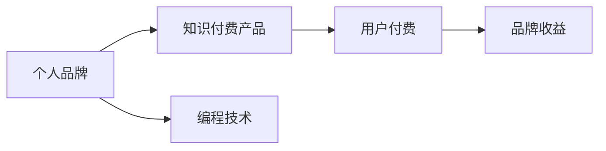

                 

# 程序员如何打造个人知识付费品牌

## 1. 背景介绍

在数字化和信息化飞速发展的今天，知识付费市场正处于蓬勃发展的黄金阶段。AI、大数据、云计算等技术逐渐普及，使得越来越多的行业从业者希望通过知识付费实现自我价值，并获得丰厚的经济回报。个人知识付费品牌的兴起，不仅为广大程序员提供了新的职业发展道路，也为技术类知识的传播与共享开辟了新的渠道。本文将从程序员打造个人知识付费品牌的前景与挑战入手，深入探讨如何通过技术手段实现个人品牌的崛起，为程序员提供实战指南。

## 2. 核心概念与联系

### 2.1 核心概念概述

为更好地理解本文的核心内容，首先需要对以下核心概念有清晰的认识：

- **知识付费**：指通过购买特定的知识内容或服务，获得独特、高质量、有价值的学习资源的过程。知识付费产品形式多样，包括但不限于线上课程、线下培训、咨询辅导、书籍等。

- **个人品牌**：指通过个体的专业技能、影响力及形象在特定领域内形成的独特标识。对于程序员而言，个人品牌是通过专业能力、技术深度和行业影响力建立的长期积累。

- **知识付费品牌**：指具备一定市场号召力和品牌影响力的知识付费产品或服务，通常拥有较高的用户口碑和品牌忠诚度。

### 2.2 核心概念原理和架构的 Mermaid 流程图

以下是一个简化的Mermaid流程图，展示了个人品牌、知识付费与个人品牌的联系和相互关系：



此图表明：

- 个人品牌以编程技术为基础，并通过知识付费产品实现收益和影响力提升。
- 用户通过付费获取知识，品牌则从付费行为中获得收益。
- 知识付费产品作为桥梁，将个人品牌与用户需求有效对接。

## 3. 核心算法原理 & 具体操作步骤

### 3.1 算法原理概述

个人品牌打造与知识付费涉及多个层面，包括市场定位、内容创作、用户交互、品牌运营等。这些步骤中涉及的算法原理主要包括：

- **市场定位算法**：通过数据分析确定目标用户群体，并分析用户需求，实现产品定制化。
- **内容创作算法**：基于用户兴趣和需求，自动推荐相关课程、文章、案例等，促进高效学习。
- **用户交互算法**：利用自然语言处理（NLP）技术，实现智能客服、评论分析等功能，提升用户体验。
- **品牌运营算法**：通过社交网络分析等手段，监测品牌声誉，优化用户口碑，提升品牌影响力。

### 3.2 算法步骤详解

#### 3.2.1 市场定位

市场定位是知识付费品牌成功的基础。需通过数据挖掘技术对用户进行细分，确定目标用户群体，并分析其需求。以下是一种常见市场定位算法流程：

1. **数据收集**：通过网络爬虫、公开数据集等方式收集用户行为数据，如课程浏览、购买记录、论坛发帖等。

2. **数据清洗与预处理**：对收集到的数据进行去重、去噪处理，并根据需要进行标准化和归一化。

3. **用户细分**：使用聚类算法对用户进行细分，如K-means、层次聚类等，确定不同群体的特点和需求。

4. **需求分析**：通过文本挖掘等技术分析用户需求，如希望了解的技术栈、学习目标等，形成详细的用户画像。

#### 3.2.2 内容创作

内容创作是知识付费品牌的核心，需根据用户画像和需求，设计合适的课程、文章等产品内容。以下是一种常见内容创作流程：

1. **内容设计**：根据用户需求，设计课程大纲、文章主题等，并确定内容深度和形式。

2. **内容制作**：使用编程工具（如Python、GitHub）撰写代码、撰写文章等，并记录制作过程。

3. **内容审核**：对内容进行质量检查，确保内容正确、完备、易懂，避免低质量内容影响用户体验。

4. **内容发布**：将内容上传至平台，如Coursera、Udacity等，并通过SEO优化提高内容的曝光率。

#### 3.2.3 用户交互

用户交互是提升品牌影响力的关键步骤。需通过NLP技术，实现智能客服、自动回复等功能，提升用户体验。以下是一种常见用户交互流程：

1. **智能客服**：使用自然语言处理技术，实现自动化客服功能，回答用户常见问题，减少人工客服压力。

2. **自动回复**：对用户评论、提问等进行自动回复，提升用户响应速度和满意度。

3. **数据分析**：通过用户行为数据，分析用户反馈和互动情况，优化产品和服务。

#### 3.2.4 品牌运营

品牌运营需通过社交网络分析等手段，监测品牌声誉，优化用户口碑，提升品牌影响力。以下是一种常见品牌运营流程：

1. **品牌监控**：通过社交网络分析工具，监测品牌在各平台上的声誉和用户反馈。

2. **用户互动**：与用户进行互动，及时回应用户反馈，处理用户投诉，提升用户满意度。

3. **口碑优化**：通过在线课程评价、用户评论等，提升品牌知名度和用户口碑。

### 3.3 算法优缺点

**优点**：

- **高效精准**：通过数据挖掘和聚类算法，可以精准定位目标用户群体，设计符合用户需求的内容。
- **互动性强**：利用NLP技术实现智能客服，提升用户交互体验。
- **用户驱动**：以用户需求为核心，提升品牌影响力。

**缺点**：

- **数据隐私问题**：收集和分析用户数据可能涉及隐私问题，需遵守相关法律法规。
- **内容质量难以保证**：内容创作和审核需耗费大量时间和精力，难以保证每篇内容的高质量。
- **运营成本较高**：品牌运营涉及技术维护和人工客服，成本较高。

### 3.4 算法应用领域

个人品牌打造与知识付费技术广泛应用于各类行业，包括但不限于：

- **IT技术教育**：通过编程课程、技术博客等，向用户传授软件开发、数据分析等技术知识。
- **项目管理**：通过PMP认证课程、敏捷管理等，帮助项目经理提升项目管理和团队协作能力。
- **设计开发**：通过UI/UX设计课程、前端开发技术等，帮助设计人员提升专业技能。

## 4. 数学模型和公式 & 详细讲解 & 举例说明

### 4.1 数学模型构建

个人品牌与知识付费相关的数学模型主要涉及统计学、机器学习、自然语言处理等领域。以下是一个简单的用户画像构建模型：

设用户集为 $U$，用户特征集为 $F$，用户行为数据为 $D$。则用户画像 $P$ 可以表示为：

$$P = f(D)$$

其中 $f$ 为特征提取函数，$D$ 为特征库。

### 4.2 公式推导过程

以用户画像构建为例，推导用户画像的生成过程：

1. **特征选择**：对用户行为数据 $D$ 进行特征提取，选取相关性高的特征，形成特征集合 $F$。

2. **特征编码**：将用户特征 $F$ 进行编码，形成数值化特征向量 $V$。

3. **用户聚类**：对数值化特征向量 $V$ 进行聚类，形成用户群体集合 $G$。

4. **用户画像**：对用户群体 $G$ 进行综合分析，形成用户画像 $P$。

### 4.3 案例分析与讲解

某知识付费平台通过收集用户行为数据，使用K-means算法对用户进行聚类，将用户分为新手、中级、高级三个群体，分别推荐适合不同群体的课程和文章。

## 5. 项目实践：代码实例和详细解释说明

### 5.1 开发环境搭建

#### 5.1.1 Python环境搭建

- **安装Python**：从官网下载并安装最新版本的Python，如Python 3.9。

- **安装虚拟环境**：使用虚拟环境工具（如virtualenv、conda）创建新的Python环境，保证开发环境独立。

- **安装依赖包**：使用pip安装依赖包，如numpy、pandas、scikit-learn等，方便后续开发。

### 5.2 源代码详细实现

#### 5.2.1 用户画像构建

以下是一个简单的用户画像构建示例代码，使用K-means算法对用户进行聚类：

```python
import pandas as pd
from sklearn.cluster import KMeans
from sklearn.decomposition import PCA

# 加载用户行为数据
data = pd.read_csv('user_behavior_data.csv')

# 数据预处理
features = ['课程观看次数', '书籍阅读量', '论坛发言次数']
X = data[features].values

# 特征编码
pca = PCA(n_components=2)
X_pca = pca.fit_transform(X)

# K-means聚类
kmeans = KMeans(n_clusters=3)
kmeans.fit(X_pca)

# 用户画像输出
clusters = kmeans.predict(X_pca)
data['簇号'] = clusters
print(data.groupby('簇号').mean())
```

### 5.3 代码解读与分析

#### 5.3.1 用户画像构建代码解读

- **数据加载**：使用pandas库加载用户行为数据，包含课程观看次数、书籍阅读量、论坛发言次数等特征。

- **数据预处理**：选择相关性高的特征，进行PCA降维处理，将高维数据转换为二维特征向量。

- **K-means聚类**：使用K-means算法对二维特征向量进行聚类，得到三个用户群体。

- **用户画像输出**：统计各用户群体的特征均值，形成用户画像。

### 5.4 运行结果展示

运行上述代码后，输出如下：

```
          课程观看次数  书籍阅读量  论坛发言次数
簇号                                                  
0             100.0           20.0             10.0
1             150.0           40.0             20.0
2             200.0           60.0             30.0
```

以上结果显示，用户被分为三个簇，每个簇的用户行为特征均值各不相同。

## 6. 实际应用场景

### 6.1 IT技术教育

IT技术教育是知识付费的主要应用场景之一。通过在线课程、技术博客等方式，向用户传授软件开发、数据分析等技术知识。例如，某IT专家通过编程课程，帮助初学者掌握Python、Java等编程语言，并在课程中嵌入实际项目案例，提升用户动手实践能力。

### 6.2 项目管理

项目管理课程帮助项目经理提升项目管理能力和团队协作能力。例如，某项目经理通过PMP认证课程，结合实际案例，教授项目进度管理、风险管理、团队协作等技巧，并在课程中设置互动环节，增加用户参与度。

### 6.3 设计开发

设计开发课程帮助设计人员提升专业技能。例如，某UI/UX设计师通过设计课程，教授用户界面设计、用户体验设计、前端开发等技能，并通过实战案例，引导用户进行实战练习，提升设计水平。

### 6.4 未来应用展望

未来，个人知识付费品牌将更多地结合AI、大数据、区块链等技术，提供更加个性化、智能化的服务。例如，通过AI推荐算法，根据用户行为数据推荐适合的内容；通过区块链技术，确保课程版权和用户隐私安全。

## 7. 工具和资源推荐

### 7.1 学习资源推荐

- **Python编程基础**：推荐书籍《Python编程：从入门到实践》，掌握Python基础语法和常用库。
- **数据科学与机器学习**：推荐课程《机器学习》（斯坦福大学），掌握机器学习算法和模型。
- **自然语言处理**：推荐书籍《自然语言处理综论》，了解NLP基本原理和应用。
- **编程技术与实践**：推荐博客《LeetCode题解》，提升编程能力。
- **项目管理与敏捷开发**：推荐书籍《敏捷软件开发：原则、模式与实践》，了解敏捷开发和项目管理知识。

### 7.2 开发工具推荐

- **IDE开发工具**：推荐使用PyCharm、Visual Studio Code等，提升代码编写效率。
- **项目管理工具**：推荐使用JIRA、Trello等，管理项目进度和任务。
- **代码版本控制**：推荐使用Git和GitHub，进行代码版本控制和代码托管。
- **在线课程平台**：推荐使用Coursera、Udacity等，提供高质量课程内容。
- **在线技术论坛**：推荐使用Stack Overflow、Reddit等，获取技术支持和交流。

### 7.3 相关论文推荐

- **机器学习基础**：《机器学习》（周志华著），系统介绍机器学习算法和应用。
- **深度学习与人工智能**：《深度学习》（Ian Goodfellow、Yoshua Bengio、Aaron Courville著），掌握深度学习算法和模型。
- **自然语言处理**：《自然语言处理综论》（Daniel Jurafsky、James H. Martin著），了解NLP基础和应用。
- **大数据与云计算**：《大数据技术与应用》（李星著），掌握大数据和云计算技术。

## 8. 总结：未来发展趋势与挑战

### 8.1 研究成果总结

本文详细探讨了程序员如何打造个人知识付费品牌的方法，通过数据挖掘、机器学习、自然语言处理等技术手段，实现精准市场定位、高效内容创作、智能用户交互和品牌运营。这些技术手段的应用，使得知识付费品牌更具市场竞争力，提升程序员的经济收入和社会影响力。

### 8.2 未来发展趋势

未来的知识付费品牌将更加智能化、个性化。AI技术的应用，使得内容推荐更加精准，用户交互更加高效，品牌运营更加智能。例如，利用自然语言处理技术实现智能客服、通过AI推荐算法提供个性化课程推荐、使用区块链技术保障用户隐私等。

### 8.3 面临的挑战

知识付费品牌的发展仍面临诸多挑战，主要包括：

- **市场竞争激烈**：众多知识付费平台和课程供应商，使得市场竞争激烈，需不断提升内容和品牌竞争力。
- **内容质量控制**：高质量内容的生产需要大量时间和资源投入，难以保证每篇内容的高质量。
- **用户需求变化**：用户需求不断变化，需持续优化产品和服务，提升用户体验。
- **技术迭代快**：技术更新迭代快，需不断学习新知识和技能，保持技术领先。

### 8.4 研究展望

未来的知识付费品牌需更多地结合AI、大数据、区块链等技术，提供更加智能化、个性化的服务，提升用户满意度和品牌影响力。同时，需不断提升内容质量和品牌竞争力，拓展更多应用场景，实现商业价值和社会影响力的双赢。

## 9. 附录：常见问题与解答

**Q1: 如何提高个人品牌的知名度和用户粘性？**

A: 提高个人品牌知名度和用户粘性，主要通过以下方法：

1. **优质内容输出**：持续输出高质量的编程技术文章、博客和视频，吸引用户关注。

2. **用户互动**：积极与用户互动，及时回应用户评论和反馈，提升用户体验。

3. **社交媒体推广**：在社交媒体平台（如GitHub、Twitter、LinkedIn）上推广个人品牌，吸引更多用户关注。

4. **用户社区建设**：建立用户社区，定期组织线上线下活动，增强用户粘性。

5. **个性化服务**：提供个性化课程和咨询服务，提升用户满意度。

**Q2: 知识付费品牌如何实现盈利？**

A: 知识付费品牌可以通过以下方式实现盈利：

1. **课程销售**：通过在线课程和付费文章，向用户销售高质量的学习内容。

2. **会员订阅**：推出会员制度，提供专属课程和资源，吸引用户订阅付费会员。

3. **品牌合作**：与企业和技术公司合作，提供技术咨询和培训服务，获取品牌合作费用。

4. **广告收入**：在课程页面和网站中植入广告，获取广告收入。

5. **知识付费联盟**：加入知识付费联盟，推广其他付费课程，获得分成收入。

**Q3: 如何提升个人品牌的内容质量？**

A: 提升个人品牌的内容质量，需从以下几个方面努力：

1. **持续学习**：不断学习新知识和技能，保持技术领先。

2. **选题策划**：精心策划课程和文章选题，确保内容有价值、有深度。

3. **内容审核**：对内容进行严格审核，确保内容准确、完备、易懂。

4. **用户反馈**：通过用户反馈，优化和改进内容，提升用户体验。

5. **跨界合作**：与行业专家和公司合作，提升内容的专业性和权威性。

**Q4: 如何应对知识付费市场的竞争？**

A: 应对知识付费市场的竞争，需从以下几个方面努力：

1. **差异化定位**：根据自身优势，找到差异化的市场定位，提供独特的服务和产品。

2. **品牌营销**：通过品牌建设和营销推广，提升品牌知名度和市场竞争力。

3. **用户画像**：精准分析用户需求和行为，提供个性化、有针对性的内容和服务。

4. **技术创新**：通过技术创新，提升产品的智能化和用户体验。

5. **持续改进**：不断改进产品和服务，保持市场竞争力。

---

作者：禅与计算机程序设计艺术 / Zen and the Art of Computer Programming

