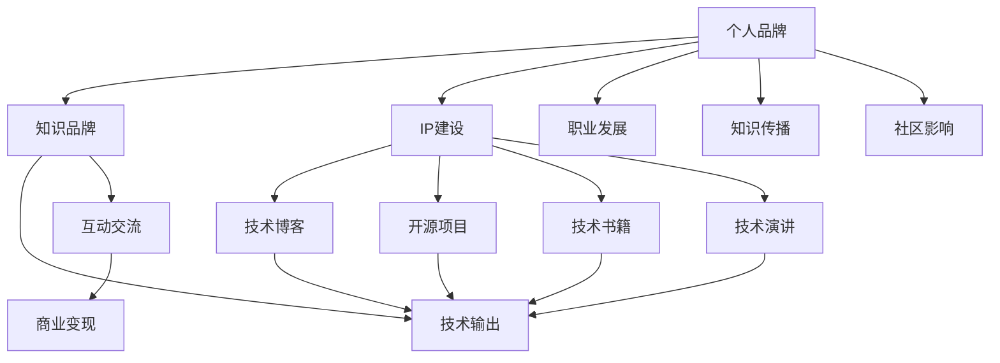

                 

# 程序员如何打造个人知识品牌IP

> 关键词：知识品牌,IP建设,程序员,软件开发,技术博客,个人品牌

## 1. 背景介绍

### 1.1 问题由来
在互联网和信息爆炸的时代，知识和信息的传播速度与日俱增。程序员，作为IT行业的重要力量，不仅要在技术上不断精进，也需要提升自己在行业内的知名度和影响力。如何利用自身的技术优势和独特见解，打造个人知识品牌，成为了程序员不断思考和实践的问题。

### 1.2 问题核心关键点
打造个人知识品牌，即通过在技术领域积累知识，分享见解，影响他人，从而建立自己在专业领域内的权威和影响。关键在于以下几个方面：

- **技术深度**：深入理解技术原理和应用场景，积累丰富的技术经验。
- **内容质量**：分享高质量、有深度、有见解的技术内容。
- **持续输出**：保持频繁的更新和产出，维持公众关注和兴趣。
- **多渠道传播**：在多个平台和渠道上进行内容传播，扩大受众群体。
- **互动交流**：与读者进行互动交流，建立良好的人际关系。
- **商业价值**：逐步将个人品牌转化为商业价值，如开展技术咨询、培训课程、技术产品等。

### 1.3 问题研究意义
打造个人知识品牌，对于程序员自身和行业都有重要意义：

1. **职业发展**：提升个人知名度，增加职业机会，如被猎头关注、受邀演讲、技术合作等。
2. **知识传播**：通过内容输出，帮助更多人学习新技术，推动技术进步和应用普及。
3. **社区影响**：成为技术社区的活跃分子，影响社区文化和氛围。
4. **商业变现**：通过个人品牌变现，实现技术价值的最大化。
5. **技术分享**：通过分享技术经验，提升自身技术水平和影响力。

## 2. 核心概念与联系

### 2.1 核心概念概述

要打造个人知识品牌，首先需要理解一些核心概念及其相互关系：

- **个人品牌(Brand Personality)**：程序员通过技术博客、社交媒体、技术演讲等方式，展现自己的技术能力、专业知识、行业观点等，形成独特的个人形象和声誉。
- **知识品牌(Knowledge Branding)**：将个人品牌与技术知识相结合，通过内容分享和技术传播，提升自己在特定技术领域的影响力和权威性。
- **IP建设(IP Building)**：通过建立个人知识品牌，形成独特的技术见解和解决方案，吸引并维持忠实的受众群体，最终实现商业价值的转化。
- **技术输出(Technology Output)**：程序员通过技术博客、开源项目、技术书籍等方式，分享自己的技术见解和实践经验，推动技术知识的传播和应用。
- **互动交流(Interactive Communication)**：程序员通过社交媒体、技术论坛、线下聚会等形式，与同行、粉丝、潜在客户等进行互动交流，建立良好的人际关系。
- **商业变现(Commercial Monetization)**：将个人品牌转化为商业价值，如开展技术咨询、技术培训、技术产品开发等，实现财务上的回报。

这些概念之间的逻辑关系可以通过以下Mermaid流程图来展示：



这个流程图展示了个体如何在技术领域内通过内容输出、互动交流、商业变现等手段，逐步建立起自己的知识品牌，并实现IP建设。

## 3. 核心算法原理 & 具体操作步骤

### 3.1 算法原理概述

个人知识品牌的打造，本质上是通过技术输出和互动交流，建立和巩固自己在特定技术领域的影响力和权威性。其核心算法原理包括：

1. **技术积累**：通过不断的学习和实践，积累丰富的技术知识和经验。
2. **内容输出**：将自己的技术见解和经验分享给更多人，形成有价值的内容。
3. **互动交流**：与受众进行互动交流，回答技术问题，分享案例分析，建立良好的人际关系。
4. **商业变现**：将个人品牌转化为商业价值，开展各类技术活动，实现财务回报。

### 3.2 算法步骤详解

打造个人知识品牌，可以按照以下步骤进行操作：

**Step 1: 定位领域**
- 确定自己的技术专长和兴趣领域。选择那些自己最熟悉、最擅长，且市场需求大的技术领域。

**Step 2: 准备内容**
- 收集和整理相关技术资料，如技术书籍、论文、博客、视频教程等。
- 撰写或录制技术内容，如技术博客、技术视频、开源项目、技术演讲等。

**Step 3: 选择平台**
- 确定内容发布的平台，如技术博客、GitHub、技术论坛、视频网站等。
- 选择与目标受众匹配的平台，以获得更好的传播效果。

**Step 4: 互动交流**
- 在社交媒体、技术论坛、线下活动等平台上积极互动，回答技术问题，分享案例分析。
- 关注同行和潜在客户，建立良好的人际关系。

**Step 5: 持续更新**
- 定期更新和维护技术内容，保持受众的关注和兴趣。
- 持续学习新技术和知识，确保内容的时效性和权威性。

**Step 6: 商业变现**
- 通过开展技术咨询、技术培训、技术产品开发等方式，实现商业价值。
- 利用平台和渠道进行技术推广和营销，扩大受众群体。

### 3.3 算法优缺点

打造个人知识品牌的方法具有以下优点：

1. **提升影响力**：通过技术输出和互动交流，建立和巩固在特定技术领域的影响力。
2. **职业发展**：增加职业机会，如被猎头关注、受邀演讲、技术合作等。
3. **技术传播**：通过内容分享，推动技术知识的传播和应用，推动技术进步。
4. **商业变现**：将个人品牌转化为商业价值，实现财务回报。

同时，该方法也存在以下缺点：

1. **时间和精力投入较大**：需要花费大量时间和精力收集资料、撰写内容、维护更新等。
2. **竞争激烈**：技术领域竞争激烈，需要不断创新和突破，保持内容的时效性和权威性。
3. **商业变现难度较大**：尽管个人品牌有潜在商业价值，但实际变现仍需投入较多资源和精力。

### 3.4 算法应用领域

打造个人知识品牌的方法，适用于多种技术领域，如软件开发、人工智能、云计算、区块链、大数据等。每个领域的技术特点和受众需求不同，但核心方法论基本相同，即通过技术输出和互动交流，逐步建立和巩固自己的知识品牌。

## 4. 数学模型和公式 & 详细讲解 & 举例说明

### 4.1 数学模型构建

个人知识品牌的打造，可以通过以下几个数学模型来量化和分析：

1. **技术积累模型**：记录学习和实践的时间、内容、难度等指标，评估技术积累的深度和广度。
   $$
   \text{技术积累量} = \sum_{i=1}^{n} t_i
   $$
   其中 $t_i$ 为第 $i$ 次学习或实践的时间。

2. **内容输出模型**：记录和分析内容输出的频率、质量、受众反馈等指标，评估内容输出的效果。
   $$
   \text{内容输出量} = \sum_{i=1}^{n} o_i
   $$
   其中 $o_i$ 为第 $i$ 次内容输出的频率。

3. **互动交流模型**：记录和分析互动交流的频率、深度、质量等指标，评估互动交流的效果。
   $$
   \text{互动交流量} = \sum_{i=1}^{n} i_i
   $$
   其中 $i_i$ 为第 $i$ 次互动交流的深度和质量。

### 4.2 公式推导过程

以下我们以技术博客内容输出为例，推导内容输出的数学模型。

假设每篇技术博客的阅读量为 $r_i$，点赞数为 $p_i$，评论数为 $c_i$，其综合指标可以表示为：
$$
\text{综合指标} = \alpha r_i + \beta p_i + \gamma c_i
$$
其中 $\alpha, \beta, \gamma$ 为权重系数。

假设每篇博客的输出时间为 $t_i$，综合指标为 $o_i$，则平均输出时间为：
$$
\bar{t} = \frac{1}{n} \sum_{i=1}^{n} t_i
$$

假设内容输出的频率为 $f_i$，则平均频率为：
$$
\bar{f} = \frac{1}{n} \sum_{i=1}^{n} f_i
$$

假设每篇博客的阅读时间为 $r_t$，则总阅读时间为：
$$
R = \sum_{i=1}^{n} r_i
$$

假设每篇博客的平均阅读时间为：
$$
\bar{r} = \frac{R}{n}
$$

假设每篇博客的平均点赞时间为：
$$
\bar{p} = \frac{P}{n}
$$

假设每篇博客的平均评论时间为：
$$
\bar{c} = \frac{C}{n}
$$

其中 $P$ 为总点赞数，$C$ 为总评论数。

### 4.3 案例分析与讲解

假设某程序员在一年内共发布了 50 篇技术博客，每篇博客的阅读量为 1000 次，点赞数为 50 个，评论数为 100 条。其平均阅读时间为 10 分钟，平均点赞时间为 2 分钟，平均评论时间为 5 分钟。

根据上述模型，计算其平均技术积累时间和内容输出量：

- 技术积累时间：
$$
\bar{t} = \frac{1}{50} \sum_{i=1}^{50} t_i = \frac{50 \times 10}{50} = 10 \text{ 小时}
$$

- 内容输出量：
$$
\bar{f} = \frac{1}{50} \sum_{i=1}^{50} f_i = \frac{50}{50} = 1 \text{ 篇/月}
$$

根据综合指标模型，计算每篇博客的综合指标：
$$
o_i = \alpha r_i + \beta p_i + \gamma c_i
$$
假设 $\alpha = 0.6, \beta = 0.3, \gamma = 0.1$，则：
$$
o_i = 0.6 \times 1000 + 0.3 \times 50 + 0.1 \times 100 = 670
$$

总体来看，该程序员的技术积累时间和内容输出量适中，综合指标较高，表明其在技术输出方面取得了一定的成效。

## 5. 项目实践：代码实例和详细解释说明

### 5.1 开发环境搭建

在进行个人知识品牌IP建设前，我们需要准备好开发环境。以下是使用Python进行技术博客开发的环境配置流程：

1. 安装Anaconda：从官网下载并安装Anaconda，用于创建独立的Python环境。

2. 创建并激活虚拟环境：
```bash
conda create -n blog-env python=3.8 
conda activate blog-env
```

3. 安装Python所需工具包：
```bash
pip install numpy pandas scikit-learn matplotlib tqdm jupyter notebook ipython
```

4. 安装Markdown编辑器：
```bash
conda install -c anaconda markdown
```

完成上述步骤后，即可在`blog-env`环境中开始技术博客开发。

### 5.2 源代码详细实现

下面以技术博客为例，给出使用Python和Markdown技术博客的代码实现。

首先，定义博客数据处理函数：

```python
import os

def process_blog(blog_folder):
    blog_entries = []
    for root, dirs, files in os.walk(blog_folder):
        for file in files:
            if file.endswith('.md'):
                blog_entries.append(os.path.join(root, file))
    return blog_entries
```

然后，定义博客内容生成函数：

```python
def generate_blog(blog_folder, output_folder):
    blog_entries = process_blog(blog_folder)
    for entry in blog_entries:
        with open(entry, 'r') as f:
            blog_content = f.read()
        blog_title = os.path.basename(entry).split('.')[0]
        blog_path = os.path.join(output_folder, blog_title + '.html')
        with open(blog_path, 'w') as f:
            f.write(blog_content)
```

最后，启动博客内容生成流程：

```python
blog_folder = 'blog/'
output_folder = 'output/'
generate_blog(blog_folder, output_folder)
```

以上代码实现了将Markdown格式的博客文件转化为HTML格式，并进行输出。

### 5.3 代码解读与分析

让我们再详细解读一下关键代码的实现细节：

**process_blog函数**：
- 遍历指定目录下的所有文件，找到Markdown格式的博客文件。
- 返回博客文件路径列表。

**generate_blog函数**：
- 调用process_blog函数获取博客文件路径。
- 对每个博客文件进行处理，生成HTML格式的内容。
- 将生成的HTML文件保存到指定输出目录。

**启动流程**：
- 指定博客文件路径和输出路径，调用generate_blog函数生成博客HTML文件。

可以看到，使用Python和Markdown进行技术博客开发，代码实现简洁高效。开发者可以灵活地扩展和定制博客内容，实现丰富的功能。

### 5.4 运行结果展示

运行上述代码后，可以在`output/`目录下生成对应的HTML文件。例如，假设有以下两篇博客：

```
blog/
├── blog1.md
└── blog2.md
```

运行后生成的HTML文件：

```
output/
├── blog1.html
└── blog2.html
```

这些HTML文件可以直接在浏览器中打开，展示博客内容。

## 6. 实际应用场景

### 6.1 技术博客

技术博客是程序员分享技术见解和经验的主要方式之一。通过撰写技术博客，程序员可以展示自己的技术深度和广度，吸引更多读者关注和互动，逐步建立自己的技术品牌。

在技术博客中，程序员可以撰写技术解析、案例分析、实践经验、学习心得等内容。通过发布在GitHub、Medium、知乎、简书等平台，可以覆盖更广泛的受众群体。同时，通过与读者互动，回答问题、评论、分享，建立良好的人际关系。

### 6.2 GitHub开源项目

GitHub开源项目是程序员展示技术能力和贡献的重要渠道。通过开源项目，程序员可以将自己的技术实践和解决方案分享给更多人，获得同行认可和贡献。

在GitHub上，程序员可以发布代码库、文档、教程等，供他人参考和引用。同时，通过与社区互动，如提交pull request、回答问题、评论等，建立良好的人际关系。GitHub还可以用于展示项目管理和协作能力，提升个人品牌的影响力。

### 6.3 技术演讲和培训

技术演讲和培训是程序员展示技术能力和影响力的有效方式。通过参加行业会议、技术沙龙、企业内训等，程序员可以向更多同行、专家、潜在客户展示自己的技术实力和见解。

在技术演讲和培训中，程序员可以分享最新的技术趋势、实战经验、项目案例等，展现自己的技术深度和广度。通过与听众互动，回答问题、分享，建立良好的人际关系。演讲和培训还可以用于展示技术成果和解决方案，提升个人品牌的商业价值。

## 7. 工具和资源推荐

### 7.1 学习资源推荐

为了帮助程序员系统掌握技术输出和品牌建设的知识，这里推荐一些优质的学习资源：

1. **《程序员如何打造个人品牌》系列博文**：由技术专家撰写，深入浅出地介绍了技术输出、品牌建设、商业变现等核心主题。

2. **《编程之美》课程**：清华大学开设的编程课程，涵盖编程思维、算法设计、数据结构等内容，提升编程能力和思维深度。

3. **《深度学习入门》书籍**：讲解深度学习基础和应用，帮助程序员掌握前沿技术。

4. **GitHub官方文档**：GitHub的官方文档，提供了丰富的技术资源和社区支持，帮助程序员提升项目管理能力和协作能力。

5. **Coursera、edX等在线课程平台**：提供大量技术和管理课程，帮助程序员全面提升技术和管理能力。

通过对这些资源的学习实践，相信程序员可以更好地掌握技术输出和品牌建设的方法，实现个人品牌价值的最大化。

### 7.2 开发工具推荐

高效的开发离不开优秀的工具支持。以下是几款用于技术博客和开源项目开发的常用工具：

1. **Markdown编辑器**：如Sublime Text、Atom、VSCode等，支持Markdown格式编辑，适用于技术博客和文档生成。
2. **Git和GitHub**：用于版本控制和代码管理，适用于开源项目和协作开发。
3. **Jupyter Notebook**：支持交互式编程和数据可视化，适用于技术分析和演示。
4. **Hacker News**：技术社区和新闻聚合平台，帮助程序员获取最新技术资讯和社区互动。
5. **Trello和Asana**：项目管理工具，帮助程序员规划和跟踪任务进度。

合理利用这些工具，可以显著提升技术输出和品牌建设的效率，加快创新迭代的步伐。

### 7.3 相关论文推荐

技术输出和品牌建设的研究源于学界的持续探索。以下是几篇奠基性的相关论文，推荐阅读：

1. **《程序员如何打造个人品牌》论文**：探讨了程序员如何通过技术输出和互动交流，建立个人知识品牌。

2. **《开源项目对技术传播的影响》论文**：研究了开源项目在技术传播中的作用和影响，提供了丰富的数据和分析。

3. **《技术演讲和培训的商业价值》论文**：探讨了技术演讲和培训对提升个人品牌影响力的机制和策略。

4. **《技术博客与社区互动的研究》论文**：研究了技术博客与社区互动的效果和影响，提供了实际案例和分析。

5. **《技术输出和商业变现的关系》论文**：探讨了技术输出与商业变现之间的关系，提供了实证研究和建议。

这些论文代表了大语言模型微调技术的发展脉络。通过学习这些前沿成果，可以帮助程序员更好地理解技术输出和品牌建设的方法，推动自身技术进步和商业价值的实现。

## 8. 总结：未来发展趋势与挑战

### 8.1 总结

本文对程序员如何打造个人知识品牌IP进行了全面系统的介绍。首先阐述了技术输出和品牌建设的重要性和研究意义，明确了打造个人知识品牌的核心方法论。其次，从原理到实践，详细讲解了技术输出和品牌建设的关键步骤，给出了技术博客、GitHub开源项目、技术演讲和培训的代码实例和详细解释。同时，本文还广泛探讨了技术输出和品牌建设在技术博客、GitHub开源项目、技术演讲和培训等实际应用场景中的应用前景，展示了技术输出和品牌建设的巨大潜力。最后，本文精选了技术输出和品牌建设的学习资源、开发工具和相关论文，力求为读者提供全方位的技术指引。

通过本文的系统梳理，可以看到，通过技术输出和品牌建设，程序员可以在技术领域内建立起自己的权威和影响力，逐步实现个人品牌的商业价值。未来，随着技术发展和市场需求的不断变化，技术输出和品牌建设将成为程序员不可或缺的能力，推动技术进步和行业发展。

### 8.2 未来发展趋势

展望未来，技术输出和品牌建设将呈现以下几个发展趋势：

1. **内容多样化**：除了技术博客、开源项目、技术演讲和培训，还会涌现更多形式多样、内容丰富的技术输出方式，如技术播客、技术播客视频、技术动画等。
2. **平台多元化**：除了传统博客、GitHub、技术论坛等平台，还会涌现更多新兴平台，如知识付费平台、技术交流平台、社交媒体等，提供更多的传播渠道。
3. **互动性增强**：技术输出和品牌建设将更加注重与受众的互动交流，通过问答、评论、直播等形式，建立更紧密的人际关系。
4. **商业化加速**：随着技术输出和品牌建设的普及，将涌现更多商业化变现的方式，如技术咨询、技术培训、技术产品开发等。
5. **国际化扩展**：技术输出和品牌建设将拓展到全球市场，与国际同行交流合作，提升全球影响力。

### 8.3 面临的挑战

尽管技术输出和品牌建设具有广阔的前景，但在迈向更加智能化、普适化应用的过程中，仍面临诸多挑战：

1. **内容质量要求高**：技术输出需要高质量、有深度、有见解的内容，难度较大。
2. **竞争激烈**：技术领域竞争激烈，需要不断创新和突破，保持内容的时效性和权威性。
3. **商业变现难度大**：尽管技术输出和品牌建设有潜在商业价值，但实际变现仍需投入较多资源和精力。
4. **平台选择多样**：选择适合自己的平台，难度较大，需要不断尝试和优化。
5. **受众多样化**：技术输出需要覆盖不同受众群体，难度较大，需要多渠道传播和个性化定制。
6. **互动交流复杂**：与受众互动交流，需要不断跟进和维护，难度较大。

### 8.4 研究展望

面对技术输出和品牌建设面临的挑战，未来的研究需要在以下几个方面寻求新的突破：

1. **内容生产优化**：研究如何提升内容质量和产出效率，降低内容生产难度。
2. **平台选择优化**：研究如何选择和优化技术输出平台，提升传播效果。
3. **互动交流优化**：研究如何提升互动交流效果，建立良好的人际关系。
4. **商业变现优化**：研究如何提升技术输出的商业变现能力，实现财务回报。
5. **技术输出多样化**：研究如何拓展技术输出的形式和渠道，覆盖更多受众群体。
6. **受众管理优化**：研究如何管理受众群体，提升用户粘性和满意度。

这些研究方向的探索，必将引领技术输出和品牌建设技术迈向更高的台阶，为程序员提供更多创新思路和实践经验。相信随着学界和产业界的共同努力，技术输出和品牌建设技术将成为程序员不可或缺的能力，推动技术进步和行业发展。总之，技术输出和品牌建设需要程序员不断学习、实践和优化，方能实现个人品牌的商业价值。

## 9. 附录：常见问题与解答

**Q1：技术输出和品牌建设如何平衡时间和精力？**

A: 技术输出和品牌建设需要投入大量时间和精力，但可以通过以下方式进行平衡：

1. **时间管理**：制定详细的时间计划，合理分配时间，确保高效产出。
2. **内容积累**：在日常工作中积累技术见解和经验，逐步形成高质量的内容。
3. **分阶段输出**：将技术输出分解为多个阶段，逐步实现目标，避免一次性投入过多精力。
4. **优化流程**：简化技术输出流程，如使用自动化工具、模板等，提高产出效率。

**Q2：如何提高技术输出的质量？**

A: 提高技术输出质量的关键在于积累深度和广度的技术知识，具体措施包括：

1. **深入学习**：持续学习最新的技术知识，掌握前沿技术。
2. **实践经验**：通过实际项目积累丰富的技术经验，形成深入的理解。
3. **多角度分析**：从多个角度分析技术问题，提供全面的解决方案。
4. **引用数据和案例**：通过引用权威数据和实际案例，增强内容的可信度。
5. **持续更新**：保持内容的更新和维护，确保时效性和权威性。

**Q3：如何选择和优化技术输出平台？**

A: 选择和优化技术输出平台需要考虑以下因素：

1. **受众群体**：选择与目标受众匹配的平台，提升传播效果。
2. **平台质量**：选择质量高、用户活跃的平台，确保内容覆盖。
3. **平台功能**：选择功能丰富的平台，提供更多的传播渠道。
4. **平台互动**：选择互动性强的平台，增强与受众的互动交流。
5. **平台推广**：利用平台的推广功能，提升内容的曝光率和传播效果。

**Q4：如何提升技术输出的商业价值？**

A: 提升技术输出的商业价值需要综合考虑以下因素：

1. **技术深度**：提升技术内容的深度和广度，形成有价值的内容。
2. **市场需求**：选择有市场需求的领域进行技术输出，满足受众需求。
3. **商业变现**：通过开展技术咨询、技术培训、技术产品开发等方式，实现商业价值。
4. **品牌塑造**：通过技术输出和品牌建设，提升品牌知名度和影响力，吸引更多商业机会。

**Q5：如何管理技术输出的受众群体？**

A: 管理技术输出的受众群体需要考虑以下因素：

1. **受众分类**：根据受众的需求和特点，进行分类管理和输出。
2. **互动交流**：与受众进行互动交流，回答技术问题，分享案例分析，建立良好的人际关系。
3. **社区建设**：建立技术社区，吸引更多受众参与，扩大受众群体。
4. **内容定制**：根据受众的需求，定制技术内容，提升受众的满意度。
5. **数据分析**：利用数据分析工具，了解受众的行为和反馈，优化内容输出。

这些常见问题的解答，可以帮助程序员更好地理解和实践技术输出和品牌建设的方法，提升技术输出的质量和商业价值。相信随着技术输出和品牌建设的不断优化，程序员将能够实现更大的职业发展和商业变现，推动技术进步和行业发展。

---

作者：禅与计算机程序设计艺术 / Zen and the Art of Computer Programming

