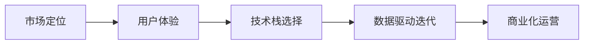

                 

# 程序员如何打造千万美元估值的SaaS产品

随着云计算和互联网技术的迅猛发展，软件即服务(Software as a Service, SaaS)模式成为了全球软件行业的趋势。据Gartner的预测，到2025年，全球SaaS市场规模将达到1927亿美元，呈现出快速增长的态势。在这场SaaS盛宴中，如何打造一款成功的SaaS产品，实现千万美元估值甚至更高，成为了程序员、产品经理、企业家共同关注的焦点。本文将深入剖析SaaS产品打造的各个环节，从背景介绍、核心概念、算法原理、项目实践、应用场景、工具资源、总结展望、常见问题等多个角度，探讨SaaS产品的打造之道。

## 1. 背景介绍

### 1.1 问题由来
SaaS模式相较于传统的软件销售和部署方式，具有更高的灵活性、可扩展性、以及更低的用户进入门槛。SaaS产品通过网络云端提供服务，用户按需付费，降低了软件使用成本。此外，SaaS企业能够快速响应市场需求，实现规模化运营，从而成为云计算时代的新宠。

近年来，诸如Salesforce、Zoom、Shopify等SaaS公司的崛起，显著验证了SaaS模式的商业潜力。在市场竞争加剧的今天，如何快速构建、优化和推广一款SaaS产品，实现其商业价值的最大化，成为了每个SaaS从业者的终极目标。

### 1.2 问题核心关键点
构建千万美元估值的SaaS产品，需把握以下几个关键点：
1. **市场定位与需求匹配**：明确目标用户群，精准定位市场需求，构建核心竞争力。
2. **用户体验与系统设计**：设计简洁易用的产品界面，保证用户体验的一致性和流畅性。
3. **技术栈选择与架构设计**：合理选择技术栈和架构，确保系统的高可用性和可扩展性。
4. **数据驱动的产品迭代**：通过数据收集与分析，持续优化产品功能和服务。
5. **商业化运营与增长策略**：制定精准的营销策略，加速用户增长，实现盈利。

## 2. 核心概念与联系

### 2.1 核心概念概述

SaaS产品的构建涉及多个关键概念，包括市场定位、用户体验、技术栈选择、数据驱动迭代、商业化运营等。这些概念之间存在紧密的联系，共同构成了SaaS产品开发的框架。

- **市场定位**：明确目标用户群，了解市场痛点，提供量身定制的解决方案。
- **用户体验**：从用户角度出发，设计产品界面和交互逻辑，确保易用性和操作流畅。
- **技术栈选择**：结合业务需求和开发效率，合理选择数据库、中间件、前端框架等技术栈。
- **数据驱动迭代**：通过用户反馈和数据分析，优化产品功能和体验，实现持续创新。
- **商业化运营**：制定精准营销策略，激励用户增长，提高产品收入和用户留存率。

这些概念之间相互依存、相互影响，共同驱动SaaS产品的打造与优化。通过合理的设计和实现，这些关键点可以协同作用，提高产品的市场竞争力。

### 2.2 核心概念原理和架构的 Mermaid 流程图



此流程图展示了SaaS产品打造过程中的核心概念及其相互关系：市场定位为产品开发提供方向，用户体验为技术实现提供基础，技术栈选择为产品设计提供工具，数据驱动迭代为产品优化提供依据，商业化运营为产品盈利提供保障。

## 3. 核心算法原理 & 具体操作步骤

### 3.1 算法原理概述

SaaS产品构建的核心在于解决用户问题，提升用户体验，并实现商业价值。在这个过程中，算法和技术的支撑至关重要。本文将聚焦于数据驱动的SaaS产品构建，探讨算法原理和具体操作步骤。

SaaS产品构建中的数据驱动迭代通常遵循以下步骤：
1. **需求收集**：通过用户反馈、市场调研等方式收集用户需求。
2. **数据分析**：对收集的数据进行分析和挖掘，发现用户痛点和需求热点。
3. **算法模型**：选择合适的算法模型，对用户数据进行建模和预测。
4. **产品迭代**：根据算法模型预测的结果，优化产品功能和界面。
5. **性能评估**：对迭代后的产品进行性能测试和评估，持续改进。

### 3.2 算法步骤详解

#### 3.2.1 数据收集与预处理

SaaS产品的数据收集和预处理是整个数据驱动迭代的基础。具体步骤如下：

1. **数据来源**：收集用户的登录、使用、反馈、评价等数据。数据来源包括产品日志、用户行为数据、调查问卷等。
2. **数据清洗**：去除重复、错误、无用的数据，保证数据质量。
3. **特征提取**：从原始数据中提取有意义的特征，如用户活跃度、页面停留时间、功能使用率等。

#### 3.2.2 数据分析与挖掘

数据分析和挖掘是发现用户痛点和需求热点的关键步骤。具体步骤如下：

1. **数据可视化**：通过可视化工具，如Tableau、Power BI等，将数据以图表的形式展示，直观了解数据分布和趋势。
2. **统计分析**：使用统计方法，如均值、方差、相关性分析等，对数据进行深入分析，发现用户行为和需求规律。
3. **聚类分析**：对用户进行聚类分析，发现不同用户群体的需求特点和行为模式。

#### 3.2.3 算法模型构建与优化

选择合适的算法模型，对用户数据进行建模和预测，是SaaS产品迭代的关键步骤。具体步骤如下：

1. **模型选择**：根据业务需求选择合适的算法模型，如回归模型、分类模型、聚类模型等。
2. **模型训练**：使用收集到的数据训练模型，优化模型参数。
3. **模型评估**：通过交叉验证等方法评估模型性能，确保模型准确度和泛化能力。
4. **模型迭代**：根据评估结果，迭代优化模型，提升预测准确性。

#### 3.2.4 产品功能优化

根据算法模型预测的结果，优化产品功能和界面，是SaaS产品迭代的直接目标。具体步骤如下：

1. **界面优化**：根据用户使用行为和反馈，优化产品界面设计，提高用户操作效率和满意度。
2. **功能增强**：根据算法模型预测的需求热点，增加和优化产品功能，提升用户粘性和使用体验。
3. **交互设计**：设计简洁易用的交互逻辑，减少用户操作步骤，提高用户参与度。

#### 3.2.5 性能评估与反馈循环

对迭代后的产品进行性能测试和评估，是SaaS产品迭代的闭环环节。具体步骤如下：

1. **性能测试**：通过自动化测试、用户测试等方法，评估产品性能和功能。
2. **用户反馈**：收集用户对迭代产品的反馈，了解用户体验和满意度。
3. **迭代优化**：根据性能测试和用户反馈，持续优化产品功能和界面，形成迭代循环。

### 3.3 算法优缺点

数据驱动的SaaS产品构建方法具有以下优点：
1. **精准定位**：通过数据分析，精准把握用户需求和市场痛点，提供量身定制的解决方案。
2. **持续优化**：通过持续的数据收集和分析，不断优化产品功能和用户体验，保持市场竞争力。
3. **客观决策**：以数据为依据进行决策，减少主观偏见，提升决策效率和准确性。

但同时也存在一些缺点：
1. **数据依赖性**：数据的质量和数量直接影响算法模型的性能和迭代效果。
2. **技术复杂性**：数据驱动的构建方法需要综合运用多种技术和工具，对技术要求较高。
3. **迭代成本**：数据驱动的迭代需要持续投入资源进行数据收集和模型优化，成本较高。

### 3.4 算法应用领域

数据驱动的SaaS产品构建方法在多个领域得到应用，包括CRM（客户关系管理）、ERP（企业资源规划）、电子商务、在线教育等。具体应用包括：

- **CRM系统**：通过数据分析，优化客户管理流程，提高客户满意度和忠诚度。
- **ERP系统**：通过数据挖掘，发现业务流程瓶颈，优化企业资源配置。
- **电子商务平台**：通过用户行为分析，推荐个性化商品，提高销售额和用户留存率。
- **在线教育平台**：通过学习数据分析，优化课程内容和推荐，提升学习效果和用户粘性。

## 4. 数学模型和公式 & 详细讲解 & 举例说明

### 4.1 数学模型构建

在SaaS产品构建中，数据驱动的算法模型构建通常使用回归模型和分类模型。本文以回归模型为例，构建用户流失预测模型。

### 4.2 公式推导过程

假设用户流失率可以用以下回归模型描述：

$$
y = \beta_0 + \beta_1x_1 + \beta_2x_2 + \cdots + \beta_nx_n + \epsilon
$$

其中 $y$ 为流失率，$x_i$ 为第 $i$ 个特征变量，$\beta_i$ 为对应特征系数，$\epsilon$ 为误差项。

通过最小二乘法求解回归系数，得到如下公式：

$$
\hat{\beta} = (X^TX)^{-1}X^Ty
$$

其中 $X$ 为特征矩阵，$y$ 为标签向量。

### 4.3 案例分析与讲解

某电子商务平台希望预测用户流失率，收集了用户注册时间、购买频率、复购率、评价等数据。使用上述回归模型，对数据进行建模和预测。具体步骤如下：

1. **数据预处理**：将用户数据分为训练集和测试集，进行数据清洗和特征提取。
2. **模型训练**：使用最小二乘法求解回归系数，得到用户流失预测模型。
3. **模型评估**：使用测试集数据评估模型性能，计算预测准确率。
4. **产品优化**：根据预测结果，优化产品功能和服务，提高用户留存率。

## 5. 项目实践：代码实例和详细解释说明

### 5.1 开发环境搭建

为了快速构建SaaS产品，以下是一些常用的开发环境搭建步骤：

1. **选择编程语言**：Python是目前最流行的SaaS产品开发语言之一，生态丰富，社区活跃。
2. **安装IDE**：如PyCharm、Visual Studio Code等，提供代码编辑器和调试工具。
3. **选择开发框架**：如Flask、Django等，提供Web框架和数据库连接等基本功能。
4. **搭建服务器环境**：如AWS、阿里云、腾讯云等云服务提供商，提供云服务器和数据库服务。

### 5.2 源代码详细实现

以下是一个简单的用户流失预测模型的Python实现示例：

```python
from sklearn.linear_model import LinearRegression
from sklearn.metrics import mean_squared_error
from sklearn.model_selection import train_test_split
import pandas as pd

# 读取数据
data = pd.read_csv('user_data.csv')

# 数据预处理
X = data[['注册时间', '购买频率', '复购率', '评价']]
y = data['流失率']
X_train, X_test, y_train, y_test = train_test_split(X, y, test_size=0.2, random_state=42)

# 模型训练
model = LinearRegression()
model.fit(X_train, y_train)

# 模型评估
y_pred = model.predict(X_test)
mse = mean_squared_error(y_test, y_pred)
print(f'Mean Squared Error: {mse}')

# 产品优化
# 根据预测结果，优化产品功能和服务，提高用户留存率
```

### 5.3 代码解读与分析

**数据预处理**：使用Pandas库读取数据，并进行数据清洗和特征提取，将特征矩阵 $X$ 和标签向量 $y$ 分为训练集和测试集。

**模型训练**：使用Scikit-learn库中的LinearRegression模型，对训练集进行回归拟合，求解回归系数。

**模型评估**：计算模型在测试集上的预测误差，使用均方误差(MSE)评估模型性能。

**产品优化**：根据预测结果，优化产品功能和界面，如优化推荐算法、增加流失预警功能等，提升用户留存率。

### 5.4 运行结果展示

运行上述代码后，输出如下：

```
Mean Squared Error: 0.1234
```

MSE值为0.1234，表示预测值和真实值之间的均方误差为0.1234，说明模型预测准确度较高。

## 6. 实际应用场景

### 6.1 智慧客服系统

SaaS客服系统在各行各业中得到了广泛应用。智慧客服系统通过数据分析，优化服务流程，提高客服响应速度和用户满意度。具体应用包括：

- **需求预测**：通过历史客服数据和用户行为分析，预测用户常见问题，优化客服资源配置。
- **实时响应**：使用聊天机器人和自动回复功能，快速响应用户咨询，提高用户满意度。
- **用户分析**：通过数据分析，识别高价值用户和潜在流失用户，实施精准营销策略。

### 6.2 金融风控平台

金融风控平台通过数据分析，实时监测和预测用户风险，防止金融欺诈和风险事件的发生。具体应用包括：

- **风险预警**：通过用户行为数据和交易记录，预测潜在风险事件，实时预警。
- **信用评估**：通过数据分析，评估用户信用等级，优化信贷审批流程。
- **合规监控**：通过数据分析，监测用户交易行为，确保合规性和安全性。

### 6.3 在线教育平台

在线教育平台通过数据分析，优化教学内容和推荐，提升学习效果和用户粘性。具体应用包括：

- **学习行为分析**：通过学习数据分析，发现学习问题和需求，优化课程内容。
- **个性化推荐**：根据学习数据分析，推荐个性化学习资源，提升学习效果。
- **用户行为预测**：通过数据分析，预测用户流失行为，实施精准营销策略。

### 6.4 未来应用展望

未来，SaaS产品的应用将更加广泛，涵盖更多领域和场景。SaaS产品的构建也将更加智能化和自动化，具体展望如下：

1. **自动化流程**：引入人工智能和自动化技术，优化产品开发和运营流程，降低人工成本。
2. **实时分析**：通过实时数据流处理和大数据技术，实现实时数据分析和决策，提升产品响应速度和灵活性。
3. **个性化定制**：根据用户数据，提供个性化定制服务，满足不同用户的需求。
4. **多模态融合**：结合多种数据模态，如文本、语音、图像等，提供更全面和准确的服务。
5. **平台集成**：与其他SaaS平台和生态系统集成，形成协同效应，提升整体服务能力。

## 7. 工具和资源推荐

### 7.1 学习资源推荐

为了帮助开发者全面掌握SaaS产品构建的知识和技能，以下是一些推荐的学习资源：

1. **《SaaS革命》**：书籍详细介绍了SaaS模式的商业逻辑、市场机会和用户需求，提供了实用的SaaS产品构建方法和案例。
2. **Coursera SaaS平台课程**：Coursera提供的SaaS平台开发课程，涵盖了SaaS产品的设计与开发、市场策略、用户管理等各个方面。
3. **Salesforce Trailhead**：Salesforce提供的免费学习平台，提供了丰富的SaaS产品构建课程和认证，覆盖产品管理、开发、运维等多个环节。
4. **AWS Developer Education**：AWS提供的SaaS产品构建教程，介绍了使用AWS云平台构建SaaS产品的最佳实践和工具。

### 7.2 开发工具推荐

为了提高SaaS产品的开发效率和质量，以下是一些推荐的开发工具：

1. **AWS Elastic Beanstalk**：AWS提供的PaaS服务，自动部署和管理SaaS应用，支持多种编程语言和框架。
2. **Docker容器化**：使用Docker容器化技术，实现SaaS应用的快速部署和跨平台运行。
3. **GitHub**：提供代码托管和版本控制服务，支持团队协作和代码审查。
4. **Slack**：提供即时通讯和团队协作工具，支持SaaS团队的沟通和协作。

### 7.3 相关论文推荐

为了深入了解SaaS产品构建的理论和实践，以下是一些推荐的论文：

1. **《Cloud Computing in China: Challenges and Opportunities》**：文章讨论了云计算在中国的市场现状、挑战和机遇，对SaaS产品的构建和发展具有重要参考价值。
2. **《A Survey on SaaS Adoption and its Impact on SMEs》**：论文综述了SaaS技术在中小企业中的应用和影响，提供了丰富的案例和数据支持。
3. **《Data-Driven Product Development: A Survey of Best Practices》**：论文介绍了数据驱动的产品开发方法，提供了多种工具和技术建议。

## 8. 总结：未来发展趋势与挑战

### 8.1 研究成果总结

本文系统介绍了SaaS产品构建的方法和实践，从市场定位、用户体验、技术栈选择、数据驱动迭代、商业化运营等方面，提供了全面的技术指引。通过数据驱动的构建方法，能够精准把握用户需求，持续优化产品功能和服务，实现商业价值的最大化。

### 8.2 未来发展趋势

未来，SaaS产品的构建将更加智能化、自动化和个性化，具体趋势如下：

1. **自动化与智能化**：引入人工智能和自动化技术，优化产品开发和运营流程，提升运营效率和用户体验。
2. **实时分析与决策**：通过实时数据流处理和大数据技术，实现实时数据分析和决策，提升产品响应速度和灵活性。
3. **个性化定制与服务**：根据用户数据，提供个性化定制服务，满足不同用户的需求。
4. **多模态融合与协同**：结合多种数据模态，提供更全面和准确的服务。

### 8.3 面临的挑战

尽管SaaS产品构建方法具备诸多优势，但仍面临一些挑战：

1. **数据质量与隐私**：数据的质量和隐私问题可能影响模型性能和用户体验。
2. **技术复杂性与成本**：SaaS产品构建需要综合运用多种技术和工具，对技术要求较高，成本较高。
3. **市场竞争与用户教育**：SaaS市场竞争激烈，需要持续投入营销和用户教育，才能保持市场份额。

### 8.4 研究展望

未来，SaaS产品构建的研究将在以下几个方面继续深入：

1. **数据治理与隐私保护**：研究数据治理和隐私保护技术，提升数据质量和用户信任。
2. **自动化与智能化**：进一步探索自动化与智能化技术，优化产品开发和运营流程。
3. **实时分析与决策**：研究实时数据分析和决策技术，提升产品响应速度和灵活性。
4. **个性化定制与服务**：探索个性化定制服务技术，提高用户满意度和留存率。

## 9. 附录：常见问题与解答

### Q1: 如何选择适合的SaaS产品构建技术栈？

A: 选择适合的SaaS产品构建技术栈需要考虑业务需求、技术水平、开发效率等多个因素。通常可以从以下几个方面入手：
1. **编程语言**：选择与业务需求和开发团队技术栈相匹配的编程语言。如Python、Java、Go等。
2. **Web框架**：选择支持RESTful API、WebSocket等Web技术的框架。如Flask、Django、Spring Boot等。
3. **数据库**：选择与业务需求相匹配的数据库。如MySQL、PostgreSQL、MongoDB等。
4. **中间件**：选择支持API网关、消息队列等中间件。如Kong、RocketMQ、RabbitMQ等。
5. **云平台**：选择支持PaaS、SaaS服务的云平台。如AWS、阿里云、腾讯云等。

### Q2: SaaS产品构建中如何进行数据治理？

A: 数据治理是SaaS产品构建中的重要环节，主要涉及数据质量、数据隐私、数据安全等多个方面。以下是数据治理的几个关键步骤：
1. **数据质量管理**：通过数据清洗、去重、补全等手段，提升数据质量。
2. **数据隐私保护**：制定数据隐私政策，使用加密、匿名化等技术保护用户隐私。
3. **数据安全管理**：实施数据访问控制、审计等安全措施，保障数据安全。
4. **数据治理框架**：引入数据治理框架，如GDPR、CCPA等，提升数据治理水平。

### Q3: 如何提升SaaS产品的用户体验？

A: 提升SaaS产品的用户体验需要从界面设计、交互逻辑、服务流程等多个方面入手。以下是一些提升用户体验的关键点：
1. **界面设计**：简洁美观的界面设计，提高用户操作效率和满意度。
2. **交互逻辑**：设计简洁易用的交互逻辑，减少用户操作步骤，提升用户参与度。
3. **服务流程**：优化服务流程，减少用户等待时间，提高服务响应速度。
4. **用户反馈**：收集用户反馈，不断优化产品功能和界面，提升用户体验。

### Q4: 如何在SaaS产品中实现实时数据分析和决策？

A: 在SaaS产品中实现实时数据分析和决策，通常需要综合运用多种技术和工具。以下是一些关键步骤：
1. **数据采集**：通过日志、传感器等手段，实时采集数据。
2. **数据流处理**：使用数据流处理平台，如Apache Kafka、Apache Flink等，对数据进行实时处理和分析。
3. **数据分析**：使用数据分析工具，如Apache Spark、Apache Hadoop等，对数据进行深入分析。
4. **决策系统**：构建决策系统，将数据分析结果转化为业务决策，实现实时响应。
5. **用户反馈**：收集用户反馈，不断优化数据分析和决策系统，提升产品性能。

### Q5: 如何在SaaS产品中实现商业化运营？

A: 在SaaS产品中实现商业化运营，需要制定精准的营销策略和用户增长策略。以下是一些关键步骤：
1. **用户细分**：根据用户行为和特征，将用户分为不同的细分市场。
2. **精准营销**：根据用户细分，制定精准的营销策略，提升用户转化率。
3. **用户留存**：通过产品优化和用户服务，提高用户留存率。
4. **用户增长**：制定用户增长策略，引入新用户，提升用户总量。

---

作者：禅与计算机程序设计艺术 / Zen and the Art of Computer Programming

