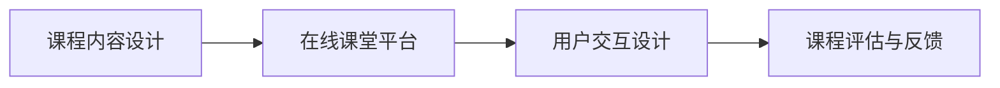

                 

# 程序员如何打造知识付费的在线课堂

## 1. 背景介绍

在信息爆炸的今天，知识付费已经成为一种趋势。程序员作为IT行业的重要组成部分，也面临着不断学习新技术、掌握新工具的压力。同时，技术的不断进步和应用的广泛普及，也使得技术分享和交流变得更为便捷。在线课堂作为一种知识传播的新形式，因其灵活性、覆盖面广、互动性强等特点，迅速在程序员中流行起来。

本博客将详细介绍如何利用当前的技术栈和工具，打造一个高效、可扩展、可持续的知识付费在线课堂。我们将从课程内容设计、平台架构搭建、用户交互设计等多个方面展开讨论，力求为程序员打造一个既有技术深度、又有交互乐趣的在线学习环境。

## 2. 核心概念与联系

在介绍具体技术和实现之前，我们先要了解几个核心概念：

### 2.1 核心概念概述

1. **课程内容设计 (Course Content Design)**：确定课程主题、内容深度、学习路径、评估方式等，以确保课程能够满足学员的学习需求。
2. **在线课堂平台 (Online Classroom Platform)**：构建一个集课程管理、学习记录、互动交流于一体的在线平台，为学员提供便捷的学习体验。
3. **用户交互设计 (User Interaction Design)**：设计用户界面和交互方式，提升用户体验，增强学习效率。
4. **课程评估与反馈 (Course Evaluation & Feedback)**：通过课程测试、学习记录、学员反馈等方式，评估学员学习效果，不断优化课程内容。

### 2.2 核心概念原理和架构的 Mermaid 流程图



该流程图示意了从课程设计到平台搭建、交互设计再到评估反馈的整个课程开发流程。各环节环环相扣，缺一不可。

## 3. 核心算法原理 & 具体操作步骤

### 3.1 算法原理概述

知识付费在线课堂的构建涉及多个领域的技术，包括课程设计、内容管理、学员互动、反馈优化等。其中，课程设计是基础，内容管理和用户交互设计是支撑，反馈优化是提升。

### 3.2 算法步骤详解

1. **课程设计 (Course Design)**：
   - 确定课程目标：明确课程希望解决的问题、目标受众和预期成果。
   - 设计课程结构：合理分配课时、设置评估点、决定学习路径。
   - 制作课程内容：录制视频、准备讲义、编写代码示例等。

2. **平台搭建 (Platform Setup)**：
   - 选择合适的开发框架和工具：如React、Vue、Flask等。
   - 设计数据模型：包括课程、视频、用户、讨论等实体。
   - 实现前后端功能：如视频播放、课程注册、用户登录等。

3. **用户交互设计 (User Interaction Design)**：
   - 界面设计：保证界面简洁美观，易于导航。
   - 交互设计：确保用户能够顺畅完成各项操作，如视频播放、讨论提交等。
   - 反馈收集：提供意见反馈机制，收集用户意见以优化体验。

4. **课程评估与反馈 (Course Evaluation & Feedback)**：
   - 设定评估标准：包括知识点掌握、作业完成情况、课堂互动等。
   - 设计评估工具：如在线测试、作业提交、课堂互动投票等。
   - 分析评估结果：通过统计分析，评估学员学习效果，并根据反馈不断优化课程内容。

### 3.3 算法优缺点

- **优点**：
  - **灵活性高**：在线课堂能够随时随地进行学习，不受时间地点限制。
  - **覆盖面广**：课程内容可以根据实际需求进行调整，涵盖面广泛。
  - **互动性强**：通过互动工具，如论坛、讨论区、实时问答等，提升学员参与度。
  - **反馈及时**：通过即时评估和反馈机制，能够快速调整课程内容。

- **缺点**：
  - **技术门槛高**：搭建和维护在线课堂需要一定的技术储备和开发经验。
  - **互动质量不稳定**：如果缺乏有效的互动工具和管理机制，用户参与度可能受到影响。
  - **学习效果难以量化**：课程评估和反馈机制设计不当，可能导致学习效果评估不准确。

### 3.4 算法应用领域

知识付费在线课堂的应用领域非常广泛，不仅限于IT行业。例如，金融、医疗、教育等各领域的专业技能培训和知识普及，都可以通过在线课堂来实现。

## 4. 数学模型和公式 & 详细讲解 & 举例说明

在本节中，我们将以在线课堂平台的用户互动设计为例，简要介绍相关的数学模型和公式。

### 4.1 数学模型构建

假设有一个在线课堂平台，支持视频播放、讨论、作业提交等功能。用户可以观看课程视频、参与讨论、提交作业并获得反馈。

平台的用户行为可以抽象为以下几个事件：

- 视频播放：事件 $E_{\text{video play}}$
- 讨论提交：事件 $E_{\text{discussion post}}$
- 作业提交：事件 $E_{\text{assignment submit}}$
- 作业反馈：事件 $E_{\text{assignment feedback}}$

用户在一个时间段内（如一天）的行为可以表示为一个序列：

$$
S_t = \{E_{\text{video play}}^{t_1}, E_{\text{discussion post}}^{t_2}, E_{\text{assignment submit}}^{t_3}, E_{\text{assignment feedback}}^{t_4}\}
$$

其中 $t_1, t_2, t_3, t_4$ 表示各事件发生的时间戳。

### 4.2 公式推导过程

为了分析用户的行为模式，我们可以使用事件序列建模的方法。设 $P(E_i)$ 表示事件 $E_i$ 发生的概率，$i=1,2,3,4$。则用户在某时间段内发生的事件概率分布可以表示为：

$$
P(S_t) = \prod_{i=1}^{4} P(E_i)
$$

具体计算时，可以使用马尔可夫链模型或隐马尔可夫模型（HMM）来对用户行为进行建模和预测。

### 4.3 案例分析与讲解

以视频播放为例，我们可以使用贝叶斯网络对事件发生概率进行建模。假设视频内容分为三个部分，每个部分播放时间分别为30分钟、45分钟和60分钟。视频播放的马尔可夫链模型可以表示为：

$$
P(E_{\text{video play}}) = P(E_{\text{video play, part 1}}) + P(E_{\text{video play, part 2}}) + P(E_{\text{video play, part 3}})
$$

其中 $P(E_{\text{video play, part i}})$ 表示用户在第 $i$ 个部分结束播放的概率。

## 5. 项目实践：代码实例和详细解释说明

在本节中，我们将使用React和Flask搭建一个在线课堂平台，并详细介绍其功能和实现。

### 5.1 开发环境搭建

- **前端**：安装Node.js、npm和React环境。
- **后端**：安装Python 3.7以上版本，使用Flask和SQLAlchemy等库。
- **数据库**：使用MySQL或PostgreSQL，安装相应的驱动库。
- **代码托管**：使用Git进行代码版本管理。

### 5.2 源代码详细实现

以下是一个简单的在线课堂平台的前端代码示例：

```javascript
import React, { useState } from 'react';
import axios from 'axios';

const VideoPlayer = () => {
  const [isPlaying, setIsPlaying] = useState(false);
  const [videoDuration, setVideoDuration] = useState(0);

  const handlePlay = () => {
    setIsPlaying(true);
    setVideoDuration(30 * 60 * 1000); // 30分钟视频
  };

  const handlePause = () => {
    setIsPlaying(false);
  };

  const handleFinish = () => {
    handlePause();
    setVideoDuration(45 * 60 * 1000); // 45分钟视频
  };

  return (
    <div>
      <button onClick={handlePlay}>播放</button>
      {isPlaying ? (
        <div>
          <span>播放中...</span>
          <button onClick={handlePause}>暂停</button>
          <button onClick={handleFinish}>播放下一部分</button>
        </div>
      ) : (
        <span>已完成</span>
      )}
      <span>播放时长：{videoDuration / 1000 / 60}分钟</span>
    </div>
  );
};

export default VideoPlayer;
```

### 5.3 代码解读与分析

- **状态管理**：使用React的Hooks，实现视频播放的状态管理，包括播放/暂停、视频播放时长等。
- **事件处理**：通过事件处理函数，响应用户的操作，如点击播放、暂停、跳转到下一部分等。
- **页面渲染**：根据当前状态，动态渲染页面内容。

### 5.4 运行结果展示

- **视频播放页面**：通过React组件实现视频播放页面，展示视频播放进度、控制播放暂停、跳转到下一部分等。

## 6. 实际应用场景

在线课堂平台的应用场景非常广泛，包括但不限于以下几方面：

- **技术培训**：为开发者提供编程语言、框架、工具等方面的课程培训。
- **职场技能**：为职场人士提供领导力、沟通技巧、项目管理等方面的技能培训。
- **在线考试**：通过在线课堂平台进行各类技术、职业技能测试。
- **课程认证**：提供课程证书，增强学员的学习动力和可信度。

## 7. 工具和资源推荐

### 7.1 学习资源推荐

- **《React入门与实战》**：全面介绍React的开发流程和最佳实践。
- **《Flask Web开发实战》**：深入讲解Flask框架的使用方法和实际应用案例。
- **《Python Web开发实战》**：涵盖Python Web开发的各个方面，包括前端和后端开发。
- **《深度学习与自然语言处理》**：介绍深度学习在自然语言处理中的应用。
- **《在线教育平台设计》**：讲解在线教育平台的设计原则和实施方法。

### 7.2 开发工具推荐

- **React**：高效的前端组件化开发框架，适用于构建复杂的Web应用。
- **Vue**：灵活易用的前端框架，适用于快速开发原型和单页应用。
- **Flask**：轻量级Web框架，适用于快速搭建后端服务。
- **Django**：全功能的Web框架，适用于大型Web应用。
- **PostgreSQL**：功能强大的关系型数据库，支持复杂查询和事务处理。

### 7.3 相关论文推荐

- **《知识图谱在在线教育中的应用》**：介绍知识图谱在在线教育中的作用。
- **《基于数据驱动的在线教育平台设计》**：分析在线教育平台的数据驱动设计和优化方法。
- **《大规模在线教育平台的可扩展性研究》**：研究在线教育平台的可扩展性和性能优化。

## 8. 总结：未来发展趋势与挑战

### 8.1 研究成果总结

本文从课程设计、平台搭建、用户交互设计、课程评估与反馈等多个方面，详细介绍了如何利用当前的技术栈和工具，打造知识付费的在线课堂。通过合理设计课程内容和互动方式，结合高效的前端和后端技术，能够为用户提供优质的学习体验。

### 8.2 未来发展趋势

- **个性化学习**：利用人工智能和大数据技术，实现个性化课程推荐和智能学习路径。
- **虚拟现实和增强现实**：结合VR和AR技术，提升课程的互动性和沉浸感。
- **实时互动**：通过实时互动工具，如WebRTC、Firebase等，实现更高效的课堂互动。
- **多语言支持**：提供多语言支持，扩大课程的覆盖面和受众。

### 8.3 面临的挑战

- **技术复杂度**：搭建和维护在线课堂需要较高的技术储备和开发经验。
- **用户参与度**：如何提高用户参与度和活跃度，是平台运营的难点之一。
- **数据安全和隐私**：平台需要妥善处理用户数据，确保数据安全和用户隐私。

### 8.4 研究展望

未来的在线课堂平台将朝着更加智能化、个性化、互动化的方向发展。通过引入人工智能和大数据技术，实现更精准的用户画像和推荐系统，提升课程质量和用户满意度。同时，平台需要不断优化技术架构，提高系统的可扩展性和稳定性，确保长期的可持续运营。

## 9. 附录：常见问题与解答

**Q1: 如何保证课程内容的质量和更新？**

A: 课程内容的质量和更新需要依靠课程设计者的专业知识和对技术趋势的把握。平台可以引入课程评估机制，通过学员的反馈和评分，筛选优质课程。同时，平台应定期组织课程更新和维护，确保课程内容的时效性和实用性。

**Q2: 如何保证在线课堂的安全性和稳定性？**

A: 在线课堂的安全性和稳定性是平台运营的关键。需要采用多层次的安全措施，如数据加密、用户认证、访问控制等。同时，定期进行系统测试和性能优化，确保平台的稳定性和可用性。

**Q3: 如何提升用户的参与度和活跃度？**

A: 用户参与度和活跃度是平台发展的核心。可以通过以下措施来提升：
1. 提供优质的课程内容，满足用户的学习需求。
2. 设计互动性强的内容，如实时问答、讨论区等。
3. 提供激励机制，如课程证书、徽章、排行榜等。

**Q4: 如何实现高效的课程评估和反馈？**

A: 课程评估和反馈是提升课程质量的重要手段。可以通过以下措施来实现：
1. 设定明确的评估标准，如知识掌握、作业完成情况等。
2. 设计评估工具，如在线测试、作业提交、课堂互动投票等。
3. 分析评估结果，通过数据挖掘和机器学习等方法，不断优化课程内容。

---

作者：禅与计算机程序设计艺术 / Zen and the Art of Computer Programming

