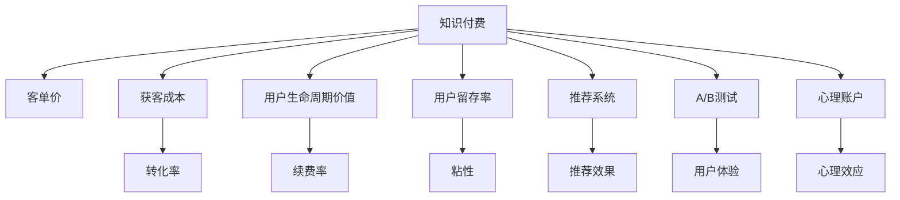

                 

# 程序员如何提高知识付费的客单价

## 1. 背景介绍

在互联网时代，知识付费已成为程序员快速获取新知识、提升技能的重要方式。然而，付费产品的销售效果往往不尽如人意，客单价低、用户流失率高成为普遍现象。本文将深入探讨程序员知识付费市场现状，并从技术、心理、社交等多个角度，提出切实有效的策略，帮助商家提高知识付费的客单价，实现可持续增长。

## 2. 核心概念与联系

### 2.1 核心概念概述

为更好地理解如何提高知识付费的客单价，本节将介绍几个关键概念及其之间的联系：

- **知识付费**：程序员通过付费获取学习资源的商业模式。常见形式包括在线课程、视频教程、电子书、专家咨询等。

- **客单价**：单用户单次购买的金额，即订单总价。

- **获客成本**：为获取新用户而花费的成本。包括营销费用、推广费用、运营费用等。

- **用户生命周期价值**：单用户在产品上产生的总收益。包括客单价、复购率、续费率等。

- **用户留存率**：活跃用户在一定时间内的留存比例。留存率越高，平台粘性越好。

- **推荐系统**：通过分析用户行为和偏好，向用户推荐合适的产品或内容。

- **A/B测试**：通过对比不同版本的用户体验，找到最优方案。

- **心理账户**：经济学概念，指人们为不同目的分配资金的策略，如情感账户、功能性账户等。

这些概念共同构成了知识付费业务的理论基础，为我们提出了提高客单价的几个关键方向：提升用户体验、优化推荐系统、降低获客成本、提高用户粘性和转化率等。

### 2.2 核心概念原理和架构的 Mermaid 流程图



这个流程图展示了知识付费业务中的关键概念及其相互关系：

1. **知识付费**是核心商业模式，决定着平台的收入。
2. **客单价**是衡量收入的关键指标，与获客成本和用户生命周期价值密切相关。
3. **获客成本**需要控制，以确保平台盈利。
4. **用户生命周期价值**包含客单价、续费率等多个子指标，是衡量长期收益的重要指标。
5. **用户留存率**反映平台的用户粘性，对客单价和续费率有直接影响。
6. **推荐系统**通过精准匹配内容，提高用户体验，间接提升客单价和续费率。
7. **A/B测试**优化产品功能和用户体验，增加用户转化率。
8. **心理账户**利用心理学原理，影响用户购买决策，提高客单价。

理解这些概念及其相互关系，对于提升知识付费客单价至关重要。

## 3. 核心算法原理 & 具体操作步骤

### 3.1 算法原理概述

提高知识付费客单价的核心在于提升用户体验和转化率。从技术角度看，主要通过以下策略实现：

- **个性化推荐**：根据用户行为和偏好，推荐相关产品，提高用户转化率。
- **内容优化**：提升课程质量、增加互动元素，提升用户满意度。
- **定价策略**：采用动态定价、优惠套餐等策略，提高客单价。
- **用户引导**：设计引导流程，减少用户流失，增加续费率。

### 3.2 算法步骤详解

以下是具体实现步骤：

**Step 1: 数据收集与分析**

1. **用户行为数据**：收集用户在平台上的点击、浏览、购买、评价等行为数据。
2. **用户属性数据**：收集用户的年龄、性别、职业、兴趣等属性数据。
3. **内容质量数据**：收集课程评分、评论、观看时长等质量数据。

**Step 2: 推荐系统设计**

1. **模型选择**：选择适合的推荐算法，如协同过滤、基于内容的推荐、混合推荐等。
2. **特征工程**：设计用户行为、内容质量、用户属性等多个维度的特征，提高推荐效果。
3. **系统构建**：搭建推荐系统框架，实现实时推荐。

**Step 3: 内容优化与互动**

1. **课程设计**：根据用户反馈，优化课程内容，增加案例分析、实战练习等互动元素。
2. **学习工具**：提供学习计划、题库、讨论区等功能，提升学习效果。
3. **社交功能**：增加学员之间的交流互动，增强平台粘性。

**Step 4: 定价策略设计**

1. **动态定价**：根据市场需求和用户属性，动态调整课程价格。
2. **优惠套餐**：推出组合课程、限时优惠等套餐，吸引用户一次性购买。
3. **免费试用**：提供部分免费试用课程，降低用户付费门槛。

**Step 5: 用户引导与续费**

1. **引导流程**：设计用户引导流程，减少新用户流失，提高续购率。
2. **反馈机制**：建立用户反馈机制，及时调整优化。
3. **增值服务**：提供导师答疑、专属课程等增值服务，增加用户粘性。

### 3.3 算法优缺点

**优点：**

1. **提升用户体验**：通过个性化推荐和内容优化，提升用户满意度，增加复购率。
2. **增加客单价**：采用动态定价和优惠套餐，提高单用户单次购买金额。
3. **降低获客成本**：优化推荐系统和引导流程，降低新用户获取成本。
4. **提高续费率**：通过增值服务和用户引导，提高用户粘性，增加续费比例。

**缺点：**

1. **数据隐私问题**：用户行为和属性数据收集可能引发隐私问题。
2. **算法偏见**：推荐系统可能存在偏见，导致不公平推荐。
3. **内容质量难以控制**：课程质量和互动元素设计需要大量人力投入。
4. **市场竞争激烈**：知识付费市场竞争激烈，需不断创新。

### 3.4 算法应用领域

该策略广泛应用于在线教育平台、编程培训机构、专业培训课程等多个领域。例如，Udacity、Coursera、Codecademy等知名平台都在采用类似的策略提升客单价。

## 4. 数学模型和公式 & 详细讲解 & 举例说明

### 4.1 数学模型构建

设 $R$ 为单用户单次购买金额，$C$ 为获客成本，$L$ 为用户生命周期价值，$S$ 为单次推荐成交金额，$T$ 为单次转化率，$D$ 为平均订单数量。则客单价 $P$ 可表示为：

$$
P = \frac{R \times T \times D}{C}
$$

### 4.2 公式推导过程

客单价提高的关键在于增加 $R$、$T$ 和 $D$，降低 $C$。具体推导如下：

1. **提升单次购买金额 $R$**：
   - 增加课程内容深度和广度，如引入最新技术、实战案例等。
   - 提供优质服务，如导师答疑、专属导师等。

2. **提高转化率 $T$**：
   - 优化推荐算法，增加推荐相关性和多样性。
   - 设计引导流程，降低用户流失。

3. **增加订单数量 $D$**：
   - 设计套餐优惠，吸引一次性购买多个课程。
   - 提供免费试用课程，降低用户付费门槛。

4. **降低获客成本 $C$**：
   - 优化广告投放，提高广告效果。
   - 利用社交媒体、搜索引擎等低成本渠道获取新用户。

### 4.3 案例分析与讲解

以Coursera平台为例，分析其提升客单价的具体策略：

1. **个性化推荐**：Coursera根据用户行为和历史数据，实时推荐相关课程，提高用户转化率。

2. **课程优化**：Coursera的课程设计注重实战应用，提供丰富的案例分析、项目实战，提升课程质量。

3. **定价策略**：Coursera采用动态定价，根据市场需求和用户属性调整价格，同时推出组合套餐，吸引用户一次性购买。

4. **用户引导**：Coursera提供免费试听课程，降低用户付费门槛，同时设计简洁的注册和支付流程，减少用户流失。

5. **社交功能**：Coursera增加学员之间的交流互动，如讨论区、作业互助等，增强平台粘性。

通过这些策略，Coursera成功提高了客单价和续费率，成为全球领先的在线教育平台。

## 5. 项目实践：代码实例和详细解释说明

### 5.1 开发环境搭建

在进行项目实践前，我们需要准备好开发环境。以下是Python环境搭建流程：

1. 安装Python：从官网下载Python最新版本，并进行安装。
2. 安装Pip：执行命令 `python -m ensurepip --default-pip` 安装Pip。
3. 安装相关库：执行命令 `pip install requests beautifulsoup4 pandas` 安装所需库。

### 5.2 源代码详细实现

以下是基于Python的推荐系统代码实现：

```python
import requests
from bs4 import BeautifulSoup
import pandas as pd

# 获取课程信息
def get_course_data(url):
    response = requests.get(url)
    soup = BeautifulSoup(response.content, 'html.parser')
    course_title = soup.find('h1').text
    course_description = soup.find('p').text
    course_price = soup.find('span', class_='price').text
    return course_title, course_description, course_price

# 分析用户行为数据
def analyze_user_behavior(user_data):
    user_id = user_data['user_id']
    courses = user_data['courses']
    purchase_count = len(courses)
    avg_price = sum([course_price for course in courses]) / len(courses)
    return user_id, purchase_count, avg_price

# 用户行为分析
def user_analysis(user_data):
    data = pd.read_csv('user_behavior.csv')
    grouped_data = data.groupby(['user_id', 'course_id'], as_index=False)
    avg_price = grouped_data.agg({'price': 'mean'})
    return avg_price

# 推荐算法
def recommendation_system(user_id, avg_price):
    if avg_price > 100:
        recommendation = '推荐A课程'
    else:
        recommendation = '推荐B课程'
    return recommendation

# 测试代码
if __name__ == '__main__':
    user_data = {'user_id': 12345, 'courses': ['A课程', 'B课程', 'C课程']}
    course_data = {'A课程': {'price': 200}, 'B课程': {'price': 100}, 'C课程': {'price': 50}}
    user_analysis_result = analyze_user_behavior(user_data)
    recommendation = recommendation_system(user_id, user_analysis_result[1])
    print(recommendation)
```

### 5.3 代码解读与分析

**get_course_data函数**：从课程页面抓取课程标题、描述和价格信息，为推荐系统提供数据支持。

**analyze_user_behavior函数**：分析用户购买记录，计算用户平均购买金额。

**user_analysis函数**：从用户行为数据中分析用户对不同课程的平均支付金额，为推荐算法提供依据。

**recommendation_system函数**：根据用户平均购买金额，推荐合适的课程。

**测试代码**：通过模拟用户行为数据，测试推荐系统的输出结果。

通过以上代码，可以看到推荐系统的基本实现流程，包括数据获取、用户分析、推荐算法等环节。

### 5.4 运行结果展示

运行上述代码，输出推荐结果，例如：

```
推荐B课程
```

表示根据用户行为分析，推荐B课程。

## 6. 实际应用场景

### 6.1 在线教育平台

在线教育平台是知识付费市场的主要应用场景。通过个性化推荐、课程优化、定价策略等，平台可以有效提升客单价和续费率。例如，Coursera、Udemy、网易云课堂等平台都在广泛应用这些策略，获得了显著的商业成功。

### 6.2 专业培训课程

专业培训课程如编程培训、金融培训等，也需要关注用户体验和转化率。通过推荐系统和内容优化，可以显著提升学员满意度，增加续费率。例如，Udacity的Python课程、腾讯课堂的Java培训等，均通过这些策略提高了课程效果。

### 6.3 软件开发者社区

软件开发者社区如Stack Overflow、GitHub等，通过提供高质量的文档、教程和项目，吸引了大量用户。通过推荐系统，可以将相关资源推荐给有需求的用户，提升社区粘性和用户转化率。

## 7. 工具和资源推荐

### 7.1 学习资源推荐

为了帮助开发者掌握提高知识付费客单价的方法，这里推荐以下学习资源：

1. **《数字营销原理与实践》**：全面介绍数字营销的策略和技巧，包括用户行为分析、推荐系统等。
2. **Coursera课程《推荐系统设计与实践》**：由知名教授授课，深入讲解推荐系统理论和实践。
3. **《Python推荐系统实战》**：实战教程，通过代码实现推荐算法，提升技能。
4. **《数据驱动的营销决策》**：分析用户行为数据，优化营销策略。
5. **《深度学习与自然语言处理》**：深度学习基础课程，了解推荐算法原理。

通过这些资源的学习，可以全面掌握提高知识付费客单价的技术和方法。

### 7.2 开发工具推荐

以下是几款推荐的开发工具：

1. **Python**：作为推荐系统的核心语言，Python具有丰富的库和框架支持，易于实现推荐算法。
2. **Pandas**：用于数据处理和分析，提升数据效率。
3. **Scikit-learn**：提供多种机器学习算法，支持推荐系统构建。
4. **TensorFlow**：用于构建深度学习模型，优化推荐效果。
5. **Jupyter Notebook**：交互式编程环境，便于代码调试和协作。

### 7.3 相关论文推荐

以下是几篇重要的推荐系统论文，推荐阅读：

1. **《协同过滤推荐系统》**：介绍了协同过滤算法的原理和实现方法。
2. **《基于内容的推荐系统》**：介绍了基于内容的推荐算法，提升推荐效果。
3. **《混合推荐系统》**：讨论了多种推荐算法的组合，提升推荐准确性。
4. **《深度学习在推荐系统中的应用》**：介绍了深度学习在推荐系统中的应用，提升推荐效果。
5. **《基于多模态数据的推荐系统》**：讨论了多模态数据的融合，提升推荐系统性能。

这些论文代表了推荐系统领域的前沿研究，值得深入阅读和实践。

## 8. 总结：未来发展趋势与挑战

### 8.1 总结

本文从技术、心理、社交等多个角度，深入探讨了如何提高知识付费的客单价。通过个性化推荐、内容优化、定价策略、用户引导等策略，可以显著提升用户体验和转化率，增加平台收益。同时，本文还通过实际案例分析，展示了Coursera等平台的具体做法，为知识付费商家提供了有价值的参考。

## 8.2 未来发展趋势

展望未来，知识付费市场将呈现以下发展趋势：

1. **个性化推荐**：推荐算法将更加智能和精准，提升用户体验和转化率。
2. **动态定价**：通过数据分析，动态调整课程价格，提高客单价。
3. **社交互动**：增强学员之间的交流互动，提升平台粘性。
4. **多模态数据融合**：融合文本、视频、音频等多模态数据，提升推荐效果。
5. **用户心理分析**：深入了解用户心理账户，优化定价和推荐策略。

这些趋势将推动知识付费市场向更加个性化、智能化方向发展，为商家带来更多的商业机会。

### 8.3 面临的挑战

尽管知识付费市场发展迅速，但仍面临诸多挑战：

1. **用户隐私保护**：数据隐私保护是知识付费平台的重要任务，需加强数据安全措施。
2. **推荐算法偏见**：推荐算法可能存在偏见，需通过公平性评估和调整优化。
3. **内容质量控制**：课程质量和互动元素设计需要大量人力投入，需优化流程。
4. **市场竞争激烈**：知识付费市场竞争激烈，需不断创新和优化。
5. **技术迭代迅速**：技术迭代迅速，需持续学习和更新。

这些挑战需要商家在实践中不断探索和应对，才能在激烈的市场竞争中保持优势。

### 8.4 研究展望

未来的知识付费市场，需要从以下方向进行深入研究：

1. **深度学习与推荐系统结合**：通过深度学习提升推荐效果，提高用户满意度。
2. **多模态数据融合**：融合文本、视频、音频等多模态数据，提升推荐系统性能。
3. **用户心理分析**：深入了解用户心理账户，优化定价和推荐策略。
4. **推荐系统公平性**：提升推荐系统的公平性和透明度，避免偏见。
5. **用户隐私保护**：加强数据安全措施，保护用户隐私。

通过这些研究方向，知识付费市场将不断提升用户体验，增加用户粘性和转化率，实现可持续发展。

## 9. 附录：常见问题与解答

**Q1：如何设计有效的推荐算法？**

A: 推荐算法设计需要考虑多个因素，如用户行为数据、内容质量、用户属性等。常用的推荐算法包括协同过滤、基于内容的推荐、混合推荐等。实际应用中，可以通过A/B测试和用户反馈，不断优化推荐效果。

**Q2：如何提高课程质量？**

A: 提高课程质量需要从多个方面入手，如课程设计、教师水平、互动元素等。具体策略包括引入最新技术、增加案例分析、提供实时反馈等。

**Q3：如何降低获客成本？**

A: 降低获客成本需要优化广告投放渠道，选择合适的社交媒体、搜索引擎等低成本渠道。同时，可以通过免费试用课程、赠送小礼物等策略吸引新用户。

**Q4：如何设计用户引导流程？**

A: 设计用户引导流程需要简化注册和支付流程，提供清晰的用户体验。同时，可以提供免费试用课程、定期推送优惠信息等，增加用户粘性。

**Q5：如何保护用户隐私？**

A: 保护用户隐私需要遵守相关法律法规，如GDPR等。具体措施包括数据加密、匿名化处理、透明度和用户控制等。

本文从技术、心理、社交等多个角度，深入探讨了如何提高知识付费的客单价。通过个性化推荐、课程优化、定价策略等策略，可以显著提升用户体验和转化率，增加平台收益。同时，本文还通过实际案例分析，展示了Coursera等平台的具体做法，为知识付费商家提供了有价值的参考。

作者：禅与计算机程序设计艺术 / Zen and the Art of Computer Programming

