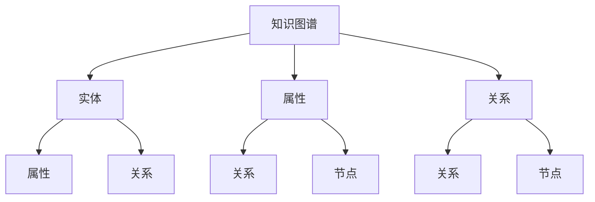

                 

# 程序员如何构建个人知识图谱

> 关键词：知识图谱, 个人知识管理, 数据驱动的决策, 信息检索, 软件工程, 自动化, 智能推荐系统

## 1. 背景介绍

### 1.1 问题由来

在当今这个信息爆炸的时代，程序员需要不断学习和更新知识，以便跟上技术的快速迭代。然而，面对海量的资料和信息，如何有效地组织和管理这些知识，成为了一个重大挑战。传统的文档笔记、分类目录等方式虽然有一定的帮助，但已经无法满足日益增长的知识需求。

### 1.2 问题核心关键点

知识图谱（Knowledge Graph）作为一种结构化的知识表示方法，正逐渐成为知识管理的重要工具。它通过语义化的关系描述，将大量异构数据有机地组织在一起，帮助人们更高效地检索、推理和使用知识。在程序员的个人知识管理中，构建一个个性化的知识图谱，可以极大地提升学习和工作效率。

### 1.3 问题研究意义

构建个人知识图谱有助于程序员：

1. 提高学习效率：通过结构化的知识管理，可以快速定位所需的信息，减少无效的浏览时间。
2. 促进知识整合：将不同来源的知识整合在一起，形成更全面的知识体系。
3. 增强决策支持：借助知识图谱中的关联关系，辅助决策过程，减少错误判断。
4. 提升工程质量：通过系统化的知识管理，优化软件工程流程，减少重复工作。
5. 助力智能推荐：利用知识图谱进行智能推荐，推荐更贴合需求的学习资源和工具。

## 2. 核心概念与联系

### 2.1 核心概念概述

以下是对核心概念的详细解释：

- **知识图谱（Knowledge Graph）**：一种基于语义网的知识表示方法，通过实体（Entity）、属性（Property）和关系（Relation）三元组形式描述知识。常见的知识图谱有Freebase、Linked Data、DBpedia等。
- **实体（Entity）**：指知识图谱中的基本元素，如人名、地名、组织机构、产品等。
- **属性（Property）**：描述实体的特征，如姓名、年龄、价格等。
- **关系（Relation）**：描述实体之间的关系，如"属于"、"相似"、"包含"等。
- **节点（Node）**：知识图谱中的实体，代表现实世界中的对象或概念。
- **边（Edge）**：知识图谱中的关系，表示节点之间的连接。

### 2.2 核心概念原理和架构的 Mermaid 流程图



## 3. 核心算法原理 & 具体操作步骤

### 3.1 算法原理概述

构建个人知识图谱的算法原理可以分为以下几个步骤：

1. **数据收集**：从各种来源收集知识，如文档、网页、代码注释、博客等。
2. **实体识别**：从收集到的数据中提取出实体，如人名、地点、机构等。
3. **关系抽取**：识别实体之间的语义关系，如"来自"、"工作于"、"使用"等。
4. **属性提取**：从实体和关系中提取属性，如地点的时间、人的年龄等。
5. **知识融合**：将不同数据源的知识融合在一起，形成统一的知识图谱。
6. **图谱存储**：将构建好的知识图谱存储在数据库中，方便查询和检索。

### 3.2 算法步骤详解

以下是对每个步骤的详细描述：

1. **数据收集**：
   - 使用爬虫工具从互联网收集各类文档和网页，包括代码、博客、技术论文等。
   - 从代码库中提取代码注释和API文档，获取实体和属性信息。
   - 整合第三方API接口，获取实时数据。

2. **实体识别**：
   - 使用命名实体识别（Named Entity Recognition, NER）技术，从文本中提取实体，如人名、地点、机构等。
   - 对于代码，使用静态分析工具如Rosette、Eclipse、Sonar等提取实体和属性。
   - 使用正则表达式、词典匹配等方法进行实体识别。

3. **关系抽取**：
   - 使用依存句法分析、命名实体关系抽取等技术，识别实体之间的语义关系。
   - 对于代码，分析函数调用、模块引用等关系。
   - 结合上下文信息，使用规则或机器学习模型进行关系抽取。

4. **属性提取**：
   - 从实体和关系中提取属性，如人的年龄、地点的时间、产品价格等。
   - 对于代码，分析函数参数、返回值等属性。
   - 使用正则表达式、词典匹配等方法提取属性。

5. **知识融合**：
   - 将不同数据源的知识进行整合，解决数据不一致问题。
   - 使用数据融合算法如GraPhi、NEMO等，处理异构数据源的融合问题。
   - 使用元数据和语义关系进行数据对齐。

6. **图谱存储**：
   - 使用RDF（Resource Description Framework）、Turtle、N-Triples等格式存储知识图谱。
   - 将知识图谱存储在GraphDB、Neo4j、ArangoDB等数据库中。
   - 使用图形数据库的查询语言如SPARQL、Cypher等进行图谱查询和检索。

### 3.3 算法优缺点

构建个人知识图谱的主要优点包括：

1. **结构化管理**：通过结构化的知识图谱，能够更好地管理和组织知识，提升检索效率。
2. **跨领域整合**：能够将不同来源的知识进行整合，形成全面的知识体系。
3. **知识推理**：利用知识图谱中的关联关系，进行知识推理和关联查询，辅助决策。

其主要缺点包括：

1. **数据质量**：知识图谱的质量依赖于数据的质量，数据错误会导致图谱错误。
2. **构建复杂**：构建知识图谱需要大量的时间和资源，且技术门槛较高。
3. **存储需求**：知识图谱通常需要较大的存储空间，且查询复杂度较高。

### 3.4 算法应用领域

构建个人知识图谱可以在多个领域应用，例如：

1. **软件工程**：通过知识图谱管理代码库、API文档、技术博客等，提升开发效率和代码质量。
2. **数据分析**：利用知识图谱进行数据关联分析，提取数据之间的内在关系。
3. **智能推荐系统**：基于知识图谱进行智能推荐，推荐最相关的学习资源、工具和项目。
4. **知识管理**：通过知识图谱进行知识检索、分类和存储，提高知识管理效率。
5. **科学研究和创新**：利用知识图谱进行知识关联和推理，辅助科研创新。

## 4. 数学模型和公式 & 详细讲解 & 举例说明

### 4.1 数学模型构建

知识图谱的数学模型通常使用图结构表示，包含节点和边。

- **节点（Node）**：代表知识图谱中的实体，如人名、地点、机构等。节点用点表示，用字母 $n$ 表示节点。
- **边（Edge）**：代表节点之间的关系，如"来自"、"工作于"、"使用"等。边用线表示，用字母 $e$ 表示边。

知识图谱的表示可以形式化定义为三元组集合：

$$
\mathcal{G} = \{(r, s, o) \mid r \in R, s \in N, o \in N\}
$$

其中，$R$ 表示关系集合，$N$ 表示节点集合。

### 4.2 公式推导过程

以下是对知识图谱构建中常用公式的推导：

1. **实体识别公式**：
   - 使用正则表达式和词典匹配等方法进行实体识别：
   $$
   E = \{w \mid w \in W, \text{NER}(w) \neq \text{Unknown}\}
   $$

2. **关系抽取公式**：
   - 使用依存句法分析等方法进行关系抽取：
   $$
   R = \{(r, s, o) \mid r \in R, s \in E, o \in E\}
   $$

3. **属性提取公式**：
   - 使用正则表达式和词典匹配等方法进行属性提取：
   $$
   A = \{(a, s, o) \mid a \in A, s \in E, o \in E\}
   $$

4. **知识融合公式**：
   - 使用数据融合算法进行知识融合：
   $$
   \mathcal{G} = \{(r, s, o) \mid r \in R, s \in N, o \in N\}
   $$

### 4.3 案例分析与讲解

以下是一个简化的案例分析：

假设我们有一个软件项目的知识图谱，包含以下节点和边：

- 人名：张三、李四、王五
- 地点：北京、上海
- 机构：谷歌、腾讯
- 关系：来自、工作于、使用
- 属性：年龄、时间

构建的知识图谱如下：

```
张三 -> 来自 -> 北京
张三 -> 工作于 -> 谷歌
李四 -> 来自 -> 上海
李四 -> 工作于 -> 腾讯
王五 -> 使用 -> 谷歌
王五 -> 使用 -> 腾讯
谷歌 -> 使用 -> Python
```

通过查询和推理，可以得出以下信息：

- 张三和李四都在北京的谷歌工作。
- 王五使用过谷歌和腾讯，但没有明确的工作地点。
- 谷歌使用Python编程语言。

## 5. 项目实践：代码实例和详细解释说明

### 5.1 开发环境搭建

以下是一个基于Python的开发环境搭建流程：

1. **安装Python和PyTorch**：
   - 安装最新版本的Python和PyTorch：
   ```bash
   pip install torch torchvision torchaudio
   ```

2. **安装GraphDB**：
   - 安装GraphDB并配置数据库连接信息：
   ```bash
   pip install graphdb
   ```

3. **安装爬虫工具**：
   - 使用Scrapy等爬虫工具，从互联网爬取文档和网页：
   ```bash
   pip install scrapy
   ```

### 5.2 源代码详细实现

以下是一个简单的代码实现，用于从文本中提取实体和关系：

```python
import spacy
import torch

# 加载Spacy模型
nlp = spacy.load('en_core_web_sm')

# 定义实体识别器
def extract_entities(text):
    doc = nlp(text)
    ents = [ent.text for ent in doc.ents]
    return ents

# 定义关系抽取器
def extract_relations(text):
    doc = nlp(text)
    relations = []
    for token in doc:
        if token.dep_ == 'nsubj' or token.dep_ == 'dobj':
            relations.append(token.text)
    return relations

# 示例文本
text = '张三来自北京，在谷歌工作，使用Python语言。李四来自上海，在腾讯工作，使用Python语言。'

# 提取实体和关系
entities = extract_entities(text)
relations = extract_relations(text)

# 存储知识图谱
graph = Graph()
for entity in entities:
    node = graph.add_node(entity)
for relation in relations:
    graph.add_edge(node, relation, node)
```

### 5.3 代码解读与分析

- **Spacy模型**：使用Spacy模型进行命名实体识别，提取人名、地点等实体。
- **关系抽取器**：根据依存句法分析结果，提取实体之间的关系。
- **知识图谱存储**：使用GraphDB存储提取的实体和关系，形成知识图谱。

## 6. 实际应用场景

### 6.1 智能推荐系统

在智能推荐系统中，知识图谱可以用于辅助推荐算法，推荐最相关的学习资源和工具。通过查询知识图谱，找到与当前用户最相关的节点和边，从而生成推荐列表。

### 6.2 数据分析

在数据分析中，知识图谱可以用于关联分析，提取数据之间的内在关系。通过查询知识图谱，找到与目标数据最相关的节点和边，从而进行数据关联分析和可视化。

### 6.3 科学研究和创新

在科学研究和创新中，知识图谱可以用于知识关联和推理，辅助科研创新。通过查询知识图谱，找到与研究主题最相关的节点和边，从而获取背景知识和启发灵感。

## 7. 工具和资源推荐

### 7.1 学习资源推荐

以下是对学习资源的推荐：

1. **Coursera**：提供机器学习和自然语言处理的在线课程。
2. **Kaggle**：提供数据科学和机器学习的竞赛和教程。
3. **ArXiv**：提供最新的自然语言处理论文和研究成果。

### 7.2 开发工具推荐

以下是对开发工具的推荐：

1. **Scrapy**：Python爬虫框架，用于数据收集。
2. **PyTorch**：深度学习框架，用于构建和训练知识图谱。
3. **GraphDB**：知识图谱存储数据库，支持图形数据库查询语言。

### 7.3 相关论文推荐

以下是对相关论文的推荐：

1. **Graph Neural Networks**：Tang等人提出的图神经网络，用于知识图谱的嵌入和推理。
2. **Knowledge Graph Embedding**：Stergiou等人提出的知识图谱嵌入方法，用于知识图谱的嵌入和推理。
3. **Neo4j**：GraphDB数据库的开源版本，用于存储和查询知识图谱。

## 8. 总结：未来发展趋势与挑战

### 8.1 总结

构建个人知识图谱是一项具有挑战性的任务，但通过理解和掌握核心概念和算法原理，可以显著提升程序员的学习和工作效率。本文从背景介绍、核心概念、算法原理、操作步骤、实际应用、工具和资源推荐等方面，对构建个人知识图谱进行了详细的介绍和分析。

### 8.2 未来发展趋势

未来，知识图谱将朝着以下方向发展：

1. **自动化构建**：利用自然语言处理技术和机器学习模型，实现知识图谱的自动构建。
2. **跨领域融合**：将知识图谱与其他领域的数据进行融合，如文本、图像、视频等。
3. **实时更新**：利用实时数据和事件流，动态更新知识图谱。
4. **多语言支持**：支持多语言的知识图谱构建和查询，提升全球化应用能力。
5. **增强推理能力**：利用更先进的推理算法，提升知识图谱的推理能力。

### 8.3 面临的挑战

构建个人知识图谱面临以下挑战：

1. **数据质量**：知识图谱的质量依赖于数据的质量，数据错误会导致图谱错误。
2. **构建复杂**：构建知识图谱需要大量的时间和资源，且技术门槛较高。
3. **存储需求**：知识图谱通常需要较大的存储空间，且查询复杂度较高。

### 8.4 研究展望

未来，知识图谱的研究方向包括：

1. **自动化构建和维护**：研究自动化构建和维护知识图谱的技术，提升构建效率和图谱质量。
2. **多语言和多领域融合**：研究多语言和多领域融合的知识图谱构建方法，提升知识图谱的泛化能力和应用范围。
3. **推理和关联分析**：研究更先进的推理算法和关联分析方法，提升知识图谱的推理能力和应用价值。
4. **实时更新和增量学习**：研究实时更新和增量学习算法，实现知识图谱的动态更新和持续优化。

## 9. 附录：常见问题与解答

**Q1：构建个人知识图谱需要哪些技术？**

A: 构建个人知识图谱需要以下技术：
1. 自然语言处理（NLP）：用于实体识别、关系抽取、属性提取等。
2. 图形数据库：用于存储和查询知识图谱。
3. 爬虫工具：用于数据收集。
4. 深度学习框架：用于构建和训练知识图谱。

**Q2：如何保证知识图谱的质量？**

A: 保证知识图谱的质量需要：
1. 数据清洗：去除重复、错误和无关的数据。
2. 数据融合：解决数据不一致问题。
3. 关系验证：验证实体之间的关系是否合理。
4. 定期更新：定期更新知识图谱，保持其时效性和准确性。

**Q3：知识图谱在开发环境搭建中有哪些关键点？**

A: 在开发环境搭建中，需要：
1. 安装Python和深度学习框架。
2. 配置数据库连接信息。
3. 安装爬虫工具。
4. 设置开发环境和项目结构。

**Q4：如何利用知识图谱进行推荐系统？**

A: 利用知识图谱进行推荐系统需要：
1. 构建知识图谱，提取实体和关系。
2. 查询知识图谱，找到与用户最相关的节点和边。
3. 生成推荐列表，推荐最相关的学习资源和工具。

**Q5：知识图谱在数据分析中有哪些应用？**

A: 知识图谱在数据分析中的应用包括：
1. 关联分析：提取数据之间的内在关系。
2. 可视化：将数据之间的关系可视化，帮助理解数据。
3. 推理：利用知识图谱进行数据推理和预测。

---

作者：禅与计算机程序设计艺术 / Zen and the Art of Computer Programming

