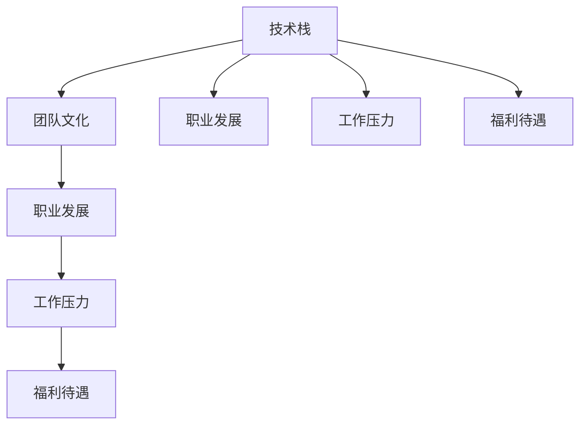

                 

# 程序员如何评估工作机会

## 1. 背景介绍

在当今快速发展的技术生态中，程序员作为软件开发的核心力量，面临着大量的职业机会。如何在众多选择中找到最适合自己发展的岗位，是每个职业发展过程中不可回避的重要问题。本文将从核心概念、评估步骤、常见陷阱及未来发展趋势等方面，深入探讨程序员如何评估和选择适合自己的工作机会。

## 2. 核心概念与联系

### 2.1 核心概念概述

在进行职业选择时，我们首先需要理解一些核心概念，并了解它们之间的关系：

- **技术栈（Technical Stack）**：程序员所需掌握的技术工具、语言和框架的集合。例如，Java、Python、Node.js等。
- **团队文化（Team Culture）**：公司内部的价值观、工作氛围、团队协作方式等。
- **职业发展（Career Development）**：个人在职业路径上的规划与成长，包括晋升、培训、学习等。
- **工作压力（Work Pressure）**：工作强度、任务紧迫度、工作环境等。
- **福利待遇（Benefits）**：薪酬、健康保险、带薪休假、股票期权等。

这些概念相互影响，共同构成了评估工作机会的框架。例如，团队文化与职业发展紧密相关，工作压力与福利待遇常常相互制约。

### 2.2 核心概念原理和架构的 Mermaid 流程图



这个流程图展示了技术栈、团队文化、职业发展、工作压力和福利待遇之间的关系。技术栈和职业发展相互促进，而工作压力和福利待遇则是互为因果的关系。

## 3. 核心算法原理 & 具体操作步骤

### 3.1 算法原理概述

评估工作机会的本质是一个多目标优化问题，需要平衡和权衡多个因素。我们可以使用加权评分系统来量化每个因素的重要性和实际影响，并综合考虑它们对个人职业发展的影响。

### 3.2 算法步骤详解

#### 3.2.1 确定评估标准

首先需要确定评估标准，例如：
- **技术成长**：学习新技术、参与重要项目的机会。
- **职业晋升**：晋升通道、培训计划、导师制度等。
- **团队氛围**：团队协作、沟通方式、管理风格等。
- **工作负荷**：工作强度、任务难度、时间紧迫度等。
- **薪酬福利**：薪资水平、福利待遇、带薪休假等。

#### 3.2.2 收集数据

根据评估标准，收集相关数据，包括：
- **技术面试结果**：编程题难度、技术深度、团队面试经验等。
- **团队沟通记录**：团队会议频率、信息透明度、反馈机制等。
- **职业发展路径**：晋升标准、培训计划、内部轮岗机会等。
- **工作负荷评估**：任务量、工作节奏、加班情况等。
- **福利待遇调查**：薪资水平、五险一金、带薪休假等。

#### 3.2.3 加权评分

为每个评估标准分配一个权重，并根据实际情况给每个数据点打分。例如，可以将技术成长设为0.3，职业晋升设为0.2，团队氛围设为0.25，工作负荷设为0.15，福利待遇设为0.1。

#### 3.2.4 计算综合评分

将每个数据点的得分乘以其对应的权重，并求和得到综合评分。例如：

$$
\text{综合评分} = 0.3 \times \text{技术成长得分} + 0.2 \times \text{职业晋升得分} + 0.25 \times \text{团队氛围得分} + 0.15 \times \text{工作负荷得分} + 0.1 \times \text{福利待遇得分}
$$

### 3.3 算法优缺点

#### 3.3.1 优点

- **系统性**：通过量化评估，使得每个因素在评估过程中都被考虑，避免了主观偏见。
- **可比性**：可以将多个工作机会进行对比，找出最符合自己职业规划的岗位。
- **动态调整**：随着时间和环境的变化，可以调整评估标准和权重，持续优化评估结果。

#### 3.3.2 缺点

- **数据获取难度**：有些信息可能难以直接获取，需要一定的调查和沟通技巧。
- **主观因素影响**：即使使用加权评分系统，个人感受和价值观仍然会影响评估结果。
- **复杂性**：需要投入一定的时间和精力进行评估和计算。

### 3.4 算法应用领域

该算法适用于任何需要评估和选择职业机会的程序员，无论是在初入职场的新人，还是在寻找新机会的老手，都能从中受益。在招聘面试、团队选择、职业规划等方面，该算法都能提供科学的决策依据。

## 4. 数学模型和公式 & 详细讲解

### 4.1 数学模型构建

假设一个工作机会有n个评估标准，每个标准对应的权重为w_i，得分值为s_i，则综合评分的数学模型为：

$$
\text{综合评分} = \sum_{i=1}^{n} w_i \times s_i
$$

### 4.2 公式推导过程

以团队氛围为例，推导加权评分的计算过程。设团队氛围的权重为w，得分值为s，综合评分为C，则公式为：

$$
C = w \times s
$$

当权重w和得分值s分别为固定值时，C的值也固定。若权重和得分值发生变化，则综合评分也会相应调整。

### 4.3 案例分析与讲解

某程序员在面试A、B两家公司，根据其技术栈匹配度、职业晋升机会、团队氛围、工作负荷和福利待遇，进行如下评估：

| 公司  | 技术栈匹配度 | 职业晋升机会 | 团队氛围 | 工作负荷 | 福利待遇 |
|-------|-------------|-------------|----------|----------|----------|
| A公司  | 4           | 3           | 4        | 3        | 3        |
| B公司  | 3           | 4           | 3        | 4        | 4        |

假设评估标准的权重分别为：技术栈匹配度0.3，职业晋升机会0.2，团队氛围0.25，工作负荷0.15，福利待遇0.1。计算A、B公司的综合评分：

A公司综合评分 = 0.3 × 4 + 0.2 × 3 + 0.25 × 4 + 0.15 × 3 + 0.1 × 3 = 3.85

B公司综合评分 = 0.3 × 3 + 0.2 × 4 + 0.25 × 3 + 0.15 × 4 + 0.1 × 4 = 3.75

因此，根据评估标准和权重，A公司综合评分高于B公司，程序员选择A公司可能更为合适。

## 5. 项目实践：代码实例和详细解释说明

### 5.1 开发环境搭建

评估工作机会的核心在于数据的收集和处理，可以使用Python进行开发。首先需要安装Python和相关的数据分析库：

```bash
pip install pandas numpy matplotlib
```

### 5.2 源代码详细实现

下面的代码展示了如何使用Python进行加权评分系统的实现：

```python
import pandas as pd

# 定义评估标准和权重
standards = ['技术成长', '职业晋升', '团队氛围', '工作负荷', '福利待遇']
weights = [0.3, 0.2, 0.25, 0.15, 0.1]

# 收集数据
data = {
    '技术成长': [4, 3],
    '职业晋升': [3, 4],
    '团队氛围': [4, 3],
    '工作负荷': [3, 4],
    '福利待遇': [3, 4]
}
scores = pd.DataFrame(data)

# 计算综合评分
scores['评分'] = scores.dot(weights)

# 输出结果
print(scores)
```

### 5.3 代码解读与分析

在代码中，首先定义了评估标准和对应的权重，然后收集了A、B两家公司的评估数据。使用Pandas库的dot方法进行加权评分计算，最终得到A、B公司的综合评分。

## 6. 实际应用场景

### 6.1 招聘面试评估

在招聘面试过程中，可以将候选人的技术面试结果、项目经验、沟通能力等因素进行评估，并计算综合评分，选择最符合岗位需求的候选人。

### 6.2 团队选择

在加入新团队时，可以通过评估团队的技术栈匹配度、工作节奏、管理风格等因素，选择最适合自己的工作环境。

### 6.3 职业规划

在职业规划阶段，可以根据过往的工作经历和目标岗位的评估标准，评估不同机会的综合评分，选择最符合自己职业发展的方向。

### 6.4 未来应用展望

未来，随着AI和大数据技术的进步，评估系统可以更加智能化和自动化。例如，使用自然语言处理技术自动分析公司评价和员工反馈，动态调整评估标准和权重，提供更精准的推荐。

## 7. 工具和资源推荐

### 7.1 学习资源推荐

- **《Python数据科学手册》**：介绍了Python在数据科学和分析中的应用，适合编程和数据处理的基础学习。
- **《数据分析实战》**：讲解了数据分析的基本流程和常用技术，适合数据科学和商业分析的学习。
- **Kaggle**：数据科学竞赛平台，可以参与各种数据处理和模型竞赛，积累实战经验。

### 7.2 开发工具推荐

- **Jupyter Notebook**：交互式编程环境，适合数据探索和模型调试。
- **GitHub**：代码托管平台，可以共享和协作开发。
- **Docker**：容器化工具，便于在不同环境中复现和部署应用。

### 7.3 相关论文推荐

- **《机器学习实战》**：介绍了机器学习的基本概念和应用案例，适合初学者和进阶者。
- **《深度学习》**：由Ian Goodfellow等人撰写，全面介绍了深度学习的基础理论和前沿技术。
- **《数据科学与人工智能》**：涵盖数据科学、机器学习和人工智能的各个方面，适合全面学习。

## 8. 总结：未来发展趋势与挑战

### 8.1 研究成果总结

评估工作机会的加权评分系统，通过系统化、量化的方法，帮助程序员平衡多个因素，找到最适合自己的工作机会。该方法已经被广泛应用于招聘面试、团队选择和职业规划等方面，展示了其在实际应用中的价值。

### 8.2 未来发展趋势

- **自动化**：未来的评估系统可以更加智能化和自动化，通过AI和大数据分析技术，自动收集和处理数据，提供更精准的推荐。
- **数据融合**：将更多维度和来源的数据融入评估模型，提高评估结果的全面性和准确性。
- **用户定制**：根据用户的偏好和需求，提供个性化的评估和推荐服务。

### 8.3 面临的挑战

- **数据隐私**：评估过程中可能涉及个人隐私信息，如何保护数据安全是一个重要的挑战。
- **多目标优化**：评估标准和权重的选择可能存在主观性，需要设计合理的机制来确保公正和客观。
- **实时更新**：公司环境和岗位需求在不断变化，如何及时更新评估系统，保持其时效性是一个难题。

### 8.4 研究展望

未来的研究工作需要解决上述挑战，进一步提高评估系统的科学性和适用性。例如，引入机器学习和深度学习技术，自动学习评估标准和权重，提升系统的智能化水平。同时，加强数据隐私保护和安全措施，确保用户数据的安全。

## 9. 附录：常见问题与解答

**Q1: 如何评估技术栈匹配度？**

A: 可以通过面试技术问题、项目经验和工作案例，评估候选人的技术水平和匹配度。

**Q2: 如何评估职业晋升机会？**

A: 了解公司的晋升制度、培训计划、内部轮岗机会等，并与公司员工进行交流，获取真实反馈。

**Q3: 如何评估团队氛围？**

A: 观察团队成员的沟通方式、管理风格、信息透明度等，可以参加团队会议、面试多轮等方式，深入了解团队文化。

**Q4: 如何评估工作负荷？**

A: 了解公司的工作节奏、任务量、加班情况等，可以通过与现有员工交流、查阅项目进度等方式，获取相关信息。

**Q5: 如何评估福利待遇？**

A: 了解公司提供的薪酬、健康保险、带薪休假等福利，可以通过公司官网、招聘信息、员工反馈等渠道，获取相关信息。

---

作者：禅与计算机程序设计艺术 / Zen and the Art of Computer Programming

