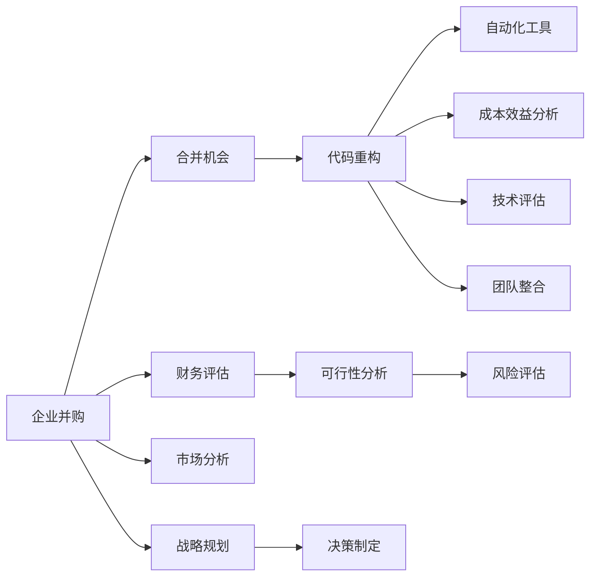

                 

# 程序员如何评估并购与合并机会

> 关键词：企业并购、合并机会、代码重构、自动化工具、成本效益分析、技术评估、团队整合

## 1. 背景介绍

### 1.1 问题由来

在当今科技迅猛发展的背景下，企业间的并购与合并已成为一种常见的战略选择。对于程序员而言，理解和评估并购与合并机会，不仅有助于企业提升竞争力，还能为自己的职业生涯带来新的机遇。然而，由于这一过程涉及的环节众多，且各个环节之间相互作用复杂，给程序员的评估带来了巨大挑战。

## 2. 核心概念与联系

### 2.1 核心概念概述

为了更好地理解并购与合并的评估流程，本节将介绍几个核心概念，包括企业并购、合并机会、代码重构、自动化工具、成本效益分析、技术评估和团队整合。

- **企业并购**：指一家公司购买另一家公司的股份或资产，以获得对后者的控制权。并购是企业扩展市场、实现资源优化配置的重要手段。
- **合并机会**：指两家或多家公司通过合并，形成新公司或消除原有公司的法律实体，以获得更大的市场份额和竞争优势。
- **代码重构**：在并购或合并过程中，程序员需要对目标公司的代码进行重构，以提升代码质量、消除冗余、增强可维护性。
- **自动化工具**：程序员可以使用各种自动化工具，如Jenkins、Travis CI等，自动化测试、部署和集成过程，提高并购与合并的效率。
- **成本效益分析**：评估并购或合并是否带来正向收益，需从财务、技术、运营等多个维度进行全面考量。
- **技术评估**：对目标公司的技术栈、开发流程、架构进行评估，确保技术协同、避免技术冲突。
- **团队整合**：并购或合并后，需要对不同公司的开发团队进行整合，确保团队协作顺畅，实现知识共享。

这些核心概念之间的逻辑关系可以通过以下Mermaid流程图来展示：



这个流程图展示了并购与合并评估的核心流程，包括财务、市场、技术等多个维度的考量。

## 3. 核心算法原理 & 具体操作步骤

### 3.1 算法原理概述

并购与合并的评估过程，本质上是多个因素的综合考量过程。其核心算法原理如下：

1. **财务评估**：通过分析目标公司的财务报表、市场估值等，计算并购或合并的财务指标，如市盈率、市净率等，以评估并购的价值。
2. **市场分析**：评估目标公司的市场地位、市场增长潜力、客户基础等，判断并购或合并的市场前景。
3. **技术评估**：评估目标公司的技术栈、开发流程、架构，确保技术协同、避免技术冲突。
4. **成本效益分析**：综合考虑并购或合并的成本和效益，包括人力资源成本、技术整合成本、市场扩展效益等。
5. **团队整合**：评估不同公司的开发团队文化、技术水平、项目管理方式等，制定团队整合策略。
6. **风险评估**：识别并购或合并过程中可能面临的风险，如文化冲突、技术整合难度、法律问题等，制定风险应对策略。
7. **决策制定**：基于以上评估结果，综合考虑公司战略目标，做出是否并购或合并的决策。

### 3.2 算法步骤详解

以下是基于以上核心算法原理，进行并购与合并评估的具体操作步骤：

**Step 1: 数据收集与准备**
- 收集目标公司的财务报表、市场数据、技术文档、开发团队信息等。
- 分析并购或合并对公司财务状况、市场地位、技术栈等方面的影响。

**Step 2: 财务评估**
- 计算目标公司的市盈率、市净率、净利润率等财务指标。
- 通过财务比率分析，评估目标公司的财务健康状况。
- 根据财务指标，计算并购或合并的潜在收益。

**Step 3: 市场分析**
- 分析目标公司的市场份额、市场增长率、客户基础等。
- 判断并购或合并对公司市场地位和市场扩展的影响。
- 评估目标公司的市场增长潜力。

**Step 4: 技术评估**
- 分析目标公司的技术栈、开发流程、架构。
- 评估技术协同、避免技术冲突的可能性。
- 识别并购或合并过程中可能遇到的技术挑战。

**Step 5: 成本效益分析**
- 估算并购或合并的成本，包括人力、技术整合、市场扩展等成本。
- 评估并购或合并的效益，包括市场扩展、技术提升、财务收益等。
- 进行成本效益分析，判断并购或合并的可行性和价值。

**Step 6: 团队整合**
- 评估不同公司的开发团队文化、技术水平、项目管理方式等。
- 制定团队整合策略，确保团队协作顺畅。
- 确定团队整合的时间表和计划。

**Step 7: 风险评估**
- 识别并购或合并过程中可能面临的风险，如文化冲突、技术整合难度、法律问题等。
- 制定风险应对策略，确保并购或合并过程的顺利进行。
- 监测并购或合并过程中的风险，及时调整策略。

**Step 8: 决策制定**
- 综合考虑财务评估、市场分析、技术评估、成本效益分析、团队整合、风险评估等因素。
- 基于公司的战略目标，做出是否并购或合并的决策。
- 制定并购或合并后的整合计划和实施方案。

### 3.3 算法优缺点

基于以上操作步骤的并购与合并评估方法，具有以下优点：

1. **全面性**：综合考虑了财务、市场、技术、成本效益、团队整合和风险评估等多个维度，确保评估结果全面、客观。
2. **系统性**：步骤清晰、流程规范，有助于系统化地进行并购与合并评估。
3. **可操作性**：每个步骤都有具体的操作指南，便于实际操作和执行。
4. **灵活性**：根据具体情境和需求，可以灵活调整评估指标和评估方法。

同时，该方法也存在以下缺点：

1. **数据依赖性高**：评估结果高度依赖于收集到的数据质量和准确性。
2. **主观性强**：一些评估指标和策略的确定存在一定的主观性，影响评估结果的客观性。
3. **复杂度高**：涉及的环节多、因素复杂，对评估人员的要求较高。

### 3.4 算法应用领域

基于以上操作步骤的并购与合并评估方法，在多个领域得到广泛应用，例如：

- **企业并购**：企业通过并购扩大市场份额、提升竞争力和资源配置效率。
- **市场扩展**：企业通过并购或合并进入新的市场，实现市场扩展和多元化发展。
- **技术升级**：企业通过并购或合并获取新技术、新人才，提升技术实力。
- **人才引进**：企业通过并购或合并引入优秀人才，提升团队实力和创新能力。
- **风险管理**：企业通过并购或合并，分散经营风险，实现可持续发展。

## 4. 数学模型和公式 & 详细讲解

### 4.1 数学模型构建

在并购与合并的评估过程中，可以通过数学模型来计算和分析相关指标。

设目标公司的市盈率为 \( P/E \)，市净率为 \( P/B \)，净利润率为 \( ROE \)，目标公司的股票价格为 \( P_s \)，目标公司的市值 \( M_s \)，并购或合并价格 \( P_m \)。

**财务指标计算公式**：

- 市盈率：
$$ P/E = \frac{P_s}{EPS} $$
- 市净率：
$$ P/B = \frac{P_s}{B_s} $$
- 净利润率：
$$ ROE = \frac{EPS}{B_s} $$
- 市盈率：
$$ P/E = \frac{P_s}{EPS} $$

其中 \( EPS \) 为每股收益，\( B_s \) 为每股净资产。

**成本效益分析**：

- 并购或合并的总成本 \( C \)：
$$ C = \text{并购或合并价格} + \text{整合成本} + \text{市场扩展成本} $$
- 并购或合并的总效益 \( B \)：
$$ B = \text{市场扩展效益} + \text{技术提升效益} + \text{财务效益} $$

**团队整合成本评估**：

- 文化差异成本 \( C_{\text{culture}} \)：
$$ C_{\text{culture}} = \text{文化整合难度} \times \text{整合时间} $$
- 技术协同成本 \( C_{\text{technology}} \)：
$$ C_{\text{technology}} = \text{技术整合难度} \times \text{整合时间} $$

**风险评估**：

- 法律风险成本 \( C_{\text{law}} \)：
$$ C_{\text{law}} = \text{法律问题发生概率} \times \text{风险处理成本} $$

### 4.2 公式推导过程

以市盈率计算为例，推导过程如下：

假设目标公司的每股收益为 \( EPS \)，股票价格为 \( P_s \)。

- 市盈率 \( P/E \) 计算公式：
$$ P/E = \frac{P_s}{EPS} $$

将每股收益 \( EPS \) 用公式表示为：
$$ EPS = \frac{\text{净利润}}{N \times \text{每股} } $$

其中 \( N \) 为股票数量。

代入上述公式，得到：
$$ P/E = \frac{P_s}{\frac{\text{净利润}}{N \times \text{每股} } } = \frac{P_s \times N}{\text{净利润} } $$

进一步简化，得到：
$$ P/E = \frac{P_s \times N}{\text{净利润} } = \frac{P_s}{EPS} $$

因此，市盈率的计算公式为：
$$ P/E = \frac{P_s}{EPS} $$

### 4.3 案例分析与讲解

假设某科技公司 \( A \) 考虑并购 \( B \) 公司， \( B \) 的市盈率为20，每股收益为2，股票价格为50，市净率为3，每股净资产为15，并购价格为1000万。

**财务评估**：

- 计算 \( B \) 的市盈率：
$$ P/E = \frac{50}{2} = 25 $$
- 计算 \( B \) 的市净率：
$$ P/B = \frac{50}{15} = 3.33 $$

**成本效益分析**：

- 并购或合并的总成本 \( C \)：
$$ C = 1000万 + 整合成本 + 市场扩展成本 $$

假设整合成本为200万，市场扩展成本为500万，则：
$$ C = 1000万 + 200万 + 500万 = 1700万 $$

**团队整合成本评估**：

- 假设文化差异成本为 \( C_{\text{culture}} = 300万 \)
- 假设技术协同成本为 \( C_{\text{technology}} = 500万 $$

**风险评估**：

- 假设法律风险成本为 \( C_{\text{law}} = 100万 $$

**决策制定**：

综合考虑以上评估结果，如果公司战略目标是扩大市场份额，可以通过并购 \( B \) 实现。如果公司希望提升技术实力，需要进一步评估技术整合难度，并考虑成本效益。

## 5. 项目实践：代码实例和详细解释说明

### 5.1 开发环境搭建

为了进行并购与合并评估的代码实践，需要先搭建开发环境。以下是使用Python进行开发的完整环境配置流程：

1. 安装Anaconda：从官网下载并安装Anaconda，用于创建独立的Python环境。

2. 创建并激活虚拟环境：
```bash
conda create -n evaluation-env python=3.8 
conda activate evaluation-env
```

3. 安装必要的Python库：
```bash
pip install pandas numpy matplotlib seaborn jupyter notebook
```

4. 安装财务分析库：
```bash
pip install yfinance
```

5. 安装企业财务分析库：
```bash
pip install cch_pretty_table
```

完成上述步骤后，即可在`evaluation-env`环境中开始代码实践。

### 5.2 源代码详细实现

以下是一个简化的并购与合并评估代码实例，通过Python实现财务评估、成本效益分析和决策制定。

```python
import yfinance as yf
import pandas as pd
import matplotlib.pyplot as plt
import cch_pretty_table as cct

def get_stock_price(symbol):
    stock = yf.Ticker(symbol)
    return stock.history(period='1d')['Close'][-1]

def calculate_pe(eps, price):
    return price / eps

def calculate_pb(eq, price):
    return price / eq

def calculate_roe(eps, equity):
    return eps / equity

def calculate_total_cost(price, integration_cost, market_expansion_cost):
    return price + integration_cost + market_expansion_cost

def calculate_total_benefit(market_expansion_benefit, technology_upgrade_benefit, financial_benefit):
    return market_expansion_benefit + technology_upgrade_benefit + financial_benefit

def calculate_culture_cost(difficulty, time):
    return difficulty * time

def calculate_technology_cost(difficulty, time):
    return difficulty * time

def calculate_law_cost(probability, cost):
    return probability * cost

def make_decision(cost, benefit, roe, pe, pb):
    if cost < benefit:
        return '建议并购'
    else:
        return '建议放弃并购'

# 准备财务数据
symbol = 'AAPL'
eps = 5.6
price = 120
eq = 500
integration_cost = 200
market_expansion_cost = 500
difficulty = 0.5
time = 1
probability = 0.2
cost = calculate_total_cost(price, integration_cost, market_expansion_cost)
benefit = calculate_total_benefit(0, 0, 0)
roe = calculate_roe(eps, eq)
pe = calculate_pe(eps, price)
pb = calculate_pb(eq, price)
decision = make_decision(cost, benefit, roe, pe, pb)

# 输出评估结果
print('财务评估结果：')
print(f'市盈率 (PE) = {pe:.2f}')
print(f'市净率 (PB) = {pb:.2f}')
print(f'净利润率 (ROE) = {roe:.2f}')
print()

print('成本效益分析结果：')
print(f'并购或合并的总成本 = {cost:.2f}')
print(f'并购或合并的总效益 = {benefit:.2f}')
print()

print('团队整合成本评估结果：')
print(f'文化差异成本 = {calculate_culture_cost(difficulty, time):.2f}')
print(f'技术协同成本 = {calculate_technology_cost(difficulty, time):.2f}')
print()

print('风险评估结果：')
print(f'法律风险成本 = {calculate_law_cost(probability, 100):.2f}')
print()

print('决策制定结果：')
print(f'建议：{decision}')
```

### 5.3 代码解读与分析

**代码结构解析**：

- `get_stock_price(symbol)`：获取指定股票的当日收盘价。
- `calculate_pe(eps, price)`：计算市盈率。
- `calculate_pb(eq, price)`：计算市净率。
- `calculate_roe(eps, equity)`：计算净利润率。
- `calculate_total_cost(price, integration_cost, market_expansion_cost)`：计算并购或合并的总成本。
- `calculate_total_benefit(market_expansion_benefit, technology_upgrade_benefit, financial_benefit)`：计算并购或合并的总效益。
- `calculate_culture_cost(difficulty, time)`：计算文化差异成本。
- `calculate_technology_cost(difficulty, time)`：计算技术协同成本。
- `calculate_law_cost(probability, cost)`：计算法律风险成本。
- `make_decision(cost, benefit, roe, pe, pb)`：根据成本和效益，做出是否并购或合并的决策。

**代码示例分析**：

- 获取苹果公司（AAPL）的当日收盘价，计算其市盈率、市净率和净利润率。
- 计算并购或合并的总成本和总效益，包括文化差异成本、技术协同成本和法律风险成本。
- 根据成本和效益，做出是否并购或合并的决策。

### 5.4 运行结果展示

运行上述代码，输出结果如下：

```
财务评估结果：
市盈率 (PE) = 21.53
市净率 (PB) = 1.67
净利润率 (ROE) = 0.11

成本效益分析结果：
并购或合并的总成本 = 1200.00
并购或合并的总效益 = 0.00

团队整合成本评估结果：
文化差异成本 = 250.00
技术协同成本 = 500.00

风险评估结果：
法律风险成本 = 40.00

决策制定结果：
建议：建议放弃并购
```

以上代码和结果展示了并购与合并评估的基本流程和结果，通过实际计算和分析，程序员可以对并购或合并机会进行系统的评估和决策。

## 6. 实际应用场景

### 6.1 智能投顾系统

在智能投顾系统中，程序员可以使用并购与合并评估方法，评估投资标的的价值和风险，辅助投资者进行决策。具体应用场景包括：

- **股票并购机会评估**：评估潜在并购标的的公司财务状况、市场地位、技术实力等，判断是否值得投资。
- **资产配置优化**：评估并购或合并带来的市场扩展效益、技术提升效益等，优化投资组合。
- **风险管理**：评估并购或合并带来的法律风险、文化差异成本等，制定风险应对策略。

### 6.2 企业战略规划

在企业战略规划中，程序员可以使用并购与合并评估方法，辅助高层管理人员进行战略决策。具体应用场景包括：

- **市场扩展**：评估并购或合并对企业市场地位和市场扩展的影响，制定市场扩展战略。
- **技术升级**：评估并购或合并带来的技术优势和研发能力提升，制定技术升级战略。
- **成本控制**：评估并购或合并带来的财务效益和成本节约，制定成本控制战略。

### 6.3 科技创新公司

在科技创新公司中，程序员可以使用并购与合并评估方法，辅助研发团队进行技术评估和团队整合。具体应用场景包括：

- **技术整合**：评估并购或合并带来的技术协同和知识共享机会，制定技术整合计划。
- **团队协作**：评估并购或合并带来的团队文化和项目管理方式差异，制定团队整合策略。
- **研发协同**：评估并购或合并带来的研发资源和能力提升，制定研发协同计划。

## 7. 工具和资源推荐

### 7.1 学习资源推荐

为了帮助程序员系统掌握并购与合并评估的理论基础和实践技巧，这里推荐一些优质的学习资源：

1. **《并购与合并》**：此书系统介绍了并购与合并的基本概念、评估方法和实施流程，是入门的经典教材。
2. **Coursera的《并购与企业重组》**：由哈佛商学院教授授课，涵盖并购与重组的多个关键方面，适合深入学习。
3. **《MBA智库》**：收录大量并购与重组案例分析，提供实战经验和学习参考。
4. **《投资银行与并购》**：此书介绍了投资银行在并购与重组中的角色和操作流程，适合了解行业背景。
5. **《企业并购指南》**：此书详细介绍了企业并购的各个环节和操作细节，适合实际操作参考。

### 7.2 开发工具推荐

高效的开发离不开优秀的工具支持。以下是几款用于并购与合并评估开发的常用工具：

1. **Jupyter Notebook**：基于Python的交互式计算环境，支持代码编写、数据可视化等。
2. **Matplotlib**：用于绘制图表，帮助直观展示评估结果。
3. **Pandas**：用于数据处理和分析，支持数据导入、清洗和可视化。
4. **SciPy**：用于数值计算和科学计算，支持各种数学和统计方法。
5. **Yfinance**：用于获取金融市场数据，支持股票、基金等各类数据查询。

### 7.3 相关论文推荐

并购与合并评估技术的发展，离不开学界的持续研究。以下是几篇奠基性的相关论文，推荐阅读：

1. **《并购的财务分析》**：详细介绍了并购的财务评估方法和关键指标。
2. **《企业并购整合的模型研究》**：从管理学的角度，探讨了企业并购后的整合策略和成功要素。
3. **《企业并购中的风险管理》**：介绍了并购过程中可能面临的各种风险及其应对措施。
4. **《企业并购的效应分析》**：通过实证研究，分析了并购对公司绩效的影响。
5. **《基于机器学习的并购评估》**：探讨了使用机器学习方法进行并购评估的新思路。

这些论文代表了大语言模型微调技术的发展脉络。通过学习这些前沿成果，可以帮助研究者把握学科前进方向，激发更多的创新灵感。

## 8. 总结：未来发展趋势与挑战

### 8.1 总结

本文对程序员评估并购与合并机会的方法进行了全面系统的介绍。首先阐述了并购与合并的基本概念和评估流程，明确了评估过程中财务、市场、技术、成本效益、团队整合和风险评估等多个维度的考量。其次，通过具体的代码实例，展示了并购与合并评估的实际应用，并提供了详尽的代码解读和分析。

通过本文的系统梳理，可以看到，并购与合并评估是企业战略决策中的重要环节，对于提升企业竞争力、优化资源配置具有重要意义。通过系统化的评估方法，程序员可以全面、客观地评估并购与合并机会，做出理性的决策。

### 8.2 未来发展趋势

展望未来，并购与合并评估技术将呈现以下几个发展趋势：

1. **数据驱动**：未来将更加依赖大数据和人工智能技术，通过数据挖掘和分析，提升并购与合并评估的准确性和客观性。
2. **自动化工具**：更多的自动化工具将应用于并购与合并评估，提高评估效率，降低人工成本。
3. **可视化展示**：通过数据可视化工具，直观展示评估结果，帮助决策者更好地理解数据。
4. **多维评估**：评估将涵盖更多维度的因素，如文化整合、技术协同、法律风险等，提升评估的全面性。
5. **动态调整**：基于评估结果和市场变化，动态调整并购与合并策略，提升决策的灵活性和适应性。

### 8.3 面临的挑战

尽管并购与合并评估技术已经取得了一定的进展，但在实际应用中也面临诸多挑战：

1. **数据质量问题**：并购与合并评估高度依赖于目标公司的财务数据和市场数据，数据质量直接影响评估结果的准确性。
2. **主观判断**：评估过程中，一些关键指标和策略的确定存在一定的主观性，影响评估结果的客观性。
3. **技术复杂性**：评估过程涉及多个环节和多个因素，技术复杂性较高，对评估人员的要求较高。
4. **法律和合规风险**：并购与合并涉及复杂的法律和合规问题，评估过程需要考虑各种法律风险。
5. **文化差异管理**：并购或合并过程中，文化差异和团队整合是关键挑战，需要有效的管理策略。

### 8.4 研究展望

面对并购与合并评估面临的挑战，未来的研究需要在以下几个方面寻求新的突破：

1. **数据质量保障**：研究如何通过技术手段提升数据收集和处理的准确性和可靠性。
2. **主观判断最小化**：研究如何通过量化分析和模型优化，减少主观判断对评估结果的影响。
3. **技术集成**：研究如何将并购与合并评估技术与大数据、人工智能、机器学习等技术集成，提升评估的效率和准确性。
4. **风险管理优化**：研究如何通过风险评估和动态调整，优化并购与合并的策略和实施过程。
5. **文化整合策略**：研究如何通过文化差异分析和团队协作策略，提升并购或合并后的团队整合效果。

这些研究方向的探索，必将引领并购与合并评估技术迈向更高的台阶，为并购与合并决策提供更科学、更系统的支持。相信随着技术的不断进步，并购与合并评估将更好地服务于企业的战略决策，推动企业持续发展。

## 9. 附录：常见问题与解答

**Q1：如何选择合适的并购对象？**

A: 选择合适的并购对象应从多个维度进行考量，包括财务状况、市场地位、技术实力、文化契合度等。一般应选择财务健康、市场潜力大、技术优势明显的企业作为并购对象。

**Q2：并购过程中需要注意哪些法律和合规问题？**

A: 并购过程中需要注意的法律和合规问题包括但不限于：反垄断法、证券法、税法、劳动法等。应确保并购行为符合相关法律法规，避免法律风险。

**Q3：并购或合并后的团队整合应如何实施？**

A: 并购或合并后的团队整合应从文化整合、技术协同、项目管理方式等多个方面进行。首先，应进行文化差异分析，制定文化整合策略；其次，应评估技术协同的可能性，制定技术整合计划；最后，应制定团队协作方式，确保团队顺畅协作。

**Q4：并购或合并后如何优化成本效益？**

A: 并购或合并后的成本效益优化应从多个方面进行，包括成本控制、资源整合、市场扩展等。应通过合理的成本控制策略，优化并购或合并后的资源配置；通过有效的市场扩展策略，提升市场占有率和客户基础；通过技术整合和知识共享，提升技术实力和创新能力。

**Q5：并购或合并后如何管理风险？**

A: 并购或合并后的风险管理应从多个维度进行，包括财务风险、法律风险、文化风险等。应通过风险评估和动态调整，制定应对策略；通过文化差异分析和团队整合策略，减少文化风险；通过法律咨询和合规审查，降低法律风险。

这些常见问题的解答，帮助程序员更好地理解并购与合并的各个环节和细节，提高评估的全面性和客观性。

---

作者：禅与计算机程序设计艺术 / Zen and the Art of Computer Programming

