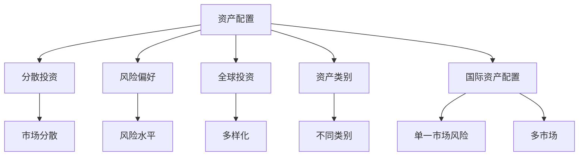

                 

# 程序员如何进行国际资产配置

## 1. 背景介绍

随着全球化进程的不断深入，国际资产配置已经成为越来越多投资者关注的焦点。对于程序员而言，由于其在数据处理和算法开发方面的独特优势，他们往往在处理复杂的财务问题时更具优势。本文将系统介绍国际资产配置的基本概念、原理及具体操作方法，帮助程序员更好地理解和实践这一过程。

## 2. 核心概念与联系

### 2.1 核心概念概述

在讨论国际资产配置时，我们需要理解以下几个关键概念：

- **资产配置（Asset Allocation）**：指将资金在不同资产类别之间进行分配，如股票、债券、现金等，以实现风险分散和收益最大化。
- **分散投资（Diversification）**：通过投资不同领域、不同市场或不同类型的资产，降低投资组合的整体风险。
- **风险偏好（Risk Tolerance）**：投资者的风险承受能力，决定其愿意承受多少投资风险。
- **全球投资（Global Investing）**：在全球范围内分散投资，获取全球市场的收益，并分散单一市场风险。
- **资产类别（Asset Class）**：指股票、债券、现金等不同类型的资产，其特性和风险收益特征各不相同。
- **国际资产配置（International Asset Allocation）**：将资产配置到不同国家或地区的市场，以利用全球市场的多样性和机会。

### 2.2 核心概念原理和架构的 Mermaid 流程图



这个流程图展示了国际资产配置的主要过程：
1. **资产配置**：在多个资产类别间分配资金。
2. **分散投资**：通过投资不同市场或资产类别降低风险。
3. **风险偏好**：根据个人或机构的承受能力调整配置。
4. **全球投资**：在不同国家和地区投资。
5. **国际资产配置**：在多个国际市场配置资产。
6. **多市场风险**：利用全球分散来降低。
7. **多样化**：在不同资产类别中分散。

## 3. 核心算法原理 & 具体操作步骤

### 3.1 算法原理概述

国际资产配置的算法原理主要基于以下几个核心模型：

- **马科维茨（Markowitz）模型**：通过优化组合中各资产的期望收益率和协方差矩阵，实现风险最小化或收益最大化。
- **黑-利（Black-Litterman）模型**：将投资者对资产的看法（贝叶斯先验）与市场均衡（市场先验）相结合，通过贝叶斯更新获取最优资产配置。
- **风险平价（Risk Parity）**：根据各资产的风险贡献比例，动态调整配置，使每个资产的风险贡献相同。
- **均值方差（Mean-Variance）**：通过计算资产的期望收益率和标准差，评估不同组合的风险和收益。

### 3.2 算法步骤详解

以下是国际资产配置的具体操作步骤：

**Step 1: 数据收集**
- 收集全球各类资产的历史价格、收益、波动率等数据。
- 分析宏观经济数据，如GDP增长、通胀率、货币政策等。
- 分析微观经济数据，如企业盈利、行业趋势等。

**Step 2: 数据预处理**
- 对数据进行清洗和归一化，去除异常值和噪声。
- 将时间序列数据转化为平稳的收益率序列。

**Step 3: 模型构建**
- 基于收集到的数据构建多资产组合模型。
- 使用历史数据估计资产间的相关性矩阵。

**Step 4: 风险评估**
- 计算不同资产组合的风险（如波动率、最大回撤等）。
- 根据风险偏好设定风险限额。

**Step 5: 优化配置**
- 使用马科维茨、黑-利或风险平价等模型优化配置。
- 调整资产类别权重，使组合达到最优风险收益比。

**Step 6: 监控调整**
- 定期评估配置效果，根据市场变化调整权重。
- 通过再平衡策略保持配置均衡。

**Step 7: 实施策略**
- 根据优化后的配置方案，进行实际的资产买卖操作。

### 3.3 算法优缺点

国际资产配置的算法优点包括：

- **风险分散**：通过在全球范围内分散投资，降低单一市场风险。
- **收益潜力**：利用全球市场的增长机会，获取更高的收益。
- **长期稳定**：通过科学合理的配置策略，保持长期收益稳定。

其缺点主要包括：

- **复杂性**：模型构建和优化过程较为复杂，需要大量计算资源。
- **市场风险**：全球市场联动，可能导致整体收益波动。
- **数据依赖**：需要大量历史数据，数据质量和真实性直接影响配置结果。

### 3.4 算法应用领域

国际资产配置不仅适用于个人投资者，还广泛应用在机构投资者、资产管理公司、私募基金等领域。具体应用场景包括：

- **养老金基金**：通过分散投资，降低养老金基金的风险，实现长期稳定收益。
- **保险投资**：分散投资于不同资产类别，保障保险公司投资组合的稳定性。
- **共同基金**：为投资者提供跨市场、跨资产类别的投资组合。
- **家族办公室**：通过国际资产配置，满足家族财富管理和传承的需求。

## 4. 数学模型和公式 & 详细讲解 & 举例说明

### 4.1 数学模型构建

国际资产配置的数学模型主要涉及以下变量：

- **资产收益率**：$r_{i,t}$，表示资产$i$在时期$t$的收益率。
- **资产方差**：$\sigma_{i}^2$，表示资产$i$的方差。
- **资产协方差**：$\rho_{i,j}$，表示资产$i$和资产$j$的协方差。
- **无风险收益率**：$r_f$，无风险资产的收益率。

### 4.2 公式推导过程

假设有一个包含$m$个资产的国际投资组合，其权重为$w_i$，$i=1,...,m$，则该组合的期望收益率和方差分别为：

$$
r_p = \sum_{i=1}^m w_ir_i
$$

$$
\sigma_p^2 = \sum_{i=1}^m \sum_{j=1}^m w_iw_j\rho_{i,j}\sigma_i\sigma_j
$$

使用马科维茨模型，最大化组合的期望收益率$r_p$，同时控制组合的方差$\sigma_p$，目标函数为：

$$
\max_{w} E[r_p] = \sum_{i=1}^m w_ir_i
$$

约束条件为：

$$
\sum_{i=1}^m w_i = 1
$$

$$
\sigma_p^2 \leq \sigma^2_{\max}
$$

其中$\sigma^2_{\max}$为预设的风险限额。

### 4.3 案例分析与讲解

以一个包含美国、中国和欧洲三大市场的投资组合为例：

假设美国市场的收益率为$r_{US}=0.08$，中国市场的收益率为$r_{CN}=0.05$，欧洲市场的收益率为$r_{EU}=0.03$。资产间协方差为：

- $\rho_{US,CN}=0.3$，$r_{US}$和$r_{CN}$之间的相关系数。
- $\rho_{US,EU}=0.1$，$r_{US}$和$r_{EU}$之间的相关系数。
- $\rho_{CN,EU}=0.5$，$r_{CN}$和$r_{EU}$之间的相关系数。

设无风险收益率为$r_f=0.01$，风险限额为$\sigma^2_{\max}=0.1$。

使用马科维茨模型求解最优配置：

1. 计算组合的期望收益率和方差：
   - $r_p = w_{US} \cdot 0.08 + w_{CN} \cdot 0.05 + w_{EU} \cdot 0.03$
   - $\sigma_p^2 = w_{US}^2 \cdot 0.03^2 + w_{CN}^2 \cdot 0.05^2 + w_{EU}^2 \cdot 0.01^2 + 2w_{US}w_{CN} \cdot 0.3 \cdot 0.01 \cdot 0.05 + 2w_{US}w_{EU} \cdot 0.1 \cdot 0.08 \cdot 0.03 + 2w_{CN}w_{EU} \cdot 0.5 \cdot 0.05 \cdot 0.03$

2. 构建目标函数和约束条件：
   - $\max_{w} E[r_p] = w_{US} \cdot 0.08 + w_{CN} \cdot 0.05 + w_{EU} \cdot 0.03$
   - $\sigma_p^2 \leq 0.1$

3. 求解目标函数：
   - 使用优化算法（如CVXOPT、PuLP等）求解线性规划问题。

## 5. 项目实践：代码实例和详细解释说明

### 5.1 开发环境搭建

在进行国际资产配置的实践时，需要一个高效的数据处理和计算环境。以下是常用的Python开发环境搭建步骤：

1. 安装Python：从官网下载并安装Python 3.x版本，建议使用Anaconda发行版。
2. 创建虚拟环境：
   ```bash
   conda create --name asset-allocation python=3.8
   conda activate asset-allocation
   ```
3. 安装必要的库：
   ```bash
   pip install numpy pandas matplotlib scikit-learn cvxopt
   ```

### 5.2 源代码详细实现

下面是一个使用CVXOPT库实现马科维茨模型的Python代码示例：

```python
import numpy as np
from cvxopt import matrix, solvers

# 设定资产和权重
num_assets = 3
w = np.zeros(num_assets)
w[0] = 0.4  # 美国市场权重
w[1] = 0.3  # 中国市场权重
w[2] = 0.3  # 欧洲市场权重

# 设定资产收益率和协方差矩阵
r = np.array([0.08, 0.05, 0.03])
sigma = np.array([[0.03, 0.3 * 0.01 * 0.05, 0.1 * 0.08 * 0.03],
                  [0.3 * 0.01 * 0.05, 0.05**2, 0.5 * 0.05 * 0.03],
                  [0.1 * 0.08 * 0.03, 0.5 * 0.05 * 0.03, 0.01**2]])

# 计算组合的期望收益率和方差
r_p = np.dot(w, r)
sigma_p = np.dot(np.dot(w, sigma), w.T)

# 设定无风险收益率和风险限额
rf = 0.01
sigma_max = 0.1

# 构建目标函数和约束条件
c = np.zeros(num_assets)
c[0] = 0.08  # 美国市场期望收益率
c[1] = 0.05  # 中国市场期望收益率
c[2] = 0.03  # 欧洲市场期望收益率

G = matrix([[0, 0, -1],  # 权重和为1
            [0, 0, 0],  # 自由变量为0
            [0, 0, 0]], dense=False)

h = matrix([1, 0, 0])  # 权重和为1
A_eq = matrix(np.zeros((1, num_assets)), -1)  # 自由变量为0
b_eq = matrix(0.0)  # 自由变量为0
A_ineq = matrix([[0, 0, 0], [0, 0, 0], [0, 0, 0]], -1)  # 自由变量为0
b_ineq = matrix([1, 1, 1], -1)  # 自由变量为1
A_ineq_b = matrix([np.sqrt(sigma_max)], -1)  # 风险限额为0.1
b_ineq_b = matrix([0])  # 风险限额为0.1

# 求解线性规划问题
sol = solvers.qp(c, G, h, A_eq, b_eq, A_ineq, b_ineq, A_ineq_b, b_ineq_b)

# 输出最优权重和组合的期望收益率和方差
w_opt = sol['x']
r_p_opt = np.dot(w_opt, r)
sigma_p_opt = np.dot(np.dot(w_opt, sigma), w_opt.T)
print("最优权重：", w_opt)
print("最优期望收益率：", r_p_opt)
print("最优方差：", sigma_p_opt)
```

### 5.3 代码解读与分析

在上述代码中，我们通过CVXOPT库实现了马科维茨模型的求解过程。具体步骤如下：

1. **设定资产和权重**：首先设定各个资产的权重，这里假设美国市场权重为0.4，中国市场权重为0.3，欧洲市场权重为0.3。
2. **设定资产收益率和协方差矩阵**：根据提供的资产收益率和协方差矩阵，计算组合的期望收益率和方差。
3. **设定无风险收益率和风险限额**：根据预设的无风险收益率和风险限额，构建目标函数和约束条件。
4. **求解线性规划问题**：使用CVXOPT库的qp函数求解线性规划问题，得到最优权重。
5. **输出结果**：最后输出最优权重、组合的期望收益率和方差。

## 6. 实际应用场景

### 6.1 国际资产配置的应用场景

国际资产配置在多个领域具有广泛应用，具体场景包括：

1. **养老基金管理**：养老基金需要在多个国家进行投资，以分散风险，保障退休收入的稳定增长。
2. **家族办公室**：家族办公室管理的家族财富需要跨越多个市场和资产类别，实现财富传承和增值。
3. **跨国企业**：跨国企业需要在不同国家进行投资，以获取全球市场机会，降低单一市场的风险。
4. **保险公司**：保险公司通过全球投资分散风险，保障保险业务的稳定性和收益。

### 6.2 未来应用展望

随着全球化进程的加速，国际资产配置的重要性日益凸显。未来，这一领域将呈现以下发展趋势：

1. **人工智能的应用**：AI算法将广泛应用于数据处理和模型优化，提高配置效率和准确性。
2. **实时动态调整**：利用实时数据进行动态调整，及时应对市场变化，优化配置策略。
3. **跨市场跨境投资**：随着跨境金融市场的开放，国际资产配置将更加便捷，投资边界将进一步拓展。
4. **多层次投资组合**：投资者将构建多层次投资组合，涵盖不同风险水平和收益预期。

## 7. 工具和资源推荐

### 7.1 学习资源推荐

为帮助程序员更好地掌握国际资产配置的知识，以下是一些推荐的学习资源：

1. **《国际投资组合管理》（Principles of International Portfolio Management）**：由James R. Hubbard等作者编写，系统介绍了国际资产配置的理论和实践。
2. **Coursera《投资组合管理》课程**：由John Coates等教授教授，详细讲解了资产配置的基本原理和应用。
3. **Kaggle国际资产配置竞赛**：参与国际资产配置竞赛，通过实际数据集练习配置策略。
4. **Risk parity and Diversification: From Principles to Practice**：该书深入浅出地讲解了风险平价理论及其应用。

### 7.2 开发工具推荐

国际资产配置的实现需要高效的数据处理和计算工具，以下是一些常用的开发工具：

1. **Python**：广泛使用的编程语言，拥有丰富的数据分析和计算库。
2. **R语言**：统计分析的强大工具，尤其在数据可视化和统计建模方面表现优异。
3. **Excel**：简单易用的数据处理和可视化工具，适用于小规模的数据分析。
4. **Matplotlib**：Python的绘图库，支持多种图表类型和自定义风格。
5. **QuantLib**：开源的量化金融库，提供丰富的金融建模工具。

### 7.3 相关论文推荐

以下是几篇关于国际资产配置的经典论文，推荐阅读：

1. **Harrison J. M. and Siegel D. A. (2007)**："The Impact of Financial Globalization on Portfolio Diversification"，探讨了金融全球化对投资组合分散的影响。
2. **Black F. and Litterman B. (1990)**："Global Portfolio Optimization"，介绍了黑-利模型的基本原理和应用。
3. **Markowitz H. M. (1952)**："Portfolio Selection"，奠定了现代资产配置理论的基础。
4. **Golosov M. and Shalygina N. (2014)**："Agrawal and Chandrashekar’s Portfolio Allocation with Risk Parity"，深入分析了风险平价模型。

## 8. 总结：未来发展趋势与挑战

### 8.1 研究成果总结

本文系统介绍了国际资产配置的理论基础和实践方法，详细讲解了马科维茨、黑-利和风险平价等模型，并通过代码实例演示了配置过程。通过深入分析和实际应用，帮助程序员更好地理解和实践国际资产配置。

### 8.2 未来发展趋势

未来，国际资产配置将进一步发展，主要趋势包括：

1. **大数据和AI的融合**：利用大数据和AI技术提升配置效率和准确性，实现更智能的资产配置。
2. **实时动态调整**：通过实时数据进行动态调整，及时应对市场变化，优化配置策略。
3. **跨市场跨境投资**：随着跨境金融市场的开放，国际资产配置将更加便捷，投资边界将进一步拓展。
4. **多层次投资组合**：投资者将构建多层次投资组合，涵盖不同风险水平和收益预期。

### 8.3 面临的挑战

国际资产配置在发展过程中也面临诸多挑战：

1. **数据获取和质量**：高质量的全球金融数据获取难度较大，数据质量不稳定。
2. **市场波动性**：全球市场联动性高，市场波动性大，配置策略需更加稳健。
3. **文化和法规差异**：不同国家和地区的文化和法规差异，增加了配置的复杂性。
4. **技术复杂性**：模型优化和配置调整涉及复杂的数学和算法，技术门槛较高。

### 8.4 研究展望

未来，国际资产配置的研究将更加深入和全面，主要方向包括：

1. **多层次配置策略**：研究多层次、多维度配置策略，优化资产组合的分散性和收益。
2. **风险管理**：深入研究市场风险和宏观经济风险，开发更先进的风险管理技术。
3. **跨境投资策略**：研究跨境投资策略和市场准入机制，优化跨境投资布局。
4. **智能配置**：结合大数据和AI技术，实现智能配置和实时调整。

## 9. 附录：常见问题与解答

**Q1：国际资产配置是否适用于所有类型的投资者？**

A: 国际资产配置一般适用于风险承受能力较强、投资期限较长、资金规模较大的投资者。对于风险偏好较低或资金规模较小的投资者，更适合在单一市场或国内市场进行投资。

**Q2：如何进行有效的风险控制？**

A: 风险控制是国际资产配置的重要环节，常见的方法包括：
1. 分散投资：通过投资不同市场和资产类别，降低单一风险。
2. 定期再平衡：定期调整资产配置，保持组合均衡。
3. 止损策略：设定止损点，避免过度亏损。
4. 多样化投资：选择多样化的资产类别和投资产品。

**Q3：如何评估资产配置的效果？**

A: 评估资产配置的效果通常通过以下几个指标：
1. 夏普比率（Sharpe Ratio）：衡量单位风险的超额收益。
2. 最大回撤（Maximum Drawdown）：衡量资产配置的波动性。
3. 信息比率（Information Ratio）：衡量超额收益和跟踪误差的关系。
4. 方差-收益比（Variance-Covariance）：衡量组合的波动性和收益的关系。

**Q4：如何在国际资产配置中应用人工智能？**

A: 人工智能可以在国际资产配置中发挥重要作用，主要体现在：
1. 数据处理：通过机器学习和数据挖掘技术，自动清洗和处理海量数据。
2. 模型优化：使用深度学习模型，优化组合的期望收益率和方差。
3. 实时监控：利用AI技术，实时监控市场变化，进行动态调整。
4. 风险管理：通过机器学习预测市场风险，优化风险控制策略。

**Q5：国际资产配置的未来发展方向是什么？**

A: 国际资产配置的未来发展方向主要包括：
1. 技术智能化：利用大数据和AI技术，实现更智能的资产配置。
2. 多层次配置：构建多层次、多维度的配置策略，优化资产组合的分散性和收益。
3. 实时动态调整：通过实时数据进行动态调整，及时应对市场变化，优化配置策略。
4. 跨境投资：研究跨境投资策略和市场准入机制，优化跨境投资布局。

---

作者：禅与计算机程序设计艺术 / Zen and the Art of Computer Programming

