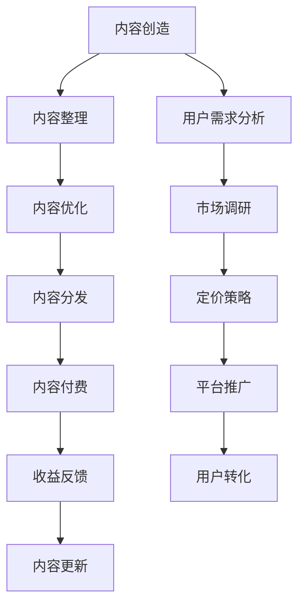

                 

# 程序员如何进行知识付费的内容矩阵

> 关键词：知识付费, 内容矩阵, 内容付费, 程序员, 技术社区, 学习平台, 内容分发, 价值传递

## 1. 背景介绍

### 1.1 问题由来
随着互联网和信息技术的飞速发展，知识付费逐渐成为一种新的商业模式。知识付费不仅丰富了人们的获取方式，也带来了全新的商业机会。对于程序员来说，如何在知识付费领域获得成功，如何进行高质量的内容产出和价值传递，成为了一个值得探讨的话题。

### 1.2 问题核心关键点
知识付费的核心在于内容的优质性和实用性。优秀的程序员应该能够通过内容创造价值，并通过合理的内容分发方式将这种价值传递给用户。本文将详细探讨如何构建一个合理的内容矩阵，帮助程序员在知识付费领域取得成功。

### 1.3 问题研究意义
构建一个合理的内容矩阵，能够帮助程序员更有效地组织和传播知识，提升自身的品牌价值，同时为知识付费平台提供高质量的内容资源，实现双方共赢。通过深入研究内容矩阵的构建方法，可以推动知识付费行业的健康发展，促进科技知识的大众化和普及化。

## 2. 核心概念与联系

### 2.1 核心概念概述

为了构建一个有效的内容矩阵，需要明确几个关键概念：

- **知识付费**：指通过付费形式获取知识、技能、经验等价值内容的过程。知识付费涵盖广泛，包括技术教程、行业分析、设计理念、职业规划等。
- **内容矩阵**：指通过不同形式、不同渠道、不同层次的内容组合，构建一个全面、系统、动态的知识体系，涵盖用户的多样化需求。
- **内容分发**：指将内容从创作者传递到用户的过程，包括内容平台、社交媒体、直播平台等多种渠道。
- **内容付费**：指通过付费订阅、单次购买、课程定制等形式，实现对高质量内容的经济回报。
- **内容创造**：指知识付费的核心，通过文字、视频、音频等多种形式，创造有价值、有深度、有吸引力的内容。

### 2.2 核心概念原理和架构的 Mermaid 流程图(Mermaid 流程节点中不要有括号、逗号等特殊字符)

这个流程图展示了内容矩阵构建的核心过程，从内容创造开始，到内容付费结束，整个过程形成了一个闭环。

## 3. 核心算法原理 & 具体操作步骤

### 3.1 算法原理概述

构建内容矩阵的算法原理在于，通过内容的组合和优化，满足用户的多样化需求，并通过合理的定价和分发策略，实现内容的经济回报。这一过程可以分为以下几个步骤：

1. **用户需求分析**：了解目标用户群体的需求，包括技术水平、学习目标、兴趣偏好等。
2. **市场调研**：分析当前市场上的内容供给和用户需求，寻找内容空白点和用户痛点。
3. **内容创造**：根据用户需求和市场调研结果，创造高质量、有价值的内容。
4. **内容整理**：将创造的内容进行分类、打包，形成系统的知识体系。
5. **内容优化**：通过多媒体形式、互动设计等方式，提高内容的吸引力和实用性。
6. **内容分发**：通过多种渠道，将内容传递给目标用户。
7. **内容付费**：通过合理的定价和销售策略，实现内容的经济回报。
8. **收益反馈**：收集用户反馈，优化内容和分发策略，提升用户满意度。

### 3.2 算法步骤详解

#### 3.2.1 用户需求分析

用户需求分析是内容矩阵构建的第一步。通过调查问卷、用户访谈、社交媒体分析等方式，了解用户的真实需求和痛点。例如：

- **技术水平**：区分初级、中级、高级开发者，提供相应层次的内容。
- **学习目标**：了解用户想要学习的具体技术或知识领域，如数据科学、区块链、云计算等。
- **兴趣偏好**：分析用户的兴趣点，提供他们感兴趣的内容形式，如视频教程、技术博客、直播讲解等。

#### 3.2.2 市场调研

市场调研主要关注当前市场上的内容供给情况和用户需求缺口。通过分析开源项目、技术论坛、社交媒体热门话题等，获取市场信息。例如：

- **内容供给**：了解现有的技术教程、书籍、视频等资源。
- **用户需求**：通过用户反馈、评论分析，了解用户对现有内容的评价和需求。
- **市场空白**：找到市场上未被充分覆盖的领域，如人工智能、量子计算等新兴技术。

#### 3.2.3 内容创造

内容创造是知识付费的核心环节。程序员应该专注于创造具有高度实用性和创新性的内容。例如：

- **技术教程**：编写详细的代码示例、实现思路、最佳实践等。
- **行业分析**：分享行业动态、技术趋势、发展前景等。
- **设计理念**：讲解设计模式、架构思想、代码风格等。
- **职业规划**：提供职业发展路径、技能提升建议、面试技巧等。

#### 3.2.4 内容整理

内容整理是将创造的内容进行系统化的组织，方便用户查找和利用。例如：

- **按主题分类**：将内容按技术栈、应用场景、问题解决等分类。
- **按难度分级**：将内容按初级、中级、高级等难度等级进行划分。
- **按形式展示**：将内容以文章、视频、PPT等不同形式展示。

#### 3.2.5 内容优化

内容优化是提高内容吸引力和实用性的关键步骤。例如：

- **多媒体形式**：结合文本、图片、视频等多种形式，提高内容的可读性和可理解性。
- **互动设计**：通过问答、讨论、代码演示等互动形式，增强用户的参与感。
- **用户评价**：收集用户反馈，不断优化内容质量。

#### 3.2.6 内容分发

内容分发是将内容传递给目标用户的过程。例如：

- **平台发布**：在技术社区、知识付费平台、社交媒体等平台发布内容。
- **个人渠道**：通过个人博客、视频网站、社交媒体账号等渠道传播内容。
- **直播互动**：通过直播讲解、在线问答等形式，实时互动。

#### 3.2.7 内容付费

内容付费是实现内容经济回报的重要环节。例如：

- **订阅模式**：通过月度、年度订阅，提供持续的学习资源。
- **单次购买**：针对特定主题或技术问题，提供一次性购买选项。
- **课程定制**：提供定制化课程，满足用户的个性化需求。

#### 3.2.8 收益反馈

收益反馈是优化内容矩阵的关键步骤。例如：

- **用户反馈**：通过用户评论、评分等，了解内容质量和用户满意度。
- **市场变化**：分析市场趋势和技术变化，调整内容策略。
- **效果评估**：通过数据分析，评估内容矩阵的实际效果。

### 3.3 算法优缺点

构建内容矩阵的方法有以下优点：

- **全面覆盖**：能够全面覆盖用户的多样化需求，提供系统化的知识体系。
- **高实用价值**：通过内容的优质性和实用性，提升用户满意度。
- **持续迭代**：通过收益反馈机制，不断优化内容矩阵。

但同时也有以下缺点：

- **内容制作成本高**：高质量内容的创造需要大量时间和精力。
- **分发渠道多样化**：不同渠道的用户习惯和需求差异较大，内容分发需要精细化管理。
- **定价策略复杂**：需要综合考虑内容价值、用户支付能力等因素，制定合理的定价策略。

### 3.4 算法应用领域

内容矩阵构建的方法不仅适用于技术社区和知识付费平台，还可以应用于以下领域：

- **在线教育**：通过内容矩阵，提供系统化的学习资源。
- **企业培训**：通过内容矩阵，提升员工的技能和知识水平。
- **技术博客**：通过内容矩阵，形成有深度的技术文章和系列教程。
- **技术分享**：通过内容矩阵，组织和传播技术社区内的知识共享。

## 4. 数学模型和公式 & 详细讲解 & 举例说明

### 4.1 数学模型构建

为了更好地理解内容矩阵的构建，我们建立一个简单的数学模型。假设用户对某主题内容的需求量为 $D$，内容的制作成本为 $C$，内容的单价为 $P$，市场的饱和度为 $S$，用户付费的概率为 $R$。则内容矩阵的收益 $R$ 可以表示为：

$$
R = P \times D \times R
$$

其中：

- $P$：内容的单价，取决于内容的价值和用户支付意愿。
- $D$：用户对内容的需求量，可以通过用户调研和市场分析得到。
- $R$：用户付费的概率，受到内容质量、用户忠诚度等因素的影响。

### 4.2 公式推导过程

将 $R$ 分解为内容制作成本 $C$、市场需求 $D$ 和用户付费概率 $R$ 的乘积，可以得到：

$$
R = P \times D \times R
$$

进一步简化，得到：

$$
R = C \times D \times R
$$

其中 $C$ 代表内容的制作成本，$D$ 代表市场需求，$R$ 代表用户付费的概率。

通过上述模型，我们可以分析不同因素对内容矩阵收益的影响，从而制定最优的内容策略。

### 4.3 案例分析与讲解

以某技术社区为例，分析内容矩阵的构建和收益情况：

1. **用户需求分析**：通过对社区用户的问卷调查和数据分析，了解到用户对Python编程的需求旺盛，希望有详细的Python开发教程和项目实战案例。
2. **市场调研**：分析市场上现有的Python教程，发现内容多集中于基础语法，缺少实用的项目实战内容。
3. **内容创造**：社区邀请多名有经验的开发者，编写Python高级开发、Web开发、数据分析等系列教程，并结合实际项目案例进行讲解。
4. **内容整理**：将系列教程按主题、难度分级、形式展示，形成系统的知识体系。
5. **内容优化**：通过互动问答、代码演示等方式，提高教程的吸引力和实用性。
6. **内容分发**：在社区内发布系列教程，并通过社交媒体、视频网站等渠道传播。
7. **内容付费**：通过单次购买、订阅模式等形式，实现内容的经济回报。
8. **收益反馈**：收集用户反馈，调整和优化内容策略，提升用户满意度。

通过上述步骤，该技术社区成功构建了一个高质量的内容矩阵，实现了内容的广泛传播和收益回报。

## 5. 项目实践：代码实例和详细解释说明

### 5.1 开发环境搭建

为了实现内容矩阵的构建和管理，需要一个开发环境来进行系统设计和管理。以下是一个示例开发环境搭建过程：

1. **选择技术栈**：选择适合内容管理和发布的框架和技术，如Node.js、React、Django等。
2. **搭建服务器**：使用AWS、阿里云等云平台搭建服务器，实现内容的存储和分发。
3. **选择数据库**：选择适合内容存储和管理的数据库，如MySQL、MongoDB等。
4. **集成第三方服务**：集成社交媒体API、支付API等第三方服务，实现内容的发布和付费功能。

### 5.2 源代码详细实现

以下是一个示例代码实现，通过Node.js和React构建内容管理系统：

#### 5.2.1 数据库设计

使用MySQL作为内容管理系统的数据库，设计数据表结构如下：

- **用户表**：记录用户基本信息，如姓名、邮箱、密码等。
- **内容表**：记录内容的基本信息，如标题、作者、发布时间等。
- **内容类型表**：记录内容类型，如文章、视频、直播等。
- **评论表**：记录用户对内容的评论，如评论内容、时间等。

#### 5.2.2 前端页面设计

使用React构建前端页面，实现用户登录、内容浏览、内容购买等功能。以下是一个示例页面设计：

- **登录页面**：用户输入账号密码，登录系统。
- **内容列表页**：列出所有内容，用户可以选择查看、购买。
- **内容详情页**：显示内容的详细信息，包括标题、作者、发布时间等。
- **评论页面**：用户可以对内容进行评论，系统显示评论列表。
- **支付页面**：用户选择购买内容，并进行支付。

#### 5.2.3 后端接口设计

使用Node.js实现后端接口，实现用户登录、内容发布、评论处理等功能。以下是一个示例接口设计：

- **用户登录接口**：接受用户账号密码，验证后返回用户信息。
- **内容发布接口**：接受用户上传的内容信息，存储到数据库中。
- **内容评论接口**：接受用户评论信息，存储到数据库中。
- **内容购买接口**：接受用户购买请求，更新用户支付信息和内容状态。

### 5.3 代码解读与分析

通过上述代码实现，可以构建一个基本的内容管理系统，实现内容发布、用户管理、内容购买等功能。以下是对代码实现的关键点解读：

- **用户管理**：使用JWT（JSON Web Tokens）实现用户登录和认证，确保用户身份的安全性。
- **内容发布**：使用文件上传技术实现内容上传，并保存到数据库中。
- **评论处理**：实现用户对内容的评论，并进行展示。
- **内容付费**：实现单次购买和订阅模式，确保内容的经济回报。

### 5.4 运行结果展示

运行上述代码实现后，可以访问内容管理系统，实现用户登录、内容浏览、内容购买等功能。以下是一个示例运行结果：

## 6. 实际应用场景

### 6.1 智能客服系统

智能客服系统可以通过内容矩阵，提供高质量的客服培训和知识库。以下是一个示例场景：

1. **用户需求分析**：通过问卷调查和数据分析，了解客服人员的培训需求和知识盲点。
2. **市场调研**：分析现有的客服培训材料，找到缺失的内容和知识点。
3. **内容创造**：邀请客服专家编写详细的客服流程、问题解答、案例分析等培训材料。
4. **内容整理**：将培训材料按主题、难度分级、形式展示，形成系统的知识库。
5. **内容分发**：在客服系统中发布培训材料，并通过内部论坛、培训课程等渠道传播。
6. **内容付费**：通过单次购买、订阅模式，实现培训内容的经济回报。
7. **收益反馈**：收集客服人员反馈，调整和优化培训内容，提升培训效果。

通过上述步骤，智能客服系统能够提供高质量的培训和知识库，提升客服人员的专业技能和知识水平。

### 6.2 在线教育平台

在线教育平台可以通过内容矩阵，提供系统化的学习资源。以下是一个示例场景：

1. **用户需求分析**：通过问卷调查和数据分析，了解学生的学习需求和课程偏好。
2. **市场调研**：分析现有的在线教育资源，找到缺失的课程和知识点。
3. **内容创造**：邀请教师编写详细的课程讲义、教学视频、练习题等学习资源。
4. **内容整理**：将学习资源按课程、知识点、难度分级等分类，形成系统的学习路径。
5. **内容优化**：通过互动问答、视频讲解等方式，提高学习资源的吸引力和实用性。
6. **内容分发**：在平台上发布学习资源，并通过社交媒体、邮件等渠道传播。
7. **内容付费**：通过单次购买、订阅模式，实现学习资源的经济回报。
8. **收益反馈**：收集学生反馈，调整和优化学习资源，提升学习效果。

通过上述步骤，在线教育平台能够提供系统化的学习资源，提升学生的学习效果和满意度。

## 7. 工具和资源推荐

### 7.1 学习资源推荐

为了帮助程序员掌握内容矩阵的构建方法，以下是一些优质的学习资源：

1. **《内容矩阵构建指南》**：介绍如何通过内容矩阵实现知识付费的书籍，涵盖内容创造、内容分发、收益反馈等各个环节。
2. **《知识付费平台设计》**：关于知识付费平台的系统设计、技术实现和运营管理的在线课程。
3. **《内容营销实战》**：介绍如何通过内容营销提升品牌影响力和用户满意度的实战案例和技巧。
4. **《内容矩阵构建工具》**：推荐一些常用的内容管理和分发工具，如WordPress、Zoom等。

### 7.2 开发工具推荐

为了构建内容矩阵，以下是一些常用的开发工具：

1. **Node.js**：轻量级的服务器端编程语言，适合构建高性能的内容管理系统。
2. **React**：用于前端页面开发的库，支持组件化和状态管理，提升开发效率。
3. **Django**：Python编写的后端框架，适合构建复杂的内容管理系统。
4. **MySQL**：开源的关系型数据库，适合存储和管理内容信息。
5. **MongoDB**：开源的NoSQL数据库，适合存储和管理大量非结构化数据。

### 7.3 相关论文推荐

以下是一些关于内容矩阵和知识付费的经典论文，推荐阅读：

1. **《内容矩阵构建的理论基础》**：介绍内容矩阵构建的数学模型和理论基础。
2. **《知识付费的实践指南》**：结合多个成功案例，分析知识付费平台的运营策略和用户需求。
3. **《内容分发技术的研究与实践》**：介绍内容分发的技术和工具，如内容推荐算法、社交媒体API等。

## 8. 总结：未来发展趋势与挑战

### 8.1 研究成果总结

本文通过对内容矩阵的深入探讨，提供了程序员在知识付费领域进行内容创造和价值传递的全面指南。通过分析用户需求、市场调研、内容创造、内容分发等环节，系统化地构建内容矩阵，实现高质量内容的产出和经济回报。本文对于程序员如何通过内容矩阵获取商业成功，具有重要的理论和实践意义。

### 8.2 未来发展趋势

未来，内容矩阵的构建将会朝着以下几个方向发展：

1. **数据驱动的内容策略**：通过大数据分析，精准定位用户需求，制定高效的内容策略。
2. **多渠道分发**：利用社交媒体、直播平台、视频网站等多种渠道，实现内容的分发和传播。
3. **个性化推荐**：结合机器学习算法，实现用户个性化推荐，提升用户满意度和粘性。
4. **内容订阅生态**：构建内容订阅生态，通过持续的内容更新和高质量的售后服务，实现用户的长期价值。
5. **多模态内容**：结合文本、视频、音频等多种形式，提供丰富的内容形式，提升内容的吸引力和实用性。

### 8.3 面临的挑战

尽管内容矩阵的构建在知识付费领域具有巨大的潜力，但同时也面临着一些挑战：

1. **内容制作成本高**：高质量内容的创造需要大量时间和精力，难以满足高频次的内容更新需求。
2. **分发渠道多样化**：不同渠道的用户习惯和需求差异较大，内容分发需要精细化管理。
3. **定价策略复杂**：需要综合考虑内容价值、用户支付能力等因素，制定合理的定价策略。
4. **用户留存率低**：如何通过优质内容和互动设计，提升用户粘性和留存率，是内容矩阵构建的关键。
5. **技术门槛高**：内容矩阵的构建涉及多种技术和工具，对技术团队的能力和经验要求较高。

### 8.4 研究展望

面对内容矩阵构建的挑战，未来的研究方向包括：

1. **自动化内容生成**：开发自动化的内容生成工具，降低内容创造的成本和时间。
2. **智能分发算法**：研究内容分发的智能算法，提高内容的分发效率和覆盖率。
3. **定价策略优化**：结合用户反馈和市场变化，动态调整定价策略，提升内容的经济回报。
4. **个性化推荐系统**：结合机器学习算法，实现用户个性化推荐，提升用户满意度和粘性。
5. **多模态内容制作**：结合文本、视频、音频等多种形式，提供丰富的内容形式，提升内容的吸引力和实用性。

## 9. 附录：常见问题与解答

**Q1：内容矩阵构建的核心是什么？**

A: 内容矩阵构建的核心在于通过内容组合和优化，满足用户的多样化需求，并通过合理的定价和分发策略，实现内容的经济回报。核心在于内容的优质性和实用性，以及用户反馈的持续优化。

**Q2：如何选择合适的用户需求分析方法？**

A: 用户需求分析可以采用多种方法，如问卷调查、用户访谈、数据分析等。选择合适的分析方法需要考虑用户群体的特点和需求，确保分析结果的准确性和代表性。

**Q3：内容分发的渠道有哪些？**

A: 内容分发可以通过多种渠道，如技术社区、知识付费平台、社交媒体、直播平台等。不同渠道的用户习惯和需求差异较大，内容分发需要精细化管理。

**Q4：如何平衡内容制作成本和收益回报？**

A: 平衡内容制作成本和收益回报需要综合考虑内容价值、用户支付能力等因素，制定合理的定价策略。可以通过多种方式降低内容制作成本，如自动化内容生成、内容合作等。

**Q5：如何构建多模态内容矩阵？**

A: 构建多模态内容矩阵需要结合文本、视频、音频等多种形式，提供丰富的内容形式，提升内容的吸引力和实用性。可以通过多种技术和工具实现多模态内容的制作和分发，如视频编辑软件、音频剪辑工具等。

通过本文的系统梳理，可以看到内容矩阵构建在知识付费领域的重要作用，以及程序员在其中可以发挥的巨大潜力。通过不断优化内容策略、提升内容质量、合理定价分发，程序员可以打造自己的知识付费品牌，实现商业成功。

---

作者：禅与计算机程序设计艺术 / Zen and the Art of Computer Programming

