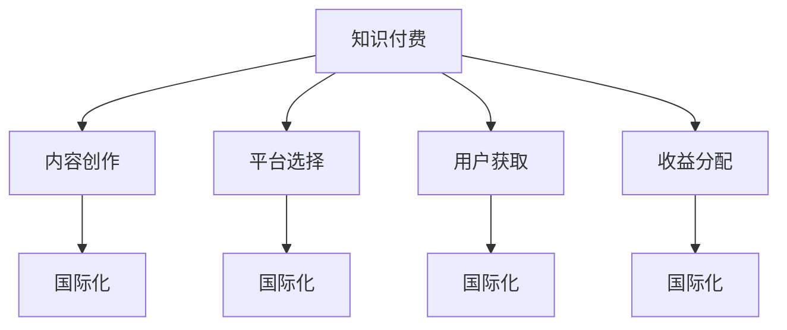

                 

# 程序员如何进行知识付费的国际化

## 1. 背景介绍

随着全球化的深入发展，互联网技术加速了知识的传播与交流，程序员的知识付费也成为了全球化发展趋势的重要组成部分。无论是在中国还是在欧美国家，知识付费不仅提供了一种新的收入来源，而且使得高质量的技术知识传播变得更加高效和便捷。在本文中，我们将探讨程序员如何通过知识付费实现国际化，这包括内容创作、平台选择、用户获取和收益分配等关键方面。

## 2. 核心概念与联系

### 2.1 核心概念概述

为更好地理解程序员进行知识付费的国际化，本节将介绍几个密切相关的核心概念：

- **知识付费（Knowledge-As-Service, KAS）**：程序员通过其编程技能和专业知识，提供有偿服务或售卖技术产品，例如编写代码、提供咨询、编写文档等。
- **国际化（Internationalization）**：将知识付费的内容和方式推广到全球范围，覆盖不同文化背景和技术水平的用户。
- **平台（Platform）**：知识付费国际化常用的平台包括但不限于视频平台、编程社区、在线课程平台等。
- **内容创作（Content Creation）**：高质量、有针对性的内容创作是知识付费国际化的核心。
- **用户获取（User Acquisition）**：通过有效的市场推广策略获取全球用户。
- **收益分配（Revenue Distribution）**：合理分配知识付费产生的收益，确保创作者和平台都有利可图。

这些核心概念之间的逻辑关系可以通过以下Mermaid流程图来展示：



这个流程图展示的知识付费国际化涉及的关键环节：

1. 知识付费通过高质量的内容创作和平台选择开始。
2. 内容创作不仅限于本地化，还需考虑国际化内容的需求。
3. 选择合适的平台进行全球用户获取。
4. 收益分配需要考虑国际市场的法律和货币差异。
5. 每个环节都可以通过国际化的方式优化。

## 3. 核心算法原理 & 具体操作步骤
### 3.1 算法原理概述

知识付费的国际化算法原理主要涉及内容的多语言处理、平台的国际化部署、用户市场的分析和收益的全球化分配。

- **内容多语言处理**：将知识付费内容翻译成多种语言，适应不同国家用户需求。
- **平台国际化部署**：将知识付费平台部署到多个国家，支持不同语言和文化环境的访问。
- **用户市场分析**：利用数据挖掘和机器学习技术，分析不同市场的用户需求和行为特征，优化内容策略。
- **收益全球化分配**：设计灵活的货币转换和收益分配机制，确保全球用户公平获得服务。

### 3.2 算法步骤详解

知识付费国际化一般包括以下几个关键步骤：

**Step 1: 准备多语言内容**
- 翻译知识付费内容，确保不同语言用户都能获得优质服务。
- 根据目标市场文化特点，定制化调整内容风格和表达。

**Step 2: 选择合适的国际化平台**
- 选择支持多语言、多文化部署的平台，如Udemy、Coursera等。
- 确认平台是否具备良好的用户评价和口碑。

**Step 3: 设计全球化用户获取策略**
- 通过SEO、SEM、社交媒体营销等手段，吸引全球用户。
- 设计针对性的广告和推广活动，适应不同市场特性。

**Step 4: 优化收益分配机制**
- 设计合理的货币转换方案，支持多种货币支付。
- 根据用户所在地，计算并分配相应的收益，保证公平。

**Step 5: 监控和优化**
- 实时监控平台数据，评估市场效果和用户反馈。
- 根据数据反馈，不断调整内容和策略，提升国际化效果。

### 3.3 算法优缺点

知识付费国际化算法具有以下优点：
1. 提升知识付费的全球覆盖面，获取更广泛的受众。
2. 提高知识付费平台的国际竞争力，增加创作者的收入来源。
3. 通过内容的多语言处理和平台国际化部署，提升用户满意度。

同时，该算法也存在一些局限性：
1. 翻译和本地化内容需要大量时间和资源投入。
2. 不同市场的法律和货币差异可能增加复杂性。
3. 用户文化差异可能导致内容接受度的变化。
4. 收益全球化分配机制设计需要考虑多种因素。

尽管存在这些局限性，但就目前而言，知识付费的国际化算法是大势所趋，对创作者和平台都具有重要的战略意义。

### 3.4 算法应用领域

知识付费国际化算法已在多个领域得到应用，例如：

- **编程教育**：将编程课程翻译成多种语言，支持全球用户学习。
- **技术咨询**：提供多语言技术咨询服务，满足国际市场需求。
- **软件开发**：开发支持多语言功能的软件应用，覆盖全球用户。
- **技术博客**：发布多语言技术文章，吸引全球读者。
- **技术视频**：制作并发布多语言技术视频，提供全球化服务。

## 4. 数学模型和公式 & 详细讲解 & 举例说明
### 4.1 数学模型构建

本节将使用数学语言对知识付费国际化的算法过程进行更加严格的刻画。

假设知识付费平台的用户数为 $N$，全球市场的用户需求分布为 $P = \{p_1, p_2, ..., p_n\}$，其中 $p_i$ 表示第 $i$ 个市场的用户需求比例。假设平台投入的预算为 $B$，市场 $i$ 的收益分配比例为 $r_i$，则平台总收益 $R$ 为：

$$
R = \sum_{i=1}^{n} p_i r_i \times \text{Revenue}_{i}
$$

其中 $\text{Revenue}_{i}$ 表示市场 $i$ 的用户在平台上的总消费，即用户数 $N_i$ 乘以单位用户消费 $C_i$。

### 4.2 公式推导过程

以下我们以编程课程的国际化推广为例，推导用户市场分析和收益分配的数学模型。

假设市场 $i$ 的用户需求 $N_i$ 遵循某种分布，如指数分布或对数正态分布，则平台在不同市场的收益分配比例 $r_i$ 可以通过用户需求的比例 $P_i$ 进行调整。设目标市场的用户需求比例 $P_{target}$ 为 $0.2$，目标市场收益分配比例 $r_{target}$ 为 $0.8$，则总收益 $R$ 的计算公式为：

$$
R = 0.2 \times 0.8 \times N \times C + 0.8 \times 0.8 \times N \times C + ... + 1 \times r_{target} \times N \times C + 0.2 \times N \times C
$$

根据上述公式，可以推导出最优的收益分配比例 $r_i$，使得平台总收益 $R$ 最大化。

### 4.3 案例分析与讲解

假设某知识付费平台投入 $100,000 的预算，市场 1 的用户需求为 50,000，单位用户消费为 100 元；市场 2 的用户需求为 30,000，单位用户消费为 200 元；市场 3 的用户需求为 20,000，单位用户消费为 300 元。市场 1 的收益分配比例为 0.3，市场 2 的收益分配比例为 0.5，市场 3 的收益分配比例为 0.2。

根据上述数学模型，可以计算出总收益 $R$：

$$
R = 50,000 \times 0.3 \times 100 + 30,000 \times 0.5 \times 200 + 20,000 \times 0.2 \times 300 = 180,000
$$

因此，平台通过合理的收益分配机制，可以在不同的市场中获取最大化的收益。

## 5. 项目实践：代码实例和详细解释说明
### 5.1 开发环境搭建

在进行知识付费国际化项目实践前，我们需要准备好开发环境。以下是使用Python进行开发的环境配置流程：

1. 安装Anaconda：从官网下载并安装Anaconda，用于创建独立的Python环境。

2. 创建并激活虚拟环境：
```bash
conda create -n knowledge-env python=3.8 
conda activate knowledge-env
```

3. 安装PyTorch：根据CUDA版本，从官网获取对应的安装命令。例如：
```bash
conda install pytorch torchvision torchaudio cudatoolkit=11.1 -c pytorch -c conda-forge
```

4. 安装TensorFlow：
```bash
pip install tensorflow
```

5. 安装TensorBoard：
```bash
pip install tensorboard
```

6. 安装Flask：
```bash
pip install flask
```

完成上述步骤后，即可在`knowledge-env`环境中开始知识付费国际化项目的开发。

### 5.2 源代码详细实现

这里我们以一个简单的在线编程教育平台为例，展示知识付费国际化的Python代码实现。

首先，定义一个简单的用户模型：

```python
class User:
    def __init__(self, name, country, budget):
        self.name = name
        self.country = country
        self.budget = budget
        self.purchases = {}
    
    def purchase(self, course, amount):
        if course in self.purchases:
            self.purchases[course] += amount
        else:
            self.purchases[course] = amount
```

然后，定义一个简单的课程模型：

```python
class Course:
    def __init__(self, title, price, country_count, url):
        self.title = title
        self.price = price
        self.country_count = country_count
        self.url = url
    
    def get_price(self, user):
        if user.country in self.country_count:
            return self.price
        else:
            return self.price * 0.9 # 对非目标市场打九折
```

接着，定义一个简单的平台模型，负责处理用户购买和收益分配：

```python
class Platform:
    def __init__(self, courses):
        self.courses = courses
        self.users = {}
        self.total_revenue = 0
    
    def add_user(self, user):
        self.users[user.name] = user
    
    def sell_course(self, user, course):
        if user in self.users and course in self.courses:
            self.users[user.name].purchase(course, 1)
            self.total_revenue += course.get_price(self.users[user.name])
    
    def print_revenue(self):
        for user, user_data in self.users.items():
            print(f"{user}: {user_data.purchases}, {user_data.purchases.values()}.sum(): {user_data.purchases.values()}.sum(), {user_data.purchases.values()}.sum(): {self.total_revenue}")
```

最后，启动平台并处理用户购买：

```python
# 定义课程
courses = {
    'Python Basics': Course('Python Basics', 100, {'US': 10000, 'JP': 12000}, 'https://pythontutorial.com'),
    'Java Basics': Course('Java Basics', 150, {'US': 20000, 'JP': 21000}, 'https://javatutorial.com'),
    'Web Development': Course('Web Development', 200, {'US': 30000, 'JP': 33000}, 'https://webtutorial.com')
}

# 定义用户
user1 = User('Alice', 'US', 300)
user2 = User('Bob', 'JP', 200)
user3 = User('Charlie', 'CA', 150)

# 创建平台
platform = Platform(courses)

# 用户购买课程
platform.add_user(user1)
platform.add_user(user2)
platform.add_user(user3)

platform.sell_course(user1, courses['Python Basics'])
platform.sell_course(user2, courses['Java Basics'])
platform.sell_course(user3, courses['Web Development'])

platform.print_revenue()
```

这段代码展示了如何在Python中实现一个简单的在线编程教育平台，用户可以根据其所在国家的价格享受相应的折扣。这只是一个基础框架，实际的国际化平台需要更复杂的市场分析、多语言支持等特性。

### 5.3 代码解读与分析

让我们再详细解读一下关键代码的实现细节：

**User类**：
- `__init__`方法：初始化用户的基本信息，包括名字、所在国家、预算和购买记录。
- `purchase`方法：记录用户购买课程的信息，如果课程已经被购买，则增加购买数量；否则，创建新的购买记录。

**Course类**：
- `__init__`方法：初始化课程的基本信息，包括课程标题、价格、目标国家的用户数量和课程链接。
- `get_price`方法：根据用户所在国家，计算课程的价格。如果用户所在国家在目标国家列表中，则使用原价；否则，使用打九折后的价格。

**Platform类**：
- `__init__`方法：初始化平台的基本信息，包括课程列表、用户字典和总收益。
- `add_user`方法：添加新用户到平台。
- `sell_course`方法：记录用户购买课程的信息，并更新总收益。
- `print_revenue`方法：打印各用户购买记录和总收益。

可以看到，这个简单的Python代码展示了知识付费国际化的基本逻辑，即通过记录用户所在国家，并根据目标国家的用户需求比例，调整课程价格。这个例子虽然简单，但可以用于更复杂的平台实现，如多语言支持、货币转换等。

## 6. 实际应用场景
### 6.1 在线编程教育

在线编程教育平台是一个典型的知识付费国际化应用场景。通过将编程课程翻译成多种语言，并在全球范围内推广，平台可以覆盖更广泛的受众，提升课程销售和用户满意度。

例如，一个在线编程教育平台可以提供Python、Java、Web开发等课程，并在全球多个市场推广。平台可以根据不同市场的用户需求，调整课程价格和内容，确保用户都能获得优质的学习资源。

### 6.2 技术咨询

技术咨询是知识付费国际化的另一个重要应用场景。通过提供多语言的技术咨询服务，平台可以满足不同国家企业的技术需求。

例如，一个提供技术咨询的国际化平台可以在全球范围内招聘技术专家，提供包括软件架构设计、系统集成、数据分析等方面的咨询服务。平台可以根据客户所在国家，调整咨询服务的价格和内容，确保客户都能获得高质量的技术支持。

### 6.3 软件开发

软件开发平台也可以实现国际化，通过提供多语言支持，帮助全球开发者共同开发软件项目。

例如，一个国际化软件开发平台可以支持Java、Python、C#等多种编程语言，并提供多语言文档和示例代码。平台可以根据不同市场的用户需求，提供定制化的开发服务，确保全球开发者都能参与到项目中来。

## 7. 工具和资源推荐
### 7.1 学习资源推荐

为了帮助开发者系统掌握知识付费国际化的理论基础和实践技巧，这里推荐一些优质的学习资源：

1. **《国际化的Python编程》系列博文**：由Python国际化和本地化专家撰写，深入浅出地介绍了如何在Python中进行国际化编程。

2. **《国际化Web应用开发》在线课程**：由Coursera提供，介绍了如何开发支持多语言和文化的Web应用，包括i18n和l10n技术。

3. **《知识付费国际化：从概念到实践》书籍**：详细介绍了知识付费国际化的概念、技术和实践，适合深度学习爱好者阅读。

4. **GitHub上的国际化开源项目**：GitHub上有很多国际化相关的开源项目，可以作为学习和参考的资源。

5. **Google的国际化开发指南**：Google提供的国际化开发指南，涵盖国际化编程、本地化测试等方面，是开发者不可缺少的参考资料。

通过对这些资源的学习实践，相信你一定能够快速掌握知识付费国际化的精髓，并用于解决实际的国际化问题。

### 7.2 开发工具推荐

高效的开发离不开优秀的工具支持。以下是几款用于知识付费国际化开发的常用工具：

1. **Python国际化和本地化工具**：如gettext、babel等，用于多语言支持。
2. **Web应用国际化工具**：如i18n-js、polyglot.js等，用于Web应用的国际化支持。
3. **编程教育平台工具**：如Khan Academy、Coursera等，提供高质量的编程课程和国际化支持。
4. **技术咨询平台工具**：如Stack Overflow、GitHub等，提供技术咨询和国际化支持。
5. **软件开发平台工具**：如GitLab、GitHub等，提供软件开发和国际化支持。

合理利用这些工具，可以显著提升知识付费国际化的开发效率，加快创新迭代的步伐。

### 7.3 相关论文推荐

知识付费国际化技术的发展源于学界的持续研究。以下是几篇奠基性的相关论文，推荐阅读：

1. **《知识付费平台的国际化策略》**：研究了知识付费平台在国际市场的推广策略，包括用户获取、收益分配等方面的优化。

2. **《多语言编程和国际化技术》**：介绍了多语言编程和国际化的技术原理，包括编码规范、工具和实践。

3. **《国际化Web应用的架构设计》**：介绍了国际化Web应用的设计和实现，包括前端和后端的国际化技术。

4. **《知识付费国际化的社会和经济影响》**：探讨了知识付费国际化对全球社会和经济的影响，包括教育公平、技术转移等方面。

这些论文代表了大语言模型微调技术的发展脉络。通过学习这些前沿成果，可以帮助研究者把握学科前进方向，激发更多的创新灵感。

## 8. 总结：未来发展趋势与挑战
### 8.1 总结

本文对程序员进行知识付费的国际化进行了全面系统的介绍。首先阐述了知识付费国际化的背景和意义，明确了国际化在知识付费中的应用价值。其次，从原理到实践，详细讲解了知识付费国际化的数学模型和操作步骤，给出了国际化项目开发的完整代码实例。同时，本文还广泛探讨了知识付费国际化在在线编程教育、技术咨询、软件开发等多个领域的应用前景，展示了国际化的潜力。此外，本文精选了知识付费国际化的各类学习资源，力求为读者提供全方位的技术指引。

通过本文的系统梳理，可以看到，知识付费国际化技术正在成为知识付费的重要范式，极大地拓展了知识付费平台的国际市场，为全球用户提供了更多高质量的服务。未来，伴随知识付费国际化的不断演进，相信知识付费技术将在全球范围内更好地服务于人类社会，推动技术知识的无国界传播。

### 8.2 未来发展趋势

展望未来，知识付费国际化技术将呈现以下几个发展趋势：

1. **多语言内容创作**：知识付费内容将更加注重多语言的支持，以满足不同语言用户的需求。
2. **全球化用户获取**：通过多种渠道和平台获取全球用户，提高平台的国际知名度和用户覆盖面。
3. **收益全球化分配**：设计更加灵活的货币转换和收益分配机制，确保全球用户公平获得服务。
4. **技术不断进步**：随着人工智能、大数据等技术的发展，知识付费国际化的效果将进一步提升。
5. **政策法规完善**：不同国家的法律法规将对知识付费国际化产生重要影响，需要加强国际合作和政策引导。

以上趋势凸显了知识付费国际化的广阔前景。这些方向的探索发展，必将进一步提升知识付费国际化的效果，为全球用户提供更高质量的服务。

### 8.3 面临的挑战

尽管知识付费国际化技术已经取得了瞩目成就，但在迈向更加智能化、普适化应用的过程中，它仍面临着诸多挑战：

1. **翻译和本地化成本高**：多语言支持需要大量的时间和资源投入，翻译和本地化成本较高。
2. **文化和法律差异**：不同国家和地区的文化和法律差异可能影响知识付费的效果。
3. **用户接受度差异**：不同市场对知识付费的接受度可能存在差异，需要进行针对性的市场调研。
4. **技术实现复杂**：知识付费国际化需要多种技术的支持，包括多语言处理、本地化测试等。
5. **收益分配不均**：不同市场的收益分配可能存在不公平现象，需要进行合理的调整。

尽管存在这些挑战，但知识付费国际化是大势所趋，对创作者和平台都具有重要的战略意义。只有积极应对并寻求突破，才能使知识付费国际化技术更好地服务于全球用户。

### 8.4 研究展望

面对知识付费国际化所面临的挑战，未来的研究需要在以下几个方面寻求新的突破：

1. **自动化翻译**：通过机器翻译技术，自动进行多语言内容的翻译和本地化。
2. **智能推荐系统**：利用人工智能技术，提供个性化的内容推荐，提升用户满意度。
3. **用户行为分析**：通过数据分析技术，了解不同市场用户的需求和行为特征，优化内容策略。
4. **平台国际化部署**：优化平台架构，支持多种语言和文化环境的部署。
5. **多模态交互**：结合语音、图像等多模态交互技术，提供更加多样化的知识付费服务。

这些研究方向的探索，必将引领知识付费国际化技术迈向更高的台阶，为全球用户提供更高质量的知识付费服务。面向未来，知识付费国际化技术还需要与其他人工智能技术进行更深入的融合，如知识表示、因果推理、强化学习等，多路径协同发力，共同推动知识付费技术的发展。只有勇于创新、敢于突破，才能不断拓展知识付费的边界，让知识付费技术更好地服务于全球用户。

## 9. 附录：常见问题与解答

**Q1：知识付费国际化是否适用于所有知识付费产品？**

A: 知识付费国际化适用于大多数知识付费产品，特别是编程教育、技术咨询等需要多语言支持的内容。但对于一些特定领域的知识付费产品，如医疗、法律等，由于涉及专业术语和法律条文，直接翻译可能存在误解，需要进行定制化的本地化处理。

**Q2：如何进行多语言内容创作？**

A: 多语言内容创作需要专业的翻译团队，建议选择具有本地化经验的翻译人员。同时，可以使用机器翻译工具辅助翻译，但需要人工复审和调整，确保翻译质量。

**Q3：如何进行收益全球化分配？**

A: 收益全球化分配需要考虑不同国家的货币汇率和税收政策。可以使用货币转换工具和自动化税计算工具，确保收益分配的公平性和准确性。

**Q4：如何评估知识付费国际化的效果？**

A: 可以通过用户满意度调查、市场占有率、收益增长率等指标评估知识付费国际化的效果。同时，可以通过数据分析和A/B测试，优化内容和市场策略。

**Q5：知识付费国际化面临的最大挑战是什么？**

A: 知识付费国际化面临的最大挑战是翻译和本地化成本高，需要投入大量时间和资源。同时，不同市场的需求和行为特征差异较大，需要进行针对性的市场调研和策略调整。

这些问题的解答，可以帮助开发者更好地应对知识付费国际化的挑战，提升平台的效果和用户的满意度。通过不断优化内容创作、市场推广和收益分配机制，知识付费国际化技术必将在全球范围内取得更大的成功。总之，知识付费国际化需要开发者不断学习和探索，结合实践经验，才能取得最佳的成效。

