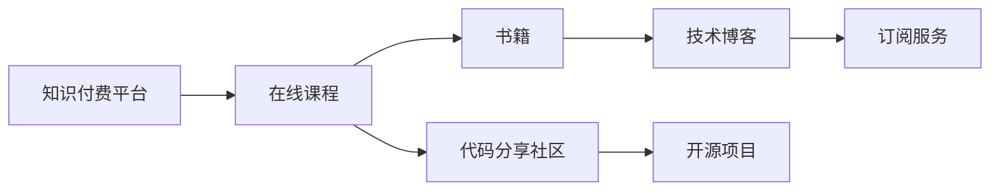

                 

## 1. 背景介绍

随着科技的发展，编程已经成为很多行业的基础技能。程序员不仅是软件开发的主要力量，他们在数据科学、人工智能、网络安全等各个领域也发挥着重要的作用。因此，成为一名优秀的程序员，需要拥有强大的知识储备。

知识付费作为互联网时代的新兴产业，其快速崛起也反映了知识的重要性和知识的稀缺性。知识的价值越来越被人们重视，而知识付费的普及也推动了程序员知识储备的不断提升。

## 2. 核心概念与联系

### 2.1 核心概念概述

- **知识储备**：程序员所拥有的各种技术、工具、方法论和软技能的总和。包括但不限于编程语言、算法、数据结构、软件架构、开发工具、版本控制、软件工程、测试和质量保证等。

- **知识付费**：指通过在线课程、书籍、技术博客、订阅服务等形式，以付费方式获取专业知识和服务，以满足学习和提升自身技术水平的需求。

- **在线课程**：即通过网络平台（如Coursera、Udemy、edX、慕课网、网易云课堂等）提供的课程学习资源，程序员可以通过这些平台获取专业知识、学习新技术。

- **书籍**：指的是程序员常用的编程书籍，包括源码解析、编程范式、算法和数据结构、设计模式、软件工程等领域的经典书籍。

- **技术博客**：程序员通过个人博客分享编程心得、解决问题的方法、新技术趋势等，这类博客对程序员的知识储备起到了非常重要的补充作用。

- **订阅服务**：如GitHub的专业版、Slack的专业版、码云等，程序员可以通过订阅这些服务获取更高级的功能和更多的资源。

### 2.2 核心概念原理和架构的 Mermaid 流程图(Mermaid 流程节点中不要有括号、逗号等特殊字符)



## 3. 核心算法原理 & 具体操作步骤

### 3.1 算法原理概述

知识付费的核心是通过付费方式，获取优质、专业的学习资源，提升自身的技术水平。这一过程遵循以下原理：

1. **需求驱动**：程序员根据自己的职业发展和技术需求，选择合适的知识付费资源。
2. **付费获取**：通过购买或订阅，获取知识付费平台提供的学习资源。
3. **学习实践**：将获取的知识应用于实践，提升自身技术能力。

### 3.2 算法步骤详解

**Step 1: 需求分析**
- 根据当前技术栈和项目需求，分析需要提升的技能和知识。
- 列出需要掌握的编程语言、算法和工具等。

**Step 2: 资源选择**
- 选择符合自己需求和水平的知识付费平台和资源。
- 浏览平台课程、书籍、博客等，选择最适合自己的学习材料。

**Step 3: 付费获取**
- 注册并购买或订阅选定的知识付费资源。
- 获取学习账号、学习材料等资源。

**Step 4: 学习实践**
- 按照学习计划，逐步完成学习材料。
- 实践所学知识，编写代码，参与开源项目等。
- 记录学习过程中的问题和解决方案，形成知识库。

**Step 5: 应用反馈**
- 将所学知识应用于实际项目，解决技术问题。
- 根据实际应用效果，调整学习计划，进行进一步学习。

### 3.3 算法优缺点

**优点**：
- **针对性**：根据个人需求和水平，选择适合自己的学习资源。
- **高效性**：付费获取的高质量资源，能够快速提升技术水平。
- **结构化**：课程和书籍等结构化资源，帮助程序员系统学习。

**缺点**：
- **成本高**：高昂的学习成本，可能会对一些程序员造成经济负担。
- **依赖性强**：完全依赖知识付费平台，可能缺乏自主学习能力。
- **资源泛滥**：面对海量的知识资源，需要花费大量时间进行选择。

### 3.4 算法应用领域

知识付费的应用领域非常广泛，以下是几个主要领域：

- **软件开发**：程序员可以通过知识付费平台学习编程语言、框架、工具等，提升开发效率和代码质量。
- **数据科学**：数据科学家可以通过在线课程、书籍、博客等，学习数据分析、机器学习、数据可视化等技能。
- **网络安全**：安全工程师可以通过知识付费平台学习渗透测试、安全工具、安全架构等，提升网络安全防护能力。
- **项目管理**：项目经理可以通过知识付费平台学习敏捷开发、Scrum、Kanban等方法，提升项目管理能力。
- **人工智能**：AI工程师可以通过在线课程、书籍、博客等，学习深度学习、自然语言处理、计算机视觉等AI技术。

## 4. 数学模型和公式 & 详细讲解 & 举例说明

### 4.1 数学模型构建

知识付费的过程可以用以下数学模型来描述：

- **输入**：需求分析的结果，包括需要掌握的技能和知识。
- **模型**：知识付费平台、在线课程、书籍等资源，以及技术博客、订阅服务、代码分享社区等。
- **输出**：提升后的技术水平和实际应用能力。

数学模型表示为：
$$ f(D, C, L, M, S, A) = O $$
其中：
- $D$：需求分析结果
- $C$：在线课程
- $L$：书籍
- $M$：技术博客
- $S$：订阅服务
- $A$：代码分享社区
- $O$：技术提升

### 4.2 公式推导过程

对于知识付费过程，可以进一步细化其数学模型。以编程语言为例，其模型推导如下：

设 $X$ 为需要掌握的编程语言，知识付费过程可以表示为：
$$ X = \{ C_1, C_2, ..., C_n \} + \{ L_1, L_2, ..., L_m \} + \{ M_1, M_2, ..., M_k \} + \{ S_1, S_2, ..., S_p \} + \{ A_1, A_2, ..., A_q \} $$

其中，$C$、$L$、$M$、$S$、$A$ 分别代表在线课程、书籍、技术博客、订阅服务和代码分享社区。

### 4.3 案例分析与讲解

以学习Python为例：

**Step 1: 需求分析**
- 需要掌握Python的基础语法、数据结构、函数、模块、异常处理等。
- 确定学习路径，选择从基础语法到高级应用的学习顺序。

**Step 2: 资源选择**
- 选择Coursera上的Python编程基础课程。
- 阅读《Python核心编程》、《流畅的Python》等经典书籍。
- 订阅PyBites等技术博客，了解最新Python应用。

**Step 3: 付费获取**
- 注册Coursera账号，购买课程。
- 购买《Python核心编程》等书籍。
- 订阅PyBites博客，并支付年度订阅费用。

**Step 4: 学习实践**
- 按照课程进度，完成每周的学习任务。
- 编写Python程序，参与开源项目。
- 在博客上分享学习心得，记录解决问题的方法。

**Step 5: 应用反馈**
- 在实际项目中应用Python，提升开发效率。
- 根据实际应用效果，调整学习计划，进一步学习Python高级应用。

## 5. 项目实践：代码实例和详细解释说明

### 5.1 开发环境搭建

项目实践的第一步是搭建开发环境，包括安装开发工具、配置项目结构等。

**环境搭建**：

- 安装Python 3.8及以上版本。
- 安装Anaconda，创建虚拟环境。
- 安装GitHub等代码分享平台。
- 配置IDE（如PyCharm）。

### 5.2 源代码详细实现

**代码实例**：

```python
# 需求分析
def analyze_demand():
    # 列出需要掌握的技能和知识
    demand = {
        'python': ['基础语法', '数据结构', '函数', '模块', '异常处理', '高级应用']
    }
    return demand

# 资源选择
def select_resources(demand):
    resources = {
        'online_courses': ['Coursera - Python基础课程', 'edX - Python数据科学入门'],
        'books': ['Python核心编程', '流畅的Python'],
        'blogs': ['PyBites', 'Real Python'],
        'services': ['PyBites年度订阅'],
        'code_sharing': ['GitHub']
    }
    return resources

# 付费获取
def acquire_resources(resources):
    online_courses = []
    books = []
    blogs = []
    services = []
    code_sharing = []
    for course in resources['online_courses']:
        online_courses.append(purchase_course(course))
    for book in resources['books']:
        books.append(purchase_book(book))
    for blog in resources['blogs']:
        blogs.append(subscribe_blog(blog))
    services.append(subscribe_service(resources['services']))
    code_sharing.append(purchase_code_sharing(resources['code_sharing']))
    return online_courses, books, blogs, services, code_sharing

# 学习实践
def practice_resources(online_courses, books, blogs, services, code_sharing):
    # 按照学习计划，逐步完成学习材料
    for course in online_courses:
        complete_course(course)
    for book in books:
        read_book(book)
    for blog in blogs:
        read_blog(blog)
    for service in services:
        use_service(service)
    for repo in code_sharing:
        contribute_to_repo(repo)

# 应用反馈
def apply_feedback():
    # 将所学知识应用于实际项目
    apply_knowledge()
    # 根据实际应用效果，调整学习计划
    adjust_learning_plan()

# 主函数
def main():
    demand = analyze_demand()
    resources = select_resources(demand)
    online_courses, books, blogs, services, code_sharing = acquire_resources(resources)
    practice_resources(online_courses, books, blogs, services, code_sharing)
    apply_feedback()

if __name__ == '__main__':
    main()
```

### 5.3 代码解读与分析

**代码分析**：

- 需求分析：通过 `analyze_demand` 函数，确定需要掌握的技能和知识，生成一个包含所有技能和知识的字典。
- 资源选择：通过 `select_resources` 函数，根据需求分析的结果，选择在线课程、书籍、技术博客、订阅服务和代码分享社区等资源。
- 付费获取：通过 `acquire_resources` 函数，根据选择的资源，进行付费购买或订阅，生成已获取资源的列表。
- 学习实践：通过 `practice_resources` 函数，按照学习计划，逐步完成已获取的资源。
- 应用反馈：通过 `apply_feedback` 函数，将所学知识应用于实际项目，并根据应用效果调整学习计划。

## 6. 实际应用场景

### 6.1 软件开发

在软件开发中，知识付费可以显著提升程序员的编程能力和开发效率。例如，一个程序员需要学习Python、JavaScript和Java等编程语言，可以通过在线课程和书籍掌握这些语言的基础和高级应用。此外，程序员还可以通过订阅GitHub专业版，使用GitHub的高级功能，如代码审查、项目管理等，进一步提升开发效率。

### 6.2 数据科学

数据科学家需要掌握数据分析、机器学习和数据可视化等技能。通过知识付费平台，数据科学家可以学习Pandas、NumPy、TensorFlow等数据科学工具和技术。此外，数据科学家还可以通过订阅Kaggle Pro等平台，获取更丰富的数据集和竞赛机会。

### 6.3 网络安全

网络安全工程师需要掌握渗透测试、安全工具和安全架构等技能。通过知识付费平台，网络安全工程师可以学习OWASP、Kali Linux等安全工具和渗透测试方法。此外，网络安全工程师还可以通过订阅安全新闻网站如Trend Micro等，获取最新的安全漏洞和防御措施。

## 7. 工具和资源推荐

### 7.1 学习资源推荐

- **Coursera**：提供大量编程、数据科学、人工智能等课程，支持线上学习和在线认证。
- **Udemy**：提供丰富的编程、网络安全、项目管理和设计模式等课程，支持在线学习和证书认证。
- **edX**：提供计算机科学、数据科学、网络安全等课程，支持在线学习和认证。
- **慕课网**：提供大量中文编程和软件开发课程，适合中国市场。
- **网易云课堂**：提供丰富的编程、人工智能、数据科学等课程，支持线上学习和认证。
- **Linux Academy**：提供Linux、网络安全、云计算等课程，适合网络安全工程师。

### 7.2 开发工具推荐

- **IDE**：如PyCharm、Visual Studio Code、Sublime Text等，支持编程语言的代码编写和调试。
- **版本控制**：如Git、GitHub、GitLab等，支持代码的协作和版本管理。
- **代码分享社区**：如GitHub、Bitbucket等，支持代码的共享和协作开发。
- **代码编辑器**：如Atom、Notepad++等，支持代码的编写和编辑。
- **项目管理工具**：如Jira、Trello等，支持项目的任务管理和进度跟踪。

### 7.3 相关论文推荐

- **《编程的语言》**：Hofstadter编写，探讨编程语言的设计原理和技术。
- **《Python编程：从入门到实践》**：Eric Matthes编写，介绍Python编程的入门知识和实战技巧。
- **《深入理解计算机系统》**：Randal E. Bryant和David R. O'Hallaron编写，介绍计算机系统的基础知识和实现细节。
- **《数据科学导论》**：Lars Buitinck编写，介绍数据科学的基本概念和技术。
- **《网络安全原理》**：Ross Anderson编写，介绍网络安全的基本原理和技术。

## 8. 总结：未来发展趋势与挑战

### 8.1 未来发展趋势

未来，知识付费将会继续保持高速增长，成为程序员知识储备提升的重要渠道。

**趋势一**：个性化推荐。知识付费平台将通过大数据和算法，提供个性化的课程和资源推荐，提升学习效率。

**趋势二**：跨平台学习。知识付费平台将打破平台壁垒，支持跨平台学习和资源共享。

**趋势三**：社交学习。知识付费平台将引入社交功能，促进学员之间的互动和协作。

**趋势四**：实时学习。知识付费平台将提供实时课程，支持学员随时学习，提高学习灵活性。

**趋势五**：综合能力培养。知识付费平台将综合提升学员的技术能力和软技能，如沟通能力、团队协作能力等。

### 8.2 面临的挑战

知识付费在发展过程中也面临诸多挑战，需予以充分重视。

**挑战一**：市场规范。知识付费市场需建立完善的规范和标准，避免虚假宣传和内容质量参差不齐的问题。

**挑战二**：知识产权。知识付费平台需解决知识产权问题，避免侵犯作者权益。

**挑战三**：师资质量。知识付费平台需提升师资质量，避免劣质课程对学员产生负面影响。

**挑战四**：学习效果。知识付费平台需提升学习效果，避免学员在学习过程中产生挫败感。

**挑战五**：商业模式。知识付费平台需探索可持续的商业模式，避免平台过度依赖广告收入。

### 8.3 研究展望

面对知识付费面临的挑战，未来的研究将在以下几个方面寻求突破：

**研究一**：建立知识付费标准。制定知识付费平台的规范和标准，保障学员权益。

**研究二**：提升师资质量。引入高质量的教师资源，提升课程质量。

**研究三**：加强内容审核。严格审核课程内容，避免侵权和虚假宣传。

**研究四**：个性化学习。利用大数据和算法，实现个性化学习推荐。

**研究五**：多平台学习。打破平台壁垒，支持跨平台学习和资源共享。

总之，知识付费将伴随程序员知识储备提升的全过程，未来需进一步优化知识付费平台和资源，提升学习效果和用户体验。只有不断创新和优化，知识付费才能真正成为程序员知识储备提升的重要渠道。

## 9. 附录：常见问题与解答

**Q1：知识付费能否替代传统的教育模式？**

A：知识付费和传统教育各有优势。知识付费的个性化推荐、灵活性、实时学习等优势明显，但无法完全替代传统教育。传统教育能够提供系统的知识体系和学术指导，培养学生的批判性思维和研究能力。知识付费和传统教育相辅相成，共同促进人才的成长。

**Q2：知识付费的课程和书籍如何选？**

A：选择合适的课程和书籍需根据个人需求和水平。可以从课程目录、用户评价、讲师资历等多个角度进行评估。此外，可以参考课程大纲和书籍目录，对比不同课程和书籍的优缺点，选择最适合自己的学习材料。

**Q3：知识付费的性价比如何？**

A：知识付费的性价比需根据个人需求和目标进行评估。对于初入职场的新手，可以选择一些入门级的课程和书籍，以较低的成本掌握基础技能。对于中高级开发者，可以选择一些高级课程和专业书籍，提升专业技能和行业影响力。

**Q4：知识付费能否提升编程能力？**

A：知识付费可以显著提升编程能力。通过学习编程语言、数据结构、算法和工具等知识，程序员可以掌握更多编程技能和开发技巧。但编程能力的提升还需结合实际项目和编程实践，不断积累经验。

**Q5：知识付费的资源如何获取？**

A：知识付费的资源主要通过知识付费平台获取，如Coursera、Udemy、edX等。需要注册并购买或订阅课程和书籍。此外，还可以加入开源项目和代码分享社区，获取更多实践资源。

综上所述，知识付费作为一种新的知识获取方式，能够帮助程序员提升知识储备和技能水平。但知识付费并非万能钥匙，需结合自身需求和实际项目，合理选择学习资源，才能真正提升技术能力。

---

作者：禅与计算机程序设计艺术 / Zen and the Art of Computer Programming

