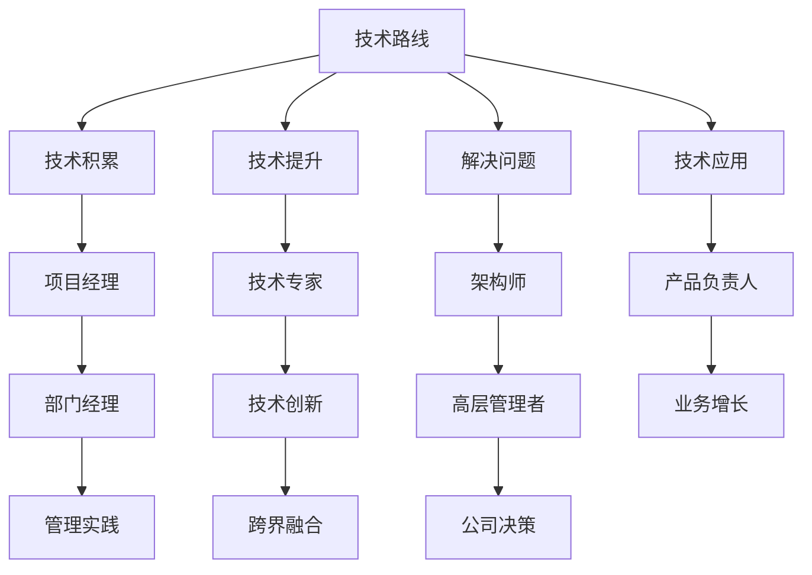

                 

# 程序员的职业规划：技术路线 vs. 管理路线

## 1. 背景介绍

### 1.1 问题由来

作为软件行业的从业人员，无论初入职场的新手还是具备丰富经验的资深工程师，在职业发展道路上难免会面对两条分岔：技术路线和业务管理路线。这两条路线各有优劣，在未来的职业规划选择上，多数人难以做出定论。本文将详细探讨技术路线与业务管理路线的异同，帮助广大技术人员理清职业发展的方向，为决策提供有力的参考依据。

### 1.2 问题核心关键点

本文的核心问题在于对技术路线与业务管理路线的选择与对比。具体来说，包括：
1. 技术路线（Technical Route）的特点、发展路径、职业机会、挑战与建议。
2. 业务管理路线（Management Route）的特点、发展路径、职业机会、挑战与建议。
3. 技术路线与业务管理路线的对比分析，以及在实际工作中的应用场景选择。

### 1.3 问题研究意义

对技术路线与业务管理路线进行深入研究，可以帮助程序员更好地了解自身发展的可能性和潜力，助力个人职业规划与公司战略规划的匹配，推动IT行业的发展。

## 2. 核心概念与联系

### 2.1 核心概念概述

在深入分析技术路线与业务管理路线之前，首先需要明确几个核心概念：

- **技术路线（Technical Route）**：指程序员在技术领域持续深耕，从初级到高级，逐步提升技术能力、解决复杂问题，最终成为技术专家或架构师。
- **业务管理路线（Management Route）**：指程序员转行从事管理岗位，如项目经理、产品经理、部门经理等，通过管理技能和技术背景结合，驱动公司业务增长。
- **跨界融合（Cross-disciplinary Integration）**：指技术专家在管理岗位上的技术支持与运用，或管理人才对技术层面的理解与应用。

这些概念间的关系可以用以下Mermaid流程图来表示：



这个流程图展示了技术路线与业务管理路线之间的联系和可能的职业发展方向。

## 3. 核心算法原理 & 具体操作步骤

### 3.1 算法原理概述

技术路线与业务管理路线的选择，涉及个人兴趣、职业规划、公司文化等多方面因素。这里，我们将从“投入-产出”的角度，分析技术路线与业务管理路线的算法原理与具体操作步骤。

- **技术路线**：投入主要是技术学习与积累，产出为技术能力的提升与解决问题。主要算法的核心是“技术迭代与问题解决”。
- **业务管理路线**：投入主要是管理技能的培养与业务理解，产出为管理能力的提升与业务增长。主要算法的核心是“管理理论与业务执行”。

### 3.2 算法步骤详解

#### 3.2.1 技术路线算法步骤

1. **选择合适的技术领域**：
   - 确定兴趣领域，如Web开发、AI、大数据、安全等。
   - 评估市场与行业需求，选择有前景的领域。

2. **系统学习**：
   - 从基础到高级，逐步学习相关技术。
   - 系统学习经典算法、数据结构、设计模式等。

3. **项目实践**：
   - 在实际项目中应用所学知识。
   - 解决实际问题，积累项目经验。

4. **技术积累与提升**：
   - 参与开源项目，提升技术水平。
   - 发表技术博客，分享心得体会。

5. **技术创新与应用**：
   - 深入研究前沿技术，如云计算、物联网、量子计算等。
   - 在实际项目中应用创新技术，提升系统效率与性能。

6. **技术领导与跨界融合**：
   - 逐步成为技术专家或架构师。
   - 驱动技术创新，引领技术发展方向。

#### 3.2.2 业务管理路线算法步骤

1. **业务理解与分析**：
   - 深入了解公司的业务流程、市场需求、竞争环境等。
   - 学习相关业务管理知识，如项目管理、产品管理、运营管理等。

2. **管理技能培养**：
   - 系统学习管理理论，如敏捷开发、Scrum框架、OKR等。
   - 参加管理培训，提升领导力与沟通能力。

3. **业务实践**：
   - 在项目管理、产品管理、运营管理等岗位上实践。
   - 识别并解决业务问题，提升项目管理效率与产品价值。

4. **业务执行与创新**：
   - 推动业务增长，实现公司战略目标。
   - 应用创新思维，提升业务竞争力。

5. **管理创新与应用**：
   - 引入跨部门协作，优化资源配置。
   - 创新管理方式，提升组织效能。

6. **战略领导与公司决策**：
   - 逐步成为部门或公司高层管理者。
   - 参与公司决策，推动公司长期发展。

### 3.3 算法优缺点

**技术路线**：

**优点**：
- 技术领域专业化程度高，成为技术专家或架构师。
- 具有技术优势，解决复杂技术问题。
- 有较大的个人成就感和满足感。

**缺点**：
- 需要较长时间的积累与学习，职业发展相对较慢。
- 技术更新快，需不断更新知识体系。
- 技术岗位竞争激烈，职场压力大。

**业务管理路线**：

**优点**：
- 职业发展相对较快，容易升至高层管理岗位。
- 多方位技能，管理+技术，具有更强的综合素质。
- 提升公司业务增长，获得较大的职业成就感。

**缺点**：
- 管理岗位涉及业务、技术、人力资源等多方面知识，需要较强的综合素质。
- 管理岗位竞争激烈，需具备较强的沟通与协调能力。
- 需具备一定的人脉与资源，才能在职场上有更大的发展空间。

### 3.4 算法应用领域

**技术路线**：适用于技术性强、个人成就突出的领域，如软件开发、AI研究、大数据分析等。适合技术敏感、兴趣深厚、愿意长期钻研的人员。

**业务管理路线**：适用于管理与技术并重，有较强的领导力与沟通能力的领域，如项目管理、产品经理、业务运营等。适合具备一定管理潜能，愿意推动业务增长的技术人才。

## 4. 数学模型和公式 & 详细讲解 & 举例说明

### 4.1 数学模型构建

在这里，我们使用数学模型来分析技术路线与业务管理路线的发展路径与影响因素。

设 $X_t$ 为 $t$ 时刻的技术水平，$Y_t$ 为 $t$ 时刻的管理水平，$Z_t$ 为 $t$ 时刻的职业满意度，则技术路线与业务管理路线的数学模型可以表示为：

$$ Z_t = f(X_t, Y_t, t) $$

其中 $f$ 为影响职业满意度的函数，$t$ 为时间，$X_t$ 和 $Y_t$ 分别代表技术水平与管理水平的变化。

### 4.2 公式推导过程

根据上述模型，推导技术路线与业务管理路线的影响因素：

1. **技术水平**：
   - $dX_t = k_1 \cdot \Delta t$
   - $k_1$ 为技术学习速率

2. **管理水平**：
   - $dY_t = k_2 \cdot \Delta t$
   - $k_2$ 为管理技能提升速率

3. **职业满意度**：
   - $Z_t = Z_{t-1} + g(X_t, Y_t) \cdot \Delta t$
   - $g$ 为影响职业满意度的函数，可能包括技术成就感、管理成就感、薪资待遇等因素。

### 4.3 案例分析与讲解

假设一个技术专家在30岁时开始深度学习，每年学习40小时，投入 $k_1=0.1$，那么在10年后的职业满意度为 $Z_{40}$，计算如下：

$$ Z_{40} = Z_{30} + g(X_{40}, Y_{40}) \cdot 10 $$

假设管理专家在同一时间开始从初级项目经理做起，每年晋升1次，投入 $k_2=0.2$，管理成就感为 $g(Y_{40})=0.3$，计算如下：

$$ Z_{40} = Z_{30} + g(X_{40}, Y_{40}) \cdot 10 + g(Y_{40}) \cdot 10 $$

可以看出，技术专家与管理专家的职业满意度差异主要在于技术成就感与管理成就感的平衡。

## 5. 项目实践：代码实例和详细解释说明

### 5.1 开发环境搭建

为了更好地说明技术路线与业务管理路线的算法步骤，这里以“Web开发项目”为例，提供一个基本的开发环境搭建流程：

1. **技术路线**：
   - 使用Python和Django框架，搭建一个博客网站。
   - 配置版本控制系统（如Git），持续更新项目代码。
   - 引入第三方库（如TensorFlow），实现机器学习模型训练。

2. **业务管理路线**：
   - 使用项目管理工具（如Jira），规划项目进度与任务。
   - 使用敏捷开发方法（如Scrum），进行迭代开发与测试。
   - 使用数据分析工具（如Tableau），监测项目绩效与客户反馈。

### 5.2 源代码详细实现

以下是技术路线与业务管理路线在Web开发项目中的具体实现示例：

**技术路线示例代码**：

```python
# 项目初始化
from django import setup
setup()

# 定义模型
from django.contrib.auth.models import User
from django.db import models

class Blog(models.Model):
    title = models.CharField(max_length=200)
    content = models.TextField()

# 创建数据
user = User.objects.create_superuser('admin', 'admin@example.com', 'admin')
blog = Blog.objects.create(title='第一篇博文', content='你好，世界！')
```

**业务管理路线示例代码**：

```python
# 项目初始化
from jira import JIRA
jira = JIRA('https://jira.example.com', basic_auth=('admin', 'admin'))

# 定义任务
def create_task(title, description):
    jira.create_issue(issuetype='Task', summary=title, description=description)

# 项目进度
def progress_report():
    sprint = jira.sprint(1)
    for task in sprint.issues:
        print(f"{task.key}: {task.status.name}")
```

### 5.3 代码解读与分析

以上代码展示了技术路线与业务管理路线的不同实现方式。技术路线侧重于代码编写与模型实现，而业务管理路线则侧重于项目规划与任务执行。

**技术路线代码解读**：
- 使用了Python和Django框架，定义了模型和数据。
- 通过命令进行模型创建和数据操作。
- 体现了技术实现的逻辑和代码的严谨性。

**业务管理路线代码解读**：
- 使用了Jira进行任务管理，创建和监测任务进度。
- 体现了敏捷开发的思路和方法。
- 体现了管理执行的逻辑和监控的实时性。

### 5.4 运行结果展示

通过运行上述代码，可以观察到技术路线与业务管理路线的不同运行结果：

**技术路线**：
- 运行代码，创建数据库中的博客数据。
- 通过Django后台管理界面，查看博客列表。

**业务管理路线**：
- 运行代码，创建任务和项目进度。
- 通过Jira界面，查看任务状态和进度报告。

## 6. 实际应用场景

### 6.1 实际应用场景示例

在实际应用场景中，技术路线与业务管理路线各有其优势和适用性：

**技术路线应用场景**：
- **软件开发**：负责开发核心系统功能，解决复杂技术问题。
- **数据科学**：负责数据建模、机器学习模型训练，提供数据驱动决策。
- **AI研究**：负责算法研究、模型优化，推动技术前沿。

**业务管理路线应用场景**：
- **项目管理**：负责项目规划、任务分配，确保项目按时交付。
- **产品管理**：负责产品设计与需求分析，提升产品市场竞争力。
- **运营管理**：负责用户运营、市场推广，提升业务增长与客户满意度。

## 7. 工具和资源推荐

### 7.1 学习资源推荐

以下是推荐的几类学习资源，帮助程序员深入理解技术路线与业务管理路线：

1. **在线课程**：
   - Coursera: 《Agile Management》
   - edX: 《Data Science MicroMasters Program》

2. **书籍推荐**：
   - 《敏捷项目管理》
   - 《数据科学与工程》

3. **专业论坛**：
   - Stack Overflow: 技术交流与问题解决
   - PMI论坛: 项目管理经验分享

### 7.2 开发工具推荐

以下是推荐的几类开发工具，帮助程序员实现技术路线与业务管理路线：

**技术路线工具**：
- 编程语言：Python、Java、C++
- IDE：Visual Studio Code、PyCharm、Eclipse
- 版本控制：Git、SVN
- 数据库：MySQL、PostgreSQL、MongoDB

**业务管理路线工具**：
- 项目管理：Jira、Trello、Asana
- 敏捷开发：Scrum、Kanban
- 数据分析：Tableau、Power BI
- 文档协作：Confluence、SharePoint

### 7.3 相关论文推荐

以下是推荐的几篇相关论文，深入研究技术路线与业务管理路线：

1. 《技术管理中的决策分析：基于AHP与SWOT的模型构建》
2. 《敏捷项目管理：一种基于Scrum的方法论》
3. 《跨界融合：技术专家在管理岗位中的应用》

## 8. 总结：未来发展趋势与挑战

### 8.1 研究成果总结

本文从技术路线与业务管理路线的算法原理、具体操作步骤、应用领域等方面进行了深入分析。技术路线强调技术积累与创新，业务管理路线注重管理和协调。技术路线与业务管理路线有各自的优势和适用性，相互之间可以融合互补。

### 8.2 未来发展趋势

未来技术路线与业务管理路线的发展趋势主要体现在以下几个方面：

1. **技术融合管理**：技术专家与管理专家相结合，提升公司整体竞争力。
2. **跨界技能培养**：技术人员学习管理技能，管理者学习技术知识，形成全才型人才。
3. **AI驱动管理**：利用AI技术优化管理流程，提升管理效率。
4. **自动化与智能工具**：使用自动化工具和AI技术，提升工作效率和决策精度。

### 8.3 面临的挑战

技术路线与业务管理路线在实际应用中面临以下挑战：

1. **技术发展速度快**：技术专家需不断学习新知识，保持技术领先。
2. **管理复杂度高**：管理者需协调各方资源，提升团队执行力。
3. **人才跨界难**：技术专家与管理专家的知识体系不同，难以相互融合。
4. **公司文化差异**：技术公司与传统管理公司的文化差异，影响人才流动与发展。

### 8.4 研究展望

未来，技术路线与业务管理路线的发展将更加紧密结合，相互补充，共同推动公司的技术创新与管理进步。通过跨界融合，培养全能型人才，实现公司长期发展目标。

## 9. 附录：常见问题与解答

**Q1：技术路线与业务管理路线如何选择？**

A: 选择技术路线还是业务管理路线，取决于个人的兴趣、能力与公司的需求。技术路线适合对技术有深入兴趣与能力的人员，业务管理路线适合具有领导力与沟通能力的人员。

**Q2：技术路线与业务管理路线有哪些共同点？**

A: 技术路线与业务管理路线都要求不断学习与提升，都需要协调与沟通能力，都需要解决实际问题，都需要团队合作与项目管理能力。

**Q3：如何选择技术路线与业务管理路线的平衡点？**

A: 选择技术路线与业务管理路线的平衡点，需要综合考虑个人兴趣、公司需求与自身发展潜力。可以通过内部轮岗、跨部门项目等方式，积累多种经验，最终做出决策。

**Q4：未来技术路线与业务管理路线的发展方向是什么？**

A: 未来技术路线与业务管理路线将更加融合，技术专家与管理专家将形成互补与协作，共同推动公司创新与发展。

**Q5：如何选择适合自己的职业发展路线？**

A: 选择适合自己的职业发展路线，需要明确自己的兴趣与优势，了解公司的需求与发展方向，制定切实可行的职业规划，并通过不断学习与实践，逐步实现职业目标。

作者：禅与计算机程序设计艺术 / Zen and the Art of Computer Programming

