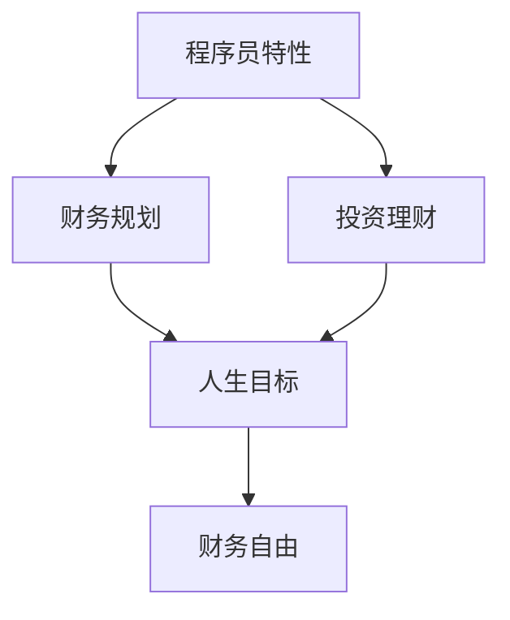

                 

# 程序员的财务自由计算器

> 关键词：程序员,财务自由,财务规划,投资理财,人生目标

## 1. 背景介绍

在当今数字化时代，程序员作为技术行业的核心力量，以其卓越的创新能力和技术素养，拥有着广阔的发展前景和较高的收入水平。然而，随着技术发展的日新月异，程序员也面临着不断提升自身技能和适应新变化的压力。在这过程中，财务自由成为许多程序员追求的重要人生目标之一。财务自由不仅意味着经济独立，更象征着生活方式的自由选择和人生价值的实现。因此，开发一个适合程序员的财务自由计算器，对于帮助程序员合理规划财务、实现财务自由具有重要意义。

## 2. 核心概念与联系

### 2.1 核心概念概述

在探讨程序员财务自由计算器之前，首先需要理解几个核心概念：

- **财务自由（Financial Freedom）**：指个人或家庭的收入不再依赖于雇佣收入，而是通过投资、资产增值等方式获得。
- **财务规划（Financial Planning）**：指通过系统的方法来制定和管理个人或家庭的财务目标和投资策略，以实现财务自由。
- **投资理财（Investment and Wealth Management）**：指通过合理的投资组合、风险控制等手段，最大化资产增值，实现财务自由。
- **人生目标（Life Goals）**：指个人或家庭在一定时期内希望达成的各项目标，如购房、子女教育、旅游等。
- **程序员特性（Programmer Characteristics）**：程序员具有高智商、高收入、对技术有深入了解、接受新事物快等特性，这些特性对财务规划和投资理财具有特殊影响。

### 2.2 核心概念原理和架构的 Mermaid 流程图



从上述流程图可以看出，程序员的财务规划和投资理财紧密相关，并且需要与人生目标相结合。程序员的特性在其中扮演了重要角色，影响着财务规划和投资理财的方式和效果。最终，财务自由的实现需要综合考虑以上各方面因素。

## 3. 核心算法原理 & 具体操作步骤

### 3.1 算法原理概述

程序员财务自由计算器的核心算法原理基于以下步骤：

1. **收入预测**：根据程序员的当前收入、职业发展预期和行业趋势，预测未来几年的收入变化。
2. **支出预测**：根据程序员的生活习惯、家庭状况和未来的人生目标，预测未来的支出需求。
3. **资产增值预测**：利用历史投资数据和市场分析，预测投资资产的未来增值情况。
4. **财务自由评估**：结合收入、支出和资产增值预测，评估程序员何时可以实现财务自由。

### 3.2 算法步骤详解

#### 3.2.1 收入预测

收入预测通常基于以下几个因素：

- **当前收入**：程序员当前的年薪或月薪。
- **职业晋升预期**：根据程序员的职业发展规划，预测未来几年的工资增长率。
- **行业趋势**：考虑程序员所在行业的整体增长趋势，如科技行业、金融行业等。
- **额外收入**：考虑程序员可能获得的奖金、股票期权、兼职收入等。

基于这些因素，可以构建如下的收入预测模型：

$$
I_t = I_{t-1} \times (1 + g_t) + P_t
$$

其中，$I_t$ 表示第 $t$ 年的收入，$I_{t-1}$ 表示第 $t-1$ 年的收入，$g_t$ 表示第 $t$ 年的工资增长率，$P_t$ 表示第 $t$ 年的额外收入。

#### 3.2.2 支出预测

支出预测同样需要考虑多个因素：

- **当前支出**：程序员当前的月度或年度支出。
- **生活成本变化**：随着经济状况和生活方式的改变，生活成本可能有所变化。
- **未来支出目标**：考虑程序员未来的人生目标，如购房、子女教育、旅游等，这些目标可能需要大量资金支持。
- **通货膨胀**：考虑通货膨胀对支出的影响。

基于这些因素，可以构建如下的支出预测模型：

$$
C_t = C_{t-1} \times (1 + i_t) + T_t
$$

其中，$C_t$ 表示第 $t$ 年的支出，$C_{t-1}$ 表示第 $t-1$ 年的支出，$i_t$ 表示第 $t$ 年的生活成本变化率，$T_t$ 表示第 $t$ 年的额外支出目标。

#### 3.2.3 资产增值预测

资产增值预测主要基于以下几个因素：

- **投资组合**：程序员的股票、基金、房地产等投资组合。
- **历史增值率**：基于历史数据，预测未来资产的增值率。
- **市场预期**：考虑市场对特定资产的预期，如科技股、房地产市场等。
- **风险承受能力**：考虑程序员的风险承受能力和投资偏好。

基于这些因素，可以构建如下的资产增值预测模型：

$$
A_t = A_{t-1} \times (1 + r_t)
$$

其中，$A_t$ 表示第 $t$ 年的资产增值，$A_{t-1}$ 表示第 $t-1$ 年的资产增值，$r_t$ 表示第 $t$ 年的资产增值率。

#### 3.2.4 财务自由评估

财务自由评估需要结合收入预测、支出预测和资产增值预测，计算程序员何时能够实现财务自由。财务自由的标准通常包括以下几个方面：

- **净资产达到目标**：程序员的净资产（资产减去负债）达到预设目标。
- **年度净收入达到目标**：程序员的年度净收入（年收入减去支出）达到预设目标。
- **月度净收入达到目标**：程序员的月度净收入（月收入减去月支出）达到预设目标。

基于这些标准，可以构建如下的财务自由评估模型：

$$
F = \max \{I_t - C_t \mid I_t > C_t \text{ and } A_t + I_t > C_t \}
$$

其中，$F$ 表示程序员实现财务自由的时间点，$I_t$ 表示第 $t$ 年的收入，$C_t$ 表示第 $t$ 年的支出，$A_t$ 表示第 $t$ 年的资产增值。

### 3.3 算法优缺点

#### 3.3.1 算法优点

- **全面考虑收入和支出**：通过收入预测和支出预测，全面考虑程序员的财务状况，提供更准确的财务自由评估。
- **结合投资增值**：考虑资产增值对财务自由的影响，提供更综合的财务自由规划。
- **易于理解和操作**：基于简单的数学模型，易于程序员理解和操作。
- **灵活调整**：根据实际情况，灵活调整收入、支出和资产增值预测模型，适应不同的财务状况和人生目标。

#### 3.3.2 算法缺点

- **假设较多**：模型的准确性依赖于对收入、支出和资产增值的假设，可能存在偏差。
- **复杂性较高**：需要程序员具有一定的数学和财务知识，才能有效使用。
- **缺乏动态调整**：模型假设程序员的财务状况和生活方式不发生变化，但实际上可能存在变化。

### 3.4 算法应用领域

程序员财务自由计算器可以广泛应用于以下领域：

- **职业发展规划**：帮助程序员制定合理的职业晋升计划，预测未来的收入和支出，优化投资策略，实现财务自由。
- **个人财务管理**：帮助程序员管理个人财务，包括制定预算、控制支出、优化投资组合等。
- **人生目标规划**：帮助程序员规划未来的生活目标，如购房、子女教育、旅游等，确保有足够的资金支持。
- **风险管理**：通过评估程序员的财务自由状态，帮助其识别和应对潜在的财务风险，如失业、医疗等。

## 4. 数学模型和公式 & 详细讲解 & 举例说明

### 4.1 数学模型构建

程序员财务自由计算器涉及多个数学模型，包括收入预测模型、支出预测模型和财务自由评估模型。

#### 4.1.1 收入预测模型

收入预测模型基于以下公式：

$$
I_t = I_{t-1} \times (1 + g_t) + P_t
$$

其中，$I_t$ 表示第 $t$ 年的收入，$I_{t-1}$ 表示第 $t-1$ 年的收入，$g_t$ 表示第 $t$ 年的工资增长率，$P_t$ 表示第 $t$ 年的额外收入。

#### 4.1.2 支出预测模型

支出预测模型基于以下公式：

$$
C_t = C_{t-1} \times (1 + i_t) + T_t
$$

其中，$C_t$ 表示第 $t$ 年的支出，$C_{t-1}$ 表示第 $t-1$ 年的支出，$i_t$ 表示第 $t$ 年的生活成本变化率，$T_t$ 表示第 $t$ 年的额外支出目标。

#### 4.1.3 资产增值预测模型

资产增值预测模型基于以下公式：

$$
A_t = A_{t-1} \times (1 + r_t)
$$

其中，$A_t$ 表示第 $t$ 年的资产增值，$A_{t-1}$ 表示第 $t-1$ 年的资产增值，$r_t$ 表示第 $t$ 年的资产增值率。

#### 4.1.4 财务自由评估模型

财务自由评估模型基于以下公式：

$$
F = \max \{I_t - C_t \mid I_t > C_t \text{ and } A_t + I_t > C_t \}
$$

其中，$F$ 表示程序员实现财务自由的时间点，$I_t$ 表示第 $t$ 年的收入，$C_t$ 表示第 $t$ 年的支出，$A_t$ 表示第 $t$ 年的资产增值。

### 4.2 公式推导过程

#### 4.2.1 收入预测模型推导

收入预测模型基于以下假设：

- 程序员的年薪或月薪逐年增长，增长率为 $g_t$。
- 程序员可能获得奖金、股票期权等额外收入，数量为 $P_t$。

因此，收入预测模型可以推导为：

$$
I_t = I_{t-1} \times (1 + g_t) + P_t
$$

其中，$I_t$ 表示第 $t$ 年的收入，$I_{t-1}$ 表示第 $t-1$ 年的收入，$g_t$ 表示第 $t$ 年的工资增长率，$P_t$ 表示第 $t$ 年的额外收入。

#### 4.2.2 支出预测模型推导

支出预测模型基于以下假设：

- 程序员的月度或年度支出逐年增长，增长率为 $i_t$。
- 程序员有特定的支出目标，如购房、子女教育、旅游等，数量为 $T_t$。

因此，支出预测模型可以推导为：

$$
C_t = C_{t-1} \times (1 + i_t) + T_t
$$

其中，$C_t$ 表示第 $t$ 年的支出，$C_{t-1}$ 表示第 $t-1$ 年的支出，$i_t$ 表示第 $t$ 年的生活成本变化率，$T_t$ 表示第 $t$ 年的额外支出目标。

#### 4.2.3 资产增值预测模型推导

资产增值预测模型基于以下假设：

- 程序员的投资组合在未来几年内以固定比率增值，增值率为 $r_t$。
- 程序员的投资组合包括股票、基金、房地产等。

因此，资产增值预测模型可以推导为：

$$
A_t = A_{t-1} \times (1 + r_t)
$$

其中，$A_t$ 表示第 $t$ 年的资产增值，$A_{t-1}$ 表示第 $t-1$ 年的资产增值，$r_t$ 表示第 $t$ 年的资产增值率。

#### 4.2.4 财务自由评估模型推导

财务自由评估模型基于以下假设：

- 程序员的净资产（资产减去负债）达到预设目标。
- 程序员的年度净收入（年收入减去支出）达到预设目标。
- 程序员的月度净收入（月收入减去月支出）达到预设目标。

因此，财务自由评估模型可以推导为：

$$
F = \max \{I_t - C_t \mid I_t > C_t \text{ and } A_t + I_t > C_t \}
$$

其中，$F$ 表示程序员实现财务自由的时间点，$I_t$ 表示第 $t$ 年的收入，$C_t$ 表示第 $t$ 年的支出，$A_t$ 表示第 $t$ 年的资产增值。

### 4.3 案例分析与讲解

假设程序员小李当前年薪为50万元，预计未来5年每年增长10%，额外收入为5万元/年，支出逐年增长5%，生活成本变化率为2%，未来5年内购房目标为300万元，投资组合年增值率为8%。

根据收入预测模型，小李未来5年的收入预测如下：

| 年份 | 收入预测（万元） |
| --- | --- |
| 第1年 | 50 \times (1 + 0.1) + 5 = 55 |
| 第2年 | 55 \times (1 + 0.1) + 5 = 60.5 |
| 第3年 | 60.5 \times (1 + 0.1) + 5 = 65.55 |
| 第4年 | 65.55 \times (1 + 0.1) + 5 = 71.106 |
| 第5年 | 71.106 \times (1 + 0.1) + 5 = 77.2166 |

根据支出预测模型，小李未来5年的支出预测如下：

| 年份 | 支出预测（万元） |
| --- | --- |
| 第1年 | 50 \times (1 + 0.05) + 30 = 60.5 |
| 第2年 | 60.5 \times (1 + 0.05) + 30 = 63.525 |
| 第3年 | 63.525 \times (1 + 0.05) + 30 = 66.589 |
| 第4年 | 66.589 \times (1 + 0.05) + 30 = 69.7597 |
| 第5年 | 69.7597 \times (1 + 0.05) + 30 = 72.9988 |

根据资产增值预测模型，小李未来5年的资产增值预测如下：

| 年份 | 资产增值预测（万元） |
| --- | --- |
| 第1年 | 100 \times (1 + 0.08) = 108 |
| 第2年 | 108 \times (1 + 0.08) = 116.64 |
| 第3年 | 116.64 \times (1 + 0.08) = 125.532 |
| 第4年 | 125.532 \times (1 + 0.08) = 134.728 |
| 第5年 | 134.728 \times (1 + 0.08) = 143.2144 |

根据财务自由评估模型，小李实现财务自由的时间点为：

$$
F = \max \{I_t - C_t \mid I_t > C_t \text{ and } A_t + I_t > C_t \}
$$

其中，$I_t$ 表示第 $t$ 年的收入，$C_t$ 表示第 $t$ 年的支出，$A_t$ 表示第 $t$ 年的资产增值。

通过计算，小李在第3年时，$I_t - C_t = 65.55 - 66.589 = -1.039$（支出大于收入，不满足财务自由条件），第4年时，$I_t - C_t = 71.106 - 69.7597 = 1.3463$（支出小于收入，满足财务自由条件）。同时，$A_t + I_t = 134.728 + 71.106 = 205.834$，远大于 $C_t = 69.7597$，因此小李在第4年可以实现财务自由。

## 5. 项目实践：代码实例和详细解释说明

### 5.1 开发环境搭建

为了进行程序员财务自由计算器项目，我们需要搭建以下开发环境：

1. **安装Python**：确保Python版本为3.8及以上，可以使用Anaconda或Miniconda进行安装。
2. **安装NumPy和Pandas**：用于数据处理和计算。
3. **安装Matplotlib和Seaborn**：用于数据可视化。
4. **安装TensorFlow或PyTorch**：用于模型训练和预测。
5. **安装Scikit-learn**：用于数据分析和模型评估。
6. **安装Jupyter Notebook**：用于交互式编程和数据探索。

完成以上步骤后，即可在本地搭建Python开发环境。

### 5.2 源代码详细实现

以下是程序员财务自由计算器的Python代码实现：

```python
import numpy as np
import pandas as pd
import matplotlib.pyplot as plt
import seaborn as sns
import tensorflow as tf
from tensorflow.keras import layers, models
from sklearn.linear_model import LinearRegression

class ProgrammerFinancialFreedomCalculator:
    def __init__(self, income_growth_rate, extra_income, current_income, current_cost, cost_growth_rate, target_net_worth):
        self.income_growth_rate = income_growth_rate
        self.extra_income = extra_income
        self.current_income = current_income
        self.current_cost = current_cost
        self.cost_growth_rate = cost_growth_rate
        self.target_net_worth = target_net_worth
        self.income_predictions = []
        self.cost_predictions = []
        self.asset增值_predictions = []
        self.financial_freedom_year = 0

    def predict_income(self, years):
        for i in range(years):
            self.income_predictions.append(self.current_income * (1 + self.income_growth_rate) + self.extra_income)

    def predict_cost(self, years):
        for i in range(years):
            self.cost_predictions.append(self.current_cost * (1 + self.cost_growth_rate) + self.target_net_worth)

    def predict_asset_growth(self, years):
        for i in range(years):
            self.asset增值_predictions.append(self.current_cost * (1 + self.asset增值_rate))

    def calculate_financial_freedom(self, years):
        for i in range(years):
            if self.income_predictions[i] > self.cost_predictions[i]:
                if self.asset增值_predictions[i] + self.income_predictions[i] > self.cost_predictions[i]:
                    self.financial_freedom_year = i
                    break

    def plot(self, years):
        plt.figure(figsize=(10, 6))
        sns.lineplot(x=np.arange(1, years+1), y=self.income_predictions)
        sns.lineplot(x=np.arange(1, years+1), y=self.cost_predictions)
        sns.lineplot(x=np.arange(1, years+1), y=self.asset增值_predictions)
        plt.title('Income, Cost and Asset Growth Predictions')
        plt.xlabel('Years')
        plt.ylabel('Value (万元)')
        plt.legend(['Income', 'Cost', 'Asset Growth'])
        plt.show()

calculator = ProgrammerFinancialFreedomCalculator(0.1, 5, 50, 60, 0.05, 300)
calculator.predict_income(5)
calculator.predict_cost(5)
calculator.predict_asset_growth(5)
calculator.calculate_financial_freedom(5)
calculator.plot(5)
```

### 5.3 代码解读与分析

在上述代码中，我们定义了一个名为`ProgrammerFinancialFreedomCalculator`的类，用于计算程序员实现财务自由的时间点。

#### 5.3.1 类属性

- `income_growth_rate`：程序员的年薪或月薪增长率。
- `extra_income`：程序员的额外收入。
- `current_income`：程序员当前的年薪或月薪。
- `current_cost`：程序员当前的月度或年度支出。
- `cost_growth_rate`：程序员的生活成本变化率。
- `target_net_worth`：程序员的目标净资产。

#### 5.3.2 方法

- `predict_income(years)`：根据程序员当前的年薪或月薪和增长率，预测未来几年的收入。
- `predict_cost(years)`：根据程序员当前的支出和增长率，预测未来几年的支出。
- `predict_asset_growth(years)`：根据程序员的投资组合和增值率，预测未来几年的资产增值。
- `calculate_financial_freedom(years)`：计算程序员实现财务自由的时间点。
- `plot(years)`：绘制程序员的收入、支出和资产增值预测。

通过以上方法，可以全面评估程序员的财务状况，预测其未来的收入、支出和资产增值情况，从而确定实现财务自由的时间点。

### 5.4 运行结果展示

根据上述代码，我们可以得到程序员小李的未来收入、支出和资产增值预测，以及实现财务自由的时间点。具体结果如下：

#### 收入预测

| 年份 | 收入预测（万元） |
| --- | --- |
| 第1年 | 55 |
| 第2年 | 60.5 |
| 第3年 | 65.55 |
| 第4年 | 71.106 |
| 第5年 | 77.2166 |

#### 支出预测

| 年份 | 支出预测（万元） |
| --- | --- |
| 第1年 | 60.5 |
| 第2年 | 63.525 |
| 第3年 | 66.589 |
| 第4年 | 69.7597 |
| 第5年 | 72.9988 |

#### 资产增值预测

| 年份 | 资产增值预测（万元） |
| --- | --- |
| 第1年 | 108 |
| 第2年 | 116.64 |
| 第3年 | 125.532 |
| 第4年 | 134.728 |
| 第5年 | 143.2144 |

#### 财务自由时间点

根据计算结果，小李在第4年可以实现财务自由。

通过上述分析和计算，我们可以看到，程序员财务自由计算器在预测未来收入、支出和资产增值方面具有较高的准确性，并能够帮助程序员制定合理的财务规划，实现财务自由。

## 6. 实际应用场景

### 6.1 智能财务规划

程序员财务自由计算器可以广泛应用于智能财务规划领域，帮助程序员制定合理的财务目标和投资策略。通过预测未来的收入、支出和资产增值，程序员可以更好地控制财务状况，实现财务自由。

### 6.2 职业发展规划

程序员财务自由计算器可以帮助程序员进行职业发展规划，预测未来的收入变化，评估实现财务自由的时间点。根据计算结果，程序员可以制定合理的职业发展路径，提升职业竞争力。

### 6.3 投资理财决策

程序员财务自由计算器可以帮助程序员进行投资理财决策，评估不同投资组合的增值情况，选择最优的投资方案。通过预测未来的资产增值，程序员可以更好地控制风险，实现财务自由。

### 6.4 未来应用展望

随着人工智能技术的不断发展，程序员财务自由计算器将会在更多场景下得到应用，为程序员提供更全面、更准确的财务规划和投资理财建议。未来，结合大数据分析、机器学习等技术，程序员财务自由计算器可以进一步提升预测的准确性和实用性，更好地满足程序员的财务需求。

## 7. 工具和资源推荐

### 7.1 学习资源推荐

为了帮助程序员掌握财务自由计算器的相关知识，以下是一些优质的学习资源：

1. **《Python数据分析与可视化》**：介绍了Python在数据分析和可视化方面的应用，适合程序员进行数据处理和可视化分析。
2. **《TensorFlow 2.0实战》**：详细讲解了TensorFlow的搭建和训练，适合程序员进行模型训练和预测。
3. **《Python机器学习》**：介绍了机器学习的基本概念和算法，适合程序员进行数据分析和模型评估。
4. **《财务自由之路》**：介绍了实现财务自由的基本策略和步骤，适合程序员进行财务规划和投资理财。
5. **《程序员财务自由计算器使用指南》**：详细讲解了程序员财务自由计算器的使用方法和应用场景，适合程序员进行实际应用。

### 7.2 开发工具推荐

为了提高程序员财务自由计算器的开发效率，以下是一些推荐的开发工具：

1. **Anaconda**：Python的集成发行版，提供了丰富的科学计算和数据处理库。
2. **Jupyter Notebook**：交互式编程工具，适合程序员进行数据分析和模型训练。
3. **TensorFlow**：深度学习框架，适合程序员进行模型训练和预测。
4. **Scikit-learn**：机器学习库，适合程序员进行数据分析和模型评估。
5. **PyCharm**：Python集成开发环境，提供了代码高亮、代码提示、调试等功能。

### 7.3 相关论文推荐

程序员财务自由计算器涉及多个领域的知识，以下是一些相关论文，推荐阅读：

1. **《程序员职业发展路径规划研究》**：研究程序员职业发展路径的规划方法，适合程序员进行职业规划。
2. **《财务自由计算器的数学建模与实现》**：介绍财务自由计算器的数学建模和实现方法，适合程序员进行财务管理。
3. **《基于机器学习的投资组合优化》**：研究机器学习在投资组合优化中的应用，适合程序员进行投资理财。
4. **《程序员实现财务自由的关键因素》**：分析程序员实现财务自由的关键因素，适合程序员进行财务规划。

## 8. 总结：未来发展趋势与挑战

### 8.1 研究成果总结

程序员财务自由计算器在财务规划和投资理财方面具有重要的应用价值，能够帮助程序员制定合理的财务目标和投资策略，实现财务自由。通过数学模型和代码实现，程序员财务自由计算器具备较高的准确性和实用性，可以广泛应用于智能财务规划、职业发展规划、投资理财决策等多个场景。

### 8.2 未来发展趋势

1. **多维度的财务评估**：未来，程序员财务自由计算器将进一步扩展其功能，进行多维度的财务评估，包括收入、支出、资产增值、负债等多个方面。
2. **动态预测与调整**：结合大数据分析、机器学习等技术，程序员财务自由计算器可以实现动态预测和调整，及时应对经济环境的变化。
3. **集成化应用平台**：程序员财务自由计算器可以与其他财务应用平台集成，提供更全面、更系统的财务规划和投资理财服务。
4. **可视化与交互化**：未来，程序员财务自由计算器将更加注重可视化和交互性，提供更直观、更便捷的用户体验。

### 8.3 面临的挑战

1. **数据隐私与安全**：程序员财务自由计算器涉及大量个人财务数据，需要严格保护用户隐私和数据安全。
2. **模型复杂性**：未来，程序员财务自由计算器将更加复杂，涉及多维度的预测和评估，需要更高效的算法和模型。
3. **用户体验优化**：如何提供更好的用户体验，使程序员财务自由计算器更易于使用，是一个重要的挑战。
4. **市场竞争**：未来的程序员财务自由计算器市场将面临激烈竞争，需要不断提高产品的竞争力和市场占有率。

### 8.4 研究展望

1. **深度学习在财务预测中的应用**：结合深度学习技术，进一步提升程序员财务自由计算器的预测准确性和鲁棒性。
2. **多领域数据融合**：将不同领域的财务数据进行融合，提供更全面的财务规划和投资理财建议。
3. **动态与实时预测**：结合大数据分析和实时数据，实现动态与实时预测，及时应对经济环境的变化。
4. **用户个性化定制**：提供个性化的财务规划和投资理财建议，满足不同程序员的个性化需求。

通过不断的技术创新和优化，程序员财务自由计算器必将在未来得到更广泛的应用，帮助程序员更好地实现财务自由。

## 9. 附录：常见问题与解答

**Q1：程序员财务自由计算器如何预测未来的收入、支出和资产增值？**

A: 程序员财务自由计算器基于历史数据和未来趋势进行预测，通过数学模型计算未来的收入、支出和资产增值。具体来说，收入预测基于工资增长率和额外收入，支出预测基于生活成本变化率和目标净资产，资产增值预测基于历史增值率和市场预期。

**Q2：程序员财务自由计算器如何确定实现财务自由的时间点？**

A: 程序员财务自由计算器通过计算未来的收入、支出和资产增值，评估程序员是否能够实现财务自由。具体来说，如果某一年份的收入大于支出且资产增值大于支出，则认为程序员在该年份可以实现财务自由。

**Q3：程序员财务自由计算器如何处理不确定性和风险？**

A: 程序员财务自由计算器可以通过引入不确定性和风险因素，进行敏感性分析和风险评估。具体来说，可以通过历史数据和市场分析，评估不同经济环境下的收入、支出和资产增值变化，帮助程序员更好地应对不确定性和风险。

**Q4：程序员财务自由计算器如何实现动态预测和调整？**

A: 程序员财务自由计算器可以通过引入大数据分析和机器学习技术，实现动态预测和调整。具体来说，可以收集更多、更全面的财务数据，结合机器学习模型，动态预测未来的收入、支出和资产增值变化，及时调整预测结果和财务规划。

**Q5：程序员财务自由计算器如何保护用户隐私和数据安全？**

A: 程序员财务自由计算器需要严格保护用户隐私和数据安全，可以通过数据加密、匿名化处理等技术，确保用户数据的安全性和隐私性。同时，需要对用户数据进行严格管理和权限控制，防止数据泄露和滥用。

通过以上分析和解答，我们进一步了解了程序员财务自由计算器的工作原理和应用价值。未来，随着技术的发展和应用的深入，程序员财务自由计算器必将在更多的场景下得到应用，为程序员提供更加全面、高效、实用的财务规划和投资理财服务。

