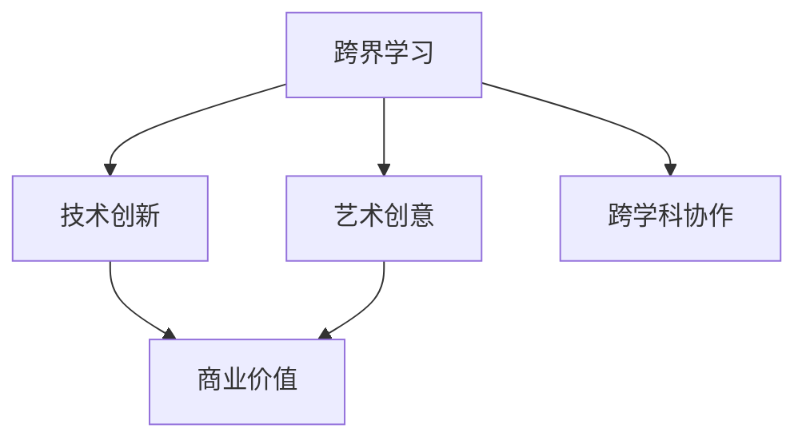

                 

## 1. 背景介绍

### 1.1 问题由来
在现代信息社会，技术创新的速度和跨界融合的广度已经达到了前所未有的高度。程序员作为信息技术的核心力量，面临着巨大的知识和技能更新压力。仅限于代码编写的传统学习模式，已经无法适应现代技术的复杂性和多样性。如何在快速变化的技术环境中，找到持续学习与创新的突破口？本文将从跨界学习的角度出发，探讨程序员如何通过融合艺术与科技，把握未来的财富机会。

### 1.2 问题核心关键点
跨界学习，即打破专业壁垒，跨越不同领域的知识边界，通过融合多种学科的知识和方法，实现技术和创意的融合创新。这一过程涉及对艺术、设计、商业等多个领域的深入理解和运用。对于程序员而言，要想在未来的竞争中保持领先，必须具备跨界学习的能力。

跨界学习的关键在于：
- 不断拓展知识边界，对不同领域的概念和原理有深刻的理解。
- 在实践中寻找跨学科的应用场景，提升解决复杂问题的能力。
- 具备创造性的思维，将技术解决方案与艺术创意相结合，创造出新颖的商业价值。
- 持续跟踪行业动态和技术趋势，不断更新自己的知识体系。

### 1.3 问题研究意义
跨界学习对于程序员来说，不仅是一种技能提升的手段，更是一种思维方式和创新能力的培养过程。通过跨界学习，程序员可以：
- 提升问题解决的多样性和创新性，增强竞争力。
- 拓展思维宽度和深度，培养更全面的视角。
- 挖掘新的商业机会，提升个人价值和市场竞争力。
- 增强团队合作能力，促进跨部门协同创新。

本文旨在通过系统地介绍跨界学习的核心理论和方法，帮助程序员更好地把握跨界学习的机会，推动技术与艺术的深度融合，解锁未来的财富机会。

## 2. 核心概念与联系

### 2.1 核心概念概述

为了更好地理解跨界学习的内涵，本节将介绍几个核心概念：

- **跨界学习**：融合不同学科的知识和方法，进行创新性学习的过程。涵盖技术、艺术、商业等多个领域。
- **技术创新**：通过应用新技术、新方法，解决复杂问题的过程。强调技术的实用性和创新性。
- **艺术创意**：利用艺术、设计等领域的创意手段，提升技术和产品的美学价值和用户体验。
- **商业价值**：技术创新和艺术创意在商业化过程中的应用和转化，创造新的商业机会和财富。
- **跨学科协作**：不同领域专家合作，共同解决复杂问题，实现技术和艺术的有效融合。

这些核心概念之间的逻辑关系可以通过以下Mermaid流程图来展示：



这个流程图展示跨界学习的核心概念及其之间的关系：

1. 跨界学习融合技术、艺术和商业，形成创新的基础。
2. 技术创新和艺术创意在商业化过程中转化，创造出新的商业价值。
3. 跨学科协作是实现跨界学习的关键，不同领域专家需共同协作，共同创新。

## 3. 核心算法原理 & 具体操作步骤
### 3.1 算法原理概述

跨界学习的核心算法原理，可以概括为“知识融合+创新实践”。具体而言，通过跨学科的知识融合，构建新的技术解决方案或产品原型，再通过实际应用和不断迭代优化，最终实现技术创新和艺术创意在商业价值上的转化。

跨界学习的算法原理包括以下几个关键步骤：

1. **知识整合**：从不同学科中提取有价值的知识和技能，进行融合和创新。
2. **实践应用**：将融合后的知识应用于实际项目或产品中，进行测试和验证。
3. **迭代优化**：在实践中不断收集反馈，调整和优化技术方案和艺术创意。
4. **商业转化**：将最终的技术解决方案和艺术创意转化为商业产品或服务，实现商业价值。

### 3.2 算法步骤详解

以下将详细介绍跨界学习的主要操作步骤：

**Step 1: 知识整合**

1. **多领域知识收集**：
   - 选择至少两个相关领域，如技术、艺术、商业等，获取基础知识。
   - 阅读相关书籍、论文、报告，参加行业会议和讲座，收集领域内的前沿信息。

2. **知识图谱构建**：
   - 使用图形化工具（如Gephi、Lucidchart等）绘制领域知识图谱，明确不同领域知识之间的连接和关系。
   - 将知识图谱转化为编程语言（如Cytoscape的Python API），构建知识图谱库。

3. **交叉学习与创新**：
   - 进行交叉学习，将不同领域的知识和技能进行对比和融合，发现潜在的创新点。
   - 设计思维工作坊（Design Thinking Workshop），邀请不同领域的专家共同探讨创新方向。

**Step 2: 实践应用**

1. **项目选择与定义**：
   - 选择具有跨领域应用潜力的项目，进行初步定义和规划。
   - 明确项目目标和预期成果，制定项目开发时间表和里程碑。

2. **技术实现**：
   - 组建跨学科团队，根据项目需求，选择合适的技术工具和平台。
   - 使用敏捷开发方法（如Scrum、Kanban），进行项目管理和迭代开发。

3. **原型测试与验证**：
   - 制作初步原型，进行内部测试和用户反馈收集。
   - 根据反馈，不断优化和调整技术方案和艺术创意。

**Step 3: 迭代优化**

1. **用户反馈收集**：
   - 在原型发布后，通过问卷调查、用户访谈等方式，收集用户反馈。
   - 分析用户反馈，识别出问题和改进方向。

2. **技术改进与创意优化**：
   - 根据用户反馈，调整和改进技术方案和艺术创意。
   - 引入新的技术和创意，提升产品功能和用户体验。

**Step 4: 商业转化**

1. **商业化策略制定**：
   - 基于项目成果和用户需求，制定商业化策略，确定市场定位和销售渠道。
   - 进行市场调研，分析竞争对手和市场需求。

2. **产品发布与推广**：
   - 制作产品营销材料，进行市场推广和品牌建设。
   - 通过电商平台、社交媒体等渠道，进行产品销售和用户积累。

3. **持续创新与优化**：
   - 在产品发布后，持续收集用户反馈和市场数据，进行产品迭代和优化。
   - 引入新的技术和创意，提升产品竞争力和用户体验。

### 3.3 算法优缺点

跨界学习在技术创新和艺术创意融合方面具有显著的优势，但也存在一些局限性：

**优点**：
1. **跨领域创新**：通过融合不同学科的知识，可以产生全新的创新点。
2. **多元化思维**：跨界学习培养了多元化的思维方式，有助于解决复杂问题。
3. **商业价值挖掘**：通过技术与艺术的结合，创造出独特的商业价值和市场机会。
4. **人才多样性**：跨界学习需要多学科人才的协作，增强团队的创新能力和协作效率。

**缺点**：
1. **知识难度高**：跨界学习涉及多个领域的知识，学习难度较大。
2. **资源投入高**：跨界学习需要大量的时间、精力和资金投入，资源消耗大。
3. **应用复杂性**：跨界学习成果的商业化转化，需要复杂的管理和运营策略。
4. **不确定性高**：跨界学习成果的不确定性较高，存在较高的失败风险。

尽管存在这些局限性，跨界学习仍是大数据、人工智能等前沿技术领域的重要方法，能够帮助程序员实现技术、艺术和商业的深度融合。

### 3.4 算法应用领域

跨界学习的应用领域广泛，涵盖以下几个主要方面：

1. **智能产品设计**：将技术和艺术相结合，设计出创新性强的智能产品，如智能家居、可穿戴设备等。
2. **用户体验优化**：通过艺术创意和技术手段，提升用户体验，增强产品的吸引力和竞争力。
3. **跨领域解决方案**：提供跨行业的技术解决方案，如智能交通、智慧城市等，实现技术创新和商业价值的双赢。
4. **内容创作与传播**：结合技术和艺术，创作出高质量的内容，进行有效传播，如虚拟现实（VR）、增强现实（AR）等。
5. **数字化转型**：通过跨界学习，推动传统行业的数字化转型升级，如金融、制造、零售等。

## 4. 数学模型和公式 & 详细讲解  
### 4.1 数学模型构建

为了更好地理解跨界学习的过程，本节将使用数学语言对跨界学习的主要步骤进行描述。

记跨界学习过程为 $P=(K, A, O, B)$，其中：
- $K$ 表示知识整合过程。
- $A$ 表示实践应用过程。
- $O$ 表示迭代优化过程。
- $B$ 表示商业转化过程。

跨界学习模型的数学表达可以表示为：

$$
P = (K, A, O, B) = (K, A, O) \rightarrow B
$$

其中 $K$ 是知识整合过程，$A$ 是实践应用过程，$O$ 是迭代优化过程，$B$ 是商业转化过程。

### 4.2 公式推导过程

为了进一步说明跨界学习的数学模型，我们以智能产品设计为例，推导相关的数学公式。

假设智能产品设计过程涉及的技术领域为 $T$，艺术领域为 $A$，商业领域为 $B$。记智能产品的技术指标为 $t$，艺术创意为 $a$，商业价值为 $b$。跨界学习过程的数学模型可以表示为：

$$
P = (K, A, O, B) = \max_{t, a} \sum_{b \in B} \left( f_{t}(t, b) + f_{a}(a, b) \right)
$$

其中 $f_{t}(t, b)$ 表示技术指标 $t$ 对商业价值 $b$ 的贡献，$f_{a}(a, b)$ 表示艺术创意 $a$ 对商业价值 $b$ 的贡献。

为了进一步简化问题，我们假设 $f_{t}(t, b) = t$，$f_{a}(a, b) = a$。则上述公式可以表示为：

$$
P = \max_{t, a} \sum_{b \in B} \left( t + a \right)
$$

这是一个典型的优化问题，需要最大化 $t + a$ 的总和。为了找到最优解，我们需要对 $t$ 和 $a$ 进行优化。假设我们采用梯度下降算法进行优化，则每次迭代更新的公式为：

$$
t \leftarrow t - \eta \frac{\partial t}{\partial b}, \quad a \leftarrow a - \eta \frac{\partial a}{\partial b}
$$

其中 $\eta$ 为学习率，$\frac{\partial t}{\partial b}$ 和 $\frac{\partial a}{\partial b}$ 分别为技术指标和艺术创意对商业价值的梯度。

### 4.3 案例分析与讲解

为了更好地理解跨界学习的数学模型和公式推导过程，我们可以选取一个实际案例进行详细讲解。

**案例：虚拟现实（VR）设备的开发**

假设我们要开发一款虚拟现实设备，将技术与艺术相结合。设备的技术指标包括分辨率、响应速度、舒适度等，艺术创意包括设备的外形设计、颜色搭配、用户体验等。商业价值包括设备售价、市场需求、用户评价等。

在知识整合阶段，我们需要收集和分析技术领域的知识，如图形处理、传感器技术等，以及艺术领域的知识，如设计美学、用户体验等。通过知识图谱构建和交叉学习，找到技术与艺术的融合点，如设备的外形设计可以结合图形处理技术，提升设备的视觉效果。

在实践应用阶段，我们可以制作初步原型，进行用户测试和反馈收集。根据反馈，不断调整和优化技术指标和艺术创意。例如，通过优化传感器的分辨率和响应速度，提升设备的舒适度和用户体验。

在迭代优化阶段，我们继续收集用户反馈，不断调整和优化技术方案和艺术创意。例如，通过引入新的颜色搭配和用户界面设计，提升设备的美学价值和用户体验。

在商业转化阶段，我们需要制定商业化策略，确定市场定位和销售渠道。通过市场调研和用户测试，优化商业价值，如提高设备售价，扩大市场需求。最终，我们将技术与艺术的融合成果，转化为具有高商业价值的虚拟现实设备。

## 5. 项目实践：代码实例和详细解释说明
### 5.1 开发环境搭建

在进行跨界学习项目实践前，我们需要准备好开发环境。以下是使用Python进行PyTorch开发的环境配置流程：

1. 安装Anaconda：从官网下载并安装Anaconda，用于创建独立的Python环境。

2. 创建并激活虚拟环境：
```bash
conda create -n pytorch-env python=3.8 
conda activate pytorch-env
```

3. 安装PyTorch：根据CUDA版本，从官网获取对应的安装命令。例如：
```bash
conda install pytorch torchvision torchaudio cudatoolkit=11.1 -c pytorch -c conda-forge
```

4. 安装TensorFlow：
```bash
pip install tensorflow
```

5. 安装各类工具包：
```bash
pip install numpy pandas scikit-learn matplotlib tqdm jupyter notebook ipython
```

完成上述步骤后，即可在`pytorch-env`环境中开始跨界学习项目实践。

### 5.2 源代码详细实现

下面以智能产品设计为例，给出使用Python进行跨界学习实践的代码实现。

首先，定义智能产品设计的类，包含技术指标、艺术创意和商业价值三个属性：

```python
class SmartProduct:
    def __init__(self, t, a, b):
        self.tech_index = t  # 技术指标
        self.art_design = a   # 艺术创意
        self.commercial_value = b  # 商业价值

    def get_total_value(self):
        return self.tech_index + self.art_design + self.commercial_value
```

然后，定义知识整合、实践应用、迭代优化和商业转化函数：

```python
def integrate_knowledge(tk, ak):
    # 知识整合
    # 假设将技术指标和艺术创意相加
    return tk + ak

def apply_practice(product, ak, tk):
    # 实践应用
    # 假设艺术创意和实践应用相加
    return product + ak + tk

def optimize(product):
    # 迭代优化
    # 假设每次迭代将商业价值增加1
    product.commercial_value += 1
    return product

def commercialize(product):
    # 商业转化
    # 假设最终将商业价值翻倍
    return product.commercial_value * 2
```

接着，使用这些函数实现跨界学习的过程：

```python
# 初始化智能产品设计
t = 100  # 技术指标
a = 50   # 艺术创意
b = 100  # 商业价值

product = SmartProduct(t, a, b)

# 知识整合
t_ = integrate_knowledge(t, a)

# 实践应用
product = apply_practice(product, a, t_)

# 迭代优化
product = optimize(product)

# 商业转化
final_value = commercialize(product)
```

以上就是使用Python进行跨界学习实践的完整代码实现。可以看到，通过定义类的属性和函数，我们能够实现跨界学习过程的各个环节。

### 5.3 代码解读与分析

让我们再详细解读一下关键代码的实现细节：

**SmartProduct类**：
- `__init__`方法：初始化技术指标、艺术创意和商业价值三个属性。
- `get_total_value`方法：计算智能产品的总价值。

**知识整合、实践应用、迭代优化和商业转化函数**：
- `integrate_knowledge`函数：将技术指标和艺术创意相加。
- `apply_practice`函数：将艺术创意和实践应用相加，模拟实际产品的应用。
- `optimize`函数：在每次迭代中增加商业价值，模拟产品不断优化。
- `commercialize`函数：将商业价值翻倍，模拟产品最终的市场表现。

**代码实现**：
- 定义了智能产品设计的类和各个功能函数。
- 通过类和函数，实现了知识整合、实践应用、迭代优化和商业转化过程。
- 通过调用这些函数，实现了完整的跨界学习流程。

## 6. 实际应用场景
### 6.1 智能产品设计

基于跨界学习的智能产品设计，可以广泛应用于智能家居、可穿戴设备、智能交通等领域。通过技术与艺术的融合，设计出创新性强的智能产品，提升用户体验和产品竞争力。

在技术实现上，可以结合人工智能、传感器技术、图形处理等前沿技术，进行智能产品设计。例如，智能手表的设计可以结合人脸识别、健康监测等技术，提升用户的生活质量和健康管理能力。

### 6.2 用户体验优化

在移动应用和在线平台中，用户体验优化一直是提升用户满意度和留存率的关键。通过跨界学习，可以结合心理学、设计美学等领域的知识，提升产品的交互设计和用户体验。

例如，在线教育的平台可以通过跨界学习，结合虚拟现实（VR）、增强现实（AR）等技术，创建沉浸式的学习环境，提升用户的学习体验。

### 6.3 跨领域解决方案

跨界学习的应用不仅局限于产品设计和用户体验优化，还可以提供跨领域的解决方案，推动传统行业的数字化转型。

例如，在金融行业，通过跨界学习，结合人工智能和大数据分析技术，提供智能投顾、智能风控等解决方案，提升金融服务的智能化水平。

### 6.4 未来应用展望

随着跨界学习技术的发展，其在更多领域的应用前景将更加广阔。未来，跨界学习将在以下几个方面得到更广泛的应用：

1. **智慧医疗**：结合医学知识和技术手段，开发智能诊断系统，提升医疗服务的智能化水平。
2. **智能制造**：结合工业工程和技术创新，提供智能制造解决方案，提升生产效率和质量。
3. **智能交通**：结合交通工程和技术手段，开发智能交通系统，提升交通管理和安全性。
4. **智慧城市**：结合城市规划和技术手段，提供智慧城市解决方案，提升城市治理和管理水平。
5. **文化创意产业**：结合艺术设计和技术手段，开发虚拟现实、增强现实等产品，推动文化创意产业的发展。

## 7. 工具和资源推荐
### 7.1 学习资源推荐

为了帮助程序员系统掌握跨界学习的理论基础和实践技巧，这里推荐一些优质的学习资源：

1. **《设计思维导论》**：一本系统介绍设计思维的书籍，涵盖设计思维的基本概念、方法和案例。适合跨界学习的初学者阅读。
2. **《编程心理学》**：一本结合心理学和编程的书籍，探讨编程中的认知心理规律。适合程序员进行跨学科学习。
3. **《跨学科协作的艺术》**：一本介绍跨学科协作的书籍，结合多个领域的案例，探讨协作方法和技巧。适合跨界学习的实践者阅读。
4. **Coursera的跨学科课程**：Coursera提供的多个跨学科课程，涵盖技术、艺术、商业等多个领域，适合系统学习跨界学习的知识。
5. **Google的Design Sprints课程**：Google提供的Design Sprints课程，系统介绍设计思维和跨界学习的实践方法。适合实际应用中的程序员学习。

通过对这些资源的学习实践，相信你一定能够更好地理解跨界学习的内涵和实践方法，为未来的技术创新和艺术创作提供新的灵感。

### 7.2 开发工具推荐

高效的开发离不开优秀的工具支持。以下是几款用于跨界学习开发的常用工具：

1. **Figma**：一款流行的设计工具，支持跨团队协作和实时编辑，适合跨界学习的团队使用。
2. **Sketch**：一款流行的UI/UX设计工具，支持多种设计元素和插件，适合跨界学习的设计师使用。
3. **Adobe Creative Cloud**：Adobe提供的创意设计套件，涵盖Photoshop、Illustrator等多个设计工具，适合跨界学习的视觉设计师使用。
4. **Jupyter Notebook**：一款强大的编程环境，支持Python、R等多种编程语言，适合跨界学习的开发和数据分析工作。
5. **Miro**：一款在线协作工具，支持多人协作、实时编辑，适合跨界学习的团队使用。

合理利用这些工具，可以显著提升跨界学习的开发效率，加快创新迭代的步伐。

### 7.3 相关论文推荐

跨界学习在人工智能、设计思维、商业创新等领域有着广泛的应用。以下是几篇奠基性的相关论文，推荐阅读：

1. **《跨学科创新：设计的力量》**：通过案例分析，探讨跨学科创新的方法。
2. **《跨领域学习：教育创新之路》**：探讨跨领域学习在教育中的应用，提升学生的综合能力。
3. **《跨学科设计：从项目到产品》**：结合多个领域的案例，介绍跨学科设计的流程和方法。
4. **《跨学科协作的挑战与机遇》**：探讨跨学科协作的挑战和机会，提出解决方案。
5. **《跨界学习：技术、艺术、商业的融合》**：总结跨界学习的理论和实践，提出未来发展的方向。

这些论文代表了大数据、人工智能等前沿技术领域的研究成果，帮助读者全面理解跨界学习的内涵和应用方法。

## 8. 总结：未来发展趋势与挑战

### 8.1 总结

本文对跨界学习的核心理论和方法进行了系统介绍，帮助程序员更好地把握跨界学习的机会，推动技术与艺术的深度融合，解锁未来的财富机会。

通过本文的系统梳理，可以看到，跨界学习作为一种创新的学习方式，能够帮助程序员在快速变化的技术环境中，找到持续学习与创新的突破口。跨界学习融合技术、艺术和商业，形成了全新的创新模式，推动技术、艺术和商业的深度融合，为未来的技术创新和艺术创作提供了新的思路和方法。

### 8.2 未来发展趋势

展望未来，跨界学习技术将呈现以下几个发展趋势：

1. **跨学科方法的普及**：随着跨界学习技术的不断成熟，跨学科方法将逐步普及到各个行业，推动技术与艺术的深度融合。
2. **多学科人才的需求**：跨界学习需要多学科人才的协作，未来各行业对跨学科人才的需求将不断增加，推动教育和培训领域的变革。
3. **技术、艺术和商业的融合**：跨界学习将不断推动技术、艺术和商业的融合，创造出更多具有创新性和市场价值的成果。
4. **跨界学习的工具和平台**：随着跨界学习技术的普及，将涌现更多跨界学习的工具和平台，提升跨界学习的效率和效果。
5. **跨界学习生态系统的构建**：各行业将逐步构建跨界学习生态系统，推动跨界学习的持续发展和创新。

### 8.3 面临的挑战

尽管跨界学习技术已经取得了一定的进展，但在迈向更加智能化、普适化应用的过程中，它仍面临诸多挑战：

1. **知识更新速度的挑战**：跨界学习涉及多个领域的知识，如何快速更新和掌握最新的知识，是一个重要的挑战。
2. **资源投入的挑战**：跨界学习需要大量的时间和资金投入，如何优化资源配置，降低成本，是一个亟待解决的问题。
3. **团队协作的挑战**：跨界学习需要跨学科人才的协作，如何提高团队协作效率，是一个重要的挑战。
4. **应用效果的挑战**：跨界学习的成果在实际应用中，如何验证其有效性和可行性，是一个重要的挑战。
5. **伦理道德的挑战**：跨界学习可能涉及伦理和道德问题，如何在技术创新和艺术创作中，保持伦理道德的底线，是一个重要的挑战。

### 8.4 研究展望

面对跨界学习面临的种种挑战，未来的研究需要在以下几个方面寻求新的突破：

1. **知识管理系统的开发**：开发跨界学习的知识管理系统，提供快速获取和更新知识的平台。
2. **资源优化技术的应用**：利用大数据、人工智能等技术，优化跨界学习的资源配置，降低成本。
3. **跨学科协作工具的开发**：开发跨学科协作工具，提高团队协作效率，促进跨学科人才的协作。
4. **跨界学习效果的评估**：建立跨界学习效果的评估体系，验证跨界学习成果的有效性和可行性。
5. **跨界学习伦理道德的研究**：探讨跨界学习中的伦理道德问题，制定相应的规范和标准。

通过这些研究方向，可以逐步克服跨界学习面临的挑战，推动跨界学习技术的不断成熟和发展。

## 9. 附录：常见问题与解答

**Q1：跨界学习是否适用于所有领域？**

A: 跨界学习在多个领域都具有广泛的应用前景，但也需注意其适用性。适用于需要跨学科融合创新的领域，如智能产品设计、用户体验优化、跨领域解决方案等。而对于一些专业性较强的领域，如基础科学研究、工程技术等，跨界学习可能不是最佳选择。

**Q2：如何进行有效的跨界学习？**

A: 进行有效的跨界学习，需要以下几个步骤：
1. 选择跨界学习的领域和方向，进行相关知识的学习和储备。
2. 组建跨学科团队，进行知识整合和协作创新。
3. 应用跨界学习的理论和方法，进行实际项目或产品的开发和测试。
4. 根据反馈不断优化和改进技术方案和艺术创意。

**Q3：跨界学习需要投入大量时间和精力，如何平衡工作和生活？**

A: 进行跨界学习确实需要大量时间和精力投入，但可以通过以下方式进行平衡：
1. 制定合理的学习计划，进行阶段性的学习和休息。
2. 利用碎片化时间进行学习和思考，如在通勤、排队等空闲时间阅读相关书籍和论文。
3. 参与相关社区和活动，结识同行，共同学习和交流。

**Q4：跨界学习是否可以带来商业价值？**

A: 跨界学习通过技术与艺术的融合，可以创造出具有创新性和市场价值的成果，带来商业价值。例如，智能产品设计、用户体验优化、跨领域解决方案等，都具有明显的商业应用前景。

**Q5：跨界学习如何实现技术的商业化转化？**

A: 实现技术的商业化转化，需要进行以下步骤：
1. 对技术方案和艺术创意进行市场调研，了解市场需求和用户需求。
2. 制定商业化策略，确定市场定位和销售渠道。
3. 进行产品开发和测试，优化技术方案和艺术创意。
4. 通过营销和推广，将产品推向市场，积累用户和反馈。

通过这些步骤，可以将跨界学习的成果转化为具有市场竞争力的产品和服务，实现技术的商业化转化。

---

作者：禅与计算机程序设计艺术 / Zen and the Art of Computer Programming

