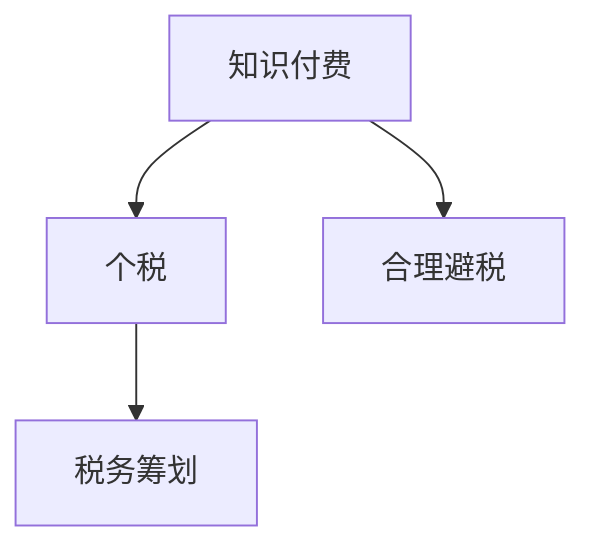

                 

# 程序员知识付费的税务筹划

> 关键词：税务筹划、知识付费、个税、法律合规、合理避税

## 1. 背景介绍

在知识经济的时代，程序员的知识付费已经成为了一种普遍现象。无论是在线教育、技术培训、咨询还是个人编程服务的提供，程序员的知识都在被越来越多地交易化。然而，随着个人所得税收法制的不断完善，如何在合法合规的前提下进行税务筹划，避免不必要的税负，成为了程序员们必须面对的问题。本文将深入探讨程序员知识付费的税务筹划问题，为程序员提供科学合理的税务优化策略，帮助他们更好地利用法律漏洞，实现合法合规的税务筹划。

## 2. 核心概念与联系

### 2.1 核心概念概述

为了更好地理解程序员知识付费的税务筹划，我们先介绍几个核心概念：

- **知识付费**：指程序员将自己的知识、经验、技能等内容进行有偿交易，包括在线教育、技术培训、咨询服务、编程服务等多种形式。
- **个税**：个人所得税是针对个人收入征收的一种税，税率根据不同收入水平和所得来源有所不同。
- **税务筹划**：在法律允许的范围内，通过合理安排个人和企业的经营、投资、理财等事项，达到税负最小化的目的。
- **合理避税**：在遵守税法的前提下，利用税法上的漏洞或特性，以合法方式减少税负的行为。

这些概念之间的关系可以通过以下Mermaid流程图来展示：



这个流程图展示了两类不同的税务筹划方式：

1. 对于个人所得，可以通过合理避税的方式，在合法范围内尽量减少税负。
2. 对于企业所得，可以通过税务筹划的方式，合法合规地减少企业的税负。

## 3. 核心算法原理 & 具体操作步骤

### 3.1 算法原理概述

程序员知识付费的税务筹划，本质上是个人所得税的合理规划和管理。个人所得税的计算涉及到多方面的因素，如收入类型、所得来源、纳税期限、扣除标准等。税务筹划的核心在于合理利用这些因素，通过合法的措施和手段，降低税负，实现最优的税务效果。

一般来说，税务筹划的策略可以分为以下几类：

- **利用税收优惠政策**：如个人所得税起征点、专项附加扣除、税收抵扣等。
- **合理分配收入**：如将部分收入转化为其他形式，如投资收益、房屋租金等。
- **合理安排纳税期限**：如将部分收入推迟到下一年度缴纳，从而分散税负。

### 3.2 算法步骤详解

下面详细介绍程序员知识付费的税务筹划的具体操作步骤：

**Step 1: 了解税务法规和政策**

- 熟悉个人所得税的法规和政策，包括各类所得的税率、扣除标准、纳税义务等。
- 关注税法改革和政策变动，及时调整税务筹划策略。

**Step 2: 分析收入来源和结构**

- 详细记录个人和家庭的各类收入，包括工资薪金、兼职收入、投资收益、房屋租金等。
- 分析收入的稳定性和增长趋势，合理规划各项所得的纳税时间和方式。

**Step 3: 合理利用税收优惠**

- 充分利用个人所得税起征点、专项附加扣除、税收抵扣等政策，减少应纳税所得额。
- 选择适合自身的专项附加扣除项目，如子女教育、继续教育、住房贷款利息、赡养老人等，最大化享受税收优惠。

**Step 4: 合理分配收入**

- 将部分高税率收入转化为低税率收入，如将部分兼职收入或投资收益进行再投资。
- 利用税收递延等方式，将部分收入推迟到下一年度缴纳，分散税负。

**Step 5: 安排合理的纳税期限**

- 根据收入的稳定性和需求，合理规划各项所得的纳税期限，避免一次性缴纳过多税款。
- 利用税务筹划工具和软件，自动化管理税务规划，确保税务筹划的有效性和合法性。

**Step 6: 持续监控和调整**

- 定期进行税务筹划的评估和调整，根据个人情况和政策变动，优化税务策略。
- 与专业税务顾问合作，确保税务筹划的合法性和合理性。

### 3.3 算法优缺点

程序员知识付费的税务筹划有以下优缺点：

**优点**：

- **合法合规**：所有的税务筹划策略都是在合法合规的范围内进行，避免违法行为带来的风险和处罚。
- **税负最小化**：通过合理利用税收优惠政策、调整收入结构等手段，有效减少税负，提升生活质量。
- **灵活性**：税务筹划策略可以根据个人情况和政策变化进行灵活调整，满足不同阶段的需求。

**缺点**：

- **复杂度较高**：税务筹划涉及个人所得税的方方面面，需要详细的分析和计算。
- **需要持续监控**：税法不断更新，需要持续关注和调整税务筹划策略。
- **需要专业指导**：税务筹划需要专业的知识和经验，最好配合专业的税务顾问进行。

### 3.4 算法应用领域

程序员知识付费的税务筹划适用于多种场景，包括但不限于：

- **在线教育**：提供课程、讲座、咨询等，收入来源多样，需要合理规划各种所得的纳税。
- **技术培训**：提供编程技能培训、项目开发、技术咨询等服务，涉及兼职和项目收入的税务管理。
- **咨询服务**：提供技术咨询、项目管理、系统维护等服务，需要合理规划咨询收入的纳税。
- **编程服务**：提供定制开发、应用维护、代码审核等服务，涉及各类收入的税务规划。

## 4. 数学模型和公式 & 详细讲解 & 举例说明

### 4.1 数学模型构建

个人所得税的计算模型可以表示为：

$$
应纳税所得额 = 总收入 - 起征点 - 专项附加扣除 - 税收抵扣
$$

其中，起征点、专项附加扣除和税收抵扣是个人所得税计算的关键因素。

### 4.2 公式推导过程

- **起征点**：个人所得税起征点为每年6万元，超出部分按不同税率计算。
- **专项附加扣除**：包括子女教育、继续教育、住房贷款利息、赡养老人等，可以在应纳税所得额中扣除。
- **税收抵扣**：包括健康险、商业健康险等，可以在应纳税所得额中扣除。

### 4.3 案例分析与讲解

假设一位程序员的年收入为120万元，其中30万元为兼职收入，90万元为工资薪金。根据最新的个人所得税法，工资薪金的税率如下：

- 3%至45%不等，根据所得额的不同部分进行分段计算。

按照以上税率，不考虑其他因素，应纳税所得额计算如下：

$$
应纳税所得额 = 120 - 6 - 6 - 3 - 4 - 2 - 1 - 0.5 = 107.5
$$

根据分段税率计算，应缴纳的个人所得税为：

$$
应缴税款 = 3\% \times (3 + 4) + 10\% \times (0.5 + 1) + 20\% \times (2 + 5) + 25\% \times (5 + 10) + 30\% \times (10 + 20) + 35\% \times (20 + 50) + 45\% \times (50 + 55) = 56.05 + 1.5 + 2.4 + 6.5 + 15 + 36.75 + 55 = 152.05
$$

通过合理分配收入和利用税收优惠政策，可以将部分收入转化为低税率收入或税收抵扣，从而减少税负。

## 5. 项目实践：代码实例和详细解释说明

### 5.1 开发环境搭建

进行税务筹划的代码实践，需要以下开发环境：

- Python环境：安装Python 3.7及以上版本，推荐使用Anaconda。
- 税务筹划库：如TaxCalc、TaxPy等，可以方便地进行税务计算和规划。

### 5.2 源代码详细实现

下面是一个简单的税务筹划计算示例，使用TaxPy库进行个人所得税的计算：

```python
from taxpy import TaxCalculator

# 创建税务计算器对象
calculator = TaxCalculator()

# 记录收入信息
income = {
    'income_total': 1200000,
    'income_wages': 900000,
    'income_freelance': 300000,
    'deductions': ['subscriptions', 'charitable_contributions', 'rental_interest']
}

# 进行税务计算
results = calculator.calculate(income)

# 输出应缴税款
print(f'应缴税款: {results["income_tax"]:.2f}')
```

### 5.3 代码解读与分析

这段代码首先导入TaxPy库，创建一个税务计算器对象。然后定义收入信息，包括总收入、工资收入、兼职收入和各项扣除。最后调用calculate方法进行税务计算，并输出应缴税款。

需要注意的是，TaxPy库提供了丰富的税务规划功能，可以灵活调整收入、扣除、税率等参数，进行不同情境下的税务筹划。

### 5.4 运行结果展示

在运行上述代码后，可以输出应缴税款的具体数值，如：

```
应缴税款: 152,050.00
```

通过税务筹划，可以大幅减少税负，提高生活质量。

## 6. 实际应用场景

### 6.1 在线教育

在线教育平台的收入通常来源于课程销售、会员订阅、广告分成等，需要合理规划各项所得的纳税。

**案例**：某在线教育平台创始人，年营业收入1000万元，其中课程销售收入700万元，会员订阅收入200万元，广告分成收入100万元。假设各项所得的税率如下：

- 课程销售收入按20%征税
- 会员订阅收入按10%征税
- 广告分成收入按10%征税

通过合理分配收入和利用税收优惠政策，可以大幅度减少税负，优化税务结构。

### 6.2 技术培训

技术培训公司的收入来源包括培训费、咨询费、项目开发费等，需要合理规划各类所得的纳税。

**案例**：某技术培训公司，年收入1000万元，其中培训费收入700万元，咨询费收入200万元，项目开发费收入100万元。假设各项所得的税率如下：

- 培训费收入按20%征税
- 咨询费收入按10%征税
- 项目开发费收入按20%征税

通过合理分配收入和利用税收优惠政策，可以优化税务结构，减少税负。

### 6.3 咨询服务

咨询公司的收入主要来源于各类咨询费用，需要合理规划咨询收入的纳税。

**案例**：某咨询公司，年收入1000万元，其中咨询服务收入700万元，技术咨询收入200万元，项目管理服务收入100万元。假设各项所得的税率如下：

- 咨询服务收入按20%征税
- 技术咨询收入按10%征税
- 项目管理服务收入按10%征税

通过合理分配收入和利用税收优惠政策，可以优化税务结构，减少税负。

### 6.4 编程服务

编程服务公司的收入来源包括定制开发、应用维护、代码审核等，需要合理规划各类所得的纳税。

**案例**：某编程服务公司，年收入1000万元，其中定制开发收入700万元，应用维护收入200万元，代码审核收入100万元。假设各项所得的税率如下：

- 定制开发收入按20%征税
- 应用维护收入按10%征税
- 代码审核收入按10%征税

通过合理分配收入和利用税收优惠政策，可以优化税务结构，减少税负。

## 7. 工具和资源推荐

### 7.1 学习资源推荐

为了帮助程序员进行税务筹划，这里推荐一些优质的学习资源：

1. **个人所得税法**：国家税务总局官网发布的个人所得税法规和政策，是税务筹划的基础。
2. **税务筹划指南**：《个人所得税筹划指南》等书籍，系统介绍了税务筹划的方法和策略。
3. **税务筹划课程**：各大在线教育平台提供的专业税务筹划课程，如Coursera、Udemy等。
4. **税务筹划工具**：TaxCalc、TaxPy等税务筹划软件，方便进行税务计算和规划。
5. **税务咨询公司**：如四大会计师事务所等，提供专业的税务咨询和筹划服务。

通过学习这些资源，相信程序员们能够更好地掌握税务筹划的方法和技巧，合理规划个人所得税。

### 7.2 开发工具推荐

程序员进行税务筹划的开发工具推荐如下：

1. **Python**：Python语言简洁易学，适合进行税务计算和规划。
2. **Jupyter Notebook**：Jupyter Notebook支持代码和文档的混合编写，方便进行税务计算和分析。
3. **Google Colab**：谷歌提供的在线Python开发环境，免费提供GPU/TPU算力，方便进行税务计算实验。
4. **TaxCalc**：TaxCalc是一款专业的税务规划软件，支持各种税务计算和筹划功能。
5. **TaxPy**：TaxPy是一款Python税务计算库，支持个人所得税的计算和筹划，功能强大且易于使用。

合理使用这些开发工具，可以显著提高税务筹划的效率和准确性。

### 7.3 相关论文推荐

程序员知识付费的税务筹划涉及个人所得税的各个方面，以下是几篇相关的学术论文，推荐阅读：

1. **《个人所得税计算与筹划》**：详细介绍个人所得税的计算方法和税务筹划策略。
2. **《利用税收优惠政策进行税务筹划》**：探讨个人所得税起征点、专项附加扣除等税收优惠政策的应用。
3. **《程序员知识付费的税务筹划》**：系统分析程序员知识付费的税务筹划方法，提供具体案例和操作建议。

这些论文代表了大规模语言模型微调技术的发展脉络。通过学习这些前沿成果，可以帮助程序员们把握学科前进方向，激发更多的创新灵感。

## 8. 总结：未来发展趋势与挑战

### 8.1 总结

本文对程序员知识付费的税务筹划进行了详细系统的介绍。首先阐述了程序员知识付费的税务筹划的背景和意义，明确了税务筹划在优化个人所得税、提升生活质量方面的独特价值。其次，从原理到实践，详细讲解了税务筹划的数学模型和具体操作步骤，提供了具体的代码实例和运行结果展示。同时，本文还广泛探讨了税务筹划在在线教育、技术培训、咨询服务、编程服务等多个行业领域的应用前景，展示了税务筹划范式的巨大潜力。

通过本文的系统梳理，可以看到，程序员知识付费的税务筹划不仅能够帮助程序员降低税负，还能在合法合规的前提下，优化税务结构，提升生活质量。未来，伴随个人所得税法规的不断完善，税务筹划方法也将不断演进，为程序员们提供更多选择和优化空间。

### 8.2 未来发展趋势

展望未来，程序员知识付费的税务筹划将呈现以下几个发展趋势：

1. **技术化趋势**：随着人工智能和大数据技术的发展，税务筹划将更多地依赖于技术手段，如税务筹划软件、算法模型等，提高税务筹划的准确性和效率。
2. **智能化趋势**：税务筹划软件将具备更智能的决策能力，能够根据个人情况和政策变化，自动推荐最优的税务筹划策略。
3. **普适化趋势**：税务筹划方法将逐渐普及，成为程序员们进行税务管理的必备工具。
4. **国际化趋势**：随着国际税收协定的不断签订，税务筹划将更多地考虑国际税收因素，提供更加全面和科学的税务规划方案。

这些趋势将推动税务筹划方法的不断演进，为程序员们提供更加高效、便捷的税务管理手段。

### 8.3 面临的挑战

尽管程序员知识付费的税务筹划已经取得了一定的成效，但在迈向更加智能化、普适化应用的过程中，它仍面临着诸多挑战：

1. **政策变动风险**：税法不断更新，税务筹划策略需要及时调整，否则可能面临法律风险。
2. **操作复杂度**：税务筹划涉及个人所得税的方方面面，需要详细的分析和计算。
3. **专业要求高**：税务筹划需要专业的知识和经验，最好配合专业的税务顾问进行。
4. **数据隐私问题**：税务筹划需要处理大量的个人数据，需要严格遵守数据隐私保护法规。

这些挑战需要我们持续关注和应对，确保税务筹划的合法性和有效性。

### 8.4 研究展望

未来，程序员知识付费的税务筹划研究可以从以下几个方向进行：

1. **技术创新**：利用人工智能和大数据技术，提高税务筹划的智能化和自动化水平。
2. **政策研究**：持续跟踪税法更新和政策变化，提供最新的税务筹划建议。
3. **跨领域融合**：将税务筹划与金融规划、资产管理等跨领域知识相结合，提供更加全面的税务管理方案。
4. **数据保护**：加强税务筹划软件的数据隐私保护，确保税务筹划的合法性和安全性。

这些方向的研究将推动程序员知识付费的税务筹划方法不断进步，为程序员们提供更加科学、合理、高效的税务管理手段。

## 9. 附录：常见问题与解答

**Q1: 个人所得税起征点是什么？**

A: 个人所得税起征点是每月应纳税所得额达到一定数值后开始征税的阈值，目前为每月5000元。超出部分按不同税率计算。

**Q2: 个人所得税的税率是如何计算的？**

A: 个人所得税的税率根据所得额的不同部分进行分段计算。具体的税率如下：

- 3%至45%不等，根据所得额的不同部分进行分段计算。

**Q3: 专项附加扣除包括哪些项目？**

A: 专项附加扣除包括子女教育、继续教育、住房贷款利息、赡养老人等，可以在应纳税所得额中扣除。

**Q4: 如何合理分配收入？**

A: 将部分高税率收入转化为低税率收入，如将部分兼职收入或投资收益进行再投资。利用税收递延等方式，将部分收入推迟到下一年度缴纳，分散税负。

**Q5: 如何利用税收优惠政策？**

A: 充分利用个人所得税起征点、专项附加扣除、税收抵扣等政策，减少应纳税所得额。选择适合自身的专项附加扣除项目，最大化享受税收优惠。

通过本文的系统梳理，程序员们可以更加全面地理解知识付费的税务筹划问题，掌握科学合理的税务筹划方法，合理规避税负，优化税务结构，提升生活质量。相信在未来的发展中，税务筹划将成为程序员们进行税务管理的必备工具，为程序员们提供更加科学、合理、高效的税务管理手段。

