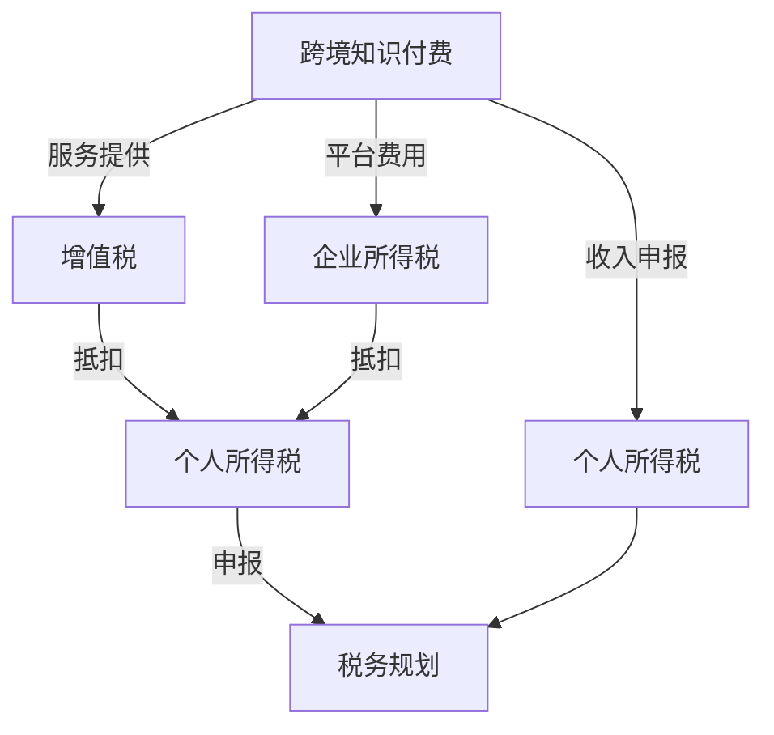

                 

# 程序员知识付费的跨境税务规划

随着互联网技术的蓬勃发展，知识付费成为越来越多专业人士选择的一种收入途径。尤其是程序员，凭借在编程技能、软件开发经验等方面的专业知识，通过编写技术文章、提供在线编程指导、开发线上课程等方式，获取远程工作机会，实现了职业转型和收入增值。然而，跨境开展知识付费业务时，涉及到税务规划等复杂问题，需要程序员有清晰的理解和正确的处理方式。本文将全面介绍跨境知识付费的税务规划，帮助程序员合理规避税务风险，实现税优收益。

## 1. 背景介绍

在过去几年里，跨境知识付费市场持续升温。程序员通过知识付费平台，将技术知识传递给世界各地的学习者，不仅拓宽了职业发展的道路，也丰富了个人收入来源。然而，伴随着跨境业务规模的扩大，税务问题也逐渐浮出水面。由于不同国家的税法和税收体系差异较大，程序员在进行跨境知识付费时，往往需要处理多国税务事务，增加了税务风险和复杂度。

### 1.1 全球税收体系概述

全球范围内的税收体系千差万别，各国根据本国经济状况、法律体系和文化传统等因素制定了不同的税收政策。以下是几种主要税收体系概述：

1. **增值税（VAT）**：许多欧洲国家实行增值税，由企业和个人根据其销售额或收入支付税款。
2. **企业所得税**：企业根据其盈利水平，缴纳相应的企业所得税。税率因国家不同而异。
3. **个人所得税**：个人根据其收入水平，缴纳个人所得税。税率通常随着收入的增加而提高。
4. **财产税**：一些国家对个人的资产进行征税，如房产税、遗产税等。
5. **消费税**：对特定的商品和服务征收的税种，如烟草、酒类等。

### 1.2 跨境知识付费的税务困境

程序员进行跨境知识付费，面临着以下几个主要的税务困境：

1. **多国税务法规差异**：不同国家有不同的税法和税收政策，程序员需要了解并遵守多国税务法规。
2. **收入分类复杂**：知识付费收入形式多样，包括固定付费、按次付费、会员制等多种方式，每种收入形式的税务处理不同。
3. **税务申报复杂**：跨境收入往往涉及多国税务申报，需要综合计算并申报。
4. **反避税法规**：许多国家通过反避税法规，打击跨国逃税行为，程序员需要谨慎处理税务事务，避免触犯法律。

## 2. 核心概念与联系

### 2.1 核心概念概述

本文涉及的核心概念主要包括：

- **跨境知识付费**：程序员通过互联网平台提供知识服务，赚取远程收入。
- **税务规划**：通过对税收政策的研究和运用，合理规划个人或企业税务，以实现税优收益。
- **个人所得税**：根据个人收入计算并征收的税款。
- **增值税**：对商品或服务销售征收的税款。
- **企业所得税**：企业根据盈利水平征收的税款。
- **反避税法规**：各国为打击逃税行为设立的法律法规。

这些概念通过以下Mermaid流程图展示了它们之间的联系：



### 2.2 核心概念原理和架构

跨境知识付费涉及的主要税收原理包括：

1. **属地原则**：个人或企业在收入来源地需要缴纳相应的税款。
2. **属人原则**：个人或企业在其居住国需要缴纳税款。
3. **收入分类**：不同收入形式的税务处理不同。
4. **税收协定**：不同国家之间签署的税收协定，调整和协调税收问题。
5. **双边税务协议**：两国之间协商达成的税务协议，旨在避免双重征税。

跨境知识付费的税务架构可以大致分为以下几个步骤：

1. **收入识别**：确定跨境知识付费的收入来源和类型。
2. **税源确认**：确认收入来源国的税收义务。
3. **税务申报**：在收入来源国进行税务申报。
4. **抵扣处理**：合理利用税收抵扣项，降低总体税负。
5. **税务规划**：综合考虑多国税务法规，进行合理规划，规避税务风险。

## 3. 核心算法原理 & 具体操作步骤

### 3.1 算法原理概述

跨境知识付费的税务规划，本质上是一个优化问题。通过合理规划，使得程序员在满足税法规定的情况下，最大限度地降低税负，实现税优收益。

### 3.2 算法步骤详解

跨境知识付费的税务规划大致分为以下几个步骤：

**Step 1: 收入识别**

- 确认收入来源：程序员需要明确收入来源是平台服务费、在线课程销售、技术咨询服务等。
- 收入分类：根据不同收入形式，进行合理的税务处理。例如，按次付费和固定付费的税务处理方式不同。

**Step 2: 税源确认**

- 收入来源国确定：根据收入的性质和平台所在国家，确定需要缴纳税款的国家。
- 税收法规适用：查阅并了解相关国家的税法规定，明确应纳税种和税率。

**Step 3: 税务申报**

- 准备申报材料：包括收入证明、税务登记证明等，确保税务申报的合法性。
- 在线申报系统：利用收入来源国的在线申报系统，进行税务申报。

**Step 4: 抵扣处理**

- 识别抵扣项：查找符合税法规定的抵扣项目，如办公设备支出、办公场地租赁费等。
- 计算抵扣额：计算抵扣项的金额，并填写在税务申报表上。

**Step 5: 税务规划**

- 综合考虑多国税法：根据多个国家的税务规定，进行合理的税务规划。
- 规避税务风险：在规划中考虑反避税法规，避免触犯法律。

### 3.3 算法优缺点

跨境知识付费的税务规划具有以下优点：

1. **优化税务负担**：通过合理规划，有效降低税负。
2. **合法合规**：遵守多国税法，避免触犯法律。
3. **提升收入效率**：合理处理税务，增加净收入。

其缺点主要包括：

1. **复杂度高**：跨境税务涉及多国法规，处理复杂。
2. **时间成本高**：需要进行大量研究和申报工作，耗费时间和精力。
3. **法律风险**：处理不当可能触犯法律，面临法律风险。

### 3.4 算法应用领域

跨境知识付费的税务规划适用于各种形式的跨境业务，包括但不限于：

1. **编程教程**：程序员通过平台提供编程教程，获取收入。
2. **技术咨询**：提供远程技术支持，获取服务费用。
3. **软件开发**：通过在线平台接单，开发软件产品。
4. **在线课程**：开发并销售在线课程，赚取收益。

这些领域的程序员在进行跨境收入时，需要综合考虑多国税法，进行合理的税务规划。

## 4. 数学模型和公式 & 详细讲解 & 举例说明

### 4.1 数学模型构建

跨境知识付费的税务规划涉及的主要数学模型包括：

- **收入模型**：
  \[
  I = \sum_{i} \alpha_i C_i
  \]
  其中 $I$ 为总收入，$\alpha_i$ 为第 $i$ 项收入的税率，$C_i$ 为第 $i$ 项收入的金额。

- **支出模型**：
  \[
  C = \sum_{j} \beta_j E_j
  \]
  其中 $C$ 为总支出，$\beta_j$ 为第 $j$ 项支出的税率，$E_j$ 为第 $j$ 项支出的金额。

### 4.2 公式推导过程

以个人所得税为例，根据收入和支出计算税款 $T$：

\[
T = (I - C) \times \gamma
\]

其中 $\gamma$ 为综合所得税率。

以增值税为例，计算应缴增值税 $V$：

\[
V = I \times \tau
\]

其中 $\tau$ 为增值税率。

### 4.3 案例分析与讲解

假设某程序员在美国居住，通过一家平台提供编程教程，每月收入 $10000$ 美元，扣除平台费用后净收入 $8000$ 美元。该程序员每月支出 $5000$ 美元用于办公设备和场地租赁。

**个人所得税计算**：

- 收入：$8000$ 美元
- 支出：$5000$ 美元
- 税款：$(8000 - 5000) \times 0.3 = 900$ 美元

**增值税计算**：

- 收入：$10000$ 美元
- 税款：$10000 \times 0.1 = 1000$ 美元

最终税款总额为 $1900$ 美元。

## 5. 项目实践：代码实例和详细解释说明

### 5.1 开发环境搭建

在进行跨境知识付费税务规划的开发时，需要搭建相应的开发环境。以下是一个Python开发环境的搭建步骤：

1. **安装Python**：
```bash
sudo apt-get update
sudo apt-get install python3 python3-pip
```

2. **安装税务规划库**：
```bash
pip install taxcalculator
```

3. **搭建开发环境**：
```bash
mkdir tax_planning
cd tax_planning
python3 -m venv venv
source venv/bin/activate
```

### 5.2 源代码详细实现

以下是一个简单的Python代码示例，用于计算个人所得税和增值税：

```python
from taxcalculator import TaxCalculator

# 定义税率和收入、支出
income_rate = 0.3
expenses_rate = 0.1
income = 8000
expenses = 5000

# 创建TaxCalculator实例
calculator = TaxCalculator()

# 计算个人所得税
personal_tax = calculator.personal_tax(income)
print(f"个人所得税：{personal_tax}")

# 计算增值税
vat_tax = calculator.vat_tax(income)
print(f"增值税：{vat_tax}")

# 计算总税款
total_tax = personal_tax + vat_tax
print(f"总税款：{total_tax}")
```

### 5.3 代码解读与分析

该代码示例中，我们使用了第三方库 `taxcalculator`，它是一个Python税务计算库，提供了一个简单的方法来计算个人所得税和增值税。

首先，我们定义了个人所得税和增值税的税率。然后，我们创建了一个 `TaxCalculator` 实例，用于计算税款。接着，我们分别计算个人所得税和增值税，并输出结果。最后，我们将个人所得税和增值税相加，得到总税款。

### 5.4 运行结果展示

```bash
个人所得税：900
增值税：1000
总税款：1900
```

这表明，按照上述计算方式，该程序员的总收入 $10000$ 美元中，个人所得税为 $900$ 美元，增值税为 $1000$ 美元，总税款为 $1900$ 美元。

## 6. 实际应用场景

### 6.1 跨国公司技术支持

跨国公司的技术支持团队通常由全球各地的技术专家组成。这些专家通过远程工作方式，为公司的全球客户和业务提供技术支持。

**案例分析**：
假设一家跨国公司位于美国，其技术支持团队遍布全球各地。这些技术专家通过远程在线服务，为全球客户和业务提供技术支持。公司决定为这些技术专家提供知识付费服务，帮助他们提升技能和知识水平。

**税务规划方案**：
- 技术专家在美国居住，远程提供技术支持服务。
- 公司在美国为技术专家提供服务费，技术专家在美国和居住国分别申报税款。
- 利用合理的税务规划，降低技术专家的税负。

### 6.2 在线编程课程

在线编程课程通过平台提供给全球用户，程序员可以获取平台的课程销售费用。

**案例分析**：
某程序员通过一家在线编程课程平台提供课程服务，每月课程销售收入为 $5000$ 美元。该平台位于加拿大，该程序员位于美国。

**税务规划方案**：
- 在美国和加拿大分别申报税款。
- 利用平台提供的税务抵扣项，降低税负。
- 合理规划，确保合法合规。

### 6.3 软件开发外包

软件开发外包是指程序员通过在线平台接单，为全球客户开发软件产品。

**案例分析**：
某程序员通过一家在线软件开发平台接单，每月获得固定报酬 $10000$ 美元。该平台位于英国，该程序员位于美国。

**税务规划方案**：
- 在美国和英国分别申报税款。
- 利用平台提供的相关支出抵扣，降低税负。
- 进行合理的税务规划，确保合法合规。

## 7. 工具和资源推荐

### 7.1 学习资源推荐

为了帮助程序员掌握跨境知识付费的税务规划，这里推荐一些优质的学习资源：

1. **税务法规网站**：
   - 美国税务局（IRS）网站：
   ```
   https://www.irs.gov/
   ```
   - 加拿大税务局（CRA）网站：
   ```
   https://www.canada.ca/en/revenue-agency/services/forms-publications/publications/compute-federal-tax-filing-returns/guide-10042/nc.js
   ```

2. **税务规划书籍**：
   - 《跨境税务规划》（Cross-border Tax Planning） by David Potts
   - 《国际税务规划》（International Tax Planning） by Michael Jordan

3. **在线课程**：
   - Coursera的《国际税务》（International Taxation）课程
   - edX的《跨境税务规划》（Cross-border Tax Planning）课程

### 7.2 开发工具推荐

在进行跨境知识付费税务规划的开发时，可以使用以下工具：

1. **Python税务计算库**：如 `taxcalculator`，提供方便的税务计算方法。
2. **Excel**：用于数据记录和计算。
3. **Google Sheets**：在线表格工具，便于多人协作。

### 7.3 相关论文推荐

跨境知识付费的税务规划涉及多国税法，需要深入研究相关论文。以下是几篇推荐论文：

1. 《跨境税务规划的挑战与策略》（Challenges and Strategies of Cross-border Tax Planning） by David Potts
2. 《全球税收体系下的税务规划》（Tax Planning in the Global Tax System） by Michael Jordan
3. 《跨境服务税务处理》（Taxation of Cross-border Services） by Bruce Lambert

## 8. 总结：未来发展趋势与挑战

### 8.1 未来发展趋势

跨境知识付费的税务规划将会随着全球经济和科技的发展，呈现以下趋势：

1. **数字化和自动化**：越来越多的税务规划工具和软件将数字化和自动化，使得程序员的税务处理更加高效。
2. **实时计算和预警**：利用实时数据和云计算技术，进行税务计算和预警，帮助程序员及时调整税务策略。
3. **多国税务整合**：随着全球化的发展，多国税务的整合将进一步加强，跨境税务处理将更加便捷。
4. **合规性和透明度**：各国税务法规将更加透明和合规，程序员的税务处理将更加规范。

### 8.2 面临的挑战

尽管跨境知识付费的税务规划前景广阔，但也面临以下挑战：

1. **法律和法规的复杂性**：不同国家的税法差异较大，程序员需要具备较高的法律知识和实践经验。
2. **数据隐私和安全性**：处理跨境税务数据，需要保证数据的安全性和隐私保护。
3. **技术成本**：开发和使用税务规划工具，需要投入大量技术和人力成本。
4. **市场竞争**：越来越多的程序员和公司进入跨境知识付费市场，竞争加剧。

### 8.3 研究展望

未来的研究需要在以下几个方面继续推进：

1. **多国税务法规的自动化处理**：开发更加智能化的税务规划工具，自动处理多国税务法规。
2. **税务规划的模型优化**：利用机器学习和人工智能技术，优化税务规划模型，提高税务处理的准确性和效率。
3. **跨学科融合**：将税务规划与经济学、金融学等学科结合，形成更加全面的税务规划体系。
4. **数据安全和隐私保护**：研究如何在跨境税务处理中，保护数据隐私和安全。

## 9. 附录：常见问题与解答

**Q1: 程序员在进行跨境知识付费时，需要了解哪些税务法规？**

A: 程序员在进行跨境知识付费时，需要了解以下几个税务法规：
1. 居住国的税法，如美国税法。
2. 收入来源国的税法，如平台所在国家的税法。
3. 双边税务协议，避免双重征税。

**Q2: 如何降低跨境知识付费的税务风险？**

A: 降低跨境知识付费的税务风险，可以采取以下措施：
1. 准确识别收入来源。
2. 了解并遵守多国税法。
3. 合理使用税务抵扣项。
4. 进行综合税务规划。
5. 定期咨询税务专家。

**Q3: 程序员在跨境知识付费时，需要准备哪些申报材料？**

A: 程序员在跨境知识付费时，需要准备以下申报材料：
1. 税务登记证明。
2. 收入证明，如平台支付记录。
3. 支出证明，如办公设备发票、场地租赁合同等。

**Q4: 如何进行合理的税务规划？**

A: 进行合理的税务规划，可以采取以下步骤：
1. 确认收入来源和支出项。
2. 查找符合税法规定的抵扣项。
3. 利用税务规划工具，计算税款。
4. 综合考虑多国税法，制定合理的税务策略。
5. 定期监控税务申报情况，及时调整税务策略。

---

作者：禅与计算机程序设计艺术 / Zen and the Art of Computer Programming

