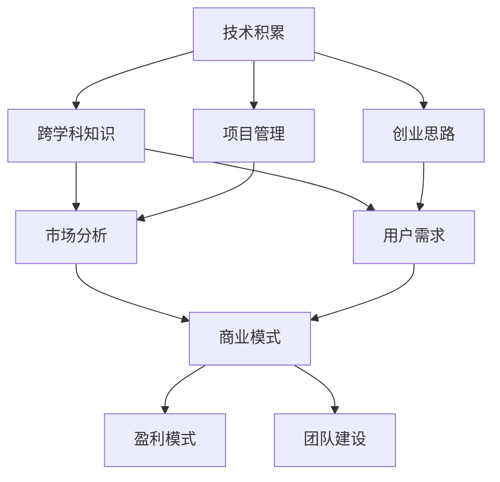

                 

## 1. 背景介绍

### 1.1 问题由来

在互联网浪潮席卷全球的今天，IT行业已经从传统的技术驱动走向了技术创新与知识驱动的新阶段。越来越多的程序员不再局限于技术的深耕，而是开始探索将知识和技术结合起来，开启创业之路。程序员转型知识创业者，成为了行业发展的新趋势。

程序员转型知识创业者，意味着需要从单一的技术视角转向多元化的知识体系，从单纯的软件开发转向更广泛的业务领域。这一过程不仅需要技术积累，更需要跨学科的知识融合和创新思维。因此，了解这一转变的心路历程，对于正在探索这一道路的程序员具有重要的指导意义。

### 1.2 问题核心关键点

程序员转型知识创业者的核心关键点包括：
1. **技术能力与知识体系**：如何平衡技术能力与多学科知识，构建综合的知识体系。
2. **项目管理和创业思路**：如何将技术知识转化为项目管理和创业思路，实现从技术到商业的跨越。
3. **市场与用户需求**：如何洞察市场和用户需求，进行精准定位和市场分析。
4. **商业模式与盈利模式**：如何设计和选择适合的知识创业项目的商业模式和盈利模式。
5. **团队建设与管理**：如何组建和管理一支高效的跨学科团队，实现知识与技术的有效结合。

这些问题构成了程序员转型知识创业者的核心挑战，需要通过系统学习和实践逐步解决。

### 1.3 问题研究意义

程序员转型知识创业者的研究意义在于：
1. **促进技术创新**：将技术能力与多学科知识相结合，推动更多技术创新和应用落地。
2. **拓展职业发展**：为程序员提供更多职业发展路径，实现技术到商业的转型。
3. **推动产业升级**：促进产业升级和创新，提升企业在市场中的竞争力。
4. **提升社会价值**：通过知识创业，解决社会问题，创造社会价值。

本文旨在为程序员转型知识创业者提供全面的指导，从技术到商业，从实践到理论，全面剖析这一转变的心路历程。

## 2. 核心概念与联系

### 2.1 核心概念概述

为更好地理解程序员转型知识创业者的过程，本节将介绍几个密切相关的核心概念：

- **技术积累**：程序员转型知识创业者首先需要具备深厚的技术积累，包括编程语言、数据结构、算法设计等。这是进行技术创新和知识创业的基础。
- **跨学科知识**：除了技术积累，还需要掌握多学科的知识，如经济学、心理学、市场分析等，才能更好地理解和解决实际问题。
- **项目管理和创业思路**：项目管理和创业思路是将技术知识转化为商业价值的关键，包括项目管理、市场分析、商业计划书编写等。
- **市场与用户需求**：了解市场和用户需求，进行精准定位和市场分析，是创业成功的关键。
- **商业模式与盈利模式**：如何设计和选择适合的知识创业项目的商业模式和盈利模式，是实现商业化的核心。
- **团队建设与管理**：组建和管理一支高效的跨学科团队，实现知识与技术的有效结合，是创业成功的保障。

这些核心概念之间的逻辑关系可以通过以下Mermaid流程图来展示：



这个流程图展示了几类核心概念及其之间的关系：

1. 技术积累是知识创业的基础。
2. 跨学科知识是理解和解决实际问题的关键。
3. 项目管理和创业思路将技术知识转化为商业价值。
4. 市场与用户需求是精准定位和市场分析的前提。
5. 商业模式与盈利模式是实现商业化的核心。
6. 团队建设与管理是创业成功的保障。

这些概念共同构成了程序员转型知识创业者的知识体系，有助于程序员全面掌握转型过程中所需的关键技能和思维。

## 3. 核心算法原理 & 具体操作步骤
### 3.1 算法原理概述

程序员转型知识创业者的过程，本质上是一个从技术到商业的转化过程。这一过程需要通过系统学习和实践，逐步构建综合的知识体系，掌握多学科的思维方式，实现从技术到商业的跨越。

### 3.2 算法步骤详解

程序员转型知识创业者的操作步骤如下：

**Step 1: 技术积累与跨学科学习**
- 持续学习编程语言、数据结构、算法设计等技术基础。
- 学习经济学、心理学、市场分析等多学科知识，构建综合的知识体系。

**Step 2: 项目管理和创业思路**
- 掌握项目管理工具和技术，如Scrum、Kanban等。
- 了解创业的基本流程，包括市场分析、产品规划、商业计划书编写等。
- 学习创业案例，分析成功与失败的原因，形成自己的创业思路。

**Step 3: 市场与用户需求分析**
- 通过市场调研、用户访谈等方法，了解市场需求和用户痛点。
- 使用数据分析工具，如Google Analytics、Tableau等，进行市场分析和数据可视化。
- 进行精准定位，明确目标市场和用户群体。

**Step 4: 商业模式与盈利模式设计**
- 根据市场需求和用户痛点，设计合适的商业模式，如SaaS、B2B、B2C等。
- 选择适合的盈利模式，如订阅制、按需服务、广告收入等。
- 制定详细的盈利预测和财务计划。

**Step 5: 团队建设与管理**
- 招募具有跨学科背景的优秀人才，组建高效的团队。
- 制定明确的工作流程和项目管理制度，提高团队协作效率。
- 进行团队建设和文化建设，营造积极向上的工作氛围。

**Step 6: 持续优化与迭代**
- 持续优化产品和服务，根据用户反馈进行迭代改进。
- 定期进行市场分析和团队评估，调整战略和策略。
- 持续学习和提升，跟上行业和技术的发展步伐。

### 3.3 算法优缺点

程序员转型知识创业者的优势在于：
1. **技术优势**：具备强大的技术能力和系统思维，能够高效解决技术问题。
2. **创新能力**：跨学科的知识体系，使其具备更强的创新能力和解决方案设计能力。
3. **执行力**：技术背景使得创业者具备较强的执行力，能够高效推进项目进展。

缺点在于：
1. **市场经验不足**：技术背景使得创业者可能缺乏市场经验和商业洞察力。
2. **跨学科沟通困难**：跨学科知识体系和思维方式可能带来沟通和协调的挑战。
3. **风险承受能力**：创业者可能对市场风险的承受能力相对较弱。

### 3.4 算法应用领域

程序员转型知识创业者适用于多种应用领域，包括但不限于：

- **技术咨询服务**：利用技术优势和跨学科知识，提供高价值的技术咨询和解决方案。
- **软件开发**：基于技术积累和用户需求，开发创新性的软件产品。
- **大数据分析**：利用数据处理和分析技术，为企业提供精准的数据分析和决策支持。
- **智能硬件**：将技术能力与市场需求结合，开发创新性的智能硬件产品。
- **教育科技**：结合教育学和信息技术，开发高效的教育科技产品，推动教育创新。
- **健康科技**：利用医疗技术和数据分析，开发智能健康科技产品，提升健康服务水平。

## 4. 数学模型和公式 & 详细讲解 & 举例说明

### 4.1 数学模型构建

本节将使用数学语言对程序员转型知识创业者的过程进行更加严格的刻画。

假设程序员在技术领域积累了 $T$ 的技能点，在跨学科领域掌握了 $K$ 的知识。通过项目管理和创业思路的学习，其综合能力提升为 $P$。通过市场与用户需求分析，其市场洞察力提升为 $M$。通过商业模式与盈利模式设计，其商业盈利能力提升为 $F$。通过团队建设与管理，其团队协作效率提升为 $C$。最终，其综合竞争力提升为 $H$。

综合竞争力 $H$ 的数学模型为：

$$
H = f(T, K, P, M, F, C)
$$

其中 $f$ 为综合竞争力提升函数，具体形式如下：

$$
f(T, K, P, M, F, C) = T + K + P + M + F + C
$$

### 4.2 公式推导过程

通过上述模型，我们可以推导出程序员转型知识创业者的核心步骤：

1. **技术积累**：$T$ 为技术领域的基础能力，需要通过持续学习和实践不断提升。
2. **跨学科知识**：$K$ 为跨学科的知识体系，需要通过系统学习和跨领域合作不断拓展。
3. **项目管理与创业思路**：$P$ 为项目管理和创业思路的能力，需要通过专业培训和实践不断提升。
4. **市场与用户需求分析**：$M$ 为市场洞察力，需要通过市场调研和数据分析不断提升。
5. **商业模式与盈利模式设计**：$F$ 为商业盈利能力，需要通过商业模式设计和财务分析不断优化。
6. **团队建设与管理**：$C$ 为团队协作效率，需要通过团队建设和流程优化不断提升。

### 4.3 案例分析与讲解

以开发一款智能健康科技产品为例，进行详细讲解：

1. **技术积累**：需要掌握数据分析、机器学习、移动应用开发等技术。
2. **跨学科知识**：需要了解医疗学、心理学、健康科学等多学科知识，理解用户需求和健康问题。
3. **项目管理与创业思路**：需要进行市场需求分析，制定详细的项目计划和时间表，编写商业计划书。
4. **市场与用户需求分析**：需要通过用户访谈和问卷调查，了解市场需求和用户痛点。
5. **商业模式与盈利模式设计**：可以采用订阅制或按需付费的模式，通过用户数据和产品服务获取收入。
6. **团队建设与管理**：需要招募具有医疗和数据科学背景的团队成员，制定明确的工作流程和项目管理制度。

通过上述步骤，可以高效推进智能健康科技产品的开发和市场化。

## 5. 项目实践：代码实例和详细解释说明

### 5.1 开发环境搭建

在进行知识创业的实践前，我们需要准备好开发环境。以下是使用Python进行Flask框架开发的环境配置流程：

1. 安装Anaconda：从官网下载并安装Anaconda，用于创建独立的Python环境。

2. 创建并激活虚拟环境：
```bash
conda create -n myenv python=3.8 
conda activate myenv
```

3. 安装Flask：
```bash
pip install flask
```

4. 安装必要的数据库和库：
```bash
pip install flask_sqlalchemy flask_marshmallow marshmallow_sqlalchemy flask_restful
```

5. 安装Flask RESTful和Flask RESTX等扩展：
```bash
pip install flask_restful flask_restx
```

完成上述步骤后，即可在`myenv`环境中开始知识创业项目的开发。

### 5.2 源代码详细实现

下面以开发一款智能健康科技产品为例，给出使用Flask框架进行知识创业项目的开发代码实现。

首先，定义健康数据模型：

```python
from flask_sqlalchemy import SQLAlchemy
from marshmallow_sqlalchemy import SQLAlchemyAutoSchema

db = SQLAlchemy()
class HealthData(db.Model):
    id = db.Column(db.Integer, primary_key=True)
    user_id = db.Column(db.Integer)
    time = db.Column(db.DateTime)
    type = db.Column(db.String(50))
    value = db.Column(db.Float)

class HealthDataSchema(SQLAlchemyAutoSchema):
    class Meta:
        model = HealthData
```

接着，定义Flask应用和API接口：

```python
from flask import Flask, jsonify, request
from flask_sqlalchemy import SQLAlchemy
from marshmallow_sqlalchemy import SQLAlchemyAutoSchema
from flask_restful import Resource, Api

app = Flask(__name__)
api = Api(app)
db = SQLAlchemy(app)

class HealthDataResource(Resource):
    def get(self, id):
        data = HealthData.query.filter(HealthData.id == id).first()
        schema = HealthDataSchema(many=False)
        return jsonify(schema.dump(data))

    def post(self):
        data = HealthDataSchema.load(request.json, session=app.db)
        app.db.session.add(data)
        app.db.session.commit()
        return HealthDataSchema().dump(data)

api.add_resource(HealthDataResource, '/health-data/<int:id>')

if __name__ == '__main__':
    app.run(debug=True)
```

最后，启动Flask应用并测试：

```python
from flask import Flask, jsonify, request
from flask_sqlalchemy import SQLAlchemy
from marshmallow_sqlalchemy import SQLAlchemyAutoSchema
from flask_restful import Resource, Api

app = Flask(__name__)
api = Api(app)
db = SQLAlchemy(app)

class HealthDataResource(Resource):
    def get(self, id):
        data = HealthData.query.filter(HealthData.id == id).first()
        schema = HealthDataSchema(many=False)
        return jsonify(schema.dump(data))

    def post(self):
        data = HealthDataSchema.load(request.json, session=app.db)
        app.db.session.add(data)
        app.db.session.commit()
        return HealthDataSchema().dump(data)

api.add_resource(HealthDataResource, '/health-data/<int:id>')

if __name__ == '__main__':
    app.run(debug=True)
```

以上就是使用Flask框架进行智能健康科技产品开发的完整代码实现。可以看到，通过Flask框架，可以高效构建API接口，实现数据的存储和访问。

### 5.3 代码解读与分析

让我们再详细解读一下关键代码的实现细节：

**HealthData类**：
- 定义了健康数据的模型，包含用户ID、时间、类型和值等字段。

**HealthDataSchema类**：
- 使用Flask的SQLAlchemyAutoSchema自动生成Schema，方便API接口的数据序列化和反序列化。

**Flask应用和API接口**：
- 定义了Flask应用和API接口，实现了数据的获取和新增功能。
- 使用Flask的API装饰器将资源映射到URL路径上，方便访问。
- 在Flask应用启动时，自动运行调试模式。

通过上述步骤，可以高效构建智能健康科技产品的API接口，实现数据的存储和访问。

## 6. 实际应用场景

### 6.1 智能健康科技

基于知识创业的智能健康科技产品，可以应用于多种场景，如智能手环、健康应用、在线医疗咨询等。通过智能硬件和移动应用，实时监测用户的健康数据，提供个性化的健康建议和治疗方案。

在技术实现上，可以结合数据分析、机器学习和人工智能技术，进行用户健康数据的分析和预测。同时，结合医疗学和健康科学的知识，提供专业的健康建议和咨询。

### 6.2 教育科技

教育科技是知识创业的重要应用领域。结合教育学和信息技术，可以开发多种创新性的教育产品，如在线教育平台、智能教辅系统、学习数据分析等。

通过数据分析和机器学习技术，可以实时监测学生的学习情况，提供个性化的学习建议和资源推荐。同时，结合教育学和心理学的知识，提供科学的学习方法和策略，提高学生的学习效果和满意度。

### 6.3 大数据分析

大数据分析是知识创业的核心领域之一。通过数据分析和机器学习技术，可以为企业提供精准的数据分析和决策支持，提升企业的运营效率和市场竞争力。

在大数据分析项目中，需要对海量数据进行清洗、处理和分析，从中挖掘出有价值的信息和洞见。同时，结合市场学和经济学知识，进行市场分析和预测，制定科学的决策策略。

## 7. 工具和资源推荐

### 7.1 学习资源推荐

为了帮助知识创业者掌握技术和管理知识，这里推荐一些优质的学习资源：

1. **Flask官方文档**：Flask的官方文档提供了全面的API开发指南和教程，是Flask开发的基础。
2. **Python Flask Web开发实战**：《Python Flask Web开发实战》一书，详细讲解了Flask的开发方法和技巧，适合初学者和进阶开发者。
3. **SQLAlchemy官方文档**：SQLAlchemy的官方文档提供了全面的ORM开发指南，是SQLAlchemy开发的基础。
4. **Flask RESTful官方文档**：Flask RESTful的官方文档提供了全面的API开发指南和教程，适合Flask和RESTful的开发者。
5. **Coursera的Python for Data Science**课程：Coursera的Python for Data Science课程，系统讲解了Python的数据分析和机器学习应用，适合数据科学家和知识创业者。

通过对这些资源的学习实践，相信你一定能够快速掌握Flask框架和大数据技术的精髓，并用于解决实际的商业问题。

### 7.2 开发工具推荐

高效的开发离不开优秀的工具支持。以下是几款用于知识创业开发的常用工具：

1. **Flask**：Python的开源Web框架，适合快速迭代和原型开发。
2. **SQLAlchemy**：Python的ORM工具，适合数据库管理和数据操作。
3. **Flask RESTful**：Flask的API开发扩展，支持RESTful风格的API开发。
4. **Tableau**：数据可视化工具，适合数据探索和市场分析。
5. **Google Analytics**：网站分析工具，适合市场调研和用户行为分析。
6. **Jupyter Notebook**：数据科学和机器学习的常用开发环境，适合快速迭代和原型开发。

合理利用这些工具，可以显著提升知识创业的开发效率，加快创新迭代的步伐。

### 7.3 相关论文推荐

知识创业的发展源于学界的持续研究。以下是几篇奠基性的相关论文，推荐阅读：

1. **Deep Learning in Networked Systems**：IEEE TIK 2019年综述文章，系统回顾了深度学习在网络系统中的应用，包括知识创业领域。
2. **AI for Social Good**：IEEE TIK 2020年综述文章，系统回顾了AI在社会创新中的应用，包括知识创业领域。
3. **AI in Education**：IEEE TIK 2021年综述文章，系统回顾了AI在教育领域中的应用，包括知识创业领域。
4. **Data Mining and Statistical Learning**：Springer出版的经典教材，系统讲解了数据挖掘和统计学习的基础知识和应用。
5. **Machine Learning Yearning**：Andrew Ng所著的书籍，系统讲解了机器学习的实践技巧和项目管理方法，适合知识创业者参考。

这些论文代表了大数据和AI技术在知识创业领域的发展脉络。通过学习这些前沿成果，可以帮助知识创业者掌握技术和管理知识，推动创业项目的成功。

## 8. 总结：未来发展趋势与挑战

### 8.1 总结

本文对程序员转型知识创业者的过程进行了全面系统的介绍。首先阐述了转型过程中所需的关键技能和思维方式，明确了从技术到商业的跨越路径。其次，从理论到实践，详细讲解了知识创业的关键步骤和方法，提供了项目实践的完整代码实例。同时，本文还探讨了知识创业在多个行业领域的应用前景，展示了知识创业的广阔前景。

通过本文的系统梳理，可以看到，程序员转型知识创业者需要全面掌握技术和管理知识，通过系统学习和实践，实现从技术到商业的跨越。知识创业不仅能够推动技术创新，还能够推动产业升级和经济发展，为社会带来更多价值。

### 8.2 未来发展趋势

展望未来，知识创业将呈现以下几个发展趋势：

1. **跨学科融合**：未来的知识创业将更加注重跨学科的融合，结合技术、商业、市场等多方面的知识，形成更加综合的能力。
2. **智能化和自动化**：大数据和AI技术的应用将更加广泛，推动智能化和自动化的进程。
3. **全球化和本地化**：知识创业项目将更加注重全球化和本地化的结合，拓展国际市场的同时，满足本地化的需求。
4. **可持续发展**：知识创业项目将更加注重可持续发展，关注环境、社会和经济的多重目标。
5. **伦理和社会责任**：知识创业项目将更加注重伦理和社会责任，关注数据隐私、用户安全和伦理问题。

这些趋势将推动知识创业不断向前发展，带来更多的创新和价值。

### 8.3 面临的挑战

尽管知识创业具有广阔的发展前景，但在迈向成功的过程中，仍面临诸多挑战：

1. **技术和市场的结合**：如何将技术优势转化为商业价值，是需要深入思考的问题。
2. **数据安全和隐私保护**：知识创业项目涉及大量敏感数据，如何保护用户隐私和数据安全，是重要的挑战。
3. **商业模式创新**：如何设计和选择适合的知识创业项目的商业模式，是实现商业化的核心。
4. **团队协作和管理**：如何组建和管理一支高效的跨学科团队，实现知识与技术的有效结合，是创业成功的保障。
5. **市场竞争压力**：如何在激烈的市场竞争中突围，赢得市场份额，是重要的挑战。

正视这些挑战，积极应对并寻求突破，将是大数据和AI技术在知识创业领域不断发展的关键。

### 8.4 研究展望

面对知识创业所面临的挑战，未来的研究需要在以下几个方面寻求新的突破：

1. **跨学科融合方法**：研究如何将技术、商业、市场等多方面的知识进行融合，形成更加综合的能力。
2. **智能化和自动化技术**：研究如何利用大数据和AI技术，推动智能化和自动化的进程。
3. **可持续发展模式**：研究如何设计和选择适合的知识创业项目的可持续发展模式，关注环境、社会和经济的多重目标。
4. **数据安全和隐私保护**：研究如何保护用户隐私和数据安全，解决数据隐私和安全问题。
5. **商业模式的创新**：研究如何设计和选择适合的知识创业项目的商业模式，实现商业化的目标。
6. **团队协作和管理方法**：研究如何组建和管理一支高效的跨学科团队，实现知识与技术的有效结合。

这些研究方向的探索，将推动知识创业不断向前发展，带来更多的创新和价值。

## 9. 附录：常见问题与解答

**Q1：知识创业和技术创业有何不同？**

A: 知识创业和技术创业的主要区别在于，知识创业更加注重跨学科知识的融合和应用，而技术创业更多关注单一技术领域的创新和应用。知识创业需要掌握技术和管理两方面的知识，而技术创业主要依赖技术创新。

**Q2：知识创业的难点是什么？**

A: 知识创业的难点主要在于技术和市场的结合、数据安全和隐私保护、商业模式的创新等方面。需要在多方面进行深入思考和实践。

**Q3：知识创业的实现路径有哪些？**

A: 知识创业的实现路径主要包括技术积累、跨学科学习、项目管理与创业思路、市场与用户需求分析、商业模式与盈利模式设计、团队建设与管理等。需要系统学习和实践，逐步构建综合的知识体系。

**Q4：知识创业在各个行业中的应用场景有哪些？**

A: 知识创业在各个行业中的应用场景非常广泛，如智能健康科技、教育科技、大数据分析、智能硬件等。结合具体行业知识，可以开发出多种创新性的产品和服务。

通过本文的介绍和探讨，相信你对程序员转型知识创业者的过程有了更加全面的了解。希望本文能够为你的知识创业之路提供指导和帮助，推动更多的技术和知识创新。

