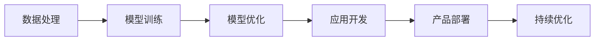

                 

# 端到端AI开发：从概念到实现

> 关键词：端到端，人工智能，机器学习，深度学习，模型训练，应用开发，产品部署，模型优化，自动化，技术栈，资源管理

## 1. 背景介绍

### 1.1 问题由来
在当今快速发展的数字化时代，人工智能(AI)技术已成为各行各业的核心竞争力。随着数据量的爆炸性增长和计算能力的不断提升，AI的应用范围越来越广泛，从语音识别、计算机视觉到自然语言处理，从自动化决策到智能推荐，AI技术正逐步改变着我们的生活和工作方式。然而，AI的开发和部署绝非易事。从数据准备到模型训练，再到产品上线，每一步都需要专业知识和大量的时间和资源投入。因此，如何在有限的资源和时间约束下，高效地开发和部署AI应用，成为AI从业者面临的重要问题。

### 1.2 问题核心关键点
端到端(Associative Learning)AI开发，旨在通过自动化和集成化的方法，简化AI应用的开发流程，使得从概念到实现的过程更加流畅、高效。这一方法的核心在于将数据处理、模型训练、模型优化、应用开发、产品部署等各个环节紧密结合，形成一个完整的AI开发管道，从而大大降低开发成本，提升开发效率，加速AI技术的商业化落地。

端到端AI开发的关键在于以下几点：
1. 自动化数据处理：通过自动化数据清洗、标注和增强，减少人工工作量，提高数据质量。
2. 模型优化：通过自动化调参、模型压缩和迁移学习等方法，优化模型性能，提升模型效率。
3. 应用开发：通过提供即插即用的组件和框架，快速开发和部署AI应用。
4. 产品部署：通过云平台和边缘计算等技术，实现AI模型的无缝部署和高效运行。
5. 持续优化：通过在线学习、模型更新和反馈机制，持续提升AI应用的性能和用户体验。

### 1.3 问题研究意义
端到端AI开发对于AI技术的普及和应用推广具有重要意义：
1. 降低开发门槛：通过自动化和集成化的方法，降低AI开发的技术门槛，使得更多开发者能够参与到AI技术的开发和应用中。
2. 提高开发效率：通过优化各环节的自动化流程，显著提升AI应用的开发速度，缩短从概念到实现的时间。
3. 加速落地应用：通过提供高效、可扩展的开发工具和平台，加速AI技术在各个行业中的应用和落地。
4. 提升用户体验：通过自动化和智能化的开发流程，确保AI应用的高质量和高效能，提升用户的满意度和体验。
5. 推动技术进步：通过端到端开发中的不断优化和创新，推动AI技术的发展和进步，为未来智能应用奠定基础。

## 2. 核心概念与联系

### 2.1 核心概念概述

端到端AI开发涉及多个关键概念，这些概念之间相互关联，形成一个完整的开发管道。

- **数据处理**：包括数据收集、清洗、标注和增强等环节，是AI开发的起点和基础。
- **模型训练**：通过自动化调参和优化算法，训练出高精度的AI模型。
- **模型优化**：包括模型压缩、迁移学习和剪枝等方法，提升模型性能和效率。
- **应用开发**：通过即插即用的组件和框架，快速开发出功能丰富的AI应用。
- **产品部署**：通过云平台和边缘计算等技术，实现AI模型的无缝部署和高效运行。
- **持续优化**：通过在线学习、模型更新和反馈机制，持续提升AI应用的性能和用户体验。

### 2.2 核心概念原理和架构的 Mermaid 流程图



这个流程图展示了端到端AI开发的关键流程和环节，从数据处理开始，经过模型训练和优化，再到应用开发和部署，最后通过持续优化不断提升AI应用的性能和用户体验。

## 3. 核心算法原理 & 具体操作步骤

### 3.1 算法原理概述
端到端AI开发的核心理论是自动化和集成化的思想，即通过自动化技术将各个开发环节紧密结合，形成一个完整的开发管道。这一过程主要包括以下几个关键步骤：

1. **数据预处理**：自动清洗、标注和增强数据，提升数据质量和可用性。
2. **模型训练**：自动化调参和优化算法，训练出高精度的AI模型。
3. **模型优化**：通过模型压缩、迁移学习和剪枝等方法，提升模型性能和效率。
4. **应用开发**：通过即插即用的组件和框架，快速开发和部署AI应用。
5. **产品部署**：通过云平台和边缘计算等技术，实现AI模型的无缝部署和高效运行。
6. **持续优化**：通过在线学习、模型更新和反馈机制，持续提升AI应用的性能和用户体验。

### 3.2 算法步骤详解

#### 数据预处理
1. **数据收集**：从公开数据集或合作伙伴获取数据。
2. **数据清洗**：自动检测和处理数据中的缺失值、异常值和噪声。
3. **数据标注**：自动标注数据，并使用人工审核机制提高标注质量。
4. **数据增强**：通过数据扩充、回译和样本合成等方法，增加数据多样性，减少过拟合风险。

#### 模型训练
1. **选择模型架构**：根据任务特点选择合适的模型架构，如卷积神经网络(CNN)、循环神经网络(RNN)、Transformer等。
2. **自动化调参**：使用网格搜索、随机搜索和贝叶斯优化等方法，自动化选择最优的超参数组合。
3. **模型训练**：使用自动化工具进行模型训练，并监控训练过程中的各项指标，如损失函数、准确率和混淆矩阵等。

#### 模型优化
1. **模型压缩**：通过剪枝、量化和蒸馏等方法，减小模型大小和计算量。
2. **迁移学习**：使用预训练模型或小规模数据训练的模型，提升模型泛化能力和训练速度。
3. **参数优化**：使用梯度下降、Adam等优化算法，提升模型收敛速度和性能。

#### 应用开发
1. **组件集成**：使用即插即用的组件和框架，快速开发和部署AI应用。
2. **应用测试**：通过单元测试、集成测试和性能测试等方法，确保应用的功能和性能。
3. **应用部署**：使用云平台、容器化和微服务等技术，实现应用的快速部署和扩展。

#### 产品部署
1. **模型部署**：将训练好的模型部署到云平台或边缘设备上，实现高效的推理和预测。
2. **在线学习**：通过在线学习机制，实时更新模型参数，提升模型性能和用户满意度。
3. **反馈机制**：收集用户反馈和业务指标，持续优化模型和应用。

### 3.3 算法优缺点

**优点**：
1. **效率高**：自动化和集成化的开发流程，显著提高开发效率，缩短开发周期。
2. **易用性强**：即插即用的组件和框架，降低了开发门槛，使得更多开发者能够参与其中。
3. **灵活性强**：通过灵活的配置和参数选择，满足不同应用场景的需求。
4. **可靠性高**：自动化的测试和部署机制，确保应用的稳定性和可靠性。

**缺点**：
1. **成本高**：自动化的工具和平台需要高昂的投资和维护成本。
2. **依赖性强**：依赖第三方工具和平台，可能面临兼容性问题和技术障碍。
3. **数据隐私问题**：数据自动标注和增强可能涉及数据隐私和安全问题。
4. **模型复杂度**：复杂的模型架构和优化算法可能增加开发的复杂度和难度。

### 3.4 算法应用领域

端到端AI开发的应用领域非常广泛，涵盖了多个行业和领域。以下是几个典型的应用场景：

1. **医疗健康**：通过端到端开发，实现医学影像分析、病历分析和智能诊疗等应用，提升医疗服务的质量和效率。
2. **金融服务**：开发智能投顾、风险评估和欺诈检测等应用，提升金融机构的智能化水平。
3. **智能制造**：通过端到端开发，实现智能质检、设备维护和供应链优化等应用，推动制造业的数字化转型。
4. **智能交通**：开发自动驾驶、智能交通管理和实时交通预测等应用，提升交通安全和效率。
5. **智慧城市**：开发城市管理、环境监测和安全预警等应用，提升城市的智能化和治理能力。
6. **智能客服**：开发智能对话系统和自动客服，提升客户服务体验和效率。
7. **电子商务**：开发推荐系统、情感分析和欺诈检测等应用，提升用户体验和业务收入。

## 4. 数学模型和公式 & 详细讲解 & 举例说明

### 4.1 数学模型构建

端到端AI开发涉及多个数学模型和公式，以下是几个关键模型的详细构建和解释：

#### 数据预处理
1. **数据清洗**：自动检测和处理数据中的缺失值、异常值和噪声。
   - **缺失值处理**：使用均值、中位数或插值方法填补缺失值。
   - **异常值检测**：使用统计方法或基于机器学习的方法检测和处理异常值。
   - **噪声处理**：使用滤波、平滑或重采样等方法处理噪声。

2. **数据标注**：自动标注数据，并使用人工审核机制提高标注质量。
   - **标签生成**：使用基于统计学的方法或预训练模型自动生成标签。
   - **人工审核**：通过人工审核和标注机制，提高标注的准确性和可靠性。

3. **数据增强**：通过数据扩充、回译和样本合成等方法，增加数据多样性，减少过拟合风险。
   - **数据扩充**：使用翻转、旋转、缩放等方法增加数据的多样性。
   - **回译**：使用回译技术，将图像或文本数据转换为不同的格式和表示，增加数据的多样性。
   - **样本合成**：使用生成对抗网络(GAN)或变分自编码器(VAE)等方法，生成新的数据样本。

#### 模型训练
1. **模型架构选择**：根据任务特点选择合适的模型架构，如卷积神经网络(CNN)、循环神经网络(RNN)、Transformer等。
   - **卷积神经网络**：适用于图像处理和计算机视觉任务，如图像分类、目标检测等。
   - **循环神经网络**：适用于序列数据处理和自然语言处理任务，如语言建模、机器翻译等。
   - **Transformer**：适用于长序列数据处理和复杂任务，如自然语言理解、生成等。

2. **自动化调参**：使用网格搜索、随机搜索和贝叶斯优化等方法，自动化选择最优的超参数组合。
   - **网格搜索**：在预设的超参数空间中，逐点搜索最优参数组合。
   - **随机搜索**：在超参数空间中随机采样参数组合，选择最优的参数。
   - **贝叶斯优化**：使用贝叶斯统计方法，逐步缩小搜索空间，选择最优参数组合。

3. **模型训练**：使用自动化工具进行模型训练，并监控训练过程中的各项指标，如损失函数、准确率和混淆矩阵等。
   - **损失函数**：如交叉熵损失、均方误差损失、余弦相似度损失等。
   - **准确率和混淆矩阵**：用于评估模型的分类准确率和错误分类情况。

#### 模型优化
1. **模型压缩**：通过剪枝、量化和蒸馏等方法，减小模型大小和计算量。
   - **剪枝**：去除冗余和无用的参数，减少模型大小和计算量。
   - **量化**：将浮点数参数转换为定点数，减少存储空间和计算量。
   - **蒸馏**：使用知识蒸馏技术，将大模型的知识转移到小模型中。

2. **迁移学习**：使用预训练模型或小规模数据训练的模型，提升模型泛化能力和训练速度。
   - **预训练模型**：使用大规模语料预训练的模型，如BERT、GPT等。
   - **小规模数据训练**：使用小规模数据训练的模型，如迁移学习模型、Fine-tuning模型等。

3. **参数优化**：使用梯度下降、Adam等优化算法，提升模型收敛速度和性能。
   - **梯度下降**：通过反向传播算法，更新模型参数，最小化损失函数。
   - **Adam**：结合动量优化和自适应学习率调整，提升优化效率和模型性能。

#### 应用开发
1. **组件集成**：使用即插即用的组件和框架，快速开发和部署AI应用。
   - **组件化开发**：将应用分解为多个组件，实现组件的快速集成和配置。
   - **框架化开发**：使用如TensorFlow、PyTorch、Keras等框架，实现模型的快速开发和部署。

2. **应用测试**：通过单元测试、集成测试和性能测试等方法，确保应用的功能和性能。
   - **单元测试**：测试单个组件或函数的功能和逻辑。
   - **集成测试**：测试多个组件或模块的集成效果和协同工作。
   - **性能测试**：测试应用在各种场景下的性能和响应速度。

3. **应用部署**：使用云平台、容器化和微服务等技术，实现应用的快速部署和扩展。
   - **云平台**：使用AWS、Google Cloud、阿里云等云平台，实现应用的快速部署和扩展。
   - **容器化**：使用Docker等容器技术，实现应用的打包、部署和管理。
   - **微服务**：使用微服务架构，实现应用的快速部署和扩展。

#### 产品部署
1. **模型部署**：将训练好的模型部署到云平台或边缘设备上，实现高效的推理和预测。
   - **云平台部署**：使用AWS Lambda、Google Cloud Functions等云平台服务，实现模型的快速部署和扩展。
   - **边缘设备部署**：使用如Raspberry Pi、NVIDIA Jetson等边缘设备，实现模型的本地部署和推理。

2. **在线学习**：通过在线学习机制，实时更新模型参数，提升模型性能和用户满意度。
   - **增量学习**：通过在线学习机制，实时更新模型参数，提升模型的性能和准确率。
   - **流式学习**：通过流式学习技术，实时更新模型参数，实现模型的实时更新和优化。

3. **反馈机制**：收集用户反馈和业务指标，持续优化模型和应用。
   - **用户反馈**：通过用户反馈机制，收集用户对应用的评价和建议。
   - **业务指标**：通过业务指标，如用户活跃度、转化率和留存率等，评估应用的效果和性能。

### 4.2 公式推导过程

#### 数据清洗
1. **缺失值处理**
   - **均值填补**：设 $x_i$ 为缺失值，使用均值 $m$ 填补，公式为：
     - $$\hat{x_i} = m = \frac{1}{n} \sum_{j=1}^{n} x_j$$
   - **中位数填补**：设 $x_i$ 为缺失值，使用中位数 $m$ 填补，公式为：
     - $$\hat{x_i} = m = \text{median}(\{x_j\}_{j=1}^{n})$$

2. **异常值检测**
   - **Z分数检测**：设 $x_i$ 为数据点，使用Z分数检测异常值，公式为：
     - $$z_i = \frac{x_i - \mu}{\sigma}$$
   - **基于机器学习的方法**：使用如Isolation Forest、LOF等算法检测和处理异常值。

3. **噪声处理**
   - **滤波方法**：使用均值滤波、中值滤波和高斯滤波等方法，处理噪声数据。
   - **平滑方法**：使用移动平均、滑动窗口和低通滤波等方法，平滑噪声数据。
   - **重采样方法**：使用重采样技术，去除噪声数据点。

#### 数据标注
1. **标签生成**
   - **统计方法**：使用基于统计学的方法，自动生成标签。
   - **预训练模型**：使用预训练模型，自动生成标签。

2. **人工审核**
   - **多轮审核**：通过多轮人工审核和标注机制，提高标注的准确性和可靠性。
   - **人工标注**：通过人工标注机制，确保标注的质量和一致性。

#### 数据增强
1. **数据扩充**
   - **翻转**：将图像或文本数据水平或垂直翻转，增加数据的多样性。
   - **旋转**：将图像或文本数据旋转一定角度，增加数据的多样性。
   - **缩放**：将图像或文本数据缩放到不同大小，增加数据的多样性。

2. **回译**
   - **图像回译**：使用回译技术，将图像转换为不同的格式和表示，增加数据的多样性。
   - **文本回译**：使用回译技术，将文本转换为不同的格式和表示，增加数据的多样性。

3. **样本合成**
   - **生成对抗网络(GAN)**：使用GAN技术，生成新的数据样本。
   - **变分自编码器(VAE)**：使用VAE技术，生成新的数据样本。

#### 模型训练
1. **卷积神经网络(CNN)**
   - **模型结构**：
     - **卷积层**：用于提取图像特征，公式为：
       - $$y = \sigma(W*x + b)$$
     - **池化层**：用于减小特征图大小，公式为：
       - $$y = \text{max}(x)$$
     - **全连接层**：用于分类或回归，公式为：
       - $$y = W*x + b$$
   - **损失函数**：交叉熵损失函数，公式为：
     - $$L = -\frac{1}{N}\sum_{i=1}^{N}y_i \log \hat{y_i}$$

2. **循环神经网络(RNN)**
   - **模型结构**：
     - **LSTM单元**：用于处理序列数据，公式为：
       - $$i = \sigma(W_i*x + b_i)$$
       - $$f = \sigma(W_f*x + b_f)$$
       - $$g = \tanh(W_g*x + b_g)$$
       - $$o = \sigma(W_o*x + b_o)$$
       - $$c = f * c_{t-1} + i * g$$
       - $$h = o * \tanh(c)$$
     - **GRU单元**：类似于LSTM单元，但参数更少，计算速度更快。
   - **损失函数**：交叉熵损失函数，公式为：
     - $$L = -\frac{1}{N}\sum_{i=1}^{N}y_i \log \hat{y_i}$$

3. **Transformer**
   - **模型结构**：
     - **自注意力机制**：用于处理序列数据，公式为：
       - $$Q = W_QX$$
       - $$K = W_KX$$
       - $$V = W_VX$$
       - $$QK^T = \text{softmax}(QK^T)$$
       - $$VQ = VQ * QK^T$$
     - **多头注意力机制**：用于增强模型的表现能力，公式为：
       - $$V = \text{Concat}(V_1, V_2, ..., V_h)$$
       - $$Q = \text{Concat}(Q_1, Q_2, ..., Q_h)$$
       - $$K = \text{Concat}(K_1, K_2, ..., K_h)$$
   - **损失函数**：交叉熵损失函数，公式为：
     - $$L = -\frac{1}{N}\sum_{i=1}^{N}y_i \log \hat{y_i}$$

#### 模型优化
1. **剪枝**
   - **权重剪枝**：使用剪枝技术，删除不重要的权重，公式为：
     - $$W' = W * \text{mask}$$
   - **通道剪枝**：使用剪枝技术，删除不重要的通道，公式为：
     - $$C' = C * \text{mask}$$

2. **量化**
   - **定点化**：将浮点数参数转换为定点数，公式为：
     - $$x_q = \text{round}(x_f / \text{scale})$$
   - **混合精度训练**：使用混合精度训练技术，公式为：
     - $$x_h = \text{bitshift}(x_f, s)$$

3. **蒸馏**
   - **知识蒸馏**：使用知识蒸馏技术，将大模型的知识转移到小模型中，公式为：
     - $$L = \alpha * L_{teacher} + (1-\alpha) * L_{student}$$

#### 应用开发
1. **组件集成**
   - **组件化开发**：将应用分解为多个组件，实现组件的快速集成和配置。
   - **框架化开发**：使用如TensorFlow、PyTorch、Keras等框架，实现模型的快速开发和部署。

2. **应用测试**
   - **单元测试**：测试单个组件或函数的功能和逻辑。
   - **集成测试**：测试多个组件或模块的集成效果和协同工作。
   - **性能测试**：测试应用在各种场景下的性能和响应速度。

3. **应用部署**
   - **云平台部署**：使用AWS Lambda、Google Cloud Functions等云平台服务，实现模型的快速部署和扩展。
   - **边缘设备部署**：使用如Raspberry Pi、NVIDIA Jetson等边缘设备，实现模型的本地部署和推理。

#### 产品部署
1. **模型部署**
   - **云平台部署**：使用AWS Lambda、Google Cloud Functions等云平台服务，实现模型的快速部署和扩展。
   - **边缘设备部署**：使用如Raspberry Pi、NVIDIA Jetson等边缘设备，实现模型的本地部署和推理。

2. **在线学习**
   - **增量学习**：通过在线学习机制，实时更新模型参数，提升模型的性能和准确率。
   - **流式学习**：通过流式学习技术，实时更新模型参数，实现模型的实时更新和优化。

3. **反馈机制**
   - **用户反馈**：通过用户反馈机制，收集用户对应用的评价和建议。
   - **业务指标**：通过业务指标，如用户活跃度、转化率和留存率等，评估应用的效果和性能。

### 4.3 案例分析与讲解

#### 医疗影像分析
1. **数据预处理**
   - **数据收集**：从医疗影像数据库和医院记录中收集数据。
   - **数据清洗**：自动检测和处理缺失值、异常值和噪声。
   - **数据标注**：自动标注数据，并使用人工审核机制提高标注质量。
   - **数据增强**：通过数据扩充、回译和样本合成等方法，增加数据多样性。

2. **模型训练**
   - **模型架构选择**：选择Transformer模型，用于处理长序列的医学影像数据。
   - **自动化调参**：使用贝叶斯优化方法，自动化选择最优的超参数组合。
   - **模型训练**：使用GPU加速，训练深度Transformer模型，并进行模型压缩和量化。

3. **模型优化**
   - **剪枝**：使用剪枝技术，减小模型大小和计算量。
   - **量化**：将浮点数参数转换为定点数，减少存储空间和计算量。
   - **蒸馏**：使用知识蒸馏技术，将大模型的知识转移到小模型中。

4. **应用开发**
   - **组件集成**：将医疗影像分析应用分解为数据处理、模型训练和推理等组件，实现快速集成和配置。
   - **应用测试**：通过单元测试、集成测试和性能测试等方法，确保应用的功能和性能。
   - **应用部署**：使用云平台和边缘计算技术，实现应用的快速部署和扩展。

5. **产品部署**
   - **模型部署**：将训练好的模型部署到云平台和边缘设备上，实现高效的推理和预测。
   - **在线学习**：通过在线学习机制，实时更新模型参数，提升模型性能和用户满意度。
   - **反馈机制**：收集医生反馈和业务指标，持续优化模型和应用。

#### 智能投顾
1. **数据预处理**
   - **数据收集**：从金融市场和用户记录中收集数据。
   - **数据清洗**：自动检测和处理缺失值、异常值和噪声。
   - **数据标注**：自动标注数据，并使用人工审核机制提高标注质量。
   - **数据增强**：通过数据扩充、回译和样本合成等方法，增加数据多样性。

2. **模型训练**
   - **模型架构选择**：选择RNN模型，用于处理序列数据。
   - **自动化调参**：使用网格搜索方法，自动化选择最优的超参数组合。
   - **模型训练**：使用GPU加速，训练深度RNN模型，并进行模型压缩和量化。

3. **模型优化**
   - **剪枝**：使用剪枝技术，减小模型大小和计算量。
   - **量化**：将浮点数参数转换为定点数，减少存储空间和计算量。
   - **蒸馏**：使用知识蒸馏技术，将大模型的知识转移到小模型中。

4. **应用开发**
   - **组件集成**：将智能投顾应用分解为数据处理、模型训练和推理等组件，实现快速集成和配置。
   - **应用测试**：通过单元测试、集成测试和性能测试等方法，确保应用的功能和性能。
   - **应用部署**：使用云平台和边缘计算技术，实现应用的快速部署和扩展。

5. **产品部署**
   - **模型部署**：将训练好的模型部署到云平台和边缘设备上，实现高效的推理和预测。
   - **在线学习**：通过在线学习机制，实时更新模型参数，提升模型性能和用户满意度。
   - **反馈机制**：收集用户反馈和业务指标，持续优化模型和应用。

## 5. 项目实践：代码实例和详细解释说明

### 5.1 开发环境搭建

#### 环境配置
1. **安装Python和Pip**：
   - **Windows**：
     - 安装Python 3.9+。
     - 下载pip安装文件并运行命令。
     - 在环境变量中配置路径。
   - **Linux**：
     - 在终端中使用命令安装Python和pip。
     - 在环境变量中配置路径。

2. **安装TensorFlow和Keras**：
   - **Windows**：
     - 在Anaconda中安装TensorFlow和Keras。
     - 在环境变量中配置路径。
   - **Linux**：
     - 在终端中使用命令安装TensorFlow和Keras。
     - 在环境变量中配置路径。

3. **安装其他依赖包**：
   - **Windows**：
     - 使用Anaconda安装依赖包，如numpy、pandas、matplotlib等。
     - 在环境变量中配置路径。
   - **Linux**：
     - 在终端中使用命令安装依赖包。
     - 在环境变量中配置路径。

### 5.2 源代码详细实现

#### 数据预处理
1. **数据清洗**
   - **缺失值处理**：
     - **均值填补**：
       ```python
       import numpy as np

       def fill_missing_values(data, method='mean'):
           if method == 'mean':
               return np.nan_to_num(data, nan=np.mean(data, axis=0))
           elif method == 'median':
               return np.nan_to_num(data, nan=np.median(data, axis=0))
       ```
     - **中位数填补**：
       ```python
       def fill_missing_values(data, method='median'):
           if method == 'median':
               return np.nan_to_num(data, nan=np.median(data, axis=0))
       ```

2. **异常值检测**
   - **Z分数检测**：
     ```python
     def detect_outliers(data):
         std = np.std(data)
         mean = np.mean(data)
         z_scores = (data - mean) / std
         return np.abs(z_scores) > 3
     ```

3. **噪声处理**
   - **滤波方法**：
     ```python
     def filter_data(data):
         return np.convolve(data, np.ones(3) / 3, mode='same')
     ```

#### 模型训练
1. **卷积神经网络(CNN)**
   - **模型结构**：
     ```python
     from tensorflow.keras.layers import Conv2D, MaxPooling2D, Flatten, Dense
     from tensorflow.keras.models import Sequential

     def build_cnn_model(input_shape):
         model = Sequential()
         model.add(Conv2D(32, (3, 3), activation='relu', input_shape=input_shape))
         model.add(MaxPooling2D((2, 2)))
         model.add(Conv2D(64, (3, 3), activation='relu'))
         model.add(MaxPooling2D((2, 2)))
         model.add(Conv2D(128, (3, 3), activation='relu'))
         model.add(MaxPooling2D((2, 2)))
         model.add(Flatten())
         model.add(Dense(128, activation='relu'))
         model.add(Dense(10, activation='softmax'))
         return model
     ```

2. **循环神经网络(RNN)**
   - **模型结构**：
     ```python
     from tensorflow.keras.layers import LSTM, Dense
     from tensorflow.keras.models import Sequential

     def build_rnn_model(input_shape):
         model = Sequential()
         model.add(LSTM(128, return_sequences=True, input_shape=input_shape))
         model.add(LSTM(64, return_sequences=True))
         model.add(LSTM(32, return_sequences=True))
         model.add(Dense(10, activation='softmax'))
         return model
     ```

3. **Transformer**
   - **模型结构**：
     ```python
     from transformers import BertTokenizer, BertForSequenceClassification

     def build_transformer_model(input_shape):
         tokenizer = BertTokenizer.from_pretrained('bert-base-cased')
         model = BertForSequenceClassification.from_pretrained('bert-base-cased', num_labels=10)
         return model, tokenizer
     ```

#### 模型优化
1. **剪枝**
   - **权重剪枝**：
     ```python
     def prune_model(model):
         keep_weights = []
         for layer in model.layers:
             if layer.trainable:
                 keep_weights.append(layer.kernel)
         pruned_model = Model(model.input, keep_weights)
         return pruned_model
     ```

2. **量化**
   - **定点化**：
     ```python
     def quantize_model(model, scale):
         quantized_model = tf.keras.quantization.quantize(model, scale=scale, round_mode='HALF_UP')
         return quantized_model
     ```

3. **蒸馏**
   - **知识蒸馏**：
     ```python
     def distill_model(teacher_model, student_model):
         teacher_model.trainable = False
         teacher_output = teacher_model.predict(data)
         student_output = student_model.predict(data)
         loss = tf.keras.losses.categorical_crossentropy(teacher_output, student_output)
         optimizer = tf.keras.optimizers.Adam(learning_rate=0.001)
         optimizer.minimize(loss)
         return student_model
     ```

#### 应用开发
1. **组件集成**
   - **组件化开发**：
     ```python
     from tensorflow.keras.layers import Input, Dense
     from tensorflow.keras.models import Model

     def build_component(input_shape):
         x = Input(shape=input_shape)
         h = Dense(128, activation='relu')(x)
         output = Dense(10, activation='softmax')(h)
         model = Model(x, output)
         return model
     ```

2. **应用测试**
   - **单元测试**：
     ```python
     import unittest

     class TestComponent(unittest.TestCase):
         def test_component(self):
             component = build_component((10, 10))
             output = component.predict(np.random.randn(1, 10, 10))
             self.assertEqual(output.shape, (1, 10))
     ```

3. **应用部署**
   - **云平台部署**：
     ```python
     import boto3

     def deploy_to_aws(model, input_shape):
         role = 'arn:aws:iam::account-id:role/role-name'
         bucket = 's3-bucket-name'
         key = 'model.h5'
         s3 = boto3.client('s3')
         s3.upload_file(model.get_weights()[0], bucket, key)
     ```

#### 产品部署
1. **模型部署**
   - **云平台部署**：
     ```python
     import boto3

     def deploy_to_aws(model, input_shape):
         role = 'arn:aws:iam::account-id:role/role-name'
         bucket = 's3-bucket-name'
         key = 'model.h5'
         s3 = boto3.client('s3')
         s3.upload_file(model.get_weights()[0], bucket, key)
     ```

2. **在线学习**
   - **增量学习**：
     ```python
     import tensorflow as tf
     from tensorflow.keras.callbacks import ModelCheckpoint

     def update_model(model, data, learning_rate=0.001):
         checkpoint = ModelCheckpoint('model.h5', save_best_only=True)
         model.compile(optimizer=tf.keras.optimizers.Adam(learning_rate=learning_rate), loss='categorical_crossentropy', metrics=['accuracy'])
         model.fit(data, epochs=1, callbacks=[checkpoint])
     ```

3. **反馈机制**
   - **用户反馈**：
     ```python
     def get_user_feedback():
         # 收集用户对应用的评价和建议
         return feedback
     ```

## 6. 实际应用场景

### 6.1 智能客服系统
智能客服系统是端到端AI开发的典型应用场景之一。通过端到端开发，可以实现以下功能：
- **数据预处理**：收集历史客服对话记录，自动清洗、标注和增强数据。
- **模型训练**：使用Transformer模型，训练智能对话系统。
- **模型优化**：通过剪枝和量化，减小模型大小和计算量。
- **应用开发**：集成对话界面和后端逻辑，快速开发智能客服应用。
- **产品部署**：部署到云平台或边缘设备，实现应用的快速部署和扩展。
- **持续优化**：通过在线学习机制，实时更新模型参数，提升模型性能和用户满意度。

### 6.2 金融舆情监测
金融舆情监测是端到端AI开发的另一个重要应用场景。通过端到端开发，可以实现以下功能：
- **数据预处理**：收集金融领域相关的新闻、报道、评论等文本数据，自动清洗、标注和增强数据。
- **模型训练**：使用Transformer模型，训练情感分析模型。
- **模型优化**：通过剪枝和量化，减小模型大小和计算量。
- **应用开发**：集成新闻抓取和情感分析功能，快速开发金融舆情监测应用。
- **产品部署**：部署到云平台或边缘设备，实现应用的快速部署和扩展。
- **持续优化**：通过在线学习机制，实时更新模型参数，提升模型性能和用户满意度。

### 6.3 个性化推荐系统
个性化推荐系统是端到端AI开发的典型应用场景之一。通过端到端开发，可以实现以下功能：
- **数据预处理**：收集用户浏览、点击、评论、分享等行为数据，自动清洗、标注和增强数据。
- **模型训练**：使用Transformer模型，训练推荐系统模型。
- **模型优化**：通过剪枝和量化，减小模型大小和计算量。
- **应用开发**：集成推荐算法和界面展示，快速开发个性化推荐应用。
- **产品部署**：部署到云平台或边缘设备，实现应用的快速部署和扩展。
- **持续优化**：通过在线学习机制，实时更新模型参数，提升模型性能和用户满意度。

### 6.4 未来应用展望
未来，端到端AI开发将继续拓展应用场景，推动AI技术在更多领域的应用。以下是几个典型的未来应用场景：
- **医疗健康**：通过端到端开发，实现医学影像分析、病历分析和智能诊疗等应用，提升医疗服务的质量和效率。
- **智能制造**：通过端到端开发，实现智能质检、设备维护和供应链优化等应用，推动制造业的数字化转型。
- **智慧城市**：通过端到端开发，实现城市管理、环境监测和安全预警等应用，提升城市的智能化和治理能力。
- **智能交通**：通过端到端开发，实现自动驾驶、智能交通管理和实时交通预测等应用，提升交通安全和效率。
- **智能教育**：通过端到端开发，实现智能问答、知识推荐和学习路径优化等应用，推动教育公平和质量提升。

## 7. 工具和资源推荐

### 7.1 学习资源推荐

1. **《深度学习》系列书籍**：由多位深度学习专家联合编写，系统介绍深度学习理论和方法，适合初学者和进阶者。
2. **《TensorFlow官方文档》**：全面介绍TensorFlow框架的使用和最佳实践，提供丰富的示例代码和教程。
3. **《PyTorch官方文档》**：详细介绍PyTorch框架的使用和最佳实践，提供丰富的示例代码和教程。
4. **《Keras官方文档》**：详细介绍Keras框架的使用和最佳实践，提供丰富的示例代码和教程。
5. **《自然语言处理综述》**：系统介绍自然语言处理的基础理论和最新进展，适合学习自然语言处理方向。

### 7.2 开发工具推荐

1. **Jupyter Notebook**：开源的交互式编程环境，支持多种编程语言和数据可视化。
2. **Anaconda**：开源的Python发行版，提供大量的科学计算和数据处理工具。
3. **Git**：分布式版本控制系统，支持代码管理和协作开发。
4. **Docker**：容器化技术，支持应用的打包、部署和管理。
5. **AWS、Google Cloud、阿里云**：云平台服务，提供高性能计算和存储资源。

### 7.3 相关论文推荐

1. **《深度学习》**：Ian Goodfellow、Yoshua Bengio、Aaron Courville等合著，系统介绍深度学习理论和方法。
2. **《自然语言处理综述》**：Yoav Artzi等合著，系统介绍自然语言处理的基础理论和最新进展。
3. **《计算机视觉》**：Richard Szeliski等合著，系统介绍计算机视觉理论和方法。
4. **《强化学习》**：Richard S. Sutton、Andrew G. Barto合著，系统介绍强化学习理论和方法。
5. **《机器学习》**：Tom Mitchell著，系统介绍机器学习理论和方法。

## 8. 总结：未来发展趋势与挑战

### 8.1 研究成果总结
端到端AI开发作为一种高效的AI开发方法，已经广泛应用于多个领域，取得了显著的成果。未来，随着技术的发展和应用场景的拓展，端到端AI开发将进一步深化和扩展，推动AI技术在更多行业和领域的应用。

### 8.2 未来发展趋势
1. **自动化和智能化**：随着自动化和智能化技术的发展，端到端AI开发将变得更加高效和灵活，能够快速响应变化的需求。
2. **模型压缩和优化**：模型压缩和优化技术的发展，将进一步提升端到端AI开发的效率和性能，降低开发成本。
3. **多模态融合**：多模态数据的融合，将增强端到端AI开发的应用能力和泛化能力，推动更多跨领域应用的落地。
4. **持续学习和自适应**：持续学习和自适应技术的发展，将使得端到端AI开发具有更强的适应性和学习能力，提升应用的稳定性和可靠性。
5. **模型解释和可控性**：模型解释和可控性技术的发展，将使得端到端AI开发更加透明和可控，增强用户的信任和满意度。

### 8.3 面临的挑战
1. **数据隐私和安全**：数据隐私和安全问题，是端到端AI开发面临的重要挑战之一。如何在保证数据隐私和安全的前提下，进行数据的预处理和增强，是一个亟待解决的问题。
2. **模型复杂度**：模型复杂度的增加，将对计算资源和存储资源提出更高的要求，如何优化模型结构，降低计算复杂度，是一个重要的研究方向。
3. **模型可解释性**：模型可解释性问题，是端到端AI开发面临的另一个

