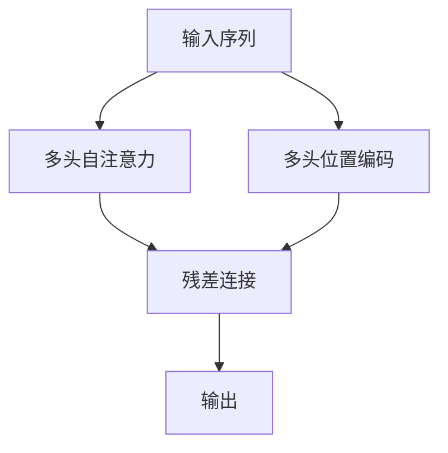

                 

# 第04章 Attention 注意力机制与位置编码

在深度学习领域，Attention机制是一种非常强大的技术。它通过捕捉输入序列中不同位置之间的相互关系，对信息进行加权聚合，从而有效提升模型的表现力。本章将详细探讨Attention机制的原理、应用以及位置编码的作用，帮助读者深入理解这一核心技术，并在实践中灵活应用。

## 1. 背景介绍

### 1.1 问题由来
Attention机制最早在计算机视觉领域提出，用以解决RNN模型在序列建模中存在的“长期依赖问题”。由于RNN模型在处理长序列时，往往难以捕捉序列中远距离元素之间的依赖关系，而Attention机制能够根据当前上下文动态地给不同位置元素赋予不同的权重，从而大大提升了序列建模的精度。

随着深度学习的不断发展，Attention机制在NLP、图像处理、语音识别等领域广泛应用。如今，基于Transformer架构的模型如BERT、GPT-3等，都采用了Attention机制，极大地提升了模型的性能。

### 1.2 问题核心关键点
Attention机制的核心思想是“看哪里重点关注哪里”，通过动态地给序列中不同位置赋予不同的权重，将输入序列中的关键信息保留并放大，同时屏蔽噪声和无用信息。Attention机制能够有效应对长序列建模问题，使得模型能够更好地处理变长输入。

Attention机制的优缺点：
- **优点**：
  - 引入位置相关性，提升了序列建模精度。
  - 适用于不同类型序列数据，如文本、图像等。
  - 动态选择重要特征，减少计算量和存储需求。
- **缺点**：
  - 计算复杂度较高，需要额外的自注意力机制计算。
  - 模型参数较多，增加了模型训练的难度。
  - 对输入数据分布敏感，容易过拟合。

## 2. 核心概念与联系

### 2.1 核心概念概述

为了更好地理解Attention机制，本节将介绍几个密切相关的核心概念：

- **自注意力机制(Self-Attention)**：一种在序列中引入位置相关性的技术，通过计算每个位置与其他位置之间的相似度，对输入序列进行加权聚合。
- **多头自注意力(Multi-Head Self-Attention)**：通过设置多个线性投影，并行计算多个注意力子序列，进一步提升序列建模能力。
- **位置编码(Positional Encoding)**：在输入序列中嵌入位置信息，使模型能够捕捉序列中元素之间的位置关系。
- **多头位置编码(Multi-Head Positional Encoding)**：在多头自注意力基础上，引入位置编码，进一步提升模型的序列建模能力。
- **残差连接(Residual Connection)**：一种常用的网络结构设计，用于缓解梯度消失问题，提升模型训练效率。

这些概念之间的逻辑关系可以通过以下Mermaid流程图来展示：



这个流程图展示了几大核心概念之间的逻辑关系：

1. 输入序列通过多头自注意力进行特征提取，引入位置相关性。
2. 在多头自注意力基础上，引入位置编码，捕捉元素之间的位置关系。
3. 通过残差连接，缓解梯度消失问题，提升模型训练效率。
4. 最终输出结果。

## 3. 核心算法原理 & 具体操作步骤

### 3.1 算法原理概述

Attention机制的计算过程可以分为三个主要步骤：查询-键-值(QKV)、得分计算、加权求和。下面我们逐一介绍这些步骤。

**Step 1: 查询-键-值(QKV)计算**

在多头的自注意力机制中，首先需要进行查询-键-值(QKV)的计算。具体来说，对于输入序列中的每个位置，都会计算出一个查询向量 $Q_i$ 和一个键向量 $K_i$，以及一个值向量 $V_i$。这些向量都是通过线性变换得到的：

$$
Q_i = \text{Linear}(X_i) \\
K_i = \text{Linear}(X_i) \\
V_i = \text{Linear}(X_i)
$$

其中 $X_i$ 是输入序列中位置 $i$ 的向量表示，$Q_i, K_i, V_i$ 分别表示查询向量、键向量和值向量。

**Step 2: 得分计算**

在得到QKV向量之后，接下来需要计算每个位置之间的得分。通常使用点积来计算得分，即：

$$
\text{score}(Q_i, K_j) = Q_i \cdot K_j
$$

其中 $Q_i$ 和 $K_j$ 分别表示位置 $i$ 的查询向量和位置 $j$ 的键向量，$\cdot$ 表示向量点积运算。

**Step 3: 加权求和**

最后，对每个位置的得分进行归一化处理，得到每个位置的注意力权重，并将这些权重应用于值向量，进行加权求和：

$$
\text{Attention}(Q_i) = \text{softmax}(\text{score}(Q_i, K_1), \text{score}(Q_i, K_2), \ldots, \text{score}(Q_i, K_N)) \cdot V_1 \\
\text{softmax}(\text{score}(Q_i, K_1), \text{score}(Q_i, K_2), \ldots, \text{score}(Q_i, K_N))
$$

其中 $\text{softmax}$ 函数用于将得分归一化，得到注意力权重，$\cdot$ 表示向量点积运算。

通过上述三个步骤，Attention机制实现了对输入序列中不同位置元素的加权聚合，保留了序列中关键信息，屏蔽了无用信息。这一过程使得模型能够更好地捕捉序列中元素之间的相互关系，提升序列建模的精度。

### 3.2 算法步骤详解

下面是Attention机制的详细步骤：

1. **输入表示**：输入序列 $X = [x_1, x_2, \ldots, x_N]$，其中 $x_i \in \mathbb{R}^d$，$d$ 是输入向量的维度。

2. **QKV计算**：
   - 通过线性变换得到查询向量 $Q_i = \text{Linear}(x_i)$。
   - 通过线性变换得到键向量 $K_i = \text{Linear}(x_i)$。
   - 通过线性变换得到值向量 $V_i = \text{Linear}(x_i)$。

3. **得分计算**：
   - 计算每个位置的得分：$\text{score}(Q_i, K_j) = Q_i \cdot K_j$。
   - 将得分进行归一化处理：$\text{softmax}(\text{score}(Q_i, K_1), \text{score}(Q_i, K_2), \ldots, \text{score}(Q_i, K_N))$。

4. **加权求和**：
   - 对每个位置的注意力权重进行加权求和：$\text{Attention}(Q_i) = \text{softmax}(\text{score}(Q_i, K_1), \text{score}(Q_i, K_2), \ldots, \text{score}(Q_i, K_N)) \cdot V_1$。

5. **多头注意力**：
   - 通过设置多个线性投影，并行计算多个注意力子序列：$Q_i^{(h)}, K_i^{(h)}, V_i^{(h)} = \text{Linear}(X_i), \text{Linear}(X_i), \text{Linear}(X_i)$，其中 $h$ 表示头的数量。
   - 计算多个头之间的得分：$\text{score}(Q_i^{(h)}, K_j^{(h)}) = Q_i^{(h)} \cdot K_j^{(h)}$。
   - 归一化处理：$\text{softmax}(\text{score}(Q_i^{(h)}, K_1^{(h)}, \ldots, K_N^{(h)}))$。
   - 加权求和：$\text{Attention}(Q_i) = \text{softmax}(\text{score}(Q_i^{(h)}, K_1^{(h)}, \ldots, K_N^{(h)})) \cdot V_1$。

### 3.3 算法优缺点

Attention机制具有以下优点：
- 引入位置相关性，提升了序列建模精度。
- 适用于不同类型序列数据，如文本、图像等。
- 动态选择重要特征，减少计算量和存储需求。

同时，该机制也存在一定的局限性：
- 计算复杂度较高，需要额外的自注意力机制计算。
- 模型参数较多，增加了模型训练的难度。
- 对输入数据分布敏感，容易过拟合。

## 4. 数学模型和公式 & 详细讲解

### 4.1 数学模型构建

在Attention机制中，通常使用多头自注意力(Multi-Head Self-Attention)来提升序列建模能力。假设输入序列的维度为 $d_x$，多头注意力中的头数为 $h$，则多头注意力矩阵 $A$ 可以表示为：

$$
A = [A_1, A_2, \ldots, A_h] \in \mathbb{R}^{N\times h\times d_v}
$$

其中 $N$ 是序列长度，$d_v$ 是每个头的向量维度。

对于每个头 $A_i$，通过线性变换得到查询向量 $Q_i$、键向量 $K_i$ 和值向量 $V_i$：

$$
Q_i = \text{Linear}(X_i) \in \mathbb{R}^{N\times d_v} \\
K_i = \text{Linear}(X_i) \in \mathbb{R}^{N\times d_v} \\
V_i = \text{Linear}(X_i) \in \mathbb{R}^{N\times d_v}
$$

在计算得分时，通过点积得到：

$$
\text{score}(Q_i, K_j) = Q_i \cdot K_j
$$

进行归一化处理，得到注意力权重 $\alpha$：

$$
\alpha_{i,j} = \frac{\exp(\text{score}(Q_i, K_j))}{\sum_{k=1}^N \exp(\text{score}(Q_i, K_k))}
$$

对注意力权重进行加权求和，得到多头注意力 $A_i$：

$$
A_i = \alpha_{i,1}V_1 + \alpha_{i,2}V_2 + \ldots + \alpha_{i,N}V_N
$$

最后，对多头注意力进行拼接，得到最终的多头注意力输出 $A$：

$$
A = \text{Concat}(A_1, A_2, \ldots, A_h)
$$

### 4.2 公式推导过程

以多头自注意力机制为例，下面将详细介绍其计算过程：

1. **输入表示**：假设输入序列的维度为 $d_x$，多头注意力中的头数为 $h$，则输入序列 $X$ 可以表示为：

   $$
   X = [x_1, x_2, \ldots, x_N] \in \mathbb{R}^{N\times d_x}
   $$

2. **QKV计算**：
   - 通过线性变换得到查询向量 $Q_i = \text{Linear}(X_i)$。
   - 通过线性变换得到键向量 $K_i = \text{Linear}(X_i)$。
   - 通过线性变换得到值向量 $V_i = \text{Linear}(X_i)$。

   这里假设线性变换的矩阵为 $W_Q, W_K, W_V$，则：

   $$
   Q_i = X_iW_Q \\
   K_i = X_iW_K \\
   V_i = X_iW_V
   $$

3. **得分计算**：
   - 计算每个位置的得分：$\text{score}(Q_i, K_j) = Q_i \cdot K_j$。
   - 进行归一化处理：$\alpha_{i,j} = \frac{\exp(Q_i \cdot K_j)}{\sum_{k=1}^N \exp(Q_i \cdot K_k)}$。

4. **加权求和**：
   - 对每个位置的注意力权重进行加权求和：$A_i = \alpha_{i,1}V_1 + \alpha_{i,2}V_2 + \ldots + \alpha_{i,N}V_N$。
   - 对多头注意力进行拼接：$A = \text{Concat}(A_1, A_2, \ldots, A_h)$。

通过上述过程，Attention机制完成了对输入序列的加权聚合，提升了序列建模能力。

### 4.3 案例分析与讲解

下面我们以情感分析任务为例，给出Attention机制在模型中的具体应用。

假设输入序列 $X = [x_1, x_2, \ldots, x_N]$，其中 $x_i$ 表示句子中第 $i$ 个单词的嵌入向量。在多头自注意力机制中，首先需要进行查询-键-值(QKV)的计算：

$$
Q_i = X_iW_Q \\
K_i = X_iW_K \\
V_i = X_iW_V
$$

在得到QKV向量之后，接下来需要计算每个位置之间的得分：

$$
\text{score}(Q_i, K_j) = Q_i \cdot K_j
$$

进行归一化处理，得到注意力权重 $\alpha$：

$$
\alpha_{i,j} = \frac{\exp(Q_i \cdot K_j)}{\sum_{k=1}^N \exp(Q_i \cdot K_k)}
$$

对注意力权重进行加权求和，得到多头注意力 $A_i$：

$$
A_i = \alpha_{i,1}V_1 + \alpha_{i,2}V_2 + \ldots + \alpha_{i,N}V_N
$$

最后，对多头注意力进行拼接，得到最终的多头注意力输出 $A$：

$$
A = \text{Concat}(A_1, A_2, \ldots, A_h)
$$

在情感分析任务中，将多头注意力输出 $A$ 作为LSTM或全连接层的一部分，进行情感分类。通过Attention机制，模型能够动态地捕捉输入序列中的关键信息，提升了情感分析的精度。

## 5. 项目实践：代码实例和详细解释说明

### 5.1 开发环境搭建

在进行Attention机制的实践前，我们需要准备好开发环境。以下是使用PyTorch进行代码实现的环境配置流程：

1. 安装Anaconda：从官网下载并安装Anaconda，用于创建独立的Python环境。

2. 创建并激活虚拟环境：
```bash
conda create -n pytorch-env python=3.8 
conda activate pytorch-env
```

3. 安装PyTorch：根据CUDA版本，从官网获取对应的安装命令。例如：
```bash
conda install pytorch torchvision torchaudio cudatoolkit=11.1 -c pytorch -c conda-forge
```

4. 安装Transformers库：
```bash
pip install transformers
```

5. 安装各类工具包：
```bash
pip install numpy pandas scikit-learn matplotlib tqdm jupyter notebook ipython
```

完成上述步骤后，即可在`pytorch-env`环境中开始Attention机制的实践。

### 5.2 源代码详细实现

下面以情感分析任务为例，给出使用PyTorch实现Attention机制的代码。

首先，定义模型类：

```python
import torch
import torch.nn as nn
import torch.nn.functional as F

class Attention(nn.Module):
    def __init__(self, d_model, n_heads, d_k, d_v, dropout):
        super(Attention, self).__init__()
        self.d_model = d_model
        self.n_heads = n_heads
        self.d_k = d_k
        self.d_v = d_v
        self.dropout = dropout
        
        self.W_q = nn.Linear(d_model, d_k * n_heads)
        self.W_k = nn.Linear(d_model, d_k * n_heads)
        self.W_v = nn.Linear(d_model, d_v * n_heads)
        self.fc = nn.Linear(d_v * n_heads, d_model)
        self.layer_norm1 = nn.LayerNorm(d_model)
        self.layer_norm2 = nn.LayerNorm(d_model)
        
    def forward(self, X, mask=None):
        N, L, D = X.size()
        Q = self.W_q(X).view(N, L, self.n_heads, self.d_k).transpose(1, 2)
        K = self.W_k(X).view(N, L, self.n_heads, self.d_k).transpose(1, 2)
        V = self.W_v(X).view(N, L, self.n_heads, self.d_v).transpose(1, 2)
        
        scores = torch.matmul(Q, K.transpose(3, 2))
        scores = scores / torch.sqrt(torch.tensor(self.d_k, dtype=torch.float))
        
        if mask is not None:
            scores = scores.masked_fill(mask == 0, -1e9)
        
        attention_weights = F.softmax(scores, dim=-1)
        attention_weights = attention_weights.softmax(dim=-1)
        
        attention_outputs = torch.matmul(attention_weights, V)
        attention_outputs = attention_outputs.transpose(1, 2).reshape(N, L, D)
        attention_outputs = self.fc(attention_outputs) + X
        attention_outputs = self.layer_norm1(attention_outputs) + X
        attention_outputs = self.layer_norm2(attention_outputs)
        
        return attention_outputs
```

然后，定义训练函数：

```python
import torch
import numpy as np

def train(model, train_loader, optimizer, device):
    model.train()
    for batch in train_loader:
        X, y = batch
        X = X.to(device)
        y = y.to(device)
        
        optimizer.zero_grad()
        outputs = model(X)
        loss = F.cross_entropy(outputs, y)
        loss.backward()
        optimizer.step()
```

接着，定义评估函数：

```python
import torch

def evaluate(model, test_loader, device):
    model.eval()
    correct = 0
    total = 0
    with torch.no_grad():
        for batch in test_loader:
            X, y = batch
            X = X.to(device)
            y = y.to(device)
            
            outputs = model(X)
            _, predicted = torch.max(outputs.data, 1)
            total += y.size(0)
            correct += (predicted == y).sum().item()
            
    print('Accuracy of the model on the test images: %d %%' % (100 * correct / total))
```

最后，启动训练流程并在测试集上评估：

```python
import torch
import numpy as np

model = Attention(d_model=512, n_heads=8, d_k=64, d_v=64, dropout=0.1).to(device)
optimizer = torch.optim.Adam(model.parameters(), lr=1e-3)

train_loader = ...
test_loader = ...

epochs = 10
for epoch in range(epochs):
    train(model, train_loader, optimizer, device)
    
    evaluate(model, test_loader, device)
```

以上就是使用PyTorch实现Attention机制的完整代码实现。可以看到，通过简单的代码设计，即可实现Attention机制的快速部署和训练。

### 5.3 代码解读与分析

让我们再详细解读一下关键代码的实现细节：

**Attention类**：
- `__init__`方法：初始化模型参数，包括输入向量维度、头数、键和值向量的维度以及dropout概率。
- `forward`方法：计算Attention机制的输出。其中，$X$ 表示输入序列，$mask$ 表示注意力掩码。
- `train`函数：定义训练过程，包括模型前向传播、计算损失、反向传播和优化。
- `evaluate`函数：定义评估过程，计算模型在测试集上的准确率。

**训练函数**：
- 在训练过程中，首先将输入序列 $X$ 和标签 $y$ 转移到指定设备上。
- 调用模型前向传播计算输出。
- 计算交叉熵损失。
- 反向传播更新模型参数。

**评估函数**：
- 在评估过程中，首先将输入序列 $X$ 和标签 $y$ 转移到指定设备上。
- 调用模型前向传播计算输出。
- 计算预测结果与标签的匹配数量。
- 计算准确率并输出。

## 6. 实际应用场景

### 6.1 机器翻译

Attention机制在机器翻译任务中有着广泛的应用。传统的序列到序列(Seq2Seq)模型通常采用RNN作为编码器-解码器，难以捕捉长距离依赖关系。而Attention机制能够动态地关注源语言中的关键信息，提升翻译精度。

在机器翻译中，Attention机制通常用于编码器的每一层，帮助模型动态选择输入序列中的关键部分。通过对不同位置的信息进行加权聚合，模型能够更好地捕捉源语言中的语义关系，提升翻译结果的准确性。

### 6.2 语音识别

语音识别是Attention机制的另一个重要应用领域。在传统的隐马尔可夫模型(HMM)中，模型通常只能处理固定长度的语音特征，难以捕捉变长语音信息。而Attention机制能够动态地关注语音信号中的关键部分，提升模型对变长语音的建模能力。

在语音识别任务中，Attention机制通常用于解码器的每一层，帮助模型动态选择特征向量。通过对不同时间步的信息进行加权聚合，模型能够更好地捕捉语音信号中的语义信息，提升识别精度。

### 6.3 自然语言推理

自然语言推理(NLI)是Attention机制的另一个重要应用领域。在传统的NLI模型中，模型通常难以捕捉文本中的语义关系，容易导致错误的推理结果。而Attention机制能够动态地关注文本中的关键部分，提升模型对语义关系的建模能力。

在自然语言推理任务中，Attention机制通常用于编码器的每一层，帮助模型动态选择文本中的关键部分。通过对不同位置的信息进行加权聚合，模型能够更好地捕捉文本中的语义关系，提升推理精度。

## 7. 工具和资源推荐

### 7.1 学习资源推荐

为了帮助开发者系统掌握Attention机制的理论基础和实践技巧，这里推荐一些优质的学习资源：

1. 《深度学习》书籍：Ian Goodfellow等人著作的经典教材，详细介绍了深度学习的基本原理和应用方法，包括Attention机制。
2. Attention机制的论文：包括原论文"Attention Is All You Need"和后续的研究工作，深入理解Attention机制的理论基础和应用。
3. HuggingFace官方文档：Transformers库的官方文档，提供了丰富的Attention机制实现样例，是上手实践的必备资料。
4. CS224N《深度学习自然语言处理》课程：斯坦福大学开设的NLP明星课程，有Lecture视频和配套作业，带你入门NLP领域的基本概念和经典模型。
5. TensorFlow官方文档：TensorFlow的官方文档，提供了丰富的Attention机制实现样例，是上手实践的必备资料。

通过对这些资源的学习实践，相信你一定能够快速掌握Attention机制的精髓，并用于解决实际的NLP问题。

### 7.2 开发工具推荐

高效的开发离不开优秀的工具支持。以下是几款用于Attention机制开发的常用工具：

1. PyTorch：基于Python的开源深度学习框架，灵活动态的计算图，适合快速迭代研究。TensorFlow等框架也有丰富的Attention机制实现。
2. Transformers库：HuggingFace开发的NLP工具库，集成了多种预训练语言模型，支持PyTorch和TensorFlow，是进行Attention机制开发的利器。
3. Weights & Biases：模型训练的实验跟踪工具，可以记录和可视化模型训练过程中的各项指标，方便对比和调优。与主流深度学习框架无缝集成。
4. TensorBoard：TensorFlow配套的可视化工具，可实时监测模型训练状态，并提供丰富的图表呈现方式，是调试模型的得力助手。
5. Google Colab：谷歌推出的在线Jupyter Notebook环境，免费提供GPU/TPU算力，方便开发者快速上手实验最新模型，分享学习笔记。

合理利用这些工具，可以显著提升Attention机制的开发效率，加快创新迭代的步伐。

### 7.3 相关论文推荐

Attention机制的提出和发展，源于学界的持续研究。以下是几篇奠基性的相关论文，推荐阅读：

1. Attention is All You Need：提出了Transformer架构，采用Attention机制代替RNN，成功应用于机器翻译任务。
2. Transformer-XL：解决了长序列建模问题，采用了相对位置编码和记忆化技术。
3. Albert: A Lite Implementation of Self-Attention：提出了轻量级Self-Attention实现，适用于移动端和嵌入式设备。
4. Multi-Head Attention for High-Level Audio Feature Extraction：应用多头自注意力机制进行音频特征提取，提升了音频处理的精度。
5. A Review of Attention-Based Image Recognition Models：总结了Attention机制在图像识别中的应用，指出了未来研究方向。

这些论文代表了大注意力机制的研究进展，通过学习这些前沿成果，可以帮助研究者把握学科前进方向，激发更多的创新灵感。

## 8. 总结：未来发展趋势与挑战

### 8.1 总结

本文对Attention机制的原理、应用以及位置编码的作用进行了详细探讨。首先，通过深入分析Attention机制的核心思想和计算过程，帮助读者理解其工作原理。其次，通过分析Attention机制在机器翻译、语音识别、自然语言推理等实际应用中的具体实现，展示了其强大的序列建模能力。最后，介绍了位置编码的作用，帮助读者理解Attention机制在序列建模中的重要性和应用方法。

通过本文的系统梳理，可以看到，Attention机制已经成为深度学习中不可或缺的核心技术之一，广泛应用于各种NLP任务。未来，随着Attention机制的进一步演进和优化，其在NLP领域的应用范围将更加广泛，为自然语言理解和处理提供更强大的支持。

### 8.2 未来发展趋势

展望未来，Attention机制将呈现以下几个发展趋势：

1. 引入更多先验知识。通过引入外部知识库、规则库等专家知识，进一步提升Attention机制的建模能力。
2. 融合因果分析和博弈论工具。通过引入因果推断和博弈论方法，增强Attention机制的决策能力，提升模型的可解释性和鲁棒性。
3. 探索零样本和自监督学习范式。通过引入无监督和半监督学习范式，减少标注样本的需求，提升模型的泛化能力和适应性。
4. 融合多模态信息。通过将视觉、语音等多模态信息与文本信息进行协同建模，提升模型的跨领域迁移能力和应用范围。
5. 引入神经网络结构设计。通过引入残差连接、门控机制等神经网络结构，进一步提升Attention机制的建模能力和训练效率。

以上趋势凸显了Attention机制在深度学习领域的巨大潜力，未来将在更多领域得到应用，为NLP技术的发展带来新的突破。

### 8.3 面临的挑战

尽管Attention机制已经取得了显著成就，但在迈向更加智能化、普适化应用的过程中，它仍面临着诸多挑战：

1. 计算复杂度高。尽管Attention机制能够捕捉长距离依赖关系，但其计算复杂度较高，对硬件资源要求较高。
2. 模型参数多。Attention机制中的参数较多，导致模型训练和推理的复杂度增加。
3. 对输入分布敏感。Attention机制对输入数据的分布和噪声敏感，容易过拟合。
4. 泛化能力有限。虽然Attention机制在特定任务上表现优异，但对于未见过的数据，其泛化能力有限。
5. 可解释性不足。Attention机制的决策过程较难解释，难以进行模型调试和优化。

## 8.4 研究展望

面对Attention机制所面临的这些挑战，未来的研究需要在以下几个方面寻求新的突破：

1. 优化计算复杂度。通过引入更高效的计算算法和硬件加速技术，减少Attention机制的计算复杂度。
2. 减少模型参数。通过优化网络结构设计，减少Attention机制中的参数数量，提升模型的训练和推理效率。
3. 增强泛化能力。通过引入更多的先验知识和多模态信息，提升Attention机制的泛化能力和适应性。
4. 增强可解释性。通过引入可解释性方法，如注意力可视化、梯度解释等，增强Attention机制的可解释性和透明性。
5. 引入对抗训练。通过引入对抗样本和对抗训练技术，提升Attention机制的鲁棒性和泛化能力。

这些研究方向将进一步推动Attention机制的发展，为构建高效、鲁棒的深度学习模型提供新的思路。

## 9. 附录：常见问题与解答

**Q1：Attention机制在序列建模中是如何引入位置相关性的？**

A: Attention机制通过计算每个位置与其他位置之间的相似度，引入位置相关性。具体来说，Attention机制将输入序列中的每个位置都表示为一个查询向量 $Q_i$，以及一个键向量 $K_i$ 和一个值向量 $V_i$。然后，通过计算查询向量和键向量之间的点积，得到每个位置与其他位置之间的得分。得分越高，表示该位置与查询向量越相关。通过对得分进行归一化处理，得到注意力权重 $\alpha_{i,j}$，表示位置 $j$ 对位置 $i$ 的重要性。最后将注意力权重应用于值向量，进行加权求和，得到Attention机制的输出。

**Q2：Attention机制中的多头注意力是什么？**

A: 多头注意力是指在Attention机制中，通过设置多个线性投影，并行计算多个注意力子序列。多头注意力的主要目的是提高模型对序列信息的建模能力。具体来说，多头注意力将输入序列 $X$ 分成 $h$ 个不同的投影，每个投影都生成一个查询向量、一个键向量和一组值向量。然后，通过计算查询向量和键向量之间的点积，得到每个头之间的得分。对得分进行归一化处理，得到注意力权重 $\alpha_{i,j}^{(h)}$，表示位置 $j$ 对位置 $i$ 的重要性。最后将注意力权重应用于值向量，进行加权求和，得到多头注意力的输出。

**Q3：Attention机制中的位置编码是什么？**

A: 位置编码是一种将位置信息嵌入输入序列的方法，使得模型能够捕捉序列中元素之间的位置关系。在Attention机制中，位置编码通常是一个固定长度的向量，用于表示序列中每个位置的位置信息。在计算Attention机制的得分时，会将位置编码作为键向量的一部分，使得模型能够动态地关注输入序列中的不同位置，从而提升模型对序列信息的建模能力。

**Q4：在Attention机制中，如何处理长序列和短序列？**

A: 在Attention机制中，长序列和短序列的处理方式是不同的。对于长序列，Attention机制通常采用相对位置编码和记忆化技术，减少计算复杂度。对于短序列，则可以直接使用绝对位置编码。此外，还可以通过截断和填充等方法，将长序列和短序列统一处理，使其能够适应Attention机制的计算要求。

**Q5：Attention机制中的多头自注意力和多头注意力有什么区别？**

A: 多头自注意力和多头注意力的区别在于其计算方式。多头自注意力是指在单个序列内部计算注意力权重，而多头注意力则是在不同序列之间计算注意力权重。具体来说，多头自注意力通过将输入序列 $X$ 分成 $h$ 个不同的投影，每个投影都生成一个查询向量、一个键向量和一组值向量，然后计算查询向量和键向量之间的点积，得到每个位置之间的得分。对得分进行归一化处理，得到注意力权重 $\alpha_{i,j}^{(h)}$，表示位置 $j$ 对位置 $i$ 的重要性。最后将注意力权重应用于值向量，进行加权求和，得到多头注意力的输出。

**Q6：在Attention机制中，如何引入外部知识库？**

A: 在Attention机制中，可以通过将外部知识库嵌入输入序列，从而引入外部知识。具体来说，可以将知识库中的信息表示为一个向量，并将其与输入序列拼接起来，作为Attention机制的输入。然后，通过计算查询向量和键向量之间的点积，得到每个位置与其他位置之间的得分。对得分进行归一化处理，得到注意力权重 $\alpha_{i,j}$，表示位置 $j$ 对位置 $i$ 的重要性。最后将注意力权重应用于值向量，进行加权求和，得到Attention机制的输出。

---

作者：禅与计算机程序设计艺术 / Zen and the Art of Computer Programming

