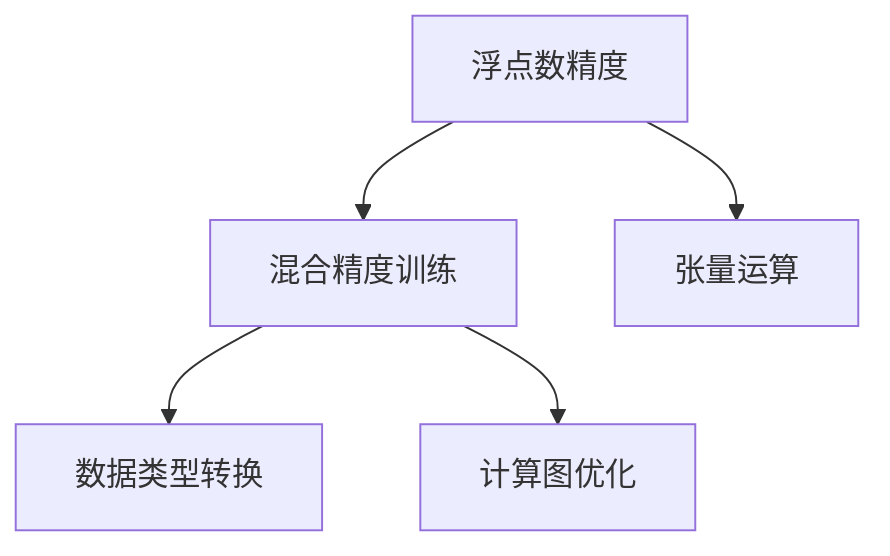

                 

# 第九章：混合精度训练的优势

> 关键词：混合精度训练,深度学习,计算效率,模型压缩,加速训练,量化技术

## 1. 背景介绍

### 1.1 问题由来

随着深度学习模型规模的不断增大，训练深度神经网络所消耗的计算资源和存储成本也随之飙升。大模型、大数据、大算力成为深度学习发展的必要条件，但也带来了一系列的挑战。

混合精度训练(Mixed Precision Training, MPT)应运而生，通过使用不同精度等级的数值类型进行计算，极大地降低了计算和存储成本，同时显著提升了深度学习模型的训练效率。混合精度训练在加速深度神经网络训练、降低计算资源需求、提高模型性能等方面具有显著优势。

### 1.2 问题核心关键点

混合精度训练的核心思想是在训练过程中，使用不同精度等级（如32位浮点数和16位浮点数）进行计算，从而降低存储和计算成本。这种混合精度训练方法，既不丢失精度，又显著提升训练速度，已经成为深度学习训练中的重要技术。

混合精度训练的关键包括：
- 选择合适的数值类型组合。
- 计算过程的精度管理。
- 避免精度损失。
- 硬件和软件支持。

## 2. 核心概念与联系

### 2.1 核心概念概述

为了更好地理解混合精度训练的优势，本节将介绍几个相关核心概念：

- 浮点数精度：浮点数是用科学计数法表示的数值，通常包括32位浮点数(即单精度浮点数)和64位浮点数(即双精度浮点数)。精度越高，表示的数值范围越大，但计算和存储成本也越高。
- 混合精度：混合精度训练是指在训练过程中，使用不同精度的数值类型进行计算。例如，模型中权重和激活值使用浮点数表示，而乘积、加法等计算过程使用半精度浮点数进行。
- 张量运算：深度学习中常用的矩阵和向量运算，通常需要高精度的浮点数进行计算。混合精度训练通过使用不同精度等级，优化了计算过程中的数值类型使用。
- 数据类型转换：混合精度训练中，需要频繁进行数据类型转换，以适应不同精度等级的计算需求。
- 计算图优化：在混合精度训练中，深度学习框架需要对计算图进行优化，以确保数据类型转换和精度管理的过程平滑流畅。

这些核心概念之间的逻辑关系可以通过以下Mermaid流程图来展示：



这个流程图展示了大语言模型的核心概念及其之间的关系：

1. 浮点数精度影响计算和存储成本。
2. 混合精度训练通过使用不同精度等级的数值类型，显著降低成本。
3. 张量运算需要高精度的数值类型。
4. 数据类型转换在混合精度训练中频繁进行。
5. 计算图优化是混合精度训练的关键技术之一。

这些概念共同构成了混合精度训练的技术框架，使其在深度学习模型训练中发挥重要作用。

## 3. 核心算法原理 & 具体操作步骤
### 3.1 算法原理概述

混合精度训练的原理基于浮点数精度的不同组合使用。一般使用半精度浮点数（16位浮点数）进行计算，以降低计算成本，同时使用单精度浮点数或双精度浮点数进行关键计算，保证计算精度。混合精度训练的核心算法如下：

1. 选择合适精度的数据类型。
2. 在模型中进行数值类型转换。
3. 进行混合精度计算。
4. 监控精度损失，调整计算过程。

### 3.2 算法步骤详解

以下是混合精度训练的详细步骤：

**Step 1: 准备计算环境**
- 确认所使用的计算设备支持混合精度计算，如NVIDIA GPU。
- 选择合适的深度学习框架，如PyTorch、TensorFlow等。

**Step 2: 数据类型转换**
- 定义模型中的张量类型。例如，在PyTorch中，可以使用`torch.cuda.HalfTensor`来定义半精度张量。
- 在模型中定义张量的数据类型。例如，在PyTorch中，可以使用`.to(half)`方法将张量转换为半精度类型。

**Step 3: 混合精度计算**
- 使用`torch.cuda.HalfTensor`定义模型中的张量。
- 在模型中进行混合精度计算。例如，在PyTorch中，可以使用`torch.half`来定义半精度计算，通过`.to(half)`将张量转换为半精度类型，通过`.to(float)`将张量转换为单精度类型。

**Step 4: 监控精度损失**
- 定义精度监控函数，例如在PyTorch中，可以使用`torch.isclose`函数比较两个张量之间的差异。
- 监控训练过程中模型的精度损失，根据精度损失调整计算过程。

### 3.3 算法优缺点

混合精度训练具有以下优点：
1. 显著降低计算成本。使用半精度浮点数进行计算，大大减少了计算资源的需求。
2. 显著提高训练速度。混合精度训练可以显著提高训练速度，缩短训练时间。
3. 保持计算精度。通过合理的精度管理，混合精度训练可以保持较高的计算精度。
4. 广泛适用。混合精度训练可以应用于各种深度学习模型，如卷积神经网络(CNN)、循环神经网络(RNN)等。

同时，混合精度训练也存在一些缺点：
1. 硬件要求较高。混合精度训练需要高性能的计算设备，如NVIDIA GPU。
2. 数据类型转换开销较大。频繁的数据类型转换增加了计算开销。
3. 精度监控复杂。需要监控精度损失，并及时调整计算过程。
4. 不适用于所有模型。一些复杂的模型可能需要更精细的精度管理。

尽管存在这些局限性，混合精度训练已经在大规模深度学习模型训练中广泛应用，显著提升了计算效率和训练速度。

### 3.4 算法应用领域

混合精度训练在深度学习模型训练中具有广泛的应用，包括但不限于以下几个领域：

1. 图像分类和识别：在图像分类和识别任务中，使用混合精度训练可以显著提高模型训练速度，例如在ImageNet数据集上的大规模图像分类任务。
2. 目标检测和跟踪：在目标检测和跟踪任务中，混合精度训练可以加速模型训练，例如在COCO数据集上的物体检测任务。
3. 自然语言处理：在自然语言处理任务中，混合精度训练可以加快模型的训练，例如在GLUE数据集上的语言理解任务。
4. 语音识别和处理：在语音识别和处理任务中，混合精度训练可以加速模型训练，例如在LibriSpeech数据集上的语音识别任务。
5. 医疗影像分析：在医疗影像分析任务中，混合精度训练可以加速模型训练，例如在CheXNet数据集上的肺结节检测任务。

随着深度学习模型的不断发展和计算资源的不断扩展，混合精度训练的应用领域将会更加广泛，对深度学习模型的训练和应用产生深远影响。

## 4. 数学模型和公式 & 详细讲解 & 举例说明
### 4.1 数学模型构建

混合精度训练涉及浮点数的精度管理，主要包括以下几个核心数学模型：

- 半精度浮点数：通常用16位浮点数表示，格式为IEEE 754半精度格式。
- 单精度浮点数：通常用32位浮点数表示，格式为IEEE 754单精度格式。
- 双精度浮点数：通常用64位浮点数表示，格式为IEEE 754双精度格式。

混合精度训练的数学模型构建，需要考虑不同精度等级之间的转换和计算。以下以TensorFlow为例，展示混合精度训练的数学模型构建过程。

**定义浮点数类型**

在TensorFlow中，可以使用`tf.float16`和`tf.float32`来定义半精度和单精度浮点数类型。例如：

```python
x = tf.constant(3.14, dtype=tf.float16)
y = tf.constant(2.0, dtype=tf.float32)
```

**数值类型转换**

在混合精度训练中，需要频繁进行数值类型转换。TensorFlow提供了`tf.cast`函数用于进行数值类型转换。例如：

```python
z = tf.cast(x, tf.float32) + tf.cast(y, tf.float32)
```

**混合精度计算**

在混合精度计算中，使用半精度浮点数进行计算，可以显著降低计算成本。例如：

```python
z = tf.matmul(x, y)
z = tf.cast(z, tf.float32)
```

**精度监控**

在混合精度训练中，需要监控精度损失，并及时调整计算过程。TensorFlow提供了`tf.reduce_mean`和`tf.reduce_std`函数用于计算张量间的差异。例如：

```python
z = tf.reduce_mean(z)
z = tf.reduce_std(z)
```

### 4.2 公式推导过程

在混合精度训练中，使用半精度浮点数进行计算，可以显著降低计算成本。以下是混合精度训练的数学公式推导过程：

假设输入张量$x$和$y$分别为单精度浮点数和半精度浮点数，输出张量$z$为单精度浮点数。在混合精度训练中，数值类型转换和计算过程可以表示为：

$$
z = x \cdot y
$$

其中$x$和$y$分别为单精度浮点数和半精度浮点数，$z$为单精度浮点数。混合精度训练的数学模型可以表示为：

$$
z = tf.cast(x, tf.float16) \cdot tf.cast(y, tf.float16)
$$

**数值类型转换**

在数值类型转换中，使用`tf.cast`函数将$x$和$y$转换为半精度浮点数。例如：

$$
x' = tf.cast(x, tf.float16)
y' = tf.cast(y, tf.float16)
$$

**混合精度计算**

在混合精度计算中，使用半精度浮点数进行计算。例如：

$$
z' = x' \cdot y'
$$

**精度监控**

在混合精度训练中，需要监控精度损失，并及时调整计算过程。例如：

$$
z = tf.cast(z', tf.float32)
$$

### 4.3 案例分析与讲解

以下是一个简单的混合精度训练案例，使用PyTorch框架。

**准备数据**

```python
import torch
from torch import nn

# 定义输入张量x和y
x = torch.tensor([1.0, 2.0, 3.0], dtype=torch.float32)
y = torch.tensor([4.0, 5.0, 6.0], dtype=torch.float16)

# 定义输出张量z
z = torch.zeros(3, dtype=torch.float32)
```

**数值类型转换**

在混合精度训练中，使用`.to()`方法将张量转换为不同精度等级。例如：

```python
x = x.to(torch.float16)
y = y.to(torch.float16)
```

**混合精度计算**

在混合精度计算中，使用半精度浮点数进行计算。例如：

```python
z = x * y
```

**精度监控**

在混合精度训练中，需要监控精度损失，并及时调整计算过程。例如：

```python
z = z.to(torch.float32)
```

## 5. 项目实践：代码实例和详细解释说明
### 5.1 开发环境搭建

在进行混合精度训练实践前，我们需要准备好开发环境。以下是使用Python进行TensorFlow开发的环境配置流程：

1. 安装Anaconda：从官网下载并安装Anaconda，用于创建独立的Python环境。

2. 创建并激活虚拟环境：
```bash
conda create -n tf-env python=3.8 
conda activate tf-env
```

3. 安装TensorFlow：从官网获取对应的安装命令。例如：
```bash
conda install tensorflow=2.7
```

4. 安装TensorBoard：用于可视化训练过程和结果。例如：
```bash
conda install tensorboard
```

5. 安装TensorFlow Addons：用于支持混合精度计算等额外功能。例如：
```bash
conda install tensorflow-addons
```

完成上述步骤后，即可在`tf-env`环境中开始混合精度训练实践。

### 5.2 源代码详细实现

下面我们以一个简单的卷积神经网络(CNN)为例，给出使用TensorFlow进行混合精度训练的代码实现。

**准备数据**

```python
import tensorflow as tf

# 定义输入数据
x = tf.constant([[1.0, 2.0, 3.0], [4.0, 5.0, 6.0]], dtype=tf.float32)
```

**定义模型**

```python
model = tf.keras.Sequential([
    tf.keras.layers.Conv2D(32, (3, 3), activation='relu'),
    tf.keras.layers.MaxPooling2D((2, 2)),
    tf.keras.layers.Flatten(),
    tf.keras.layers.Dense(10, activation='softmax')
])
```

**数值类型转换**

在混合精度训练中，使用`tf.cast`函数将张量转换为不同精度等级。例如：

```python
x = tf.cast(x, tf.float16)
```

**混合精度计算**

在混合精度计算中，使用半精度浮点数进行计算。例如：

```python
y = model(x, training=True)
```

**精度监控**

在混合精度训练中，需要监控精度损失，并及时调整计算过程。例如：

```python
y = tf.cast(y, tf.float32)
```

### 5.3 代码解读与分析

让我们再详细解读一下关键代码的实现细节：

**定义输入数据**

在混合精度训练中，需要定义输入张量。使用`tf.constant`函数定义输入数据。

**定义模型**

在混合精度训练中，需要使用深度学习框架定义模型。使用`tf.keras.Sequential`函数定义一个简单的卷积神经网络。

**数值类型转换**

在混合精度训练中，使用`tf.cast`函数将张量转换为不同精度等级。例如，将输入数据转换为半精度浮点数。

**混合精度计算**

在混合精度训练中，使用半精度浮点数进行计算。例如，将模型输入转换为半精度浮点数。

**精度监控**

在混合精度训练中，需要监控精度损失，并及时调整计算过程。例如，将输出张量转换为单精度浮点数。

## 6. 实际应用场景
### 6.1 加速训练

混合精度训练显著提高了深度学习模型的训练速度。在处理大规模数据集时，混合精度训练可以显著缩短训练时间，加快模型的训练速度。例如，在ImageNet数据集上的大规模图像分类任务中，使用混合精度训练可以将训练时间缩短到原来的几分之一。

### 6.2 降低计算成本

混合精度训练通过使用不同精度等级的数值类型，显著降低了计算和存储成本。例如，使用半精度浮点数进行计算，可以降低计算成本，节省GPU内存。

### 6.3 支持模型压缩

混合精度训练通过使用不同精度等级的数值类型，可以实现模型压缩。例如，使用半精度浮点数进行训练，可以减少模型的存储空间，支持模型压缩。

### 6.4 未来应用展望

随着深度学习模型的不断发展和计算资源的不断扩展，混合精度训练的应用领域将会更加广泛，对深度学习模型的训练和应用产生深远影响。

在图像识别、自然语言处理、语音识别等领域，混合精度训练将得到广泛应用，显著提升模型的训练速度和计算效率。未来，随着硬件设备的不断升级，混合精度训练的应用场景将更加丰富，为深度学习模型带来更多的可能性。

## 7. 工具和资源推荐
### 7.1 学习资源推荐

为了帮助开发者系统掌握混合精度训练的理论基础和实践技巧，这里推荐一些优质的学习资源：

1. 《深度学习入门：基于Python的理论与实现》系列博文：由深度学习专家撰写，深入浅出地介绍了深度学习中的混合精度训练技术。

2. CS231n《卷积神经网络》课程：斯坦福大学开设的深度学习课程，涵盖了混合精度训练等内容，并提供了实践作业。

3. 《TensorFlow实践指南》书籍：由TensorFlow官方团队撰写，详细介绍了TensorFlow中的混合精度计算等技术。

4. 《Mixed Precision Training in TensorFlow》官方文档：TensorFlow的官方文档，提供了混合精度训练的详细指导和样例代码。

5. Weights & Biases：模型训练的实验跟踪工具，可以记录和可视化混合精度训练过程中的各项指标，方便对比和调优。

通过对这些资源的学习实践，相信你一定能够快速掌握混合精度训练的精髓，并用于解决实际的深度学习问题。

### 7.2 开发工具推荐

高效的开发离不开优秀的工具支持。以下是几款用于混合精度训练开发的常用工具：

1. PyTorch：基于Python的开源深度学习框架，支持混合精度计算，适合快速迭代研究。

2. TensorFlow：由Google主导开发的开源深度学习框架，支持混合精度计算，生产部署方便。

3. TensorFlow Addons：TensorFlow的官方扩展库，支持混合精度计算等额外功能，方便开发者使用。

4. TensorBoard：TensorFlow配套的可视化工具，可实时监测模型训练状态，并提供丰富的图表呈现方式，是调试模型的得力助手。

5. PyTorch Lightning：基于PyTorch的轻量级深度学习框架，支持混合精度计算，方便模型训练和部署。

合理利用这些工具，可以显著提升混合精度训练任务的开发效率，加快创新迭代的步伐。

### 7.3 相关论文推荐

混合精度训练的研究始于学界的持续研究。以下是几篇奠基性的相关论文，推荐阅读：

1. Training with Mixed-Precision Convolutional Neural Networks（TF32）：提出混合精度计算的原理和实现方法，成为深度学习中广泛应用的技术。

2. All Precision Aren't Created Equal：分析不同精度等级的数值类型在深度学习中的影响，提出混合精度训练的优化方法。

3. TensorFlow Mixed Precision Training with Automatic Mixed Precision Training：介绍TensorFlow中的混合精度训练方法，包括自动混合精度训练（AMPT）等技术。

4. Mixed Precision Training with an Automatic Mixed Precision Network：提出自动混合精度网络（AMN），实现混合精度训练的自动优化。

这些论文代表了大混合精度训练技术的发展脉络。通过学习这些前沿成果，可以帮助研究者把握学科前进方向，激发更多的创新灵感。

## 8. 总结：未来发展趋势与挑战

### 8.1 总结

本文对混合精度训练的原理、具体操作步骤和应用场景进行了全面系统的介绍。首先阐述了混合精度训练的背景和优势，明确了混合精度训练在降低计算成本、提升训练速度等方面的重要作用。其次，从原理到实践，详细讲解了混合精度训练的数学模型和计算过程，给出了混合精度训练任务开发的完整代码实例。同时，本文还广泛探讨了混合精度训练在图像识别、自然语言处理、语音识别等多个领域的应用前景，展示了混合精度训练的巨大潜力。此外，本文精选了混合精度训练的学习资源和开发工具，力求为读者提供全方位的技术指引。

通过本文的系统梳理，可以看到，混合精度训练已经成为深度学习模型训练的重要技术，极大地降低了计算资源需求，提升了训练速度和模型性能。未来，伴随计算资源和硬件设备的不断升级，混合精度训练的应用领域将会更加广泛，为深度学习模型的训练和应用带来更多的可能性。

### 8.2 未来发展趋势

展望未来，混合精度训练技术将呈现以下几个发展趋势：

1. 计算设备硬件不断升级。随着GPU和TPU等计算设备性能的不断提升，混合精度训练将能够应用于更加复杂、大规模的深度学习模型。

2. 模型压缩和优化技术发展。混合精度训练结合模型压缩和优化技术，将进一步降低计算和存储成本，提升模型训练效率。

3. 数据类型管理优化。混合精度训练将结合多种数据类型管理技术，实现更高效、更精准的数值计算。

4. 混合精度计算库完善。更多混合精度计算库将被开发和优化，支持不同框架的混合精度训练。

5. 混合精度训练标准制定。混合精度训练的标准化和规范化将进一步提升混合精度训练的普及和应用。

这些趋势凸显了混合精度训练技术的广阔前景。这些方向的探索发展，必将进一步提升深度学习模型的训练和应用效果，为人工智能技术的发展带来新的动力。

### 8.3 面临的挑战

尽管混合精度训练已经取得了显著的成果，但在迈向更加智能化、普适化应用的过程中，它仍面临着诸多挑战：

1. 硬件要求较高。混合精度训练需要高性能的计算设备，如GPU和TPU，对于普通硬件设备可能难以支持。

2. 数据类型转换开销较大。频繁的数据类型转换增加了计算开销，可能影响混合精度训练的效率。

3. 精度监控复杂。需要监控精度损失，并及时调整计算过程，增加了计算复杂度。

4. 精度损失风险。混合精度训练中，数值类型转换可能导致精度损失，影响模型性能。

5. 不适用于所有模型。一些复杂的模型可能需要更精细的精度管理，混合精度训练可能不适用。

尽管存在这些局限性，混合精度训练已经成为深度学习训练中的重要技术，显著提升了计算效率和训练速度。未来，随着硬件设备的不断升级和算法技术的不断优化，混合精度训练的应用领域将会更加广泛，为深度学习模型的训练和应用带来更多的可能性。

### 8.4 研究展望

面对混合精度训练所面临的挑战，未来的研究需要在以下几个方面寻求新的突破：

1. 探索更加高效的混合精度计算方法。结合新型计算架构和算法技术，进一步提升混合精度训练的计算效率。

2. 研究混合精度训练的标准化方法。制定混合精度训练的标准化流程和规范，降低开发者入门的门槛。

3. 结合模型压缩和优化技术。结合混合精度训练和模型压缩技术，实现更高效、更精准的数值计算。

4. 引入更多先验知识。将符号化的先验知识，如知识图谱、逻辑规则等，与混合精度训练进行融合，提升模型的鲁棒性和准确性。

5. 提高混合精度训练的可解释性。通过解释混合精度训练的内部机制，提升模型的可解释性和可理解性。

这些研究方向的探索，必将引领混合精度训练技术迈向更高的台阶，为深度学习模型的训练和应用带来更多的可能性。面向未来，混合精度训练需要与其他人工智能技术进行更深入的融合，多路径协同发力，共同推动深度学习技术的进步。只有勇于创新、敢于突破，才能不断拓展混合精度训练的边界，让深度学习模型更好地服务于社会。

## 9. 附录：常见问题与解答

**Q1：混合精度训练如何避免精度损失？**

A: 混合精度训练中，精度损失主要来源于数据类型转换。为了避免精度损失，可以使用以下方法：
1. 选择合适的数据类型组合。尽量使用较低精度的数值类型进行计算，同时保留关键计算过程的高精度。
2. 使用数据类型转换技巧。例如，在TensorFlow中，可以使用`tf.cast`函数进行精确转换。
3. 调整模型结构和算法。例如，在PyTorch中，可以使用`torch.amp`模块进行混合精度计算，并使用自动混合精度训练（AMPT）优化计算过程。

**Q2：混合精度训练与传统浮点数计算有何区别？**

A: 混合精度训练与传统浮点数计算的主要区别在于数值类型的不同。混合精度训练使用不同精度等级的数值类型进行计算，以降低计算成本，同时保持较高的计算精度。传统浮点数计算使用单精度或双精度浮点数进行计算，精度较高，但计算成本较高。混合精度训练通过合理组合不同精度等级的数值类型，实现了计算效率和计算精度的平衡。

**Q3：混合精度训练适用于所有深度学习框架吗？**

A: 目前，混合精度训练已经应用于大多数深度学习框架，如PyTorch、TensorFlow等。然而，一些特殊的框架可能不支持混合精度训练，需要开发者自行实现。

**Q4：混合精度训练对计算设备有哪些要求？**

A: 混合精度训练需要高性能的计算设备，如NVIDIA GPU或TPU。普通硬件设备可能无法支持混合精度训练，需要选择合适的计算设备进行开发。

**Q5：混合精度训练的实现过程中需要注意哪些问题？**

A: 混合精度训练的实现过程中需要注意以下问题：
1. 数据类型转换开销。频繁的数据类型转换增加了计算开销，可能影响混合精度训练的效率。
2. 精度监控复杂。需要监控精度损失，并及时调整计算过程，增加了计算复杂度。
3. 精度损失风险。混合精度训练中，数值类型转换可能导致精度损失，影响模型性能。
4. 硬件要求较高。混合精度训练需要高性能的计算设备，如GPU和TPU，对于普通硬件设备可能难以支持。

通过这些问题的回答，可以看出混合精度训练在深度学习模型训练中的重要作用，以及其在实际应用中的广泛适用性。未来，随着计算资源和硬件设备的不断升级，混合精度训练的应用领域将会更加广泛，为深度学习模型的训练和应用带来更多的可能性。

---

作者：禅与计算机程序设计艺术 / Zen and the Art of Computer Programming

