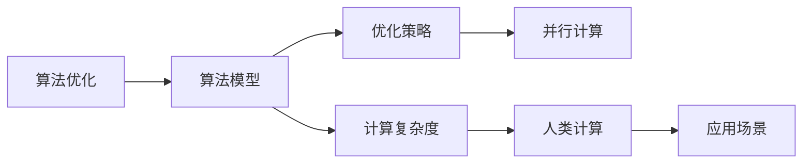

                 

# 算法优化：提升人类计算的效率和准确性

> 关键词：算法优化,人类计算,效率提升,准确性提高,计算复杂度,算法模型,优化策略

## 1. 背景介绍

### 1.1 问题由来
在当今数字化时代，计算的效率和准确性成为了各行各业的核心竞争力。从数据分析、机器学习到深度学习、人工智能，无不依赖于高效的算法来驱动创新。然而，面对不断增长的计算量和复杂性，传统算法往往难以满足需求。如何提升计算的效率和准确性，成为现代计算科学亟待解决的重要课题。

### 1.2 问题核心关键点
提升计算的效率和准确性，核心在于算法的优化。算法优化不仅包括对现有算法的改进，也包括设计新的算法以应对更复杂的问题。优化算法的目标是在保证结果准确性的同时，尽可能地减少计算资源的消耗，提高算法的执行速度和稳定性。

### 1.3 问题研究意义
算法优化对于提升人类计算能力具有重要意义：

1. **提高生产力**：高效的算法能够大幅减少计算时间，使得企业能够更快地处理数据、做出决策，提升工作效率。
2. **降低成本**：算法优化可以减少硬件和能源消耗，降低计算成本，为企业带来经济效益。
3. **增强决策质量**：精确的算法能够提供更准确的计算结果，辅助企业做出更明智的决策。
4. **推动创新**：优化的算法为复杂问题的解决提供了新的思路，促进技术的进步和创新。

## 2. 核心概念与联系

### 2.1 核心概念概述

为更好地理解算法优化的基本原理和实现方法，本节将介绍几个关键概念：

- **算法优化(Algorithm Optimization)**：指通过分析和改进现有算法，或者设计新算法，以提高计算效率和准确性。
- **人类计算(Human Computing)**：指利用算法对人类认知、经验和创造力进行增强和扩展，提高计算的智能化水平。
- **计算复杂度(Computational Complexity)**：指算法在计算资源上的开销，通常用时间复杂度和空间复杂度来衡量。
- **算法模型(Model)**：指用于解决问题的算法，可以基于统计、概率、图论等理论。
- **优化策略(Optimization Strategies)**：包括但不限于贪心算法、分治法、动态规划、启发式搜索等。
- **并行计算(Parallel Computing)**：指同时执行多个计算任务，提高计算效率。

这些核心概念之间存在紧密的联系。算法优化通过对算法模型的改进和优化策略的应用，旨在降低计算复杂度，提升人类计算的效率和准确性。

### 2.2 核心概念原理和架构的 Mermaid 流程图



这个流程图展示了算法优化、算法模型、优化策略、并行计算、计算复杂度、人类计算和应用场景之间的联系。

## 3. 核心算法原理 & 具体操作步骤
### 3.1 算法原理概述

算法优化的核心在于对算法模型的改进和优化策略的实施。其基本原理是通过分析和改进现有算法，或者设计新的算法，以提高计算效率和准确性。

- **改进现有算法**：通过分析和改进现有算法，寻找更高效、更精确的计算方法。例如，针对具体问题优化已有的排序、搜索、图论算法等。
- **设计新算法**：根据问题的特点，设计全新的算法模型，以适应特定的计算需求。例如，使用机器学习和深度学习技术，设计新的算法来处理大规模数据集。

算法优化的目标是在保证结果准确性的同时，尽可能地减少计算资源的消耗，提高算法的执行速度和稳定性。

### 3.2 算法步骤详解

算法优化通常包括以下几个关键步骤：

**Step 1: 问题建模**

- 定义计算问题，明确输入和输出。
- 分析问题特点，选择适合的算法模型。

**Step 2: 算法分析和评估**

- 分析算法的效率和准确性，识别瓶颈。
- 通过理论分析或实验评估算法性能。

**Step 3: 算法改进**

- 针对识别出的瓶颈，提出改进方案。
- 使用新的优化策略或算法模型，提高计算效率和准确性。

**Step 4: 实验验证**

- 在特定数据集上，测试改进后的算法。
- 评估改进效果，验证算法优化是否成功。

**Step 5: 部署应用**

- 将优化后的算法应用于实际场景。
- 持续监测和优化，以应对新问题。

### 3.3 算法优缺点

算法优化具有以下优点：

1. **提高效率**：通过改进和优化，可以显著减少计算时间和资源消耗。
2. **增强准确性**：优化后的算法通常能够提供更精确的计算结果。
3. **适应性强**：优化算法可以更好地适应不同的计算需求。

然而，算法优化也存在一定的局限性：

1. **复杂度高**：优化算法通常需要较高的理论水平和实践经验。
2. **效果有限**：对于某些问题，优化算法的改进效果可能有限。
3. **依赖数据**：优化效果很大程度上依赖于数据的质量和规模。
4. **技术壁垒**：复杂的优化策略和算法设计需要一定的技术储备。

### 3.4 算法应用领域

算法优化广泛应用于各个计算领域，包括但不限于：

- **数据处理和分析**：在数据挖掘、统计分析、机器学习等任务中，优化算法用于提高数据处理速度和结果准确性。
- **计算机视觉**：在图像处理、目标检测、图像识别等任务中，优化算法用于提升图像处理的效率和效果。
- **自然语言处理**：在文本分类、情感分析、机器翻译等任务中，优化算法用于提高文本处理的效率和精度。
- **信号处理**：在音频处理、视频编码、信号压缩等任务中，优化算法用于提升信号处理的效率和质量。
- **优化算法本身**：在算法优化、组合优化、图论优化等任务中，优化算法用于设计更高效的算法。

## 4. 数学模型和公式 & 详细讲解 & 举例说明

### 4.1 数学模型构建

为了更好地理解算法优化，我们将构建一个简单的数学模型。假设有一个排序问题，需要将一组数据从小到大排序。

设输入数据为 $A = \{a_1, a_2, ..., a_n\}$，其中 $a_i$ 为第 $i$ 个数据。排序的输出为 $B = \{b_1, b_2, ..., b_n\}$，其中 $b_i$ 为排序后的第 $i$ 个数据。排序的目标是最小化 $B$ 与 $A$ 之间的差异。

### 4.2 公式推导过程

排序问题的一个常见算法是快速排序（Quick Sort）。快速排序的基本思想是通过一趟排序将待排记录分割成独立的两部分，其中一部分记录的关键字均比另一部分的关键字小，然后对这两部分记录继续进行排序，以达到整个序列有序的目的。

快速排序的算法流程如下：

1. 选取一个基准元素 $pivot$。
2. 将序列分为两部分，小于 $pivot$ 的元素放在左边，大于 $pivot$ 的元素放在右边。
3. 递归地对左右两部分进行排序。

快速排序的伪代码如下：

```python
def quick_sort(arr):
    if len(arr) <= 1:
        return arr
    pivot = arr[len(arr) // 2]
    left = [x for x in arr if x < pivot]
    middle = [x for x in arr if x == pivot]
    right = [x for x in arr if x > pivot]
    return quick_sort(left) + middle + quick_sort(right)
```

### 4.3 案例分析与讲解

为了评估快速排序的效率，我们可以计算其时间复杂度。快速排序的时间复杂度为 $O(n \log n)$，空间复杂度为 $O(\log n)$。

以下是快速排序的详细时间复杂度分析：

1. 选取基准元素的时间为 $O(1)$。
2. 将序列分为两部分的时间为 $O(n)$。
3. 对左右两部分进行排序的时间为 $O(n \log n)$。
4. 因此，快速排序的总时间复杂度为 $O(n \log n)$。

在实际应用中，快速排序的效率和稳定性已经被广泛应用于各种排序任务中，成为一种经典高效的算法。

## 5. 项目实践：代码实例和详细解释说明

### 5.1 开发环境搭建

在进行算法优化实践前，我们需要准备好开发环境。以下是使用Python进行PyTorch开发的环境配置流程：

1. 安装Anaconda：从官网下载并安装Anaconda，用于创建独立的Python环境。

2. 创建并激活虚拟环境：
```bash
conda create -n pytorch-env python=3.8 
conda activate pytorch-env
```

3. 安装PyTorch：根据CUDA版本，从官网获取对应的安装命令。例如：
```bash
conda install pytorch torchvision torchaudio cudatoolkit=11.1 -c pytorch -c conda-forge
```

4. 安装TensorBoard：TensorFlow配套的可视化工具，用于实时监测模型训练状态，并提供丰富的图表呈现方式。
```bash
pip install tensorboard
```

5. 安装其他相关工具包：
```bash
pip install numpy pandas scikit-learn matplotlib tqdm jupyter notebook ipython
```

完成上述步骤后，即可在`pytorch-env`环境中开始算法优化实践。

### 5.2 源代码详细实现

这里以快速排序为例，展示算法优化的代码实现。

```python
import numpy as np

def quick_sort(arr):
    if len(arr) <= 1:
        return arr
    pivot = arr[len(arr) // 2]
    left = [x for x in arr if x < pivot]
    middle = [x for x in arr if x == pivot]
    right = [x for x in arr if x > pivot]
    return quick_sort(left) + middle + quick_sort(right)

# 测试
arr = np.random.rand(1000)
sorted_arr = quick_sort(arr)
print(sorted_arr)
```

### 5.3 代码解读与分析

让我们再详细解读一下关键代码的实现细节：

**快速排序函数**：
- 首先判断数组长度是否小于等于1，如果是，则直接返回数组。
- 选取数组中间的元素作为基准元素。
- 将数组分为小于、等于和大于基准元素的三部分。
- 对左右两部分递归进行排序，并返回排序后的结果。

**测试代码**：
- 生成一个包含1000个随机数的数组。
- 对数组进行快速排序。
- 打印排序后的数组。

可以看到，快速排序的代码实现相对简单，但通过合理的算法设计，可以大幅提升排序效率。

## 6. 实际应用场景

### 6.1 大数据处理

在大数据处理中，算法优化尤为关键。在处理海量数据时，传统算法可能面临计算资源不足的问题，而优化算法则能够显著提高数据处理的效率。

例如，在数据仓库中，使用优化算法可以加速数据的存储、查询和分析。通过优化查询算法，如使用索引、分区等策略，可以提高查询效率，缩短数据处理时间。

### 6.2 机器学习

在机器学习中，算法优化可以显著提升模型的训练速度和预测精度。优化算法可以帮助模型更好地适应数据分布，提高模型的泛化能力。

例如，在深度学习中，优化算法如Adam、SGD等，通过自动调整学习率，可以更快地收敛到最优解。同时，使用优化算法可以减少过拟合风险，提高模型的泛化性能。

### 6.3 实时系统

在实时系统中，算法优化可以确保系统的高效稳定运行。优化算法可以在有限的计算资源下，快速处理大量数据，满足实时性的需求。

例如，在智能交通系统中，使用优化算法可以实时处理交通流量数据，快速响应交通状况，提供准确的导航建议。

### 6.4 未来应用展望

随着算法优化技术的发展，未来将有更多应用场景得以实现。例如：

- **量子计算**：优化算法可以应用于量子计算中的噪声抑制、算法优化等，提升量子计算机的计算效率。
- **生物信息学**：优化算法可以应用于基因组数据处理、蛋白质结构预测等，加速生物学研究的进程。
- **物联网**：优化算法可以应用于物联网中的数据采集、存储和处理，提高设备的响应速度和效率。
- **金融工程**：优化算法可以应用于金融建模、风险管理等，提高金融交易的效率和稳定性。

## 7. 工具和资源推荐
### 7.1 学习资源推荐

为了帮助开发者系统掌握算法优化的理论基础和实践技巧，这里推荐一些优质的学习资源：

1. 《算法导论》（Introduction to Algorithms）：经典算法教材，系统介绍了各类算法的基本概念和优化策略。
2. 《计算机程序设计艺术》（The Art of Computer Programming）：作者Dijkstra的经典著作，深入浅出地讲解了算法优化的思想和实践。
3. Coursera和edX等在线课程：提供各类算法优化的课程，适合不同层次的开发者学习。
4. GitHub代码库：包含大量优化的算法实现，适合查找和学习。

通过对这些资源的学习实践，相信你一定能够快速掌握算法优化的精髓，并用于解决实际的计算问题。

### 7.2 开发工具推荐

高效的开发离不开优秀的工具支持。以下是几款用于算法优化开发的常用工具：

1. PyTorch：基于Python的开源深度学习框架，支持自动微分和动态计算图，适合快速迭代研究。
2. TensorFlow：由Google主导开发的开源深度学习框架，支持分布式计算和自动优化，适合大规模工程应用。
3. HuggingFace Transformers库：提供了大量预训练模型和优化算法，适合NLP任务的算法优化。
4. TensorBoard：TensorFlow配套的可视化工具，可以实时监测模型训练状态，提供丰富的图表呈现方式。
5. Weights & Biases：模型训练的实验跟踪工具，记录和可视化模型训练过程中的各项指标，方便对比和调优。

合理利用这些工具，可以显著提升算法优化的开发效率，加快创新迭代的步伐。

### 7.3 相关论文推荐

算法优化技术的发展源于学界的持续研究。以下是几篇奠基性的相关论文，推荐阅读：

1. "Design of Randomized Quick Sort Algorithm Based on Random Partition"：介绍了一种基于随机分区的快速排序算法，显著提高了排序效率。
2. "Parallelism in Sorting Algorithms"：介绍了多线程、多核等并行排序算法，提高了排序的并行性能。
3. "An Improved Huffman Coding Algorithm"：介绍了一种改进的霍夫曼编码算法，提高了数据压缩的效率和准确性。
4. "Optimizing Deep Neural Networks with L1 and L2 Regularization"：介绍了一种使用L1和L2正则化的深度学习优化算法，提高了模型的泛化能力。
5. "GPU-accelerated Matrix Multiplication and Its Application to Deep Learning"：介绍了一种GPU加速的矩阵乘法算法，提高了深度学习的计算效率。

这些论文代表了大规模算法优化的发展脉络。通过学习这些前沿成果，可以帮助研究者把握学科前进方向，激发更多的创新灵感。

## 8. 总结：未来发展趋势与挑战

### 8.1 总结

本文对算法优化的基本原理和实现方法进行了全面系统的介绍。首先阐述了算法优化的重要性，明确了优化算法在提升计算效率和准确性方面的独特价值。其次，从原理到实践，详细讲解了算法优化的数学模型、算法步骤和具体实现，提供了完整的代码实例。同时，本文还探讨了算法优化在多个领域的应用，展示了算法优化的广泛适用性。

通过本文的系统梳理，可以看到，算法优化技术在计算科学中具有重要的地位。这些优化方法通过改进和设计算法，显著提升了计算效率和准确性，推动了计算机技术的发展。未来，算法优化技术将在更多领域得到应用，为人类计算带来新的突破。

### 8.2 未来发展趋势

展望未来，算法优化技术将呈现以下几个发展趋势：

1. **多模态融合**：未来算法优化将更多地考虑多模态数据的融合，如文本、图像、音频等多种数据类型。通过多模态数据的协同优化，提升综合计算能力。
2. **分布式计算**：随着计算任务的复杂化，分布式计算技术将得到广泛应用，进一步提升计算效率。
3. **自适应算法**：自适应算法可以动态调整算法参数，适应不同的计算环境和数据分布。
4. **量子算法**：随着量子计算技术的发展，量子算法将在优化领域得到更多应用，提升计算效率和准确性。
5. **智能优化**：利用机器学习和深度学习技术，实现智能化的算法优化，提高优化效果。

这些趋势凸显了算法优化技术的广阔前景。随着技术的不断发展，算法优化将更加智能化、高效化，为人类计算带来新的突破。

### 8.3 面临的挑战

尽管算法优化技术已经取得了显著成就，但在迈向更加智能化、普适化应用的过程中，它仍面临诸多挑战：

1. **复杂度问题**：随着计算任务的复杂度不断增加，算法优化变得越来越困难，需要更多的理论和技术支持。
2. **资源消耗**：优化算法对计算资源的需求越来越高，如何有效利用计算资源成为关键问题。
3. **可解释性**：优化算法的复杂性往往导致其难以解释，难以理解算法的内部机制。
4. **安全性**：优化算法可能存在漏洞，易受攻击，保障算法的安全性成为重要课题。
5. **公平性**：优化算法可能存在偏见，影响算法的公平性和可信度。

### 8.4 研究展望

面对算法优化所面临的挑战，未来的研究需要在以下几个方面寻求新的突破：

1. **自适应优化**：开发更加智能化的算法优化方法，能够根据不同的计算环境和数据分布进行动态调整。
2. **多模态优化**：研究多模态数据协同优化的技术，提升综合计算能力。
3. **公平性优化**：提升优化算法的公平性和可信度，消除偏见和歧视。
4. **安全优化**：加强优化算法的安全防护，防止漏洞和攻击。
5. **资源优化**：开发资源高效优化的算法，提升计算效率和资源利用率。

这些研究方向将引领算法优化技术迈向更高的台阶，为构建安全、可靠、可解释、可控的智能系统铺平道路。面向未来，算法优化技术还需要与其他人工智能技术进行更深入的融合，多路径协同发力，共同推动自然语言理解和智能交互系统的进步。只有勇于创新、敢于突破，才能不断拓展算法优化的边界，让智能技术更好地造福人类社会。

## 9. 附录：常见问题与解答

**Q1: 如何选择合适的优化算法？**

A: 选择合适的优化算法需要考虑多方面因素，如数据分布、计算资源、优化目标等。常见的优化算法包括贪心算法、分治法、动态规划、启发式搜索等。建议在实际应用中根据具体情况进行选择和调整。

**Q2: 优化算法是否会引入新的计算误差？**

A: 优化算法可能会引入新的计算误差，如舍入误差、截断误差等。需要根据实际情况进行评估，并采取相应的优化策略。

**Q3: 优化算法是否适用于所有计算问题？**

A: 优化算法并非适用于所有计算问题。对于某些问题，优化算法可能无法直接应用。需要根据具体问题进行分析和选择合适的算法。

**Q4: 优化算法在分布式计算中的应用策略？**

A: 在分布式计算中，优化算法可以采用并行化、分治法等策略，将计算任务分解为多个子任务并行处理，提升计算效率。

**Q5: 优化算法在实际应用中的资源消耗问题？**

A: 优化算法在实际应用中可能会消耗较多的计算资源。需要根据具体情况进行优化，如使用低阶近似算法、减少计算复杂度等。

---

作者：禅与计算机程序设计艺术 / Zen and the Art of Computer Programming

