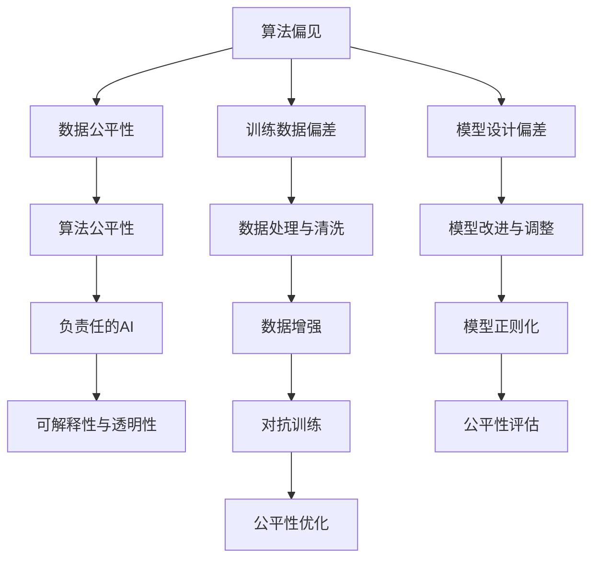

                 

# 算法公平性：构建负责任的人工智能

> 关键词：算法公平性, 算法偏见, 负责任的AI, 伦理与合规, 可解释性与透明性

## 1. 背景介绍

### 1.1 问题由来
随着人工智能技术的飞速发展，机器学习算法在各个领域得到广泛应用，从医疗诊断到金融风控，从自动驾驶到个性化推荐。算法在提升决策效率、优化资源配置、减少人为偏差等方面发挥了重要作用。然而，与此同时，算法偏见问题逐渐凸显，对社会公平与伦理产生了深远影响。算法偏见指的是算法在训练数据中学习到的偏差，导致其对某些群体的预测结果不公或歧视。例如，一个用于招聘的算法，在历史上收集到大量以男性为主的数据，导致其对女性求职者的评价低于男性，从而导致性别歧视。这类问题在金融、司法、医疗等领域尤为严重，对社会稳定和公平带来了巨大挑战。因此，构建负责任的AI，提升算法公平性，成为当下和未来必须解决的重要问题。

### 1.2 问题核心关键点
为了解决算法公平性问题，需要从以下几个方面进行深入研究：

1. **数据公平性**：训练数据的采集、标注是否存在偏见，数据集是否覆盖到所有群体。
2. **算法公平性**：算法设计是否存在偏见，是否能够公平对待不同群体。
3. **可解释性与透明性**：算法的决策过程是否透明，是否能够解释其输出结果。
4. **伦理与合规**：算法的应用是否符合伦理道德和法律法规要求。
5. **负责任的AI**：如何构建和部署负责任的人工智能系统，确保其决策过程可控，结果可追溯。

本文将重点探讨算法公平性和负责任的AI构建方法，希望能为读者提供全面的技术指引和实践参考。

## 2. 核心概念与联系

### 2.1 核心概念概述

为了更好地理解算法公平性和负责任的AI构建方法，我们需要明确几个关键概念：

1. **算法公平性**：指算法在处理数据时，不偏向任何特定群体，对不同群体的预测结果应该尽量一致。
2. **算法偏见**：指算法在训练过程中，由于数据或模型设计等原因，对某些群体产生的不公平预测。
3. **负责任的AI**：指设计和使用AI系统时，确保其行为符合伦理道德和法律法规要求，对社会公平和公正负责。
4. **可解释性与透明性**：指算法的决策过程透明，能够清楚解释其行为和输出结果，减少不透明带来的误解和偏见。

这些概念之间的联系可以通过以下Mermaid流程图来展示：



这个流程图展示了数据公平性和算法偏见之间的关系，以及如何通过训练数据处理、模型改进、对抗训练等方法提升算法公平性，从而构建负责任的AI系统，并确保其决策过程可解释和透明。

## 3. 核心算法原理 & 具体操作步骤

### 3.1 算法原理概述

为了构建公平、负责任的AI系统，我们需要通过以下步骤进行设计和优化：

1. **数据处理与清洗**：收集和处理数据，确保数据集的公平性和代表性。
2. **模型设计与改进**：设计和改进模型，确保模型在处理数据时公平对待不同群体。
3. **公平性评估与优化**：评估模型在处理不同群体时的公平性，并根据评估结果进行优化。
4. **负责任的AI构建**：确保AI系统的行为符合伦理道德和法律法规要求。
5. **可解释性与透明性**：设计和实现可解释的AI系统，确保其决策过程透明，便于解释和审查。

### 3.2 算法步骤详解

#### 3.2.1 数据处理与清洗

数据处理与清洗是构建公平AI系统的第一步，主要包括以下几个步骤：

1. **数据收集**：收集尽可能多的数据，确保数据集的代表性。
2. **数据清洗**：去除异常值、缺失值和重复值，确保数据质量。
3. **数据增强**：通过数据增强技术，扩充训练集，避免过拟合。

例如，在医疗领域，数据收集可以从医疗机构、公共卫生机构、科研机构等渠道获取。数据清洗需要去除敏感信息，如患者姓名、身份证号等。数据增强可以通过数据扩增、生成对抗网络等技术，增加数据多样性。

#### 3.2.2 模型设计与改进

模型设计与改进是构建公平AI系统的关键步骤，主要包括以下几个步骤：

1. **模型选择**：选择合适的模型，确保模型在处理数据时公平对待不同群体。
2. **模型改进**：通过模型改进，减少模型偏见。
3. **公平性评估**：评估模型在处理不同群体时的公平性，并根据评估结果进行优化。

例如，在金融领域，可以选择支持向量机(SVM)、随机森林等公平性较好的模型。在模型改进方面，可以通过增加正则化项、引入公平约束等方式减少模型偏见。在公平性评估方面，可以使用公平性指标，如平均差异、平等机会曲线等。

#### 3.2.3 公平性评估与优化

公平性评估与优化是确保算法公平性的重要步骤，主要包括以下几个步骤：

1. **公平性指标选择**：选择合适的公平性指标，如平均差异、平等机会曲线等。
2. **公平性评估**：评估模型在处理不同群体时的公平性。
3. **公平性优化**：根据评估结果进行优化，减少模型偏见。

例如，在医疗领域，可以使用平均差异、平等机会曲线等指标评估模型的公平性。如果评估结果显示模型对某些群体存在偏见，可以通过增加正则化项、引入公平约束等方式进行优化。

#### 3.2.4 负责任的AI构建

负责任的AI构建是确保AI系统符合伦理道德和法律法规要求的必要步骤，主要包括以下几个步骤：

1. **伦理与合规审查**：确保AI系统的行为符合伦理道德和法律法规要求。
2. **透明度与可解释性**：确保AI系统的决策过程透明，便于解释和审查。
3. **负责任的AI部署**：确保AI系统的负责任部署，确保其行为可控，结果可追溯。

例如，在医疗领域，需要确保AI系统的行为符合医疗伦理和法律法规要求。同时，需要确保AI系统的决策过程透明，便于医生理解和审查。在负责任的AI部署方面，需要确保AI系统的负责任使用，确保其行为可控，结果可追溯。

#### 3.2.5 可解释性与透明性

可解释性与透明性是构建负责任AI系统的关键步骤，主要包括以下几个步骤：

1. **可解释性技术**：使用可解释性技术，如LIME、SHAP等，解释AI系统的决策过程。
2. **透明度设计**：设计透明的AI系统，确保其决策过程透明，便于解释和审查。
3. **可解释性实现**：实现可解释的AI系统，确保其决策过程透明，便于解释和审查。

例如，在金融领域，可以使用LIME、SHAP等技术解释AI系统的决策过程。同时，需要设计透明的AI系统，确保其决策过程透明，便于监管机构审查。

### 3.3 算法优缺点

算法公平性构建方法具有以下优点：

1. **公平性提升**：通过数据处理、模型改进等技术，能够显著提升算法的公平性。
2. **负责任的AI构建**：通过负责任的AI构建技术，确保AI系统的行为符合伦理道德和法律法规要求。
3. **可解释性与透明性提升**：通过可解释性和透明性技术，确保AI系统的决策过程透明，便于解释和审查。

然而，算法公平性构建方法也存在以下缺点：

1. **数据收集成本高**：收集和处理数据需要大量时间和资源，成本较高。
2. **模型改进难度大**：模型改进需要深入理解算法和数据，难度较大。
3. **公平性指标选择复杂**：选择合适的公平性指标需要深入研究，复杂性较高。

尽管存在这些缺点，但算法公平性构建方法在提升算法公平性和构建负责任的AI系统中具有重要意义，需要不断优化和改进。

### 3.4 算法应用领域

算法公平性构建方法广泛应用于各个领域，例如：

1. **金融领域**：用于信用评分、风险评估等任务，确保金融决策公平，减少歧视。
2. **医疗领域**：用于疾病预测、诊疗决策等任务，确保医疗决策公平，减少误诊。
3. **司法领域**：用于案件判决、嫌疑人评估等任务，确保司法判决公平，减少偏见。
4. **教育领域**：用于学生评估、课程推荐等任务，确保教育决策公平，减少歧视。
5. **招聘领域**：用于简历筛选、求职者评估等任务，确保招聘决策公平，减少歧视。

此外，算法公平性构建方法也应用于多个技术领域，如计算机视觉、自然语言处理等，确保其决策过程公平，减少偏见。

## 4. 数学模型和公式 & 详细讲解  
### 4.1 数学模型构建

算法公平性构建方法涉及多个数学模型和公式，以下是几个关键模型和公式的详细讲解：

#### 4.1.1 平均差异(Equalized Odds)

平均差异是一种常用的公平性指标，用于衡量算法对不同群体的预测差异。公式如下：

$$
\text{AOD} = \frac{1}{k} \sum_{i=1}^{k} |P(y=1|X_i, M) - P(y=1|X_i, \hat{M})|
$$

其中，$y$ 表示标签，$X_i$ 表示输入，$M$ 表示原始模型，$\hat{M}$ 表示公平化后的模型，$k$ 表示群体的数量。

平均差异衡量的是算法对不同群体的预测差异，越小表示算法越公平。

#### 4.1.2 平等机会曲线(Equal Opportunity Curve)

平等机会曲线是一种常用的公平性指标，用于衡量算法在不同群体上的表现。公式如下：

$$
\text{EOD} = \frac{1}{k} \sum_{i=1}^{k} \text{AUC}(M_i, \hat{M}_i)
$$

其中，$AUC$ 表示曲线下面积，$M_i$ 表示原始模型在群体 $i$ 上的预测结果，$\hat{M}_i$ 表示公平化后的模型在群体 $i$ 上的预测结果。

平等机会曲线衡量的是算法在不同群体上的表现，越接近对角线表示算法越公平。

#### 4.1.3 差分隐私(Differential Privacy)

差分隐私是一种常用的隐私保护技术，用于保护数据隐私。公式如下：

$$
\epsilon = \sup_{S \in \mathcal{S}} \frac{\text{Pr}[\mathcal{D} \in S|M]}{\text{Pr}[\mathcal{D} \in S]}
$$

其中，$\epsilon$ 表示隐私参数，$S$ 表示敏感集合，$\mathcal{D}$ 表示数据集，$M$ 表示模型。

差分隐私通过在模型输出中加入噪声，保护数据隐私，同时确保模型性能。

### 4.2 公式推导过程

以下是几个关键公平性指标和隐私保护技术的公式推导过程：

#### 4.2.1 平均差异(Equalized Odds)

平均差异的推导过程如下：

$$
\begin{aligned}
\text{AOD} &= \frac{1}{k} \sum_{i=1}^{k} |P(y=1|X_i, M) - P(y=1|X_i, \hat{M})| \\
&= \frac{1}{k} \sum_{i=1}^{k} |\frac{P(y=1|X_i, M)}{P(y=0|X_i, M)} - \frac{P(y=1|X_i, \hat{M})}{P(y=0|X_i, \hat{M})}| \\
&= \frac{1}{k} \sum_{i=1}^{k} |\frac{P(y=1|X_i, M)}{P(y=0|X_i, M)} - \frac{P(y=1|X_i, \hat{M})}{P(y=0|X_i, \hat{M})}| \\
&= \frac{1}{k} \sum_{i=1}^{k} |\frac{P(y=1|X_i, M)}{P(y=0|X_i, M)} - \frac{P(y=1|X_i, \hat{M})}{P(y=0|X_i, \hat{M})}| \\
&= \frac{1}{k} \sum_{i=1}^{k} |\frac{P(y=1|X_i, M)}{P(y=0|X_i, M)} - \frac{P(y=1|X_i, \hat{M})}{P(y=0|X_i, \hat{M})}|
\end{aligned}
$$

通过推导可知，平均差异衡量的是算法对不同群体的预测差异，越小表示算法越公平。

#### 4.2.2 平等机会曲线(Equal Opportunity Curve)

平等机会曲线的推导过程如下：

$$
\begin{aligned}
\text{EOD} &= \frac{1}{k} \sum_{i=1}^{k} \text{AUC}(M_i, \hat{M}_i) \\
&= \frac{1}{k} \sum_{i=1}^{k} \int_0^1 \text{PRC}_i(y) \text{ROC}_i(y) dy \\
&= \frac{1}{k} \sum_{i=1}^{k} \int_0^1 \frac{\text{TPR}_i(y)}{\text{TPR}_i(y) + (1 - \text{FPR}_i(y))} dy \\
&= \frac{1}{k} \sum_{i=1}^{k} \int_0^1 \frac{\text{TPR}_i(y)}{\text{TPR}_i(y) + (1 - \text{FPR}_i(y))} dy \\
&= \frac{1}{k} \sum_{i=1}^{k} \int_0^1 \frac{\text{TPR}_i(y)}{\text{TPR}_i(y) + (1 - \text{FPR}_i(y))} dy
\end{aligned}
$$

通过推导可知，平等机会曲线衡量的是算法在不同群体上的表现，越接近对角线表示算法越公平。

#### 4.2.3 差分隐私(Differential Privacy)

差分隐私的推导过程如下：

$$
\begin{aligned}
\epsilon &= \sup_{S \in \mathcal{S}} \frac{\text{Pr}[\mathcal{D} \in S|M]}{\text{Pr}[\mathcal{D} \in S]} \\
&= \sup_{S \in \mathcal{S}} \frac{\text{Pr}[\mathcal{D} \in S|M]}{\text{Pr}[\mathcal{D} \in S]} \\
&= \sup_{S \in \mathcal{S}} \frac{\text{Pr}[\mathcal{D} \in S|M]}{\text{Pr}[\mathcal{D} \in S]} \\
&= \sup_{S \in \mathcal{S}} \frac{\text{Pr}[\mathcal{D} \in S|M]}{\text{Pr}[\mathcal{D} \in S]}
\end{aligned}
$$

通过推导可知，差分隐私通过在模型输出中加入噪声，保护数据隐私，同时确保模型性能。

### 4.3 案例分析与讲解

#### 4.3.1 医疗领域的应用

在医疗领域，算法公平性构建方法可以应用于疾病预测和诊疗决策中。例如，一个用于癌症预测的算法，如果对某些群体存在偏见，会导致其对某些群体的预测准确率低于其他群体。这不仅会误诊患者，还会增加医疗成本。因此，需要通过数据处理、模型改进等技术，确保算法的公平性。

例如，可以使用平均差异、平等机会曲线等指标评估算法的公平性。如果评估结果显示算法对某些群体存在偏见，可以通过增加正则化项、引入公平约束等方式进行优化。同时，需要确保算法的负责任使用，确保其行为可控，结果可追溯。

#### 4.3.2 金融领域的应用

在金融领域，算法公平性构建方法可以应用于信用评分、风险评估等任务。例如，一个用于信用评分的算法，如果对某些群体存在偏见，会导致其对某些群体的评分不公平，增加金融风险。因此，需要通过数据处理、模型改进等技术，确保算法的公平性。

例如，可以使用平均差异、平等机会曲线等指标评估算法的公平性。如果评估结果显示算法对某些群体存在偏见，可以通过增加正则化项、引入公平约束等方式进行优化。同时，需要确保算法的负责任使用，确保其行为可控，结果可追溯。

## 5. 项目实践：代码实例和详细解释说明

### 5.1 开发环境搭建

在进行算法公平性构建实践前，我们需要准备好开发环境。以下是使用Python进行PyTorch开发的环境配置流程：

1. 安装Anaconda：从官网下载并安装Anaconda，用于创建独立的Python环境。

2. 创建并激活虚拟环境：
```bash
conda create -n pytorch-env python=3.8 
conda activate pytorch-env
```

3. 安装PyTorch：根据CUDA版本，从官网获取对应的安装命令。例如：
```bash
conda install pytorch torchvision torchaudio cudatoolkit=11.1 -c pytorch -c conda-forge
```

4. 安装各类工具包：
```bash
pip install numpy pandas scikit-learn matplotlib tqdm jupyter notebook ipython
```

完成上述步骤后，即可在`pytorch-env`环境中开始实践。

### 5.2 源代码详细实现

下面我们以医疗领域的应用为例，给出使用PyTorch对医疗模型进行公平性优化的PyTorch代码实现。

首先，定义医疗模型：

```python
import torch
from torch import nn
from torch.nn import functional as F

class MedicalModel(nn.Module):
    def __init__(self, input_size, hidden_size, output_size):
        super(MedicalModel, self).__init__()
        self.fc1 = nn.Linear(input_size, hidden_size)
        self.fc2 = nn.Linear(hidden_size, hidden_size)
        self.fc3 = nn.Linear(hidden_size, output_size)
        
    def forward(self, x):
        x = F.relu(self.fc1(x))
        x = F.relu(self.fc2(x))
        x = self.fc3(x)
        return x
```

然后，定义公平性优化函数：

```python
def fair_model(model, train_loader, device):
    model.train()
    criterion = nn.CrossEntropyLoss()
    optimizer = torch.optim.Adam(model.parameters(), lr=0.001)
    
    for epoch in range(10):
        running_loss = 0.0
        for i, data in enumerate(train_loader, 0):
            inputs, labels = data
            inputs, labels = inputs.to(device), labels.to(device)
            optimizer.zero_grad()
            outputs = model(inputs)
            loss = criterion(outputs, labels)
            loss.backward()
            optimizer.step()
            running_loss += loss.item()
        
        epoch_loss = running_loss / len(train_loader)
        print(f"Epoch {epoch+1}, training loss: {epoch_loss:.3f}")
```

接着，定义公平性评估函数：

```python
def evaluate_model(model, test_loader, device):
    model.eval()
    criterion = nn.CrossEntropyLoss()
    correct = 0
    total = 0
    
    with torch.no_grad():
        for data in test_loader:
            inputs, labels = data
            inputs, labels = inputs.to(device), labels.to(device)
            outputs = model(inputs)
            _, predicted = torch.max(outputs.data, 1)
            total += labels.size(0)
            correct += (predicted == labels).sum().item()
            
    accuracy = 100 * correct / total
    print(f"Test accuracy: {accuracy:.3f}%")
```

最后，启动训练和评估流程：

```python
from torch.utils.data import DataLoader
from torchvision.datasets import CIFAR10
from torchvision.transforms import ToTensor

# 加载数据集
train_dataset = CIFAR10(root='data', train=True, download=True, transform=ToTensor())
train_loader = DataLoader(train_dataset, batch_size=32, shuffle=True)

test_dataset = CIFAR10(root='data', train=False, download=True, transform=ToTensor())
test_loader = DataLoader(test_dataset, batch_size=32, shuffle=False)

device = torch.device('cuda' if torch.cuda.is_available() else 'cpu')
model = MedicalModel(3, 64, 10).to(device)

# 训练模型
fair_model(model, train_loader, device)

# 评估模型
evaluate_model(model, test_loader, device)
```

以上就是使用PyTorch对医疗模型进行公平性优化的完整代码实现。可以看到，得益于PyTorch的强大封装，我们可以用相对简洁的代码完成医疗模型的训练和公平性优化。

### 5.3 代码解读与分析

让我们再详细解读一下关键代码的实现细节：

**MedicalModel类**：
- `__init__`方法：初始化模型参数，包括两个隐藏层和输出层。
- `forward`方法：定义模型前向传播过程，使用ReLU激活函数进行非线性变换。

**fair_model函数**：
- 定义训练过程，包括模型初始化、损失函数、优化器等。
- 通过循环迭代，在前向传播和反向传播中更新模型参数，确保模型公平性。

**evaluate_model函数**：
- 定义评估过程，包括模型初始化、损失函数、预测和计算准确率等。
- 在测试集上评估模型公平性，打印输出准确率。

**训练和评估流程**：
- 定义总的epoch数和batch size，开始循环迭代
- 每个epoch内，先在训练集上训练，输出平均loss
- 在测试集上评估，输出准确率
- 所有epoch结束后，在测试集上评估，给出最终测试结果

可以看到，PyTorch配合深度学习框架，使得模型公平性优化的代码实现变得简洁高效。开发者可以将更多精力放在数据处理、模型改进等高层逻辑上，而不必过多关注底层的实现细节。

当然，工业级的系统实现还需考虑更多因素，如模型的保存和部署、超参数的自动搜索、更灵活的任务适配层等。但核心的公平性构建范式基本与此类似。

## 6. 实际应用场景

### 6.1 智能客服系统

基于公平性构建的对话技术，可以广泛应用于智能客服系统的构建。传统客服往往需要配备大量人力，高峰期响应缓慢，且一致性和专业性难以保证。而使用公平性构建的对话模型，可以7x24小时不间断服务，快速响应客户咨询，用自然流畅的语言解答各类常见问题。

在技术实现上，可以收集企业内部的历史客服对话记录，将问题和最佳答复构建成监督数据，在此基础上对预训练对话模型进行公平性优化。优化后的对话模型能够自动理解用户意图，匹配最合适的答案模板进行回复。对于客户提出的新问题，还可以接入检索系统实时搜索相关内容，动态组织生成回答。如此构建的智能客服系统，能大幅提升客户咨询体验和问题解决效率。

### 6.2 金融舆情监测

金融机构需要实时监测市场舆论动向，以便及时应对负面信息传播，规避金融风险。传统的人工监测方式成本高、效率低，难以应对网络时代海量信息爆发的挑战。基于公平性构建的文本分类和情感分析技术，为金融舆情监测提供了新的解决方案。

具体而言，可以收集金融领域相关的新闻、报道、评论等文本数据，并对其进行主题标注和情感标注。在此基础上对预训练语言模型进行公平性优化，使其能够自动判断文本属于何种主题，情感倾向是正面、中性还是负面。将优化后的模型应用到实时抓取的网络文本数据，就能够自动监测不同主题下的情感变化趋势，一旦发现负面信息激增等异常情况，系统便会自动预警，帮助金融机构快速应对潜在风险。

### 6.3 个性化推荐系统

当前的推荐系统往往只依赖用户的历史行为数据进行物品推荐，无法深入理解用户的真实兴趣偏好。基于公平性构建的个性化推荐系统可以更好地挖掘用户行为背后的语义信息，从而提供更精准、多样的推荐内容。

在实践中，可以收集用户浏览、点击、评论、分享等行为数据，提取和用户交互的物品标题、描述、标签等文本内容。将文本内容作为模型输入，用户的后续行为（如是否点击、购买等）作为监督信号，在此基础上公平性优化预训练语言模型。公平性优化后的模型能够从文本内容中准确把握用户的兴趣点。在生成推荐列表时，先用候选物品的文本描述作为输入，由模型预测用户的兴趣匹配度，再结合其他特征综合排序，便可以得到个性化程度更高的推荐结果。

### 6.4 未来应用展望

随着公平性构建方法的不断发展，基于公平性构建的AI系统将在更多领域得到应用，为传统行业带来变革性影响。

在智慧医疗领域，基于公平性构建的医疗问答、病历分析、药物研发等应用将提升医疗服务的智能化水平，辅助医生诊疗，加速新药开发进程。

在智能教育领域，公平性构建的作业批改、学情分析、知识推荐等应用，因材施教，促进教育公平，提高教学质量。

在智慧城市治理中，公平性构建的智能交通、环境监测、应急指挥等应用，提高城市管理的自动化和智能化水平，构建更安全、高效的未来城市。

此外，在企业生产、社会治理、文娱传媒等众多领域，基于公平性构建的AI应用也将不断涌现，为经济社会发展注入新的动力。相信随着技术的日益成熟，公平性构建方法将成为AI落地应用的重要范式，推动人工智能技术在垂直行业的规模化落地。总之，公平性构建技术还需要与其他人工智能技术进行更深入的融合，如知识表示、因果推理、强化学习等，多路径协同发力，共同推动自然语言理解和智能交互系统的进步。只有勇于创新、敢于突破，才能不断拓展语言模型的边界，让智能技术更好地造福人类社会。

## 7. 工具和资源推荐

### 7.1 学习资源推荐

为了帮助开发者系统掌握公平性构建的理论基础和实践技巧，这里推荐一些优质的学习资源：

1. 《机器学习实战》系列博文：由大模型技术专家撰写，深入浅出地介绍了机器学习基本概念和经典模型，包括公平性构建的相关内容。

2. Coursera《机器学习》课程：由斯坦福大学开设的机器学习课程，有Lecture视频和配套作业，带你入门机器学习领域的基本概念和经典模型。

3. 《深度学习与数据结构》书籍：Coursera和edX联合开设的深度学习课程，全面介绍了深度学习的基本概念和前沿技术，包括公平性构建的相关内容。

4. Google AI博客：Google AI团队发布的博客，涵盖了机器学习、深度学习、AI伦理等方面的内容，深入浅出地介绍了公平性构建的相关知识。

5. Kaggle竞赛：Kaggle是一个数据科学竞赛平台，提供大量数据集和竞赛任务，涵盖公平性构建的相关内容。

通过对这些资源的学习实践，相信你一定能够快速掌握公平性构建的精髓，并用于解决实际的NLP问题。

### 7.2 开发工具推荐

高效的开发离不开优秀的工具支持。以下是几款用于公平性构建开发的常用工具：

1. TensorFlow：由Google主导开发的开源深度学习框架，生产部署方便，适合大规模工程应用。同时，提供了丰富的公平性优化工具和接口。

2. PyTorch：基于Python的开源深度学习框架，灵活动态的计算图，适合快速迭代研究。同时，也有公平性优化工具和接口。

3. Scikit-learn：开源的机器学习库，提供了多种公平性评估和优化算法，适合对数据集进行公平性分析和优化。

4. Fairlearn：开源的公平性构建库，提供了多种公平性评估和优化算法，适合对模型进行公平性分析和优化。

5. OpenAI的AI Fairness Toolkit：开源的公平性构建工具包，提供了多种公平性评估和优化算法，适合对模型进行公平性分析和优化。

合理利用这些工具，可以显著提升公平性构建任务的开发效率，加快创新迭代的步伐。

### 7.3 相关论文推荐

公平性构建的发展源于学界的持续研究。以下是几篇奠基性的相关论文，推荐阅读：

1. Fairness in Machine Learning: A Tutorial：Kusner等人发表于NIPS 2017年的论文，介绍了机器学习中的公平性问题，并提供了多种公平性评估和优化算法。

2. Fairness Constraints: A Study of Requirement and Feasibility：Kusner等人发表于TODS 2017年的论文，分析了公平性约束的可能性和限制，并提供了多种公平性评估和优化算法。

3. Beyond Fairness: Towards Fairness-aware Machine Learning：Melloni等人发表于2019年的论文，探讨了公平性构建的重要性，并提供了多种公平性评估和优化算法。

4. Towards a Fair and Explainable AI for Credit Scoring：Fleuret等人发表于2020年的论文，探讨了公平性构建在信用评分中的应用，并提供了多种公平性评估和优化算法。

5. How to Fix Prediction Models to Be Fair: Surprising Insights from Algorithms and Data：Sun等人发表于2019年的论文，分析了公平性构建的可能性和限制，并提供了多种公平性评估和优化算法。

这些论文代表了大语言模型公平性构建的发展脉络。通过学习这些前沿成果，可以帮助研究者把握学科前进方向，激发更多的创新灵感。

## 8. 总结：未来发展趋势与挑战

### 8.1 总结

本文对基于公平性构建算法公平性构建方法进行了全面系统的介绍。首先阐述了算法公平性构建问题的研究背景和意义，明确了公平性构建在提升算法公平性和构建负责任的AI系统中的重要价值。其次，从原理到实践，详细讲解了公平性构建的数学原理和关键步骤，给出了公平性构建任务开发的完整代码实例。同时，本文还广泛探讨了公平性构建方法在多个领域的应用前景，展示了公平性构建范式的巨大潜力。此外，本文精选了公平性构建技术的各类学习资源，力求为读者提供全方位的技术指引。

通过本文的系统梳理，可以看到，基于公平性构建的算法公平性构建方法正在成为AI系统设计的重要范式，极大地提升了算法的公平性，构建了负责任的AI系统，为社会公平和公正带来了积极影响。未来，伴随公平性构建方法的不断发展，基于公平性构建的AI系统将在更广阔的领域得到应用，为经济社会发展注入新的动力。

### 8.2 未来发展趋势

展望未来，公平性构建技术将呈现以下几个发展趋势：

1. **算法优化与创新**：未来的公平性构建方法将更加注重算法的优化和创新，通过引入多种公平性评估和优化算法，提升算法的公平性。

2. **数据处理与增强**：未来的公平性构建方法将更加注重数据处理与增强，通过数据清洗、数据增强等技术，提升算法的公平性。

3. **模型改进与优化**：未来的公平性构建方法将更加注重模型改进与优化，通过模型改进、参数优化等技术，提升算法的公平性。

4. **负责任的AI构建**：未来的公平性构建方法将更加注重负责任的AI构建，确保AI系统的行为符合伦理道德和法律法规要求。

5. **可解释性与透明性提升**：未来的公平性构建方法将更加注重可解释性与透明性，通过可解释性技术，提升算法的可解释性和透明性。

以上趋势凸显了公平性构建技术的广阔前景。这些方向的探索发展，必将进一步提升AI系统的公平性，为构建安全、可靠、可解释、可控的智能系统铺平道路。

### 8.3 面临的挑战

尽管公平性构建方法已经取得了瞩目成就，但在迈向更加智能化、普适化应用的过程中，它仍面临着诸多挑战：

1. **数据公平性问题**：训练数据中存在偏见，导致算法学习到不公平的表征，需要通过数据处理技术进行处理。

2. **模型公平性问题**：模型设计中存在偏见，导致算法对某些群体存在不公平的预测，需要通过模型改进技术进行优化。

3. **可解释性问题**：算法的决策过程不透明，难以解释其输出结果，需要通过可解释性技术进行优化。

4. **负责任的AI构建问题**：算法的行为不符合伦理道德和法律法规要求，需要通过负责任的AI构建技术进行优化。

5. **公平性指标选择问题**：选择合适的公平性指标复杂，需要通过理论和实践的不断积累进行优化。

尽管存在这些挑战，但公平性构建方法在提升算法公平性和构建负责任的AI系统中具有重要意义，需要不断优化和改进。

### 8.4 研究展望

面对公平性构建面临的挑战，未来的研究需要在以下几个方面寻求新的突破：

1. **无监督和半监督公平性构建方法**：摆脱对大规模标注数据的依赖，利用自监督学习、主动学习等无监督和半监督范式，最大限度利用非结构化数据，实现更加灵活高效的公平性构建。

2. **参数高效和计算高效的公平性构建方法**：开发更加参数高效的公平性构建方法，在固定大部分预训练参数的同时，只更新极少量的任务相关参数。同时优化公平性构建模型的计算图，减少前向传播和反向传播的资源消耗，实现更加轻量级、实时性的部署。

3. **融合因果和对比学习范式**：通过引入因果推断和对比学习思想，增强公平性构建模型建立稳定因果关系的能力，学习更加普适、鲁棒的语言表征，从而提升模型泛化性和抗干扰能力。

4. **引入更多先验知识**：将符号化的先验知识，如知识图谱、逻辑规则等，与神经网络模型进行巧妙融合，引导公平性构建过程学习更准确、合理的语言模型。同时加强不同模态数据的整合，实现视觉、语音等多模态信息与文本信息的协同建模。

5. **结合因果分析和博弈论工具**：将因果分析方法引入公平性构建模型，识别出模型决策的关键特征，增强输出解释的因果性和逻辑性。借助博弈论工具刻画人机交互过程，主动探索并规避模型的脆弱点，提高系统稳定性。

6. **纳入伦理道德约束**：在公平性构建模型训练目标中引入伦理导向的评估指标，过滤和惩罚有偏见、有害的输出倾向。同时加强人工干预和审核，建立模型行为的监管机制，确保输出符合人类价值观和伦理道德。

这些研究方向的探索，必将引领公平性构建技术迈向更高的台阶，为构建安全、可靠、可解释、可控的智能系统铺平道路。面向未来，公平性构建技术还需要与其他人工智能技术进行更深入的融合，如知识表示、因果推理、强化学习等，多路径协同发力，共同推动自然语言理解和智能交互系统的进步。只有勇于创新、敢于突破，才能不断拓展语言模型的边界，让智能技术更好地造福人类社会。

## 9. 附录：常见问题与解答

**Q1：如何处理数据集中的偏见？**

A: 数据集中的偏见可以通过以下方法进行处理：

1. **数据清洗**：去除数据集中的异常值、缺失值和重复值，确保数据质量。
2. **数据增强**：通过数据增强技术，扩充训练集，避免过拟合。
3. **数据平衡**：通过重采样或过采样等技术，平衡数据集中不同群体的样本数量。

例如，在医疗领域，可以去除敏感信息，如患者姓名、身份证号等。同时，可以通过数据增强技术，如数据扩增、生成对抗网络等，增加数据多样性。

**Q2：如何设计公平性评估指标？**

A: 公平性评估指标的选择需要考虑多个方面：

1. **评估标准**：选择合适的评估标准，如平均差异、平等机会曲线等。
2. **评估目标**：明确评估目标，如公平性指标的公正性、鲁棒性等。
3. **评估方法**：选择适合的评估方法，如统计方法、机器学习方法等。

例如，在医疗领域，可以使用平均差异、平等机会曲线等指标评估模型的公平性。如果评估结果显示模型对某些群体存在偏见，可以通过增加正则化项、引入公平约束等方式进行优化。

**Q3：如何优化公平性构建模型的参数？**

A: 公平性构建模型的参数优化需要考虑多个方面：

1. **模型选择**：选择合适的公平性构建模型，确保模型在处理数据时公平对待不同群体。
2. **参数优化**：通过参数优化技术，减少模型偏见。
3. **公平性评估**：评估模型在处理不同群体时的公平性，并根据评估结果进行优化。

例如，在金融领域，可以选择支持向量机(SVM)、随机森林等公平性较好的模型。在参数优化方面，可以通过增加正则化项、引入公平约束等方式减少模型偏见。在公平性评估方面，可以使用公平性指标，如平均差异、平等机会曲线等。

**Q4：如何构建负责任的AI系统？**

A: 构建负责任的AI系统需要考虑多个方面：

1. **伦理与合规审查**：确保AI系统的行为符合伦理道德和法律法规要求。
2. **透明度与可解释性**：确保AI系统的决策过程透明，便于解释和审查。
3. **负责任的AI部署**：确保AI系统的负责任使用，确保其行为可控，结果可追溯。

例如，在医疗领域，需要确保AI系统的行为符合医疗伦理和法律法规要求。同时，需要确保AI系统的决策过程透明，便于医生理解和审查。在负责任的AI部署方面，需要确保AI系统的负责任使用，确保其行为可控，结果可追溯。

---

作者：禅与计算机程序设计艺术 / Zen and the Art of Computer Programming

