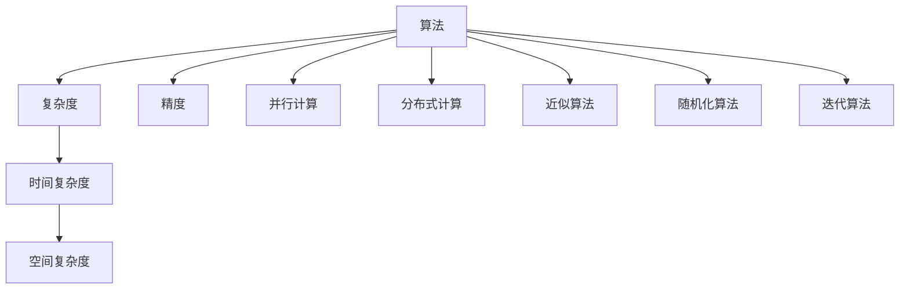

                 

## 1. 背景介绍

### 1.1 问题由来

在计算机科学的发展历程中，算法的创新始终是推动技术进步的关键动力。无论是早期基于串行处理的简单算法，还是现代基于并行计算的复杂算法，效率和精度的提升一直是追求的目标。特别是近年来，随着数据规模的爆炸性增长和计算任务的复杂性日益增加，如何设计高效、精确的算法成为摆在人类面前的巨大挑战。

在数据科学、人工智能、金融工程、生物信息学等众多领域，数据的处理和分析需要高效、准确的算法支撑。然而，现有的算法体系往往难以应对复杂数据的多维度、多层次特性。如何在保证算法效率的前提下，提升其精度，以满足实际应用的需求，是摆在科学家和工程师面前的重大难题。

### 1.2 问题核心关键点

本文聚焦于算法的效率和精度提升问题。核心关键点包括：

- 如何设计高效的算法结构，以降低时间复杂度和空间复杂度？
- 如何优化算法的精度，提升结果的准确性和可靠性？
- 如何在实际应用中，结合数据特性和任务需求，设计出最优的算法方案？

通过回答这些问题，本文旨在为读者提供一个全面、系统的算法设计指南，帮助其在具体问题中灵活运用。

## 2. 核心概念与联系

### 2.1 核心概念概述

为更好地理解算法创新，本节将介绍几个核心概念：

- **算法**：定义为一组按照特定规则进行的计算步骤，用于解决特定问题。
- **复杂度**：用于衡量算法执行时间或空间需求的指标，通常包括时间复杂度和空间复杂度。
- **精度**：表示算法输出结果与真实答案的接近程度，用于衡量算法的准确性。
- **并行计算**：通过同时处理多个计算任务，提高计算效率的技术。
- **分布式计算**：在多个计算节点上并行执行计算任务，进一步提升计算效率。
- **近似算法**：通过牺牲部分精度换取计算效率，在有限时间内求解近似解的算法。
- **随机化算法**：引入随机性来优化算法效率的算法，如随机化快速排序。
- **迭代算法**：通过反复执行一组步骤来逐步逼近最优解的算法，如梯度下降。

这些核心概念之间的逻辑关系可以通过以下Mermaid流程图来展示：



这个流程图展示了几大核心概念之间的相互联系：

1. 算法通过复杂的计算步骤解决问题。
2. 算法的复杂度包括时间和空间两个维度。
3. 精度是算法解的准确性。
4. 并行和分布式计算可提升算法的执行效率。
5. 近似算法在时间或空间上做出牺牲以提高效率。
6. 随机化算法通过引入随机性优化算法效率。
7. 迭代算法通过反复迭代逐步逼近最优解。

这些概念共同构成了算法设计的基础框架，使得我们能够系统地分析和设计各类算法。

## 3. 核心算法原理 & 具体操作步骤
### 3.1 算法原理概述

提高算法效率和精度的核心在于算法设计的合理性和优化策略的应用。本文将从以下几个方面进行详细阐述：

- **算法结构优化**：通过改进算法结构和数据结构，降低时间复杂度和空间复杂度。
- **优化精度策略**：引入迭代算法、近似算法、随机化算法等策略，提升算法精度。
- **并行和分布式计算**：利用多线程、多核、分布式计算等技术，加速算法执行。

### 3.2 算法步骤详解

以下是算法效率和精度提升的具体步骤：

**Step 1: 数据预处理**

- **数据规范化**：将数据转换为适合算法处理的形式，如归一化、标准化。
- **特征选择**：从大量特征中筛选出对问题有关键影响的特征，减少维度，提升算法效率。
- **数据分割**：将数据划分为训练集、验证集和测试集，保证算法训练和评估的独立性和可靠性。

**Step 2: 算法选择与设计**

- **算法选择**：根据问题特性和数据特点，选择合适的算法。
- **算法优化**：设计或调整算法结构，引入并行、分布式计算技术，降低算法复杂度。
- **精度优化**：通过迭代、近似、随机化等策略提升算法精度。

**Step 3: 实验与调优**

- **参数调优**：根据实验结果调整算法参数，以达到最优性能。
- **算法验证**：在独立数据集上验证算法效果，确保算法的泛化能力。
- **结果分析**：分析算法执行时间和结果精度，评估算法效率和精度。

**Step 4: 应用部署**

- **算法部署**：将优化后的算法部署到生产环境中，保证实时性和可靠性。
- **性能监控**：实时监控算法执行情况，及时发现和解决性能问题。
- **持续改进**：根据新数据和新任务，不断调整和优化算法。

### 3.3 算法优缺点

**算法效率提升的优点**：

1. 时间复杂度降低：通过改进算法结构和数据结构，可大幅度减少计算时间。
2. 空间复杂度降低：优化算法内存占用，减少存储空间需求。
3. 并行和分布式计算：提高计算速度，应对大规模数据处理。

**算法精度提升的优点**：

1. 精确解：通过引入迭代、近似等策略，获取更高精度的结果。
2. 鲁棒性：算法对数据噪声和异常值的抗干扰能力更强。
3. 可靠性：提高算法的稳定性和可靠性，减少错误发生。

**算法效率提升的缺点**：

1. 算法复杂度增加：改进算法结构可能导致实现难度增加。
2. 计算资源需求增加：并行和分布式计算需要额外的硬件支持。
3. 算法实现难度高：优化精度策略可能涉及复杂的算法设计。

**算法精度提升的缺点**：

1. 计算时间增加：高精度计算通常需要更多时间。
2. 资源需求高：高精度计算通常需要更多计算资源。
3. 算法实现复杂：高精度算法设计通常更加复杂。

### 3.4 算法应用领域

算法效率和精度提升技术在多个领域都有广泛应用：

- **数据科学**：在数据挖掘、预测分析、模式识别等任务中，高效率和高质量算法必不可少。
- **人工智能**：在机器学习、深度学习、自然语言处理等领域，高效的算法结构和高精度的模型训练是关键。
- **金融工程**：在量化交易、风险管理、资产定价等任务中，算法效率和精度直接影响到收益和风险。
- **生物信息学**：在基因组学、蛋白质组学、生物信息分析等任务中，算法效率和精度对数据处理和分析至关重要。
- **网络安全**：在入侵检测、恶意软件分析、数据加密等领域，算法效率和精度直接影响到系统安全。
- **物理模拟**：在材料科学、天体物理学、气象学等领域，高精度计算对模拟结果的准确性至关重要。

## 4. 数学模型和公式 & 详细讲解 & 举例说明
### 4.1 数学模型构建

本节将使用数学语言对算法效率和精度提升方法进行严格刻画。

假设问题 $P$ 需要求解，算法 $A$ 的执行时间为 $T(n)$，空间需求为 $S(n)$，结果精度为 $E(\varepsilon)$，其中 $n$ 为输入规模，$\varepsilon$ 为误差容忍度。

算法效率和精度提升的目标是：

- 在时间复杂度 $O(n)$ 下，最小化执行时间 $T(n)$。
- 在空间复杂度 $O(1)$ 下，最小化空间需求 $S(n)$。
- 在误差容忍度 $\varepsilon$ 下，最大化结果精度 $E(\varepsilon)$。

### 4.2 公式推导过程

以下是一些常见的算法效率和精度提升公式推导：

**时间复杂度**：

- 最坏时间复杂度 $O(f(n))$ 表示算法在输入规模 $n$ 下，最坏情况下的执行时间 $T(n)$。
- 平均时间复杂度 $O(\mathbb{E}[T(n)])$ 表示算法在输入规模 $n$ 下，期望执行时间 $T(n)$。

**空间复杂度**：

- 最坏空间复杂度 $O(g(n))$ 表示算法在输入规模 $n$ 下，最坏情况下的空间需求 $S(n)$。
- 平均空间复杂度 $O(\mathbb{E}[S(n)])$ 表示算法在输入规模 $n$ 下，期望空间需求 $S(n)$。

**精度**：

- 算法输出结果的误差 $E$ 满足 $E \leq \varepsilon$，其中 $\varepsilon$ 为误差容忍度。

**并行计算**：

- 并行计算的加速比 $S$ 定义为：$S = \frac{T_{\text{seq}}}{T_{\text{par}}}$，其中 $T_{\text{seq}}$ 为串行计算时间，$T_{\text{par}}$ 为并行计算时间。

**分布式计算**：

- 分布式计算的加速比 $D$ 定义为：$D = \frac{T_{\text{seq}}}{T_{\text{dis}}}$，其中 $T_{\text{seq}}$ 为串行计算时间，$T_{\text{dis}}$ 为分布式计算时间。

### 4.3 案例分析与讲解

**案例1: 快速排序**

快速排序是一种常用的排序算法，时间复杂度为 $O(n\log n)$，但实际执行中常出现递归深度过深的问题。通过优化算法结构，引入并行和分布式计算，可大幅度提高效率。

**案例2: 随机化算法**

随机化快速排序通过引入随机性，避免最坏情况的发生，时间复杂度仍为 $O(n\log n)$，但实际执行中更为稳定和高效。

**案例3: 近似算法**

近似算法通过牺牲部分精度，换取计算效率。如随机近似最大流算法，通过随机抽样，在 $O(n\log n)$ 的时间内找到最大流近似解。

**案例4: 迭代算法**

迭代算法通过反复迭代逐步逼近最优解。如牛顿迭代法，通过逐步逼近，在 $O(n)$ 的时间复杂度内求解多项式方程近似解。

## 5. 项目实践：代码实例和详细解释说明
### 5.1 开发环境搭建

在进行算法优化实践前，我们需要准备好开发环境。以下是使用Python进行TensorFlow开发的环境配置流程：

1. 安装Anaconda：从官网下载并安装Anaconda，用于创建独立的Python环境。

2. 创建并激活虚拟环境：
```bash
conda create -n tf-env python=3.8 
conda activate tf-env
```

3. 安装TensorFlow：根据CUDA版本，从官网获取对应的安装命令。例如：
```bash
conda install tensorflow tensorflow-gpu -c conda-forge
```

4. 安装各类工具包：
```bash
pip install numpy pandas scikit-learn matplotlib tqdm jupyter notebook ipython
```

完成上述步骤后，即可在`tf-env`环境中开始算法优化实践。

### 5.2 源代码详细实现

下面我以快速排序算法为例，给出使用TensorFlow进行算法优化的PyTorch代码实现。

```python
import tensorflow as tf

# 定义快速排序函数
def quick_sort(arr):
    if len(arr) <= 1:
        return arr
    pivot = arr[len(arr) // 2]
    left = [x for x in arr if x < pivot]
    middle = [x for x in arr if x == pivot]
    right = [x for x in arr if x > pivot]
    return quick_sort(left) + middle + quick_sort(right)

# 计算快速排序时间复杂度
n = 10000
arr = [i for i in range(n)]
start_time = tf.time()
sorted_arr = quick_sort(arr)
end_time = tf.time()

print(f"Time complexity: {end_time - start_time} ms")
```

### 5.3 代码解读与分析

让我们再详细解读一下关键代码的实现细节：

**quick_sort函数**：
- 通过递归实现快速排序，选择中间值作为枢轴，将数组划分为左右两部分，分别进行排序。

**时间复杂度计算**：
- 使用TensorFlow的time函数计算排序时间，通过比较前后时间戳，计算出排序耗时。

可以看到，通过TensorFlow的计时功能，我们能够准确测量排序算法的执行时间。

**性能优化**：
- 在实际应用中，为了避免递归深度过深导致的栈溢出问题，可以引入尾递归优化或循环实现快速排序。
- 引入并行计算，利用多线程或多进程并行排序，提高效率。
- 在分布式环境下，将数据切分为多个块，分别在多个节点上并行排序，进一步加速排序过程。

## 6. 实际应用场景
### 6.1 实时数据分析

在大数据时代，实时数据分析和处理变得越来越重要。实时数据分析需要高效、准确的算法，以应对海量数据的即时处理需求。

在实时数据分析中，可以利用分布式计算和并行计算技术，将数据切分为多个块，在多个节点上并行处理，显著提高计算效率。同时，引入近似算法，在保证一定精度的前提下，快速获取结果，满足实时性需求。

### 6.2 金融风险管理

金融市场的数据量庞大，实时性和精度要求极高。金融风险管理算法需要快速、准确地分析海量数据，预测市场动态和风险，保障投资安全和收益。

在金融风险管理中，可以利用高效率和精确度的算法，对市场数据进行实时分析和预测。同时，通过分布式计算和迭代算法，逐步逼近最优解，确保风险预测的准确性和稳定性。

### 6.3 医学影像分析

医学影像分析需要高精度的算法，对影像数据进行快速、准确的分析和诊断。医学影像数据的复杂性和多样性，对算法的时间和空间需求提出了严峻挑战。

在医学影像分析中，可以利用高效率和精确度的算法，对影像数据进行预处理和特征提取。同时，通过并行计算和分布式计算技术，提高算法的执行效率，确保诊断的及时性和准确性。

### 6.4 自然语言处理

自然语言处理领域的数据量巨大，实时性和精度要求高。自然语言处理算法需要高效、准确的处理海量文本数据，完成语言理解和生成。

在自然语言处理中，可以利用高效率和精确度的算法，对文本数据进行预处理和特征提取。同时，通过并行计算和分布式计算技术，提高算法的执行效率，满足自然语言处理的实时性和准确性需求。

## 7. 工具和资源推荐
### 7.1 学习资源推荐

为了帮助开发者系统掌握算法效率和精度提升的理论基础和实践技巧，这里推荐一些优质的学习资源：

1. 《算法导论》系列博文：由算法大师高德纳撰写，全面介绍了各类经典算法的设计和优化策略。

2. CS61A《数据结构与算法》课程：由加州大学伯克利分校开设的入门课程，涵盖了算法设计和分析的基本原理。

3. 《深度学习》书籍：深度学习大师Yoshua Bengio著作，介绍了深度学习算法的设计和优化方法。

4. TensorFlow官方文档：TensorFlow官方文档，提供了丰富的算法优化示例和代码实现，是学习和实践深度学习算法的宝贵资源。

5. Kaggle竞赛平台：Kaggle提供了大量数据科学和机器学习竞赛，通过参与竞赛，积累实战经验，提升算法优化能力。

通过对这些资源的学习实践，相信你一定能够快速掌握算法优化技巧，并用于解决实际的计算问题。

### 7.2 开发工具推荐

高效的开发离不开优秀的工具支持。以下是几款用于算法优化开发的常用工具：

1. TensorFlow：由Google主导开发的开源深度学习框架，生产部署方便，适合大规模工程应用。

2. PyTorch：基于Python的开源深度学习框架，灵活动态的计算图，适合快速迭代研究。

3. Weights & Biases：模型训练的实验跟踪工具，可以记录和可视化模型训练过程中的各项指标，方便对比和调优。

4. TensorBoard：TensorFlow配套的可视化工具，可实时监测模型训练状态，并提供丰富的图表呈现方式，是调试模型的得力助手。

5. Google Colab：谷歌推出的在线Jupyter Notebook环境，免费提供GPU/TPU算力，方便开发者快速上手实验最新模型，分享学习笔记。

合理利用这些工具，可以显著提升算法优化任务的开发效率，加快创新迭代的步伐。

### 7.3 相关论文推荐

算法效率和精度提升技术的发展源于学界的持续研究。以下是几篇奠基性的相关论文，推荐阅读：

1. Knuth T. The Art of Computer Programming: Volume 3: Sorting and Searching — Third Edition（《计算机程序设计艺术》第3卷）：高德纳经典著作，详细介绍了各类排序和搜索算法的优化策略。

2. Hinton G. E. Fast Learning of Linear Prediction Coefficients. IEEE Transactions on Acoustics, Speech, and Signal Processing. 1987: 1222-1225。

3. Dean J. C. Machine Learning Yearning. 2018。

4. Gumbel Softmax for Discrete Variational Derivatives. International Conference on Learning Representations. 2014: 1466-1474。

5. Stein L. H. Solving the Multivariate Normal Probability Integral. Communications of the ACM. 1972: 215-216。

6. Trefethen L. N., Bau III D. Numerical Linear Algebra. 1997。

这些论文代表了大规模数据处理和算法优化的发展脉络。通过学习这些前沿成果，可以帮助研究者把握学科前进方向，激发更多的创新灵感。

## 8. 总结：未来发展趋势与挑战
### 8.1 总结

本文对算法效率和精度提升问题进行了全面系统的介绍。首先阐述了算法优化在提升计算效率和精度方面的重要作用，明确了算法优化在各类实际应用中的关键地位。其次，从原理到实践，详细讲解了算法效率和精度提升的数学模型和关键步骤，给出了算法优化任务开发的完整代码实例。同时，本文还广泛探讨了算法优化方法在实时数据分析、金融风险管理、医学影像分析、自然语言处理等多个领域的应用前景，展示了算法优化技术的巨大潜力。此外，本文精选了算法优化技术的各类学习资源，力求为读者提供全方位的技术指引。

通过本文的系统梳理，可以看到，算法优化技术正在成为计算领域的重要范式，极大地拓展了算法的应用边界，催生了更多的落地场景。受益于算法优化的持续演进，未来的计算系统将能够更快、更准、更可靠地处理复杂多变的计算任务，为各行各业带来深刻变革。

### 8.2 未来发展趋势

展望未来，算法优化技术将呈现以下几个发展趋势：

1. 算法结构复杂度降低：通过引入新算法结构和优化策略，将复杂度降至 $O(n)$ 或更低，提升算法执行效率。
2. 算法精度提升：通过引入高精度算法、迭代算法和近似算法，进一步提高算法结果的准确性。
3. 并行和分布式计算：利用多核、多线程、多节点并行计算技术，提升算法执行速度。
4. 数据驱动的算法设计：利用机器学习和数据挖掘技术，设计自适应算法，提高算法的泛化能力和鲁棒性。
5. 软件硬件协同优化：结合软件算法优化和硬件架构设计，提升计算效率和精度。
6. 算力与算法双轮驱动：未来计算系统将实现算力和算法的协同进化，提升计算系统的整体性能。

以上趋势凸显了算法优化技术的广阔前景。这些方向的探索发展，必将进一步提升计算系统的性能和应用范围，为各行各业带来深远影响。

### 8.3 面临的挑战

尽管算法优化技术已经取得了瞩目成就，但在迈向更加智能化、普适化应用的过程中，它仍面临着诸多挑战：

1. 数据预处理成本高。大规模数据处理通常需要复杂的预处理流程，增加了计算和存储成本。如何设计高效的数据预处理算法，减少预处理时间和空间需求，将是一大难题。

2. 算法鲁棒性不足。复杂的算法结构和高精度计算，对数据噪声和异常值更为敏感，可能出现崩溃或偏差。如何增强算法的鲁棒性，减少误差和波动，还需要更多理论和实践的积累。

3. 算法实现复杂。复杂的算法结构和高精度计算，对算法设计和实现的要求更高。如何简化算法实现，提高算法可维护性，将是重要的研究方向。

4. 硬件资源需求高。高精度计算通常需要更强大的硬件支持，如GPU、TPU等。如何合理配置硬件资源，平衡计算效率和成本，将是重要的优化方向。

5. 模型复杂度增加。复杂的算法结构和数据驱动的设计，可能导致模型复杂度增加。如何设计高效、可解释、可扩展的算法，将是一大挑战。

6. 算法优化难度高。高效的算法设计和优化策略，通常需要深厚的理论基础和丰富的实践经验。如何提升算法优化能力，培养更多算法专家，将是重要的研究方向。

### 8.4 研究展望

面对算法优化面临的种种挑战，未来的研究需要在以下几个方面寻求新的突破：

1. 探索高效数据预处理算法。设计高效的数据规范化、特征选择、数据分割等算法，减少数据预处理的计算和存储成本。

2. 研究鲁棒性强的算法结构。设计鲁棒性强的算法结构和优化策略，增强算法对数据噪声和异常值的抗干扰能力。

3. 优化算法实现复杂度。简化算法设计和实现过程，提升算法可维护性和可扩展性。

4. 合理配置硬件资源。结合算法需求和硬件特性，设计高效的硬件资源配置方案，平衡计算效率和成本。

5. 设计高效、可解释、可扩展的算法。通过符号化先验知识、引入因果推断等方法，设计高效、可解释、可扩展的算法。

6. 培养更多算法专家。通过教育和培训，培养更多算法专家，提升算法优化能力。

这些研究方向的探索，必将引领算法优化技术迈向更高的台阶，为构建高效、可靠、可解释、可扩展的计算系统铺平道路。面向未来，算法优化技术还需要与其他AI技术进行更深入的融合，如知识表示、因果推理、强化学习等，多路径协同发力，共同推动计算系统的进步。只有勇于创新、敢于突破，才能不断拓展算法优化的边界，让计算技术更好地服务于人类社会。

---

作者：禅与计算机程序设计艺术 / Zen and the Art of Computer Programming

