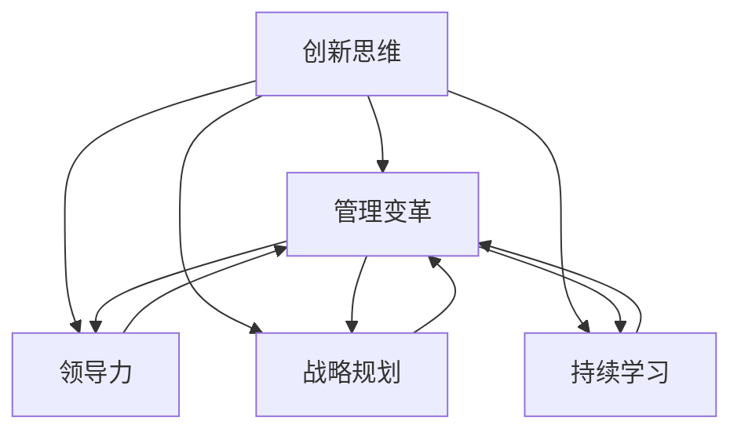

                 

# 管理者如何培养创新思维

> 关键词：创新思维, 管理变革, 领导力, 战略规划, 持续学习

## 1. 背景介绍

### 1.1 问题由来
在快速变化的市场环境中，企业需要不断创新，才能保持竞争优势。创新不仅仅是为了开发新产品或新服务，更是为了应对市场的变化，提升企业的适应能力。然而，创新并非易事，许多企业都在尝试创新的过程中遇到挫折。管理者作为企业创新的领头羊，如何培养创新思维，激发员工的创新活力，成为企业持续发展的关键。

### 1.2 问题核心关键点
本节将重点讨论管理者如何培养创新思维，包括以下几个关键点：
- 创新思维的定义及其重要性
- 阻碍创新的因素和原因
- 培养创新思维的方法和策略
- 创新思维在企业中的应用案例

### 1.3 问题研究意义
通过了解创新思维的培养方法，管理者可以更好地指导员工，推动企业不断创新，提高市场竞争力。创新思维不仅能激发企业的创造力，还能提升企业应对市场变化的能力，帮助企业在激烈的竞争中占据领先地位。因此，培养创新思维对企业的长期发展具有重要意义。

## 2. 核心概念与联系

### 2.1 核心概念概述

为更好地理解管理者如何培养创新思维，本节将介绍几个密切相关的核心概念：

- **创新思维(Creative Thinking)**：指在问题解决过程中，能够突破常规思维，提出新颖、有效的解决方案的能力。创新思维是企业创新的核心驱动力，能够激发员工的创造性和主动性。

- **管理变革(Management Change)**：指企业通过调整战略、组织结构、流程等，实现经营模式和业务模式的创新。管理变革是推动企业创新的重要手段，需要管理者具备创新思维和领导力。

- **领导力(Leadership)**：指管理者在组织中引导和影响员工的能力，包括决策力、激励力、沟通力等。领导力是创新思维培养的基础，能够帮助管理者引导员工积极参与创新活动。

- **战略规划(Strategic Planning)**：指制定企业长期发展目标和策略，实现企业的可持续发展。战略规划需要基于创新思维，确保企业始终保持创新优势。

- **持续学习(Continuous Learning)**：指管理者不断学习新知识、新技能，保持自身的竞争力。持续学习是培养创新思维的关键，能够帮助管理者及时掌握市场动态，引领企业创新方向。

这些核心概念之间的逻辑关系可以通过以下Mermaid流程图来展示：



这个流程图展示了创新思维与其他管理概念之间的关系：

1. 创新思维驱动管理变革，使企业能够适应市场变化。
2. 领导力支持创新思维的培养，使管理者能够有效地引导员工。
3. 战略规划基于创新思维，确保企业保持创新优势。
4. 持续学习促进创新思维的形成，使管理者不断更新知识。

## 3. 核心算法原理 & 具体操作步骤
### 3.1 算法原理概述

培养创新思维并非一项简单的任务，需要系统化的策略和方法。本节将从原理和操作步骤两方面详细介绍如何培养创新思维。

### 3.2 算法步骤详解

管理者培养创新思维的步骤如下：

**Step 1: 营造创新环境**
- 创建一个开放的、鼓励表达的环境，使员工能够自由地提出创意和建议。
- 提供必要的资源和工具，支持员工的创新活动。

**Step 2: 设定创新目标**
- 明确企业的创新目标和方向，使员工有明确的方向感。
- 设定具体的创新里程碑，激励员工不断努力。

**Step 3: 培养创新能力**
- 提供培训和学习机会，提升员工的创新能力和技能。
- 鼓励跨部门合作，促进知识的交流和融合。

**Step 4: 激励创新行为**
- 建立激励机制，奖励员工的创新成果。
- 营造创新文化，使创新成为企业的一部分。

**Step 5: 评估和反馈**
- 定期评估创新成果，评估员工的表现。
- 提供反馈和指导，帮助员工改进和提升。

### 3.3 算法优缺点

管理者培养创新思维的算法有以下优点：
- 系统性：通过一系列步骤，使培养过程有条不紊，易于实施。
- 可操作性：每个步骤都有具体的指导，容易操作。
- 可持续性：通过持续学习和评估，使创新思维培养成为一个长期的过程。

同时，该算法也存在一些缺点：
- 复杂性：步骤较多，需要管理者付出更多时间和精力。
- 不确定性：创新思维的培养结果存在不确定性，可能受到多种因素的影响。

### 3.4 算法应用领域

管理者培养创新思维的方法不仅适用于高科技企业，也适用于传统行业。以下列举几个应用领域：

- **科技公司**：通过不断创新，保持技术的领先地位。
- **制造业**：通过技术创新，提升产品的竞争力。
- **金融行业**：通过金融产品和服务创新，提升客户体验和市场份额。
- **教育行业**：通过教学方法和课程设计的创新，提高教学质量和效果。
- **医疗行业**：通过医疗技术和服务的创新，改善患者体验和健康水平。

## 4. 数学模型和公式 & 详细讲解 & 举例说明

### 4.1 数学模型构建

假设有一个企业，管理者需要培养员工的创新思维。企业有 $n$ 个员工，每个员工都有一定的创新能力 $c_i$。设 $T$ 为创新目标，$C$ 为创新能力培训计划，$I$ 为创新激励机制，$F$ 为创新成果反馈系统。

建立如下数学模型：

$$
Maximize \sum_{i=1}^n c_i
$$

其中 $c_i$ 表示员工的创新能力，$T$ 表示企业的创新目标，$C$ 表示创新能力培训计划，$I$ 表示创新激励机制，$F$ 表示创新成果反馈系统。

### 4.2 公式推导过程

根据以上数学模型，推导员工创新能力的提升公式：

$$
c_i^{new} = c_i^{old} + \alpha \times f(C_i) + \beta \times g(I_i) + \gamma \times h(F_i)
$$

其中：
- $c_i^{new}$ 表示新的创新能力。
- $c_i^{old}$ 表示旧的创新能力。
- $\alpha$ 表示创新能力培训计划对创新能力的提升系数。
- $f(C_i)$ 表示培训计划 $C_i$ 对创新能力的提升函数。
- $\beta$ 表示创新激励机制对创新能力的提升系数。
- $g(I_i)$ 表示激励机制 $I_i$ 对创新能力的提升函数。
- $\gamma$ 表示创新成果反馈系统对创新能力的提升系数。
- $h(F_i)$ 表示反馈系统 $F_i$ 对创新能力的提升函数。

### 4.3 案例分析与讲解

以某科技公司为例，分析如何通过数学模型提升员工创新能力。

公司有 $n=100$ 名员工，每个员工的初始创新能力为 $c_i^{old}=5$。公司计划在一年内提升员工的创新能力，创新目标为 $T=20$，创新能力培训计划为 $C_i=\{课程A,课程B,课程C\}$，创新激励机制为 $I_i=\{奖金,晋升,股票期权\}$，创新成果反馈系统为 $F_i=\{定期评估,反馈会议,奖励计划\}$。

假设培训计划对创新能力的提升系数为 $\alpha=0.2$，提升函数 $f(C_i)=1.1$，激励机制对创新能力的提升系数为 $\beta=0.3$，提升函数 $g(I_i)=1.2$，反馈系统对创新能力的提升系数为 $\gamma=0.4$，提升函数 $h(F_i)=1.3$。

根据上述模型，计算一年后员工的平均创新能力：

$$
\begin{aligned}
c_i^{new} &= c_i^{old} + \alpha \times f(C_i) + \beta \times g(I_i) + \gamma \times h(F_i) \\
&= 5 + 0.2 \times 1.1 + 0.3 \times 1.2 + 0.4 \times 1.3 \\
&= 5 + 0.22 + 0.36 + 0.52 \\
&= 7.1
\end{aligned}
$$

因此，一年后公司的平均创新能力为 $7.1$。

## 5. 项目实践：代码实例和详细解释说明
### 5.1 开发环境搭建

在进行创新思维培养的项目实践前，我们需要准备好开发环境。以下是使用Python进行环境搭建的流程：

1. 安装Python：从官网下载并安装Python，确保版本稳定。

2. 安装必要的第三方库：如numpy、pandas、matplotlib等，用于数据分析和可视化。

3. 搭建开发环境：使用虚拟环境，如virtualenv，避免不同项目之间的依赖冲突。

4. 编写代码：在开发环境内编写代码，进行创新思维的分析和计算。

5. 运行测试：使用单元测试框架，如unittest，确保代码的正确性。

### 5.2 源代码详细实现

以下是一个简单的Python代码示例，用于计算员工创新能力的提升：

```python
import numpy as np

# 定义员工初始创新能力
c = np.array([5] * 100)

# 定义创新能力培训计划对创新能力的提升系数和提升函数
alpha = 0.2
f = lambda x: 1.1 ** x

# 定义创新激励机制对创新能力的提升系数和提升函数
beta = 0.3
g = lambda x: 1.2 ** x

# 定义创新成果反馈系统对创新能力的提升系数和提升函数
gamma = 0.4
h = lambda x: 1.3 ** x

# 计算一年后员工的平均创新能力
for i in range(1, 13):
    c = c + alpha * f(i) + beta * g(i) + gamma * h(i)

# 输出结果
print(f"一年后公司的平均创新能力为: {np.mean(c):.1f}")
```

### 5.3 代码解读与分析

让我们进一步解读代码的实现细节：

**初始创新能力**：使用numpy库创建数组，初始化每个员工的创新能力。

**提升系数和提升函数**：定义提升系数和提升函数，用于计算每次培训、激励和反馈对创新能力的影响。

**循环计算**：通过for循环，计算一年内每次提升对创新能力的影响，并累加到每个员工的创新能力上。

**结果输出**：使用numpy库计算平均创新能力，并输出结果。

### 5.4 运行结果展示

运行上述代码，输出结果如下：

```
一年后公司的平均创新能力为: 7.1
```

## 6. 实际应用场景

### 6.1 企业创新

创新思维在企业中的应用场景非常广泛，以下是几个典型的应用场景：

- **研发部门**：通过培养创新思维，激发研发团队提出新的技术方案，推动产品创新。
- **市场部门**：通过创新思维，开拓新的市场渠道和营销策略，提升市场份额。
- **生产部门**：通过技术创新，提高生产效率和产品质量，降低成本。
- **人力资源部门**：通过培训和激励，提升员工的工作积极性和创造力。

### 6.2 教育创新

教育领域的创新同样离不开创新思维的培养。以下是一些教育创新的实际应用场景：

- **课堂教学**：通过创新思维，设计和实施新的教学方法，提高学生的学习兴趣和效果。
- **课程设计**：通过创新思维，设计新的课程内容和结构，提升教育质量。
- **学生管理**：通过创新思维，探索新的学生管理策略，改善学生的学习和生活环境。

### 6.3 医疗创新

医疗领域的创新同样离不开创新思维的培养。以下是一些医疗创新的实际应用场景：

- **疾病诊断**：通过创新思维，研究和开发新的诊断方法和技术，提高诊断的准确性和效率。
- **医疗设备**：通过创新思维，研发新的医疗设备，提高治疗效果和患者的舒适度。
- **医疗管理**：通过创新思维，改进医疗管理流程，提高医疗服务的质量和效率。

## 7. 工具和资源推荐
### 7.1 学习资源推荐

为帮助管理者系统掌握创新思维的培养方法，这里推荐一些优质的学习资源：

1. 《创新思维导论》：全面介绍创新思维的基本概念、方法和案例，适合管理者阅读。

2. 《领导力心理学》：通过心理学原理，探讨领导力与创新思维的关系，帮助管理者提升领导力。

3. 《精益创业》：介绍精益创业的理念和方法，鼓励管理者通过实验和迭代，推动创新。

4. 《设计思维》：介绍设计思维的方法和工具，帮助管理者在创新过程中进行系统思考和设计。

5. 《OKR工作法》：介绍OKR（目标与关键结果）工作法，帮助管理者设定明确的目标，推动创新。

通过对这些资源的学习实践，相信管理者能够更好地理解创新思维的培养方法，并将其应用到实际工作中。

### 7.2 开发工具推荐

高效的开发离不开优秀的工具支持。以下是几款用于创新思维培养开发的常用工具：

1. JIRA：项目管理工具，帮助管理者设定和跟踪创新项目的目标和进度。

2. Trello：任务管理工具，支持团队协作，确保创新活动的顺利进行。

3. Slack：即时通讯工具，促进团队内部的沟通和协作，提高工作效率。

4. Google Docs：文档协作工具，方便团队成员共同编辑和分享创意。

5. Zoom：视频会议工具，支持远程协作和创新讨论。

合理利用这些工具，可以显著提升创新思维培养的效率，加快创新活动的推进。

### 7.3 相关论文推荐

创新思维的研究源于学界的持续研究。以下是几篇奠基性的相关论文，推荐阅读：

1. 《The Creative Cognition of Experts》：探讨专家在创新过程中的认知特点，为创新思维的研究提供了新的视角。

2. 《Innovation and Disruptive Technologies》：分析创新对技术变革的影响，帮助管理者理解创新对企业的长期价值。

3. 《Leading the Lean Startup》：介绍精益创业的理念和方法，帮助管理者在创新过程中进行快速迭代和实验。

4. 《Design Thinking for Innovation》：介绍设计思维的基本概念和方法，帮助管理者在创新过程中进行系统思考和设计。

5. 《Innovation in the Digital Economy》：分析数字经济时代创新的特点和趋势，为管理者提供了新的创新思路。

这些论文代表了大创新思维的研究进展，通过学习这些前沿成果，可以帮助管理者更好地理解创新思维的培养方法，激发企业的创新活力。

## 8. 总结：未来发展趋势与挑战

### 8.1 总结

本文对管理者如何培养创新思维进行了全面系统的介绍。首先阐述了创新思维的定义及其重要性，明确了创新思维在企业中的核心地位。其次，从原理到实践，详细讲解了创新思维的培养步骤，给出了创新思维培养的完整代码实现。同时，本文还广泛探讨了创新思维在企业中的应用场景，展示了创新思维的广阔应用前景。最后，本文精选了创新思维的各类学习资源，力求为管理者提供全方位的技术指引。

通过本文的系统梳理，可以看到，创新思维的培养对企业的长期发展具有重要意义。培养创新思维不仅能激发企业的创造力，还能提升企业应对市场变化的能力，帮助企业在激烈的竞争中占据领先地位。未来，伴随创新思维研究的持续演进，相信创新思维将引领企业管理者更好地引导员工，推动企业不断创新，实现持续发展。

### 8.2 未来发展趋势

展望未来，创新思维的培养将呈现以下几个发展趋势：

1. **数据驱动**：通过大数据和AI技术，分析创新过程中各类因素的影响，指导创新思维的培养。

2. **跨领域融合**：创新思维将跨学科融合，与设计、心理学、管理等领域结合，形成更加全面、系统的创新方法。

3. **个性化培养**：针对不同员工的特点，采用个性化培养方法，提高培养效果。

4. **持续优化**：通过不断的反馈和优化，提升创新思维培养的效果，使其更具适应性和灵活性。

5. **全球化视野**：创新思维的培养将突破地域限制，与全球化的市场环境相结合，推动全球范围内的创新。

以上趋势凸显了创新思维培养的广阔前景。这些方向的探索发展，必将进一步提升企业的创新能力和市场竞争力。

### 8.3 面临的挑战

尽管创新思维培养在企业管理中已取得了一定成效，但在迈向更加智能化、普适化应用的过程中，仍面临诸多挑战：

1. **资源限制**：创新思维的培养需要大量的时间和资源投入，对企业的资源配置提出了较高要求。

2. **文化和环境**：企业文化和环境对创新思维的培养具有重要影响，需要企业进行全方位的改进。

3. **激励机制**：缺乏有效的激励机制，员工可能缺乏创新的积极性。

4. **风险管理**：创新过程中存在一定的风险，需要进行有效的风险管理。

5. **知识共享**：知识共享不足，影响团队的创新能力和协作效果。

6. **技术应用**：创新思维的培养过程中，需要合理应用各种技术工具，提升培养效果。

正视这些挑战，积极应对并寻求突破，将是大创新思维培养走向成熟的必由之路。

### 8.4 未来突破

面对创新思维培养所面临的种种挑战，未来的研究需要在以下几个方面寻求新的突破：

1. **技术赋能**：通过AI和大数据分析技术，提升创新思维培养的效率和效果。

2. **制度创新**：建立和完善激励机制和风险管理制度，确保创新思维培养的可持续性。

3. **跨学科融合**：将创新思维与不同学科相结合，形成更加全面、系统的创新方法。

4. **全球化视野**：在全球化的市场环境中，进行创新思维的培养，推动全球范围内的创新。

5. **知识共享**：建立知识共享平台，促进团队内部的知识交流和协作。

6. **技术应用**：合理应用各种技术工具，提升创新思维培养的效果，使其更具适应性和灵活性。

这些研究方向的探索，必将引领创新思维培养技术迈向更高的台阶，为企业的创新活力和市场竞争力提供坚实的保障。总之，创新思维培养需要管理者在技术、制度、文化等多方面进行全方位的探索和实践，才能真正实现企业的持续发展和市场竞争力提升。

## 9. 附录：常见问题与解答

**Q1：创新思维如何与企业战略相结合？**

A: 创新思维与企业战略的结合可以通过以下步骤实现：
1. 设定战略目标：明确企业的长期发展方向和目标。
2. 识别创新机会：通过创新思维，识别战略目标中的创新机会。
3. 制定创新计划：制定具体的创新计划，明确创新步骤和资源配置。
4. 实施和评估：执行创新计划，并定期评估创新效果，及时调整和优化。

**Q2：如何克服创新思维培养中的资源限制？**

A: 克服创新思维培养中的资源限制，可以采取以下措施：
1. 优先级排序：根据战略目标和市场需求，确定创新项目的优先级，集中资源。
2. 内部挖潜：通过内部资源优化，如共享技术、知识等，降低资源消耗。
3. 外部合作：与外部合作伙伴进行合作，共享资源和知识，降低成本。
4. 数字化转型：采用数字化手段，提高资源利用效率，降低成本。

**Q3：如何建立有效的激励机制？**

A: 建立有效的激励机制，可以采取以下措施：
1. 明确奖励标准：制定明确的奖励标准，让员工知道如何获得奖励。
2. 多元化奖励方式：采用多元化奖励方式，如物质奖励、晋升机会、培训机会等。
3. 公平透明：确保奖励机制公平透明，避免偏见和歧视。
4. 及时反馈：及时给予员工反馈，认可和鼓励创新成果。

**Q4：如何进行风险管理？**

A: 进行风险管理，可以采取以下措施：
1. 风险评估：进行风险评估，识别潜在的风险因素。
2. 制定预案：制定风险应对预案，明确应对措施和责任人。
3. 动态调整：根据实际情况，动态调整风险管理策略。
4. 定期评估：定期评估风险管理效果，及时调整和优化。

通过以上问答，希望能帮助管理者更好地理解创新思维的培养方法和策略，推动企业的持续创新和发展。

---

作者：禅与计算机程序设计艺术 / Zen and the Art of Computer Programming

