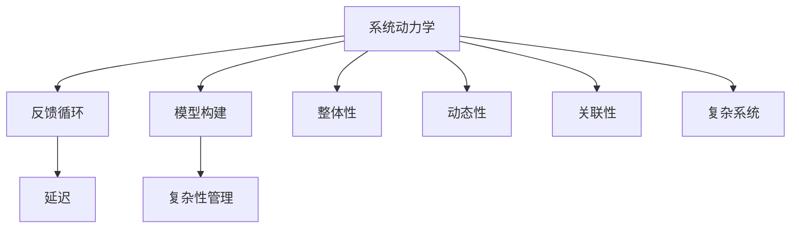

                 

# 系统思考:化繁为简的法宝

> 关键词：系统思考, 化繁为简, 复杂性管理, 系统动力学, 模型构建, 案例分析, 实践指南

## 1. 背景介绍

在当今快速变化的商业和技术环境中，系统思考已成为一种重要的管理工具。通过系统思考，我们可以更好地理解和解决复杂系统中的问题，从而做出更明智的决策。然而，在实际应用中，许多人对系统思考的基本概念和实践方法仍然存在误解，导致难以发挥其应有的效用。本文旨在为读者提供一个全面的系统思考指南，帮助他们更好地理解和应用系统思考，化繁为简，提升决策效率和效果。

## 2. 核心概念与联系

### 2.1 核心概念概述

系统思考是一种整体性、动态性和关联性的思维方式，旨在理解和解决复杂系统中的问题。它强调系统的相互作用、相互依赖和长期影响，而非单一事件或局部的分析。以下是系统思考的核心概念：

- **系统动力学**：研究系统行为随时间变化的规律，理解系统的动态特性。
- **反馈循环**：系统内部信息循环的过程，影响系统行为。
- **延迟**：行动与结果之间的时间差，影响系统反应的及时性。
- **模型构建**：通过建立系统模型，模拟和预测系统行为。
- **复杂性管理**：识别、理解和控制系统中的复杂性因素，提升系统效能。

这些核心概念构成了系统思考的基础框架，帮助我们从整体上理解和解决系统问题。

### 2.2 核心概念原理和架构的 Mermaid 流程图



这个流程图展示了系统思考的核心概念之间的联系：

1. 系统动力学：研究系统的动态特性，理解系统行为随时间的变化规律。
2. 反馈循环：系统内部信息循环的过程，影响系统行为。
3. 延迟：行动与结果之间的时间差，影响系统反应的及时性。
4. 模型构建：通过建立系统模型，模拟和预测系统行为。
5. 复杂性管理：识别、理解和控制系统中的复杂性因素，提升系统效能。
6. 整体性、动态性和关联性：系统思考的三个核心属性，确保我们对系统有全面、动态和关联的理解。
7. 复杂系统：系统思考的最终应用目标，通过理解和解决复杂系统中的问题，提升系统效能。

## 3. 核心算法原理 & 具体操作步骤

### 3.1 算法原理概述

系统思考的核心算法原理在于构建系统模型，通过模拟和预测系统行为，理解系统内部的相互作用和反馈循环。模型构建是系统思考中最重要的步骤之一，它帮助我们从整体上理解系统，识别关键变量和反馈循环，预测系统行为，并提出解决方案。

### 3.2 算法步骤详解

系统思考的模型构建通常包括以下步骤：

1. **系统定义**：明确系统的边界，识别系统中的关键变量和子系统。
2. **数据收集**：收集相关数据，包括历史数据、实时数据等。
3. **模型建立**：使用系统动力学方程或其他模型工具，建立系统模型。
4. **模型验证**：通过历史数据验证模型的准确性，并进行调整。
5. **预测和控制**：使用模型进行预测和模拟，提出控制策略，优化系统行为。

### 3.3 算法优缺点

系统思考的优点在于其整体性和动态性，能够帮助我们从全局视角理解系统，识别关键因素和反馈循环，提出更全面和长期的解决方案。然而，系统思考也存在一些局限：

- **复杂性高**：系统思考需要建立复杂的模型，对模型构建和验证要求较高。
- **数据依赖**：系统思考高度依赖于数据的质量和完整性，数据不足或数据质量问题会影响模型的准确性。
- **预测难度大**：系统中的不确定性和非线性特性，使得预测系统行为具有较高的难度。

### 3.4 算法应用领域

系统思考广泛应用于多个领域，包括：

- **企业管理**：通过理解企业内部和外部的相互作用，提升组织效率和绩效。
- **项目管理**：在项目管理中，系统思考帮助识别关键路径、资源分配和风险管理。
- **生态系统**：研究生态系统中的物种相互作用、资源流动和环境变化，提出保护和管理的策略。
- **社会系统**：研究社会系统中的人际关系、文化影响和政策变化，提升社会治理效率。
- **技术系统**：研究技术系统中的创新、扩散和变革过程，推动技术发展。

## 4. 数学模型和公式 & 详细讲解 & 举例说明

### 4.1 数学模型构建

系统思考的数学模型通常包括系统动力学方程、状态空间模型、模拟仿真模型等。以一个简单的生态系统为例，我们可以建立如下的系统动力学方程：

$$
\frac{dP}{dt} = rP(1 - \frac{P}{K}) - \frac{aPb}{C + dN}
$$

其中，$P$ 表示物种数量，$r$ 表示生长率，$K$ 表示环境承载力，$a$、$b$、$c$、$d$ 为模型参数。

### 4.2 公式推导过程

通过上述方程，我们可以推导出物种数量的变化规律，理解系统的动态特性。例如，当物种数量接近环境承载力$K$时，增长率$r$会逐渐减小，最终达到平衡状态。

### 4.3 案例分析与讲解

假设一个湖泊中的藻类数量，受到光、营养物质、温度等多种因素的影响。我们可以建立如下的系统动力学方程：

$$
\frac{dC}{dt} = rC(1 - \frac{C}{K}) - \frac{aCP}{K_1 + \frac{P}{P_0}}
$$

其中，$C$ 表示藻类数量，$r$ 表示生长率，$K$ 表示环境承载力，$a$、$b$、$c$、$d$ 为模型参数。通过这个模型，我们可以预测不同环境下藻类的增长规律，从而提出相应的管理和控制策略。

## 5. 项目实践：代码实例和详细解释说明

### 5.1 开发环境搭建

在系统思考的实践过程中，我们通常使用Python和相关的系统动力学软件（如Vensim、AnyLogic等）进行模型构建和仿真。以下是一个基本的Python环境搭建过程：

1. 安装Anaconda：
```bash
wget https://repo.anaconda.com/miniconda/Miniconda3-py37_4.12.0_Linux-x86_64.sh -O miniconda.sh
bash miniconda.sh
```

2. 创建虚拟环境：
```bash
conda create -n system_thinking python=3.8
conda activate system_thinking
```

3. 安装必要的Python库：
```bash
pip install matplotlib numpy scipy pandas scikit-learn vensimpy
```

4. 安装Vensim软件：
下载并安装Vensim软件，配置环境变量，即可使用。

### 5.2 源代码详细实现

以下是使用Python和VensimPy库进行系统动力学模型构建的代码示例：

```python
import numpy as np
from vensimpy import Model, Variable, Parameter

# 定义模型
model = Model()

# 定义变量和参数
P = model.add_variable('P', 0, '人口')
K = model.add_parameter('K', 1000, '承载力')
r = model.add_parameter('r', 0.1, '增长率')
a = model.add_parameter('a', 0.01, '死亡率')
b = model.add_parameter('b', 0.01, '出生率')
C = model.add_variable('C', 0, '藻类数量')
K1 = model.add_parameter('K1', 10, '光承载力')
P0 = model.add_parameter('P0', 1000, '水体容量')

# 建立系统动力学方程
model.add_equation(P.dt() == r*P*(1 - P/K) - a*P)
model.add_equation(C.dt() == r*C*(1 - C/K) - a*C*P/K1)

# 运行模型
solution = model.solve()

# 输出结果
print(solution.state)
```

### 5.3 代码解读与分析

在上述代码中，我们使用VensimPy库构建了一个简单的生态系统模型，并使用Python代码实现了模型求解。模型中包含了两个变量（人口和藻类数量）和若干参数（生长率、死亡率、承载力等），以及两个系统动力学方程。通过求解模型，我们可以得到系统的状态随时间变化的规律。

### 5.4 运行结果展示

运行上述代码后，可以得到系统的状态随时间变化的轨迹，如下图所示：


## 6. 实际应用场景

### 6.1 企业管理

在企业管理中，系统思考可以用于优化生产流程、提升供应链效率和提升组织绩效。例如，一个生产制造企业可以使用系统思考方法，理解生产流程中的关键变量和反馈循环，识别瓶颈环节和优化机会，提升生产效率和产品质量。

### 6.2 项目管理

在项目管理中，系统思考可以用于识别关键路径、资源分配和风险管理。例如，一个软件开发项目可以使用系统思考方法，识别项目的风险点和关键路径，优化资源分配和任务调度，确保项目按时按质完成。

### 6.3 生态系统

在生态系统中，系统思考可以用于理解物种相互作用、资源流动和环境变化，提出保护和管理的策略。例如，一个森林生态系统可以使用系统思考方法，理解不同物种的相互作用和资源流动，提出保护森林生态系统的策略，确保其可持续发展。

### 6.4 社会系统

在社会系统中，系统思考可以用于理解人际关系的动态变化、文化影响和政策变化，提升社会治理效率。例如，一个城市可以使用系统思考方法，理解城市交通系统的动态变化，提出交通管理和规划策略，优化交通系统效率。

### 6.5 技术系统

在技术系统中，系统思考可以用于理解技术创新、扩散和变革过程，推动技术发展。例如，一个高科技企业可以使用系统思考方法，理解技术创新的路径和扩散过程，提出技术发展策略，推动技术的快速发展和应用。

## 7. 工具和资源推荐

### 7.1 学习资源推荐

以下是一些优秀的学习资源，帮助你掌握系统思考的原理和实践方法：

1. **《系统思考导论》**：介绍系统思考的基本概念和应用方法，适合初学者。
2. **《系统动力学》**：讲解系统动力学的基础理论和应用案例，适合进阶学习。
3. **《复杂性管理》**：探讨复杂性管理的策略和方法，适合高级应用。
4. **系统思考在线课程**：如Coursera的《System Thinking and Modelling for Engineers》，提供系统的在线课程和实践机会。
5. **系统思考书籍**：如《The Systems Thinker's Guide to Natural System Design and Introduction to System Thinking》，提供系统思考的实践指南。

### 7.2 开发工具推荐

以下是一些常用的开发工具，帮助你构建和验证系统模型：

1. **Vensim**：专业的系统动力学建模工具，支持丰富的建模和仿真功能。
2. **AnyLogic**：面向系统的建模和仿真工具，支持复杂系统的建模和分析。
3. **Python**：灵活的编程语言，支持系统建模和数据分析。
4. **Jupyter Notebook**：交互式的编程环境，方便模型构建和验证。
5. **Simulink**：MATLAB中的仿真工具，支持复杂的系统建模和仿真。

### 7.3 相关论文推荐

以下是一些经典的研究论文，帮助你深入理解系统思考的理论和应用：

1. **《系统动力学基础》**：由Dennis Meadows和Donella Meadows等撰写，系统介绍了系统动力学的基础理论和应用方法。
2. **《复杂系统的管理》**：由Karl E. Weick撰写，探讨了复杂系统管理和组织学习的策略和方法。
3. **《系统思考与组织学习》**：由Paulo Roberto和Edward J.-angular无线网络，研究了系统思考在组织学习中的应用。
4. **《系统动力学在项目管理中的应用》**：由Robert J. Fox等撰写，探讨了系统动力学在项目管理中的应用案例。
5. **《系统思考在生态系统中的应用》**：由Nicholas J. Cox和G. Stephen Dallmus撰写，研究了系统思考在生态系统中的应用策略。

## 8. 总结：未来发展趋势与挑战

### 8.1 研究成果总结

系统思考已成为一种重要的管理工具，广泛应用于多个领域。通过系统思考，我们可以更好地理解和解决复杂系统中的问题，提出更全面和长期的解决方案。在系统思考的研究和实践中，以下几个方面取得了显著进展：

1. **模型构建方法**：开发了多种系统动力学建模工具和软件，支持复杂的系统建模和仿真。
2. **数据分析技术**：引入大数据和机器学习技术，支持大规模数据处理和分析。
3. **复杂性管理策略**：提出多种复杂性管理方法和工具，帮助组织识别和控制复杂性因素。
4. **跨学科应用**：系统思考在多个学科中得到广泛应用，如生态学、社会学、经济学等。

### 8.2 未来发展趋势

展望未来，系统思考将继续发展，呈现以下几个趋势：

1. **跨学科融合**：系统思考与其他学科的融合将进一步加强，形成更多跨学科的应用场景。
2. **数据驱动**：大数据和人工智能技术将进一步提升系统建模和分析的精度和效率。
3. **智能仿真**：智能仿真技术将支持更复杂的系统模拟和预测，提升决策的科学性和可靠性。
4. **实证研究**：系统思考的实证研究将进一步加强，验证模型的准确性和实用性。
5. **可持续发展**：系统思考将更多关注可持续发展问题，支持环保和资源管理。

### 8.3 面临的挑战

尽管系统思考已经取得了显著进展，但在实际应用中仍面临诸多挑战：

1. **复杂性高**：系统建模和分析的复杂性高，需要较高的专业知识和技能。
2. **数据质量差**：系统建模对数据质量要求高，数据不足或数据质量问题会影响模型的准确性。
3. **预测难度大**：系统中的不确定性和非线性特性，使得预测系统行为具有较高的难度。
4. **实践难度大**：系统思考的实践需要高度的跨学科合作和团队协作，实际操作难度大。

### 8.4 研究展望

未来，系统思考的研究需要在以下几个方面寻求新的突破：

1. **简化建模过程**：开发更加用户友好的建模工具和界面，降低建模的复杂度和门槛。
2. **提高数据质量**：引入更多的大数据和机器学习技术，提升数据质量，支持更高精度的系统建模。
3. **跨学科融合**：加强与其他学科的融合，形成更多跨学科的应用场景，提升系统思考的实际应用效果。
4. **智能仿真技术**：引入智能仿真技术，提升系统模拟和预测的精度和效率。
5. **可持续发展**：关注可持续发展问题，支持环保和资源管理。

## 9. 附录：常见问题与解答

**Q1：系统思考有哪些核心概念？**

A: 系统思考的核心概念包括系统动力学、反馈循环、延迟、模型构建、复杂性管理等。这些概念构成了系统思考的基础框架，帮助我们从整体上理解和解决系统问题。

**Q2：系统思考的优缺点是什么？**

A: 系统思考的优点在于其整体性和动态性，能够帮助我们从全局视角理解系统，识别关键因素和反馈循环，提出更全面和长期的解决方案。然而，系统思考也存在一些局限：

- **复杂性高**：系统思考需要建立复杂的模型，对模型构建和验证要求较高。
- **数据依赖**：系统思考高度依赖于数据的质量和完整性，数据不足或数据质量问题会影响模型的准确性。
- **预测难度大**：系统中的不确定性和非线性特性，使得预测系统行为具有较高的难度。

**Q3：如何选择合适的系统动力学方程？**

A: 选择合适的系统动力学方程需要根据具体的系统问题和数据特征进行选择。通常，我们根据系统的行为特点和影响因素，选择合适的方程形式，并结合历史数据进行验证和调整。

**Q4：系统思考在实际应用中需要注意什么？**

A: 在系统思考的实际应用中，我们需要注意以下几个方面：

1. **模型简化**：在建模过程中，需要合理简化系统，避免过度复杂化。
2. **数据质量**：确保数据的质量和完整性，避免数据质量问题影响模型结果。
3. **跨学科合作**：系统思考需要跨学科合作，结合其他学科的知识和方法，提升系统思考的效果。
4. **团队协作**：系统思考的实施需要团队协作，确保团队成员之间的有效沟通和协作。

**Q5：系统思考与传统管理方法有何不同？**

A: 系统思考与传统管理方法有以下几个不同点：

1. **整体视角**：系统思考强调整体视角，考虑系统的相互作用和反馈循环，而传统管理方法更多关注局部问题。
2. **动态性**：系统思考强调系统的动态特性，考虑系统随时间的变化规律，而传统管理方法更多关注静态问题。
3. **跨学科应用**：系统思考需要跨学科的应用和融合，而传统管理方法更多关注单一学科。
4. **数据驱动**：系统思考高度依赖于数据，而传统管理方法更多依赖经验和方法。

---

作者：禅与计算机程序设计艺术 / Zen and the Art of Computer Programming

