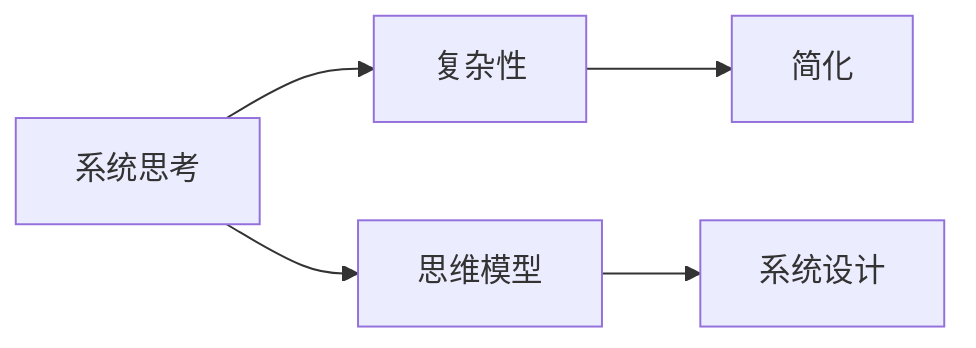

                 

# 系统思考的威力:化繁为简,抓本质

> 关键词：系统思考,复杂性,简化,系统设计,思维模型

## 1. 背景介绍

在现代科技迅猛发展的背景下，系统复杂性日益增加，如何有效地理解和处理复杂系统成为了一个重要的课题。系统思考，即通过对系统的全面、系统地理解，把握系统的本质，化繁为简，是解决问题的关键。本篇文章旨在探讨系统思考的原理与实践，帮助读者深入理解系统思考，并将其应用于实际问题解决中。

## 2. 核心概念与联系

### 2.1 核心概念概述

系统思考强调从整体和全局的角度看待问题，而不是只关注局部的细节。以下是几个核心概念：

- **系统思考（Systems Thinking）**：一种以系统为中心的思考方式，着眼于系统的整体性和关联性，理解系统各部分之间的相互作用和影响。
- **复杂性（Complexity）**：指系统中多层次、多维度、相互依赖的要素及其交互关系，构成系统的动态变化和不确定性。
- **简化（Simplification）**：通过抽象和提炼，减少系统的复杂度，使之更易于理解和处理。
- **思维模型（Thinking Models）**：用于描述系统本质和规律的模型，帮助理解系统的结构和动态变化。

### 2.2 核心概念原理和架构的 Mermaid 流程图



这个流程图展示了系统思考的关键概念及其联系：

1. 系统思考是对复杂性的理解基础。
2. 简化是系统思考的实施手段。
3. 思维模型是系统思考的工具，用于抽象和描述系统。
4. 系统设计是系统思考的实践应用。

## 3. 核心算法原理 & 具体操作步骤

### 3.1 算法原理概述

系统思考的核心原理是基于系统的整体性，通过识别系统中的关键要素和关系，对其进行简化和模型化，从而抓住系统的本质。这涉及以下几个步骤：

1. **识别系统要素**：分析系统中的各个要素，包括资源、人、流程等。
2. **理解系统关系**：明确各要素之间的相互作用和依赖关系。
3. **简化系统模型**：通过抽象和提炼，简化系统模型，便于理解和分析。
4. **构建思维模型**：根据简化后的模型，建立系统思维模型。
5. **进行系统设计**：基于思维模型，设计系统的解决方案。

### 3.2 算法步骤详解

系统思考的具体步骤包括：

1. **定义系统边界**：确定系统要素的范围，明确系统目标。
2. **收集数据**：收集系统的数据和信息，包括定量和定性数据。
3. **识别关键因素**：通过数据分析，识别影响系统的关键因素。
4. **绘制因果图**：使用因果图等思维工具，可视化系统要素和关系。
5. **建立思维模型**：根据因果图，建立系统思维模型，如系统动力学模型。
6. **模拟和验证**：使用模型对系统进行模拟和验证，验证模型准确性。
7. **设计解决方案**：基于模型，设计系统的解决方案。
8. **实施和反馈**：实施解决方案，并根据反馈进行迭代优化。

### 3.3 算法优缺点

系统思考的优点包括：

1. **全局视角**：提供整体视角，避免局部的片面性。
2. **复杂性管理**：通过简化和模型化，有效管理系统的复杂性。
3. **系统优化**：找到系统的最优解，提升系统效率。

缺点包括：

1. **模型假设**：建立模型时，需要简化系统，可能会忽略一些细节。
2. **数据需求**：需要大量的数据进行分析和建模，数据收集成本较高。
3. **模型验证**：模型的准确性需要验证，验证过程复杂。

### 3.4 算法应用领域

系统思考广泛应用于各种领域，如：

1. **项目管理**：通过系统思考，优化项目管理和资源配置。
2. **组织管理**：理解组织结构和关系，提升组织效率。
3. **产品开发**：识别用户需求和产品特性，指导产品设计和优化。
4. **供应链管理**：分析供应链中各环节的相互作用，优化供应链流程。
5. **环境治理**：理解环境系统的复杂性，制定有效的环境治理方案。
6. **医疗健康**：分析患者健康系统中的因素和关系，优化医疗服务。

## 4. 数学模型和公式 & 详细讲解 & 举例说明

### 4.1 数学模型构建

系统思考的数学模型一般包括系统动力学模型和因果图模型。下面以系统动力学模型为例，介绍其基本构成：

系统动力学模型包括状态变量、输入变量、输出变量、参数和控制变量等。状态变量描述系统的当前状态，输入变量影响系统的状态变化，输出变量体现系统的外部表现，参数描述系统的特性，控制变量用于调整系统的行为。

数学公式如下：

$$
\dot{x}(t) = f(x(t),u(t),p)
$$

其中，$x(t)$ 为状态变量，$u(t)$ 为输入变量，$p$ 为参数。

### 4.2 公式推导过程

以简单的经济系统为例，系统动力学模型可以描述为：

$$
\dot{C}(t) = I(t) - R(t)
$$

其中，$C(t)$ 为消费者支出，$I(t)$ 为投资，$R(t)$ 为储蓄。

简化后，可以进一步描述为：

$$
\dot{C}(t) = \alpha I(t) - \beta C(t)
$$

其中，$\alpha$ 为投资转换率，$\beta$ 为储蓄率。

通过上述模型，可以分析投资和储蓄对消费者支出的影响。

### 4.3 案例分析与讲解

假设某地经济发展受限于储蓄率和投资转换率，如何通过政策调整，提升消费和投资？

1. **识别关键因素**：消费者支出$C(t)$、投资$I(t)$和储蓄$R(t)$。
2. **建立因果图**：绘制因果图，明确各因素的关系。
3. **构建系统动力学模型**：

$$
\dot{C}(t) = \alpha I(t) - \beta C(t)
$$

4. **进行模拟和验证**：使用模型进行模拟，验证结果。
5. **设计解决方案**：通过调整投资转换率和储蓄率，优化消费和投资。

## 5. 项目实践：代码实例和详细解释说明

### 5.1 开发环境搭建

1. **安装Python**：确保Python版本在3.7以上。
2. **安装相关库**：安装必要的库，如Sympy、Matplotlib等。
3. **准备数据**：收集系统相关的数据，如消费者支出、投资和储蓄数据。

### 5.2 源代码详细实现

```python
import sympy as sp

# 定义变量
C = sp.Symbol('C')
I = sp.Symbol('I')
R = sp.Symbol('R')
alpha = sp.Rational(1, 2)  # 投资转换率
beta = sp.Rational(1, 5)   # 储蓄率

# 建立系统动力学模型
dC_dt = alpha * I - beta * C

# 求解微分方程
solution = sp.dsolve(dC_dt, C)

# 输出结果
print(solution)
```

### 5.3 代码解读与分析

这段代码使用Sympy库，定义了消费者支出、投资和储蓄等变量，并建立了系统动力学模型。通过求解微分方程，可以得到消费者支出的时间变化规律。

### 5.4 运行结果展示

运行代码后，可以得到消费者支出随时间的变化规律，如图：

```python
import matplotlib.pyplot as plt

# 计算消费者支出随时间变化
time = sp.symbols('t')
C_value = solution.subs(t, time)

# 绘制消费者支出曲线
plt.plot(time, C_value)
plt.xlabel('Time')
plt.ylabel('Consumer Spending')
plt.title('Consumer Spending over Time')
plt.show()
```

## 6. 实际应用场景

### 6.1 智能制造系统

在智能制造系统中，系统思考可以帮助识别和优化生产流程中的关键因素，提高生产效率。例如，通过识别生产线的瓶颈环节，优化设备配置和生产调度，提升整体效率。

### 6.2 城市交通管理

城市交通系统复杂多样，系统思考可以帮助理解交通流、车辆分布等关键因素，优化交通信号控制，提升道路利用率。例如，通过因果图模型，分析交通拥堵的原因，提出合理的信号控制策略。

### 6.3 金融风险管理

金融系统包含大量变量和复杂关系，系统思考可以帮助识别和量化风险因素，制定有效的风险管理策略。例如，通过建立系统动力学模型，预测市场变化，优化投资组合。

### 6.4 未来应用展望

未来，系统思考将在更多领域得到应用，如智能交通、医疗健康、环境保护等。通过深入理解系统的本质，系统思考将成为解决复杂问题的重要工具，推动各领域的创新和发展。

## 7. 工具和资源推荐

### 7.1 学习资源推荐

1. **系统思考书籍**：如《系统思考：城市系统分析与设计》。
2. **在线课程**：如Coursera上的“系统思考”课程。
3. **社区论坛**：如Thinking Models和Thinking Dynamics。

### 7.2 开发工具推荐

1. **Python**：Python语言简单易用，是系统思考建模和分析的重要工具。
2. **Sympy**：用于符号计算和微分方程求解。
3. **Matplotlib**：用于绘制系统动态变化的图表。

### 7.3 相关论文推荐

1. **《系统动力学基础》**：Jay W. Forrester等著，介绍系统动力学的基本概念和方法。
2. **《复杂系统：方法与建模》**：Kees Lang等著，探讨复杂系统的建模和分析方法。
3. **《系统思维：关键概念和实践》**：Maregn Lucarelli等著，详细介绍系统思考的理论和方法。

## 8. 总结：未来发展趋势与挑战

### 8.1 研究成果总结

系统思考通过整体性和关联性的视角，化繁为简，抓住了系统的本质。在实际应用中，系统思考帮助解决了众多复杂问题，提高了系统效率和稳定性。未来，系统思考将在更多领域得到应用，推动各领域的创新和发展。

### 8.2 未来发展趋势

1. **跨领域应用**：系统思考将与其他技术（如人工智能、大数据等）进行更深入的融合，拓展应用场景。
2. **智能化建模**：利用机器学习和人工智能技术，实现系统的智能建模和优化。
3. **实时监测和反馈**：通过实时监测和反馈，动态调整系统行为，提高系统的适应性和响应能力。

### 8.3 面临的挑战

1. **数据收集和处理**：系统思考需要大量数据进行建模和分析，数据收集和处理成本较高。
2. **模型复杂性**：建立复杂系统模型需要多层次、多维度的分析，模型构建复杂。
3. **验证和验证**：模型的准确性和可靠性需要验证，验证过程复杂。

### 8.4 研究展望

未来，系统思考需要进一步探索模型的自动化和智能化，降低数据和模型构建的复杂性，提高系统的实时性和适应性。通过不断优化和创新，系统思考将更好地服务于实际问题的解决。

## 9. 附录：常见问题与解答

**Q1：系统思考和复杂性管理有何区别？**

A: 系统思考是一种以系统为中心的思考方式，着眼于系统的整体性和关联性；复杂性管理是系统思考的具体实践，通过简化和模型化，管理系统的复杂性。

**Q2：如何选择合适的系统动力学模型？**

A: 选择合适的系统动力学模型需要考虑系统的特性和目标。通常，需要定义系统的状态变量、输入变量、输出变量、参数和控制变量等，选择适当的模型结构和数学表达。

**Q3：系统思考在实际应用中需要注意哪些问题？**

A: 在实际应用中，需要注意数据收集和处理、模型构建和验证等问题。同时，需要根据实际情况，灵活调整模型和解决方案。

**Q4：系统思考和因果关系分析有何不同？**

A: 系统思考着眼于系统的整体性和关联性，通过简化和模型化，捕捉系统的本质；因果关系分析关注系统的因果关系，分析变量之间的影响和作用。

**Q5：系统思考有哪些典型的应用场景？**

A: 系统思考广泛应用于项目管理、组织管理、产品开发、供应链管理、环境治理、医疗健康、金融风险管理等领域。

---

作者：禅与计算机程序设计艺术 / Zen and the Art of Computer Programming

