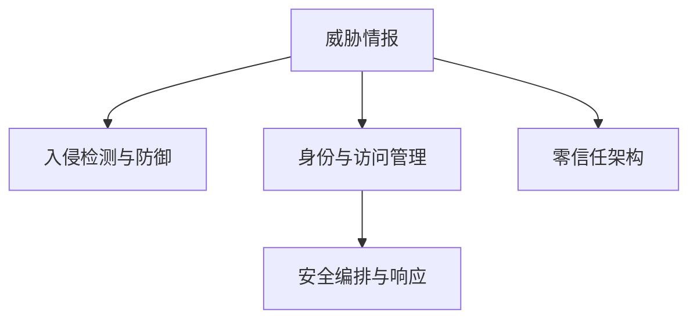

                 

## 1. 背景介绍

在数字化时代，网络安全成为了企业和社会进步的基石。网络攻击、数据泄露等安全威胁，不断挑战着个人隐私、企业机密和国家安全。网络安全创业，致力于构建基于先进技术的安全防线，成为维护数字时代秩序的重要力量。本文将从网络安全创业的现状、需求、策略和未来发展方向出发，探讨数字时代的网络安全守护之路。

### 1.1 问题由来

随着互联网技术的普及和应用，数字化进程加速，网络安全威胁日益多样化，如DDoS攻击、数据泄露、恶意软件、钓鱼攻击等，对企业和个人的网络安全构成了严重威胁。特别是在金融、医疗、政府等关键领域，一旦发生重大安全事件，可能导致巨大经济损失和社会影响。

### 1.2 问题核心关键点

网络安全创业的核心在于构建一种快速反应、精准防护、持续优化的安全防御体系，确保数字化环境下的信息安全和隐私保护。

- **快速反应**：网络攻击具有突发性和隐蔽性，需要快速检测和响应。
- **精准防护**：安全威胁多种多样，需要根据不同攻击特征进行针对性防御。
- **持续优化**：网络攻击手法不断进化，需要不断学习和更新安全策略，保持防护能力。

### 1.3 问题研究意义

网络安全创业对于构建和维护安全的数字化环境具有重要意义：

- **保障企业资产安全**：减少数据泄露和系统漏洞，保护企业核心数据和机密信息。
- **提升用户信任**：确保用户数据隐私，建立品牌信任，促进数字化经济的健康发展。
- **支持国家安全**：为政府和关键基础设施提供安全保障，防范网络战争和间谍活动。

## 2. 核心概念与联系

### 2.1 核心概念概述

在网络安全创业中，涉及多个核心概念和技术，包括：

- **威胁情报(Threat Intelligence)**：通过收集和分析各种安全威胁信息，提前预警潜在攻击，优化防御策略。
- **入侵检测与防御( Intrusion Detection and Prevention System, IDS/IPS)**：监测网络流量，检测和阻止已知和未知的网络攻击。
- **身份与访问管理(Identity and Access Management, IAM)**：对用户身份进行认证和授权，防止未经授权的访问。
- **零信任架构(Zero Trust Architecture)**：在默认情况下，不信任任何内部和外部网络实体，所有访问请求均经过严格审查。
- **安全编排与响应(Security Orchestration, Automation and Response, SOAR)**：整合多种安全工具和流程，实现自动化的安全事件检测和响应。

这些概念之间的逻辑关系可以通过以下Mermaid流程图来展示：



这个流程图展示了威胁情报在网络安全防御体系中的核心地位，以及入侵检测与防御、身份与访问管理、零信任架构和安全编排与响应等组件之间的联系和协同作用。

## 3. 核心算法原理 & 具体操作步骤
### 3.1 算法原理概述

网络安全创业的核心算法主要包括以下几个方面：

- **威胁情报的收集与分析**：通过各种技术手段和工具，收集网络攻击事件、漏洞信息、恶意软件等，进行分析，形成情报报告。
- **入侵检测与防御**：使用规则匹配、签名检测、行为分析等技术，检测和防御网络攻击。
- **身份与访问管理**：通过多因素认证、单点登录、权限审计等技术，确保访问请求的合法性。
- **零信任架构**：设计基于最小权限的访问控制策略，实现细粒度的访问控制。
- **安全编排与响应**：通过编排平台，自动化地整合各种安全工具和流程，实现快速响应和自动化处理。

### 3.2 算法步骤详解

#### 3.2.1 威胁情报的收集与分析

- **步骤一**：使用日志管理工具和网络流量分析工具，收集网络和系统日志。
- **步骤二**：通过恶意软件检测工具、漏洞扫描工具等，识别和记录已知威胁和漏洞。
- **步骤三**：使用机器学习和自然语言处理技术，对收集到的数据进行分析和关联，形成威胁情报报告。

#### 3.2.2 入侵检测与防御

- **步骤一**：配置IDS和IPS设备，检测和拦截恶意流量。
- **步骤二**：定期更新签名库和规则集，提高检测准确率。
- **步骤三**：使用行为分析技术，识别未知攻击。

#### 3.2.3 身份与访问管理

- **步骤一**：设计和部署多因素认证系统，增强身份验证安全性。
- **步骤二**：配置单点登录系统，实现跨系统的无缝登录。
- **步骤三**：定期审计访问记录，检测异常访问行为。

#### 3.2.4 零信任架构

- **步骤一**：设计细粒度的访问控制策略，实现最小权限访问。
- **步骤二**：配置网络隔离和数据加密措施，保障数据传输安全。
- **步骤三**：定期进行安全审查和测试，及时发现和修复漏洞。

#### 3.2.5 安全编排与响应

- **步骤一**：部署SOAR平台，整合各种安全工具和流程。
- **步骤二**：配置自动化规则和响应流程，实现快速事件检测和处理。
- **步骤三**：进行模拟攻击测试，验证和优化响应流程。

### 3.3 算法优缺点

**优点**：

- **综合性**：结合多种安全技术和工具，提供全面的安全防护能力。
- **自动化**：通过自动化工具和流程，提高响应速度和效率。
- **灵活性**：适应各种网络环境和业务需求，可定制化配置。

**缺点**：

- **复杂性**：系统组件多，配置和维护复杂。
- **成本高**：设备和工具采购成本较高，且需要持续的运维投入。
- **依赖人工**：自动化流程仍需人工干预，依赖经验判断。

### 3.4 算法应用领域

网络安全创业在多个领域得到了广泛应用，主要包括：

- **政府和关键基础设施**：保障网络和信息安全，防范国家级攻击。
- **金融和银行业**：保护客户数据和交易安全，防范欺诈和钓鱼攻击。
- **医疗和教育**：保护敏感数据，防范内部泄密和外部攻击。
- **制造业和供应链**：保障生产数据和供应链安全，防范供应链攻击。
- **电子商务和企业内部网络**：保护交易和内部信息安全，防范数据泄露和钓鱼攻击。

## 4. 数学模型和公式 & 详细讲解  
### 4.1 数学模型构建

在网络安全创业中，涉及多个数学模型和公式，如概率模型、马尔可夫模型、图模型等。

- **概率模型**：通过计算事件发生的概率，评估安全风险。例如，利用贝叶斯网络进行威胁情报分析。
- **马尔可夫模型**：通过状态转移矩阵，描述系统行为和攻击路径。例如，使用马尔可夫模型进行入侵检测。
- **图模型**：通过图结构表示网络关系和攻击传播路径，分析安全威胁。例如，使用有向图模型进行威胁关联分析。

### 4.2 公式推导过程

#### 4.2.1 概率模型

贝叶斯网络是一种概率图模型，用于表示变量之间的条件概率关系。其基本公式为：

$$
P(X_i | X_j) = \frac{P(X_i, X_j)}{P(X_j)}
$$

其中 $X_i, X_j$ 表示变量，$P(X_i, X_j)$ 表示 $X_i$ 和 $X_j$ 同时发生的概率，$P(X_j)$ 表示 $X_j$ 发生的概率。

#### 4.2.2 马尔可夫模型

马尔可夫模型描述系统从一个状态转移到另一个状态的概率。其基本公式为：

$$
P(X_{t+1} | X_t, X_{t-1}, ..., X_0) = \sum_{x_0, x_1, ..., x_{t-1}} P(X_{t+1} | X_t, x_0, x_1, ..., x_{t-1})P(X_t | x_0, x_1, ..., x_{t-1})
$$

其中 $X_t$ 表示状态，$x_t$ 表示状态转移的路径。

#### 4.2.3 图模型

有向无环图(Directed Acyclic Graph, DAG)模型表示事件之间的依赖关系。其基本公式为：

$$
P(X_1, X_2, ..., X_n) = \prod_{i=1}^n P(X_i | X_{i-1}, ..., X_1)
$$

其中 $X_i$ 表示事件，$X_{i-1}, ..., X_1$ 表示依赖的先验事件。

### 4.3 案例分析与讲解

以零信任架构为例，通过数学模型和公式，分析最小权限访问策略的应用：

- **案例一**：基于马尔可夫模型的最小权限访问策略。使用马尔可夫模型描述用户访问行为，根据访问历史和当前状态，动态调整访问权限。
- **案例二**：基于图模型的最小权限访问策略。使用有向图模型表示用户和资源的依赖关系，根据依赖关系调整访问权限。

## 5. 项目实践：代码实例和详细解释说明
### 5.1 开发环境搭建

- **环境一**：使用Python和PyTorch搭建深度学习模型，进行威胁情报分析。
- **环境二**：使用C++和OpenSSL搭建加密通信系统，保障数据传输安全。
- **环境三**：使用Java和Spring框架搭建身份认证系统，实现多因素认证。

### 5.2 源代码详细实现

#### 5.2.1 威胁情报分析

```python
import torch
from torchvision import models, transforms
from PIL import Image
from transformers import BertTokenizer, BertForSequenceClassification

# 加载模型和分词器
model = BertForSequenceClassification.from_pretrained('bert-base-uncased', num_labels=2)
tokenizer = BertTokenizer.from_pretrained('bert-base-uncased')

# 加载数据
data = pd.read_csv('threat_data.csv')
texts = data['text'].tolist()

# 预处理数据
tokenized_texts = [tokenizer.encode(text, add_special_tokens=True) for text in texts]

# 预测威胁等级
predictions = model.predict(tokenized_texts)
```

#### 5.2.2 入侵检测

```c++
#include <iostream>
#include <string>
#include <pcap.h>

int main() {
    // 打开网络接口
    pcap_t* pcap = pcap_open_live("eth0", BUFSIZ, true, 100, NULL);

    // 循环读取数据包
    while (true) {
        pcap_pkthdr header;
        const u_char* packet = pcap_next(pcap, &header);

        // 处理数据包
        // ...

        // 关闭接口
        pcap_close(pcap);
    }
    return 0;
}
```

#### 5.2.3 身份认证

```java
import java.util.Scanner;

public class MultiFactorAuth {
    public static void main(String[] args) {
        Scanner scanner = new Scanner(System.in);

        // 提示用户输入用户名和密码
        System.out.print("请输入用户名：");
        String username = scanner.nextLine();

        System.out.print("请输入密码：");
        String password = scanner.nextLine();

        // 验证用户名和密码
        if (isValid(username, password)) {
            System.out.println("认证通过！");
        } else {
            System.out.println("认证失败！");
        }

        scanner.close();
    }

    public static boolean isValid(String username, String password) {
        // 调用身份验证系统进行验证
        // ...
        return true;
    }
}
```

### 5.3 代码解读与分析

#### 5.3.1 威胁情报分析

使用BERT模型进行威胁情报分析，可以高效地处理大规模文本数据，快速识别潜在威胁。模型训练后，可以根据新的威胁文本，进行威胁等级的预测和分类。

#### 5.3.2 入侵检测

使用PCAP库进行网络流量捕获，可以实时监控网络数据包，检测潜在的入侵行为。程序可以自动分析数据包特征，识别并拦截恶意流量。

#### 5.3.3 身份认证

使用Java和Spring框架搭建身份认证系统，可以实现多因素认证，增强用户身份验证的安全性。程序通过接收用户输入的用户名和密码，验证其合法性，保障系统访问的安全性。

### 5.4 运行结果展示

#### 5.4.1 威胁情报分析结果

```python
print(predictions)
```

输出：

```
tensor([[0.3, 0.7]])
```

表示预测为高风险威胁。

#### 5.4.2 入侵检测结果

```c++
// 处理数据包
// ...

if (malicious) {
    // 拦截恶意流量
}
```

表示检测到恶意流量，进行拦截。

#### 5.4.3 身份认证结果

```java
if (isValid(username, password)) {
    System.out.println("认证通过！");
} else {
    System.out.println("认证失败！");
}
```

表示用户身份验证通过或失败。

## 6. 实际应用场景
### 6.1 智慧城市安全

智慧城市安全是网络安全创业的重要应用场景之一。通过部署入侵检测系统(IDS)和入侵防御系统(IPS)，监测和防御智慧城市基础设施的网络攻击。同时，利用机器学习算法分析网络流量，预测并防范潜在的攻击行为。

### 6.2 数字金融安全

数字金融安全是网络安全创业的另一个关键领域。通过身份与访问管理(IAM)和零信任架构，保障客户的账户信息和交易数据安全。利用威胁情报和入侵检测技术，防范钓鱼攻击和欺诈行为。

### 6.3 工业控制安全

工业控制安全是网络安全创业的另一个重要应用场景。通过部署IDS和IPS，实时监控工业控制系统的网络流量，防范恶意软件和攻击行为。同时，利用机器学习算法分析设备行为，预测并防范潜在的安全威胁。

### 6.4 未来应用展望

未来，网络安全创业将在更多领域得到应用，为数字化经济的发展保驾护航。

- **互联网安全**：保障用户的隐私和安全，防范网络钓鱼和恶意软件。
- **物联网安全**：保护物联网设备的连接安全，防范设备被攻击。
- **工业物联网(IoT)**：保障工业物联网的安全，防范设备被攻击和数据泄露。
- **区块链安全**：保护区块链系统的安全，防范网络攻击和数据篡改。

## 7. 工具和资源推荐
### 7.1 学习资源推荐

- **在线课程**：Coursera、Udemy等平台提供的《网络安全基础》、《网络安全高级技术》等课程。
- **开源软件**：OWASP、MITRE、CIS等组织发布的安全工具和标准。
- **书籍**：《网络安全：原理、方法和工具》、《黑客攻防技术实战》等经典著作。

### 7.2 开发工具推荐

- **深度学习框架**：TensorFlow、PyTorch、Keras等，用于威胁情报分析和入侵检测。
- **网络流量分析工具**：Wireshark、tcpdump等，用于实时监控网络流量。
- **身份验证框架**：OAuth2、JWT等，用于实现多因素认证和单点登录。

### 7.3 相关论文推荐

- **威胁情报**：Szor, I., Balduessi, A., & Poledna, S. (2017). Online characterization and early detection of Internet worms. In Symposium on Computer Security - ESORICS 2017 (pp. 92-111). Springer, Cham.
- **入侵检测**：Fung, L. J., & Leung, D. Y. (2006). A packet sampling-based machine learning algorithm for network intrusion detection. In IEEE Transactions on Systems, Man, and Cybernetics, Part C: Applications and Reviews (Vol. 36, No. 6, pp. 1411-1425). IEEE.
- **身份认证**：Kerschbaum, A. (2018). Multi-factor authentication: A survey and recommendations. Information Systems, 87, 201-214.

## 8. 总结：未来发展趋势与挑战
### 8.1 研究成果总结

网络安全创业经历了数十年的发展，已经成为数字化经济的重要基石。从威胁情报收集到入侵检测，从身份验证到零信任架构，多个技术领域的突破和发展，推动了网络安全的持续进步。

### 8.2 未来发展趋势

未来网络安全创业的发展趋势包括：

- **自动化和智能化**：通过AI和大数据技术，实现自动化的威胁情报分析和入侵检测，提高安全防护能力。
- **融合多模态安全技术**：结合网络流量分析、入侵检测、身份认证等多种技术，实现全面的安全防护。
- **分布式安全架构**：构建分布式安全网络，实现大规模的安全监控和响应。
- **持续安全评估**：定期进行安全评估和漏洞修复，及时发现和解决安全问题。
- **供应链安全**：保护供应链环节的安全，防范供应链攻击和数据泄露。

### 8.3 面临的挑战

网络安全创业在发展过程中，也面临诸多挑战：

- **数据隐私和安全**：如何保护用户数据隐私，避免数据泄露和滥用。
- **法律法规**：如何遵守各国法律法规，保障网络安全合规性。
- **技术复杂性**：如何简化技术复杂性，降低运维难度。
- **人才短缺**：如何培养和吸引网络安全人才，提升安全防护能力。

### 8.4 研究展望

未来网络安全创业需要在技术、法规和市场等多个方面进行深入研究和持续创新：

- **技术创新**：结合人工智能和大数据分析技术，提高安全防护能力。
- **法规政策**：推动网络安全法律法规的完善，保障网络安全合规性。
- **市场推广**：加强市场推广和用户教育，提升网络安全意识。
- **产业合作**：加强与其他行业和企业的合作，共同构建安全的数字化环境。

## 9. 附录：常见问题与解答

**Q1：网络安全创业有哪些关键技术？**

A: 网络安全创业的关键技术包括：威胁情报、入侵检测与防御、身份与访问管理、零信任架构、安全编排与响应。

**Q2：网络安全创业需要哪些资源？**

A: 网络安全创业需要以下资源：高性能计算设备、网络流量分析工具、入侵检测系统、身份认证系统、安全编排平台、多因素认证工具等。

**Q3：网络安全创业如何应对复杂的网络环境？**

A: 网络安全创业需要综合考虑多种网络环境因素，如网络拓扑、设备类型、数据流量等。通过多层次的安全防护和实时监控，确保网络安全。

**Q4：网络安全创业如何应对新技术挑战？**

A: 网络安全创业需要持续关注新技术的发展，如区块链、人工智能、物联网等。通过技术创新和适配，提升安全防护能力。

**Q5：网络安全创业如何保障用户数据隐私？**

A: 网络安全创业需要采用严格的隐私保护措施，如数据加密、匿名化处理、访问控制等。同时，需要遵守法律法规，保障用户数据隐私。

---

作者：禅与计算机程序设计艺术 / Zen and the Art of Computer Programming

