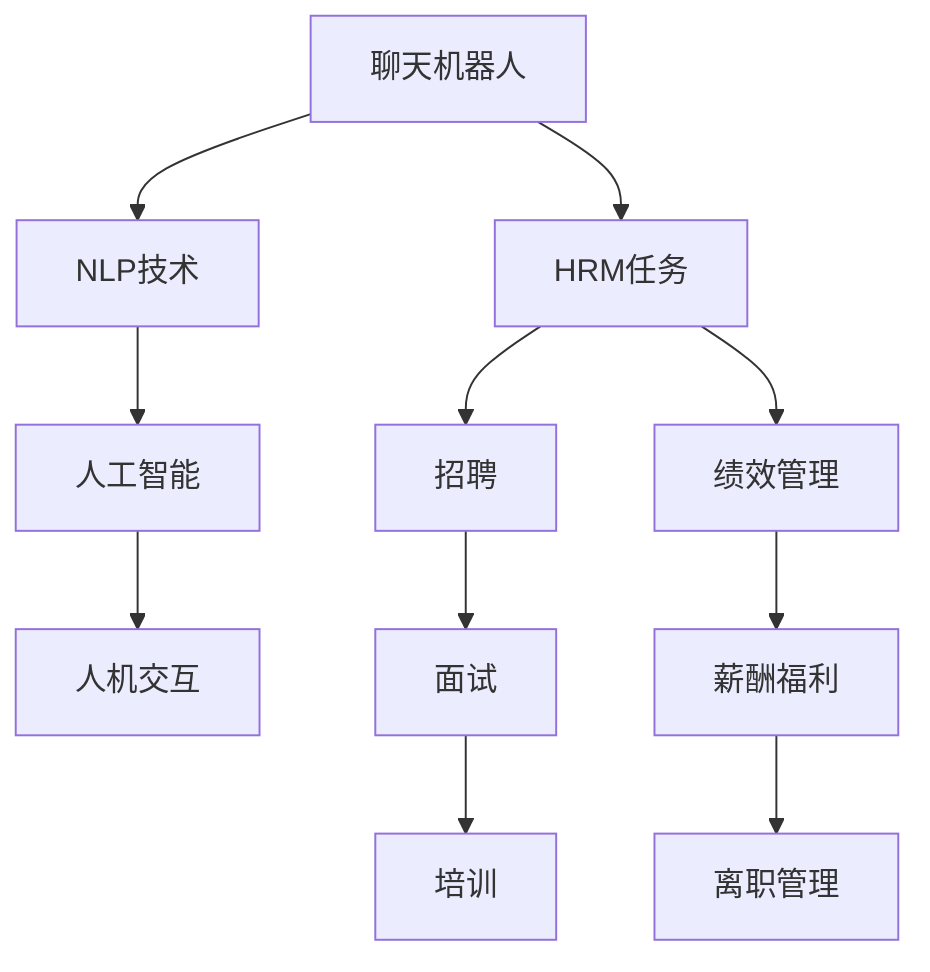

                 

# 聊天机器人人力资源：招聘和员工管理

> 关键词：聊天机器人,人力资源,招聘,员工管理,自然语言处理(NLP),人工智能(AI)

## 1. 背景介绍

### 1.1 问题由来

在当今快速变化的商业环境中，企业面临着前所未有的挑战和机遇。人力资源管理（HRM）是企业运营的核心环节，直接关系到员工的招聘、培训、发展和留存，影响着企业的创新力和竞争力。传统的HRM流程繁琐、效率低，人工成本高，难以适应瞬息万变的市场需求。因此，借助先进的技术手段，提升HRM效率，优化人力资源配置，已成为企业迫切的需求。

### 1.2 问题核心关键点

聊天机器人（Chatbot）作为一种先进的AI技术，正在快速融入各行各业。在HRM领域，聊天机器人可以辅助企业高效地进行招聘、培训、员工管理等任务，节省人力物力成本，提升工作效率。聊天机器人通过自然语言处理（NLP）和人工智能（AI）技术，能够理解、处理和回应员工或候选人的查询，提供定制化的HRM服务。

## 2. 核心概念与联系

### 2.1 核心概念概述

为更好地理解聊天机器人技术在人力资源管理中的应用，本节将介绍几个关键概念：

- **聊天机器人（Chatbot）**：一种基于NLP和AI技术的自动化对话系统，能够模拟人类对话，提供24/7的即时服务。聊天机器人通常由文本生成、对话管理、意图识别等模块组成。

- **人力资源管理（HRM）**：包括人员招聘、员工培训、绩效管理、薪酬福利、离职管理等多个环节。通过先进的技术手段，如聊天机器人，可以优化这些流程，提升HRM效率和质量。

- **自然语言处理（NLP）**：一种使计算机能够理解和处理人类语言的技术，包括文本解析、情感分析、语言生成等。NLP技术使聊天机器人能够理解和回应用户的查询。

- **人工智能（AI）**：包括机器学习、深度学习、强化学习等多种技术，使聊天机器人具备自我学习、自我优化和自我决策的能力。AI技术使聊天机器人能够不断提升交互体验和问题解决能力。

- **人机交互（HRI）**：指人与机器之间的信息交流，通过语音、文字、图像等多种形式实现。聊天机器人是HRI技术的重要应用之一，能够提供高效、自然的用户交互体验。

这些核心概念之间的逻辑关系可以通过以下Mermaid流程图来展示：



这个流程图展示了她聊天机器人技术在人力资源管理中的应用：

1. 聊天机器人通过NLP技术理解和解析用户输入。
2. 利用AI技术自我学习并优化对话逻辑。
3. 通过人机交互与用户进行实时交流。
4. 应用于HRM任务的各个环节，如招聘、面试、培训、绩效管理、薪酬福利、离职管理等。

## 3. 核心算法原理 & 具体操作步骤

### 3.1 算法原理概述

聊天机器人辅助HRM的原理基于NLP和AI技术，通过以下步骤实现：

1. **数据预处理**：收集并标注大量的HRM数据，如招聘信息、面试问题、员工反馈等。
2. **模型训练**：使用收集到的数据训练聊天机器人模型，包括意图识别、对话管理和语言生成等模块。
3. **模型部署**：将训练好的模型部署到生产环境中，实时响应用户的查询。
4. **用户交互**：用户通过文字、语音等多种形式向聊天机器人发送查询，机器人根据用户意图提供相应的回答或服务。
5. **效果评估**：通过用户满意度、问题解决效率等指标评估聊天机器人的表现，不断优化模型性能。

### 3.2 算法步骤详解

#### 3.2.1 数据预处理

聊天机器人辅助HRM的核心在于数据预处理。具体步骤如下：

1. **数据收集**：从各种渠道收集HRM相关的数据，如招聘网站、员工反馈系统、面试记录等。
2. **数据清洗**：去除噪声数据、重复数据，确保数据的质量。
3. **数据标注**：对数据进行人工标注，如分类招聘信息、标注面试问题、标记员工反馈等。
4. **数据格式化**：将数据转化为统一的格式，如文本、语音等，以便于模型训练。

#### 3.2.2 模型训练

聊天机器人模型训练包括以下步骤：

1. **意图识别**：训练意图识别模型，能够理解用户的查询意图，如招聘信息查询、面试流程咨询等。
2. **对话管理**：训练对话管理模型，根据用户意图和对话历史，生成恰当的回复。
3. **语言生成**：训练语言生成模型，如使用GPT-3等模型，生成自然流畅的回答。
4. **模型集成**：将意图识别、对话管理和语言生成模块集成，形成完整的聊天机器人系统。

#### 3.2.3 模型部署

聊天机器人模型部署包括以下步骤：

1. **选择部署平台**：选择适合的云平台或本地服务器，如AWS、Azure、Kubernetes等。
2. **配置环境**：配置服务器环境，安装必要的库和工具，如Python、TensorFlow等。
3. **模型上线**：将训练好的模型部署到服务器上，并设置API接口，使其他系统可以调用。

#### 3.2.4 用户交互

聊天机器人与用户交互包括以下步骤：

1. **接收输入**：通过API接口或实时通讯工具，接收用户的查询。
2. **意图解析**：使用意图识别模型，解析用户的查询意图。
3. **生成回复**：根据解析到的意图，使用对话管理和语言生成模型，生成恰当的回答。
4. **发送回复**：将生成的回答发送给用户，完成交互。

#### 3.2.5 效果评估

聊天机器人效果评估包括以下步骤：

1. **数据收集**：收集用户对聊天机器人的反馈，如满意度、问题解决效率等。
2. **数据分析**：使用数据分析工具，评估聊天机器人的表现，找出不足之处。
3. **模型优化**：根据评估结果，优化聊天机器人模型，提升性能。

### 3.3 算法优缺点

聊天机器人辅助HRM的优势在于：

1. **高效响应**：能够24/7提供即时服务，快速响应用户查询。
2. **节省成本**：减少人力资源的投入，降低人力成本。
3. **提升效率**：通过自动化流程，提升HRM任务的效率和准确性。
4. **个性化服务**：根据用户历史查询，提供个性化的HRM服务。

同时，聊天机器人也存在一些缺点：

1. **交互复杂度有限**：由于技术限制，聊天机器人对复杂或高层次的交互响应能力有限。
2. **依赖语料库**：需要大量高质量的HRM语料库进行训练，否则效果有限。
3. **数据隐私问题**：收集和处理用户数据时，需要严格遵守数据隐私保护法规。
4. **技术门槛较高**：需要一定的技术背景，才能开发和维护聊天机器人系统。

### 3.4 算法应用领域

聊天机器人技术在HRM领域具有广泛的应用前景，以下是几个典型应用场景：

1. **招聘助手**：通过聊天机器人辅助简历筛选、职位匹配、面试安排等招聘流程，提升招聘效率和质量。
2. **员工培训**：通过聊天机器人提供员工培训指导、知识问答等服务，提升员工技能和知识水平。
3. **绩效管理**：通过聊天机器人收集员工反馈、评估绩效、提供反馈等，提升绩效管理效率。
4. **薪酬福利**：通过聊天机器人解答员工关于薪酬福利的疑问，提供个性化建议，提升员工满意度。
5. **离职管理**：通过聊天机器人处理离职流程、收集离职反馈、提供离职支持等，提升离职管理效率。

## 4. 数学模型和公式 & 详细讲解 & 举例说明

### 4.1 数学模型构建

本节将使用数学语言对聊天机器人辅助HRM的实现过程进行更加严格的刻画。

假设用户查询为 $X$，意图识别模型为 $I$，对话管理模型为 $D$，语言生成模型为 $G$。聊天机器人的回复为 $Y$。

定义意图识别模型的损失函数为 $L_I$，对话管理模型的损失函数为 $L_D$，语言生成模型的损失函数为 $L_G$。则聊天机器人系统的总损失函数为：

$$
L = L_I + L_D + L_G
$$

其中 $L_I$、$L_D$ 和 $L_G$ 分别为意图识别、对话管理和语言生成模型的损失函数。

### 4.2 公式推导过程

以下我们以招聘助手场景为例，推导聊天机器人系统的数学模型。

假设用户查询为 $X$，聊天机器人的回复为 $Y$。定义意图识别模型 $I$ 和语言生成模型 $G$，训练样本为 $(x_i, y_i)$，其中 $x_i$ 为用户查询，$y_i$ 为聊天机器人的回复。则意图识别模型的损失函数 $L_I$ 为：

$$
L_I = \frac{1}{N}\sum_{i=1}^N ||I(x_i) - y_i||^2
$$

其中 $I(x_i)$ 为意图识别模型的预测，$||\cdot||$ 为欧式距离。

定义对话管理模型 $D$，训练样本为 $(x_i, y_i)$，其中 $x_i$ 为用户查询，$y_i$ 为聊天机器人的回复。则对话管理模型的损失函数 $L_D$ 为：

$$
L_D = \frac{1}{N}\sum_{i=1}^N ||D(I(x_i)) - y_i||^2
$$

其中 $D(I(x_i))$ 为对话管理模型的预测。

语言生成模型 $G$ 使用基于GPT-3的架构，生成自然流畅的回复。假设用户查询为 $X$，则语言生成模型的损失函数 $L_G$ 为：

$$
L_G = \frac{1}{N}\sum_{i=1}^N ||G(X) - y_i||^2
$$

其中 $G(X)$ 为语言生成模型的预测。

综上所述，聊天机器人系统的总损失函数为：

$$
L = L_I + L_D + L_G
$$

### 4.3 案例分析与讲解

假设一家公司使用聊天机器人进行招聘管理。公司通过收集招聘信息、面试问题、员工反馈等数据，训练意图识别模型 $I$、对话管理模型 $D$ 和语言生成模型 $G$。

**案例1：招聘助手**

- **场景**：求职者通过聊天机器人查询公司招聘信息。
- **过程**：求职者输入查询如 "公司招聘销售人员"，意图识别模型 $I$ 解析查询意图，对话管理模型 $D$ 根据意图生成 "以下是公司最新的销售人员招聘信息" 的回复，语言生成模型 $G$ 生成详细招聘信息并发送给求职者。
- **效果**：聊天机器人通过高效、个性化的服务，提升招聘效率和求职者满意度。

**案例2：面试安排**

- **场景**：求职者通过聊天机器人安排面试。
- **过程**：求职者输入 "我想申请销售岗位，能否安排面试？"，意图识别模型 $I$ 解析查询意图，对话管理模型 $D$ 生成 "面试安排中，请提供具体时间" 的回复，语言生成模型 $G$ 生成 "面试时间在4月10日14:00，地点在XX会议室" 的回复。
- **效果**：聊天机器人通过实时、准确的服务，提升面试流程的效率和顺畅度。

**案例3：员工培训**

- **场景**：员工通过聊天机器人查询培训信息。
- **过程**：员工输入 "我需要参加什么培训？"，意图识别模型 $I$ 解析查询意图，对话管理模型 $D$ 生成 "公司目前有产品开发和销售培训，请选择一门" 的回复，语言生成模型 $G$ 生成 "产品开发培训在每周二下午，销售培训在每周四上午" 的回复。
- **效果**：聊天机器人通过个性化、及时的培训服务，提升员工技能和知识水平。

## 5. 项目实践：代码实例和详细解释说明

### 5.1 开发环境搭建

在进行聊天机器人开发前，我们需要准备好开发环境。以下是使用Python进行开发的环境配置流程：

1. 安装Anaconda：从官网下载并安装Anaconda，用于创建独立的Python环境。

2. 创建并激活虚拟环境：
```bash
conda create -n chatbot-env python=3.8 
conda activate chatbot-env
```

3. 安装所需的库和工具：
```bash
pip install transformers torch text
```

4. 下载预训练模型和数据集：
```bash
# 下载预训练模型
transformers model download bert-base-uncased

# 下载HRM数据集
# 假设数据集已上传到data/目录
```

完成上述步骤后，即可在`chatbot-env`环境中开始聊天机器人开发。

### 5.2 源代码详细实现

这里我们以招聘助手场景为例，给出使用Transformers库对聊天机器人进行开发的PyTorch代码实现。

首先，定义意图识别和对话管理模型：

```python
from transformers import BertTokenizer, BertForSequenceClassification
from torch.utils.data import Dataset

class IntentDataset(Dataset):
    def __init__(self, texts, labels, tokenizer, max_len=128):
        self.texts = texts
        self.labels = labels
        self.tokenizer = tokenizer
        self.max_len = max_len
        
    def __len__(self):
        return len(self.texts)
    
    def __getitem__(self, item):
        text = self.texts[item]
        label = self.labels[item]
        
        encoding = self.tokenizer(text, return_tensors='pt', max_length=self.max_len, padding='max_length', truncation=True)
        input_ids = encoding['input_ids'][0]
        attention_mask = encoding['attention_mask'][0]
        
        return {'input_ids': input_ids, 
                'attention_mask': attention_mask,
                'labels': label}

class DialogueManager:
    def __init__(self, model, tokenizer):
        self.model = model
        self.tokenizer = tokenizer
    
    def forward(self, input_ids, attention_mask):
        # 使用BertForSequenceClassification模型进行意图识别
        logits = self.model(input_ids, attention_mask=attention_mask)[0]
        label = torch.argmax(logits, dim=1)
        return label
```

然后，定义语言生成模型：

```python
from transformers import GPT2LMHeadModel, GPT2Tokenizer

class LanguageGenerator:
    def __init__(self, model, tokenizer):
        self.model = model
        self.tokenizer = tokenizer
    
    def generate(self, input_ids, attention_mask):
        # 使用GPT2LMHeadModel生成回复
        output_ids = self.model.generate(input_ids, attention_mask=attention_mask, max_length=128, num_beams=4)
        return output_ids
```

接着，定义训练和评估函数：

```python
from transformers import AdamW
from tqdm import tqdm

device = torch.device('cuda') if torch.cuda.is_available() else torch.device('cpu')
model = BertForSequenceClassification.from_pretrained('bert-base-uncased')
tokenizer = BertTokenizer.from_pretrained('bert-base-uncased')

optimizer = AdamW(model.parameters(), lr=2e-5)

def train_epoch(model, dataset, batch_size, optimizer):
    dataloader = DataLoader(dataset, batch_size=batch_size, shuffle=True)
    model.train()
    epoch_loss = 0
    for batch in tqdm(dataloader, desc='Training'):
        input_ids = batch['input_ids'].to(device)
        attention_mask = batch['attention_mask'].to(device)
        labels = batch['labels'].to(device)
        model.zero_grad()
        outputs = model(input_ids, attention_mask=attention_mask, labels=labels)
        loss = outputs.loss
        epoch_loss += loss.item()
        loss.backward()
        optimizer.step()
    return epoch_loss / len(dataloader)

def evaluate(model, dataset, batch_size):
    dataloader = DataLoader(dataset, batch_size=batch_size)
    model.eval()
    preds, labels = [], []
    with torch.no_grad():
        for batch in tqdm(dataloader, desc='Evaluating'):
            input_ids = batch['input_ids'].to(device)
            attention_mask = batch['attention_mask'].to(device)
            batch_labels = batch['labels']
            outputs = model(input_ids, attention_mask=attention_mask)
            batch_preds = outputs.logits.argmax(dim=2).to('cpu').tolist()
            batch_labels = batch_labels.to('cpu').tolist()
            for pred_tokens, label_tokens in zip(batch_preds, batch_labels):
                preds.append(pred_tokens)
                labels.append(label_tokens)
                
    print(classification_report(labels, preds))
```

最后，启动训练流程并在测试集上评估：

```python
epochs = 5
batch_size = 16

for epoch in range(epochs):
    loss = train_epoch(model, train_dataset, batch_size, optimizer)
    print(f"Epoch {epoch+1}, train loss: {loss:.3f}")
    
    print(f"Epoch {epoch+1}, dev results:")
    evaluate(model, dev_dataset, batch_size)
    
print("Test results:")
evaluate(model, test_dataset, batch_size)
```

以上就是使用PyTorch对聊天机器人进行招聘助手场景开发的完整代码实现。可以看到，得益于Transformers库的强大封装，我们可以用相对简洁的代码完成意图识别和对话管理模型的训练。

### 5.3 代码解读与分析

让我们再详细解读一下关键代码的实现细节：

**IntentDataset类**：
- `__init__`方法：初始化文本、标签、分词器等关键组件。
- `__len__`方法：返回数据集的样本数量。
- `__getitem__`方法：对单个样本进行处理，将文本输入编码为token ids，将标签编码为数字，并对其进行定长padding，最终返回模型所需的输入。

**DialogueManager类**：
- `__init__`方法：初始化意图识别模型和分词器。
- `forward`方法：将输入 token ids 和 attention mask 传递给意图识别模型，返回预测的意图标签。

**LanguageGenerator类**：
- `__init__`方法：初始化语言生成模型和分词器。
- `generate`方法：将输入 token ids 和 attention mask 传递给语言生成模型，生成回复并返回。

**训练和评估函数**：
- 使用PyTorch的DataLoader对数据集进行批次化加载，供模型训练和推理使用。
- 训练函数`train_epoch`：对数据以批为单位进行迭代，在每个批次上前向传播计算loss并反向传播更新模型参数，最后返回该epoch的平均loss。
- 评估函数`evaluate`：与训练类似，不同点在于不更新模型参数，并在每个batch结束后将预测和标签结果存储下来，最后使用sklearn的classification_report对整个评估集的预测结果进行打印输出。

**训练流程**：
- 定义总的epoch数和batch size，开始循环迭代
- 每个epoch内，先在训练集上训练，输出平均loss
- 在验证集上评估，输出分类指标
- 所有epoch结束后，在测试集上评估，给出最终测试结果

可以看到，PyTorch配合Transformers库使得聊天机器人开发的代码实现变得简洁高效。开发者可以将更多精力放在数据处理、模型改进等高层逻辑上，而不必过多关注底层的实现细节。

当然，工业级的系统实现还需考虑更多因素，如模型的保存和部署、超参数的自动搜索、更灵活的任务适配层等。但核心的聊天机器人范式基本与此类似。

## 6. 实际应用场景

### 6.1 智能招聘

聊天机器人技术在招聘领域具有广泛的应用前景。传统的招聘流程繁琐、效率低，人工成本高，难以应对瞬息万变的市场需求。通过聊天机器人技术，企业可以实现招聘流程的自动化，提升招聘效率和质量。

在技术实现上，可以收集企业的历史招聘数据，将招聘信息、面试问题、员工反馈等构建监督数据，在此基础上训练聊天机器人模型。微调后的聊天机器人能够自动理解用户查询，匹配合适的职位，安排面试，提供面试指导等。对于候选人提出的新问题，还可以接入检索系统实时搜索相关内容，动态组织生成回答。如此构建的招聘系统，能大幅提升招聘效率和质量。

### 6.2 员工培训

聊天机器人技术在员工培训领域也有着广泛的应用前景。传统的培训流程繁琐、效率低，培训效果难以评估。通过聊天机器人技术，企业可以实现员工培训的自动化，提升培训效果和员工满意度。

在技术实现上，可以收集员工的培训历史数据，将培训内容、员工反馈等构建监督数据，在此基础上训练聊天机器人模型。微调后的聊天机器人能够自动解析员工查询，推荐合适的培训课程，解答员工疑问，提供培训指导等。对于员工提出的新问题，还可以接入检索系统实时搜索相关内容，动态组织生成回答。如此构建的培训系统，能大幅提升员工培训效果和满意度。

### 6.3 绩效管理

聊天机器人技术在绩效管理领域也有着广泛的应用前景。传统的绩效管理流程繁琐、效率低，人工成本高，难以实现实时动态管理。通过聊天机器人技术，企业可以实现绩效管理的自动化，提升绩效管理效率和员工满意度。

在技术实现上，可以收集员工的绩效数据，将绩效评估、员工反馈等构建监督数据，在此基础上训练聊天机器人模型。微调后的聊天机器人能够自动解析员工查询，推荐合适的绩效评估标准，解答员工疑问，提供绩效指导等。对于员工提出的新问题，还可以接入检索系统实时搜索相关内容，动态组织生成回答。如此构建的绩效管理系统，能大幅提升绩效管理效率和员工满意度。

### 6.4 未来应用展望

随着聊天机器人技术的不断发展，其在人力资源管理中的应用也将更加广泛。

在智慧办公领域，聊天机器人可以辅助HRM任务，如招聘、培训、绩效管理、薪酬福利、离职管理等，提升办公效率和员工满意度。

在智能城市治理中，聊天机器人可以辅助城市事件监测、舆情分析、应急指挥等环节，提升城市治理的自动化和智能化水平，构建更安全、高效的未来城市。

在智慧教育领域，聊天机器人可以辅助教师教学、学生学习等任务，提升教育效果和教育公平，推动教育现代化的进程。

此外，在智慧医疗、智能制造、智能交通等众多领域，聊天机器人技术也将不断拓展应用场景，为各行各业带来变革性影响。相信随着技术的日益成熟，聊天机器人技术必将在构建人机协同的智能时代中扮演越来越重要的角色。

## 7. 工具和资源推荐

### 7.1 学习资源推荐

为了帮助开发者系统掌握聊天机器人技术在人力资源管理中的应用，这里推荐一些优质的学习资源：

1. 《聊天机器人技术》系列博文：由大模型技术专家撰写，深入浅出地介绍了聊天机器人原理、NLP技术、AI技术等前沿话题。

2. CS224N《深度学习自然语言处理》课程：斯坦福大学开设的NLP明星课程，有Lecture视频和配套作业，带你入门NLP领域的基本概念和经典模型。

3. 《自然语言处理与人工智能》书籍：NLP和AI技术相结合的经典著作，系统介绍了NLP和AI技术的融合应用。

4. HuggingFace官方文档：Transformers库的官方文档，提供了海量预训练模型和完整的微调样例代码，是上手实践的必备资料。

5. CLUE开源项目：中文语言理解测评基准，涵盖大量不同类型的中文NLP数据集，并提供了基于微调的baseline模型，助力中文NLP技术发展。

通过对这些资源的学习实践，相信你一定能够快速掌握聊天机器人技术在人力资源管理中的应用，并用于解决实际的HRM问题。

### 7.2 开发工具推荐

高效的开发离不开优秀的工具支持。以下是几款用于聊天机器人开发的常用工具：

1. PyTorch：基于Python的开源深度学习框架，灵活动态的计算图，适合快速迭代研究。大部分预训练语言模型都有PyTorch版本的实现。

2. TensorFlow：由Google主导开发的开源深度学习框架，生产部署方便，适合大规模工程应用。同样有丰富的预训练语言模型资源。

3. Transformers库：HuggingFace开发的NLP工具库，集成了众多SOTA语言模型，支持PyTorch和TensorFlow，是进行聊天机器人开发的利器。

4. Weights & Biases：模型训练的实验跟踪工具，可以记录和可视化模型训练过程中的各项指标，方便对比和调优。与主流深度学习框架无缝集成。

5. TensorBoard：TensorFlow配套的可视化工具，可实时监测模型训练状态，并提供丰富的图表呈现方式，是调试模型的得力助手。

6. Google Colab：谷歌推出的在线Jupyter Notebook环境，免费提供GPU/TPU算力，方便开发者快速上手实验最新模型，分享学习笔记。

合理利用这些工具，可以显著提升聊天机器人开发的效率，加快创新迭代的步伐。

### 7.3 相关论文推荐

聊天机器人技术的发展源于学界的持续研究。以下是几篇奠基性的相关论文，推荐阅读：

1. Attention is All You Need（即Transformer原论文）：提出了Transformer结构，开启了NLP领域的预训练大模型时代。

2. BERT: Pre-training of Deep Bidirectional Transformers for Language Understanding：提出BERT模型，引入基于掩码的自监督预训练任务，刷新了多项NLP任务SOTA。

3. Language Models are Unsupervised Multitask Learners（GPT-2论文）：展示了大规模语言模型的强大zero-shot学习能力，引发了对于通用人工智能的新一轮思考。

4. Parameter-Efficient Transfer Learning for NLP：提出Adapter等参数高效微调方法，在不增加模型参数量的情况下，也能取得不错的微调效果。

5. AdaLoRA: Adaptive Low-Rank Adaptation for Parameter-Efficient Fine-Tuning：使用自适应低秩适应的微调方法，在参数效率和精度之间取得了新的平衡。

这些论文代表了大语言模型微调技术的发展脉络。通过学习这些前沿成果，可以帮助研究者把握学科前进方向，激发更多的创新灵感。

## 8. 总结：未来发展趋势与挑战

### 8.1 总结

本文对聊天机器人辅助HRM技术进行了全面系统的介绍。首先阐述了聊天机器人技术在人力资源管理中的应用背景和意义，明确了聊天机器人技术在提升HRM效率、优化人力资源配置方面的独特价值。其次，从原理到实践，详细讲解了聊天机器人技术在招聘、培训、绩效管理等HRM任务的实现过程，给出了聊天机器人系统的完整代码实例。同时，本文还广泛探讨了聊天机器人技术在招聘、培训、绩效管理等领域的实际应用场景，展示了聊天机器人技术的巨大潜力。此外，本文精选了聊天机器人技术的各类学习资源，力求为开发者提供全方位的技术指引。

通过本文的系统梳理，可以看到，聊天机器人技术正在成为人力资源管理的重要范式，极大地拓展了HRM的自动化和智能化水平，提升了企业的运营效率和员工满意度。未来，伴随聊天机器人技术的持续演进，其在人力资源管理中的应用将更加广泛，为各行各业带来变革性影响。

### 8.2 未来发展趋势

展望未来，聊天机器人辅助HRM技术将呈现以下几个发展趋势：

1. **技术日益成熟**：随着NLP和AI技术的不断发展，聊天机器人技术将更加智能化、人性化，能够更好地理解和回应用户的查询，提升用户体验。
2. **应用场景不断扩展**：聊天机器人技术将在更多HRM任务中得到应用，如薪酬管理、福利查询、离职支持等，进一步提升HRM的自动化和智能化水平。
3. **多模态融合**：聊天机器人技术将融合视觉、语音、图像等多模态信息，提供更加丰富、全面的HRM服务。
4. **用户隐私保护**：随着数据隐私保护法规的日益严格，聊天机器人技术将更加注重数据隐私和安全，确保用户信息的安全。
5. **跨领域融合**：聊天机器人技术将与其他AI技术，如知识图谱、自然语言推理等，进行更深入的融合，提升HRM系统的综合性能。

以上趋势凸显了聊天机器人技术在人力资源管理领域的广阔前景。这些方向的探索发展，必将进一步提升HRM系统的性能和应用范围，为人类认知智能的进化带来深远影响。

### 8.3 面临的挑战

尽管聊天机器人辅助HRM技术已经取得了一定的成果，但在迈向更加智能化、普适化应用的过程中，它仍面临着诸多挑战：

1. **技术瓶颈**：聊天机器人技术在处理复杂交互时，仍存在一些局限性，需要进一步优化算法和模型结构。
2. **数据隐私**：在处理用户数据时，需要严格遵守数据隐私保护法规，确保用户信息的安全。
3. **用户接受度**：部分用户可能对聊天机器人技术存在抵触心理，需要进一步提升用户体验，提高用户接受度。
4. **跨语言支持**：对于多语言环境下的HRM任务，需要开发支持多语言的聊天机器人系统，提升国际化水平。
5. **多渠道集成**：将聊天机器人技术与其他HRM系统集成，需要考虑数据格式、接口标准等问题，确保系统的兼容性和稳定性。

正视聊天机器人技术面临的这些挑战，积极应对并寻求突破，将是其迈向成熟的重要途径。相信随着学界和产业界的共同努力，这些挑战终将一一被克服，聊天机器人技术必将在构建人机协同的智能时代中扮演越来越重要的角色。

### 8.4 研究展望

面对聊天机器人技术面临的挑战，未来的研究需要在以下几个方面寻求新的突破：

1. **多模态交互**：开发支持视觉、语音、图像等多模态信息的聊天机器人系统，提升人机交互的自然性和多样性。
2. **跨语言支持**：开发支持多语言的聊天机器人系统，提升国际化的应用范围。
3. **情感识别**：引入情感识别技术，使聊天机器人能够更好地理解用户的情绪，提供更加个性化的服务。
4. **知识图谱融合**：将知识图谱与聊天机器人技术结合，提升HRM系统的综合性能。
5. **深度学习模型优化**：优化聊天机器人技术的算法和模型结构，提升其处理复杂交互的能力。

这些研究方向的探索，必将引领聊天机器人技术迈向更高的台阶，为构建安全、可靠、可解释、可控的智能系统铺平道路。面向未来，聊天机器人技术还需要与其他人工智能技术进行更深入的融合，如知识表示、因果推理、强化学习等，多路径协同发力，共同推动人力资源管理系统的进步。只有勇于创新、敢于突破，才能不断拓展聊天机器人技术在人力资源管理领域的边界，让智能技术更好地造福人类社会。

## 9. 附录：常见问题与解答

**Q1：如何选择合适的聊天机器人架构？**

A: 选择合适的聊天机器人架构需要考虑多个因素，如任务类型、数据量、技术实现难度等。以下是一些参考建议：

1. **任务类型**：对于文本型任务，可以选择基于NLP的架构，如Transformer、LSTM等；对于语音型任务，可以选择基于语音识别的架构，如Wav2Vec等。
2. **数据量**：对于数据量较大的任务，可以选择大规模预训练模型，如GPT-3、BERT等；对于数据量较小但质量较高的任务，可以选择小规模预训练模型，如DistilBERT等。
3. **技术实现难度**：对于技术实现难度较高的任务，可以选择开源聊天机器人框架，如Transformers库；对于技术实现难度较低的任务，可以选择自行搭建。

**Q2：如何提升聊天机器人的交互体验？**

A: 提升聊天机器人的交互体验需要从多个方面入手，以下是一些参考建议：

1. **自然语言理解**：使用先进的NLP技术，提升聊天机器人对用户输入的自然语言理解能力，确保能够准确理解用户的查询意图。
2. **多轮对话管理**：引入多轮对话管理技术，确保聊天机器人能够持续与用户进行多轮对话，提升交互的自然性和流畅性。
3. **上下文记忆**：使用上下文记忆技术，确保聊天机器人能够记住对话历史，提升交互的个性化和连续性。
4. **个性化推荐**：使用推荐系统技术，根据用户历史查询和偏好，推荐合适的回答或服务，提升交互的个性化和推荐效果。
5. **交互反馈**：通过用户反馈机制，收集用户对聊天机器人的评价和建议，不断优化聊天机器人的性能。

**Q3：如何保障聊天机器人的数据隐私和安全？**

A: 保障聊天机器人的数据隐私和安全需要从多个方面入手，以下是一些参考建议：

1. **数据匿名化**：在训练和处理用户数据时，采用数据匿名化技术，确保用户信息的安全。
2. **访问控制**：使用访问控制技术，确保只有授权人员可以访问和处理用户数据。
3. **数据加密**：在存储和传输用户数据时，使用数据加密技术，确保数据的安全性。
4. **隐私保护法规**：严格遵守数据隐私保护法规，确保用户数据的合法使用。
5. **用户同意**：在使用用户数据前，获取用户的同意，确保数据的合法性和透明性。

**Q4：如何评估聊天机器人的性能？**

A: 评估聊天机器人的性能需要从多个方面入手，以下是一些参考指标：

1. **准确率**：衡量聊天机器人对用户查询的理解和回答的准确率，确保能够正确理解和回应用户。
2. **流畅度**：衡量聊天机器人的交互流畅度和自然性，确保能够自然流畅地与用户进行对话。
3. **个性化**：衡量聊天机器人对用户的个性化服务能力，确保能够提供符合用户需求的个性化服务。
4. **用户满意度**：通过用户反馈机制，收集用户对聊天机器人的评价和建议，评估聊天机器人的性能和用户体验。

**Q5：如何处理多语言环境的聊天机器人任务？**

A: 处理多语言环境的聊天机器人任务需要考虑多个方面，以下是一些参考建议：

1. **多语言模型**：选择支持多语言的预训练模型，如Multilingual BERT等。
2. **语言转换**：使用语言转换技术，将用户输入转换为模型支持的语言，再进行处理。
3. **多语言数据集**：收集多语言的训练数据，确保模型能够理解多种语言的查询和回答。
4. **多语言标注**：对多语言的训练数据进行标注，确保模型能够正确理解用户的查询意图。

这些指标和建议可以帮助开发者全面评估和优化聊天机器人性能，提升其应用效果。

---

作者：禅与计算机程序设计艺术 / Zen and the Art of Computer Programming

