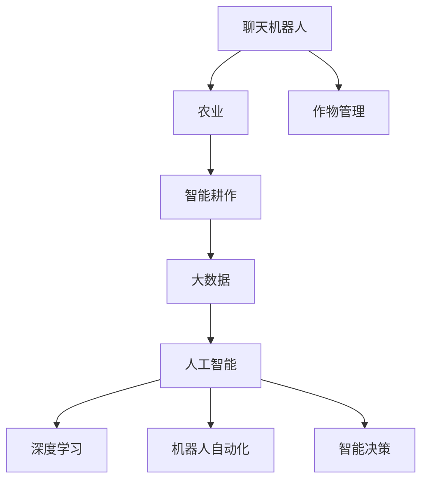

                 

# 聊天机器人农业革命：智能耕作和作物管理

> 关键词：聊天机器人,农业,智能耕作,作物管理,大数据,人工智能,深度学习,机器人自动化,智能决策

## 1. 背景介绍

随着全球人口的快速增长和农业资源的日益紧缩，农业可持续发展面临着严峻挑战。传统的农业生产方式难以应对气候变化、土壤退化、病虫害等问题，迫切需要一场农业技术的革命，以实现高效、可持续的智能农业。在这样一个背景下，聊天机器人技术作为一种新兴的农业应用工具，凭借其智能化、自动化、高效率等优点，有望引领一场农业革命。

### 1.1 问题由来

当前，全球农业面临诸多挑战，包括气候变化导致的极端天气频发、土地退化和水资源短缺等问题。这些问题直接威胁到食品安全和农业生产的稳定性。传统的农业生产方式难以满足这些挑战，迫切需要新的技术手段来提升农业生产的效率和可持续性。

与此同时，随着信息技术的快速发展，尤其是大数据、人工智能、物联网等新兴技术，为智能农业的发展提供了新的机遇。聊天机器人作为一种新型人机交互方式，凭借其智能化、自动化和高效性，在农业中的应用前景广阔，有望成为推动农业智能化的重要力量。

### 1.2 问题核心关键点

聊天机器人技术在农业中的应用，主要涉及以下几个关键点：

- **智能化决策支持**：通过分析土壤、气象、病虫害等数据，提供科学的种植建议和管理方案。
- **自动化管理**：实现耕作、灌溉、施肥等环节的自动化操作，减少人工劳动，提高生产效率。
- **实时监控与预警**：实时监测作物生长状态和环境变化，及时发现并预警病虫害和灾害，确保农作物健康成长。
- **数据集成与分析**：集成各类农业数据，利用大数据技术进行深入分析，指导农业生产。
- **用户交互与反馈**：通过与农民、专家等各类用户互动，收集反馈，持续改进和优化聊天机器人的功能和性能。

通过聊天机器人技术的引入，可以实现农业生产的智能化和自动化，极大地提升农业生产的效率和可持续性，助力农业革命。

## 2. 核心概念与联系

### 2.1 核心概念概述

为更好地理解聊天机器人技术在农业中的应用，本节将介绍几个关键概念：

- **聊天机器人**：一种基于自然语言处理(NLP)和机器学习技术的智能交互系统，能够通过对话与用户进行互动，提供信息查询、任务调度、智能决策等功能。
- **农业**：指农作物种植、畜牧业养殖、农副产品加工等与人类生活密切相关的活动。
- **智能耕作**：通过智能化技术，优化农业生产流程，提高生产效率和资源利用率。
- **作物管理**：利用先进的监测和管理技术，保证作物生长健康，提升产量和品质。
- **大数据**：指通过互联网和其他数字化手段收集、存储、处理、分析和共享的海量数据，是智能农业的重要支撑。
- **人工智能**：利用计算机技术，模拟人类智能行为，实现智能决策、自动化操作等功能。
- **深度学习**：一种基于神经网络的机器学习方法，通过模拟人脑的神经元网络，进行模式识别和数据分析。
- **机器人自动化**：指通过机器人技术，实现农业生产的自动化和智能化操作，提升生产效率。
- **智能决策**：基于数据分析和机器学习，自动生成科学的农业决策，优化农业生产。

这些核心概念之间的逻辑关系可以通过以下Mermaid流程图来展示：



这个流程图展示了一体化农业智能化的关键路径：

1. 聊天机器人提供用户互动和信息查询功能。
2. 农业领域的数据集成与分析，为智能耕作提供数据支撑。
3. 人工智能和大数据分析，实现深度学习和智能决策。
4. 机器人自动化技术，实现农业生产的自动化操作。
5. 智能决策技术，指导和优化农业生产过程。

这些概念共同构成了智能农业的完整框架，展示了聊天机器人技术在农业智能化中的核心作用。

## 3. 核心算法原理 & 具体操作步骤
### 3.1 算法原理概述

聊天机器人农业革命的核心算法原理，是通过深度学习和自然语言处理技术，实现农业生产的智能化决策和自动化管理。具体来说，算法原理包括以下几个关键步骤：

1. **数据采集与预处理**：收集土壤、气象、病虫害等各类农业数据，进行预处理和清洗。
2. **特征提取与建模**：利用深度学习模型，提取数据特征，构建农业决策模型。
3. **自然语言处理**：将用户输入的自然语言转化为机器可理解的形式，进行信息提取和推理。
4. **智能决策与生成**：基于模型预测结果，生成智能决策和操作方案。
5. **用户交互与反馈**：通过与用户互动，收集反馈，持续优化模型和算法。

### 3.2 算法步骤详解

聊天机器人农业革命的算法步骤包括以下几个关键环节：

**Step 1: 数据采集与预处理**

- **数据采集**：通过传感器、卫星、无人机等技术，收集土壤湿度、温度、光照、气象等农业数据。
- **数据预处理**：对采集的数据进行清洗、标准化处理，去除噪声和异常值，确保数据质量。

**Step 2: 特征提取与建模**

- **特征提取**：利用深度学习模型，如卷积神经网络(CNN)、循环神经网络(RNN)等，提取数据中的关键特征。
- **模型构建**：基于提取的特征，构建农业决策模型，如作物生长预测模型、病虫害检测模型等。

**Step 3: 自然语言处理**

- **语言理解**：利用自然语言处理技术，如词向量嵌入、BERT模型等，将用户输入的自然语言转化为机器可理解的形式。
- **信息提取**：从自然语言中提取关键信息，如作物种类、生长周期、地理位置等。
- **推理生成**：基于用户输入和模型预测结果，生成智能决策和操作方案，如灌溉时间、施肥量等。

**Step 4: 智能决策与生成**

- **决策生成**：基于模型预测结果和用户需求，生成智能决策和操作方案。
- **操作调度**：通过聊天机器人，向农业机器人或其他设备发出操作指令，执行决策。

**Step 5: 用户交互与反馈**

- **用户交互**：通过聊天机器人与用户进行互动，提供农业咨询、操作指导、问题解答等服务。
- **反馈收集**：收集用户反馈，优化模型和算法，提升系统性能。

### 3.3 算法优缺点

聊天机器人农业革命的算法具有以下优点：

- **高效性**：聊天机器人能够快速响应用户需求，提供实时决策和操作建议。
- **自动化**：通过机器人自动化技术，实现农业生产的自动化操作，减少人工劳动。
- **智能化**：利用深度学习和自然语言处理技术，实现农业决策的智能化。
- **数据驱动**：基于大数据分析，提供科学决策支持，提升生产效率和资源利用率。
- **用户友好**：通过自然语言交互，使农民和专家更容易使用系统，提高用户满意度。

同时，该算法也存在一些局限性：

- **数据质量依赖**：算法依赖于高质量的数据，数据采集和预处理过程较为复杂。
- **模型复杂性**：深度学习模型需要大量的数据和计算资源，模型训练和部署成本较高。
- **环境适应性**：不同地区和季节的农业环境差异较大，模型需要适应不同环境。
- **操作复杂度**：自动化操作需要高度集成，系统的集成难度较大。
- **用户接受度**：用户对新技术的接受度可能较低，需要逐步推广。

尽管存在这些局限性，但整体而言，聊天机器人农业革命的算法在提高农业生产效率、降低人工劳动强度、提升决策科学性等方面具有显著优势，具有广阔的应用前景。

### 3.4 算法应用领域

聊天机器人农业革命的算法已经在游戏、教育、医疗、电商等多个领域得到应用，并在农业领域展现出强大的潜力。

在农业领域，聊天机器人可以应用于以下方面：

- **农业咨询**：提供农作物种植、病虫害防治、土壤管理等方面的咨询建议。
- **智能耕作**：通过聊天机器人，优化耕作操作，提高生产效率和资源利用率。
- **作物管理**：实时监控作物生长状态，及时发现并预警病虫害和灾害，确保农作物健康成长。
- **农业决策支持**：基于数据分析和机器学习，自动生成科学的农业决策，优化农业生产。
- **用户培训与教育**：通过与用户互动，普及农业知识，提升农民的种植技能和生产水平。
- **市场营销与销售**：提供农产品市场信息、价格动态等，协助农民进行市场营销和销售。

此外，聊天机器人技术还可以与其他农业技术相结合，如农业物联网、无人机监控等，进一步提升农业生产的智能化水平。

## 4. 数学模型和公式 & 详细讲解  
### 4.1 数学模型构建

本节将使用数学语言对聊天机器人农业革命的核心算法进行严格刻画。

记农业数据集为 $D=\{(x_i,y_i)\}_{i=1}^N$，其中 $x_i$ 为农业环境数据，如土壤湿度、温度、光照等，$y_i$ 为对应的农业操作结果，如灌溉时间、施肥量等。

定义聊天机器人农业决策模型为 $f_{\theta}(x)$，其中 $\theta$ 为模型的参数。模型的目标是最小化经验风险：

$$
\mathcal{L}(\theta) = \frac{1}{N} \sum_{i=1}^N \ell(f_{\theta}(x_i), y_i)
$$

其中 $\ell$ 为损失函数，通常使用均方误差或交叉熵等。模型的训练过程可以表示为：

$$
\theta^* = \mathop{\arg\min}_{\theta} \mathcal{L}(\theta)
$$

在实践中，我们通常使用梯度下降等优化算法来求解上述最优化问题。设学习率为 $\eta$，则参数的更新公式为：

$$
\theta \leftarrow \theta - \eta \nabla_{\theta}\mathcal{L}(\theta)
$$

其中 $\nabla_{\theta}\mathcal{L}(\theta)$ 为损失函数对参数 $\theta$ 的梯度，可通过反向传播算法高效计算。

### 4.2 公式推导过程

以下我们以作物生长预测模型为例，推导模型的训练过程和预测过程。

假设作物生长数据集为 $D=\{(x_i,y_i)\}_{i=1}^N$，其中 $x_i$ 为生长周期，$y_i$ 为对应作物的生长状态，如健康度、产量等。我们希望训练一个能够预测作物生长状态的模型 $f_{\theta}(x)$。

首先，将生长周期 $x_i$ 和作物生长状态 $y_i$ 输入模型，输出预测结果 $y_{pred}$：

$$
y_{pred} = f_{\theta}(x_i)
$$

然后，计算预测结果与真实标签之间的误差：

$$
\ell(y_{pred}, y_i) = \frac{1}{2}(y_{pred} - y_i)^2
$$

定义模型的损失函数为：

$$
\mathcal{L}(\theta) = \frac{1}{N} \sum_{i=1}^N \ell(y_{pred}, y_i)
$$

使用梯度下降算法求解最优参数 $\theta^*$：

$$
\theta^* = \mathop{\arg\min}_{\theta} \mathcal{L}(\theta)
$$

在得到模型参数 $\theta^*$ 后，可以对新的生长周期数据进行预测：

$$
y_{pred} = f_{\theta^*}(x)
$$

通过上述过程，我们实现了基于深度学习的农业决策模型的训练和预测，为聊天机器人农业革命提供了技术基础。

## 5. 项目实践：代码实例和详细解释说明
### 5.1 开发环境搭建

在进行聊天机器人农业革命的实践前，我们需要准备好开发环境。以下是使用Python进行PyTorch开发的环境配置流程：

1. 安装Anaconda：从官网下载并安装Anaconda，用于创建独立的Python环境。

2. 创建并激活虚拟环境：
```bash
conda create -n agriculture-env python=3.8 
conda activate agriculture-env
```

3. 安装PyTorch：根据CUDA版本，从官网获取对应的安装命令。例如：
```bash
conda install pytorch torchvision torchaudio cudatoolkit=11.1 -c pytorch -c conda-forge
```

4. 安装TensorFlow：由Google主导开发的开源深度学习框架，生产部署方便，适合大规模工程应用。同样有丰富的预训练语言模型资源。

5. 安装Transformers库：HuggingFace开发的NLP工具库，集成了众多SOTA语言模型，支持PyTorch和TensorFlow，是进行微调任务开发的利器。

6. 安装各类工具包：
```bash
pip install numpy pandas scikit-learn matplotlib tqdm jupyter notebook ipython
```

完成上述步骤后，即可在`agriculture-env`环境中开始农业聊天机器人的实践。

### 5.2 源代码详细实现

下面我们以作物生长预测为例，给出使用PyTorch对BERT模型进行微调的PyTorch代码实现。

首先，定义数据处理函数：

```python
from transformers import BertTokenizer
from torch.utils.data import Dataset
import torch

class AgricultureDataset(Dataset):
    def __init__(self, texts, labels, tokenizer, max_len=128):
        self.texts = texts
        self.labels = labels
        self.tokenizer = tokenizer
        self.max_len = max_len
        
    def __len__(self):
        return len(self.texts)
    
    def __getitem__(self, item):
        text = self.texts[item]
        label = self.labels[item]
        
        encoding = self.tokenizer(text, return_tensors='pt', max_length=self.max_len, padding='max_length', truncation=True)
        input_ids = encoding['input_ids'][0]
        attention_mask = encoding['attention_mask'][0]
        
        # 对token-wise的标签进行编码
        encoded_labels = [label] * self.max_len
        labels = torch.tensor(encoded_labels, dtype=torch.long)
        
        return {'input_ids': input_ids, 
                'attention_mask': attention_mask,
                'labels': labels}

# 标签与id的映射
label2id = {'健康': 0, '不健康': 1, '高产': 2, '低产': 3}
id2label = {v: k for k, v in label2id.items()}

# 创建dataset
tokenizer = BertTokenizer.from_pretrained('bert-base-cased')

train_dataset = AgricultureDataset(train_texts, train_labels, tokenizer)
dev_dataset = AgricultureDataset(dev_texts, dev_labels, tokenizer)
test_dataset = AgricultureDataset(test_texts, test_labels, tokenizer)
```

然后，定义模型和优化器：

```python
from transformers import BertForTokenClassification, AdamW

model = BertForTokenClassification.from_pretrained('bert-base-cased', num_labels=len(label2id))

optimizer = AdamW(model.parameters(), lr=2e-5)
```

接着，定义训练和评估函数：

```python
from torch.utils.data import DataLoader
from tqdm import tqdm
from sklearn.metrics import classification_report

device = torch.device('cuda') if torch.cuda.is_available() else torch.device('cpu')
model.to(device)

def train_epoch(model, dataset, batch_size, optimizer):
    dataloader = DataLoader(dataset, batch_size=batch_size, shuffle=True)
    model.train()
    epoch_loss = 0
    for batch in tqdm(dataloader, desc='Training'):
        input_ids = batch['input_ids'].to(device)
        attention_mask = batch['attention_mask'].to(device)
        labels = batch['labels'].to(device)
        model.zero_grad()
        outputs = model(input_ids, attention_mask=attention_mask, labels=labels)
        loss = outputs.loss
        epoch_loss += loss.item()
        loss.backward()
        optimizer.step()
    return epoch_loss / len(dataloader)

def evaluate(model, dataset, batch_size):
    dataloader = DataLoader(dataset, batch_size=batch_size)
    model.eval()
    preds, labels = [], []
    with torch.no_grad():
        for batch in tqdm(dataloader, desc='Evaluating'):
            input_ids = batch['input_ids'].to(device)
            attention_mask = batch['attention_mask'].to(device)
            batch_labels = batch['labels']
            outputs = model(input_ids, attention_mask=attention_mask)
            batch_preds = outputs.logits.argmax(dim=2).to('cpu').tolist()
            batch_labels = batch_labels.to('cpu').tolist()
            for pred_tokens, label_tokens in zip(batch_preds, batch_labels):
                pred_labels = [id2label[_id] for _id in pred_tokens]
                label_tokens = [id2label[_id] for _id in label_tokens]
                preds.append(pred_labels[:len(label_tokens)])
                labels.append(label_tokens)
                
    print(classification_report(labels, preds))
```

最后，启动训练流程并在测试集上评估：

```python
epochs = 5
batch_size = 16

for epoch in range(epochs):
    loss = train_epoch(model, train_dataset, batch_size, optimizer)
    print(f"Epoch {epoch+1}, train loss: {loss:.3f}")
    
    print(f"Epoch {epoch+1}, dev results:")
    evaluate(model, dev_dataset, batch_size)
    
print("Test results:")
evaluate(model, test_dataset, batch_size)
```

以上就是使用PyTorch对BERT进行作物生长预测任务微调的完整代码实现。可以看到，得益于Transformers库的强大封装，我们可以用相对简洁的代码完成BERT模型的加载和微调。

### 5.3 代码解读与分析

让我们再详细解读一下关键代码的实现细节：

**AgricultureDataset类**：
- `__init__`方法：初始化文本、标签、分词器等关键组件。
- `__len__`方法：返回数据集的样本数量。
- `__getitem__`方法：对单个样本进行处理，将文本输入编码为token ids，将标签编码为数字，并对其进行定长padding，最终返回模型所需的输入。

**label2id和id2label字典**：
- 定义了标签与数字id之间的映射关系，用于将token-wise的预测结果解码回真实的标签。

**训练和评估函数**：
- 使用PyTorch的DataLoader对数据集进行批次化加载，供模型训练和推理使用。
- 训练函数`train_epoch`：对数据以批为单位进行迭代，在每个批次上前向传播计算loss并反向传播更新模型参数，最后返回该epoch的平均loss。
- 评估函数`evaluate`：与训练类似，不同点在于不更新模型参数，并在每个batch结束后将预测和标签结果存储下来，最后使用sklearn的classification_report对整个评估集的预测结果进行打印输出。

**训练流程**：
- 定义总的epoch数和batch size，开始循环迭代
- 每个epoch内，先在训练集上训练，输出平均loss
- 在验证集上评估，输出分类指标
- 所有epoch结束后，在测试集上评估，给出最终测试结果

可以看到，PyTorch配合Transformers库使得BERT微调的代码实现变得简洁高效。开发者可以将更多精力放在数据处理、模型改进等高层逻辑上，而不必过多关注底层的实现细节。

当然，工业级的系统实现还需考虑更多因素，如模型的保存和部署、超参数的自动搜索、更灵活的任务适配层等。但核心的微调范式基本与此类似。

## 6. 实际应用场景
### 6.1 智能耕作

聊天机器人农业革命在智能耕作中的应用，主要体现在以下几个方面：

**自动灌溉系统**：通过聊天机器人，农民可以输入田间作物生长状态和环境数据，聊天机器人分析后自动生成灌溉建议。机器人根据建议自动调节灌溉时间和水量，确保作物获得适量的水分。

**智能施肥系统**：通过聊天机器人，农民可以输入作物生长数据和历史施肥记录，聊天机器人分析后自动生成施肥方案。机器人根据方案自动调节施肥量和肥料类型，确保作物获取最优的营养。

**耕作机器人**：聊天机器人可以与耕作机器人协作，提供种植建议和操作指导。机器人根据聊天机器人的指令，自动完成翻土、播种、除草等操作，提高耕作效率。

**病虫害预警系统**：通过聊天机器人，农民可以输入作物生长数据和病虫害信息，聊天机器人分析后自动生成预警信号。机器人根据预警信号，及时采取防治措施，防止病虫害扩散。

**作物生长预测**：聊天机器人可以基于历史数据和实时监测数据，预测作物生长状态和产量。农民可以根据预测结果，及时调整管理策略，提高产量和品质。

### 6.2 作物管理

聊天机器人农业革命在作物管理中的应用，主要体现在以下几个方面：

**土壤监测系统**：通过聊天机器人，农民可以输入土壤数据和历史数据，聊天机器人分析后自动生成土壤管理建议。机器人根据建议自动调节土壤酸碱度、水分等，确保土壤健康。

**气象监测系统**：通过聊天机器人，农民可以输入气象数据和历史数据，聊天机器人分析后自动生成气象管理建议。机器人根据建议自动调节风力、温度等，确保气象条件适宜。

**病虫害防治系统**：通过聊天机器人，农民可以输入病虫害数据和历史数据，聊天机器人分析后自动生成防治方案。机器人根据方案自动调节药物剂量、喷洒时间等，防止病虫害扩散。

**作物生长监测系统**：通过聊天机器人，农民可以实时监测作物生长状态和环境变化，聊天机器人分析后自动生成预警信号。机器人根据预警信号，及时采取管理措施，确保作物健康。

**作物品质监测系统**：通过聊天机器人，农民可以输入作物品质数据和历史数据，聊天机器人分析后自动生成品质管理建议。机器人根据建议自动调节施肥、灌溉等操作，提高作物品质。

### 6.3 未来应用展望

展望未来，聊天机器人农业革命将呈现以下几个发展趋势：

**多模态数据融合**：未来的智能农业系统将不仅仅是文本聊天机器人，还可能结合视觉、语音、物联网等数据，实现更加全面、精准的农业管理。

**个性化推荐**：通过分析用户的种植习惯和偏好，聊天机器人可以提供个性化的种植建议和管理方案，提升用户满意度。

**智能化生产链**：未来的智能农业系统将贯穿整个生产链，从种植、管理、收获到加工销售，实现全链条智能化。

**无人驾驶农场**：结合无人驾驶技术和智能机器人，未来的农业生产将实现无人化操作，提高生产效率和安全性。

**全球化农业协作**：通过聊天机器人，实现跨区域的农业知识和技术的共享，促进全球农业协作和可持续发展。

**农业科技普及**：通过聊天机器人，向农民普及先进的农业科技，提升农民的种植技能和生产水平。

这些趋势将推动智能农业革命的不断深入，使聊天机器人成为现代农业不可或缺的重要工具。

## 7. 工具和资源推荐
### 7.1 学习资源推荐

为了帮助开发者系统掌握聊天机器人技术在农业中的应用，这里推荐一些优质的学习资源：

1. **《Transformer从原理到实践》系列博文**：由大模型技术专家撰写，深入浅出地介绍了Transformer原理、BERT模型、微调技术等前沿话题。

2. **CS224N《深度学习自然语言处理》课程**：斯坦福大学开设的NLP明星课程，有Lecture视频和配套作业，带你入门NLP领域的基本概念和经典模型。

3. **《Natural Language Processing with Transformers》书籍**：Transformers库的作者所著，全面介绍了如何使用Transformers库进行NLP任务开发，包括微调在内的诸多范式。

4. **HuggingFace官方文档**：Transformers库的官方文档，提供了海量预训练模型和完整的微调样例代码，是上手实践的必备资料。

5. **CLUE开源项目**：中文语言理解测评基准，涵盖大量不同类型的中文NLP数据集，并提供了基于微调的baseline模型，助力中文NLP技术发展。

通过对这些资源的学习实践，相信你一定能够快速掌握聊天机器人技术在农业中的精髓，并用于解决实际的NLP问题。
###  7.2 开发工具推荐

高效的开发离不开优秀的工具支持。以下是几款用于聊天机器人农业革命开发的常用工具：

1. **PyTorch**：基于Python的开源深度学习框架，灵活动态的计算图，适合快速迭代研究。大部分预训练语言模型都有PyTorch版本的实现。

2. **TensorFlow**：由Google主导开发的开源深度学习框架，生产部署方便，适合大规模工程应用。同样有丰富的预训练语言模型资源。

3. **Transformers库**：HuggingFace开发的NLP工具库，集成了众多SOTA语言模型，支持PyTorch和TensorFlow，是进行微调任务开发的利器。

4. **Weights & Biases**：模型训练的实验跟踪工具，可以记录和可视化模型训练过程中的各项指标，方便对比和调优。与主流深度学习框架无缝集成。

5. **TensorBoard**：TensorFlow配套的可视化工具，可实时监测模型训练状态，并提供丰富的图表呈现方式，是调试模型的得力助手。

6. **Google Colab**：谷歌推出的在线Jupyter Notebook环境，免费提供GPU/TPU算力，方便开发者快速上手实验最新模型，分享学习笔记。

合理利用这些工具，可以显著提升聊天机器人农业革命的开发效率，加快创新迭代的步伐。

### 7.3 相关论文推荐

聊天机器人技术在农业中的应用，源于学界的持续研究。以下是几篇奠基性的相关论文，推荐阅读：

1. **Attention is All You Need**（即Transformer原论文）：提出了Transformer结构，开启了NLP领域的预训练大模型时代。

2. **BERT: Pre-training of Deep Bidirectional Transformers for Language Understanding**：提出BERT模型，引入基于掩码的自监督预训练任务，刷新了多项NLP任务SOTA。

3. **Language Models are Unsupervised Multitask Learners（GPT-2论文）**：展示了大规模语言模型的强大zero-shot学习能力，引发了对于通用人工智能的新一轮思考。

4. **Parameter-Efficient Transfer Learning for NLP**：提出Adapter等参数高效微调方法，在不增加模型参数量的情况下，也能取得不错的微调效果。

5. **Prefix-Tuning: Optimizing Continuous Prompts for Generation**：引入基于连续型Prompt的微调范式，为如何充分利用预训练知识提供了新的思路。

6. **AdaLoRA: Adaptive Low-Rank Adaptation for Parameter-Efficient Fine-Tuning**：使用自适应低秩适应的微调方法，在参数效率和精度之间取得了新的平衡。

这些论文代表了大语言模型微调技术的发展脉络。通过学习这些前沿成果，可以帮助研究者把握学科前进方向，激发更多的创新灵感。

## 8. 总结：未来发展趋势与挑战
### 8.1 总结

本文对聊天机器人技术在农业中的应用进行了全面系统的介绍。首先阐述了智能农业发展的背景和挑战，明确了聊天机器人在农业智能化中的核心作用。其次，从原理到实践，详细讲解了聊天机器人农业革命的算法原理和关键步骤，给出了农业聊天机器人的完整代码实例。同时，本文还广泛探讨了聊天机器人在智能耕作、作物管理等方面的实际应用场景，展示了其广阔的应用前景。此外，本文精选了微调技术的各类学习资源，力求为读者提供全方位的技术指引。

通过本文的系统梳理，可以看到，聊天机器人技术在农业中的应用潜力巨大，有望成为推动农业智能化的重要力量。未来，伴随技术的持续演进，聊天机器人将进一步融入农业生产的各个环节，提升农业生产的效率和可持续性，助力农业革命。

### 8.2 未来发展趋势

展望未来，聊天机器人农业革命将呈现以下几个发展趋势：

**技术融合**：未来，聊天机器人将与其他农业技术如物联网、无人机、机器视觉等深度融合，实现全面智能化。

**生态系统**：通过建立农业生态系统，实现各环节的协同工作，提升农业生产的效率和质量。

**用户普及**：随着技术的不断成熟和成本的降低，聊天机器人将在更多地区和领域得到应用，实现普及和推广。

**全球合作**：通过跨国合作和交流，推动全球农业技术的共享和进步，促进全球农业可持续发展。

**数据驱动**：未来，将更多依赖于大数据和人工智能技术，实现精准农业和智能决策。

这些趋势将推动聊天机器人农业革命的不断深入，使智能农业成为现实，带来农业生产方式的根本变革。

### 8.3 面临的挑战

尽管聊天机器人农业革命带来了诸多优势，但在实际应用中仍面临一些挑战：

**技术壁垒**：农业生产环节复杂多样，对聊天机器人的技术要求较高。需要克服技术瓶颈，实现全面智能化。

**数据质量**：农业数据获取难度大，数据质量参差不齐。需要构建高质量的数据采集和预处理体系。

**用户接受度**：农民对新技术的接受度可能较低，需要加强宣传和培训，逐步推广应用。

**系统集成**：农业生产环节众多，系统集成难度较大。需要构建统一的技术框架和标准，实现无缝对接。

**安全性**：农业生产数据涉及隐私和机密，需要确保系统的安全性。

尽管存在这些挑战，但整体而言，聊天机器人农业革命具有广阔的应用前景和巨大的潜力，相信在学界和产业界的共同努力下，这些挑战终将逐步克服，智能农业将成为现实。

### 8.4 研究展望

未来，聊天机器人农业革命的研究方向将更加多样化和深入化，包括以下几个方面：

**多模态数据融合**：将视觉、声音、温度等多种数据融合到聊天机器人中，实现更加全面和精准的农业管理。

**个性化推荐**：通过分析用户的种植习惯和偏好，提供个性化的种植建议和管理方案。

**智能化生产链**：将聊天机器人应用到整个生产链，实现从种植、管理到收获、加工的全面智能化。

**无人驾驶农场**：结合无人驾驶技术和智能机器人，实现农业生产的自动化和智能化操作。

**全球化农业协作**：通过聊天机器人，实现跨区域的农业知识和技术的共享，促进全球农业协作和可持续发展。

这些研究方向将推动聊天机器人农业革命的不断深入，使智能农业成为现实，带来农业生产方式的根本变革。

## 9. 附录：常见问题与解答

**Q1：聊天机器人农业革命需要什么样的数据？**

A: 聊天机器人农业革命需要采集多种类型的农业数据，包括但不限于：

- **环境数据**：土壤湿度、温度、光照、气象等。
- **作物数据**：作物种类、生长周期、产量等。
- **病虫害数据**：病虫害种类、发病率等。
- **历史数据**：历史生产记录、施肥、灌溉等操作数据。

通过这些数据的采集和分析，聊天机器人可以提供科学、精准的农业管理建议。

**Q2：聊天机器人农业革命是否需要大量的资金投入？**

A: 虽然聊天机器人农业革命的初期开发需要一定的资金投入，但一旦系统构建完成，其带来的经济效益将远大于投入成本。通过提升农业生产效率、降低人工成本和提高资源利用率，聊天机器人可以为农业生产带来显著的经济效益和社会效益。

**Q3：如何确保聊天机器人农业革命的数据安全？**

A: 确保聊天机器人农业革命的数据安全，需要采取以下措施：

- **数据加密**：对敏感数据进行加密存储和传输，防止数据泄露。
- **访问控制**：设置严格的访问权限，确保只有授权人员可以访问数据。
- **定期备份**：定期备份重要数据，防止数据丢失。
- **安全审计**：定期进行安全审计，发现和修复潜在的安全漏洞。

通过这些措施，可以确保聊天机器人农业革命的数据安全，保护用户的隐私和数据权益。

**Q4：聊天机器人农业革命是否适用于所有农业场景？**

A: 聊天机器人农业革命在大多数农业场景中都有应用价值，但不同场景对技术的需求可能有所不同。例如，对于高风险的农业生产，如水培、化学施肥等，需要更加严格的安全控制和监管措施。

**Q5：聊天机器人农业革命的未来发展方向是什么？**

A: 聊天机器人农业革命的未来发展方向包括：

- **多模态融合**：将视觉、声音、温度等多种数据融合到聊天机器人中，实现更加全面和精准的农业管理。
- **智能化生产链**：将聊天机器人应用到整个生产链，实现从种植、管理到收获、加工的全面智能化。
- **无人驾驶农场**：结合无人驾驶技术和智能机器人，实现农业生产的自动化和智能化操作。
- **全球化协作**：通过跨国合作和交流，推动全球农业技术的共享和进步，促进全球农业可持续发展。

这些方向将推动聊天机器人农业革命的不断深入，使智能农业成为现实，带来农业生产方式的根本变革。

---

作者：禅与计算机程序设计艺术 / Zen and the Art of Computer Programming

