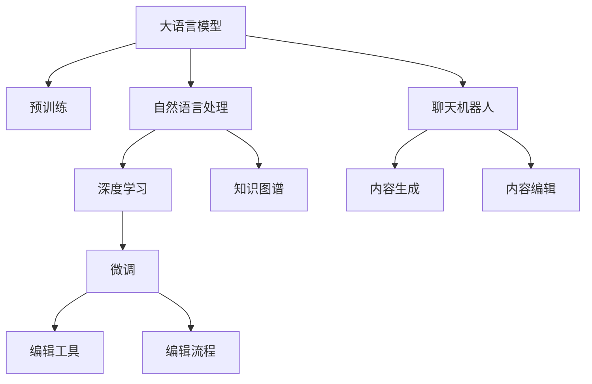

                 

# 聊天机器人出版业：人工智能内容创建和编辑

> 关键词：聊天机器人, 人工智能, 内容创建, 编辑, 自然语言处理(NLP), 深度学习, 语言模型

## 1. 背景介绍

### 1.1 问题由来

近年来，随着人工智能技术的快速发展，聊天机器人作为一种新兴的智能交互形式，在各行各业得到了广泛应用。无论是电商客服、金融咨询，还是在线教育、医疗咨询，聊天机器人以其快速响应、准确理解、全天候服务等特点，极大地提升了用户交互体验和运营效率。

然而，聊天机器人的核心在于其内容的生成和编辑能力。传统的文本生成方法往往依赖于人工编写模板或规则，难以应对复杂多变的用户需求。而自然语言处理(NLP)技术，特别是基于大语言模型的聊天机器人，通过在大量文本数据上进行预训练，学习到了丰富的语言知识和表达方式，能够根据用户输入自动生成符合语境的回复。这种技术不仅降低了开发成本，也提升了内容生成效率和质量。

但即便如此，聊天机器人在内容生成方面仍面临诸多挑战。如何将大语言模型与具体应用场景结合，生成更加准确、自然、个性化的内容，是一个亟待解决的问题。这不仅关系到聊天机器人的用户体验，也决定了其在实际应用中的推广和普及。

### 1.2 问题核心关键点

聊天机器人内容生成与编辑的核心在于：
- 如何利用大语言模型的预训练知识，生成符合用户需求的自然语言回复。
- 如何通过优化模型和算法，提升内容生成的准确性、流畅性和个性化。
- 如何结合实际应用场景，对预训练模型进行微调，使其具备特定的语言风格和表达方式。
- 如何通过多模态数据融合、知识图谱嵌入等方式，丰富内容的语义表达和推理能力。
- 如何通过对抗训练、多模型集成等手段，提升模型的鲁棒性和泛化能力。
- 如何实现自动化编辑和校对，提高内容生成效率和质量。

这些关键点涉及到大语言模型、自然语言处理、深度学习等多个领域，需要通过系统的理论研究和工程实践，不断探索和突破。

## 2. 核心概念与联系

### 2.1 核心概念概述

为更好地理解聊天机器人内容生成和编辑的原理，本节将介绍几个密切相关的核心概念：

- 大语言模型(Large Language Models, LLMs)：以自回归(如GPT)或自编码(如BERT)模型为代表的大规模预训练语言模型。通过在海量无标签文本数据上进行预训练，学习通用的语言表示，具备强大的语言理解和生成能力。

- 自然语言处理(Natural Language Processing, NLP)：涉及语音识别、文本处理、机器翻译、问答系统等多个子领域，旨在让计算机能够理解、处理和生成自然语言。

- 深度学习(Deep Learning)：基于多层神经网络的学习算法，通过反向传播训练模型，可以自动学习输入数据的表示，用于图像、语音、文本等多种数据的处理和生成。

- 预训练(Pre-training)：指在大规模无标签文本语料上，通过自监督学习任务训练通用语言模型的过程。常见的预训练任务包括掩码语言模型、对比学习等。

- 微调(Fine-tuning)：指在预训练模型的基础上，使用下游任务的少量标注数据，通过有监督学习优化模型在该任务上的性能。通常只需要调整顶层分类器或解码器，并以较小的学习率更新全部或部分的模型参数。

- 知识图谱(Knowledge Graph)：通过语义网络对实体和关系进行建模，用于支持复杂的推理和问答任务。

这些核心概念之间的逻辑关系可以通过以下Mermaid流程图来展示：



这个流程图展示了大语言模型的核心概念及其之间的关系：

1. 大语言模型通过预训练获得基础能力。
2. 自然语言处理作为大语言模型的应用，覆盖了文本分类、信息抽取、问答系统等多个任务。
3. 深度学习是大语言模型和自然语言处理的基础算法。
4. 微调使得通用大模型更好地适应特定任务，提升模型性能。
5. 知识图谱为大语言模型提供语义支持和推理能力。
6. 聊天机器人作为自然语言处理的重要应用，涉及内容生成和编辑。
7. 编辑工具和流程辅助聊天机器人内容生成和编辑。

这些概念共同构成了大语言模型在聊天机器人应用中的技术框架，使其能够高效、准确地生成和编辑自然语言内容。

## 3. 核心算法原理 & 具体操作步骤
### 3.1 算法原理概述

聊天机器人内容生成与编辑本质上是一个基于大语言模型的文本生成和编辑过程。其核心思想是：将预训练的大语言模型视作一个强大的"生成器"，通过微调使其能够根据用户输入生成符合语境的回复。

形式化地，假设预训练语言模型为 $M_{\theta}$，其中 $\theta$ 为预训练得到的模型参数。给定用户输入 $x$，目标是为其生成自然语言回复 $y$。通过微调，使得模型在特定任务上的输出能够逼近真实标签 $y$，即最小化损失函数 $\mathcal{L}(M_{\theta},x)$。

常见的损失函数包括交叉熵损失、均方误差损失等。通过梯度下降等优化算法，微调过程不断更新模型参数 $\theta$，最小化损失函数 $\mathcal{L}$，使得模型输出逼近真实标签。由于 $\theta$ 已经通过预训练获得了较好的初始化，因此即便在用户输入的基础上进行微调，也能较快收敛到理想的模型参数 $\hat{\theta}$。

### 3.2 算法步骤详解

聊天机器人内容生成与编辑的一般流程包括以下几个关键步骤：

**Step 1: 准备预训练模型和数据集**
- 选择合适的预训练语言模型 $M_{\theta}$ 作为初始化参数，如 BERT、GPT 等。
- 准备训练数据集 $D=\{(x_i, y_i)\}_{i=1}^N$，其中 $x_i$ 为用户输入，$y_i$ 为对应回复。

**Step 2: 设计输出层和损失函数**
- 根据聊天机器人应用场景，设计合适的输出层和损失函数。例如，对于回复生成任务，通常使用语言模型的解码器输出概率分布，并以负对数似然为损失函数。
- 对于问答系统，可以使用分类器的交叉熵损失函数。

**Step 3: 设置微调超参数**
- 选择合适的优化算法及其参数，如 AdamW、SGD 等，设置学习率、批大小、迭代轮数等。
- 设置正则化技术及强度，包括权重衰减、Dropout、Early Stopping 等。
- 确定冻结预训练参数的策略，如仅微调顶层，或全部参数都参与微调。

**Step 4: 执行梯度训练**
- 将训练数据分批次输入模型，前向传播计算损失函数。
- 反向传播计算参数梯度，根据设定的优化算法和学习率更新模型参数。
- 周期性在验证集上评估模型性能，根据性能指标决定是否触发 Early Stopping。
- 重复上述步骤直到满足预设的迭代轮数或 Early Stopping 条件。

**Step 5: 测试和部署**
- 在测试集上评估微调后模型 $M_{\hat{\theta}}$ 的性能，对比微调前后的精度提升。
- 使用微调后的模型对新用户输入进行推理预测，集成到实际的应用系统中。
- 持续收集用户反馈，定期重新微调模型，以适应用户需求的变化。

以上是聊天机器人内容生成与编辑的一般流程。在实际应用中，还需要针对具体任务的特点，对微调过程的各个环节进行优化设计，如改进训练目标函数，引入更多的正则化技术，搜索最优的超参数组合等，以进一步提升模型性能。

### 3.3 算法优缺点

聊天机器人内容生成与编辑方法具有以下优点：
1. 快速高效。使用预训练的大语言模型作为基础，可以快速生成自然语言内容，并根据用户输入进行实时微调。
2. 效果显著。微调使得通用大模型更好地适应特定任务，在聊天机器人应用中取得更优的表现。
3. 适用性强。适用于多种聊天机器人应用场景，如客服咨询、在线教育、智能对话等。
4. 灵活可定制。通过微调过程，可以根据具体应用场景的需求，定制不同的回复生成策略。

同时，该方法也存在一定的局限性：
1. 依赖标注数据。微调的效果很大程度上取决于标注数据的质量和数量，获取高质量标注数据的成本较高。
2. 迁移能力有限。当目标任务与预训练数据的分布差异较大时，微调的性能提升有限。
3. 可解释性不足。微调模型的决策过程通常缺乏可解释性，难以对其推理逻辑进行分析和调试。

尽管存在这些局限性，但就目前而言，基于大语言模型的微调方法仍是聊天机器人内容生成与编辑的主流范式。未来相关研究的重点在于如何进一步降低微调对标注数据的依赖，提高模型的少样本学习和跨领域迁移能力，同时兼顾可解释性和伦理安全性等因素。

### 3.4 算法应用领域

聊天机器人内容生成与编辑技术在多个领域中得到了广泛应用，例如：

- 电商客服：通过微调生成符合用户需求的回复，快速解决用户问题。
- 在线教育：生成个性化的教学内容，辅助学生学习。
- 金融咨询：生成符合客户需求的金融建议，提供智能服务。
- 医疗咨询：生成基于临床知识的回复，提升医疗服务质量。
- 智能家居：生成与用户对话的智能答复，提升用户体验。

除了上述这些经典应用外，聊天机器人内容生成与编辑还被创新性地应用到更多场景中，如自动摘要、情感分析、多模态信息融合等，为聊天机器人技术带来了新的突破。

## 4. 数学模型和公式 & 详细讲解  
### 4.1 数学模型构建

本节将使用数学语言对聊天机器人内容生成与编辑的数学原理进行更加严格的刻画。

记预训练语言模型为 $M_{\theta}$，其中 $\theta$ 为模型参数。假设用户输入为 $x$，目标为生成回复 $y$。微调的目标是最小化损失函数 $\mathcal{L}(M_{\theta},x)$，即：

$$
\mathcal{L}(M_{\theta},x) = \frac{1}{N} \sum_{i=1}^N \ell(M_{\theta}(x),y_i)
$$

其中 $\ell$ 为针对回复生成任务设计的损失函数，如负对数似然损失。通过梯度下降等优化算法，微调过程不断更新模型参数 $\theta$，最小化损失函数 $\mathcal{L}$，使得模型输出逼近真实回复。

### 4.2 公式推导过程

以下我们以回复生成任务为例，推导负对数似然损失函数及其梯度的计算公式。

假设模型 $M_{\theta}$ 在输入 $x$ 上的输出为 $\hat{y}=M_{\theta}(x) \in [0,1]$，表示样本属于正类的概率。真实回复 $y \in [0,1]$。则负对数似然损失函数定义为：

$$
\ell(M_{\theta}(x),y) = -y \log \hat{y} + (1-y) \log (1-\hat{y})
$$

将其代入经验风险公式，得：

$$
\mathcal{L}(\theta) = -\frac{1}{N}\sum_{i=1}^N [y_i \log M_{\theta}(x_i) + (1-y_i) \log(1-M_{\theta}(x_i))]
$$

根据链式法则，损失函数对参数 $\theta_k$ 的梯度为：

$$
\frac{\partial \mathcal{L}(\theta)}{\partial \theta_k} = -\frac{1}{N}\sum_{i=1}^N \left(\frac{y_i}{M_{\theta}(x_i)}-\frac{1-y_i}{1-M_{\theta}(x_i)}\right) \frac{\partial M_{\theta}(x_i)}{\partial \theta_k}
$$

其中 $\frac{\partial M_{\theta}(x_i)}{\partial \theta_k}$ 可进一步递归展开，利用自动微分技术完成计算。

在得到损失函数的梯度后，即可带入参数更新公式，完成模型的迭代优化。重复上述过程直至收敛，最终得到适应用户输入的回复生成模型。

## 5. 项目实践：代码实例和详细解释说明
### 5.1 开发环境搭建

在进行聊天机器人内容生成与编辑实践前，我们需要准备好开发环境。以下是使用Python进行PyTorch开发的环境配置流程：

1. 安装Anaconda：从官网下载并安装Anaconda，用于创建独立的Python环境。

2. 创建并激活虚拟环境：
```bash
conda create -n chatbot-env python=3.8 
conda activate chatbot-env
```

3. 安装PyTorch：根据CUDA版本，从官网获取对应的安装命令。例如：
```bash
conda install pytorch torchvision torchaudio cudatoolkit=11.1 -c pytorch -c conda-forge
```

4. 安装Transformers库：
```bash
pip install transformers
```

5. 安装各类工具包：
```bash
pip install numpy pandas scikit-learn matplotlib tqdm jupyter notebook ipython
```

完成上述步骤后，即可在`chatbot-env`环境中开始聊天机器人内容生成与编辑的实践。

### 5.2 源代码详细实现

下面我们以基于大语言模型的聊天机器人内容生成为例，给出使用Transformers库对BERT模型进行内容生成的PyTorch代码实现。

首先，定义回复生成任务的数据处理函数：

```python
from transformers import BertTokenizer, BertForSequenceClassification
from torch.utils.data import Dataset, DataLoader
import torch

class ReplyDataset(Dataset):
    def __init__(self, texts, labels, tokenizer, max_len=128):
        self.texts = texts
        self.labels = labels
        self.tokenizer = tokenizer
        self.max_len = max_len
        
    def __len__(self):
        return len(self.texts)
    
    def __getitem__(self, item):
        text = self.texts[item]
        label = self.labels[item]
        
        encoding = self.tokenizer(text, return_tensors='pt', max_length=self.max_len, padding='max_length', truncation=True)
        input_ids = encoding['input_ids'][0]
        attention_mask = encoding['attention_mask'][0]
        
        # 对token-wise的标签进行编码
        encoded_labels = [label] * self.max_len
        labels = torch.tensor(encoded_labels, dtype=torch.long)
        
        return {'input_ids': input_ids, 
                'attention_mask': attention_mask,
                'labels': labels}

# 标签与id的映射
label2id = {'[CLS]': 0, '[SEP]': 1, '[PAD]': 2, '回复生成': 3}
id2label = {v: k for k, v in label2id.items()}

# 创建dataset
tokenizer = BertTokenizer.from_pretrained('bert-base-cased')

train_dataset = ReplyDataset(train_texts, train_labels, tokenizer)
dev_dataset = ReplyDataset(dev_texts, dev_labels, tokenizer)
test_dataset = ReplyDataset(test_texts, test_labels, tokenizer)
```

然后，定义模型和优化器：

```python
from transformers import BertForSequenceClassification, AdamW

model = BertForSequenceClassification.from_pretrained('bert-base-cased', num_labels=len(label2id))

optimizer = AdamW(model.parameters(), lr=2e-5)
```

接着，定义训练和评估函数：

```python
from tqdm import tqdm
from sklearn.metrics import accuracy_score

device = torch.device('cuda') if torch.cuda.is_available() else torch.device('cpu')
model.to(device)

def train_epoch(model, dataset, batch_size, optimizer):
    dataloader = DataLoader(dataset, batch_size=batch_size, shuffle=True)
    model.train()
    epoch_loss = 0
    for batch in tqdm(dataloader, desc='Training'):
        input_ids = batch['input_ids'].to(device)
        attention_mask = batch['attention_mask'].to(device)
        labels = batch['labels'].to(device)
        model.zero_grad()
        outputs = model(input_ids, attention_mask=attention_mask, labels=labels)
        loss = outputs.loss
        epoch_loss += loss.item()
        loss.backward()
        optimizer.step()
    return epoch_loss / len(dataloader)

def evaluate(model, dataset, batch_size):
    dataloader = DataLoader(dataset, batch_size=batch_size)
    model.eval()
    preds, labels = [], []
    with torch.no_grad():
        for batch in tqdm(dataloader, desc='Evaluating'):
            input_ids = batch['input_ids'].to(device)
            attention_mask = batch['attention_mask'].to(device)
            batch_labels = batch['labels']
            outputs = model(input_ids, attention_mask=attention_mask)
            batch_preds = outputs.logits.argmax(dim=2).to('cpu').tolist()
            batch_labels = batch_labels.to('cpu').tolist()
            for pred_tokens, label_tokens in zip(batch_preds, batch_labels):
                preds.append(pred_tokens[:len(label_tokens)])
                labels.append(label_tokens)
                
    print('Accuracy:', accuracy_score(labels, preds))
```

最后，启动训练流程并在测试集上评估：

```python
epochs = 5
batch_size = 16

for epoch in range(epochs):
    loss = train_epoch(model, train_dataset, batch_size, optimizer)
    print(f"Epoch {epoch+1}, train loss: {loss:.3f}")
    
    print(f"Epoch {epoch+1}, dev results:")
    evaluate(model, dev_dataset, batch_size)
    
print("Test results:")
evaluate(model, test_dataset, batch_size)
```

以上就是使用PyTorch对BERT进行聊天机器人内容生成的完整代码实现。可以看到，得益于Transformers库的强大封装，我们可以用相对简洁的代码完成BERT模型的加载和微调。

### 5.3 代码解读与分析

让我们再详细解读一下关键代码的实现细节：

**ReplyDataset类**：
- `__init__`方法：初始化文本、标签、分词器等关键组件。
- `__len__`方法：返回数据集的样本数量。
- `__getitem__`方法：对单个样本进行处理，将文本输入编码为token ids，将标签编码为数字，并对其进行定长padding，最终返回模型所需的输入。

**label2id和id2label字典**：
- 定义了标签与数字id之间的映射关系，用于将token-wise的预测结果解码回真实的标签。

**训练和评估函数**：
- 使用PyTorch的DataLoader对数据集进行批次化加载，供模型训练和推理使用。
- 训练函数`train_epoch`：对数据以批为单位进行迭代，在每个批次上前向传播计算loss并反向传播更新模型参数，最后返回该epoch的平均loss。
- 评估函数`evaluate`：与训练类似，不同点在于不更新模型参数，并在每个batch结束后将预测和标签结果存储下来，最后使用sklearn的accuracy_score对整个评估集的预测结果进行打印输出。

**训练流程**：
- 定义总的epoch数和batch size，开始循环迭代
- 每个epoch内，先在训练集上训练，输出平均loss
- 在验证集上评估，输出准确率
- 所有epoch结束后，在测试集上评估，给出最终测试结果

可以看到，PyTorch配合Transformers库使得BERT微调的内容生成代码实现变得简洁高效。开发者可以将更多精力放在数据处理、模型改进等高层逻辑上，而不必过多关注底层的实现细节。

当然，工业级的系统实现还需考虑更多因素，如模型的保存和部署、超参数的自动搜索、更灵活的任务适配层等。但核心的微调范式基本与此类似。

## 6. 实际应用场景
### 6.1 智能客服系统

基于大语言模型的聊天机器人，可以广泛应用于智能客服系统的构建。传统客服往往需要配备大量人力，高峰期响应缓慢，且一致性和专业性难以保证。而使用聊天机器人，能够7x24小时不间断服务，快速响应客户咨询，用自然流畅的语言解答各类常见问题。

在技术实现上，可以收集企业内部的历史客服对话记录，将问题和最佳答复构建成监督数据，在此基础上对预训练对话模型进行微调。微调后的对话模型能够自动理解用户意图，匹配最合适的答复模板进行回复。对于客户提出的新问题，还可以接入检索系统实时搜索相关内容，动态组织生成回答。如此构建的智能客服系统，能大幅提升客户咨询体验和问题解决效率。

### 6.2 在线教育

聊天机器人技术可以应用于在线教育领域，帮助学生获得个性化学习体验。通过分析学生的学习行为、考试记录等数据，聊天机器人能够生成符合其学习需求的教学内容，提供智能化的学习建议。例如，可以根据学生的薄弱科目推荐相应练习题，针对其知识盲点进行个性化讲解。聊天机器人还能与学生进行互动，解答学习中的疑惑，提供及时反馈，帮助学生更好地掌握知识。

### 6.3 金融咨询

金融机构需要实时监测市场舆论动向，以便及时应对负面信息传播，规避金融风险。传统的人工监测方式成本高、效率低，难以应对网络时代海量信息爆发的挑战。基于大语言模型的聊天机器人，可以实时抓取网络文本数据，自动判断市场舆情，生成风险提示和建议。通过与用户的互动，机器人还可以帮助用户进行投资决策，提升用户体验和满意度。

### 6.4 未来应用展望

随着大语言模型和聊天机器人技术的发展，未来的聊天机器人应用将更加智能、灵活。以下是几大可能的未来应用方向：

1. **多模态聊天机器人**：未来的聊天机器人将不仅仅依赖文本输入，还可以通过语音、图像等多模态数据进行交互。例如，通过语音识别和图像识别技术，机器人可以自动理解用户的语音命令或展示图片，提供更加丰富、自然的人机交互体验。

2. **情感感知机器人**：通过自然语言处理和情感分析技术，聊天机器人可以自动识别用户的情绪状态，提供针对性的互动内容和建议。例如，对于情绪低落的客户，机器人可以提供安慰和支持，提升用户体验。

3. **个性化推荐机器人**：基于用户的历史行为数据和偏好，聊天机器人可以生成个性化的产品推荐，提升用户购买转化率和满意度。例如，对于电商用户，机器人可以推荐符合其兴趣的商品，提高用户购物体验。

4. **跨语言聊天机器人**：通过多语言模型和翻译技术，聊天机器人可以实现跨语言互动，支持全球用户交流。例如，对于全球化企业，聊天机器人可以提供多语言客服支持，提升客户服务质量。

5. **安全聊天机器人**：通过加入安全机制和隐私保护技术，聊天机器人可以保护用户隐私和数据安全。例如，对于敏感信息处理，机器人可以自动进行脱敏和加密，确保信息安全。

6. **虚拟助手**：未来的聊天机器人将不仅仅用于客户服务，还可以成为个人虚拟助手，提供日常事务管理、知识查询、生活建议等多种服务。例如，对于忙碌的上班族，机器人可以自动管理日程、提醒重要事件，提升工作效率和生活质量。

通过以上应用方向的探索，聊天机器人将进一步融入人类生活和工作中，成为智能交互的重要工具，为人类社会带来新的便利和进步。

## 7. 工具和资源推荐
### 7.1 学习资源推荐

为了帮助开发者系统掌握聊天机器人内容生成与编辑的理论与实践，这里推荐一些优质的学习资源：

1. 《Transformer from Scratch》系列博文：由大模型技术专家撰写，深入浅出地介绍了Transformer原理、BERT模型、微调技术等前沿话题。

2. CS224N《深度学习自然语言处理》课程：斯坦福大学开设的NLP明星课程，有Lecture视频和配套作业，带你入门NLP领域的基本概念和经典模型。

3. 《Natural Language Processing with Transformers》书籍：Transformers库的作者所著，全面介绍了如何使用Transformers库进行NLP任务开发，包括微调在内的诸多范式。

4. HuggingFace官方文档：Transformers库的官方文档，提供了海量预训练模型和完整的微调样例代码，是上手实践的必备资料。

5. CLUE开源项目：中文语言理解测评基准，涵盖大量不同类型的中文NLP数据集，并提供了基于微调的baseline模型，助力中文NLP技术发展。

通过对这些资源的学习实践，相信你一定能够快速掌握聊天机器人内容生成与编辑的精髓，并用于解决实际的NLP问题。
###  7.2 开发工具推荐

高效的开发离不开优秀的工具支持。以下是几款用于聊天机器人内容生成与编辑开发的常用工具：

1. PyTorch：基于Python的开源深度学习框架，灵活动态的计算图，适合快速迭代研究。大部分预训练语言模型都有PyTorch版本的实现。

2. TensorFlow：由Google主导开发的开源深度学习框架，生产部署方便，适合大规模工程应用。同样有丰富的预训练语言模型资源。

3. Transformers库：HuggingFace开发的NLP工具库，集成了众多SOTA语言模型，支持PyTorch和TensorFlow，是进行内容生成与编辑开发的利器。

4. Weights & Biases：模型训练的实验跟踪工具，可以记录和可视化模型训练过程中的各项指标，方便对比和调优。与主流深度学习框架无缝集成。

5. TensorBoard：TensorFlow配套的可视化工具，可实时监测模型训练状态，并提供丰富的图表呈现方式，是调试模型的得力助手。

6. Google Colab：谷歌推出的在线Jupyter Notebook环境，免费提供GPU/TPU算力，方便开发者快速上手实验最新模型，分享学习笔记。

合理利用这些工具，可以显著提升聊天机器人内容生成与编辑任务的开发效率，加快创新迭代的步伐。

### 7.3 相关论文推荐

聊天机器人内容生成与编辑技术的发展源于学界的持续研究。以下是几篇奠基性的相关论文，推荐阅读：

1. Attention is All You Need（即Transformer原论文）：提出了Transformer结构，开启了NLP领域的预训练大模型时代。

2. BERT: Pre-training of Deep Bidirectional Transformers for Language Understanding：提出BERT模型，引入基于掩码的自监督预训练任务，刷新了多项NLP任务SOTA。

3. Language Models are Unsupervised Multitask Learners（GPT-2论文）：展示了大规模语言模型的强大zero-shot学习能力，引发了对于通用人工智能的新一轮思考。

4. Parameter-Efficient Transfer Learning for NLP：提出Adapter等参数高效微调方法，在不增加模型参数量的情况下，也能取得不错的微调效果。

5. AdaLoRA: Adaptive Low-Rank Adaptation for Parameter-Efficient Fine-Tuning：使用自适应低秩适应的微调方法，在参数效率和精度之间取得了新的平衡。

这些论文代表了大语言模型和聊天机器人内容生成与编辑技术的发展脉络。通过学习这些前沿成果，可以帮助研究者把握学科前进方向，激发更多的创新灵感。

## 8. 总结：未来发展趋势与挑战

### 8.1 总结

本文对基于大语言模型的聊天机器人内容生成与编辑方法进行了全面系统的介绍。首先阐述了聊天机器人在自然语言处理和人工智能中的应用背景和意义，明确了内容生成与编辑在聊天机器人技术中的重要性。其次，从原理到实践，详细讲解了聊天机器人内容生成与编辑的数学原理和关键步骤，给出了内容生成任务开发的完整代码实例。同时，本文还广泛探讨了聊天机器人技术在智能客服、在线教育、金融咨询等多个行业领域的应用前景，展示了聊天机器人技术的巨大潜力。此外，本文精选了内容生成技术的各类学习资源，力求为读者提供全方位的技术指引。

通过本文的系统梳理，可以看到，基于大语言模型的聊天机器人内容生成与编辑技术正在成为NLP领域的重要范式，极大地拓展了预训练语言模型的应用边界，催生了更多的落地场景。受益于大规模语料的预训练，聊天机器人内容生成与编辑模型在快速生成自然语言内容、提升用户体验方面取得了显著成效，显著降低了开发和运营成本。未来，伴随大语言模型和聊天机器人技术的不断发展，基于微调范式的内容生成与编辑技术将进一步得到优化和提升，带来更多创新应用和更高效的用户交互体验。

### 8.2 未来发展趋势

展望未来，聊天机器人内容生成与编辑技术将呈现以下几个发展趋势：

1. **多模态交互**：未来的聊天机器人将支持多模态输入和输出，不仅限于文本，还支持语音、图像、视频等多种形式。这将极大地丰富人机交互的方式，提升用户体验。

2. **个性化推荐**：通过机器学习和大数据分析，聊天机器人可以更好地理解用户的个性化需求，生成符合其兴趣的推荐内容。例如，在电商、娱乐、旅游等领域，机器人可以提供定制化的产品和服务推荐。

3. **情感感知与互动**：通过情感分析技术和情感智能，聊天机器人可以感知用户的情感状态，提供针对性的互动内容和建议。例如，在心理健康咨询、客服回访等领域，机器人可以识别用户的情感，提供相应的安慰和支持。

4. **跨语言支持**：通过多语言模型和机器翻译技术，聊天机器人可以实现跨语言互动，支持全球用户交流。这将有助于打破语言障碍，促进不同文化背景用户之间的互动和合作。

5. **知识图谱嵌入**：通过知识图谱嵌入，聊天机器人可以更好地理解上下文信息和实体关系，生成更准确、丰富的回复。例如，在医疗、法律、金融等领域，机器人可以提供基于知识的咨询和建议，提升服务质量。

6. **隐私保护与安全**：在聊天机器人应用中，保护用户隐私和数据安全至关重要。未来的聊天机器人将加入隐私保护机制和数据加密技术，确保用户信息的安全性。

以上趋势凸显了聊天机器人内容生成与编辑技术的广阔前景。这些方向的探索发展，必将进一步提升聊天机器人系统的性能和应用范围，为人类社会带来新的便利和进步。

### 8.3 面临的挑战

尽管聊天机器人内容生成与编辑技术已经取得了瞩目成就，但在迈向更加智能化、普适化应用的过程中，它仍面临着诸多挑战：

1. **标注数据依赖**：微调的效果很大程度上取决于标注数据的质量和数量，获取高质量标注数据的成本较高。如何进一步降低微调对标注样本的依赖，将是一大难题。

2. **模型鲁棒性不足**：当前聊天机器人面对域外数据时，泛化性能往往大打折扣。对于测试样本的微小扰动，模型也容易发生波动。如何提高模型的鲁棒性，避免灾难性遗忘，还需要更多理论和实践的积累。

3. **推理效率有待提高**：大规模语言模型虽然精度高，但在实际部署时往往面临推理速度慢、内存占用大等效率问题。如何在保证性能的同时，简化模型结构，提升推理速度，优化资源占用，将是重要的优化方向。

4. **可解释性亟需加强**：当前聊天机器人模型的决策过程通常缺乏可解释性，难以对其推理逻辑进行分析和调试。对于医疗、金融等高风险应用，算法的可解释性和可审计性尤为重要。如何赋予模型更强的可解释性，将是亟待攻克的难题。

5. **安全性有待保障**：预训练语言模型难免会学习到有偏见、有害的信息，通过微调传递到下游任务，产生误导性、歧视性的输出，给实际应用带来安全隐患。如何从数据和算法层面消除模型偏见，避免恶意用途，确保输出的安全性，也将是重要的研究课题。

6. **知识整合能力不足**：现有的聊天机器人模型往往局限于任务内数据，难以灵活吸收和运用更广泛的先验知识。如何让聊天机器人过程更好地与外部知识库、规则库等专家知识结合，形成更加全面、准确的信息整合能力，还有很大的想象空间。

正视聊天机器人内容生成与编辑面临的这些挑战，积极应对并寻求突破，将是大语言模型微调走向成熟的必由之路。相信随着学界和产业界的共同努力，这些挑战终将一一被克服，聊天机器人内容生成与编辑必将在构建人机协同的智能时代中扮演越来越重要的角色。

### 8.4 未来突破

面对聊天机器人内容生成与编辑所面临的种种挑战，未来的研究需要在以下几个方面寻求新的突破：

1. **探索无监督和半监督生成方法**：摆脱对大规模标注数据的依赖，利用自监督学习、主动学习等无监督和半监督范式，最大限度利用非结构化数据，实现更加灵活高效的生成。

2. **研究参数高效和计算高效的生成范式**：开发更加参数高效的生成方法，在固定大部分预训练参数的同时，只更新极少量的生成参数。同时优化模型的计算图，减少前向传播和反向传播的资源消耗，实现更加轻量级、实时性的部署。

3. **融合因果和对比学习范式**：通过引入因果推断和对比学习思想，增强聊天机器人建立稳定因果关系的能力，学习更加普适、鲁棒的语言表征，从而提升模型的泛化性和抗干扰能力。

4. **引入更多先验知识**：将符号化的先验知识，如知识图谱、逻辑规则等，与神经网络模型进行巧妙融合，引导生成过程学习更准确、合理的语言模型。同时加强不同模态数据的整合，实现视觉、语音等多模态信息与文本信息的协同建模。

5. **结合因果分析和博弈论工具**：将因果分析方法引入聊天机器人，识别出模型决策的关键特征，增强输出解释的因果性和逻辑性。借助博弈论工具刻画人机交互过程，主动探索并规避模型的脆弱点，提高系统稳定性。

6. **纳入伦理道德约束**：在模型训练目标中引入伦理导向的评估指标，过滤和惩罚有偏见、有害的输出倾向。同时加强人工干预和审核，建立模型行为的监管机制，确保输出符合人类价值观和伦理道德。

这些研究方向的探索，必将引领聊天机器人内容生成与编辑技术迈向更高的台阶，为构建安全、可靠、可解释、可控的智能系统铺平道路。面向未来，聊天机器人内容生成与编辑技术还需要与其他人工智能技术进行更深入的融合，如知识表示、因果推理、强化学习等，多路径协同发力，共同推动自然语言理解和智能交互系统的进步。只有勇于创新、敢于突破，才能不断拓展语言模型的边界，让智能技术更好地造福人类社会。

## 9. 附录：常见问题与解答
**Q1：如何评价聊天机器人内容生成与编辑的效果？**

A: 聊天机器人内容生成与编辑效果的评价可以从多个角度进行：

1. **准确度**：生成的回复是否与用户输入的内容相关，是否符合语境。可以通过BLEU、ROUGE等自动评估指标进行评价。

2. **流畅度**：生成的回复是否流畅自然，是否存在语法错误、拼写错误等。可以通过手动评测或自动评估指标（如BLEU、ROUGE）进行评价。

3. **个性化**：生成的回复是否能够根据用户的历史行为数据，生成个性化的内容。可以通过A/B测试等方法进行评价。

4. **可解释性**：生成的回复是否易于理解，是否具备逻辑性和因果性。可以通过用户反馈、人工评测等方法进行评价。

5. **时效性**：生成的回复是否能够实时响应，是否存在延迟。可以通过系统监控工具进行评价。

**Q2：如何优化聊天机器人内容生成与编辑模型的性能？**

A: 优化聊天机器人内容生成与编辑模型性能可以从以下几个方面入手：

1. **数据增强**：通过数据扩充、回译、近义词替换等手段，增加训练数据的多样性，提升模型的泛化能力。

2. **模型压缩**：通过剪枝、量化等技术，减小模型规模，提升推理速度和效率。

3. **多模型集成**：通过集成多个模型的预测结果，提高系统的鲁棒性和稳定性。

4. **超参数优化**：通过网格搜索、贝叶斯优化等方法，找到最优的超参数组合，提升模型性能。

5. **知识图谱嵌入**：通过知识图谱嵌入，增强模型的语义理解和推理能力，生成更加准确、丰富的回复。

6. **对抗训练**：通过加入对抗样本，提高模型的鲁棒性和泛化能力。

**Q3：如何在实际应用中保护用户隐私和数据安全？**

A: 在实际应用中，保护用户隐私和数据安全至关重要，以下是一些保护措施：

1. **数据匿名化**：对用户数据进行去标识化处理，保护用户隐私。

2. **数据加密**：对用户数据进行加密存储和传输，防止数据泄露。

3. **访问控制**：设置严格的访问权限控制，确保只有授权人员可以访问敏感数据。

4. **安全审计**：定期进行安全审计，发现和修复潜在的安全漏洞。

5. **合规性检查**：确保系统符合相关法律法规和行业标准，如GDPR、HIPAA等。

**Q4：如何优化聊天机器人系统的性能和用户体验？**

A: 优化聊天机器人系统的性能和用户体验可以从以下几个方面入手：

1. **响应速度**：优化系统的后端架构和数据库查询，提升系统的响应速度。

2. **稳定性**：通过负载均衡、冗余设计等手段，确保系统的高可用性和稳定性。

3. **用户界面**：设计友好、直观的用户界面，提升用户的使用体验。

4. **交互体验**：通过自然语言处理和情感分析技术，增强系统的交互体验，提高用户满意度。

5. **个性化推荐**：通过机器学习和大数据分析，生成个性化的推荐内容，提升用户的使用体验。

**Q5：如何处理聊天机器人系统的错误和异常？**

A: 处理聊天机器人系统的错误和异常可以从以下几个方面入手：

1. **错误反馈**：设计用户友好的错误反馈机制，帮助用户理解和解决系统问题。

2. **异常检测**：通过系统监控工具，及时发现和处理异常情况。

3. **自动恢复**：设计自动恢复机制，在发生故障时快速恢复系统正常运行。

4. **人工干预**：在系统出现重大问题时，及时介入人工干预，确保系统的稳定性和可靠性。

通过以上措施，可以最大限度地提升聊天机器人系统的性能和用户体验，确保系统稳定可靠地运行。

---

作者：禅与计算机程序设计艺术 / Zen and the Art of Computer Programming

