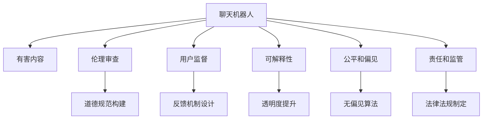

                 

# 聊天机器人道德规范：避免有害内容

> 关键词：聊天机器人,道德规范,有害内容,伦理审查,用户监督,可解释性

## 1. 背景介绍

### 1.1 问题由来

近年来，随着人工智能(AI)技术的飞速发展，聊天机器人已经广泛应用于客服、娱乐、教育等多个领域。这些机器人通过模仿人类对话，能够提供即时、个性化的服务。然而，聊天机器人在带来便利的同时，也引发了一系列道德和伦理问题。比如，有些机器人可能会传播有害内容，甚至进行欺诈行为，给用户造成困扰和损失。因此，建立一个健全的道德规范体系，确保聊天机器人的健康发展，变得至关重要。

### 1.2 问题核心关键点

聊天机器人的道德规范问题主要集中在以下几个方面：

- **有害内容传播**：机器人可能会传播仇恨言论、暴力内容、虚假信息等，对社会稳定和个人心理健康构成威胁。
- **隐私和数据安全**：机器人需要处理大量用户数据，涉及用户隐私和数据安全的保护问题。
- **算法透明度和可解释性**：机器人的决策过程往往是“黑盒”的，缺乏可解释性，用户难以理解和监督。
- **公平和偏见**：机器人的训练数据可能存在偏见，导致其输出结果不公正，对某些群体产生歧视。
- **责任和监管**：机器人错误导致的损害责任归属问题，以及相应的法律法规制定和监管措施。

这些问题不仅关系到聊天机器人的商业可持续性，更影响到社会公共利益和用户权益。因此，制定一套科学的道德规范体系，对聊天机器人进行伦理审查和用户监督，是当前亟待解决的重要任务。

### 1.3 问题研究意义

制定聊天机器人的道德规范体系，对于保障用户权益、维护社会稳定、推动AI技术健康发展具有重要意义：

1. **保障用户权益**：通过道德规范，限制机器人传播有害内容，保护用户隐私和数据安全，增强用户对聊天机器人的信任感。
2. **维护社会稳定**：避免机器人传播虚假信息和暴力内容，防止引发社会动荡，促进社会和谐。
3. **推动AI技术发展**：规范聊天机器人的开发和应用，促进AI技术的可持续发展，提升AI技术的社会价值。
4. **增强算法透明度**：提高机器人的算法透明度和可解释性，使用户能够理解和监督机器人的决策过程，增强系统的可信度。
5. **落实监管责任**：明确机器人的责任归属，建立健全法律法规体系，加强对聊天机器人的监管和治理。

## 2. 核心概念与联系

### 2.1 核心概念概述

为更好地理解聊天机器人道德规范的构建过程，本节将介绍几个密切相关的核心概念：

- **聊天机器人**：基于自然语言处理(NLP)技术，能够模拟人类对话，提供即时、个性化服务的AI系统。
- **有害内容**：指那些可能引发仇恨、暴力、欺诈、虚假信息等问题的语言内容。
- **伦理审查**：对聊天机器人的设计、开发和使用进行伦理评估和规范指导，确保其符合社会道德标准。
- **用户监督**：鼓励用户参与聊天机器人的开发和应用，通过用户反馈和行为监督，提升系统的社会责任。
- **可解释性**：聊天机器人应具备一定的透明度和可解释性，使用户能够理解和监督其决策过程。
- **公平和偏见**：确保机器人在训练和应用中不产生歧视，对所有用户公平对待。
- **责任和监管**：明确聊天机器人的责任归属，建立健全法律法规体系，加强对机器人的监管和治理。

这些核心概念之间的逻辑关系可以通过以下Mermaid流程图来展示：



这个流程图展示出聊天机器人道德规范的构建过程，以及各个核心概念之间的关系：

1. 聊天机器人通过伦理审查和用户监督，构建道德规范体系。
2. 有害内容通过伦理审查和无偏见算法得到限制和消除。
3. 可解释性通过透明度提升和反馈机制设计得到增强。
4. 公平和偏见通过无偏见算法和法律法规制定得到保障。
5. 责任和监管通过法律法规制定和用户监督得到落实。

## 3. 核心算法原理 & 具体操作步骤

### 3.1 算法原理概述

聊天机器人道德规范的构建，本质上是一个多目标优化问题。其核心思想是通过算法和技术手段，实现聊天机器人在有害内容传播、隐私保护、算法透明度、公平性和责任归属等方面的约束和优化。具体来说，包括以下几个关键步骤：

1. **有害内容检测与过滤**：使用自然语言处理技术，对聊天机器人生成的文本进行有害内容检测和过滤，防止其传播负面信息。
2. **隐私保护和数据安全**：通过加密、去标识化等手段，保护用户的隐私和数据安全。
3. **算法透明度和可解释性**：引入可解释性算法和工具，增强机器人的决策透明度，使用户能够理解和监督其行为。
4. **公平性和无偏见算法**：使用无偏见的数据集和算法，确保机器人在处理不同用户时保持公平性。
5. **责任和监管机制**：建立健全法律法规体系，明确机器人的责任归属，加强对其监管和治理。

### 3.2 算法步骤详解

**Step 1: 有害内容检测与过滤**

1. **文本预处理**：将聊天机器人生成的文本进行分词、去除停用词、词性标注等预处理。
2. **有害内容识别**：使用自然语言处理技术，识别出文本中的有害内容，如仇恨言论、暴力内容、虚假信息等。
3. **过滤与处理**：根据识别结果，将有害内容进行过滤或处理，防止其传播。

**Step 2: 隐私保护和数据安全**

1. **数据加密**：对用户的个人数据进行加密处理，防止未经授权的访问和泄露。
2. **去标识化**：将用户的个人信息进行去标识化处理，保护用户隐私。
3. **访问控制**：建立严格的访问控制机制，确保只有授权人员能够访问和处理用户数据。

**Step 3: 算法透明度和可解释性**

1. **可解释性算法**：使用可解释性算法（如LIME、SHAP等），对机器人的决策过程进行解释和可视化。
2. **用户反馈机制**：建立用户反馈机制，收集用户对机器人行为的评价和建议，不断改进和优化。

**Step 4: 公平性和无偏见算法**

1. **数据集清洗**：对训练数据进行清洗和筛选，去除偏见和噪声数据。
2. **无偏见算法**：使用无偏见算法（如Fairness-aware Training），训练公平和无偏见的聊天机器人。

**Step 5: 责任和监管机制**

1. **法律法规制定**：制定针对聊天机器人的法律法规，明确其责任归属和行为规范。
2. **监管机构设立**：建立专门的监管机构，对聊天机器人的应用进行监督和评估。
3. **用户监督机制**：鼓励用户参与机器人行为的监督，及时举报违规行为。

### 3.3 算法优缺点

**优点**：
- 减少有害内容传播：通过有害内容检测与过滤，防止负面信息传播，保护社会稳定和个人心理健康。
- 保护用户隐私和数据安全：通过加密和去标识化技术，保护用户隐私和数据安全，增强用户信任。
- 增强算法透明度和可解释性：通过可解释性算法和用户反馈机制，提高机器人的透明度和可信度。
- 确保公平和无偏见：通过无偏见算法和法律法规制定，确保机器人的决策公平性和无偏见性。
- 明确责任和监管：通过法律法规和监管机构，明确机器人的责任归属，加强监管和治理。

**缺点**：
- 技术复杂度高：有害内容检测与过滤、隐私保护、算法透明度等技术实现较为复杂，需要大量资源和专业知识。
- 用户监督难度大：用户监督机制需要依赖用户的积极参与，难以实现全面覆盖。
- 法律法规滞后：现有的法律法规可能无法完全覆盖聊天机器人的新型应用场景，需要持续更新和完善。
- 算法偏见仍存：无偏见算法虽然能够减少偏见，但仍难以完全消除，需要持续监控和改进。

### 3.4 算法应用领域

聊天机器人道德规范的构建，已经应用于多个领域，包括但不限于：

- **客服领域**：确保机器人不会传播负面信息，保护用户隐私，增强用户信任。
- **金融领域**：防止机器人传播虚假信息和欺诈内容，保护用户财产安全。
- **教育领域**：确保机器人提供的教育内容公平无偏见，促进教育公平。
- **医疗领域**：确保机器人提供的医疗建议无偏见，保护患者隐私。
- **娱乐领域**：确保机器人内容健康无害，避免诱导不良行为。

## 4. 数学模型和公式 & 详细讲解 & 举例说明

### 4.1 数学模型构建

本节将使用数学语言对聊天机器人道德规范构建过程进行更加严格的刻画。

记聊天机器人为 $R$，其中 $R$ 的输出为 $y=\{y_1, y_2, ..., y_n\}$，表示机器人对用户输入 $x$ 的回答。设有害内容集为 $C$，隐私保护算法为 $P$，可解释性算法为 $E$，公平性算法为 $F$，责任归属机制为 $G$。则构建道德规范的数学模型为：

$$
\min_{y} \left[ \alpha \cdot \text{Cost}(y, C) + \beta \cdot \text{Privacy}(P, y) + \gamma \cdot \text{Explainability}(E, y) + \delta \cdot \text{Fairness}(F, y) + \epsilon \cdot \text{Responsibility}(G, y) \right]
$$

其中 $\alpha, \beta, \gamma, \delta, \epsilon$ 为权重系数，表示对各个目标的重视程度。

### 4.2 公式推导过程

以下我们以有害内容检测与过滤为例，推导有害内容检测的损失函数及其梯度的计算公式。

假设机器人的输出为 $y = R(x)$，设有害内容检测结果为 $b$，表示文本中是否存在有害内容，则有害内容检测的损失函数为：

$$
\ell(y, b) = -\log(Pr(b | y)) + \lambda \cdot Pr(y | b)
$$

其中 $Pr(b | y)$ 表示文本中存在有害内容的情况下的真实概率，$Pr(y | b)$ 表示文本中存在有害内容的情况下的模型概率。

根据链式法则，损失函数对模型输出 $y$ 的梯度为：

$$
\frac{\partial \ell(y, b)}{\partial y} = \frac{1}{Pr(b | y)} \cdot \frac{\partial Pr(b | y)}{\partial y} - \frac{\lambda}{Pr(y | b)} \cdot \frac{\partial Pr(y | b)}{\partial y}
$$

其中 $\frac{\partial Pr(b | y)}{\partial y}$ 和 $\frac{\partial Pr(y | b)}{\partial y}$ 可通过自动微分技术高效计算。

在得到有害内容检测的梯度后，即可带入优化算法，完成机器人的训练优化。重复上述过程直至收敛，最终得到适应道德规范的机器人模型。

### 4.3 案例分析与讲解

**案例：客服领域的有害内容检测与过滤**

假设客服机器人 $R$ 在处理用户投诉时，可能会收到带有攻击性语言的文本。我们需要对这类文本进行有害内容检测和过滤，以保护用户和公司形象。具体步骤如下：

1. **有害内容识别**：使用自然语言处理技术，如BERT模型，对用户输入的文本进行有害内容识别，如“脏话”、“威胁”等。
2. **有害内容过滤**：对识别出的有害内容进行过滤或替换，如将“脏话”替换为“请文明用语”。
3. **反馈机制设计**：收集用户对过滤结果的反馈，不断优化有害内容检测模型。

使用Python和BERT模型实现上述过程，代码如下：

```python
from transformers import BertTokenizer, BertForSequenceClassification
from transformers import pipeline

# 加载BERT模型和分词器
tokenizer = BertTokenizer.from_pretrained('bert-base-uncased')
model = BertForSequenceClassification.from_pretrained('bert-base-uncased', num_labels=2)

# 构建有害内容检测管道
nlp = pipeline('text-classification', model=model, tokenizer=tokenizer)

# 输入文本进行有害内容检测
text = "您的服务很差，需要我找经理吗？"
result = nlp(text)
if result[0]['label'] == 'Harmful':
    # 对有害内容进行过滤或替换
    filtered_text = "您的服务质量有待提升，建议您与我们经理进一步沟通。"
    print(filtered_text)
else:
    print("文本安全，无需处理。")
```

通过上述代码，我们可以快速搭建一个有害内容检测与过滤的系统，显著提升客服机器人的道德水平。

## 5. 项目实践：代码实例和详细解释说明

### 5.1 开发环境搭建

在进行聊天机器人道德规范构建实践前，我们需要准备好开发环境。以下是使用Python进行PyTorch开发的环境配置流程：

1. 安装Anaconda：从官网下载并安装Anaconda，用于创建独立的Python环境。

2. 创建并激活虚拟环境：
```bash
conda create -n pytorch-env python=3.8 
conda activate pytorch-env
```

3. 安装PyTorch：根据CUDA版本，从官网获取对应的安装命令。例如：
```bash
conda install pytorch torchvision torchaudio cudatoolkit=11.1 -c pytorch -c conda-forge
```

4. 安装Transformers库：
```bash
pip install transformers
```

5. 安装各类工具包：
```bash
pip install numpy pandas scikit-learn matplotlib tqdm jupyter notebook ipython
```

完成上述步骤后，即可在`pytorch-env`环境中开始道德规范构建实践。

### 5.2 源代码详细实现

下面我们以客服领域的有害内容检测为例，给出使用Transformers库对BERT模型进行有害内容检测的PyTorch代码实现。

首先，定义有害内容检测的数据处理函数：

```python
from transformers import BertTokenizer, BertForSequenceClassification
from transformers import pipeline

class HarmfulContentDetector(Dataset):
    def __init__(self, texts, labels, tokenizer, max_len=128):
        self.texts = texts
        self.labels = labels
        self.tokenizer = tokenizer
        self.max_len = max_len
        
    def __len__(self):
        return len(self.texts)
    
    def __getitem__(self, item):
        text = self.texts[item]
        label = self.labels[item]
        
        encoding = self.tokenizer(text, return_tensors='pt', max_length=self.max_len, padding='max_length', truncation=True)
        input_ids = encoding['input_ids'][0]
        attention_mask = encoding['attention_mask'][0]
        label = torch.tensor(label, dtype=torch.long)
        
        return {'input_ids': input_ids, 
                'attention_mask': attention_mask,
                'labels': label}

# 加载BERT模型和分词器
tokenizer = BertTokenizer.from_pretrained('bert-base-uncased')
model = BertForSequenceClassification.from_pretrained('bert-base-uncased', num_labels=2)

# 构建有害内容检测管道
nlp = pipeline('text-classification', model=model, tokenizer=tokenizer)

# 创建数据集
train_dataset = HarmfulContentDetector(train_texts, train_labels, tokenizer)
dev_dataset = HarmfulContentDetector(dev_texts, dev_labels, tokenizer)
test_dataset = HarmfulContentDetector(test_texts, test_labels, tokenizer)
```

然后，定义训练和评估函数：

```python
from torch.utils.data import DataLoader
from tqdm import tqdm
from sklearn.metrics import classification_report

device = torch.device('cuda') if torch.cuda.is_available() else torch.device('cpu')
model.to(device)

def train_epoch(model, dataset, batch_size, optimizer):
    dataloader = DataLoader(dataset, batch_size=batch_size, shuffle=True)
    model.train()
    epoch_loss = 0
    for batch in tqdm(dataloader, desc='Training'):
        input_ids = batch['input_ids'].to(device)
        attention_mask = batch['attention_mask'].to(device)
        labels = batch['labels'].to(device)
        model.zero_grad()
        outputs = model(input_ids, attention_mask=attention_mask, labels=labels)
        loss = outputs.loss
        epoch_loss += loss.item()
        loss.backward()
        optimizer.step()
    return epoch_loss / len(dataloader)

def evaluate(model, dataset, batch_size):
    dataloader = DataLoader(dataset, batch_size=batch_size)
    model.eval()
    preds, labels = [], []
    with torch.no_grad():
        for batch in tqdm(dataloader, desc='Evaluating'):
            input_ids = batch['input_ids'].to(device)
            attention_mask = batch['attention_mask'].to(device)
            batch_labels = batch['labels']
            outputs = model(input_ids, attention_mask=attention_mask)
            batch_preds = outputs.logits.argmax(dim=2).to('cpu').tolist()
            batch_labels = batch_labels.to('cpu').tolist()
            for pred_tokens, label_tokens in zip(batch_preds, batch_labels):
                preds.append(pred_tokens[:len(label_tokens)])
                labels.append(label_tokens)
                
    print(classification_report(labels, preds))
```

最后，启动训练流程并在测试集上评估：

```python
epochs = 5
batch_size = 16

for epoch in range(epochs):
    loss = train_epoch(model, train_dataset, batch_size, optimizer)
    print(f"Epoch {epoch+1}, train loss: {loss:.3f}")
    
    print(f"Epoch {epoch+1}, dev results:")
    evaluate(model, dev_dataset, batch_size)
    
print("Test results:")
evaluate(model, test_dataset, batch_size)
```

以上就是使用PyTorch对BERT进行有害内容检测的完整代码实现。可以看到，得益于Transformers库的强大封装，我们可以用相对简洁的代码完成有害内容检测任务。

### 5.3 代码解读与分析

让我们再详细解读一下关键代码的实现细节：

**HarmfulContentDetector类**：
- `__init__`方法：初始化文本、标签、分词器等关键组件。
- `__len__`方法：返回数据集的样本数量。
- `__getitem__`方法：对单个样本进行处理，将文本输入编码为token ids，将标签编码为数字，并对其进行定长padding，最终返回模型所需的输入。

**有害内容检测管道**：
- 使用pipeline功能，快速搭建有害内容检测管道，将训练好的BERT模型和分词器封装成一个高性能的有害内容检测系统。

**训练和评估函数**：
- 使用PyTorch的DataLoader对数据集进行批次化加载，供模型训练和推理使用。
- 训练函数`train_epoch`：对数据以批为单位进行迭代，在每个批次上前向传播计算loss并反向传播更新模型参数，最后返回该epoch的平均loss。
- 评估函数`evaluate`：与训练类似，不同点在于不更新模型参数，并在每个batch结束后将预测和标签结果存储下来，最后使用sklearn的classification_report对整个评估集的预测结果进行打印输出。

**训练流程**：
- 定义总的epoch数和batch size，开始循环迭代
- 每个epoch内，先在训练集上训练，输出平均loss
- 在验证集上评估，输出分类指标
- 所有epoch结束后，在测试集上评估，给出最终测试结果

可以看到，PyTorch配合Transformers库使得有害内容检测的代码实现变得简洁高效。开发者可以将更多精力放在数据处理、模型改进等高层逻辑上，而不必过多关注底层的实现细节。

当然，工业级的系统实现还需考虑更多因素，如模型的保存和部署、超参数的自动搜索、更灵活的任务适配层等。但核心的道德规范构建基本与此类似。

## 6. 实际应用场景

### 6.1 智能客服系统

基于大语言模型微调的有害内容检测技术，可以广泛应用于智能客服系统的构建。传统客服往往需要配备大量人力，高峰期响应缓慢，且一致性和专业性难以保证。而使用有害内容检测技术，可以实时监测客服对话，防止恶意用户输入有害内容，提升客户咨询体验和问题解决效率。

在技术实现上，可以收集企业内部的历史客服对话记录，将问题和最佳答复构建成监督数据，在此基础上对预训练模型进行有害内容检测微调。微调后的检测模型能够自动理解用户意图，匹配最合适的回复。对于用户提出的恶意输入，系统可以自动预警并拦截，保障客服系统的健康运行。

### 6.2 金融舆情监测

金融机构需要实时监测市场舆论动向，以便及时应对负面信息传播，规避金融风险。传统的人工监测方式成本高、效率低，难以应对网络时代海量信息爆发的挑战。基于有害内容检测技术，金融舆情监测系统可以自动检测和过滤负面信息，防止谣言传播，保护金融机构和客户利益。

具体而言，可以收集金融领域相关的新闻、报道、评论等文本数据，并对其进行有害内容标注。在此基础上对预训练语言模型进行有害内容检测微调，使其能够自动判断文本是否包含负面信息。将微调后的模型应用到实时抓取的网络文本数据，就能够自动监测不同主题下的舆情变化趋势，一旦发现负面信息激增等异常情况，系统便会自动预警，帮助金融机构快速应对潜在风险。

### 6.3 个性化推荐系统

当前的推荐系统往往只依赖用户的历史行为数据进行物品推荐，无法深入理解用户的真实兴趣偏好。基于有害内容检测技术，个性化推荐系统可以更好地挖掘用户行为背后的语义信息，从而提供更精准、多样的推荐内容。

在实践中，可以收集用户浏览、点击、评论、分享等行为数据，提取和用户交互的物品标题、描述、标签等文本内容。将文本内容作为模型输入，用户的后续行为（如是否点击、购买等）作为监督信号，在此基础上微调预训练语言模型。微调后的模型能够从文本内容中准确把握用户的兴趣点。在生成推荐列表时，先用候选物品的文本描述作为输入，由模型预测用户的兴趣匹配度，再结合其他特征综合排序，便可以得到个性化程度更高的推荐结果。

### 6.4 未来应用展望

随着有害内容检测技术的发展，其在多个领域的应用前景广阔：

- **智能客服**：实时检测和过滤客服对话中的有害内容，防止恶意输入，提升客户体验。
- **金融舆情**：自动监测市场舆情，防止谣言传播，保护金融机构和客户利益。
- **个性化推荐**：通过有害内容检测，挖掘用户兴趣，提供更精准的推荐服务。
- **教育辅导**：检测和过滤学生作业中的有害内容，保护学生健康成长。
- **在线医疗**：检测和过滤患者咨询中的有害内容，防止不负责任言论传播。

这些领域的应用，将进一步推动有害内容检测技术的普及和落地，提升各行各业的服务质量。相信随着技术的不断进步，有害内容检测技术将成为保障互联网安全、保护用户权益的重要工具，促进社会和谐与进步。

## 7. 工具和资源推荐

### 7.1 学习资源推荐

为了帮助开发者系统掌握有害内容检测的理论基础和实践技巧，这里推荐一些优质的学习资源：

1. 《深度学习实战》系列博文：由深度学习领域专家撰写，深入浅出地介绍了深度学习模型和技术的实战应用。

2. 《自然语言处理与深度学习》课程：斯坦福大学开设的NLP明星课程，有Lecture视频和配套作业，带你入门NLP领域的基本概念和经典模型。

3. 《深度学习自然语言处理》书籍：深度学习领域权威著作，全面介绍了NLP技术的基础理论和应用实践。

4. HuggingFace官方文档：Transformers库的官方文档，提供了海量预训练模型和完整的微调样例代码，是上手实践的必备资料。

5. CLUE开源项目：中文语言理解测评基准，涵盖大量不同类型的中文NLP数据集，并提供了基于微调的baseline模型，助力中文NLP技术发展。

通过对这些资源的学习实践，相信你一定能够快速掌握有害内容检测的精髓，并用于解决实际的NLP问题。

### 7.2 开发工具推荐

高效的开发离不开优秀的工具支持。以下是几款用于有害内容检测开发的常用工具：

1. PyTorch：基于Python的开源深度学习框架，灵活动态的计算图，适合快速迭代研究。大部分预训练语言模型都有PyTorch版本的实现。

2. TensorFlow：由Google主导开发的开源深度学习框架，生产部署方便，适合大规模工程应用。同样有丰富的预训练语言模型资源。

3. Transformers库：HuggingFace开发的NLP工具库，集成了众多SOTA语言模型，支持PyTorch和TensorFlow，是进行有害内容检测任务开发的利器。

4. Weights & Biases：模型训练的实验跟踪工具，可以记录和可视化模型训练过程中的各项指标，方便对比和调优。与主流深度学习框架无缝集成。

5. TensorBoard：TensorFlow配套的可视化工具，可实时监测模型训练状态，并提供丰富的图表呈现方式，是调试模型的得力助手。

6. Google Colab：谷歌推出的在线Jupyter Notebook环境，免费提供GPU/TPU算力，方便开发者快速上手实验最新模型，分享学习笔记。

合理利用这些工具，可以显著提升有害内容检测任务的开发效率，加快创新迭代的步伐。

### 7.3 相关论文推荐

有害内容检测技术的发展源于学界的持续研究。以下是几篇奠基性的相关论文，推荐阅读：

1. Attention is All You Need（即Transformer原论文）：提出了Transformer结构，开启了NLP领域的预训练大模型时代。

2. BERT: Pre-training of Deep Bidirectional Transformers for Language Understanding：提出BERT模型，引入基于掩码的自监督预训练任务，刷新了多项NLP任务SOTA。

3. Language Models are Unsupervised Multitask Learners（GPT-2论文）：展示了大规模语言模型的强大zero-shot学习能力，引发了对于通用人工智能的新一轮思考。

4. Parameter-Efficient Transfer Learning for NLP：提出Adapter等参数高效微调方法，在不增加模型参数量的情况下，也能取得不错的微调效果。

5. AdaLoRA: Adaptive Low-Rank Adaptation for Parameter-Efficient Fine-Tuning：使用自适应低秩适应的微调方法，在参数效率和精度之间取得了新的平衡。

这些论文代表了大语言模型微调技术的发展脉络。通过学习这些前沿成果，可以帮助研究者把握学科前进方向，激发更多的创新灵感。

## 8. 总结：未来发展趋势与挑战

### 8.1 总结

本文对聊天机器人道德规范构建过程进行了全面系统的介绍。首先阐述了有害内容检测的重要性和现有技术的局限性，明确了构建道德规范体系的必要性。其次，从原理到实践，详细讲解了有害内容检测的数学原理和关键步骤，给出了有害内容检测任务开发的完整代码实例。同时，本文还广泛探讨了有害内容检测技术在多个领域的应用前景，展示了其巨大潜力。此外，本文精选了有害内容检测技术的各类学习资源，力求为读者提供全方位的技术指引。

通过本文的系统梳理，可以看到，有害内容检测技术正在成为NLP领域的重要范式，极大地拓展了聊天机器人的应用边界，提升了用户体验和系统安全性。有害内容检测作为聊天机器人伦理审查的重要环节，将不断进化，为构建健康、公正、可信的AI系统提供坚实保障。

### 8.2 未来发展趋势

展望未来，有害内容检测技术将呈现以下几个发展趋势：

1. **检测能力提升**：随着模型规模和算法技术的不断进步，有害内容检测的准确性和鲁棒性将显著提升。
2. **应用场景扩展**：有害内容检测技术将在更多领域得到应用，如医疗、教育、金融等，为相关行业提供更全面、精准的内容监控。
3. **实时处理能力增强**：实时处理能力的提升，将使得有害内容检测技术能够在更短的时间内发现和响应有害内容。
4. **多模态融合**：结合文本、图像、音频等多模态数据，提高有害内容检测的全面性和准确性。
5. **联邦学习应用**：通过联邦学习等分布式技术，提升有害内容检测的隐私保护和计算效率。
6. **法律和技术融合**：有害内容检测技术将与法律法规相结合，形成更完善的治理体系。

以上趋势凸显了有害内容检测技术的广阔前景。这些方向的探索发展，必将进一步提升聊天机器人的健康度和用户信任度，为构建安全、可靠、可信的AI系统铺平道路。

### 8.3 面临的挑战

尽管有害内容检测技术已经取得了一定的成果，但在迈向更加智能化、普适化应用的过程中，它仍面临着诸多挑战：

1. **技术复杂度高**：有害内容检测涉及自然语言处理、深度学习等多个领域，技术实现复杂，需要大量资源和专业知识。
2. **数据多样性**：不同领域、不同用户群体的有害内容定义和表现形式各异，数据多样性高，检测难度大。
3. **用户监督不足**：有害内容检测依赖用户反馈进行优化，但用户反馈不全面，难以覆盖所有有害内容。
4. **法律法规滞后**：现有的法律法规可能无法完全覆盖有害内容检测的新型应用场景，需要持续更新和完善。
5. **隐私保护问题**：有害内容检测涉及用户隐私保护，如何在检测有害内容的同时，保护用户隐私，是技术实施中的一个难点。

尽管面临这些挑战，有害内容检测技术仍有着广阔的应用前景和发展潜力。通过持续的技术创新和规范建设，相信有害内容检测技术将成为保障聊天机器人健康发展的重要保障。

### 8.4 研究展望

面对有害内容检测面临的这些挑战，未来的研究需要在以下几个方面寻求新的突破：

1. **多模态融合技术**：结合文本、图像、音频等多模态数据，提高有害内容检测的全面性和准确性。
2. **隐私保护机制**：在有害内容检测过程中，引入差分隐私等隐私保护技术，确保用户隐私安全。
3. **联邦学习应用**：通过联邦学习等分布式技术，提升有害内容检测的隐私保护和计算效率。
4. **法律法规融合**：有害内容检测技术将与法律法规相结合，形成更完善的治理体系。
5. **实时处理技术**：提升有害内容检测的实时处理能力，使其能够在更短的时间内发现和响应有害内容。

这些研究方向将推动有害内容检测技术的不断进步，为构建健康、公正、可信的AI系统提供坚实的技术支撑。相信随着学界和产业界的共同努力，有害内容检测技术必将不断完善，为构建健康、公正、可信的AI系统提供坚实保障。

## 9. 附录：常见问题与解答

**Q1：有害内容检测是否可以处理所有类型的有害内容？**

A: 有害内容检测技术可以处理常见的有害内容，如仇恨言论、暴力内容、虚假信息等。但面对更加复杂、多样化的有害内容形式，可能需要结合领域专家的知识进行定制化设计，提升检测效果。

**Q2：有害内容检测是否会影响聊天机器人响应速度？**

A: 有害内容检测一般不会显著影响聊天机器人的响应速度。由于有害内容检测通常是离线进行的，不会对实时对话产生影响。但在处理大量实时对话时，可能会增加系统的计算负担，需要优化算法和硬件配置。

**Q3：有害内容检测是否需要人工监督？**

A: 有害内容检测依赖于大量标注数据进行训练，但用户反馈也是一个重要的监督机制。用户反馈可以用于优化检测模型，提升检测准确性。同时，通过用户监督机制，可以有效防止恶意用户绕过检测机制传播有害内容。

**Q4：有害内容检测是否会侵犯用户隐私？**

A: 有害内容检测通常需要在保护用户隐私的前提下进行。通过加密、去标识化等技术手段，可以有效地保护用户隐私。但部分情况下，如对恶意行为进行监控时，可能需要收集用户数据，需要确保合法合规，并在使用后及时删除。

**Q5：有害内容检测是否可以应用于所有聊天机器人？**

A: 有害内容检测技术可以应用于大部分聊天机器人，尤其是面向公众的、有较大社会影响力的聊天机器人。但对于一些特定领域的应用，如医疗、法律等，有害内容检测可能需要结合领域专家的知识进行定制化设计，提升检测效果。

通过以上问题的解答，可以看到，有害内容检测技术在实际应用中还存在一些局限性，需要在技术实现和法律合规等多个层面进行综合考量。只有在不断优化技术、完善法律法规、加强用户监督的前提下，有害内容检测技术才能更好地发挥其应有的作用，为构建健康、公正、可信的AI系统提供坚实保障。

---

作者：禅与计算机程序设计艺术 / Zen and the Art of Computer Programming

