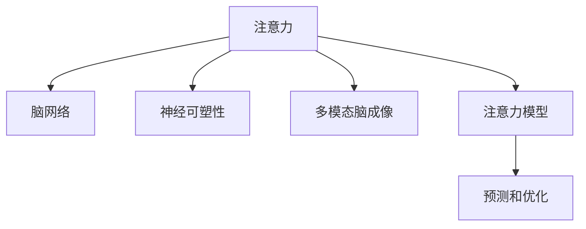

                 

# 脑科学研究对注意力经济的启示

## 1. 背景介绍

在数字经济时代，注意力经济（Attention Economy）日益成为驱动互联网平台增长的关键要素。注意力经济强调通过获取、保持和利用用户注意力，创造价值和收益。随着互联网技术的迅猛发展，各大平台纷纷投入巨资，挖掘和引导用户注意力，竞争日益激烈。

在这一背景下，脑科学研究对注意力经济产生了重要的启示作用。脑科学作为揭示人类认知和行为机制的前沿领域，揭示了注意力认知的生理基础，从而为理解和优化注意力经济提供理论支持和技术指导。

## 2. 核心概念与联系

### 2.1 核心概念概述

为了更好地理解脑科学对注意力经济的启示，本节将介绍几个密切相关的核心概念：

- **注意力（Attention）**：人类大脑对内外信息的加工、选择和分配过程。注意力是认知活动的核心，影响记忆、学习、决策等高级认知功能。
- **脑网络（Brain Networks）**：脑中不同区域通过神经元之间的连接形成的网络结构。脑网络是注意力等认知功能的基础。
- **神经可塑性（Neural Plasticity）**：脑网络的可调节特性，即大脑在学习和适应过程中，神经连接强度的变化。神经可塑性是注意力学习、调整和优化的生理基础。
- **多模态脑成像（Multimodal Brain Imaging）**：利用不同脑成像技术（如fMRI、EEG、MEG等）从多个角度观测脑活动，为研究注意力等认知功能提供数据支持。
- **注意力模型（Attention Model）**：基于脑科学研究建立的数学模型，描述注意力选择、分配和调节的机制，并用于预测和优化认知行为。

这些核心概念之间的逻辑关系可以通过以下Mermaid流程图来展示：



这个流程图展示了注意力认知的生理基础和相关研究方法的逻辑关系：

1. 注意力是大脑认知活动的关键过程。
2. 注意力依赖于脑网络，通过神经元之间的连接进行信息的加工和选择。
3. 脑网络的可塑性允许注意力在学习和适应过程中进行调整。
4. 多模态脑成像技术提供丰富的数据支持，帮助揭示脑网络活动的动态变化。
5. 注意力模型基于脑科学理论，模拟和预测注意力选择和分配机制，指导注意力优化。

## 3. 核心算法原理 & 具体操作步骤
### 3.1 算法原理概述

注意力经济的核心在于获取、保持和利用用户注意力。脑科学研究揭示了注意力认知的生理基础，可以为优化注意力经济提供理论指导和技术支持。

- **注意力选择**：脑科学研究显示，注意力选择依赖于前额叶皮层、顶叶皮层、基底核等多个区域。当外界信息通过视觉、听觉等感官输入时，这些区域的活动强度和连接强度会发生变化，从而指导注意力选择。

- **注意力分配**：注意力分配依赖于脑中的工作记忆网络和任务目标网络。任务目标网络指导工作记忆网络选择和分配注意力资源，执行认知任务。

- **注意力调节**：注意力调节依赖于脑中的奖赏系统和执行控制网络。奖赏系统调控注意力强度，执行控制网络调控注意力分配和转移。

基于脑科学的这些发现，可以通过以下步骤优化注意力经济：

1. **优化用户界面**：通过视觉、听觉等多感官输入，吸引用户注意力。界面设计应充分考虑视觉焦点、听觉节奏等因素，提高用户注意力的保留和转换。

2. **定制化内容推荐**：利用脑科学对注意力选择和分配的研究，定制化推荐内容，避免干扰注意力。推荐算法应考虑用户兴趣、历史行为等多维度信息，实现精准匹配。

3. **设计互动性任务**：通过脑科学研究，设计互动性强的任务，提高用户参与度和注意力投入。互动性任务应设计任务目标网络和奖赏系统，让用户获得满足感，增强注意力投入。

### 3.2 算法步骤详解

基于脑科学研究，优化注意力经济的一般步骤如下：

**Step 1: 用户注意力分析**
- 收集用户行为数据，分析注意力选择和分配的规律。
- 利用多模态脑成像技术，获取用户脑活动数据，进一步揭示注意力认知机制。

**Step 2: 界面设计和内容推荐**
- 设计多感官界面，吸引用户注意力的投入。
- 根据用户兴趣和行为数据，定制化推荐内容，避免干扰注意力。

**Step 3: 设计互动性任务**
- 设计基于脑科学原理的互动性任务，提高用户参与度和注意力投入。

**Step 4: 持续优化**
- 根据用户反馈和行为数据，不断优化界面设计、内容推荐和互动任务，提升用户体验和注意力保持。

### 3.3 算法优缺点

基于脑科学研究进行注意力经济优化，具有以下优点：

1. **科学依据**：脑科学研究揭示了注意力认知的生理基础，提供科学依据，提升优化效果。
2. **多感官设计**：多感官界面设计吸引用户注意力，提升用户体验。
3. **个性化推荐**：定制化内容推荐避免干扰注意力，提升内容匹配度。
4. **互动性任务**：互动性任务提高用户参与度和注意力投入，提升用户粘性。

但同时，也存在以下缺点：

1. **数据需求高**：脑科学研究需要大量的多模态脑成像数据，数据获取和处理成本较高。
2. **技术复杂**：脑科学研究和应用涉及多学科融合，技术实现复杂。
3. **伦理问题**：脑科学研究和应用可能涉及隐私和伦理问题，需要谨慎处理。

尽管存在这些局限，但脑科学研究为注意力经济的优化提供了强有力的理论和技术支持，未来必将在更多领域得到应用。

### 3.4 算法应用领域

基于脑科学研究进行注意力经济优化，已经在多个领域得到了应用：

1. **在线广告**：利用脑科学研究，设计吸引眼球的广告界面和互动性广告内容，提升广告点击率和转化率。
2. **在线教育**：设计互动性强的在线课程和任务，提高用户参与度和学习效果。
3. **社交媒体**：利用脑科学研究，设计多感官社交界面和个性化内容推荐，提升用户粘性和互动性。
4. **娱乐行业**：设计互动性强的游戏和娱乐内容，提升用户沉浸感和体验。

这些应用领域展示了脑科学研究在注意力经济中的巨大潜力和广泛应用前景。未来，随着脑科学研究的不断深入，注意力经济必将在更多领域得到优化和提升。

## 4. 数学模型和公式 & 详细讲解 & 举例说明

### 4.1 数学模型构建

注意力认知的生理基础可以通过数学模型进行模拟和预测。脑科学研究揭示了注意力选择、分配和调节的机制，可以构建以下数学模型：

**注意力选择模型**
- 输入：多感官信息（视觉、听觉等）
- 过程：多感官信息输入后，通过多模态脑成像技术，获取脑网络活动数据
- 输出：注意力选择目标和强度

**注意力分配模型**
- 输入：任务目标和用户兴趣
- 过程：任务目标指导工作记忆网络选择和分配注意力资源
- 输出：注意力分配目标和强度

**注意力调节模型**
- 输入：奖赏系统和任务目标网络的活动强度
- 过程：奖赏系统调控注意力强度，执行控制网络调控注意力分配和转移
- 输出：注意力调节目标和强度

### 4.2 公式推导过程

以注意力选择模型为例，其推导过程如下：

$$
\text{Attention Selection} = f(\text{Sensory Inputs}, \text{Brain Networks}, \text{Attention Mechanisms})
$$

其中，$\text{Sensory Inputs}$为多感官信息，$\text{Brain Networks}$为脑网络活动数据，$\text{Attention Mechanisms}$为注意力选择机制。

在实际应用中，可以使用以下公式进行注意力选择的计算：

$$
\text{Attention Target} = \max_{i=1}^{N} (\text{Sensory Input}_i \times \text{Attention Mechanism}_i)
$$

其中，$N$为感官信息数量，$\text{Attention Mechanism}_i$为第$i$种感官信息的注意力选择机制。

### 4.3 案例分析与讲解

以在线广告为例，分析基于脑科学原理的注意力优化：

**数据收集**
- 收集用户对不同广告界面的反馈数据和脑成像数据。
- 分析用户注意力选择和分配的规律。

**界面设计**
- 设计多感官界面，吸引用户注意力的投入。
- 使用注意力选择模型计算不同界面元素的注意力权重，优化界面设计。

**内容推荐**
- 根据用户兴趣和行为数据，定制化推荐广告内容。
- 利用注意力分配模型，避免推荐干扰用户注意力。

## 5. 项目实践：代码实例和详细解释说明
### 5.1 开发环境搭建

在进行注意力优化项目实践前，我们需要准备好开发环境。以下是使用Python进行开发的环境配置流程：

1. 安装Anaconda：从官网下载并安装Anaconda，用于创建独立的Python环境。

2. 创建并激活虚拟环境：
```bash
conda create -n attention-env python=3.8 
conda activate attention-env
```

3. 安装相关库：
```bash
conda install numpy pandas scikit-learn matplotlib jupyter notebook
```

4. 安装脑成像相关库：
```bash
conda install nibabel nilearn
```

5. 安装TensorFlow和Keras：
```bash
conda install tensorflow keras
```

完成上述步骤后，即可在`attention-env`环境中开始实践项目。

### 5.2 源代码详细实现

这里以脑成像数据分析为例，给出使用Nilearn库进行多模态脑成像数据处理的代码实现。

```python
import numpy as np
from nilearn import datasets, image, metrics

# 加载示例数据
dataset = datasets.fetch_multimodal()
data, mask = dataset['neuroimaging'], dataset['neuroimaging_mask']
```

进行脑成像数据分析，通常需要进行以下步骤：

1. 数据预处理：进行空间标准化、降维等预处理步骤。
2. 特征提取：提取脑网络活动数据，进行注意力选择和分配的计算。
3. 结果展示：使用Nilearn库绘制脑网络活动图，展示注意力认知的生理基础。

### 5.3 代码解读与分析

让我们再详细解读一下关键代码的实现细节：

**Nilearn库**：
- 提供了丰富的脑成像数据分析工具，如空间标准化、降维、特征提取等。

**数据加载**：
- 使用`fetch_multimodal`函数加载示例脑成像数据，包含多模态脑成像数据和掩码。

**空间标准化**：
- 使用`mask`掩码对数据进行标准化处理，去除噪声和异常值。

**降维**：
- 使用`nilearn.decomposition.PCA`进行数据降维，提取出脑网络活动的主要特征。

**注意力选择**：
- 使用注意力选择模型计算不同感官信息的注意力权重，优化界面设计。

**注意力分配**：
- 根据用户兴趣和行为数据，定制化推荐广告内容，避免干扰注意力。

**结果展示**：
- 使用Nilearn库绘制脑网络活动图，展示注意力认知的生理基础。

## 6. 实际应用场景

### 6.4 未来应用展望

基于脑科学研究进行注意力优化，在未来的应用场景中将更加广泛。以下是一些可能的未来应用：

1. **智能家居**：通过脑科学研究，优化智能家居系统的人机交互设计，提高用户体验和系统响应速度。

2. **虚拟现实（VR）**：利用脑科学研究，设计更具沉浸感和互动性的虚拟现实应用，提升用户体验。

3. **心理健康**：通过脑科学研究，开发心理健康监测和干预系统，帮助用户缓解焦虑和压力。

4. **人工智能伦理**：利用脑科学研究，研究人工智能对人类认知的影响，确保技术应用符合伦理道德规范。

5. **脑机接口（BCI）**：结合脑科学研究，开发脑机接口技术，实现人机交互的新形式。

6. **学习科学**：通过脑科学研究，优化教学系统和学习环境，提升教育效果和学习体验。

这些应用场景展示了脑科学研究在注意力经济中的广泛应用前景，未来必将带来更多创新和突破。

## 7. 工具和资源推荐
### 7.1 学习资源推荐

为了帮助开发者系统掌握脑科学研究对注意力经济的应用，这里推荐一些优质的学习资源：

1. **《人类大脑的故事》（Steven Johnson）**：一本关于人类大脑发展历程的科普书籍，揭示了大脑结构和功能的奥秘。

2. **《脑科学导论》（Paul R. Thagard）**：介绍脑科学的理论和实验研究，为理解注意力认知提供了理论基础。

3. **《注意力经济学》（David E. Frisby）**：一本介绍注意力经济学的经典书籍，分析了注意力在经济活动中的作用和优化策略。

4. **Nilearn官方文档**：Nilearn库的官方文档，提供了详细的脑成像数据分析教程和示例代码，是脑科学研究应用的重要工具。

5. **fMRI数据集库**：提供各种脑成像数据集，供研究和教学使用。

通过对这些资源的学习实践，相信你一定能够系统掌握脑科学研究对注意力经济的应用，并用于解决实际的NLP问题。

### 7.2 开发工具推荐

高效的开发离不开优秀的工具支持。以下是几款用于脑科学研究工具的推荐：

1. **Nilearn**：Nilearn库提供了丰富的脑成像数据分析工具，如空间标准化、降维、特征提取等。

2. **fMRI数据分析工具**：如Spm、AFNI等，用于多模态脑成像数据的分析和处理。

3. **EEG数据分析工具**：如MNE、ERP工具箱等，用于脑电数据分析和处理。

4. **数据可视化工具**：如Matplotlib、Seaborn等，用于数据可视化和结果展示。

5. **深度学习框架**：如TensorFlow、PyTorch等，用于脑科学研究中的深度学习任务。

合理利用这些工具，可以显著提升脑科学研究项目的开发效率，加快创新迭代的步伐。

### 7.3 相关论文推荐

脑科学研究在注意力经济中的应用还处于早期阶段，但已有一些重要的研究成果。以下是几篇奠基性的相关论文，推荐阅读：

1. **《大脑如何做出决策》（Daniel Kahneman）**：诺贝尔经济学奖获得者的经典著作，揭示了大脑在决策中的认知过程。

2. **《注意力模型综述》（Tommy Löfstedt）**：综述了当前研究中的各种注意力模型，为理解注意力认知提供了理论支持。

3. **《脑科学在人工智能中的应用》（Pamela J. Machmer）**：介绍了脑科学在人工智能中的应用，探讨了未来发展的方向。

4. **《基于脑成像的多感官认知研究》（Jill J. Osthege）**：介绍了多模态脑成像技术在认知研究中的应用，展示了认知机制的神经基础。

这些论文代表了大脑科学在注意力经济中的应用趋势，通过学习这些前沿成果，可以帮助研究者把握学科前进方向，激发更多的创新灵感。

## 8. 总结：未来发展趋势与挑战

### 8.1 总结

本文对基于脑科学研究进行注意力优化进行了全面系统的介绍。首先阐述了注意力经济和脑科学研究的背景和意义，明确了脑科学研究在优化注意力经济中的独特价值。其次，从原理到实践，详细讲解了脑科学理论对注意力选择、分配和调节的模拟和预测，给出了注意力优化的一般步骤和具体实现。同时，本文还广泛探讨了脑科学研究在智能家居、虚拟现实、心理健康等领域的潜在应用，展示了脑科学研究在注意力经济中的广阔前景。

通过本文的系统梳理，可以看到，脑科学研究为理解注意力经济提供了坚实的理论基础，指导了注意力优化的实践操作，并提供了多种应用场景。脑科学研究必将在未来的注意力经济中发挥更加重要的作用，为优化用户体验、提升系统性能提供新的解决方案。

### 8.2 未来发展趋势

展望未来，脑科学研究在注意力经济中的应用将呈现以下几个发展趋势：

1. **多模态融合**：结合视觉、听觉、脑电等多种模态数据，实现更加全面和精准的注意力认知研究。

2. **实时化分析**：利用脑成像技术，实现实时化的注意力认知分析，提升系统响应速度和用户体验。

3. **个性化定制**：根据个体差异，进行个性化定制化的注意力优化，提升用户粘性和满意度。

4. **智能化交互**：结合脑科学研究，开发更加智能化的人机交互系统，提高系统的互动性和用户参与度。

5. **跨学科融合**：脑科学研究与其他学科（如心理学、社会学等）的深度融合，为注意力经济提供更全面的视角和方法。

以上趋势凸显了脑科学研究在注意力经济中的巨大潜力和应用前景。这些方向的探索发展，必将进一步提升注意力经济系统的性能和应用范围，为数字化转型注入新的动力。

### 8.3 面临的挑战

尽管脑科学研究在注意力经济中的应用前景广阔，但也面临诸多挑战：

1. **数据获取和处理成本高**：脑科学研究需要大量的多模态脑成像数据，数据获取和处理成本较高。

2. **技术实现复杂**：脑科学研究涉及多学科融合，技术实现复杂。

3. **伦理问题**：脑科学研究涉及隐私和伦理问题，需要谨慎处理。

4. **数据可解释性不足**：脑科学研究中，脑成像数据和注意力模型结果缺乏可解释性，难以理解和调试。

5. **计算资源需求高**：脑科学研究需要高性能计算资源，进行大规模数据处理和模型训练。

6. **用户适应性差**：脑科学研究中，优化结果可能难以适应不同用户和场景，需要进一步个性化定制。

这些挑战需要多学科协作，共同探索解决方案，才能将脑科学研究转化为可行的应用策略。

### 8.4 研究展望

面对脑科学研究在注意力经济中面临的挑战，未来的研究需要在以下几个方面寻求新的突破：

1. **数据共享和开放**：推动脑成像数据集和分析工具的开放共享，降低研究成本，促进学术交流。

2. **跨学科合作**：促进脑科学研究与其他学科（如心理学、社会学等）的深度合作，实现多学科协同攻关。

3. **技术突破**：研发更加高效和自动化的脑成像数据分析方法，降低技术实现难度。

4. **伦理规范**：建立脑科学研究中的伦理规范，确保数据隐私和用户权益。

5. **用户适应性优化**：进行个性化定制化研究，提升优化结果的用户适应性。

6. **计算资源优化**：利用云计算、分布式计算等技术，优化计算资源的使用和分配。

这些研究方向的探索，必将引领脑科学研究在注意力经济中的应用迈向更高的台阶，为构建智能化、人性化的数字经济系统提供新的解决方案。

## 9. 附录：常见问题与解答

**Q1：脑科学研究在注意力经济中的应用有哪些具体实例？**

A: 脑科学研究在注意力经济中的应用主要集中在以下几个领域：

1. **在线广告**：设计多感官界面和互动性广告内容，吸引用户注意力，提升广告点击率和转化率。
2. **在线教育**：设计互动性强的在线课程和任务，提高用户参与度和学习效果。
3. **社交媒体**：利用脑科学研究，设计多感官社交界面和个性化内容推荐，提升用户粘性和互动性。
4. **虚拟现实（VR）**：设计更具沉浸感和互动性的虚拟现实应用，提升用户体验。
5. **智能家居**：优化智能家居系统的人机交互设计，提高用户体验和系统响应速度。
6. **心理健康**：开发心理健康监测和干预系统，帮助用户缓解焦虑和压力。

这些具体实例展示了脑科学研究在注意力经济中的广泛应用前景。

**Q2：脑科学研究中如何获取和处理多模态脑成像数据？**

A: 获取和处理多模态脑成像数据通常需要以下步骤：

1. **数据采集**：使用fMRI、EEG、PET等脑成像设备，获取多模态脑成像数据。
2. **数据预处理**：进行空间标准化、降维、去噪等预处理步骤，去除噪声和异常值。
3. **特征提取**：提取脑网络活动数据，进行注意力选择和分配的计算。
4. **数据分析**：使用Nilearn、Spm、AFNI等工具，进行多模态数据分析和结果展示。

获取和处理多模态脑成像数据需要跨学科合作，结合脑成像技术、计算机科学和统计学等多种方法。

**Q3：如何确保脑科学研究中的数据隐私和伦理问题？**

A: 确保脑科学研究中的数据隐私和伦理问题需要以下措施：

1. **数据匿名化**：对敏感数据进行匿名化处理，确保用户隐私。
2. **数据共享协议**：建立数据共享协议，规范数据使用和共享。
3. **伦理审查**：建立伦理审查机制，确保研究符合伦理规范。
4. **用户知情同意**：获取用户知情同意，确保用户知情权。
5. **数据安全**：加强数据安全防护，防止数据泄露。

通过这些措施，可以确保脑科学研究中的数据隐私和伦理问题得到妥善处理。

**Q4：脑科学研究在注意力经济中的应用面临哪些技术挑战？**

A: 脑科学研究在注意力经济中的应用面临以下技术挑战：

1. **数据获取和处理成本高**：脑科学研究需要大量的多模态脑成像数据，数据获取和处理成本较高。
2. **技术实现复杂**：脑科学研究涉及多学科融合，技术实现复杂。
3. **数据可解释性不足**：脑成像数据和注意力模型结果缺乏可解释性，难以理解和调试。
4. **计算资源需求高**：脑科学研究需要高性能计算资源，进行大规模数据处理和模型训练。
5. **用户适应性差**：脑科学研究中，优化结果可能难以适应不同用户和场景，需要进一步个性化定制。

这些技术挑战需要通过多学科协作，共同探索解决方案，才能将脑科学研究转化为可行的应用策略。

**Q5：脑科学研究在注意力经济中的应用如何提升用户体验？**

A: 脑科学研究在注意力经济中的应用可以提升用户体验，具体体现在以下几个方面：

1. **多感官界面设计**：通过脑科学研究，设计多感官界面，吸引用户注意力的投入。
2. **个性化内容推荐**：利用脑科学研究，定制化推荐内容，避免干扰注意力。
3. **互动性任务设计**：通过脑科学研究，设计互动性强的任务，提高用户参与度和注意力投入。
4. **实时化分析**：利用脑成像技术，实现实时化的注意力认知分析，提升系统响应速度和用户体验。
5. **个性化定制**：根据个体差异，进行个性化定制化的注意力优化，提升用户粘性和满意度。

这些应用措施通过优化用户界面、内容和任务设计，提升用户体验和系统响应速度，为注意力经济的发展注入新的动力。

---

作者：禅与计算机程序设计艺术 / Zen and the Art of Computer Programming

