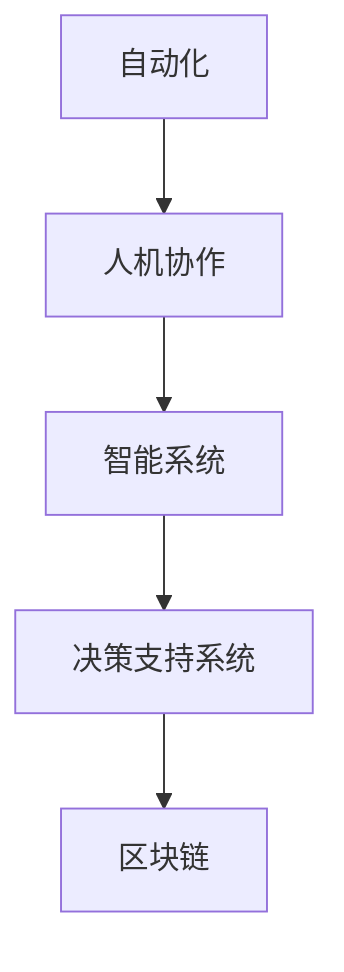

                 

# 自动化创业中的人机协作

> 关键词：自动化, 人机协作, 创业, 智能系统, 优化, 预测, 决策支持, 区块链, 大数据, 人工智能

## 1. 背景介绍

### 1.1 问题由来

随着科技的飞速发展，自动化技术正逐步渗透到各行各业，尤其是在创业领域，自动化和人工智能的应用，使得创业过程变得更加高效和智能化。然而，当前的自动化系统多是单一功能的机器执行，缺乏人类的灵活性和智慧。这使得企业往往难以实现全局最优，同时决策过程也缺乏透明度。因此，如何在创业中实现人机协作，充分发挥人工智能的优势，同时保持企业的灵活性和智慧，是当前创业者面临的重要问题。

### 1.2 问题核心关键点

实现人机协作的关键在于如何构建一个既能充分利用人工智能技术，又能有效保留人类智慧和灵活性的自动化创业系统。以下是这一问题的核心关键点：

1. **数据驱动的决策支持**：利用大数据和人工智能技术，对市场、用户、竞争环境等进行分析，为决策提供科学依据。
2. **智能系统的优化**：使用算法优化和机器学习技术，不断提升自动化系统的性能和效率。
3. **区块链的安全保障**：利用区块链技术确保数据的真实性、隐私和安全，同时建立透明的决策过程。
4. **人机协作的增强**：通过智能化的系统增强人的决策能力，实现人机协作，最大化整体效益。
5. **反馈循环**：建立系统与用户的反馈循环，实现持续的优化和改进。

### 1.3 问题研究意义

研究自动化创业中的人机协作，对于提升创业效率、降低成本、提升用户体验、增强企业竞争力具有重要意义：

1. **提高决策质量**：通过数据驱动和智能决策，提升决策的准确性和及时性。
2. **降低运营成本**：自动化系统可以24小时无间断工作，大幅降低人力成本。
3. **提升用户体验**：智能系统可以提供个性化的服务，提升用户满意度和忠诚度。
4. **增强竞争优势**：通过高效、智能的运营，帮助企业获取市场先机。
5. **实现持续优化**：通过反馈循环，不断优化系统性能，适应市场变化。

## 2. 核心概念与联系

### 2.1 核心概念概述

为更好地理解自动化创业中的人机协作，本节将介绍几个密切相关的核心概念：

- **自动化(Automation)**：指通过软件、机器人等技术手段，自动完成繁琐、重复的工作，提高效率。
- **人机协作(Human-Machine Collaboration)**：指将人类智慧与人工智能技术相结合，实现优势互补，共同完成复杂任务。
- **智能系统(Intelligent System)**：通过算法、数据和机器学习技术，具有自主决策和优化能力的系统。
- **决策支持系统(Decision Support System, DSS)**：利用人工智能技术，辅助人类进行决策的系统。
- **区块链(Blockchain)**：一种去中心化的分布式账本技术，确保数据的安全、透明和不可篡改。

这些核心概念之间的逻辑关系可以通过以下Mermaid流程图来展示：



这个流程图展示了一个自动化创业系统中，各关键组件之间的关系：

1. 自动化系统利用人工智能技术，实现高效、自动化的任务执行。
2. 人机协作系统整合人类的智慧和机器的能力，提升决策质量和灵活性。
3. 智能系统通过数据分析和算法优化，不断提升自动化系统的性能。
4. 决策支持系统为人类决策提供数据和智能支持。
5. 区块链技术确保数据安全，提供透明和不可篡改的决策过程。

这些核心概念共同构成了自动化创业系统的核心架构，使其能够高效、智能地运营，同时保障数据安全和决策透明。

## 3. 核心算法原理 & 具体操作步骤
### 3.1 算法原理概述

自动化创业中的人机协作系统，主要依赖以下几类核心算法：

1. **数据驱动的决策支持算法**：利用机器学习、深度学习等技术，对海量数据进行分析，预测市场趋势和用户行为，为决策提供支持。
2. **智能优化算法**：如遗传算法、粒子群优化、强化学习等，用于自动化系统的参数优化和性能提升。
3. **区块链算法**：如共识算法、密码学算法等，确保数据的完整性、真实性和不可篡改性。
4. **自然语言处理算法**：如BERT、GPT等，用于理解和生成自然语言，提升人机交互的智能化水平。
5. **预测算法**：如时间序列分析、回归分析等，用于预测未来趋势，辅助决策。

### 3.2 算法步骤详解

基于上述算法，实现自动化创业中的人机协作主要包括以下几个关键步骤：

**Step 1: 数据收集与预处理**

- 收集与创业相关的市场、用户、竞争环境等数据。
- 对数据进行清洗、去重、标准化等预处理，确保数据质量。
- 利用大数据分析技术，对数据进行特征提取和维度降维。

**Step 2: 智能决策支持系统的构建**

- 设计决策支持系统的框架，包括数据输入、处理、分析、输出等环节。
- 选择合适的机器学习算法和模型，如线性回归、决策树、神经网络等，进行模型训练。
- 将训练好的模型部署到生产环境，实时接收数据输入，进行决策分析。

**Step 3: 自动化系统的部署与优化**

- 将决策支持系统的输出结果，作为自动化系统的输入。
- 设计自动化系统的执行流程，实现任务自动化。
- 利用智能优化算法，对自动化系统进行参数优化和性能提升。

**Step 4: 区块链技术的应用**

- 将关键数据和决策过程记录到区块链上，确保数据的透明和不可篡改。
- 利用区块链的共识算法，确保数据的真实性和完整性。
- 建立区块链系统与决策支持系统的接口，实现数据的无缝集成。

**Step 5: 人机协作与反馈循环**

- 设计人机交互界面，实现人类与智能系统的互动。
- 利用自然语言处理算法，理解人类指令，并生成相应的系统输出。
- 建立反馈循环，根据用户的反馈，不断优化智能系统的决策模型。

### 3.3 算法优缺点

自动化创业中的人机协作系统，具有以下优点：

1. **高效性**：自动化系统可以实现24小时无间断工作，提升效率，降低成本。
2. **智能性**：利用人工智能技术，实现精准预测和决策支持，提升决策质量。
3. **透明性**：区块链技术确保数据的透明和不可篡改，提升决策过程的可信度。
4. **灵活性**：人机协作系统结合人类的智慧和机器的能力，增强系统的灵活性和适应性。

同时，该系统也存在一些缺点：

1. **数据依赖**：系统的性能和决策质量高度依赖于数据的质量和完整性。
2. **算法复杂性**：系统的实现需要复杂的算法和模型，难以快速开发和部署。
3. **安全风险**：系统的安全性依赖于区块链技术的有效性，存在被攻击的风险。
4. **人机交互困难**：自然语言处理算法的精度和理解能力有限，可能无法完全理解人类的复杂指令。

尽管存在这些缺点，但该系统在提升创业效率和决策质量方面，仍然具有显著的优势。

### 3.4 算法应用领域

自动化创业中的人机协作系统，在多个领域已经得到了广泛的应用，例如：

- **电商创业**：利用数据分析和推荐算法，提升用户购买转化率，降低库存成本。
- **金融创业**：利用预测和优化算法，实现投资决策和风险控制，提高投资回报率。
- **物流创业**：利用自动化和路径优化算法，提升物流效率，降低运营成本。
- **医疗创业**：利用数据分析和智能诊断算法，提升诊断准确率，优化医疗资源配置。
- **教育创业**：利用个性化推荐和智能辅导算法，提升教育效果，提高用户体验。

除了上述这些典型领域，自动化创业中的人机协作系统还可以应用于更多场景中，如智能客服、智慧城市、智能制造等，为创业过程带来新的变革。

## 4. 数学模型和公式 & 详细讲解 & 举例说明

### 4.1 数学模型构建

在本节中，我们将详细讲解自动化创业中的人机协作系统的数学模型构建过程。

**数据驱动的决策支持系统**：

假设市场数据为 $X$，用户数据为 $Y$，竞争环境数据为 $Z$。利用多元线性回归模型，构建决策支持系统，其数学模型为：

$$
Y = \beta_0 + \beta_1 X + \beta_2 Y + \beta_3 Z + \epsilon
$$

其中 $\beta_0, \beta_1, \beta_2, \beta_3$ 为模型参数，$\epsilon$ 为误差项。

**智能优化算法**：

以粒子群优化算法为例，其数学模型为：

$$
v_i(t+1) = \omega v_i(t) + c_1 r_1 \cdot (p_i(t) - x_i(t)) + c_2 r_2 \cdot (g_i(t) - x_i(t))
$$

$$
x_i(t+1) = x_i(t) + v_i(t+1)
$$

其中 $v_i(t)$ 为第 $i$ 个粒子的速度，$x_i(t)$ 为第 $i$ 个粒子的位置，$w$ 为惯性权重，$c_1, c_2$ 为加速系数，$r_1, r_2$ 为随机数。

**区块链技术**：

区块链的共识算法（如PoW, PoS, DPoS等），确保数据的透明和不可篡改。假设区块链上的交易数据为 $T$，共识算法如下：

$$
T_{i+1} = T_i + S_i
$$

其中 $S_i$ 为新区块的交易数据。

### 4.2 公式推导过程

以多元线性回归模型为例，推导其预测公式。

假设模型参数 $\beta_0, \beta_1, \beta_2, \beta_3$ 已通过训练确定，则模型预测公式为：

$$
y = \beta_0 + \beta_1 x_1 + \beta_2 x_2 + \beta_3 z
$$

其中 $x_1, x_2, z$ 分别为市场、用户、竞争环境等特征变量。

在实际应用中，可以利用最小二乘法或梯度下降算法，对模型参数进行估计和优化。

### 4.3 案例分析与讲解

**电商创业的决策支持系统**：

假设某电商创业公司，利用数据分析，构建了基于线性回归的决策支持系统。具体步骤如下：

1. 收集电商平台的交易数据 $X$，包括商品类别、价格、用户行为等。
2. 利用多元线性回归模型，对用户购买行为进行预测，模型如下：

$$
y = \beta_0 + \beta_1 x_1 + \beta_2 x_2 + \beta_3 z
$$

其中 $y$ 为用户的购买概率，$x_1$ 为商品价格，$x_2$ 为用户年龄，$z$ 为用户地域。
3. 将模型输出作为自动化推荐系统的输入，提升用户购买转化率。

## 5. 项目实践：代码实例和详细解释说明
### 5.1 开发环境搭建

在进行项目实践前，我们需要准备好开发环境。以下是使用Python进行PyTorch开发的环境配置流程：

1. 安装Anaconda：从官网下载并安装Anaconda，用于创建独立的Python环境。

2. 创建并激活虚拟环境：
```bash
conda create -n pytorch-env python=3.8 
conda activate pytorch-env
```

3. 安装PyTorch：根据CUDA版本，从官网获取对应的安装命令。例如：
```bash
conda install pytorch torchvision torchaudio cudatoolkit=11.1 -c pytorch -c conda-forge
```

4. 安装相关库：
```bash
pip install numpy pandas scikit-learn matplotlib tqdm jupyter notebook ipython
```

完成上述步骤后，即可在`pytorch-env`环境中开始项目实践。

### 5.2 源代码详细实现

下面我们以电商创业中的人机协作系统为例，给出使用PyTorch进行数据分析和自动化推荐的PyTorch代码实现。

首先，定义电商平台的交易数据：

```python
import pandas as pd

# 加载电商交易数据
data = pd.read_csv('ecommerce_data.csv')

# 数据预处理
data = data.dropna()
data = data.drop_duplicates()
data = data[(data['price'] > 0) & (data['age'] > 0)]
data = data[data['region'].isin(['north', 'south', 'east', 'west'])]
```

然后，构建多元线性回归模型：

```python
from sklearn.linear_model import LinearRegression
from sklearn.model_selection import train_test_split

# 特征工程
X = data[['price', 'age', 'region']]
y = data['purchase']
X_train, X_test, y_train, y_test = train_test_split(X, y, test_size=0.2, random_state=42)

# 构建线性回归模型
model = LinearRegression()
model.fit(X_train, y_train)

# 模型评估
score = model.score(X_test, y_test)
print(f"模型评估得分：{score:.3f}")
```

接着，设计自动化推荐系统的执行流程：

```python
# 自动化推荐系统
def recommend_product(product_price, user_age, user_region):
    predicted = model.predict([[product_price, user_age, user_region]])
    if predicted > 0.5:
        return '购买'
    else:
        return '不购买'
```

最后，启动自动化推荐系统的应用：

```python
# 测试推荐系统
print(recommend_product(50, 25, 'north'))
```

以上就是使用PyTorch进行电商创业中的人机协作系统开发的完整代码实现。可以看到，借助PyTorch和Scikit-learn等库，构建多元线性回归模型，并应用于自动化推荐系统的设计和实现。

### 5.3 代码解读与分析

让我们再详细解读一下关键代码的实现细节：

**数据加载与预处理**：
- 使用pandas库，从CSV文件中加载电商交易数据。
- 对数据进行清洗，去除缺失值和重复项。
- 筛选出符合条件的特征变量（商品价格、用户年龄、地域）。

**模型构建与评估**：
- 利用Scikit-learn库，构建多元线性回归模型。
- 使用train_test_split函数，将数据集划分为训练集和测试集。
- 对模型进行训练，并在测试集上进行评估，计算模型评估得分。

**自动化推荐系统的实现**：
- 定义recommend_product函数，根据商品价格、用户年龄和地域，预测用户购买概率。
- 根据预测结果，生成相应的推荐输出。

**测试推荐系统**：
- 调用recommend_product函数，输入具体的商品价格、用户年龄和地域，输出推荐结果。

## 6. 实际应用场景
### 6.1 电商创业

在电商创业中，基于自动化和人工智能的人机协作系统，可以显著提升电商平台的运营效率和用户满意度。具体应用场景包括：

- **商品推荐**：利用电商交易数据和用户行为数据，构建推荐算法，提升用户购买转化率。
- **库存管理**：通过预测用户购买趋势，优化库存配置，降低库存成本。
- **价格优化**：利用价格弹性分析，动态调整商品价格，提升销售利润。

### 6.2 金融创业

在金融创业中，基于自动化和人工智能的人机协作系统，可以实现智能投资和风险控制。具体应用场景包括：

- **投资决策支持**：利用金融市场数据和宏观经济指标，构建预测模型，辅助投资决策。
- **风险控制**：通过实时监控市场动态，预警潜在风险，优化资产配置。
- **金融分析**：利用自然语言处理技术，自动化分析金融新闻和报告，提取关键信息。

### 6.3 物流创业

在物流创业中，基于自动化和人工智能的人机协作系统，可以提升物流效率和运营管理。具体应用场景包括：

- **路径优化**：利用历史物流数据，构建优化算法，提升物流路径的合理性。
- **配送管理**：通过实时监控物流状态，调整配送计划，提高配送效率。
- **智能仓储**：利用自动化机器人，实现仓储和拣选作业的智能化。

### 6.4 未来应用展望

随着自动化和人工智能技术的不断进步，人机协作系统将在更多领域得到应用，为创业过程带来新的变革。

在智慧城市治理中，人机协作系统可以实现智能交通、公共安全、环境监测等功能，提升城市管理的自动化水平。

在智能制造中，人机协作系统可以实现智能生产线、设备维护、质量控制等功能，提升生产效率和产品质量。

在教育培训中，人机协作系统可以实现个性化学习、智能辅导、学习效果评估等功能，提升教育培训的效果。

未来，人机协作系统将在更多领域发挥其独特的优势，推动各行业的智能化转型，为创业过程带来新的机遇和挑战。

## 7. 工具和资源推荐
### 7.1 学习资源推荐

为了帮助开发者系统掌握自动化创业中的人机协作技术的理论基础和实践技巧，这里推荐一些优质的学习资源：

1. 《Python机器学习》书籍：介绍机器学习基础，包括线性回归、分类、聚类等经典算法。
2. 《TensorFlow实战》书籍：深入讲解TensorFlow框架的使用，涵盖深度学习、自然语言处理等内容。
3. Coursera《机器学习》课程：斯坦福大学开设的机器学习课程，涵盖算法原理和实现细节。
4. Kaggle数据科学竞赛：参加数据科学竞赛，提升数据处理和模型优化能力。
5. GitHub代码库：浏览和复现其他开发者的人机协作系统项目，学习其设计和实现技巧。

通过对这些资源的学习实践，相信你一定能够快速掌握自动化创业中的人机协作技术的精髓，并用于解决实际的创业问题。

### 7.2 开发工具推荐

高效的开发离不开优秀的工具支持。以下是几款用于自动化创业中的人机协作系统开发的常用工具：

1. PyTorch：基于Python的开源深度学习框架，灵活动态的计算图，适合快速迭代研究。大部分预训练语言模型都有PyTorch版本的实现。
2. TensorFlow：由Google主导开发的开源深度学习框架，生产部署方便，适合大规模工程应用。同样有丰富的预训练语言模型资源。
3. Weights & Biases：模型训练的实验跟踪工具，可以记录和可视化模型训练过程中的各项指标，方便对比和调优。与主流深度学习框架无缝集成。
4. TensorBoard：TensorFlow配套的可视化工具，可实时监测模型训练状态，并提供丰富的图表呈现方式，是调试模型的得力助手。

合理利用这些工具，可以显著提升自动化创业中的人机协作系统的开发效率，加快创新迭代的步伐。

### 7.3 相关论文推荐

自动化创业中的人机协作技术的发展源于学界的持续研究。以下是几篇奠基性的相关论文，推荐阅读：

1. "Deep Learning for Business Analytics and Decision Making"：介绍深度学习在商业分析中的应用，包括预测、分类等任务。
2. "Adaptive Algorithms for Online Nonconvex Optimization"：研究适应性算法在在线优化中的应用，提升算法的性能和稳定性。
3. "Optimization Algorithms on Riemannian Manifolds"：介绍在流形上的优化算法，提升模型训练的效率和效果。
4. "Blockchain and Bitcoin"：介绍区块链技术的基本原理和应用场景，确保数据的透明和不可篡改。
5. "Human-Machine Collaboration in Decision Making"：研究人机协作的心理学和行为学基础，提升系统的决策质量。

这些论文代表了大语言模型微调技术的发展脉络。通过学习这些前沿成果，可以帮助研究者把握学科前进方向，激发更多的创新灵感。

## 8. 总结：未来发展趋势与挑战

### 8.1 总结

本文对自动化创业中的人机协作方法进行了全面系统的介绍。首先阐述了自动化创业的背景和意义，明确了人机协作在提升创业效率、降低成本、提升用户体验方面的独特价值。其次，从原理到实践，详细讲解了人机协作的数学原理和关键步骤，给出了人机协作任务开发的完整代码实例。同时，本文还广泛探讨了人机协作系统在电商、金融、物流等领域的实际应用，展示了人机协作范式的巨大潜力。此外，本文精选了人机协作技术的各类学习资源，力求为读者提供全方位的技术指引。

通过本文的系统梳理，可以看到，基于自动化和人工智能的人机协作技术正在成为创业领域的重要范式，极大地提升了创业过程的效率和智能化水平。未来，伴随自动化和人工智能技术的持续演进，人机协作系统还将不断拓展应用边界，推动各行业的智能化转型，为创业过程带来新的机遇和挑战。

### 8.2 未来发展趋势

展望未来，自动化创业中的人机协作技术将呈现以下几个发展趋势：

1. **智能化水平的提升**：随着算法和模型的不断优化，人机协作系统的智能化水平将进一步提升，能够处理更复杂的决策和任务。
2. **多样化的应用场景**：人机协作技术将逐步应用于更多领域，如智能医疗、智能制造、智能交通等，带来新的应用前景。
3. **实时化的决策支持**：利用实时数据流处理和流式算法，实现快速响应和动态决策，提升系统的灵活性和适应性。
4. **自主化的运营管理**：人机协作系统将逐步实现自主化的运营管理，减少人工干预，提升运营效率。
5. **跨领域的知识融合**：利用多模态数据融合技术，将不同领域的知识融合到人机协作系统中，提升系统的跨领域适应能力。

以上趋势凸显了自动化创业中人机协作技术的广阔前景。这些方向的探索发展，必将进一步提升创业过程的效率和智能化水平，为各行业带来新的变革。

### 8.3 面临的挑战

尽管人机协作技术已经取得了显著成就，但在迈向更加智能化、普适化应用的过程中，它仍面临着诸多挑战：

1. **数据隐私和安全**：自动化系统需要处理大量敏感数据，如何确保数据隐私和安全，防止数据泄露和滥用，是一大难题。
2. **算法的透明性**：自动化系统的决策过程往往缺乏透明度，如何赋予其可解释性和可审计性，增强用户信任，是一个关键问题。
3. **算法的鲁棒性**：自动化系统面临的环境和任务可能千变万化，如何提升算法的鲁棒性和泛化能力，是另一个重要挑战。
4. **人机交互的优化**：自然语言处理技术虽然进步显著，但理解复杂人类指令的能力仍有限，如何优化人机交互，提升用户体验，是一个亟待解决的问题。
5. **技术的集成**：自动化系统中涉及多种技术和算法，如何实现无缝集成，提升系统整体性能，是另一个重要挑战。

正视人机协作面临的这些挑战，积极应对并寻求突破，将是人机协作技术走向成熟的必由之路。相信随着学界和产业界的共同努力，这些挑战终将一一被克服，人机协作技术必将在各行业中发挥更大的作用。

### 8.4 研究展望

面向未来，人机协作技术需要在以下几个方面寻求新的突破：

1. **自适应算法**：开发更加自适应和动态优化的算法，能够实时响应环境变化，提升系统的灵活性和适应性。
2. **数据融合技术**：利用多模态数据融合技术，提升系统的跨领域适应能力和泛化能力。
3. **知识图谱的引入**：将知识图谱引入人机协作系统，提升系统的跨领域推理和决策能力。
4. **区块链技术的应用**：利用区块链技术确保数据的透明和不可篡改，提升系统的可信度和安全性。
5. **人机协作的界面优化**：利用自然语言处理和用户行为分析技术，优化人机交互界面，提升用户体验。

这些研究方向将引领人机协作技术迈向更高的台阶，为各行业带来新的机遇和挑战，推动人类社会的智能化转型。

## 9. 附录：常见问题与解答

**Q1：如何提升自动化系统的智能化水平？**

A: 提升自动化系统的智能化水平，主要通过以下几个方面：

1. **数据质量**：收集高质量、多样化的数据，进行特征工程，提升数据的多样性和代表性。
2. **算法优化**：使用先进的算法和模型，如深度学习、强化学习等，提升系统的性能和效果。
3. **人机协作**：结合人类的智慧和机器的能力，提升系统的决策质量和灵活性。
4. **多模态融合**：利用多模态数据融合技术，提升系统的跨领域适应能力和泛化能力。

**Q2：如何确保自动化系统的安全性和隐私保护？**

A: 确保自动化系统的安全性和隐私保护，主要通过以下几个方面：

1. **数据加密**：对敏感数据进行加密，防止数据泄露。
2. **访问控制**：建立严格的访问控制机制，确保只有授权人员能够访问数据。
3. **匿名化处理**：对数据进行匿名化处理，保护用户隐私。
4. **区块链技术**：利用区块链技术，确保数据的透明和不可篡改，提升系统的可信度。

**Q3：如何优化人机协作系统的用户体验？**

A: 优化人机协作系统的用户体验，主要通过以下几个方面：

1. **自然语言处理**：使用先进的自然语言处理技术，提升系统对人类指令的理解能力。
2. **交互界面设计**：设计简洁、易用的交互界面，提升用户的操作体验。
3. **用户反馈机制**：建立用户反馈机制，根据用户反馈不断优化系统。

**Q4：如何集成多种技术和算法？**

A: 集成多种技术和算法，主要通过以下几个方面：

1. **模块化设计**：将系统分解为多个模块，每个模块独立开发和维护。
2. **接口设计**：设计清晰的接口，实现模块间的无缝集成。
3. **数据共享**：建立统一的数据管理和共享机制，确保数据的一致性和可用性。
4. **系统监控**：实时监控系统状态，及时发现和解决集成问题。

**Q5：自动化创业中人机协作系统的未来发展方向？**

A: 自动化创业中人机协作系统的未来发展方向主要包括以下几个方面：

1. **智能化水平的提升**：利用先进算法和模型，提升系统的智能化水平，处理更复杂的决策和任务。
2. **跨领域的知识融合**：将不同领域的知识融合到人机协作系统中，提升系统的跨领域适应能力和泛化能力。
3. **实时化的决策支持**：利用实时数据流处理和流式算法，实现快速响应和动态决策，提升系统的灵活性和适应性。
4. **自主化的运营管理**：逐步实现系统的自主化运营管理，减少人工干预，提升运营效率。
5. **数据隐私和安全**：确保数据隐私和安全，防止数据泄露和滥用，增强用户信任。

总之，自动化创业中人机协作系统需要在智能化水平、数据隐私、用户体验等方面不断优化和提升，才能实现更加高效的创业运营，推动各行业的智能化转型。

---

作者：禅与计算机程序设计艺术 / Zen and the Art of Computer Programming

