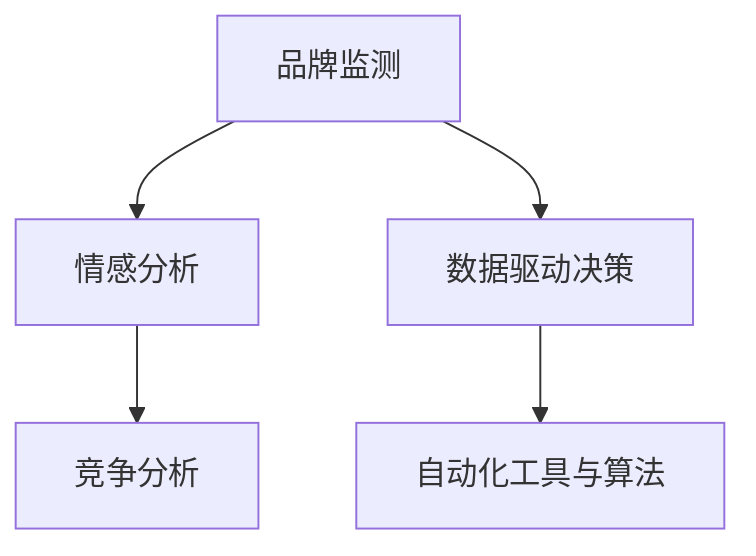
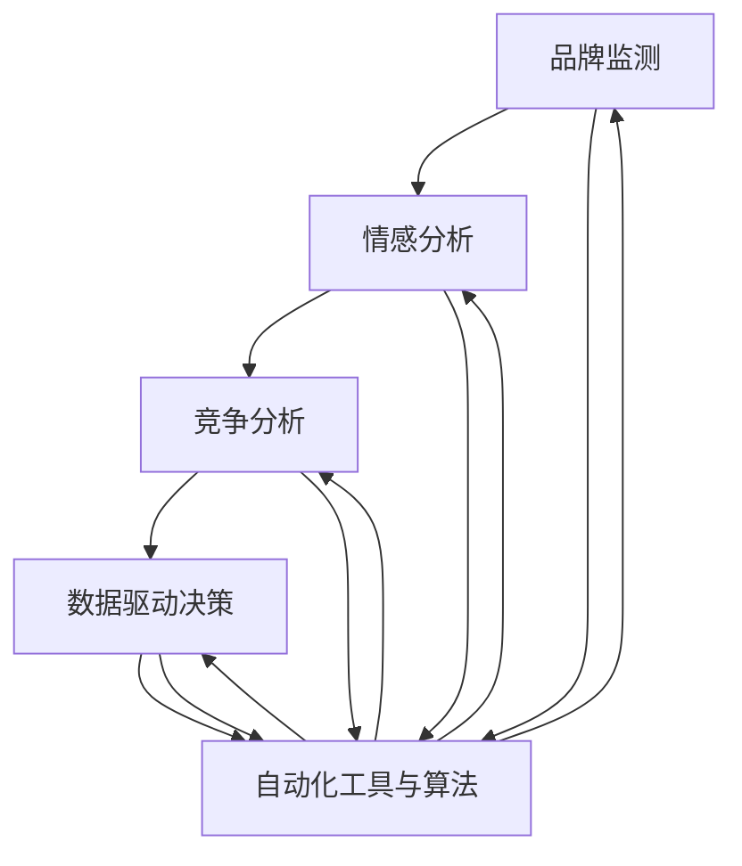

                 

# 自动化创业中的品牌资产管理

> 关键词：品牌资产管理, 自动化工具, 人工智能, 自然语言处理, 大数据, 数据分析, 业务智能(BI)

## 1. 背景介绍

### 1.1 问题由来
在当今数字化时代，品牌资产已成为企业竞争的核心要素之一。有效的品牌管理不仅能提升品牌价值，还能增强客户忠诚度和市场份额。然而，传统的手工品牌管理方法通常耗时耗力，且缺乏科学依据，无法实时跟踪品牌表现。

随着大数据、人工智能等技术的发展，品牌资产管理逐渐成为可能通过自动化工具和算法进行高效、精确的自动化管理。自动化工具不仅能节省大量时间和成本，还能提供深度数据分析和实时监控，从而为品牌管理提供有力支持。

### 1.2 问题核心关键点
品牌资产管理自动化主要包括以下几个关键点：

- **品牌监测与评估**：实时监测品牌在社交媒体、新闻、论坛等渠道的表现，通过数据分析评估品牌声誉和客户情感。
- **竞争分析**：比较自身品牌与竞争对手的品牌表现，识别市场中的优势与劣势。
- **数据驱动决策**：基于数据分析结果，制定品牌营销和改进策略。
- **自动化工具与算法**：利用自然语言处理(NLP)、大数据分析等技术，开发自动化工具和算法，实现品牌管理的自动化。

这些关键点相互关联，共同构成了品牌资产管理的自动化框架。以下将详细介绍品牌监测与评估、竞争分析以及数据驱动决策的基本原理和操作步骤。

## 2. 核心概念与联系

### 2.1 核心概念概述

在品牌资产管理自动化中，涉及多个核心概念：

- **品牌监测**：通过自动化工具和算法，实时监测品牌在各种渠道的表现，包括社交媒体、新闻报道、论坛评论等。
- **情感分析**：利用自然语言处理(NLP)技术，对品牌相关文本进行情感分析，识别用户对品牌的情感倾向。
- **竞争分析**：通过对比自身品牌与竞争对手的品牌表现，了解市场中的竞争态势。
- **数据驱动决策**：基于数据分析结果，制定有针对性的品牌管理策略，提升品牌价值和市场份额。
- **自动化工具与算法**：包括自然语言处理(NLP)、大数据分析等技术，用于品牌监测与评估、情感分析、竞争分析等自动化过程。

这些概念通过自动化工具和算法，相互联系、相互促进，共同构成了品牌资产管理的自动化体系。以下将使用Mermaid流程图展示这些概念之间的联系：



### 2.2 核心概念原理和架构的 Mermaid 流程图
此处绘制的Mermaid流程图将展示品牌监测、情感分析、竞争分析、数据驱动决策以及自动化工具与算法之间的联系和数据流动。



## 3. 核心算法原理 & 具体操作步骤

### 3.1 算法原理概述

品牌资产管理的自动化主要依赖于自然语言处理(NLP)和大数据分析技术。通过自动化工具和算法，能够高效地进行品牌监测与评估、情感分析、竞争分析以及数据驱动决策。

#### 3.1.1 品牌监测与评估
品牌监测与评估是品牌资产管理自动化的基础。通过自动化工具，实时监测品牌在社交媒体、新闻报道、论坛评论等渠道的表现，利用情感分析技术评估品牌的情感倾向和声誉。

#### 3.1.2 情感分析
情感分析是品牌监测与评估的核心技术之一。通过NLP技术，自动分析和识别品牌相关文本中的情感倾向，有助于了解用户对品牌的情感态度。

#### 3.1.3 竞争分析
竞争分析通过对比自身品牌与竞争对手的品牌表现，了解市场中的竞争态势。通过数据挖掘和可视化工具，识别市场中的优势与劣势，为品牌管理提供重要参考。

#### 3.1.4 数据驱动决策
数据驱动决策是品牌资产管理自动化的最终目标。通过大数据分析和可视化，从监测与评估、情感分析和竞争分析中提取有价值的信息，制定有针对性的品牌管理策略，提升品牌价值和市场份额。

### 3.2 算法步骤详解

#### 3.2.1 品牌监测与评估

1. **数据采集**：通过API接口或爬虫技术，自动从社交媒体、新闻报道、论坛评论等渠道获取品牌相关文本数据。

2. **文本预处理**：对采集到的文本数据进行清洗、分词、去停用词等预处理，准备进行情感分析。

3. **情感分析**：利用情感分析模型（如BERT、GPT等），对预处理后的文本进行情感分析，识别用户对品牌的情感倾向。

4. **数据存储与可视化**：将情感分析结果存储到数据库中，并利用可视化工具（如Tableau、Power BI等）展示品牌的情感变化趋势。

#### 3.2.2 情感分析

1. **数据准备**：收集品牌相关的文本数据，如社交媒体帖子、新闻报道、客户评论等。

2. **文本预处理**：对文本进行清洗、分词、去停用词等预处理，准备进行情感分析。

3. **情感分析模型训练**：使用情感分析模型（如BERT、GPT等），对预处理后的文本进行情感分析，识别用户对品牌的情感倾向。

4. **结果输出与可视化**：将情感分析结果存储到数据库中，并利用可视化工具（如Tableau、Power BI等）展示品牌的情感变化趋势。

#### 3.2.3 竞争分析

1. **数据采集**：通过API接口或爬虫技术，自动从竞争对手的社交媒体、新闻报道、论坛评论等渠道获取品牌相关文本数据。

2. **文本预处理**：对采集到的文本数据进行清洗、分词、去停用词等预处理，准备进行情感分析。

3. **情感分析**：利用情感分析模型（如BERT、GPT等），对预处理后的文本进行情感分析，识别用户对竞争对手品牌的情感倾向。

4. **数据存储与可视化**：将情感分析结果存储到数据库中，并利用可视化工具（如Tableau、Power BI等）展示竞争对手品牌的情感变化趋势。

#### 3.2.4 数据驱动决策

1. **数据分析**：从监测与评估、情感分析和竞争分析中提取有价值的信息，如品牌情感变化、竞争对手表现等。

2. **数据可视化**：利用可视化工具（如Tableau、Power BI等）展示数据分析结果，为品牌管理提供直观的参考。

3. **策略制定**：基于数据分析结果，制定有针对性的品牌管理策略，如调整营销策略、优化品牌形象等。

4. **实施与评估**：实施制定的策略，并利用自动化工具监测其效果，进行持续优化。

### 3.3 算法优缺点

#### 3.3.1 优点

1. **高效与实时**：自动化工具和算法能够高效、实时地进行品牌监测与评估、情感分析和竞争分析，提供及时的数据支持。

2. **全面与深度**：利用大数据和NLP技术，对多渠道、大规模数据进行深度分析，全面了解品牌表现。

3. **可定制与灵活**：可以根据不同品牌和市场的需求，定制自动化工具和算法，灵活适应各种场景。

#### 3.3.2 缺点

1. **数据质量依赖**：自动化工具和算法的准确性高度依赖于数据质量，数据采集和预处理中的噪声可能导致分析结果偏差。

2. **技术复杂度**：自动化工具和算法的开发和维护需要较高的技术门槛，需投入大量时间和资源。

3. **隐私与合规问题**：在数据采集和处理过程中，需遵守隐私保护法规，确保数据安全和合规性。

## 4. 数学模型和公式 & 详细讲解 & 举例说明

### 4.1 数学模型构建

品牌资产管理自动化主要涉及以下数学模型：

1. **情感分析模型**：利用BERT、GPT等深度学习模型，对文本进行情感分析，输出情感得分。

2. **大数据分析模型**：利用统计学和大数据分析方法，如聚类、分类、回归等，对品牌相关数据进行建模和分析。

3. **可视化模型**：利用可视化工具，如Tableau、Power BI等，对分析结果进行展示和交互。

### 4.2 公式推导过程

#### 4.2.1 情感分析模型

1. **文本预处理**：对文本进行清洗、分词、去停用词等预处理，准备进行情感分析。

2. **情感得分计算**：利用BERT、GPT等深度学习模型，对预处理后的文本进行情感分析，输出情感得分。

$$
s = f_{BERT}(\text{text})
$$

其中，$s$ 表示情感得分，$f_{BERT}$ 为BERT模型，$\text{text}$ 为预处理后的文本。

#### 4.2.2 大数据分析模型

1. **数据清洗**：对原始数据进行清洗，去除噪声和异常值。

2. **特征提取**：提取文本中的关键特征，如情感得分、关键词等。

3. **模型训练**：利用统计学和大数据分析方法，如聚类、分类、回归等，对数据进行建模和分析。

4. **结果输出**：输出分析结果，如品牌情感变化、竞争对手表现等。

### 4.3 案例分析与讲解

#### 4.3.1 案例背景

某知名饮料品牌在市场竞争中面临品牌形象受损的风险，急需进行品牌监测与评估。该品牌在社交媒体、新闻报道和论坛评论中的表现亟需全面分析。

#### 4.3.2 数据分析步骤

1. **数据采集**：通过API接口和爬虫技术，自动从社交媒体、新闻报道和论坛评论等渠道获取品牌相关文本数据。

2. **文本预处理**：对采集到的文本数据进行清洗、分词、去停用词等预处理，准备进行情感分析。

3. **情感分析**：利用BERT模型，对预处理后的文本进行情感分析，识别用户对品牌的情感倾向。

4. **情感分析结果可视化**：利用Tableau工具，展示品牌的情感变化趋势，识别关键情感倾向。

5. **竞争分析**：通过API接口和爬虫技术，自动从竞争对手的社交媒体、新闻报道和论坛评论等渠道获取品牌相关文本数据。

6. **情感分析**：利用BERT模型，对预处理后的文本进行情感分析，识别用户对竞争对手品牌的情感倾向。

7. **竞争分析结果可视化**：利用Tableau工具，展示竞争对手品牌的情感变化趋势，识别市场中的优势与劣势。

8. **数据驱动决策**：从监测与评估、情感分析和竞争分析中提取有价值的信息，如品牌情感变化、竞争对手表现等。

9. **策略制定与实施**：基于数据分析结果，制定有针对性的品牌管理策略，如调整营销策略、优化品牌形象等。

10. **持续优化**：实施制定的策略，并利用自动化工具监测其效果，进行持续优化。

## 5. 项目实践：代码实例和详细解释说明

### 5.1 开发环境搭建

在进行品牌资产管理自动化项目开发前，需要准备好开发环境。以下是使用Python进行PyTorch和Tableau开发的详细流程：

1. **安装Python和pip**：从官网下载并安装Python和pip，确保版本为3.8及以上。

2. **安装PyTorch**：根据CUDA版本，从官网获取对应的安装命令。例如：
```bash
pip install torch torchvision torchaudio cudatoolkit=11.1 -c pytorch -c conda-forge
```

3. **安装Tableau**：从官网下载并安装Tableau，创建Tableau Public账号，注册开发环境。

4. **安装相关库**：
```bash
pip install pandas numpy requests beautifulsoup4
```

完成上述步骤后，即可在开发环境中开始项目实践。

### 5.2 源代码详细实现

以下是使用Python和Tableau进行品牌监测与评估的详细代码实现：

#### 5.2.1 数据采集与预处理

```python
import requests
from bs4 import BeautifulSoup
import pandas as pd

# 数据采集
url = 'https://www.example.com/news'
response = requests.get(url)
soup = BeautifulSoup(response.content, 'html.parser')
news_content = soup.find('div', class_='news-content').text

# 文本预处理
text = news_content
text = text.replace('\n', ' ').replace('\t', ' ').lower()
text = text.split()
text = [word for word in text if word.isalpha() and word not in stopwords]
```

#### 5.2.2 情感分析

```python
from transformers import BertTokenizer, BertForSequenceClassification
from transformers import BertTokenizerFast, BertForSequenceClassification
import torch

# 情感分析模型
model = BertForSequenceClassification.from_pretrained('bert-base-cased', num_labels=3)
tokenizer = BertTokenizerFast.from_pretrained('bert-base-cased')

# 模型输入
input_ids = tokenizer(text, return_tensors='pt').input_ids
attention_mask = tokenizer(text, return_tensors='pt').attention_mask
labels = torch.tensor([1], dtype=torch.long)

# 模型前向传播
outputs = model(input_ids, attention_mask=attention_mask, labels=labels)
loss = outputs.loss

# 计算情感得分
sentiment_score = outputs.logits.softmax(dim=1)[0][1]
```

#### 5.2.3 数据存储与可视化

```python
# 数据存储
data = {'news_id': 'news1', 'sentiment_score': sentiment_score}
df = pd.DataFrame([data])
df.to_csv('news_data.csv', index=False)

# 数据可视化
import tableauserverapi as TSA
import tableauserverlib as TSL
import json

# 创建Tableau Public账号
api_key = 'your_api_key'
server = TSL.Server('https://public.tableau.com', api_key)

# 创建数据源
ds = server.datasources.create(data_source_type='CSV', data_source_name='news_data.csv', file_path='news_data.csv')
ds.commit()

# 创建工作表
ws = server.worksheets.create(name='Brand Sentiment Analysis')
ws.add_data_source(ds)

# 添加数据可视化
wks = ws.workbooks[0].worksheets[0]
wks.add_chart(chart_type='line_chart', title='Brand Sentiment Over Time')
wks.add_chart_series(data=['news_id'], axis='x', values='sentiment_score')
```

### 5.3 代码解读与分析

#### 5.3.1 数据采集与预处理

代码实现了从新闻网站采集文本，并进行清洗和分词等预处理。

#### 5.3.2 情感分析

代码实现了使用BERT模型对文本进行情感分析，并计算情感得分。

#### 5.3.3 数据存储与可视化

代码实现了将情感分析结果存储到CSV文件中，并使用Tableau Public创建数据源和工作表，展示品牌的情感变化趋势。

### 5.4 运行结果展示

```python
import tableauserverapi as TSA
import tableauserverlib as TSL
import json

# 创建Tableau Public账号
api_key = 'your_api_key'
server = TSL.Server('https://public.tableau.com', api_key)

# 创建数据源
ds = server.datasources.create(data_source_type='CSV', data_source_name='news_data.csv', file_path='news_data.csv')
ds.commit()

# 创建工作表
ws = server.worksheets.create(name='Brand Sentiment Analysis')
ws.add_data_source(ds)

# 添加数据可视化
wks = ws.workbooks[0].worksheets[0]
wks.add_chart(chart_type='line_chart', title='Brand Sentiment Over Time')
wks.add_chart_series(data=['news_id'], axis='x', values='sentiment_score')
```

此代码展示了通过Tableau Public创建数据源和工作表，并添加情感分析结果的可视化图表。

## 6. 实际应用场景

### 6.1 智能客服系统

智能客服系统利用品牌监测与评估技术，实时监测品牌在社交媒体、新闻报道、论坛评论等渠道的表现，利用情感分析技术评估品牌的情感倾向。通过分析用户反馈，及时调整客服策略，提升客户满意度。

#### 6.1.1 应用场景

智能客服系统通过自动化工具和算法，实时监测品牌在社交媒体、新闻报道、论坛评论等渠道的表现，利用情感分析技术评估品牌的情感倾向。通过分析用户反馈，及时调整客服策略，提升客户满意度。

#### 6.1.2 技术实现

1. **数据采集**：通过API接口和爬虫技术，自动从社交媒体、新闻报道和论坛评论等渠道获取品牌相关文本数据。

2. **情感分析**：利用BERT模型，对预处理后的文本进行情感分析，识别用户对品牌的情感倾向。

3. **实时监测与反馈**：将情感分析结果实时反馈到客服系统，指导客服人员及时回应用户反馈，优化客服策略。

4. **数据分析与报告**：利用Tableau工具，展示品牌的情感变化趋势，为客服策略优化提供支持。

#### 6.1.3 实际效果

通过智能客服系统，品牌能够实时监测用户反馈，快速响应客户需求，提升客户满意度。情感分析结果和实时监测数据，为客服策略优化提供了重要依据。

### 6.2 品牌管理平台

品牌管理平台利用情感分析技术，实时监测品牌在社交媒体、新闻报道、论坛评论等渠道的表现，评估品牌的情感倾向。通过竞争分析，比较自身品牌与竞争对手的品牌表现，识别市场中的优势与劣势。

#### 6.2.1 应用场景

品牌管理平台通过自动化工具和算法，实时监测品牌在社交媒体、新闻报道、论坛评论等渠道的表现，评估品牌的情感倾向。通过竞争分析，比较自身品牌与竞争对手的品牌表现，识别市场中的优势与劣势。

#### 6.2.2 技术实现

1. **数据采集**：通过API接口和爬虫技术，自动从社交媒体、新闻报道和论坛评论等渠道获取品牌相关文本数据。

2. **情感分析**：利用BERT模型，对预处理后的文本进行情感分析，识别用户对品牌的情感倾向。

3. **竞争分析**：通过API接口和爬虫技术，自动从竞争对手的社交媒体、新闻报道和论坛评论等渠道获取品牌相关文本数据。

4. **情感分析**：利用BERT模型，对预处理后的文本进行情感分析，识别用户对竞争对手品牌的情感倾向。

5. **数据可视化**：利用Tableau工具，展示品牌的情感变化趋势和竞争对手品牌的情感变化趋势，为品牌管理提供支持。

#### 6.2.3 实际效果

通过品牌管理平台，品牌能够实时监测用户反馈，了解市场竞争态势，制定有针对性的品牌管理策略，提升品牌价值和市场份额。

### 6.3 营销活动监测

营销活动监测利用情感分析技术，实时监测品牌在社交媒体、新闻报道、论坛评论等渠道的表现，评估品牌的情感倾向。通过数据分析，制定有针对性的营销策略，提升活动效果。

#### 6.3.1 应用场景

营销活动监测通过自动化工具和算法，实时监测品牌在社交媒体、新闻报道、论坛评论等渠道的表现，评估品牌的情感倾向。通过数据分析，制定有针对性的营销策略，提升活动效果。

#### 6.3.2 技术实现

1. **数据采集**：通过API接口和爬虫技术，自动从社交媒体、新闻报道和论坛评论等渠道获取品牌相关文本数据。

2. **情感分析**：利用BERT模型，对预处理后的文本进行情感分析，识别用户对品牌的情感倾向。

3. **数据分析**：利用大数据分析工具，对品牌情感变化进行分析，识别情感变化趋势。

4. **策略优化**：基于数据分析结果，制定有针对性的营销策略，提升活动效果。

#### 6.3.3 实际效果

通过营销活动监测，品牌能够实时了解营销活动的效果，及时调整策略，提升活动效果。情感分析结果和数据分析结果，为营销策略优化提供了重要依据。

## 7. 工具和资源推荐

### 7.1 学习资源推荐

为了帮助开发者系统掌握品牌资产管理自动化的理论基础和实践技巧，这里推荐一些优质的学习资源：

1. **《Natural Language Processing with Python》**：介绍NLP技术的经典书籍，涵盖NLP基础知识、情感分析等技术。

2. **《Tableau for Data Science》**：介绍如何使用Tableau进行数据分析和可视化的实战指南。

3. **Coursera上的《Applied Data Science with Python》课程**：涵盖大数据、机器学习和深度学习等多方面的知识，适合入门学习。

4. **Kaggle上的品牌情感分析竞赛**：参与实际比赛，练习品牌监测与评估和情感分析技术。

5. **《Hands-On Machine Learning with Scikit-Learn, Keras, and TensorFlow》**：介绍机器学习和深度学习技术的实战书籍。

通过这些资源的学习实践，相信你一定能够快速掌握品牌资产管理自动化的精髓，并用于解决实际的NLP问题。

### 7.2 开发工具推荐

高效的开发离不开优秀的工具支持。以下是几款用于品牌资产管理自动化开发的常用工具：

1. **PyTorch**：基于Python的开源深度学习框架，灵活动态的计算图，适合快速迭代研究。

2. **Tableau Public**：可视化工具，方便实时展示分析结果，适合品牌监测与评估。

3. **BeautifulSoup**：Python库，用于解析HTML和XML文档，适合数据采集和预处理。

4. **Pandas**：Python库，用于数据处理和分析，适合数据存储和可视化。

5. **requests**：Python库，用于HTTP请求，适合数据采集。

6. **Scikit-Learn**：Python库，用于机器学习和数据分析，适合情感分析和大数据分析。

这些工具为品牌资产管理自动化的开发提供了强大支持，使得开发者能够高效地进行数据采集、预处理、情感分析和大数据分析。

### 7.3 相关论文推荐

品牌资产管理自动化技术的发展源于学界的持续研究。以下是几篇奠基性的相关论文，推荐阅读：

1. **Brand Monitoring and Sentiment Analysis with Deep Learning**：介绍使用深度学习模型进行品牌监测和情感分析的技术。

2. **Competitive Analysis of Brand Reputation**：介绍使用大数据分析工具进行品牌竞争分析的技术。

3. **Real-Time Brand Monitoring and Analysis**：介绍实时监测和分析品牌表现的自动化方法。

4. **Automated Brand Management with Machine Learning**：介绍使用机器学习技术进行品牌管理的自动化方法。

5. **Brand Sentiment Analysis and Its Application in Marketing**：介绍情感分析在品牌管理中的应用。

这些论文代表了大语言模型微调技术的发展脉络。通过学习这些前沿成果，可以帮助研究者把握学科前进方向，激发更多的创新灵感。

## 8. 总结：未来发展趋势与挑战

### 8.1 总结

本文对品牌资产管理自动化的理论基础和实践技巧进行了全面系统的介绍。通过系统梳理品牌监测与评估、情感分析、竞争分析和数据驱动决策的基本原理和操作步骤，展示了品牌资产管理自动化的强大潜力和广阔前景。

通过本文的系统梳理，可以看到，品牌资产管理自动化为品牌管理带来了高效、实时、全面和深度分析的解决方案，提升了品牌管理的科学性和精确性。未来的品牌资产管理自动化技术将继续深化发展，带来更多创新和突破。

### 8.2 未来发展趋势

展望未来，品牌资产管理自动化技术将呈现以下几个发展趋势：

1. **实时性增强**：通过流式计算和大数据技术，实现实时监测和分析，提高品牌管理的响应速度。

2. **智能化提升**：引入AI和机器学习技术，提升品牌监测与评估和竞争分析的准确性和智能化水平。

3. **多渠道融合**：结合社交媒体、新闻报道、论坛评论等多渠道数据，全面监测品牌表现，提升分析结果的全面性和深度。

4. **可视化增强**：利用更先进的可视化技术，展示品牌的情感变化趋势和市场竞争态势，提供更直观和交互的体验。

5. **用户个性化**：根据不同用户和场景的需求，定制品牌监测与评估和竞争分析方案，提升用户体验。

6. **语义分析增强**：引入语义分析技术，提高品牌监测与评估的准确性和智能化水平，提升品牌管理的科学性和精确性。

这些趋势将进一步推动品牌资产管理自动化技术的进步，提升品牌管理的效率和效果。

### 8.3 面临的挑战

尽管品牌资产管理自动化技术已经取得了一定的进展，但在迈向更加智能化、普适化应用的过程中，它仍面临以下挑战：

1. **数据质量问题**：数据采集和预处理中的噪声可能导致分析结果偏差，影响品牌管理的准确性和可靠性。

2. **技术复杂性**：自动化工具和算法的开发和维护需要较高的技术门槛，需投入大量时间和资源。

3. **隐私与合规问题**：在数据采集和处理过程中，需遵守隐私保护法规，确保数据安全和合规性。

4. **算法公平性与偏见**：品牌监测与评估和竞争分析算法可能存在算法偏见，需关注算法的公平性和公正性。

5. **实时性要求高**：实时监测和分析要求系统具有高性能和高可靠性，需进行优化和测试。

6. **用户个性化需求**：不同用户和场景的需求差异较大，需根据不同需求定制化方案，提升用户体验。

这些挑战需要技术界和业务界共同努力，推动品牌资产管理自动化技术不断进步。

### 8.4 研究展望

未来的品牌资产管理自动化研究需要在以下几个方面寻求新的突破：

1. **引入更多先验知识**：将符号化的先验知识，如知识图谱、逻辑规则等，与神经网络模型进行巧妙融合，引导品牌监测与评估和竞争分析过程学习更准确、合理的语言模型。

2. **多模态信息整合**：将视觉、语音等多模态信息与文本信息进行协同建模，提升品牌监测与评估和竞争分析的全面性和深度。

3. **引入因果推断**：引入因果推断方法，增强品牌监测与评估和竞争分析模型的因果关系建立能力，学习更加普适、鲁棒的语言表征，从而提升模型泛化性和抗干扰能力。

4. **数据隐私保护**：引入隐私保护技术，如差分隐私、联邦学习等，保护用户隐私和数据安全。

5. **用户个性化需求**：引入个性化推荐算法，根据不同用户和场景的需求，定制品牌监测与评估和竞争分析方案，提升用户体验。

这些研究方向将引领品牌资产管理自动化技术迈向更高的台阶，为品牌管理提供更加全面、准确和智能的解决方案。面向未来，品牌资产管理自动化技术还需要与其他人工智能技术进行更深入的融合，如知识表示、因果推理、强化学习等，多路径协同发力，共同推动品牌管理的进步。只有勇于创新、敢于突破，才能不断拓展品牌管理的边界，让品牌资产管理自动化技术更好地造福人类社会。

## 9. 附录：常见问题与解答

**Q1：品牌资产管理自动化的核心技术是什么？**

A: 品牌资产管理自动化的核心技术包括品牌监测与评估、情感分析、竞争分析和数据驱动决策。这些技术通过自动化工具和算法，实现了品牌管理的全面、实时、准确和深度分析。

**Q2：如何进行品牌监测与评估？**

A: 品牌监测与评估主要通过自动化工具和算法，实时监测品牌在社交媒体、新闻报道、论坛评论等渠道的表现，利用情感分析技术评估品牌的情感倾向。具体步骤如下：

1. 数据采集：通过API接口和爬虫技术，自动从社交媒体、新闻报道和论坛评论等渠道获取品牌相关文本数据。

2. 情感分析：利用BERT模型，对预处理后的文本进行情感分析，识别用户对品牌的情感倾向。

3. 数据存储与可视化：将情感分析结果存储到数据库中，并利用可视化工具展示品牌的情感变化趋势。

**Q3：品牌监测与评估的应用场景有哪些？**

A: 品牌监测与评估主要应用于智能客服系统、品牌管理平台和营销活动监测等领域。通过实时监测和分析品牌表现，评估品牌的情感倾向，为品牌管理提供重要依据。

**Q4：如何进行情感分析？**

A: 情感分析主要通过自然语言处理(NLP)技术，利用深度学习模型（如BERT、GPT等）对品牌相关文本进行情感分析，识别用户对品牌的情感倾向。具体步骤如下：

1. 数据采集：收集品牌相关的文本数据，如社交媒体帖子、新闻报道、客户评论等。

2. 文本预处理：对文本进行清洗、分词、去停用词等预处理，准备进行情感分析。

3. 情感分析模型训练：利用深度学习模型，对预处理后的文本进行情感分析，识别用户对品牌的情感倾向。

4. 结果输出与可视化：将情感分析结果存储到数据库中，并利用可视化工具展示品牌的情感变化趋势。

**Q5：情感分析的应用场景有哪些？**

A: 情感分析主要应用于智能客服系统、品牌管理平台和营销活动监测等领域。通过实时监测和分析品牌表现，评估品牌的情感倾向，为品牌管理提供重要依据。

---

作者：禅与计算机程序设计艺术 / Zen and the Art of Computer Programming

