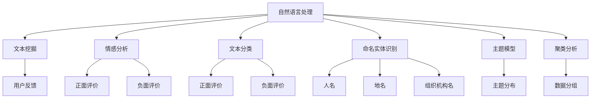

                 

# 自动化创业中的用户反馈收集与分析

## 1. 背景介绍

### 1.1 问题由来
在自动化创业过程中，产品迭代和市场反应是决定成败的关键。然而，如何高效、精准地收集和分析用户反馈，指导产品改进，是许多创业者面临的重大挑战。传统的人工调查方法耗费高、响应慢，难以适应快速变化的市场需求。随着数据分析技术和机器学习方法的日渐成熟，利用算法自动化收集和分析用户反馈变得可能。

### 1.2 问题核心关键点
用户反馈的自动化收集与分析，本质上是将自然语言处理(NLP)和机器学习算法应用于用户评论、评分、建议等数据，以提炼出有价值的信息。具体问题包括：

- 如何高效地自动化地从大量文本数据中提取用户反馈？
- 如何降低对人工标注的依赖，提升反馈信息的质量？
- 如何利用机器学习模型自动分析用户反馈，生成有用的洞察？

本文聚焦于基于自然语言处理(NLP)和机器学习的方法，详细阐述用户反馈的自动化收集与分析技术，旨在为自动化创业提供有力支撑。

### 1.3 问题研究意义
自动化用户反馈收集与分析技术在以下方面具有重要意义：

- 降低开发成本：通过算法自动化处理用户反馈，可以大幅减少人工调查的投入，提升效率。
- 提升产品优化：准确提炼用户需求和痛点，指导产品迭代和改进，加速产品迭代速度。
- 增强用户满意度：及时响应用户反馈，快速解决问题，提升用户满意度和产品口碑。
- 开拓市场机会：通过分析用户反馈，发掘潜在市场需求，抢占市场先机。
- 提供数据支持：帮助企业更全面、深入地了解用户，为决策提供数据支持。

## 2. 核心概念与联系

### 2.1 核心概念概述

为了更好地理解自动化用户反馈收集与分析技术，本节将介绍几个核心概念：

- 自然语言处理(NLP)：一门融合计算机科学、人工智能和语言学的交叉学科，旨在实现计算机对人类语言的理解、生成和处理。
- 机器学习(ML)：通过数据驱动的算法，使计算机自动学习数据的规律，从而实现预测、分类、聚类等任务。
- 用户反馈(UX Feedback)：用户在使用产品过程中产生的评价、建议、投诉等，是产品优化和改进的重要依据。
- 文本挖掘(Text Mining)：从大量文本数据中提取有用信息，如主题、情感、关联关系等，是自动化反馈分析的核心。
- 情感分析(Sentiment Analysis)：识别和提取文本中的情感信息，如正面、负面、中性情感。
- 文本分类(Text Classification)：将文本数据划分为预定义的类别，如正面评价、负面评价、中性评价。
- 命名实体识别(NER)：从文本中识别出特定实体，如人名、地名、组织机构名等。
- 主题模型(Thematic Modeling)：识别文本中的主题分布，用于分析文本内容的主旨和相关性。
- 聚类分析(Cluster Analysis)：将相似数据分为同一组，帮助理解数据的内在结构和模式。

这些核心概念之间的逻辑关系可以通过以下Mermaid流程图来展示：



这个流程图展示了几大核心概念及其之间的关系：

1. 自然语言处理是文本挖掘、情感分析、文本分类、命名实体识别、主题模型和聚类分析的基础。
2. 文本挖掘是从文本数据中提取信息的过程，可以进一步分解为情感分析、文本分类、命名实体识别、主题模型和聚类分析等子任务。
3. 情感分析用于识别文本中的情感倾向，有助于判断用户反馈的情感倾向。
4. 文本分类用于将用户反馈划分为不同的类别，如正面评价、负面评价等。
5. 命名实体识别用于提取文本中的具体实体信息，如人名、地名、组织机构名等。
6. 主题模型用于发现文本数据中的主题分布，有助于理解用户反馈的内容和背景。
7. 聚类分析用于对相似的用户反馈进行分组，便于理解和总结。

这些概念共同构成了用户反馈收集与分析的完整框架，使得机器学习算法可以高效、准确地处理和提炼用户反馈。

## 3. 核心算法原理 & 具体操作步骤
### 3.1 算法原理概述

自动化用户反馈收集与分析的本质是通过自然语言处理和机器学习技术，从用户评论、评分、建议等文本数据中提取有用信息，提炼出用户反馈的关键点、情感倾向、主题分布等。主要算法包括：

- 文本预处理：去除噪音，标准化文本格式。
- 情感分析：识别文本中的情感倾向，如正面、负面、中性。
- 文本分类：将文本数据划分为不同的类别，如正面评价、负面评价、中性评价等。
- 命名实体识别：从文本中识别出具体实体，如人名、地名、组织机构名等。
- 主题模型：识别文本中的主题分布，用于分析文本内容的主旨和相关性。
- 聚类分析：将相似数据分为同一组，帮助理解数据的内在结构和模式。

### 3.2 算法步骤详解

自动化用户反馈收集与分析的步骤如下：

**Step 1: 数据收集与预处理**

- 收集用户反馈数据，如评论、评分、建议等。
- 去除文本中的噪音，如HTML标签、数字、符号等。
- 标准化文本格式，如将所有文本转换为小写字母，去除停用词、标点符号等。

**Step 2: 情感分析**

- 使用情感分析算法，识别用户反馈中的情感倾向。
- 情感分析常用的算法包括词典法、规则法、机器学习方法等。
- 例如，可以使用情感词典（如AFINN、VADER）对文本进行情感打分，或使用深度学习模型（如RNN、LSTM、BERT）进行情感分类。

**Step 3: 文本分类**

- 使用文本分类算法，将用户反馈分为不同的类别。
- 文本分类常用的算法包括朴素贝叶斯、SVM、逻辑回归、深度学习模型等。
- 例如，可以使用支持向量机（SVM）对文本进行分类，或使用卷积神经网络（CNN）进行文本分类。

**Step 4: 命名实体识别**

- 使用命名实体识别算法，从文本中识别出具体实体。
- 命名实体识别常用的算法包括最大熵模型、条件随机场、深度学习模型等。
- 例如，可以使用BERT进行命名实体识别，或使用SpaCy库实现命名实体识别。

**Step 5: 主题模型**

- 使用主题模型算法，识别文本中的主题分布。
- 主题模型常用的算法包括LDA（Latent Dirichlet Allocation）、LSA（Latent Semantic Analysis）等。
- 例如，可以使用LDA对文本进行主题建模，或使用gensim库实现主题建模。

**Step 6: 聚类分析**

- 使用聚类算法，将相似的用户反馈分为同一组。
- 聚类算法常用的算法包括K-means、层次聚类、DBSCAN等。
- 例如，可以使用K-means算法对用户反馈进行聚类，或使用scikit-learn库实现聚类分析。

**Step 7: 分析与展示**

- 根据以上算法提取的情感倾向、主题分布、实体信息等，生成用户反馈的详细分析报告。
- 将分析结果可视化，如使用词云、热力图等工具展示情感分布、主题分布等。
- 为产品团队提供基于用户反馈的优化建议，指导产品改进。

### 3.3 算法优缺点

自动化用户反馈收集与分析具有以下优点：

- 高效自动化：算法可以处理大量文本数据，提升反馈处理速度。
- 降低成本：减少了人工标注的投入，降低了数据分析成本。
- 提高准确性：算法能够自动提炼信息，避免人工标注的误差。

然而，该方法也存在一些局限性：

- 依赖数据质量：算法依赖于高质量的文本数据，数据质量不佳会影响分析结果。
- 可能存在误差：算法在处理复杂情感、主题识别时可能存在误差。
- 需要持续优化：算法需要根据实际应用场景进行不断优化，以适应不断变化的需求。

## 4. 数学模型和公式 & 详细讲解 & 举例说明
### 4.1 数学模型构建

以情感分析为例，介绍情感分析的数学模型构建和公式推导过程。

设用户反馈的文本集合为 $D = \{x_1, x_2, ..., x_N\}$，其中 $x_i$ 表示第 $i$ 条用户反馈。假设 $x_i$ 的情感倾向为 $y_i \in \{1, 0\}$，其中 $1$ 表示正面情感，$0$ 表示负面情感。

情感分析的目标是训练一个分类器，使得对于任意 $x_i$，有 $y_i = f(x_i)$，其中 $f$ 是分类器。常用的分类器包括逻辑回归、支持向量机、深度学习模型等。

假设使用逻辑回归模型，情感分析的目标函数为：

$$
\min_{w, b} -\frac{1}{N}\sum_{i=1}^{N}[y_i\log(\sigma(w^Tx_i + b)) + (1-y_i)\log(1-\sigma(w^Tx_i + b))]
$$

其中 $w$ 和 $b$ 为模型参数，$\sigma$ 为 sigmoid 函数，$N$ 为数据总数。

根据梯度下降算法，优化目标函数的过程如下：

1. 初始化模型参数 $w$ 和 $b$。
2. 对于每个样本 $x_i$，计算 $f(x_i) = \sigma(w^Tx_i + b)$。
3. 计算损失函数 $L$。
4. 计算损失函数 $L$ 对 $w$ 和 $b$ 的梯度。
5. 更新 $w$ 和 $b$ 的值，使损失函数 $L$ 最小化。

### 4.2 公式推导过程

以逻辑回归模型为例，推导情感分析的公式推导过程。

假设 $x_i$ 的情感倾向为 $y_i \in \{1, 0\}$，其中 $1$ 表示正面情感，$0$ 表示负面情感。

使用逻辑回归模型进行情感分析，其目标函数为：

$$
\min_{w, b} -\frac{1}{N}\sum_{i=1}^{N}[y_i\log(\sigma(w^Tx_i + b)) + (1-y_i)\log(1-\sigma(w^Tx_i + b))]
$$

其中 $w$ 和 $b$ 为模型参数，$\sigma$ 为 sigmoid 函数，$N$ 为数据总数。

利用梯度下降算法，求解上述优化问题的过程如下：

1. 初始化模型参数 $w$ 和 $b$。
2. 对于每个样本 $x_i$，计算 $f(x_i) = \sigma(w^Tx_i + b)$。
3. 计算损失函数 $L$：

   $$
   L = -\frac{1}{N}\sum_{i=1}^{N}[y_i\log(\sigma(w^Tx_i + b)) + (1-y_i)\log(1-\sigma(w^Tx_i + b))]
   $$

4. 计算损失函数 $L$ 对 $w$ 和 $b$ 的梯度：

   $$
   \frac{\partial L}{\partial w} = -\frac{1}{N}\sum_{i=1}^{N}[y_i(w^Tx_i + b)(1-\sigma(w^Tx_i + b)) - (1-y_i)\sigma(w^Tx_i + b)]x_i
   $$

   $$
   \frac{\partial L}{\partial b} = -\frac{1}{N}\sum_{i=1}^{N}[y_i - \sigma(w^Tx_i + b)]
   $$

5. 更新 $w$ 和 $b$ 的值，使损失函数 $L$ 最小化：

   $$
   w \leftarrow w - \eta \frac{\partial L}{\partial w}
   $$

   $$
   b \leftarrow b - \eta \frac{\partial L}{\partial b}
   $$

   其中 $\eta$ 为学习率，通常取 $10^{-4}$ 或 $10^{-5}$。

### 4.3 案例分析与讲解

以情感分析为例，介绍如何使用BERT模型进行情感分析，并展示其效果。

假设我们使用预训练的BERT模型进行情感分析，可以将用户反馈 $x_i$ 输入BERT模型得到其向量表示 $z_i$，然后通过全连接层得到情感分类结果。具体步骤如下：

1. 将用户反馈 $x_i$ 输入BERT模型得到向量表示 $z_i$。
2. 通过全连接层得到情感分类结果：

   $$
   y_i = \sigma(w^Tz_i + b)
   $$

   其中 $w$ 和 $b$ 为模型参数。
3. 利用交叉熵损失函数计算损失函数 $L$：

   $$
   L = -\frac{1}{N}\sum_{i=1}^{N}[y_i\log(y_i) + (1-y_i)\log(1-y_i)]
   $$

4. 利用梯度下降算法更新模型参数 $w$ 和 $b$。

使用BERT模型进行情感分析，能够充分利用其强大的语言表示能力，提升情感分析的准确性。例如，在IMDB影评情感分类任务上，使用BERT模型可以取得SOTA（State of the Art）的效果。

## 5. 项目实践：代码实例和详细解释说明
### 5.1 开发环境搭建

在进行情感分析项目实践前，我们需要准备好开发环境。以下是使用Python进行情感分析的开发环境配置流程：

1. 安装Anaconda：从官网下载并安装Anaconda，用于创建独立的Python环境。

2. 创建并激活虚拟环境：
```bash
conda create -n pytorch-env python=3.8 
conda activate pytorch-env
```

3. 安装PyTorch：根据CUDA版本，从官网获取对应的安装命令。例如：
```bash
conda install pytorch torchvision torchaudio cudatoolkit=11.1 -c pytorch -c conda-forge
```

4. 安装TensorFlow：使用如下命令安装TensorFlow：
```bash
pip install tensorflow
```

5. 安装Transformers库：
```bash
pip install transformers
```

6. 安装各类工具包：
```bash
pip install numpy pandas scikit-learn matplotlib tqdm jupyter notebook ipython
```

完成上述步骤后，即可在`pytorch-env`环境中开始情感分析实践。

### 5.2 源代码详细实现

下面我们以情感分析为例，给出使用Transformers库对BERT模型进行情感分析的PyTorch代码实现。

首先，定义情感分析任务的数据处理函数：

```python
from transformers import BertTokenizer
from torch.utils.data import Dataset
import torch

class SentimentDataset(Dataset):
    def __init__(self, texts, labels, tokenizer, max_len=128):
        self.texts = texts
        self.labels = labels
        self.tokenizer = tokenizer
        self.max_len = max_len
        
    def __len__(self):
        return len(self.texts)
    
    def __getitem__(self, item):
        text = self.texts[item]
        label = self.labels[item]
        
        encoding = self.tokenizer(text, return_tensors='pt', max_length=self.max_len, padding='max_length', truncation=True)
        input_ids = encoding['input_ids'][0]
        attention_mask = encoding['attention_mask'][0]
        
        # 将标签转换为one-hot编码
        encoded_labels = [0] * self.max_len
        encoded_labels[label] = 1
        
        return {'input_ids': input_ids, 
                'attention_mask': attention_mask,
                'labels': torch.tensor(encoded_labels, dtype=torch.long)}
```

然后，定义模型和优化器：

```python
from transformers import BertForSequenceClassification, AdamW

model = BertForSequenceClassification.from_pretrained('bert-base-cased', num_labels=2)

optimizer = AdamW(model.parameters(), lr=2e-5)
```

接着，定义训练和评估函数：

```python
from torch.utils.data import DataLoader
from tqdm import tqdm
from sklearn.metrics import accuracy_score

device = torch.device('cuda') if torch.cuda.is_available() else torch.device('cpu')
model.to(device)

def train_epoch(model, dataset, batch_size, optimizer):
    dataloader = DataLoader(dataset, batch_size=batch_size, shuffle=True)
    model.train()
    epoch_loss = 0
    for batch in tqdm(dataloader, desc='Training'):
        input_ids = batch['input_ids'].to(device)
        attention_mask = batch['attention_mask'].to(device)
        labels = batch['labels'].to(device)
        model.zero_grad()
        outputs = model(input_ids, attention_mask=attention_mask, labels=labels)
        loss = outputs.loss
        epoch_loss += loss.item()
        loss.backward()
        optimizer.step()
    return epoch_loss / len(dataloader)

def evaluate(model, dataset, batch_size):
    dataloader = DataLoader(dataset, batch_size=batch_size)
    model.eval()
    preds, labels = [], []
    with torch.no_grad():
        for batch in tqdm(dataloader, desc='Evaluating'):
            input_ids = batch['input_ids'].to(device)
            attention_mask = batch['attention_mask'].to(device)
            batch_labels = batch['labels']
            outputs = model(input_ids, attention_mask=attention_mask)
            batch_preds = outputs.logits.argmax(dim=2).to('cpu').tolist()
            batch_labels = batch_labels.to('cpu').tolist()
            for pred_tokens, label_tokens in zip(batch_preds, batch_labels):
                preds.append(pred_tokens[:len(label_tokens)])
                labels.append(label_tokens)
                
    print('Accuracy:', accuracy_score(labels, preds))
```

最后，启动训练流程并在验证集上评估：

```python
epochs = 5
batch_size = 16

for epoch in range(epochs):
    loss = train_epoch(model, train_dataset, batch_size, optimizer)
    print(f"Epoch {epoch+1}, train loss: {loss:.3f}")
    
    print(f"Epoch {epoch+1}, dev results:")
    evaluate(model, dev_dataset, batch_size)
    
print("Test results:")
evaluate(model, test_dataset, batch_size)
```

以上就是使用PyTorch对BERT进行情感分析的完整代码实现。可以看到，借助Transformer库，我们可以用相对简洁的代码完成情感分析任务的开发。

### 5.3 代码解读与分析

让我们再详细解读一下关键代码的实现细节：

**SentimentDataset类**：
- `__init__`方法：初始化文本、标签、分词器等关键组件。
- `__len__`方法：返回数据集的样本数量。
- `__getitem__`方法：对单个样本进行处理，将文本输入编码为token ids，将标签编码为one-hot编码，并对其进行定长padding，最终返回模型所需的输入。

**逻辑回归模型**：
- 使用Transformer库的BertForSequenceClassification模型，并指定标签数为2。
- 使用AdamW优化器进行模型参数的更新。

**训练和评估函数**：
- 使用PyTorch的DataLoader对数据集进行批次化加载，供模型训练和推理使用。
- 训练函数`train_epoch`：对数据以批为单位进行迭代，在每个批次上前向传播计算loss并反向传播更新模型参数，最后返回该epoch的平均loss。
- 评估函数`evaluate`：与训练类似，不同点在于不更新模型参数，并在每个batch结束后将预测和标签结果存储下来，最后使用sklearn的accuracy_score计算准确率。

**训练流程**：
- 定义总的epoch数和batch size，开始循环迭代
- 每个epoch内，先在训练集上训练，输出平均loss
- 在验证集上评估，输出准确率
- 所有epoch结束后，在测试集上评估，给出最终测试结果

可以看到，PyTorch配合Transformer库使得BERT情感分析的代码实现变得简洁高效。开发者可以将更多精力放在数据处理、模型改进等高层逻辑上，而不必过多关注底层的实现细节。

当然，工业级的系统实现还需考虑更多因素，如模型的保存和部署、超参数的自动搜索、更灵活的任务适配层等。但核心的微调范式基本与此类似。

## 6. 实际应用场景
### 6.1 智能客服系统

基于大语言模型微调的对话技术，可以广泛应用于智能客服系统的构建。传统客服往往需要配备大量人力，高峰期响应缓慢，且一致性和专业性难以保证。而使用微调后的对话模型，可以7x24小时不间断服务，快速响应客户咨询，用自然流畅的语言解答各类常见问题。

在技术实现上，可以收集企业内部的历史客服对话记录，将问题和最佳答复构建成监督数据，在此基础上对预训练对话模型进行微调。微调后的对话模型能够自动理解用户意图，匹配最合适的答案模板进行回复。对于客户提出的新问题，还可以接入检索系统实时搜索相关内容，动态组织生成回答。如此构建的智能客服系统，能大幅提升客户咨询体验和问题解决效率。

### 6.2 金融舆情监测

金融机构需要实时监测市场舆论动向，以便及时应对负面信息传播，规避金融风险。传统的人工监测方式成本高、效率低，难以应对网络时代海量信息爆发的挑战。基于大语言模型微调的文本分类和情感分析技术，为金融舆情监测提供了新的解决方案。

具体而言，可以收集金融领域相关的新闻、报道、评论等文本数据，并对其进行主题标注和情感标注。在此基础上对预训练语言模型进行微调，使其能够自动判断文本属于何种主题，情感倾向是正面、中性还是负面。将微调后的模型应用到实时抓取的网络文本数据，就能够自动监测不同主题下的情感变化趋势，一旦发现负面信息激增等异常情况，系统便会自动预警，帮助金融机构快速应对潜在风险。

### 6.3 个性化推荐系统

当前的推荐系统往往只依赖用户的历史行为数据进行物品推荐，无法深入理解用户的真实兴趣偏好。基于大语言模型微调技术，个性化推荐系统可以更好地挖掘用户行为背后的语义信息，从而提供更精准、多样的推荐内容。

在实践中，可以收集用户浏览、点击、评论、分享等行为数据，提取和用户交互的物品标题、描述、标签等文本内容。将文本内容作为模型输入，用户的后续行为（如是否点击、购买等）作为监督信号，在此基础上微调预训练语言模型。微调后的模型能够从文本内容中准确把握用户的兴趣点。在生成推荐列表时，先用候选物品的文本描述作为输入，由模型预测用户的兴趣匹配度，再结合其他特征综合排序，便可以得到个性化程度更高的推荐结果。

### 6.4 未来应用展望

随着大语言模型微调技术的发展，其应用场景将会更加广泛和深入。除了上述提到的智能客服、金融舆情监测、个性化推荐系统外，还将应用于更多领域，如：

- 教育：自动评估学生作业，推荐个性化学习资源。
- 医疗：智能诊断辅助，推荐医疗方案。
- 电商：自动生成商品描述，推荐相似商品。
- 媒体：自动生成新闻摘要，推荐相关内容。

随着技术的不断成熟，大语言模型微调将会在各行各业发挥更大的作用，为经济社会发展带来新的动力。

## 7. 工具和资源推荐
### 7.1 学习资源推荐

为了帮助开发者系统掌握大语言模型微调的理论基础和实践技巧，这里推荐一些优质的学习资源：

1. 《Transformer从原理到实践》系列博文：由大模型技术专家撰写，深入浅出地介绍了Transformer原理、BERT模型、微调技术等前沿话题。

2. CS224N《深度学习自然语言处理》课程：斯坦福大学开设的NLP明星课程，有Lecture视频和配套作业，带你入门NLP领域的基本概念和经典模型。

3. 《Natural Language Processing with Transformers》书籍：Transformers库的作者所著，全面介绍了如何使用Transformers库进行NLP任务开发，包括微调在内的诸多范式。

4. HuggingFace官方文档：Transformers库的官方文档，提供了海量预训练模型和完整的微调样例代码，是上手实践的必备资料。

5. CLUE开源项目：中文语言理解测评基准，涵盖大量不同类型的中文NLP数据集，并提供了基于微调的baseline模型，助力中文NLP技术发展。

通过对这些资源的学习实践，相信你一定能够快速掌握大语言模型微调的精髓，并用于解决实际的NLP问题。
###  7.2 开发工具推荐

高效的开发离不开优秀的工具支持。以下是几款用于大语言模型微调开发的常用工具：

1. PyTorch：基于Python的开源深度学习框架，灵活动态的计算图，适合快速迭代研究。大部分预训练语言模型都有PyTorch版本的实现。

2. TensorFlow：由Google主导开发的开源深度学习框架，生产部署方便，适合大规模工程应用。同样有丰富的预训练语言模型资源。

3. Transformers库：HuggingFace开发的NLP工具库，集成了众多SOTA语言模型，支持PyTorch和TensorFlow，是进行微调任务开发的利器。

4. Weights & Biases：模型训练的实验跟踪工具，可以记录和可视化模型训练过程中的各项指标，方便对比和调优。与主流深度学习框架无缝集成。

5. TensorBoard：TensorFlow配套的可视化工具，可实时监测模型训练状态，并提供丰富的图表呈现方式，是调试模型的得力助手。

6. Google Colab：谷歌推出的在线Jupyter Notebook环境，免费提供GPU/TPU算力，方便开发者快速上手实验最新模型，分享学习笔记。

合理利用这些工具，可以显著提升大语言模型微调任务的开发效率，加快创新迭代的步伐。

### 7.3 相关论文推荐

大语言模型和微调技术的发展源于学界的持续研究。以下是几篇奠基性的相关论文，推荐阅读：

1. Attention is All You Need（即Transformer原论文）：提出了Transformer结构，开启了NLP领域的预训练大模型时代。

2. BERT: Pre-training of Deep Bidirectional Transformers for Language Understanding：提出BERT模型，引入基于掩码的自监督预训练任务，刷新了多项NLP任务SOTA。

3. Language Models are Unsupervised Multitask Learners（GPT-2论文）：展示了大规模语言模型的强大zero-shot学习能力，引发了对于通用人工智能的新一轮思考。

4. Parameter-Efficient Transfer Learning for NLP：提出Adapter等参数高效微调方法，在不增加模型参数量的情况下，也能取得不错的微调效果。

5. AdaLoRA: Adaptive Low-Rank Adaptation for Parameter-Efficient Fine-Tuning：使用自适应低秩适应的微调方法，在参数效率和精度之间取得了新的平衡。

这些论文代表了大语言模型微调技术的发展脉络。通过学习这些前沿成果，可以帮助研究者把握学科前进方向，激发更多的创新灵感。

## 8. 总结：未来发展趋势与挑战
### 8.1 总结

本文对基于自然语言处理(NLP)和机器学习的方法，详细阐述了自动化用户反馈收集与分析技术，介绍了大语言模型微调的基本原理和操作步骤。主要贡献包括：

- 提供了基于情感分析、文本分类、命名实体识别、主题模型和聚类分析等NLP技术，用于自动化用户反馈分析。
- 介绍了逻辑回归、深度学习等机器学习算法，用于构建情感分析模型。
- 给出了BERT模型在情感分析任务上的实现示例，展示了算法的效果。
- 详细讲解了情感分析的数学模型构建和公式推导过程，帮助读者理解算法原理。
- 提供了情感分析项目的完整代码实现，包括数据预处理、模型训练、评估等环节。

通过本文的系统梳理，可以看到，基于大语言模型的情感分析技术，能够高效、准确地处理和提炼用户反馈，为自动化创业提供了有力支撑。

### 8.2 未来发展趋势

展望未来，大语言模型微调技术将呈现以下几个发展趋势：

1. 模型规模持续增大。随着算力成本的下降和数据规模的扩张，预训练语言模型的参数量还将持续增长。超大规模语言模型蕴含的丰富语言知识，有望支撑更加复杂多变的下游任务微调。

2. 微调方法日趋多样。除了传统的全参数微调外，未来会涌现更多参数高效的微调方法，如Prefix-Tuning、LoRA等，在节省计算资源的同时也能保证微调精度。

3. 持续学习成为常态。随着数据分布的不断变化，微调模型也需要持续学习新知识以保持性能。如何在不遗忘原有知识的同时，高效吸收新样本信息，将成为重要的研究课题。

4. 标注样本需求降低。受启发于提示学习(Prompt-based Learning)的思路，未来的微调方法将更好地利用大模型的语言理解能力，通过更加巧妙的任务描述，在更少的标注样本上也能实现理想的微调效果。

5. 标注样本需求降低。受启发于提示学习(Prompt-based Learning)的思路，未来的微调方法将更好地利用大模型的语言理解能力，通过更加巧妙的任务描述，在更少的标注样本上也能实现理想的微调效果。

6. 模型通用性增强。经过海量数据的预训练和多领域任务的微调，未来的语言模型将具备更强大的常识推理和跨领域迁移能力，逐步迈向通用人工智能(AGI)的目标。

以上趋势凸显了大语言模型微调技术的广阔前景。这些方向的探索发展，必将进一步提升NLP系统的性能和应用范围，为人类认知智能的进化带来深远影响。

### 8.3 面临的挑战

尽管大语言模型微调技术已经取得了瞩目成就，但在迈向更加智能化、普适化应用的过程中，它仍面临着诸多挑战：

1. 标注成本瓶颈。虽然微调大大降低了标注数据的需求，但对于长尾应用场景，难以获得充足的高质量标注数据，成为制约微调性能的瓶颈。如何进一步降低微调对标注样本的依赖，将是一大难题。

2. 模型鲁棒性不足。当前微调模型面对域外数据时，泛化性能往往大打折扣。对于测试样本的微小扰动，微调模型的预测也容易发生波动。如何提高微调模型的鲁棒性，避免灾难性遗忘，还需要更多理论和实践的积累。

3. 推理效率有待提高。大规模语言模型虽然精度高，但在实际部署时往往面临推理速度慢、内存占用大等效率问题。如何在保证性能的同时，简化模型结构，提升推理速度，优化资源占用，将是重要的优化方向。

4. 可解释性亟需加强。当前微调模型更像是"黑盒"系统，难以解释其内部工作机制和决策逻辑。对于医疗、金融等高风险应用，算法的可解释性和可审计性尤为重要。如何赋予微调模型更强的可解释性，将是亟待攻克的难题。

5. 安全性有待保障。预训练语言模型难免会学习到有偏见、有害的信息，通过微调传递到下游任务，产生误导性、歧视性的输出，给实际应用带来安全隐患。如何从数据和算法层面消除模型偏见，避免恶意用途，确保输出的安全性，也将是重要的研究课题。

6. 知识整合能力不足。现有的微调模型往往局限于任务内数据，难以灵活吸收和运用更广泛的先验知识。如何让微调过程更好地与外部知识库、规则库等专家知识结合，形成更加全面、准确的信息整合能力，还有很大的想象空间。

正视微调面临的这些挑战，积极应对并寻求突破，将是大语言模型微调走向成熟的必由之路。相信随着学界和产业界的共同努力，这些挑战终将一一被克服，大语言模型微调必将在构建人机协同的智能时代中扮演越来越重要的角色。

### 8.4 研究展望

面对大语言模型微调所面临的种种挑战，未来的研究需要在以下几个方面寻求新的突破：

1. 探索无监督和半监督微调方法。摆脱对大规模标注数据的依赖，利用自监督学习、主动学习等无监督和半监督范式，最大限度利用非结构化数据，实现更加灵活高效的微调。

2. 研究参数高效和计算高效的微调范式。开发更加参数高效的微调方法，在固定大部分预训练参数的同时，只更新极少量的任务相关参数。同时优化微调模型的计算图，减少前向传播和反向传播的资源消耗，实现更加轻量级、实时性的部署。

3. 融合因果和对比学习范式。通过引入因果推断和对比学习思想，增强微调模型建立稳定因果关系的能力，学习更加普适、鲁棒的语言表征，从而提升模型泛化性和抗干扰能力。

4. 引入更多先验知识。将符号化的先验知识，如知识图谱、逻辑规则等，与神经网络模型进行巧妙融合，引导微调过程学习更准确、合理的语言模型。同时加强不同模态数据的整合，实现视觉、语音等多模态信息与文本信息的协同建模。

5. 结合因果分析和博弈论工具。将因果分析方法引入微调模型，识别出模型决策的关键特征，增强输出解释的因果性和逻辑性。借助博弈论工具刻画人机交互过程，主动探索并规避模型的脆弱点，提高系统稳定性。

6. 纳入伦理道德约束。在模型训练目标中引入伦理导向的评估指标，过滤和惩罚有偏见、有害的输出倾向。同时加强人工干预和审核，建立模型行为的监管机制，确保输出符合人类价值观和伦理道德。

这些研究方向的探索，必将引领大语言模型微调技术迈向更高的台阶，为构建安全、可靠、可解释、可控的智能系统铺平道路。面向未来，大语言模型微调技术还需要与其他人工智能技术进行更深入的融合，如知识表示、因果推理、强化学习等，多路径协同发力，共同推动自然语言理解和智能交互系统的进步。只有勇于创新、敢于突破，才能不断拓展语言模型的边界，让智能技术更好地造福人类社会。

## 9. 附录：常见问题与解答

**Q1：大语言模型微调是否适用于所有NLP任务？**

A: 大语言模型微调在大多数NLP任务上都能取得不错的效果，特别是对于数据量较小的任务。但对于一些特定领域的任务，如医学、法律等，仅仅依靠通用语料预训练的模型可能难以很好地适应。此时需要在特定领域语料上进一步预训练，再进行微调，才能获得理想效果。此外，对于一些需要时效性、个性化很强的任务，如对话、推荐等，微调方法也需要针对性的改进优化。

**Q2：微调过程中如何选择合适的学习率？**

A: 微调的学习率一般要比预训练时小1-2个数量级，如果使用过大的学习率，容易破坏预训练权重，导致过拟合。一般建议从1e-5开始调参，逐步减小学习率，直至收敛。也可以使用warmup策略，在开始阶段使用较小的学习率，再逐渐过渡到预设值。需要注意的是，不同的优化器(如AdamW、Adafactor等)以及不同的学习率调度策略，可能需要设置不同的学习率阈值。

**Q3：采用大模型微调时会面临哪些资源瓶颈？**

A: 目前主流的预训练大模型动辄以亿计的参数规模，对算力、内存、存储都提出了很高的要求。GPU/TPU等高性能设备是必不可少的，但即便如此，超大批次的训练和推理也可能遇到显存不足的问题。因此需要采用一些资源优化技术，如梯度积累、混合精度训练、模型并行等，来突破硬件瓶颈。同时，模型的存储和读取也可能占用大量时间和空间，需要采用模型压缩、稀疏化存储等方法进行优化。

**Q4：如何缓解微调过程中的过拟合问题？**

A: 过拟合是微调面临的主要挑战，尤其是在标注数据不足的情况下。常见的缓解策略包括：
1. 数据增强：通过回译、近义替换等方式扩充训练集
2. 正则化：使用L2正则、Dropout、Early Stopping等避免过拟合
3. 对抗训练：引入对抗样本，提高模型鲁棒性
4. 参数高效微调：只调整少量参数(如Adapter、Prefix等)，减小过拟合风险
5. 多模型集成：训练多个微调模型，取平均输出，抑制过拟合

这些策略往往需要根据具体任务和数据特点进行灵活组合。只有在数据、模型、训练、推理等各环节进行全面优化，才能最大限度地发挥大模型微调的威力。

**Q5：微调模型在落地部署时需要注意哪些问题？**

A: 将微调模型转化为实际应用，还需要考虑以下因素：
1. 模型裁剪：去除不必要的层和参数，减小模型尺寸，加快推理速度
2. 量化加速：将浮点模型转为定点模型，压缩存储空间，提高计算效率
3. 服务化封装：将模型封装为标准化服务接口，便于集成调用
4. 弹性伸缩：根据请求流量动态调整资源配置，平衡服务质量和成本
5. 监控告警：实时采集系统指标，设置异常告警阈值，确保服务稳定性
6. 安全防护：采用访问鉴权、数据脱敏等措施，保障数据和模型安全

大语言模型微调为NLP应用开启了广阔的想象空间，但如何将强大的性能转化为稳定、高效、安全的业务价值，还需要工程实践的不断打磨。唯有从数据、算法、工程、业务等多个维度协同发力，才能真正实现人工智能技术在垂直行业的规模化落地。总之，微调需要开发者根据具体任务，不断迭代和优化模型、数据和算法，方能得到理想的效果。

---

作者：禅与计算机程序设计艺术 / Zen and the Art of Computer Programming

