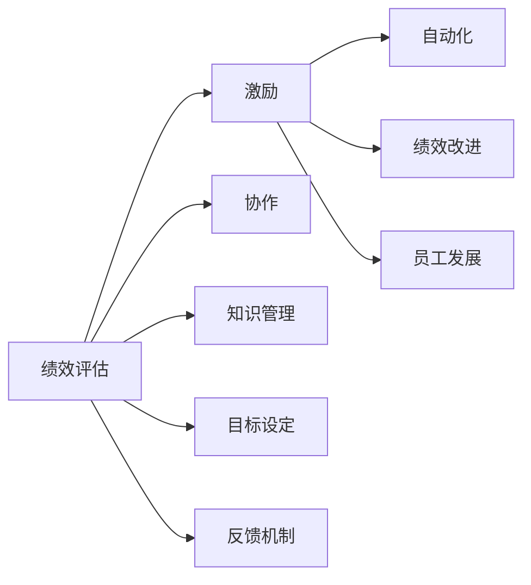

                 

## 1. 背景介绍

在自动化创业的浪潮中，如何评估和激励团队成员成为提高组织绩效和创新的关键因素。本文章将深入探讨自动化创业中绩效评估和激励的核心概念、算法原理、操作步骤，以及未来应用场景。

## 2. 核心概念与联系

### 2.1 核心概念概述

在自动化创业中，绩效评估和激励机制的设计直接影响着组织的生产效率和创新能力。以下是几个核心概念及其相互关系：

- **绩效评估（Performance Evaluation）**：通过系统、客观的方式，对团队成员的工作表现进行定量和定性评价，以识别优秀员工和发现改进空间。
- **激励（Incentives）**：通过奖励和奖惩机制，激发团队成员的工作积极性和创新能力，推动团队和组织目标的实现。
- **自动化（Automation）**：利用技术手段，自动化处理日常重复性工作，解放人力资源，提高工作效率和生产力。
- **协作（Collaboration）**：团队成员之间的良好合作，促进知识共享和创新成果的快速实现。
- **知识管理（Knowledge Management）**：通过有效的知识库和信息管理系统，支持团队成员获取所需知识，提高决策质量和工作效率。

这些概念通过组织架构和流程设计紧密联系在一起，共同推动自动化创业的成功。

### 2.2 核心概念原理和架构的 Mermaid 流程图



## 3. 核心算法原理 & 具体操作步骤

### 3.1 算法原理概述

基于自动化创业中的绩效评估和激励，本节将介绍以下核心算法原理：

- **目标设定与SMART原则**：明确目标，确保目标具体、可衡量、可实现、相关和有时限（SMART原则），以便评估绩效和设定激励标准。
- **360度反馈系统**：收集来自上级、同事和下属的多角度反馈，全面了解团队成员的表现和潜在的改进点。
- **关键绩效指标（KPIs）**：定义可量化的绩效指标，定期跟踪和评估，确保目标的实现和员工的持续改进。
- **量化与定性评估结合**：结合定量数据分析和定性评估，全面衡量员工表现，确保评估结果的客观性和公正性。
- **激励机制设计**：根据评估结果，设计合适的激励措施，如奖金、晋升、培训等，以促进员工积极性和创新力。

### 3.2 算法步骤详解

#### 3.2.1 目标设定

- **SMART原则**：确保目标的五个维度（具体、可衡量、可实现、相关和有时限）被清晰定义。
- **参与制定**：与团队成员共同参与目标设定过程，提高其对目标的认同感和承诺度。
- **书面记录**：将目标以书面形式记录下来，便于跟踪和回顾。

#### 3.2.2 绩效评估

- **定期评估**：设定固定周期（如季度或年度）进行绩效评估，确保评估的及时性和持续性。
- **量化指标**：使用KPIs量化员工表现，如项目完成率、代码质量、创新成果等。
- **定性反馈**：结合同事、上级的定性反馈，识别员工的优点和不足。

#### 3.2.3 激励设计

- **个性化激励**：根据员工的特点和需求，设计个性化的激励措施。
- **即时反馈**：及时提供正面反馈，增强员工的成就感和归属感。
- **长期发展**：提供晋升和培训机会，鼓励员工长期成长和创新。

### 3.3 算法优缺点

#### 3.3.1 优点

- **全面评估**：量化与定性评估相结合，确保评估结果的全面性和客观性。
- **个性化激励**：根据员工特点设计个性化激励措施，提高激励效果。
- **目标驱动**：SMART原则和关键绩效指标的设定，使员工明确目标，提高工作效率和创新能力。

#### 3.3.2 缺点

- **资源消耗**：定期绩效评估和360度反馈系统需要大量时间和人力投入。
- **复杂性**：绩效评估和激励机制设计复杂，需要专业知识和技术支持。
- **执行难度**：团队成员之间的协作和知识管理可能存在挑战，需要良好的团队文化和沟通机制。

### 3.4 算法应用领域

绩效评估和激励机制在自动化创业中广泛应用于多个领域，包括但不限于：

- **软件开发**：通过代码审查、项目进度跟踪和创新成果评估，提高软件质量和开发效率。
- **产品设计**：通过用户反馈和市场数据，评估产品功能和用户体验，推动产品迭代和创新。
- **市场营销**：通过销售额、广告投放效果和客户满意度等指标，评估市场团队表现，优化市场策略。
- **客户支持**：通过客户满意度、问题解决率和客户留存率等指标，评估客服团队绩效，提升客户体验。

## 4. 数学模型和公式 & 详细讲解 & 举例说明

### 4.1 数学模型构建

在本节中，我们将构建一个简单的数学模型来模拟自动化创业中的绩效评估和激励机制。假设我们有n个员工，每个员工有m个目标。每个目标的评估结果为V，激励强度为I。

目标评估结果V由两个部分组成：

- **量化指标得分**：QI=∑KPIi/Q，其中KPIi为第i个员工的第i个目标的关键绩效指标得分。
- **定性反馈得分**：DI=∑Fj/(N-1)，其中Fj为第i个员工在第j个维度上的定性反馈得分，N为反馈来源数量。

### 4.2 公式推导过程

根据上述模型，我们可以推导出每个员工的总绩效评估得分Vtotal：

$$
V_{total,i} = QI_i + DI_i
$$

激励强度I由绩效评估得分Vtotal和激励系数α决定：

$$
I_i = V_{total,i}^α
$$

### 4.3 案例分析与讲解

假设我们有3个员工A、B、C，每个员工有两个目标：项目完成率和代码质量。员工A和B的KPI得分相同，但员工B的定性反馈得分更高。员工C的目标得分较低，但定性反馈得分高。激励系数α=0.8。

我们计算每个员工的总绩效评估得分和激励强度如下：

- **员工A**：
  - QI = ∑KPIi/Q = (90 + 95)/2 = 92.5
  - DI = ∑Fj/(N-1) = (3.8 + 3.7 + 3.6)/2 = 3.7
  - Vtotal = 92.5 + 3.7 = 96.2
  - I = Vtotal^α = 96.2^0.8 = 88.7
  
- **员工B**：
  - QI = ∑KPIi/Q = (90 + 95)/2 = 92.5
  - DI = ∑Fj/(N-1) = (4.1 + 4.0 + 3.9)/2 = 4.0
  - Vtotal = 92.5 + 4.0 = 96.5
  - I = Vtotal^α = 96.5^0.8 = 90.5
  
- **员工C**：
  - QI = ∑KPIi/Q = (80 + 75)/2 = 77.5
  - DI = ∑Fj/(N-1) = (3.5 + 3.3 + 3.1)/2 = 3.3
  - Vtotal = 77.5 + 3.3 = 80.8
  - I = Vtotal^α = 80.8^0.8 = 74.5

## 5. 项目实践：代码实例和详细解释说明

### 5.1 开发环境搭建

为了进行绩效评估和激励机制的开发，我们需要以下开发环境：

- **编程语言**：Python
- **数据管理**：MySQL数据库，用于存储员工数据和绩效评估结果。
- **Web开发框架**：Django，用于构建绩效评估和激励管理平台。
- **前端技术**：JavaScript、React，用于前端页面和交互设计。

### 5.2 源代码详细实现

以下是一个简单的绩效评估和激励管理平台的代码实现：

```python
from django.shortcuts import render, redirect
from django.views import View
from django.http import HttpResponse
from .models import Employee, Target, PerformanceReview
from .forms import PerformanceReviewForm

class PerformanceReviewView(View):
    def get(self, request):
        employee = Employee.objects.get(id=1)
        targets = Target.objects.filter(employee=employee)
        performance_reviews = PerformanceReview.objects.filter(employee=employee).order_by('-datedev)
        form = PerformanceReviewForm(request.POST or None)
        return render(request, 'performance_review.html', {'employee': employee, 'targets': targets, 'performance_reviews': performance_reviews, 'form': form})

    def post(self, request):
        form = PerformanceReviewForm(request.POST)
        if form.is_valid():
            performance_review = form.save(commit=False)
            performance_review.employee = Employee.objects.get(id=1)
            performance_review.save()
            return redirect('performance_review')
        return render(request, 'performance_review.html', {'employee': Employee.objects.get(id=1), 'targets': Target.objects.filter(employee=Employee.objects.get(id=1)), 'performance_reviews': PerformanceReview.objects.filter(employee=Employee.objects.get(id=1)).order_by('-datedev'), 'form': PerformanceReviewForm(request.POST or None)}
```

### 5.3 代码解读与分析

以上代码实现了绩效评估和激励管理平台的一个基本功能：展示员工的绩效评估结果和提交新的绩效评估信息。

- **视图函数**：`PerformanceReviewView`处理HTTP请求，展示员工绩效评估信息或提交新的绩效评估。
- **模型类**：`Employee`、`Target`、`PerformanceReview`分别表示员工、目标和绩效评估。
- **表单类**：`PerformanceReviewForm`用于提交新的绩效评估信息。

## 6. 实际应用场景

### 6.1 软件开发

在软件开发中，可以使用绩效评估和激励机制来评估和提升软件质量和开发效率。通过代码审查、项目进度跟踪和创新成果评估，可以量化每个开发人员的表现，并根据其贡献大小进行激励。

### 6.2 产品设计

在产品设计中，通过市场数据和用户反馈，可以评估产品功能和用户体验。根据评估结果，优化产品迭代策略，提升产品的市场竞争力和用户体验。

### 6.3 市场营销

在市场营销中，通过销售额、广告投放效果和客户满意度等指标，可以评估市场团队的表现，优化市场策略，提升品牌影响力和市场份额。

### 6.4 客户支持

在客户支持中，通过客户满意度、问题解决率和客户留存率等指标，可以评估客服团队的表现，提升客户体验和满意度。

## 7. 工具和资源推荐

### 7.1 学习资源推荐

为了深入理解绩效评估和激励机制，推荐以下学习资源：

- **《高效能组织：人力资源管理之道》**：详细介绍了人力资源管理和绩效评估的最佳实践。
- **《敏捷开发原则与实践》**：介绍了敏捷开发和持续改进的基本概念和实践。
- **《激励理论》**：探讨了各种激励理论，如期望理论、公平理论和目标设置理论。
- **《数据驱动的绩效管理》**：利用数据分析技术进行绩效评估和管理。

### 7.2 开发工具推荐

以下是一些常用的开发工具，可用于实现绩效评估和激励机制：

- **项目管理工具**：JIRA，用于跟踪任务进度和绩效评估。
- **文档管理系统**：Confluence，用于存储和共享知识库。
- **代码审查工具**：GitHub，用于代码审查和版本控制。
- **数据可视化工具**：Tableau，用于展示绩效评估数据。

### 7.3 相关论文推荐

以下是一些经典的绩效评估和激励机制研究论文，推荐阅读：

- **"Performance Appraisal: Concepts, Controversies, and Practices"**：介绍了绩效评估的基本概念、方法和争议。
- **"Incentive Theory: Organizations, Organizers, and Organizational Contexts"**：探讨了激励理论及其在组织中的应用。
- **"Employee Engagement and Performance: Integrating Insights from Work Motivation, Affective Events, and Positive Organizational Scholarship"**：研究了员工参与度和绩效的关系，提供了多种激励策略。

## 8. 总结：未来发展趋势与挑战

### 8.1 研究成果总结

本文对自动化创业中的绩效评估和激励机制进行了全面的介绍和分析，涵盖目标设定、绩效评估和激励设计等核心内容，并提供了详细的代码实现和实际应用场景。

### 8.2 未来发展趋势

未来，绩效评估和激励机制将朝着以下方向发展：

- **智能化评估**：利用人工智能和大数据分析技术，进行实时、动态的绩效评估，提高评估的准确性和及时性。
- **个性化激励**：根据员工的特点和需求，设计更加个性化的激励措施，提高激励效果。
- **全员参与**：通过参与式管理，增强员工对绩效评估和激励机制的认同感和支持度。
- **多维评估**：引入多维度的评估指标，如心理状态、团队协作和创新能力等，全面衡量员工表现。

### 8.3 面临的挑战

在自动化创业中，绩效评估和激励机制的设计和执行面临以下挑战：

- **数据质量**：绩效评估和激励机制需要高质量的数据支撑，但数据的获取和清洗可能存在难度。
- **执行难度**：绩效评估和激励机制需要全体成员的参与和支持，执行过程中可能遇到沟通和协作的挑战。
- **文化差异**：不同文化背景的员工可能对绩效评估和激励机制有不同的理解和接受度，需要进行文化适应和调整。
- **公平性**：绩效评估和激励机制需要保持公平性，避免偏见和歧视，确保所有员工都能得到公正的对待。

### 8.4 研究展望

未来，绩效评估和激励机制的研究方向包括：

- **公平性与公正性**：如何设计和实施公平、公正的绩效评估和激励机制，减少偏见和歧视。
- **数据驱动的决策**：如何利用数据驱动的决策支持系统，提高绩效评估和激励机制的科学性和精准性。
- **智能化和自动化**：如何引入人工智能和大数据分析技术，实现绩效评估和激励机制的智能化和自动化。

## 9. 附录：常见问题与解答

**Q1：绩效评估和激励机制如何与公司的战略目标相结合？**

A: 绩效评估和激励机制的设计需要与公司的战略目标紧密结合，确保员工的工作目标与公司战略一致。例如，如果公司战略目标是提升产品质量，则绩效评估和激励机制可以围绕代码质量、项目进度和创新成果等指标进行设计。

**Q2：如何进行绩效评估和激励机制的持续改进？**

A: 绩效评估和激励机制需要持续改进，以适应公司战略和市场变化。可以通过以下方式进行改进：
- **定期回顾**：定期回顾绩效评估和激励机制的实施效果，收集反馈意见。
- **数据分析**：利用数据分析技术，评估绩效评估和激励机制的效果和问题。
- **调整策略**：根据回顾和数据分析结果，调整绩效评估和激励机制的策略和指标。

**Q3：如何处理绩效评估和激励机制中的偏见和歧视？**

A: 绩效评估和激励机制中的偏见和歧视需要通过以下方式进行处理：
- **多元化团队**：组建多元化的评估团队，确保评估的公正性。
- **透明标准**：制定透明的评估标准和流程，确保评估的公平性。
- **反馈机制**：建立反馈机制，及时处理员工对评估结果的异议和申诉。

**Q4：如何进行绩效评估和激励机制的落地实施？**

A: 绩效评估和激励机制的落地实施需要以下步骤：
- **培训和宣导**：对员工进行培训和宣导，确保其对绩效评估和激励机制的理解和支持。
- **工具支持**：使用合适的工具和平台，支持绩效评估和激励机制的实施。
- **持续优化**：根据实施效果进行持续优化，确保绩效评估和激励机制的有效性。

**Q5：如何处理绩效评估和激励机制中的复杂性和执行难度？**

A: 绩效评估和激励机制的复杂性和执行难度需要通过以下方式进行处理：
- **简化流程**：简化绩效评估和激励机制的流程，降低执行难度。
- **员工参与**：通过参与式管理，增强员工对绩效评估和激励机制的认同感和支持度。
- **文化适应**：根据公司文化，调整绩效评估和激励机制的设计和实施方式。

---

作者：禅与计算机程序设计艺术 / Zen and the Art of Computer Programming

