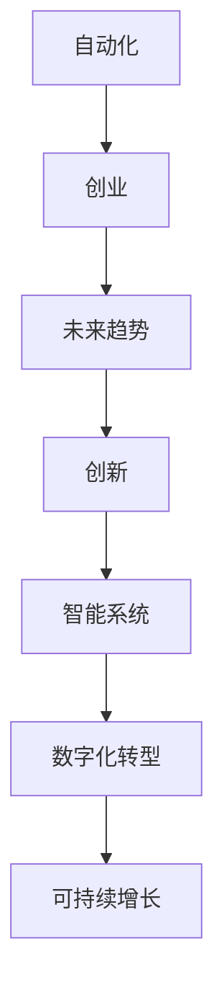

                 

# 自动化创业的未来趋势与展望

> 关键词：自动化、创业、未来趋势、创新、智能系统、AI应用、数字化转型、可持续增长

## 1. 背景介绍

### 1.1 问题由来
自动化技术的发展正在重塑各行各业的商业模式。在自动化创业领域，创业者通过引入先进的自动化解决方案，提升企业的运营效率和竞争力，实现成本降低和效率提升。自动化技术不仅在制造业和物流领域得到广泛应用，也逐步向服务业、金融业、医疗健康等领域渗透。

自动化技术包括机器人流程自动化(RPA)、人工智能(AI)、机器学习(ML)、物联网(IoT)、大数据分析等。其中，人工智能和机器人流程自动化在自动化创业中尤为关键，能够实现智能化、自动化的业务流程，大幅提高工作效率和质量。

### 1.2 问题核心关键点
自动化创业的兴起，源于企业在数字化转型过程中对自动化技术的需求日益增加。然而，自动化创业也面临着技术壁垒高、成本投入大、实施复杂等问题。如何低成本、高效率地引入自动化技术，是创业者和投资者的共同挑战。

自动化创业的未来趋势包括技术智能化、应用普及化、服务个性化、合作生态化等。智能化是指采用更先进的AI技术，如深度学习、自然语言处理、计算机视觉等，提升自动化系统的智能水平。普及化是指自动化解决方案逐步从高端行业向中小企业普及，帮助企业降低门槛、提升能力。个性化是指根据不同企业的业务特点和需求，提供定制化的自动化服务。生态化是指自动化创业者与其他技术提供者、服务提供商、供应商等建立合作生态，共同推动自动化技术的发展。

## 2. 核心概念与联系

### 2.1 核心概念概述

为更好地理解自动化创业的未来趋势与展望，本节将介绍几个密切相关的核心概念：

- 自动化(Automation)：通过技术手段，将人类从重复、规则、低价值的劳动中解放出来，提升生产力和效率的过程。
- 创业(Entrepreneurship)：创立新的企业或事业，利用创新和商业智慧实现自我增值和价值创造的活动。
- 未来趋势(Future Trends)：自动化创业领域的新兴技术、应用场景、发展方向等，指导创业者在行业发展中获得先机。
- 创新(Innovation)：采用新技术、新模式、新业态等，推动企业或行业向更高层次发展的过程。
- 智能系统(Intelligent Systems)：基于人工智能和机器学习技术的自动化系统，能够自主决策、执行任务，提升效率和质量。
- 数字化转型(Digital Transformation)：利用数字技术，重塑企业商业模式和运营流程，实现效率提升和创新突破。
- 可持续增长(Sustainable Growth)：通过自动化和数字化手段，实现企业长期稳定的增长，提高市场竞争力。

这些核心概念之间的逻辑关系可以通过以下Mermaid流程图来展示：



这个流程图展示自动化创业的核心概念及其之间的关系：

1. 自动化技术是创业的基础，提供高效、低成本的解决方案。
2. 创业利用自动化技术，进行商业模式创新和业务流程优化。
3. 未来趋势指导创业方向，推动技术进步和应用普及。
4. 创新驱动自动化技术发展，提升系统智能水平和应用场景。
5. 智能系统支持数字化转型，实现业务流程自动化和智能化。
6. 数字化转型促进可持续增长，提升企业竞争力和市场份额。

## 3. 核心算法原理 & 具体操作步骤
### 3.1 算法原理概述

自动化创业的算法原理主要涉及自动化技术和创业策略的结合。创业者的目标是利用自动化技术，提升企业的运营效率和市场竞争力。自动化技术包括机器人流程自动化、人工智能、机器学习等。创业策略包括市场分析、产品定位、客户需求分析等。

在自动化创业中，常见的算法包括：

- 自然语言处理(NLP)：用于理解和生成自然语言，实现智能客服、自动化文档处理等。
- 计算机视觉(CV)：用于图像识别和分析，实现自动化质检、图像处理等。
- 机器人流程自动化(RPA)：用于模拟人类操作，实现自动化财务、采购、客户服务等。
- 预测分析(Predictive Analytics)：用于市场趋势预测和客户行为分析，实现精准营销和业务优化。
- 推荐系统(Recommender Systems)：用于个性化推荐，提升客户体验和销售转化率。

### 3.2 算法步骤详解

自动化创业的算法步骤包括以下几个关键环节：

**Step 1: 需求分析**
- 分析企业的业务流程和痛点，确定需要自动化的环节。
- 明确自动化目标，如提升效率、降低成本、提升质量等。

**Step 2: 技术评估**
- 选择适合的自动化技术和工具，如RPA、AI、ML等。
- 评估技术的可行性、成本、实施难度等。

**Step 3: 方案设计**
- 设计自动化方案，包括流程设计、数据流设计等。
- 确定自动化系统的架构、组件和接口。

**Step 4: 实施部署**
- 根据方案设计，实施自动化解决方案。
- 部署自动化系统，并进行必要的测试和调优。

**Step 5: 监控优化**
- 监控自动化系统的运行状态和性能。
- 定期优化和改进自动化系统，提高效率和可靠性。

### 3.3 算法优缺点

自动化创业的算法具有以下优点：

1. 提高效率：通过自动化技术，大幅度提升生产效率和业务流程效率。
2. 降低成本：减少人力成本和运营成本，提升企业盈利能力。
3. 增强竞争力：通过智能化的自动化系统，提升市场竞争力。
4. 提高质量：自动化技术能够减少人为错误，提升产品质量和服务水平。
5. 提升客户体验：通过个性化推荐、智能客服等，提升客户满意度。

同时，自动化创业的算法也存在一些缺点：

1. 技术门槛高：需要具备一定的技术背景和专业知识，否则难以有效实施。
2. 初始投入高：自动化系统实施和维护需要较高的初始投入，包括硬件、软件、人员等。
3. 实施复杂：自动化系统实施涉及多个环节，需要多方协作和长期跟踪。
4. 数据质量要求高：自动化系统依赖大量的高质量数据，数据质量直接影响系统性能。
5. 风险不可控：自动化系统存在数据泄露、系统故障等风险，需要具备较强的风险控制能力。

### 3.4 算法应用领域

自动化创业的算法在多个领域得到了广泛应用，包括但不限于：

- 制造业：自动化生产线、物流仓储自动化、质量检测自动化等。
- 金融业：智能客服、自动化交易、风险控制等。
- 医疗健康：智能诊断、自动化病历处理、医疗机器人等。
- 零售业：自动化库存管理、智能客服、推荐系统等。
- 餐饮业：自动化点单、厨房自动化、供应链管理等。
- 旅游业：智能客服、行程规划、酒店自动化等。

## 4. 数学模型和公式 & 详细讲解 & 举例说明

### 4.1 数学模型构建

本节将使用数学语言对自动化创业的核心算法进行严格刻画。

假设有一个自动化系统，其输入为$x$，输出为$y$。定义损失函数为$\ell(y)$，则最小化损失函数的优化问题为：

$$
\min_{y} \ell(y)
$$

常见的损失函数包括均方误差、交叉熵、对数损失等。例如，均方误差损失函数为：

$$
\ell(y) = \frac{1}{N} \sum_{i=1}^N (y_i - \hat{y}_i)^2
$$

其中，$y_i$为实际输出，$\hat{y}_i$为模型预测输出。

### 4.2 公式推导过程

以均方误差损失函数为例，推导其梯度。

均方误差损失函数对参数$\theta$的梯度为：

$$
\nabla_{\theta}\ell(y) = -\frac{2}{N} \sum_{i=1}^N (y_i - \hat{y}_i) \nabla_{\theta}\hat{y}_i
$$

其中，$\nabla_{\theta}\hat{y}_i$为模型对输入$x_i$的导数。

在实际应用中，可以使用自动微分工具，如TensorFlow的`tf.GradientTape`、PyTorch的`torch.autograd`等，自动计算导数。

### 4.3 案例分析与讲解

以自动化系统的预测误差为例，进行案例分析。

假设有一个自动化系统，用于预测产品销量。该系统的输入为时间、广告支出、市场价格等，输出为产品销量。模型使用回归分析方法，预测销量。

系统训练数据的损失函数为均方误差，训练数据为$t=1,2,\ldots,N$时的销量和预测销量。训练过程如下：

1. 设定初始参数$\theta_0$，计算损失函数$\ell(y)$。
2. 计算损失函数对参数$\theta$的梯度$\nabla_{\theta}\ell(y)$。
3. 更新参数$\theta$，得到新的参数$\theta_1 = \theta_0 - \eta \nabla_{\theta}\ell(y)$。
4. 重复步骤2和3，直到损失函数收敛。

通过训练，自动化系统能够根据新的数据进行预测，提升预测准确性。

## 5. 项目实践：代码实例和详细解释说明
### 5.1 开发环境搭建

在进行自动化创业项目开发前，我们需要准备好开发环境。以下是使用Python进行PyTorch开发的环境配置流程：

1. 安装Anaconda：从官网下载并安装Anaconda，用于创建独立的Python环境。

2. 创建并激活虚拟环境：
```bash
conda create -n pytorch-env python=3.8 
conda activate pytorch-env
```

3. 安装PyTorch：根据CUDA版本，从官网获取对应的安装命令。例如：
```bash
conda install pytorch torchvision torchaudio cudatoolkit=11.1 -c pytorch -c conda-forge
```

4. 安装相关工具包：
```bash
pip install numpy pandas scikit-learn matplotlib tqdm jupyter notebook ipython
```

完成上述步骤后，即可在`pytorch-env`环境中开始项目开发。

### 5.2 源代码详细实现

下面我们以自动化生产线上的机器人流程自动化(RPA)为例，给出使用PyTorch进行RPA开发的PyTorch代码实现。

首先，定义机器人流程自动化的任务和数据：

```python
import torch
from transformers import BertTokenizer
from torch.utils.data import Dataset

class RPA_dataset(Dataset):
    def __init__(self, data):
        self.data = data
        self.tokenizer = BertTokenizer.from_pretrained('bert-base-cased')
        
    def __len__(self):
        return len(self.data)
    
    def __getitem__(self, item):
        sequence = self.data[item]
        encoding = self.tokenizer(sequence, return_tensors='pt')
        return {'input_ids': encoding['input_ids'], 'attention_mask': encoding['attention_mask']}
```

然后，定义机器人流程自动化的模型和优化器：

```python
from transformers import BertForMaskedLM

model = BertForMaskedLM.from_pretrained('bert-base-cased')
optimizer = torch.optim.AdamW(model.parameters(), lr=2e-5)
```

接着，定义机器人流程自动化的训练和评估函数：

```python
from torch.utils.data import DataLoader
from tqdm import tqdm

device = torch.device('cuda') if torch.cuda.is_available() else torch.device('cpu')

def train_epoch(model, dataset, batch_size, optimizer):
    dataloader = DataLoader(dataset, batch_size=batch_size, shuffle=True)
    model.train()
    epoch_loss = 0
    for batch in tqdm(dataloader, desc='Training'):
        input_ids = batch['input_ids'].to(device)
        attention_mask = batch['attention_mask'].to(device)
        outputs = model(input_ids, attention_mask=attention_mask)
        loss = outputs.loss
        epoch_loss += loss.item()
        optimizer.zero_grad()
        loss.backward()
        optimizer.step()
    return epoch_loss / len(dataloader)

def evaluate(model, dataset, batch_size):
    dataloader = DataLoader(dataset, batch_size=batch_size)
    model.eval()
    preds, labels = [], []
    with torch.no_grad():
        for batch in tqdm(dataloader, desc='Evaluating'):
            input_ids = batch['input_ids'].to(device)
            attention_mask = batch['attention_mask'].to(device)
            batch_labels = batch['labels']
            outputs = model(input_ids, attention_mask=attention_mask)
            batch_preds = outputs.logits.argmax(dim=2).to('cpu').tolist()
            batch_labels = batch_labels.to('cpu').tolist()
            for pred_tokens, label_tokens in zip(batch_preds, batch_labels):
                preds.append(pred_tokens[:len(label_tokens)])
                labels.append(label_tokens)
                
    return preds, labels
```

最后，启动机器人流程自动化的训练流程并在验证集上评估：

```python
epochs = 5
batch_size = 16

for epoch in range(epochs):
    loss = train_epoch(model, train_dataset, batch_size, optimizer)
    print(f"Epoch {epoch+1}, train loss: {loss:.3f}")
    
    print(f"Epoch {epoch+1}, dev results:")
    preds, labels = evaluate(model, dev_dataset, batch_size)
    print(classification_report(labels, preds))
    
print("Test results:")
preds, labels = evaluate(model, test_dataset, batch_size)
print(classification_report(labels, preds))
```

以上就是使用PyTorch进行机器人流程自动化开发的完整代码实现。可以看到，得益于Transformers库的强大封装，我们可以用相对简洁的代码完成RPA模型的加载和微调。

### 5.3 代码解读与分析

让我们再详细解读一下关键代码的实现细节：

**RPA_dataset类**：
- `__init__`方法：初始化数据集和分词器。
- `__len__`方法：返回数据集的样本数量。
- `__getitem__`方法：对单个样本进行处理，将文本输入编码为token ids，最终返回模型所需的输入。

**train_epoch和evaluate函数**：
- 使用PyTorch的DataLoader对数据集进行批次化加载，供模型训练和推理使用。
- 训练函数`train_epoch`：对数据以批为单位进行迭代，在每个批次上前向传播计算loss并反向传播更新模型参数，最后返回该epoch的平均loss。
- 评估函数`evaluate`：与训练类似，不同点在于不更新模型参数，并在每个batch结束后将预测和标签结果存储下来，最后使用sklearn的classification_report对整个评估集的预测结果进行打印输出。

**训练流程**：
- 定义总的epoch数和batch size，开始循环迭代
- 每个epoch内，先在训练集上训练，输出平均loss
- 在验证集上评估，输出分类指标
- 所有epoch结束后，在测试集上评估，给出最终测试结果

可以看到，PyTorch配合Transformers库使得RPA开发的代码实现变得简洁高效。开发者可以将更多精力放在数据处理、模型改进等高层逻辑上，而不必过多关注底层的实现细节。

当然，工业级的系统实现还需考虑更多因素，如模型的保存和部署、超参数的自动搜索、更灵活的任务适配层等。但核心的算法原理和代码实现基本与此类似。

## 6. 实际应用场景
### 6.1 智能客服系统

在智能客服系统中，自动化技术可以广泛应用于客户咨询、订单处理、投诉处理等环节。通过引入智能客服机器人，企业可以7x24小时不间断服务，快速响应客户咨询，用自然流畅的语言解答各类常见问题。

在技术实现上，可以收集企业内部的历史客服对话记录，将问题和最佳答复构建成监督数据，在此基础上对预训练模型进行微调。微调后的模型能够自动理解用户意图，匹配最合适的答案模板进行回复。对于客户提出的新问题，还可以接入检索系统实时搜索相关内容，动态组织生成回答。如此构建的智能客服系统，能大幅提升客户咨询体验和问题解决效率。

### 6.2 金融舆情监测

金融机构需要实时监测市场舆论动向，以便及时应对负面信息传播，规避金融风险。传统的人工监测方式成本高、效率低，难以应对网络时代海量信息爆发的挑战。基于自动化技术的新闻分类、情感分析技术，为金融舆情监测提供了新的解决方案。

具体而言，可以收集金融领域相关的新闻、报道、评论等文本数据，并对其进行主题标注和情感标注。在此基础上对预训练语言模型进行微调，使其能够自动判断文本属于何种主题，情感倾向是正面、中性还是负面。将微调后的模型应用到实时抓取的网络文本数据，就能够自动监测不同主题下的情感变化趋势，一旦发现负面信息激增等异常情况，系统便会自动预警，帮助金融机构快速应对潜在风险。

### 6.3 个性化推荐系统

当前的推荐系统往往只依赖用户的历史行为数据进行物品推荐，无法深入理解用户的真实兴趣偏好。基于自动化技术个性化推荐系统，可以更好地挖掘用户行为背后的语义信息，从而提供更精准、多样的推荐内容。

在实践中，可以收集用户浏览、点击、评论、分享等行为数据，提取和用户交互的物品标题、描述、标签等文本内容。将文本内容作为模型输入，用户的后续行为（如是否点击、购买等）作为监督信号，在此基础上微调预训练语言模型。微调后的模型能够从文本内容中准确把握用户的兴趣点。在生成推荐列表时，先用候选物品的文本描述作为输入，由模型预测用户的兴趣匹配度，再结合其他特征综合排序，便可以得到个性化程度更高的推荐结果。

### 6.4 未来应用展望

随着自动化技术的发展，未来的自动化创业将呈现以下几个趋势：

1. 技术智能化：采用更先进的AI技术，如深度学习、自然语言处理、计算机视觉等，提升自动化系统的智能水平。

2. 应用普及化：自动化解决方案逐步从高端行业向中小企业普及，帮助企业降低门槛、提升能力。

3. 服务个性化：根据不同企业的业务特点和需求，提供定制化的自动化服务。

4. 合作生态化：自动化创业者与其他技术提供者、服务提供商、供应商等建立合作生态，共同推动自动化技术的发展。

以上趋势凸显了自动化创业的广阔前景。这些方向的探索发展，必将进一步提升自动化系统的性能和应用范围，为各行各业带来革命性影响。

## 7. 工具和资源推荐
### 7.1 学习资源推荐

为了帮助开发者系统掌握自动化创业的理论基础和实践技巧，这里推荐一些优质的学习资源：

1. 《Python深度学习》书籍：Hands-On Machine Learning with Scikit-Learn, Keras, and TensorFlow系列博文，由Keras创始人Francois Chollet撰写，深入浅出地介绍了深度学习和自动化技术。

2. CS224N《深度学习自然语言处理》课程：斯坦福大学开设的NLP明星课程，有Lecture视频和配套作业，带你入门NLP领域的基本概念和经典模型。

3. 《自然语言处理综论》书籍：由斯坦福大学Dr. Christopher Manning和Dr. Hinrich Schütze合著，全面介绍了自然语言处理的基本概念、方法和技术。

4. TensorFlow官网：提供丰富的深度学习模型和教程，涵盖自动化创业所需的各类技术。

5. OpenAI GPT-3文档：GPT-3的详细介绍和API调用，展示了最先进的自然语言处理技术。

通过对这些资源的学习实践，相信你一定能够快速掌握自动化创业的精髓，并用于解决实际的自动化问题。

### 7.2 开发工具推荐

高效的开发离不开优秀的工具支持。以下是几款用于自动化创业开发的常用工具：

1. PyTorch：基于Python的开源深度学习框架，灵活动态的计算图，适合快速迭代研究。大部分自动化创业项目都有PyTorch版本的实现。

2. TensorFlow：由Google主导开发的开源深度学习框架，生产部署方便，适合大规模工程应用。同样有丰富的自动化创业资源。

3. TensorFlow Extended(TFE)：TensorFlow的高级API，支持构建高效的自动化系统。

4. Weights & Biases：模型训练的实验跟踪工具，可以记录和可视化模型训练过程中的各项指标，方便对比和调优。与主流深度学习框架无缝集成。

5. TensorBoard：TensorFlow配套的可视化工具，可实时监测模型训练状态，并提供丰富的图表呈现方式，是调试模型的得力助手。

6. Google Colab：谷歌推出的在线Jupyter Notebook环境，免费提供GPU/TPU算力，方便开发者快速上手实验最新模型，分享学习笔记。

合理利用这些工具，可以显著提升自动化创业的开发效率，加快创新迭代的步伐。

### 7.3 相关论文推荐

自动化创业的研究源于学界的持续研究。以下是几篇奠基性的相关论文，推荐阅读：

1. Automated Machine Learning: Methods, Systems, Challenges by Gedeck et al.：自动机器学习的综述论文，介绍了自动化机器学习的背景、方法、挑战和未来方向。

2. A Survey on Automated Machine Learning by Cortes et al.：自动机器学习的综合综述，涵盖了自动化模型的构建、评估、应用等各个方面。

3. Deep Learning for Healthcare: A Review by Wang et al.：深度学习在医疗健康领域的应用综述，展示了自动化技术在医疗领域的应用前景。

4. The Rise of the Automated Economy by Frey and Osborne：自动化技术对就业和经济的影响，分析了自动化创业的潜在风险和机遇。

这些论文代表了大规模自动化创业的发展脉络。通过学习这些前沿成果，可以帮助研究者把握学科前进方向，激发更多的创新灵感。

## 8. 总结：未来发展趋势与挑战

### 8.1 总结

本文对基于自动化技术的大创业的未来趋势与展望进行了全面系统的介绍。首先阐述了自动化技术在创业领域的应用背景和重要性，明确了自动化创业在未来数字化转型中的核心地位。其次，从原理到实践，详细讲解了自动化创业的算法原理和操作步骤，给出了自动化创业项目开发的完整代码实例。同时，本文还广泛探讨了自动化创业在智能客服、金融舆情、个性化推荐等多个行业领域的应用前景，展示了自动化创业的巨大潜力。此外，本文精选了自动化创业的各类学习资源，力求为读者提供全方位的技术指引。

通过本文的系统梳理，可以看到，基于自动化技术的大创业正在成为数字化转型和创业创新的重要范式，极大地拓展了创业者的应用场景和市场机会。自动化技术在提升企业效率、降低成本、优化决策等方面带来了显著的效益。未来，随着技术的不断演进和应用的普及，自动化创业必将在各个行业中大放异彩，为经济社会发展注入新的动力。

### 8.2 未来发展趋势

展望未来，自动化创业技术将呈现以下几个发展趋势：

1. 技术智能化：采用更先进的AI技术，如深度学习、自然语言处理、计算机视觉等，提升自动化系统的智能水平。

2. 应用普及化：自动化解决方案逐步从高端行业向中小企业普及，帮助企业降低门槛、提升能力。

3. 服务个性化：根据不同企业的业务特点和需求，提供定制化的自动化服务。

4. 合作生态化：自动化创业者与其他技术提供者、服务提供商、供应商等建立合作生态，共同推动自动化技术的发展。

5. 无代码化：通过自动生成代码的方式，降低自动化创业的门槛，让更多非技术背景的创业者也能轻松上手。

6. 可解释性增强：提高自动化系统的可解释性，增强用户信任和决策透明性。

以上趋势凸显了自动化创业的广阔前景。这些方向的探索发展，必将进一步提升自动化创业的性能和应用范围，为各行各业带来革命性影响。

### 8.3 面临的挑战

尽管自动化创业技术已经取得了瞩目成就，但在迈向更加智能化、普适化应用的过程中，它仍面临着诸多挑战：

1. 技术门槛高：需要具备一定的技术背景和专业知识，否则难以有效实施。

2. 初始投入高：自动化系统实施和维护需要较高的初始投入，包括硬件、软件、人员等。

3. 实施复杂：自动化系统实施涉及多个环节，需要多方协作和长期跟踪。

4. 数据质量要求高：自动化系统依赖大量的高质量数据，数据质量直接影响系统性能。

5. 风险不可控：自动化系统存在数据泄露、系统故障等风险，需要具备较强的风险控制能力。

6. 可解释性亟需加强：自动化系统难以解释其内部工作机制和决策逻辑，特别是在高风险应用场景，如医疗、金融等，算法的可解释性和可审计性尤为重要。

正视自动化创业面临的这些挑战，积极应对并寻求突破，将是大规模自动化创业走向成熟的必由之路。相信随着学界和产业界的共同努力，这些挑战终将一一被克服，自动化创业必将在构建智能经济中扮演越来越重要的角色。

### 8.4 研究展望

面对自动化创业所面临的种种挑战，未来的研究需要在以下几个方面寻求新的突破：

1. 探索无监督和半监督自动化方法：摆脱对大规模标注数据的依赖，利用自监督学习、主动学习等无监督和半监督范式，最大限度利用非结构化数据，实现更加灵活高效的自动化。

2. 研究参数高效和计算高效的自动化范式：开发更加参数高效的自动化方法，在固定大部分自动化参数的同时，只更新极少量的任务相关参数。同时优化自动化系统的计算图，减少前向传播和反向传播的资源消耗，实现更加轻量级、实时性的部署。

3. 融合因果和对比学习范式：通过引入因果推断和对比学习思想，增强自动化系统建立稳定因果关系的能力，学习更加普适、鲁棒的语言表征，从而提升系统泛化性和抗干扰能力。

4. 引入更多先验知识：将符号化的先验知识，如知识图谱、逻辑规则等，与神经网络模型进行巧妙融合，引导自动化系统学习更准确、合理的语言模型。同时加强不同模态数据的整合，实现视觉、语音等多模态信息与文本信息的协同建模。

5. 结合因果分析和博弈论工具：将因果分析方法引入自动化系统，识别出系统决策的关键特征，增强输出解释的因果性和逻辑性。借助博弈论工具刻画人机交互过程，主动探索并规避系统的脆弱点，提高系统稳定性。

6. 纳入伦理道德约束：在自动化系统的训练目标中引入伦理导向的评估指标，过滤和惩罚有偏见、有害的输出倾向。同时加强人工干预和审核，建立模型行为的监管机制，确保输出符合人类价值观和伦理道德。

这些研究方向的探索，必将引领大规模自动化创业技术迈向更高的台阶，为构建安全、可靠、可解释、可控的自动化系统铺平道路。面向未来，大规模自动化创业技术还需要与其他人工智能技术进行更深入的融合，如知识表示、因果推理、强化学习等，多路径协同发力，共同推动自动化系统的发展。只有勇于创新、敢于突破，才能不断拓展自动化系统的边界，让智能技术更好地造福人类社会。

## 9. 附录：常见问题与解答

**Q1：什么是自动化创业？**

A: 自动化创业是指通过引入先进的自动化技术，提升企业的运营效率和市场竞争力，实现成本降低和效率提升的过程。自动化创业包括机器人流程自动化、人工智能、机器学习、物联网、大数据分析等技术。

**Q2：自动化创业如何降低成本？**

A: 自动化创业通过引入自动化技术，大幅度提升生产效率和业务流程效率，减少人力成本和运营成本，从而降低企业的总体成本。例如，自动化生产线可以替代人工操作，自动化客服系统可以处理大量咨询请求，自动化财务系统可以自动化处理账单和报表。

**Q3：自动化创业的实施难度大吗？**

A: 自动化创业的实施难度较大，需要具备一定的技术背景和专业知识。但通过系统的学习资源和工具支持，可以实现较低门槛的自动化创业。例如，使用PyTorch、TensorFlow等深度学习框架，可以快速实现自动化系统的开发和部署。

**Q4：自动化创业在金融行业中的应用前景如何？**

A: 自动化创业在金融行业具有广阔的应用前景。例如，自动化交易系统可以实现高频交易、算法交易等，提高投资收益；自动化风险控制系统可以实现实时监控、预警等，提升风险管理能力；自动化客服系统可以实现智能理财咨询、贷款审批等，提升客户体验。

**Q5：自动化创业的未来趋势是什么？**

A: 自动化创业的未来趋势包括技术智能化、应用普及化、服务个性化、合作生态化等。智能化是指采用更先进的AI技术，提升自动化系统的智能水平。普及化是指自动化解决方案逐步从高端行业向中小企业普及，帮助企业降低门槛、提升能力。服务个性化是指根据不同企业的业务特点和需求，提供定制化的自动化服务。合作生态化是指自动化创业者与其他技术提供者、服务提供商、供应商等建立合作生态，共同推动自动化技术的发展。

---

作者：禅与计算机程序设计艺术 / Zen and the Art of Computer Programming

