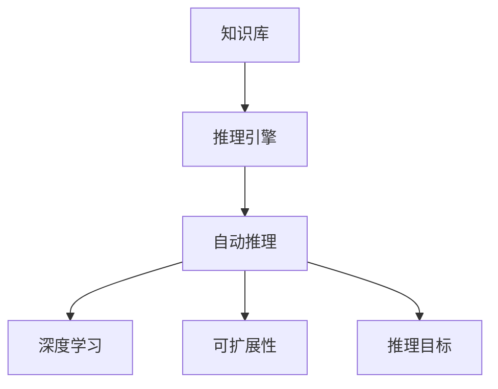

                 

# 自动推理库的设计与实现：AI决策的基石

> 关键词：自动推理库, AI决策, 算法原理, 设计, 实现, 应用领域, 发展趋势

## 1. 背景介绍

### 1.1 问题由来
在人工智能(AI)领域，推理能力是决策系统不可或缺的核心功能之一。自动推理库作为AI决策的基石，通过对知识库的逻辑推理，实现问题求解、逻辑判断、智能决策等复杂任务。然而，自动推理技术往往与传统软件工程相对独立，导致其应用难度较高，难以融入复杂的业务系统中。

近年来，随着深度学习等新技术的兴起，自动推理库的设计与实现面临着新的挑战。一方面，深度学习模型的泛化能力显著提升，但推理过程本身仍缺乏逻辑依据。另一方面，AI决策系统需要在实际应用中具备灵活性和可靠性，这需要自动推理库的支持。

因此，本文聚焦于自动推理库的设计与实现，讨论如何构建更高效、更灵活、更可靠的AI决策系统，推动AI技术在各行业的应用落地。

### 1.2 问题核心关键点
自动推理库的设计与实现涉及到多个关键点：

1. 知识表示：如何有效地将业务知识转换为机器可理解的形式。
2. 推理算法：选择何种算法实现自动推理，保证推理过程高效准确。
3. 推理引擎：如何将推理算法高效实现，支持多种推理目标和应用场景。
4. 应用集成：如何将自动推理库无缝集成到现有业务系统中，实现与其它模块协同工作。
5. 可扩展性：如何在保证推理性能的同时，支持新的推理规则和知识库的动态扩展。

通过深入探索这些核心问题，我们可以更好地理解自动推理库的设计原则和实现方法。

### 1.3 问题研究意义
研究自动推理库的设计与实现，对于提升AI决策系统的性能和可靠性，推动AI技术的实际应用，具有重要意义：

1. 增强决策准确性：自动推理库可以精确地处理复杂逻辑问题，提供更可靠的决策支持。
2. 提升系统鲁棒性：通过推理逻辑和知识库的约束，增强系统的鲁棒性和容错能力。
3. 优化资源利用：自动推理库可以实现多任务并行和结果缓存，提高系统效率。
4. 加速应用开发：通过自动推理库的接口，简化业务系统的开发流程，加快项目交付速度。
5. 促进业务创新：结合AI技术和自动推理库，开发更智能、更灵活的业务应用，推动行业升级。

本文旨在系统探讨自动推理库的设计与实现方法，为AI决策系统的建设提供理论和实践指导。

## 2. 核心概念与联系

### 2.1 核心概念概述

为了更好地理解自动推理库的设计与实现，本节将介绍几个关键概念：

1. 知识库(Knowledge Base)：存储业务知识的结构化数据库，用于支持自动推理。
2. 推理引擎(Inference Engine)：基于推理算法，对知识库中的知识进行逻辑推理的计算引擎。
3. 自动推理(Automatic Reasoning)：通过推理引擎自动求解复杂逻辑问题的过程。
4. 深度学习(Deep Learning)：利用神经网络实现数据表示和推理学习的方法。
5. 可扩展性(Scalability)：自动推理库能够随着业务需求和知识库的变化，灵活扩展的能力。
6. 推理目标(Rule Target)：推理引擎实现的具体推理任务目标，如一致性检验、推导结论、诊断等。

这些核心概念之间的逻辑关系可以通过以下Mermaid流程图来展示：



这个流程图展示了这个系统的主要组件及其作用：

1. 知识库提供业务知识，推理引擎基于知识进行逻辑推理。
2. 自动推理库可以结合深度学习进行知识表示和推理。
3. 推理引擎具备良好的可扩展性，支持多种推理目标。

这些概念共同构成了自动推理库的核心功能框架，使其能够实现高效、灵活、可靠的AI决策支持。

## 3. 核心算法原理 & 具体操作步骤
### 3.1 算法原理概述

自动推理库的实现原理可以分为以下几个步骤：

1. 知识获取：从业务专家或领域文献中获取知识库。
2. 知识表示：将知识转换为推理引擎可以处理的结构化形式。
3. 推理算法选择：选择适合的推理算法实现自动推理过程。
4. 推理引擎设计：设计高效实现推理算法的计算引擎。
5. 系统集成：将推理引擎集成到业务系统中，实现推理功能的协同工作。

### 3.2 算法步骤详解

以下是自动推理库设计的详细步骤：

**Step 1: 知识获取**

知识获取是自动推理库的第一步。知识获取可以从以下两个途径：

1. 专家知识：由业务专家手动整理、编写领域知识库，如规则、事实、规则库等。

2. 数据挖掘：通过分析业务数据，自动发现和提取潜在知识，如统计规律、关联关系等。

**Step 2: 知识表示**

知识表示是将知识转换为推理引擎可处理的形式。常见的知识表示方法包括：

1. 规则表示：将业务规则和逻辑关系编写为IF-THEN规则，用于推导结论。

2. 知识图谱表示：将知识库中的实体和关系构建为图结构，支持复杂的推理和查询。

3. 事实表表示：将事实数据和规则表示为表格形式，便于推理引擎进行高效计算。

**Step 3: 推理算法选择**

推理算法是实现自动推理的核心技术。常见的推理算法包括：

1. 规则推理：基于IF-THEN规则进行推理，支持高效的约束求解。

2. 事实推理：从已知事实出发，通过逻辑推理推导结论。

3. 演绎推理：根据已知的逻辑关系，推导新的事实或结论。

**Step 4: 推理引擎设计**

推理引擎是将推理算法高效实现的软件模块。常见的推理引擎设计方法包括：

1. 存储结构设计：选择合适的数据结构存储推理过程中的中间结果。

2. 计算模型设计：优化推理计算模型，减少计算开销。

3. 并发和并行设计：设计高效的并发和并行计算策略，支持多任务并行。

**Step 5: 系统集成**

系统集成是将推理引擎集成到业务系统中的过程。常见的集成方法包括：

1. API接口设计：设计标准的API接口，支持业务系统调用推理引擎。

2. 中间件设计：构建中间件层，将推理引擎与业务系统解耦，提高系统灵活性。

3. 系统测试：进行全面的系统测试，确保推理引擎与业务系统协同工作正常。

### 3.3 算法优缺点

自动推理库的设计与实现方法具有以下优点：

1. 逻辑严谨性：自动推理库基于逻辑规则进行推理，保证了决策过程的严谨性。

2. 泛化能力强：自动推理库能够处理复杂的逻辑关系，提升决策系统的泛化能力。

3. 可扩展性好：自动推理库的设计灵活，能够随着业务需求的变化进行扩展。

4. 可复用性高：自动推理库可以在多个业务场景中重复使用，节省开发成本。

同时，自动推理库的设计与实现也存在一定的局限性：

1. 数据依赖性高：自动推理库的推理效果依赖于知识库的质量和数量，知识库构建复杂。

2. 计算开销大：复杂的推理算法可能导致计算开销较大，影响系统响应速度。

3. 灵活性不足：自动推理库的推理规则较为固定，难以应对快速变化的业务需求。

4. 动态调整困难：自动推理库的推理引擎设计复杂，难以快速调整逻辑规则。

5. 应用场景局限：自动推理库主要适用于结构化数据，对非结构化数据的处理能力有限。

尽管存在这些局限性，自动推理库的设计与实现方法仍然是大规模决策系统中的重要工具，值得进一步研究和优化。

### 3.4 算法应用领域

自动推理库的应用领域广泛，涵盖以下几个主要方向：

1. 金融风控：通过自动推理库进行风险评估和预测，提升决策效率。

2. 医疗诊断：利用自动推理库进行疾病诊断和治疗方案推荐，提高医疗水平。

3. 智能推荐：结合自动推理库和深度学习，实现智能推荐系统，提供个性化服务。

4. 舆情分析：通过自动推理库分析舆情数据，预测市场趋势，辅助决策。

5. 智能制造：利用自动推理库进行生产过程优化和故障诊断，提升生产效率。

以上领域展示了自动推理库的强大应用潜力，为各行各业的智能化转型提供了有力支持。

## 4. 数学模型和公式 & 详细讲解  
### 4.1 数学模型构建

本节将使用数学语言对自动推理库的设计与实现方法进行更加严格的刻画。

假设知识库为 $\mathcal{K}=\{K_1, K_2, \ldots, K_n\}$，其中每个知识 $K_i$ 表示为一个事实或规则。推理引擎的推理过程可以表示为：

$$
R(\mathcal{K}, \mathcal{R}) = \{R_i | R_i \in \mathcal{R}, R_i \subseteq \mathcal{K}\}
$$

其中 $\mathcal{R}$ 为推理算法，$R_i$ 为通过推理算法 $\mathcal{R}$ 生成的规则集合。

### 4.2 公式推导过程

以下我们以规则推理为例，推导规则推理的数学模型和公式。

假设知识库中的规则为：

$$
R_1: \forall x, \neg R(x) \rightarrow \neg S(x)
$$

$$
R_2: \forall x, S(x) \rightarrow T(x)
$$

推理目标为：

$$
\forall x, \neg R(x) \rightarrow T(x)
$$

规则推理的求解过程可以表示为：

$$
R_1 \wedge R_2 \rightarrow R_3
$$

其中 $R_3$ 表示新的规则集合。通过规则 $R_1$ 和 $R_2$ 的推导，生成新的规则 $R_3$。

### 4.3 案例分析与讲解

考虑一个简单的推理案例，如判断一个人是否为成年人。

假设知识库中包含以下规则：

$$
R_1: \forall x, \text{年满18岁} \rightarrow \text{成年人}
$$

$$
R_2: \forall x, \neg \text{年满18岁} \rightarrow \neg \text{成年人}
$$

推理目标为：

$$
\forall x, x \text{年满18岁} \rightarrow \text{成年人}
$$

推理引擎可以按照以下步骤求解：

1. 根据 $R_1$ 和 $R_2$，推出 $R_3$：

$$
R_3: \forall x, \neg \text{年满18岁} \rightarrow \neg \text{成年人}
$$

2. 将 $R_3$ 与 $R_2$ 结合，生成 $R_4$：

$$
R_4: \forall x, x \text{年满18岁} \rightarrow \text{成年人}
$$

3. 推理结果为 $R_4$，即如果一个人年满18岁，那么他是成年人。

通过这个案例，我们可以看到自动推理库在处理复杂逻辑问题中的重要作用。

## 5. 项目实践：代码实例和详细解释说明
### 5.1 开发环境搭建

在进行自动推理库的开发实践前，我们需要准备好开发环境。以下是使用Python进行Sympy库开发的環境配置流程：

1. 安装Anaconda：从官网下载并安装Anaconda，用于创建独立的Python环境。

2. 创建并激活虚拟环境：
```bash
conda create -n sympy-env python=3.8 
conda activate sympy-env
```

3. 安装Sympy库：
```bash
conda install sympy
```

4. 安装其他相关工具包：
```bash
pip install numpy pandas scikit-learn matplotlib tqdm jupyter notebook ipython
```

完成上述步骤后，即可在`sympy-env`环境中开始自动推理库的开发实践。

### 5.2 源代码详细实现

下面我们以一个简单的规则推理案例为例，给出使用Sympy库进行自动推理库开发的PyTorch代码实现。

首先，定义规则表示：

```python
from sympy import symbols, And, Or, Not, Eq

# 定义变量
x = symbols('x')

# 定义规则
rule1 = Or(And(Not(x), Eq(18)), And(x, Not(18))) # R1: ¬R(x) -> ¬S(x)
rule2 = Or(And(x, Eq(18)), And(Not(x), Not(18))) # R2: S(x) -> T(x)

# 定义推理目标
target = Or(And(Not(x), Eq(18)), And(x, Not(18))) # T(x) -> R(x)
```

然后，使用Sympy库进行推理：

```python
from sympy.solvers.logic.limit_depth import limit_depth

# 推理引擎实现
engine = limit_depth([rule1, rule2], target)

# 输出推理结果
print(engine)
```

以上就是使用Sympy库进行自动推理库开发的完整代码实现。可以看到，Sympy库提供了强大的逻辑推理能力，使得规则推理的实现变得简洁高效。

### 5.3 代码解读与分析

让我们再详细解读一下关键代码的实现细节：

**定义规则**：
- `symbols`函数定义变量`x`。
- `And`和`Or`函数用于构建逻辑表达式。
- `Eq`函数用于定义等式。

**规则表示**：
- `Or`和`And`函数组合不同的规则，构成规则集合。

**推理引擎实现**：
- `limit_depth`函数将规则集合限制为一定的推理深度，保证推理过程不会陷入无限循环。

**推理结果输出**：
- 直接输出推理结果，验证推理过程是否正确。

这个案例展示了Sympy库在逻辑推理方面的强大能力。通过将业务规则转换为Sympy表达式，可以高效地实现复杂的推理过程。

## 6. 实际应用场景
### 6.1 金融风控

在金融领域，自动推理库可以用于风险评估和预测。银行和金融机构需要评估客户的信用风险，以便决定是否发放贷款。通过自动推理库，可以构建风险评估模型，对客户的历史交易记录、信用评分等信息进行推理，生成风险评估报告。

具体而言，可以设计如下规则：

1. 如果一个客户有逾期还款记录，那么他的风险等级为高。
2. 如果一个客户在过去一年内有多次大额交易，那么他的风险等级为中等。
3. 如果一个客户的历史交易记录正常，且信用评分高，那么他的风险等级为低。

这些规则可以存储在知识库中，通过自动推理库进行推理，生成风险评估报告。

### 6.2 医疗诊断

在医疗领域，自动推理库可以用于疾病诊断和治疗方案推荐。医生需要根据患者的症状和病史，诊断患者的疾病，并推荐合适的治疗方案。通过自动推理库，可以构建疾病诊断系统，对患者的症状和病史进行推理，生成诊断报告和治疗方案。

具体而言，可以设计如下规则：

1. 如果一个患者有高烧、咳嗽等症状，那么他可能患有流感。
2. 如果一个患者有头痛、呕吐等症状，那么他可能患有脑炎。
3. 如果一个患者有胸痛、呼吸困难等症状，那么他可能患有心脏病。

这些规则可以存储在知识库中，通过自动推理库进行推理，生成诊断报告和治疗方案。

### 6.3 智能推荐

在电商领域，自动推理库可以用于智能推荐系统。电商平台需要根据用户的浏览和购买记录，推荐用户可能感兴趣的商品。通过自动推理库，可以构建推荐系统，对用户的浏览和购买记录进行推理，生成推荐列表。

具体而言，可以设计如下规则：

1. 如果一个用户最近浏览了某类商品，那么他可能对该类商品感兴趣。
2. 如果一个用户购买过某类商品，那么他可能对该类商品的相似商品感兴趣。
3. 如果一个用户浏览时间较长，那么他可能对该商品感兴趣。

这些规则可以存储在知识库中，通过自动推理库进行推理，生成推荐列表。

### 6.4 未来应用展望

随着自动推理库的不断发展，未来的应用前景将更加广阔。自动推理库可以在更多领域发挥作用，推动人工智能技术在各行业的应用落地。

1. 智慧城市：利用自动推理库进行交通管理、环境监测等决策，提升城市管理的智能化水平。
2. 教育培训：利用自动推理库进行课程推荐、智能答疑，提高教学质量和学习效果。
3. 法律服务：利用自动推理库进行法律咨询、案件判决，提升司法效率和公正性。
4. 能源管理：利用自动推理库进行能源分配、需求预测，提高能源管理效率。
5. 媒体内容推荐：利用自动推理库进行内容生成、智能推荐，提升用户体验和媒体价值。

## 7. 工具和资源推荐
### 7.1 学习资源推荐

为了帮助开发者系统掌握自动推理库的设计与实现方法，这里推荐一些优质的学习资源：

1. 《符号逻辑与推理》系列博文：由逻辑学专家撰写，深入浅出地介绍了符号逻辑和推理的基本概念和实现方法。

2. 《人工智能中的逻辑与推理》课程：由斯坦福大学开设的课程，系统讲解了逻辑推理在人工智能中的应用。

3. 《自动推理》书籍：介绍了自动推理的基本概念、算法和实现方法，是自动推理领域的经典教材。

4. Sympy官方文档：Sympy库的官方文档，提供了丰富的推理规则和示例代码，是学习的必备资料。

5. Prover9/Prover9X工具：基于符号逻辑的软件工具，用于验证和推导逻辑命题，是逻辑推理的强大支持工具。

通过对这些资源的学习实践，相信你一定能够快速掌握自动推理库的设计与实现方法，并用于解决实际的推理问题。

### 7.2 开发工具推荐

高效的开发离不开优秀的工具支持。以下是几款用于自动推理库开发的常用工具：

1. Python：作为自动推理库的主流编程语言，Python提供了丰富的库和工具，支持高效的开发和测试。

2. Sympy库：提供了强大的符号计算和逻辑推理能力，支持复杂的规则推理和优化。

3. Prover9/Prover9X：提供了符号逻辑的推理验证能力，支持自动推理引擎的测试和调试。

4. Owl：提供了可扩展的逻辑规则库和推理引擎，支持多种推理算法和应用场景。

5. AutoML：提供了自动生成逻辑规则和推理引擎的能力，提高了推理系统的开发效率。

6. Jupyter Notebook：提供了交互式编程和测试环境，方便开发者进行实验和调试。

合理利用这些工具，可以显著提升自动推理库的开发效率，加快创新迭代的步伐。

### 7.3 相关论文推荐

自动推理库的研究源于学界的持续研究。以下是几篇奠基性的相关论文，推荐阅读：

1. SLDNF：一种高效的规则推理算法，被广泛应用于逻辑推理和知识管理系统中。

2. SAT Solving：利用SAT求解器进行逻辑推理，支持大规模推理系统的构建。

3. Clingo：一个高效的CLP solver，用于解决复杂的约束逻辑问题。

4. Z3：一个高效的一阶逻辑求解器，支持定理证明和逻辑推理。

5. AutoID：一种自动生成逻辑规则和推理引擎的方法，提高了推理系统的开发效率。

这些论文代表了大规模决策系统的发展脉络。通过学习这些前沿成果，可以帮助研究者把握学科前进方向，激发更多的创新灵感。

## 8. 总结：未来发展趋势与挑战

### 8.1 总结

本文对自动推理库的设计与实现方法进行了全面系统的介绍。首先阐述了自动推理库的研究背景和意义，明确了自动推理库在提升决策系统性能和可靠性方面的独特价值。其次，从原理到实践，详细讲解了自动推理库的数学模型和具体实现方法，给出了自动推理库开发的完整代码实例。同时，本文还广泛探讨了自动推理库在金融风控、医疗诊断、智能推荐等多个领域的应用前景，展示了自动推理库的广泛应用潜力。此外，本文精选了自动推理库的相关学习资源，力求为读者提供全方位的技术指引。

通过本文的系统梳理，可以看到，自动推理库作为AI决策的基石，其设计和实现对于提升决策系统的性能和可靠性具有重要意义。未来，随着自动推理技术的不断演进，其在各行业的应用将更加广泛，为人工智能技术的落地带来深远影响。

### 8.2 未来发展趋势

展望未来，自动推理库的设计与实现方法将呈现以下几个发展趋势：

1. 推理引擎的优化：推理引擎的设计将更加注重效率和可扩展性，支持多种推理算法和应用场景。

2. 推理模型的融合：自动推理库将与其他AI技术进行更深入的融合，如深度学习、自然语言处理等，实现跨领域知识整合。

3. 推理规则的自动生成：通过自动生成逻辑规则和推理引擎，提高推理系统的开发效率，降低开发成本。

4. 推理过程的可解释性：赋予自动推理过程更强的可解释性，增强系统的透明性和可审计性。

5. 推理系统的协同工作：自动推理库将与其他模块协同工作，支持复杂的决策任务和业务流程。

6. 推理系统的动态调整：自动推理库具备良好的动态调整能力，能够快速适应业务需求和知识库的变化。

这些趋势将推动自动推理库的设计与实现方法向更高效、更灵活、更可靠的方向发展，为AI决策系统的建设提供更有力的技术支持。

### 8.3 面临的挑战

尽管自动推理库的设计与实现方法已经取得了一定的进展，但在迈向更加智能化、普适化应用的过程中，它仍面临着诸多挑战：

1. 知识库构建复杂：构建高质量的知识库需要大量的业务知识和领域专家，成本较高。

2. 推理效率不足：复杂的推理算法可能导致计算开销较大，影响系统响应速度。

3. 规则调整困难：自动推理规则较为固定，难以快速调整逻辑规则。

4. 多任务协同困难：自动推理库与其他模块协同工作需要复杂的接口设计。

5. 推理过程可解释性不足：自动推理过程的透明性和可解释性有待提高。

6. 系统安全性有待保障：自动推理库的输出结果需要确保符合伦理和法律规范。

解决这些挑战需要理论研究和技术创新的协同发力，推动自动推理库的发展向更高的层次迈进。

### 8.4 研究展望

面对自动推理库面临的挑战，未来的研究需要在以下几个方面寻求新的突破：

1. 探索新的知识获取方法：通过数据挖掘和自然语言处理等技术，自动获取和构建高质量的知识库。

2. 研发高效推理算法：引入先进计算模型和并行计算技术，优化推理过程，提高系统效率。

3. 构建动态推理系统：开发支持动态调整的推理引擎，支持业务需求和知识库的变化。

4. 引入元学习技术：通过元学习技术，动态调整推理规则，适应快速变化的业务需求。

5. 引入因果推理和符号计算：结合因果推理和符号计算技术，提高推理系统的透明性和可解释性。

6. 引入法律和伦理约束：在推理过程中引入法律和伦理约束，确保输出结果的合法性和安全性。

这些研究方向将为自动推理库的设计与实现提供新的思路和方法，推动自动推理技术向更广泛的应用场景迈进。

## 9. 附录：常见问题与解答

**Q1：自动推理库的设计与实现方法是否适用于所有决策系统？**

A: 自动推理库的设计与实现方法适用于复杂的决策系统，特别是需要逻辑推理和知识管理的系统。但对于依赖大量统计分析和数据驱动的决策系统，自动推理库可能不是最佳选择。需要根据具体的业务场景和决策需求，选择合适的技术方案。

**Q2：自动推理库在实现过程中需要注意哪些关键点？**

A: 自动推理库的实现过程中需要注意以下几点：

1. 知识库构建：确保知识库的完备性和准确性，避免逻辑错误和推理失误。

2. 推理算法选择：选择合适的推理算法，保证推理过程的高效和准确。

3. 推理引擎优化：优化推理引擎的设计，提高推理性能和可扩展性。

4. 系统测试：进行全面的系统测试，确保推理引擎与业务系统协同工作正常。

5. 系统安全：确保推理系统的输出结果符合伦理和法律规范，避免潜在的风险和问题。

**Q3：自动推理库在实际应用中需要注意哪些问题？**

A: 自动推理库在实际应用中需要注意以下问题：

1. 推理结果的透明性：确保推理过程和结果的透明性，便于调试和维护。

2. 推理结果的可解释性：赋予自动推理结果更强的可解释性，增强系统的透明性和可审计性。

3. 推理结果的合法性：确保推理结果符合伦理和法律规范，避免潜在的法律风险。

4. 推理结果的安全性：确保推理系统的输出结果不会引发负面影响，保障系统的安全性。

5. 推理系统的动态调整：支持推理系统的动态调整，适应业务需求和知识库的变化。

6. 推理系统的协同工作：确保推理系统与其他模块协同工作，支持复杂的决策任务和业务流程。

**Q4：自动推理库与其他AI技术结合使用时需要注意哪些问题？**

A: 自动推理库与其他AI技术结合使用时需要注意以下几点：

1. 接口设计：设计标准化的API接口，支持不同技术模块的协同工作。

2. 数据共享：确保不同技术模块的数据共享和协同工作，避免数据孤岛。

3. 系统集成：将自动推理库与其他AI技术进行无缝集成，提高系统的整体性能。

4. 系统测试：进行全面的系统测试，确保不同技术模块的协同工作正常。

5. 系统优化：优化系统架构和算法设计，提高系统的整体性能和可扩展性。

6. 系统安全：确保系统的安全性，避免潜在的法律和伦理风险。

通过合理利用自动推理库，可以高效地实现复杂逻辑问题的推理和决策，提升AI决策系统的性能和可靠性。未来，随着自动推理技术的不断演进，自动推理库将在各行业的应用落地中发挥更大的作用，推动人工智能技术向更广阔的领域迈进。

---

作者：禅与计算机程序设计艺术 / Zen and the Art of Computer Programming

