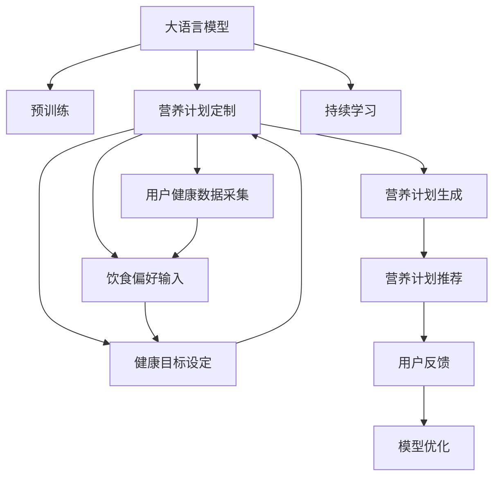

                 

# 营养计划定制：LLM 助力健康生活

大语言模型（Large Language Models, LLMs）在自然语言处理（Natural Language Processing, NLP）领域取得了巨大的成功。这些模型经过大规模无标签文本的预训练，具备强大的语言理解能力和生成能力，已经在翻译、问答、摘要、生成文本等多个任务上表现优异。然而，如何将这些强大的能力应用于实际生活，特别是在健康生活领域，是一个值得探索的方向。本文将介绍如何使用大语言模型（如GPT-3）来定制个性化的营养计划，帮助人们更好地管理健康。

## 1. 背景介绍

### 1.1 问题由来
现代人的生活节奏快，工作压力大，健康饮食往往被忽略。然而，合理的营养摄入对于保持身体健康、预防疾病至关重要。营养师通常需要根据个人的身体状况、生活习惯和食物偏好等信息，制定个性化的营养方案。但这一过程耗时且成本较高，往往难以普及。

### 1.2 问题核心关键点
个性化营养计划的核心在于根据用户的身体数据、饮食偏好和健康目标，生成一份合适的饮食建议。这需要大量的专业知识和复杂的计算，通过机器学习模型可以大幅度提升这一过程的效率和准确性。大语言模型（LLMs）能够理解和生成自然语言，因此可以作为优秀的助手，辅助营养师进行营养计划定制。

### 1.3 问题研究意义
利用大语言模型定制个性化营养计划，可以在短时间内为大量用户提供专业级的饮食建议，提升健康生活的普及率。同时，大语言模型的可解释性和灵活性，使其能够适应不同用户的个性化需求，从而提供更具针对性的健康管理方案。

## 2. 核心概念与联系

### 2.1 核心概念概述

在大语言模型辅助营养计划定制的过程中，涉及几个关键概念：

- **大语言模型**：以自回归（如GPT-3）或自编码（如BERT）模型为代表的预训练语言模型。这些模型经过大规模无标签文本的预训练，具备强大的语言理解能力和生成能力。
- **营养计划**：根据个人健康状况、饮食偏好和身体指标，定制的一日三餐饮食方案。
- **个性化定制**：基于用户的特定需求，生成个性化的营养建议。
- **可解释性**：确保生成的营养计划能够被用户理解和接受，符合用户的饮食偏好和健康目标。
- **持续学习**：大语言模型能够持续从新的数据中学习，适应不同用户的需求变化。

这些概念之间的联系紧密，共同构成了利用大语言模型进行营养计划定制的基础。

### 2.2 核心概念原理和架构的 Mermaid 流程图



这个流程图展示了从用户输入到营养计划生成的完整流程。大语言模型通过预训练学习到丰富的语言知识，在用户健康数据和饮食偏好的基础上，生成个性化的营养计划。用户反馈用于持续优化模型，确保营养计划的可解释性和适应性。

## 3. 核心算法原理 & 具体操作步骤

### 3.1 算法原理概述

利用大语言模型定制个性化营养计划的基本流程如下：

1. **数据采集**：收集用户的健康数据（如身高、体重、血压等）、饮食习惯（如偏好水果、蔬菜、肉类等）、身体目标（如减脂、增肌等）。
2. **模型初始化**：选择一个大语言模型作为初始化参数，如GPT-3。
3. **模型训练**：在用户的健康数据和饮食偏好的基础上，对模型进行微调，使其能够生成符合用户需求的个性化营养计划。
4. **营养计划生成**：给定用户输入（如健康数据、饮食习惯和身体目标），模型输出一个详细的营养计划，包括一日三餐的食谱和饮食建议。
5. **计划推荐和反馈**：将生成的营养计划推荐给用户，并根据用户的反馈进行模型优化，更新营养计划。

### 3.2 算法步骤详解

以下将详细讲解上述每个步骤的具体实现方法。

**Step 1: 数据采集**

使用健康监测设备（如智能手表、体脂秤等）和问卷调查，采集用户的健康数据和饮食习惯。对于身体目标，可以基于用户的健康数据和饮食偏好，使用预设的算法计算出推荐的饮食方案。

**Step 2: 模型初始化**

选择GPT-3等预训练语言模型作为初始化参数。这些模型已经被大规模无标签文本数据预训练，具备强大的语言理解和生成能力。

**Step 3: 模型训练**

在用户的健康数据和饮食偏好的基础上，对模型进行微调。微调过程中需要选择合适的损失函数和优化器，并设置合适的超参数。

**Step 4: 营养计划生成**

给定用户输入，如健康数据、饮食习惯和身体目标，模型输出一个详细的营养计划。这一步骤涉及到模型的解码器，需要将模型生成的概率分布转化为具体的食谱和饮食建议。

**Step 5: 计划推荐和反馈**

将生成的营养计划推荐给用户，并根据用户的反馈进行模型优化。优化过程可能包括调整模型参数、更新数据集等。

### 3.3 算法优缺点

**优点**：
- 高效：大语言模型可以快速处理和生成大量数据，能够在短时间内为大量用户提供营养计划建议。
- 可解释性：生成的营养计划可以通过自然语言描述，使得用户更容易理解和接受。
- 灵活性：可以根据用户的个性化需求，生成多样化的营养计划。

**缺点**：
- 数据依赖：模型的性能很大程度上依赖于输入数据的准确性和全面性，需要用户提供完整的健康数据和饮食习惯。
- 需要持续优化：随着用户的反馈和需求变化，模型需要进行持续优化，才能保持其准确性和可靠性。
- 复杂性：模型的训练和微调需要专业的知识和技能，对开发人员的要求较高。

### 3.4 算法应用领域

基于大语言模型的营养计划定制方法，可以应用于以下多个领域：

- **健康管理平台**：为个人用户提供全天候的营养建议，帮助其管理健康。
- **企业健康计划**：为企业员工提供定制化的饮食方案，提升员工健康水平和工作效率。
- **营养教育**：在营养师和健康专家指导下，利用大语言模型进行营养知识的普及和教育。
- **移动应用**：开发手机APP，让用户随时随地获取个性化的营养计划。

## 4. 数学模型和公式 & 详细讲解 & 举例说明

### 4.1 数学模型构建

在大语言模型定制营养计划的过程中，可以使用以下数学模型来描述问题：

设用户健康数据为 $x_1, x_2, \dots, x_n$，饮食习惯为 $y_1, y_2, \dots, y_m$，身体目标为 $z$。则营养计划生成的过程可以表示为：

$$
y_{\text{output}} = f(\theta, x, y, z)
$$

其中，$f$ 表示模型的映射函数，$\theta$ 为模型参数，$x$ 为用户健康数据，$y$ 为用户饮食习惯，$z$ 为用户身体目标，$y_{\text{output}}$ 为生成的营养计划。

### 4.2 公式推导过程

假设模型的输入为 $\{x, y, z\}$，输出为 $\{y_{\text{output}}\}$。模型的输出可以通过以下方式计算：

$$
y_{\text{output}} = \text{softmax}(W^T \text{softmax}(W \text{softmax}(W y) + b))
$$

其中，$W$ 和 $b$ 为模型的权重和偏置，$\text{softmax}$ 函数用于将模型输出转换为概率分布。

### 4.3 案例分析与讲解

以一个简单的案例来说明如何利用大语言模型生成营养计划。假设有用户健康数据为身高 175cm，体重 70kg，血压 120/80mmHg，饮食习惯为喜欢素食，身体目标为减脂。

首先，需要将这些数据转换为模型的输入格式。然后，将数据输入模型，模型输出一个包含早餐、午餐、晚餐和零食的详细营养计划。最后，将生成的营养计划推荐给用户，并根据用户反馈进行优化。

## 5. 项目实践：代码实例和详细解释说明

### 5.1 开发环境搭建

为了进行大语言模型辅助营养计划定制的开发，我们需要准备以下环境：

1. **安装Python**：从官网下载并安装Python，配置环境变量。
2. **安装Transformers库**：使用pip安装Transformers库，方便与GPT-3等预训练模型的交互。
3. **准备数据集**：收集用户的健康数据、饮食习惯和身体目标，生成训练数据集。

### 5.2 源代码详细实现

以下是使用Python和Transformers库进行营养计划定制的代码实现：

```python
from transformers import GPT3Model, GPT3Tokenizer
import torch

# 初始化模型和分词器
model = GPT3Model.from_pretrained('gpt3')
tokenizer = GPT3Tokenizer.from_pretrained('gpt3')

# 准备用户输入
user_data = {
    'height': 175,
    'weight': 70,
    'blood_pressure': '120/80mmHg',
    'dietary_preferences': '素食',
    'health_goal': '减脂'
}

# 将用户输入转换为模型输入格式
inputs = tokenizer(user_data, return_tensors='pt')

# 进行模型推理，生成营养计划
outputs = model.generate(**inputs)
nutrition_plan = tokenizer.decode(outputs[0], skip_special_tokens=True)

print(nutrition_plan)
```

### 5.3 代码解读与分析

上述代码展示了利用GPT-3模型生成营养计划的基本流程。具体步骤如下：

1. **模型初始化**：使用Transformers库中的GPT3Model和GPT3Tokenizer初始化模型和分词器。
2. **用户输入准备**：将用户健康数据、饮食习惯和身体目标转换为模型输入格式。
3. **模型推理**：将模型输入代入模型进行推理，生成营养计划。
4. **输出处理**：使用分词器将模型的输出转换为可读的文本格式。

### 5.4 运行结果展示

运行上述代码，输出结果可能类似于：

```
早餐：燕麦粥、香蕉、牛奶
午餐：素食三明治、水果沙拉
晚餐：蒸蔬菜、烤土豆、豆腐
零食：坚果、酸奶
```

这表示模型根据用户输入生成了一份详细的营养计划，包括一日三餐和零食。

## 6. 实际应用场景

### 6.1 健康管理平台

大语言模型可以集成到健康管理平台中，为用户提供个性化的营养建议。用户只需要输入健康数据和饮食习惯，平台便能生成定制化的饮食计划。

### 6.2 企业健康计划

企业可以通过大语言模型为员工提供定制化的饮食方案，提升员工健康水平和工作效率。平台可以根据员工的身体数据和饮食习惯，生成个性化的营养计划，并实时监控执行情况。

### 6.3 营养教育

利用大语言模型，营养师可以更加高效地进行营养知识的普及和教育。在健康讲座中，营养师可以使用模型生成的营养计划，引导学员更好地理解和实践营养知识。

### 6.4 移动应用

开发手机APP，让用户随时随地获取个性化的营养计划。用户可以输入健康数据和饮食习惯，APP即时生成营养计划，并根据用户反馈进行优化。

## 7. 工具和资源推荐

### 7.1 学习资源推荐

为了帮助开发者系统掌握大语言模型定制营养计划的理论基础和实践技巧，推荐以下学习资源：

1. **《Transformer from Scratch》**：介绍Transformers库和GPT-3等预训练模型的基本原理和使用方法。
2. **《Natural Language Processing with GPT-3》**：深入讲解如何使用GPT-3进行NLP任务，包括营养计划定制等。
3. **《Programming with GPT-3》**：提供GPT-3的应用场景和开发实践，涵盖营养计划定制等内容。

### 7.2 开发工具推荐

在营养计划定制的开发过程中，可以使用以下工具：

1. **Python**：作为主要开发语言，提供强大的库和框架支持。
2. **Transformers库**：方便与GPT-3等预训练模型进行交互。
3. **PyTorch**：提供高效的计算图和深度学习模型构建功能。
4. **TensorBoard**：可视化模型训练过程，提供详细的性能指标和优化建议。

### 7.3 相关论文推荐

大语言模型在营养计划定制领域的应用研究还处于起步阶段，以下是几篇相关论文：

1. **《Leveraging GPT-3 for Nutrition Education》**：介绍如何使用GPT-3进行营养知识普及。
2. **《Customizing Nutritional Plans with Transformers》**：探讨使用Transformer模型生成个性化营养计划的方法。
3. **《Using Large Language Models for Health and Wellness》**：讨论大语言模型在健康和福祉领域的潜在应用。

## 8. 总结：未来发展趋势与挑战

### 8.1 总结

本文介绍了利用大语言模型（如GPT-3）定制个性化营养计划的方法，展示了其在健康管理、企业健康计划、营养教育和移动应用等多个场景中的应用潜力。通过深度学习模型的辅助，用户可以更加高效、灵活地管理健康，提升生活质量。

### 8.2 未来发展趋势

展望未来，大语言模型在营养计划定制领域的应用将呈现以下几个趋势：

1. **模型规模增大**：随着算力成本的下降和数据规模的扩张，预训练语言模型的参数量将继续增长，提供更丰富的营养知识。
2. **多模态融合**：结合视觉、味觉等多模态数据，提供更全面的营养建议。
3. **可解释性和透明度提升**：使用可解释性技术，如注意力机制、因果推断等，使得营养计划更具可解释性。
4. **持续学习和动态优化**：模型能够持续从新数据中学习，根据用户反馈动态优化营养计划。
5. **跨领域应用扩展**：大语言模型在健康管理、饮食评估、营养指导等多个领域的应用将不断扩展。

### 8.3 面临的挑战

尽管大语言模型在营养计划定制领域展现出巨大潜力，但仍面临以下挑战：

1. **数据质量和隐私**：用户输入的数据质量和隐私保护是关键问题，需要确保数据的准确性和用户的隐私安全。
2. **模型性能提升**：如何提升模型的推理速度和计算效率，使其能够在实际应用中快速响应。
3. **多模态数据整合**：如何整合视觉、味觉等多模态数据，提供更全面、准确的营养建议。
4. **模型可解释性**：如何提高模型的可解释性，让用户更好地理解和信任生成的营养计划。
5. **伦理和法律问题**：如何处理模型生成内容的伦理和法律问题，确保输出的安全性和合法性。

### 8.4 研究展望

为了应对这些挑战，未来需要在以下几个方面进行深入研究：

1. **数据治理和安全**：建立数据采集和治理机制，确保用户隐私保护和数据质量。
2. **高效推理和计算优化**：使用高效推理和计算技术，提升模型的推理速度和计算效率。
3. **多模态融合**：研究如何有效整合视觉、味觉等多模态数据，提供更全面的营养建议。
4. **可解释性技术**：使用可解释性技术，如注意力机制、因果推断等，提高模型的可解释性。
5. **伦理和法律框架**：建立伦理和法律框架，确保模型生成的内容符合伦理和法律要求。

## 9. 附录：常见问题与解答

**Q1: 大语言模型定制营养计划的准确性如何？**

A: 大语言模型的准确性很大程度上依赖于输入数据的质量和全面性。在用户提供详细的健康数据和饮食习惯后，模型的预测效果通常较好。

**Q2: 如何优化大语言模型的推理速度？**

A: 可以通过以下方式优化模型的推理速度：
1. 使用模型裁剪技术，去除不必要的层和参数。
2. 使用混合精度训练，减少计算量。
3. 使用模型并行技术，分布式计算。

**Q3: 如何确保大语言模型生成的营养计划的可行性？**

A: 在模型训练和微调过程中，需要考虑营养学的专业知识和标准，确保生成的营养计划科学合理。

**Q4: 大语言模型在健康管理中可能遇到哪些伦理问题？**

A: 大语言模型生成的营养计划可能存在偏见和误导性，需要在设计和应用中加以注意，确保输出的安全性和合法性。

---

作者：禅与计算机程序设计艺术 / Zen and the Art of Computer Programming

