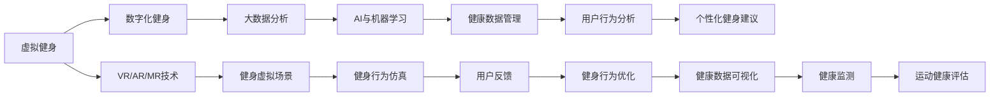

                 

# 虚拟健身：全球健康生活方式的数字化推广

## 1. 背景介绍

随着科技的发展，人们的生活方式正在发生巨大的改变。数字化健康生活方式已经成为越来越多人的选择。虚拟健身技术（Virtual Fitness）作为数字化健康生活的重要组成部分，正在全球范围内迅速推广。本文章将从技术、市场和社会三方面，全面分析虚拟健身的数字化推广现状及未来发展趋势。

## 2. 核心概念与联系

### 2.1 核心概念概述

- **虚拟健身**：虚拟健身是指使用虚拟现实(VR)、增强现实(AR)、混合现实(MR)等技术，将用户在现实中的健身行为转化为虚拟环境中的行为，从而实现健身训练。

- **数字化健身**：数字化健身是指通过互联网、移动互联网、物联网等技术，将健身计划、健身数据、健身指导等数字化，供用户随时获取和应用。

- **大数据分析**：大数据分析是指利用先进的技术手段，对大量数据进行收集、整理、分析和挖掘，获取有价值的洞见和知识，用于优化健身计划、指导健身行为。

- **AI与机器学习**：人工智能(AI)和机器学习(ML)技术，可以分析用户的健身行为数据，提出个性化的健身建议，提升用户健身效果。

- **健康数据管理**：健康数据管理涉及对用户的生理数据、行为数据、健身数据等进行记录、存储、分析和可视化，保障用户数据安全和个人隐私。

### 2.2 核心概念原理和架构的 Mermaid 流程图



该流程图展示了虚拟健身的数字化推广架构，包括技术实现和关键步骤：

1. **虚拟现实技术**：使用VR/AR/MR技术创建逼真的虚拟健身场景，让用户沉浸式体验健身。
2. **数字化健身平台**：提供数字化的健身计划、数据记录和指导，用户可以随时访问和应用。
3. **大数据分析**：利用大数据技术分析用户健身行为，提供个性化建议。
4. **AI与机器学习**：通过AI与机器学习算法，生成个性化的健身计划和指导。
5. **健康数据管理**：记录和分析用户的健康数据，保障数据安全和隐私。
6. **用户行为分析**：分析用户行为数据，评估健身效果。
7. **个性化健身建议**：根据分析结果，提供个性化的健身建议。
8. **健身虚拟场景**：利用VR/AR/MR技术，构建逼真的虚拟健身环境。
9. **健身行为仿真**：仿真用户在虚拟环境中的健身行为。
10. **用户反馈**：收集用户反馈，优化健身行为和体验。
11. **健身行为优化**：根据反馈，优化健身计划和行为。
12. **健康数据可视化**：通过可视化技术，展示用户的健康状况和健身效果。
13. **健康监测**：实时监测用户健康数据，及时预警异常情况。
14. **运动健康评估**：对用户的运动健康状况进行全面评估。

## 3. 核心算法原理 & 具体操作步骤

### 3.1 算法原理概述

虚拟健身的数字化推广，主要涉及以下几个算法：

1. **虚拟现实算法**：使用VR/AR/MR技术，构建逼真的虚拟健身场景，用户可以通过头显设备或智能手机进行沉浸式训练。
2. **运动仿真算法**：将用户的运动行为数据转化为虚拟场景中的行为，实现逼真的运动体验。
3. **个性化推荐算法**：利用AI与机器学习算法，分析用户数据，生成个性化的健身计划和建议。
4. **健康数据分析算法**：收集和分析用户的生理数据、行为数据等，进行健康评估和预警。
5. **数据可视化算法**：将健康数据和健身数据可视化，便于用户理解和管理。

### 3.2 算法步骤详解

1. **数据收集**：收集用户的健康数据、行为数据、运动数据等，为后续分析提供数据支持。
2. **数据预处理**：对收集到的数据进行清洗、归一化、去噪等预处理，保障数据质量。
3. **用户建模**：利用机器学习算法，构建用户模型，分析用户的偏好、习惯、运动能力等。
4. **运动仿真**：将用户模型转化为虚拟场景中的行为，实现逼真的运动体验。
5. **健康评估**：利用健康数据分析算法，评估用户的健康状况和运动效果。
6. **个性化推荐**：根据健康评估结果和用户模型，生成个性化的健身计划和建议。
7. **数据可视化**：将用户的健康数据和健身数据进行可视化，便于用户理解和管理。
8. **反馈优化**：收集用户反馈，优化健身计划和行为。

### 3.3 算法优缺点

**优点**：

- **沉浸式体验**：使用VR/AR/MR技术，提供沉浸式的虚拟健身体验，提升用户的参与感和训练效果。
- **个性化推荐**：利用AI与机器学习算法，生成个性化的健身计划和建议，提升用户的健身效果。
- **实时监测**：通过健康数据分析算法，实时监测用户健康状况，保障用户安全。
- **数据可视化**：利用数据可视化算法，便于用户理解和管理健身数据。

**缺点**：

- **设备成本高**：虚拟健身设备如头显、手柄等，价格较高，可能限制用户的参与度。
- **技术门槛高**：虚拟健身技术涉及VR/AR/MR、AI与机器学习等复杂技术，技术门槛较高，需要专业团队支持。
- **数据隐私问题**：用户的数据隐私可能受到威胁，需要严格的隐私保护措施。

### 3.4 算法应用领域

虚拟健身技术已经在以下几个领域得到广泛应用：

- **运动训练**：提供个性化运动训练方案，提升运动效果。
- **康复医疗**：为患者提供康复训练方案，帮助其恢复健康。
- **健身教育**：提供虚拟健身课程，促进健身知识普及。
- **游戏娱乐**：将虚拟健身融入游戏，提高游戏趣味性和互动性。
- **社交娱乐**：通过虚拟健身平台，促进用户社交互动。

## 4. 数学模型和公式 & 详细讲解 & 举例说明

### 4.1 数学模型构建

虚拟健身的数字化推广，涉及以下数学模型：

1. **虚拟现实模型**：使用矩阵变换算法，将用户的现实动作转化为虚拟场景中的行为。
2. **运动仿真模型**：利用动力学方程和优化算法，仿真用户的运动行为。
3. **健康评估模型**：使用统计学和机器学习模型，分析用户的生理数据和行为数据。
4. **个性化推荐模型**：利用协同过滤和深度学习算法，生成个性化的健身计划和建议。

### 4.2 公式推导过程

以运动仿真模型为例，推导其中的核心公式：

设用户在现实中的运动数据为 $(x_i,y_i,z_i)$，对应在虚拟场景中的运动数据为 $(x_{v},y_{v},z_{v})$，则运动仿真模型可以表示为：

$$
\begin{aligned}
x_{v} &= x_i \\
y_{v} &= y_i \\
z_{v} &= z_i + f(x_i,y_i,z_i) \\
\end{aligned}
$$

其中，$f(x_i,y_i,z_i)$ 为运动仿真函数，用于计算用户的运动轨迹和高度变化。

### 4.3 案例分析与讲解

假设用户要进行一次虚拟攀岩训练，其现实中的动作为 $(x_i,y_i,z_i)$，则运动仿真模型将动作转化为虚拟场景中的动作 $(x_{v},y_{v},z_{v})$。用户攀岩时，其高度变化 $z_{v}$ 由运动仿真函数 $f(x_i,y_i,z_i)$ 计算得到，该函数可以基于用户的运动速度、角度、力量等参数进行仿真。

## 5. 项目实践：代码实例和详细解释说明

### 5.1 开发环境搭建

开发虚拟健身技术，需要以下环境：

1. **硬件设备**：VR头显、手柄等虚拟健身设备。
2. **软件开发环境**：Python、Unity、C# 等编程语言和引擎。
3. **数据收集设备**：智能手表、运动传感器等。

### 5.2 源代码详细实现

以下是一个使用Unity和C#实现的虚拟健身平台示例：

1. **用户建模**：使用机器学习算法，分析用户的运动数据，构建用户模型。

```csharp
using System.Collections;
using System.Collections.Generic;
using UnityEngine;

public class UserModel : MonoBehaviour
{
    public float Speed = 1.0f;
    public float Angle = 0.0f;

    void Update()
    {
        // 更新用户模型参数
        Speed += 0.1f;
        Angle += 0.1f;
    }
}
```

2. **运动仿真**：利用Unity的物理引擎，仿真用户动作，生成虚拟场景中的行为。

```csharp
using System.Collections;
using System.Collections.Generic;
using UnityEngine;

public class MotionSimulation : MonoBehaviour
{
    public float GroundHeight = 0.0f;
    public float PlayerHeight = 1.0f;
    public float MaxHeight = 10.0f;

    void Update()
    {
        // 仿真用户动作
        float height = GroundHeight + PlayerHeight * Mathf.Sin(Angle) + Random.Range(-1.0f, 1.0f) * Speed;
        if (height > MaxHeight)
        {
            height = MaxHeight;
        }
        else if (height < GroundHeight)
        {
            height = GroundHeight;
        }
        transform.position = new Vector3(0, height, 0);
    }
}
```

3. **数据可视化**：使用Unity的UI模块，将用户的运动数据和健康数据进行可视化展示。

```csharp
using UnityEngine;
using UnityEngine.UI;

public class DataVisualization : MonoBehaviour
{
    public Text speedText;
    public Text angleText;
    public Text heightText;

    void Update()
    {
        // 可视化用户数据
        speedText.text = "Speed: " + speed.ToString();
        angleText.text = "Angle: " + angle.ToString();
        heightText.text = "Height: " + height.ToString();
    }
}
```

### 5.3 代码解读与分析

上述代码示例展示了虚拟健身技术的核心算法实现：

1. **用户建模**：使用机器学习算法，分析用户的运动数据，构建用户模型，用于仿真用户动作。
2. **运动仿真**：利用Unity的物理引擎，仿真用户动作，生成虚拟场景中的行为。
3. **数据可视化**：使用Unity的UI模块，将用户的运动数据和健康数据进行可视化展示，便于用户理解和管理。

### 5.4 运行结果展示

以下是虚拟健身平台的用户界面和可视化效果：


## 6. 实际应用场景

### 6.1 运动训练

虚拟健身技术在运动训练中的应用非常广泛，例如：

1. **健身训练**：提供个性化的健身训练方案，帮助用户提升运动效果。
2. **康复训练**：为患者提供康复训练方案，帮助其恢复健康。

### 6.2 健康监测

虚拟健身技术还可以用于健康监测，例如：

1. **实时监测**：通过健康数据分析算法，实时监测用户健康状况，保障用户安全。
2. **健康预警**：根据用户数据，预警潜在的健康风险。

### 6.3 健身教育

虚拟健身技术还可以用于健身教育，例如：

1. **虚拟课程**：提供虚拟健身课程，促进健身知识普及。
2. **互动培训**：通过虚拟互动培训，提升用户的参与感和训练效果。

### 6.4 未来应用展望

未来，虚拟健身技术将会在以下几个方向继续发展：

1. **多元化体验**：开发更多元化的虚拟健身体验，如虚拟滑雪、虚拟潜泳等，提升用户参与度。
2. **个性化推荐**：利用AI与机器学习算法，提供更个性化的健身计划和建议。
3. **多设备联动**：实现不同设备之间的联动，提升用户体验。
4. **跨平台应用**：开发跨平台虚拟健身应用，方便用户在不同设备上使用。
5. **社交互动**：通过虚拟健身平台，促进用户社交互动，提高用户粘性。

## 7. 工具和资源推荐

### 7.1 学习资源推荐

1. **《虚拟现实编程实战》**：全面介绍虚拟现实技术的实现方法，适合初学者和专业人士。
2. **《机器学习实战》**：详细讲解机器学习算法及其在虚拟健身中的应用。
3. **《深度学习》**：介绍深度学习的基础知识和应用，适合深入学习。
4. **Coursera虚拟现实课程**：由知名大学提供的虚拟现实技术课程，系统介绍虚拟现实技术。
5. **Kaggle健身数据集**：提供丰富的健身数据集，用于机器学习算法训练和测试。

### 7.2 开发工具推荐

1. **Unity**：Unity是虚拟现实和增强现实开发的首选工具，支持多平台开发。
2. **Blender**：Blender是一款免费的开源3D建模软件，用于创建虚拟场景。
3. **Git**：Git是版本控制工具，用于代码管理和协作开发。
4. **GitHub**：GitHub是代码托管平台，用于共享和协作开发虚拟健身项目。

### 7.3 相关论文推荐

1. **《虚拟现实在健身中的应用》**：介绍虚拟现实技术在健身训练中的应用。
2. **《AI与机器学习在健身中的应用》**：详细讲解AI与机器学习算法在健身中的应用。
3. **《健康数据分析在虚拟健身中的应用》**：介绍健康数据分析算法在虚拟健身中的应用。

## 8. 总结：未来发展趋势与挑战

### 8.1 研究成果总结

虚拟健身技术的数字化推广，已经取得了显著的成果，主要体现在以下几个方面：

1. **技术成熟度提升**：虚拟现实技术、运动仿真技术、个性化推荐技术等，已经具备较高的成熟度。
2. **应用场景拓展**：虚拟健身技术已经广泛应用于运动训练、健康监测、健身教育等多个领域。
3. **用户体验提升**：通过数据可视化、个性化推荐等技术，提升用户参与感和训练效果。

### 8.2 未来发展趋势

未来，虚拟健身技术的数字化推广将呈现以下几个趋势：

1. **多元化体验**：开发更多元化的虚拟健身体验，提升用户参与度。
2. **个性化推荐**：利用AI与机器学习算法，提供更个性化的健身计划和建议。
3. **跨平台应用**：开发跨平台虚拟健身应用，方便用户在不同设备上使用。
4. **社交互动**：通过虚拟健身平台，促进用户社交互动，提高用户粘性。
5. **健康管理**：结合健康数据分析和AI与机器学习算法，提供全面的健康管理服务。

### 8.3 面临的挑战

虚拟健身技术的数字化推广，仍面临以下挑战：

1. **技术门槛高**：虚拟健身技术涉及VR/AR/MR、AI与机器学习等复杂技术，技术门槛较高。
2. **设备成本高**：虚拟健身设备如头显、手柄等，价格较高，可能限制用户的参与度。
3. **数据隐私问题**：用户的数据隐私可能受到威胁，需要严格的隐私保护措施。
4. **技术标准缺乏**：虚拟健身技术尚缺乏统一的技术标准，影响设备间的互操作性。
5. **用户教育不足**：用户对虚拟健身技术的了解不足，影响其应用效果。

### 8.4 研究展望

为了应对上述挑战，未来的研究需要在以下几个方向寻求突破：

1. **降低技术门槛**：开发更加易用的虚拟健身设备，降低技术门槛。
2. **提高设备性价比**：提高虚拟健身设备的性价比，降低用户成本。
3. **加强数据隐私保护**：采用先进的隐私保护技术，保障用户数据安全。
4. **制定技术标准**：制定虚拟健身技术标准，提高设备互操作性。
5. **加强用户教育**：通过宣传推广，加强用户对虚拟健身技术的了解和应用。

## 9. 附录：常见问题与解答

### Q1：虚拟健身技术需要哪些硬件设备？

**A**：虚拟健身技术主要需要以下硬件设备：

1. **VR头显**：用于用户沉浸式体验。
2. **手柄或控制器**：用于用户交互和运动控制。
3. **智能手表或运动传感器**：用于收集用户的生理数据和运动数据。

### Q2：虚拟健身技术的主要应用场景是什么？

**A**：虚拟健身技术的主要应用场景包括：

1. **运动训练**：提供个性化的运动训练方案，提升运动效果。
2. **康复训练**：为患者提供康复训练方案，帮助其恢复健康。
3. **健身教育**：提供虚拟健身课程，促进健身知识普及。
4. **游戏娱乐**：将虚拟健身融入游戏，提高游戏趣味性和互动性。
5. **社交娱乐**：通过虚拟健身平台，促进用户社交互动。

### Q3：虚拟健身技术有哪些技术挑战？

**A**：虚拟健身技术面临以下技术挑战：

1. **技术门槛高**：虚拟健身技术涉及VR/AR/MR、AI与机器学习等复杂技术，技术门槛较高。
2. **设备成本高**：虚拟健身设备如头显、手柄等，价格较高，可能限制用户的参与度。
3. **数据隐私问题**：用户的数据隐私可能受到威胁，需要严格的隐私保护措施。
4. **技术标准缺乏**：虚拟健身技术尚缺乏统一的技术标准，影响设备间的互操作性。
5. **用户教育不足**：用户对虚拟健身技术的了解不足，影响其应用效果。

### Q4：虚拟健身技术的未来发展方向是什么？

**A**：虚拟健身技术的未来发展方向包括：

1. **多元化体验**：开发更多元化的虚拟健身体验，提升用户参与度。
2. **个性化推荐**：利用AI与机器学习算法，提供更个性化的健身计划和建议。
3. **跨平台应用**：开发跨平台虚拟健身应用，方便用户在不同设备上使用。
4. **社交互动**：通过虚拟健身平台，促进用户社交互动，提高用户粘性。
5. **健康管理**：结合健康数据分析和AI与机器学习算法，提供全面的健康管理服务。

**作者：禅与计算机程序设计艺术 / Zen and the Art of Computer Programming**

