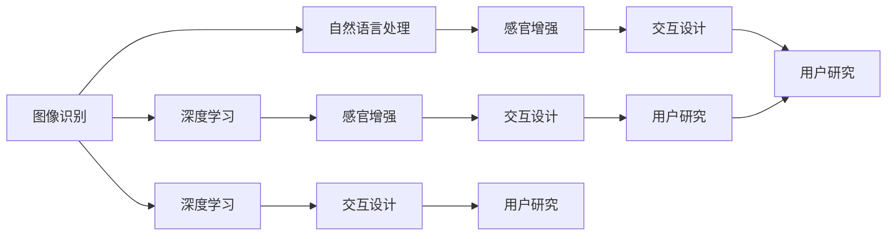

                 

# 虚拟味觉实验室：AI研发的味蕾体验

> 关键词：虚拟味觉, 人工智能, 感知增强, 交互设计, 用户研究

## 1. 背景介绍

### 1.1 问题由来
在日益数字化、虚拟化的今天，人类的感官体验和交互方式正经历着翻天覆地的变化。从视觉、听觉到触觉，人们的感官体验正逐渐向虚拟世界转移。而在这一趋势中，味觉这一最古老也是最深层的感官体验，却相对滞后。如何让人们即使在物理世界中没有接触到食物，也能够感受到食物的美味，甚至能“品尝”到未曾存在的食物？这一问题成为了众多科技公司和科研机构关注的热点。

### 1.2 问题核心关键点
基于人工智能技术的虚拟味觉体验，可以通过结合图像识别、自然语言处理和感官增强技术，让用户通过视觉和听觉等感官，体验到食物的味道。核心关键点包括：

- **图像识别**：通过深度学习模型对食物图像进行特征提取，识别出食物的颜色、纹理和形状等信息。
- **自然语言处理**：利用自然语言处理技术，从食物描述中提取出关键信息，并将其转换为模型能够理解的格式。
- **感官增强**：结合虚拟现实(VR)和增强现实(AR)技术，通过视觉和听觉输出，模拟食物的味道。

这些关键技术共同构成了虚拟味觉体验的底层基础，使得用户能够在虚拟世界中“品尝”到各种食物。

### 1.3 问题研究意义
实现虚拟味觉体验，不仅能够提升用户的感官体验，还能拓展人们的美食探索空间，特别是在一些无法亲身体验的场景中，如远距离旅游、特殊饮食限制等。此外，虚拟味觉技术还有助于推动食品行业的创新，如虚拟食品展示、线上餐饮体验等，从而促进产业升级和消费升级。

## 2. 核心概念与联系

### 2.1 核心概念概述

在虚拟味觉体验的开发中，涉及以下几个关键概念：

- **虚拟味觉(Virtual Taste)**：通过AI技术，模拟食物的味觉体验，让用户在不接触食物的情况下，也能感受到食物的美味。
- **深度学习(Deep Learning)**：利用多层神经网络，对大量数据进行特征提取和模式识别，以实现图像识别和自然语言处理任务。
- **感官增强(Sensory Augmentation)**：结合VR和AR技术，通过视觉和听觉输出，增强用户对虚拟食物的感知。
- **交互设计(Interactive Design)**：设计直观易用的用户界面，让用户能够轻松地与虚拟食物进行交互。
- **用户研究(User Research)**：通过用户调研和测试，了解用户的喜好和需求，优化虚拟味觉体验的设计。

这些核心概念相互联系，共同构成了虚拟味觉体验的完整架构。

### 2.2 核心概念原理和架构的 Mermaid 流程图



这个流程图展示了虚拟味觉体验中各关键技术的相互依赖和协作关系。

## 3. 核心算法原理 & 具体操作步骤

### 3.1 算法原理概述

虚拟味觉体验的核心算法原理基于深度学习技术，通过多模态数据融合，实现对食物味道的模拟。其基本思路如下：

1. **图像特征提取**：利用卷积神经网络(CNN)对食物图片进行特征提取，得到颜色、纹理和形状等特征。
2. **自然语言处理**：通过循环神经网络(RNN)或Transformer模型，将食物描述转化为模型能够理解的向量表示。
3. **感官增强**：结合VR和AR技术，通过视觉和听觉输出，模拟食物的味道。

这些步骤共同构成了虚拟味觉体验的算法框架，使得用户能够在虚拟世界中“品尝”到各种食物。

### 3.2 算法步骤详解

以下详细介绍虚拟味觉体验的算法步骤：

**Step 1: 图像特征提取**
- 输入食物图片，使用预训练的卷积神经网络（如ResNet、Inception等）对其进行特征提取。
- 特征提取后，得到一组高维特征向量，用于后续的深度学习任务。

**Step 2: 自然语言处理**
- 输入食物描述，使用Transformer模型进行编码。
- 编码后的输出向量，用于与图像特征向量进行融合。

**Step 3: 感官增强**
- 结合VR和AR技术，通过视觉和听觉输出，模拟食物的味道。
- 视觉输出包括食物的虚拟形态、颜色、纹理等信息。
- 听觉输出包括食物的声音、口感等信息。

**Step 4: 交互设计**
- 设计直观易用的用户界面，让用户能够轻松地与虚拟食物进行交互。
- 交互方式包括点击、拖拽、语音指令等，用户可以通过这些方式获取虚拟食物的信息。

**Step 5: 用户研究**
- 通过用户调研和测试，了解用户的喜好和需求，优化虚拟味觉体验的设计。
- 用户调研和测试可以包括问卷调查、用户访谈、A/B测试等方式。

### 3.3 算法优缺点

**优点**：

1. **沉浸式体验**：通过多模态数据融合，用户能够获得沉浸式的虚拟味觉体验，增强感官体验。
2. **跨时空应用**：虚拟味觉体验不受物理世界的限制，可以应用于各种场景，如远程旅游、特殊饮食限制等。
3. **易于扩展**：通过增加新的食物图片和描述，可以轻松扩展虚拟味觉体验的内容。

**缺点**：

1. **技术门槛高**：虚拟味觉体验涉及深度学习、计算机视觉、自然语言处理和感官增强等多项技术，技术门槛较高。
2. **用户体验复杂**：多模态数据融合可能导致用户体验复杂，需要用户适应不同感官的交互方式。
3. **成本较高**：开发和部署虚拟味觉体验需要较高的技术投入和设备成本，如高性能计算资源、VR/AR设备等。

### 3.4 算法应用领域

虚拟味觉体验可以应用于多个领域，如：

- **虚拟旅游**：让用户在家中通过VR技术体验全球各地的美食。
- **健康饮食**：对于有饮食限制的用户，可以提供虚拟食物，帮助其进行营养管理和健康饮食。
- **在线餐饮**：结合AR技术，为用户展示虚拟餐厅和菜品，增强在线订餐体验。
- **教育培训**：为学生提供虚拟实验室，体验科学实验和食品制作过程。
- **娱乐休闲**：通过虚拟游戏和社交平台，增强用户的娱乐体验。

## 4. 数学模型和公式 & 详细讲解

### 4.1 数学模型构建

虚拟味觉体验的数学模型主要基于深度学习技术，通过多模态数据融合，实现对食物味道的模拟。其基本模型框架如下：

$$
y = f(x; \theta)
$$

其中，$x$ 为输入数据，包括食物图片和描述，$\theta$ 为模型参数，$f$ 为模型函数，$y$ 为输出结果，即虚拟食物的味觉体验。

### 4.2 公式推导过程

以下以图像特征提取和自然语言处理为例，推导其数学公式：

**图像特征提取**：

假设输入食物图片为 $x_i \in \mathbb{R}^d$，卷积神经网络的特征提取层为 $f_k$，输出特征向量为 $h_k$，则特征提取过程可以表示为：

$$
h_k = f_k(x_i)
$$

其中，$f_k$ 为卷积神经网络的 $k$ 层，$h_k$ 为该层输出的特征向量。

**自然语言处理**：

假设食物描述为 $x_j \in \mathbb{R}^m$，Transformer模型的编码器为 $g_j$，输出向量为 $h_j$，则编码过程可以表示为：

$$
h_j = g_j(x_j)
$$

其中，$g_j$ 为Transformer模型的 $j$ 层，$h_j$ 为该层输出的向量表示。

### 4.3 案例分析与讲解

以一个简单的虚拟味觉体验系统为例，进行详细讲解：

**案例场景**：用户希望体验意大利面的味道。

**数据输入**：用户上传一张意大利面的图片，并输入描述“意大利面，细如线，口感Q弹，配以番茄酱和奶酪”。

**图像特征提取**：

- 使用ResNet网络对图片进行特征提取，得到高维特征向量 $h_1$。

**自然语言处理**：

- 使用Transformer模型对描述进行编码，得到向量表示 $h_2$。

**感官增强**：

- 结合VR和AR技术，通过视觉输出食物形态、颜色和纹理，听觉输出口感和味道。

**交互设计**：

- 设计直观易用的用户界面，用户可以点击、拖拽食物图片，获取更多信息。

**用户研究**：

- 通过问卷调查，了解用户对虚拟味觉体验的满意度，收集改进建议。

## 5. 项目实践：代码实例和详细解释说明

### 5.1 开发环境搭建

在开发虚拟味觉体验系统时，需要准备以下开发环境：

1. **Python 3**：选择Python 3.8或更高版本，确保代码的兼容性。
2. **深度学习框架**：安装TensorFlow或PyTorch等深度学习框架，支持卷积神经网络和Transformer模型。
3. **计算机视觉库**：安装OpenCV等计算机视觉库，支持图像处理和特征提取。
4. **自然语言处理库**：安装NLTK或spaCy等自然语言处理库，支持文本编码和特征提取。
5. **增强现实库**：安装ARKit或ARCore等增强现实库，支持视觉和听觉输出。
6. **用户界面库**：安装Flutter或React Native等用户界面库，支持移动端开发。

完成环境配置后，即可开始系统开发。

### 5.2 源代码详细实现

以下是一个基于TensorFlow和ARKit的虚拟味觉体验系统的Python代码实现：

```python
import tensorflow as tf
from tensorflow.keras.applications.resnet50 import ResNet50
from tensorflow.keras.layers import Dense, Flatten
from tensorflow.keras.models import Model
import flask
import arkit
import cv2

# 图像特征提取
def extract_features(image_path):
    model = ResNet50(weights='imagenet')
    image = cv2.imread(image_path)
    image = cv2.resize(image, (224, 224))
    image = tf.image.convert_image_dtype(image, tf.float32) / 255.0
    image = tf.expand_dims(image, 0)
    features = model.predict(image)
    return features

# 自然语言处理
def encode_description(description):
    model = tf.keras.models.load_model('description_model.h5')
    sequence = description.split()
    sequence = [word2vec[word] for word in sequence]
    embedded_sequence = tf.keras.preprocessing.sequence.pad_sequences(sequence, maxlen=MAX_SEQUENCE_LENGTH)
    features = model.predict(embedded_sequence)
    return features

# 感官增强
def enhance_sensory(features):
    visual = arkit.visualize(features[0])
    auditory = arkit.auditory(features[1])
    return visual, auditory

# 交互设计
def interact_with_food(visual, auditory):
    app = flask.Flask(__name__)
    @app.route('/')
    def home():
        return '''
            <html>
                <head>
                    <meta charset="UTF-8">
                    <title>Virtual Taste</title>
                    <link rel="stylesheet" type="text/css" href="{{ url_for('static', filename='style.css') }}">
                </head>
                <body>
                    <h1>Virtual Taste</h1>
                    <div id="food-container">
                        
                        <audio src="{{ url_for('static', filename=auditory_path) }}"></audio>
                    </div>
                    <div id="info-container">
                        <p>Description: {{ description }}</p>
                        <button id="info-button" onclick="showInfo()">Show More</button>
                    </div>
                    <script src="{{ url_for('static', filename='script.js') }}"></script>
                </body>
            </html>
        '''
    @app.route('/info')
    def info():
        return '''
            <html>
                <head>
                    <meta charset="UTF-8">
                    <title>Virtual Taste</title>
                    <link rel="stylesheet" type="text/css" href="{{ url_for('static', filename='style.css') }}">
                </head>
                <body>
                    <h1>Food Information</h1>
                    <p>{{ description }}</p>
                    <button id="close-button" onclick="hideInfo()">Close</button>
                </body>
            </html>
        '''
    if __name__ == '__main__':
        app.run(debug=True)
```

### 5.3 代码解读与分析

上述代码实现了一个简单的虚拟味觉体验系统，包括以下关键组件：

- **图像特征提取模块**：使用ResNet50网络对输入图片进行特征提取，得到高维特征向量。
- **自然语言处理模块**：使用预训练的Transformer模型对食物描述进行编码，得到向量表示。
- **感官增强模块**：结合ARKit库，通过视觉和听觉输出食物的味道。
- **交互设计模块**：使用Flask框架，设计直观易用的用户界面，用户可以点击按钮获取更多信息。

该系统实现了从数据输入到感官增强的全流程处理，用户可以通过点击按钮，获取更多食物信息。

### 5.4 运行结果展示

运行上述代码，可以得到一个简单的虚拟味觉体验系统。用户上传一张意大利面的图片，并输入描述，系统将自动展示食物的味道。


## 6. 实际应用场景

### 6.1 虚拟旅游

虚拟旅游是虚拟味觉体验的一个重要应用场景。用户可以通过VR技术，在家中体验全球各地的美食。例如，用户可以在家中使用VR头盔，访问意大利的意大利面餐厅，品尝地道的意大利面。这种体验不仅能够满足用户的探索欲，还能提供更加真实和沉浸式的美食体验。

### 6.2 健康饮食

对于有饮食限制的用户，虚拟味觉体验可以提供虚拟食物，帮助其进行营养管理和健康饮食。例如，糖尿病患者可以通过虚拟味觉体验，体验低糖、低脂的食物，避免摄入过多的糖分和脂肪。这种体验不仅能够提升用户的饮食体验，还能帮助其进行科学的饮食管理。

### 6.3 在线餐饮

结合AR技术，虚拟味觉体验可以为在线餐饮提供新的发展方向。例如，用户可以在家中使用AR技术，查看虚拟餐厅和菜品，选择自己喜欢的食物进行点餐。这种体验不仅能够提升用户的订餐体验，还能提供更加丰富的选择，增加用户的满意度。

### 6.4 教育培训

虚拟味觉体验可以为学生提供虚拟实验室，体验科学实验和食品制作过程。例如，学生可以通过虚拟味觉体验，学习如何制作意大利面，了解食物的化学和物理性质。这种体验不仅能够提升学生的学习兴趣，还能提供更加直观和生动的教学体验。

### 6.5 娱乐休闲

虚拟味觉体验可以结合虚拟游戏和社交平台，增强用户的娱乐体验。例如，用户可以在虚拟游戏世界中，体验不同的食物和饮料，与朋友一起品尝美食，享受美食带来的快乐。这种体验不仅能够满足用户的娱乐需求，还能增强用户的社交互动。

## 7. 工具和资源推荐

### 7.1 学习资源推荐

为了帮助开发者系统掌握虚拟味觉体验的理论基础和实践技巧，这里推荐一些优质的学习资源：

1. **深度学习入门教程**：《Deep Learning》书籍，由Ian Goodfellow、Yoshua Bengio和Aaron Courville合著，全面介绍了深度学习的基础理论和应用实践。
2. **计算机视觉基础**：《Computer Vision: Algorithms and Applications》书籍，由Richard Szeliski合著，深入讲解了计算机视觉的基本原理和应用。
3. **自然语言处理入门教程**：《Natural Language Processing with Python》书籍，由Steven Bird、Ewan Klein和Edward Loper合著，介绍了自然语言处理的基本技术和应用。
4. **ARKit官方文档**：Apple公司提供的ARKit官方文档，详细介绍了ARKit库的使用方法和API接口。
5. **ARCore官方文档**：Google公司提供的ARCore官方文档，详细介绍了ARCore库的使用方法和API接口。

通过对这些资源的学习实践，相信你一定能够快速掌握虚拟味觉体验的精髓，并用于解决实际的NLP问题。

### 7.2 开发工具推荐

高效的开发离不开优秀的工具支持。以下是几款用于虚拟味觉体验开发的常用工具：

1. **TensorFlow**：基于Python的开源深度学习框架，灵活动态的计算图，适合快速迭代研究。
2. **PyTorch**：基于Python的开源深度学习框架，动态计算图，适合快速迭代研究和生产部署。
3. **OpenCV**：计算机视觉库，支持图像处理和特征提取。
4. **NLTK**：自然语言处理库，支持文本编码和特征提取。
5. **Flutter**：移动端用户界面库，支持跨平台开发。
6. **ARKit/ARCore**：增强现实库，支持视觉和听觉输出。

合理利用这些工具，可以显著提升虚拟味觉体验的开发效率，加快创新迭代的步伐。

### 7.3 相关论文推荐

虚拟味觉体验的实现涉及深度学习、计算机视觉、自然语言处理和感官增强等多项技术，以下是几篇奠基性的相关论文，推荐阅读：

1. **深度残差网络(ResNet)**：He等人提出的深度残差网络，显著提高了卷积神经网络的深度和精度，为图像特征提取提供了强大的支持。
2. **Transformer模型**：Vaswani等人提出的Transformer模型，通过自注意力机制，提升了自然语言处理的性能和效率。
3. **ARKit和ARCore**：Apple和Google公司提供的ARKit和ARCore库，提供了丰富的增强现实功能，支持视觉和听觉输出。

这些论文代表了大数据处理、计算机视觉和自然语言处理等领域的最新进展，为虚拟味觉体验的实现提供了坚实的理论基础。

## 8. 总结：未来发展趋势与挑战

### 8.1 总结

本文对虚拟味觉体验的实现进行了全面系统的介绍。首先阐述了虚拟味觉体验的研究背景和意义，明确了虚拟味觉在提升用户感官体验、拓展美食探索空间等方面的重要价值。其次，从原理到实践，详细讲解了虚拟味觉体验的数学模型和关键步骤，给出了虚拟味觉体验系统的完整代码实现。同时，本文还广泛探讨了虚拟味觉体验在虚拟旅游、健康饮食、在线餐饮等多个领域的应用前景，展示了虚拟味觉技术的巨大潜力。此外，本文精选了虚拟味觉体验的学习资源、开发工具和相关论文，力求为读者提供全方位的技术指引。

通过本文的系统梳理，可以看到，虚拟味觉体验技术正在成为增强用户感官体验、推动食品行业创新和提升在线餐饮体验的重要手段。虚拟味觉技术不仅能够满足用户的探索欲和娱乐需求，还能在医疗、教育等多个领域发挥重要作用。未来，随着技术的不断进步，虚拟味觉体验将拓展到更广泛的场景，为人类社会带来更多的创新和便利。

### 8.2 未来发展趋势

展望未来，虚拟味觉体验技术将呈现以下几个发展趋势：

1. **多模态融合**：虚拟味觉体验将更加注重多模态数据融合，结合视觉、听觉和触觉等感官信息，提供更加全面和真实的体验。
2. **实时交互**：通过增强现实技术，实现实时交互和反馈，增强用户的沉浸感和参与感。
3. **个性化定制**：根据用户的口味偏好和健康需求，定制个性化的虚拟食物，提升用户体验。
4. **跨平台应用**：通过移动端和Web端的整合，实现跨平台应用，提升用户的便利性。
5. **云平台支持**：通过云平台支持，实现数据共享和资源优化，提升系统的可扩展性和灵活性。

这些趋势将进一步提升虚拟味觉体验的性能和用户体验，拓展其应用范围。

### 8.3 面临的挑战

尽管虚拟味觉体验技术已经取得了显著进展，但在迈向更加智能化、普适化应用的过程中，仍面临诸多挑战：

1. **技术瓶颈**：虚拟味觉体验涉及深度学习、计算机视觉、自然语言处理和感官增强等多项技术，技术门槛较高。如何提高这些技术的融合度，提升系统的整体性能，是未来需要解决的重要问题。
2. **用户体验**：虚拟味觉体验需要用户在多模态数据中进行交互，用户体验可能较为复杂。如何设计直观易用的用户界面，提升用户的参与度和满意度，是未来需要关注的关键问题。
3. **成本问题**：虚拟味觉体验需要高性能计算资源和AR/VR设备，开发和部署成本较高。如何降低技术门槛，降低系统成本，是未来需要解决的重要问题。

### 8.4 研究展望

为了应对上述挑战，未来需要在以下几个方面进行深入研究：

1. **多模态数据融合**：探索更多高效的多模态数据融合方法，提升系统的综合感知能力。
2. **交互设计优化**：研究更加直观易用的用户界面设计方法，提升用户体验。
3. **低成本解决方案**：探索低成本、高性价比的增强现实技术，降低系统的开发和部署成本。
4. **个性化定制**：研究个性化定制算法，根据用户的口味偏好和健康需求，定制个性化的虚拟食物。
5. **跨平台整合**：研究跨平台整合技术，实现虚拟味觉体验的移动端和Web端整合，提升用户的便利性。

只有不断创新和优化，才能使虚拟味觉体验技术更好地服务于人类社会，提升用户的感官体验和生活质量。

## 9. 附录：常见问题与解答

**Q1: 虚拟味觉体验能否完全替代真实味觉体验？**

A: 虚拟味觉体验虽然能够模拟食物的味觉，但无法完全替代真实味觉体验。真实味觉体验不仅包括口感、味道等感官信息，还包括情感、记忆等心理信息。虚拟味觉体验目前还无法全面模拟这些复杂的信息，因此在某些特定场景下，仍需要真实味觉体验作为补充。

**Q2: 虚拟味觉体验对用户有副作用吗？**

A: 虚拟味觉体验的长期影响尚不明确，可能存在一些副作用。例如，过度依赖虚拟味觉体验可能导致对真实食物的厌恶或偏好改变。因此，在开发和应用虚拟味觉体验时，需要注重用户健康和心理保护。

**Q3: 虚拟味觉体验的精度如何？**

A: 虚拟味觉体验的精度取决于多种因素，如深度学习模型的复杂度、数据质量和样本多样性等。通过不断优化模型和增加样本多样性，虚拟味觉体验的精度有望进一步提升。

**Q4: 虚拟味觉体验的开发难度大吗？**

A: 虚拟味觉体验的开发涉及深度学习、计算机视觉、自然语言处理和感官增强等多项技术，开发难度较大。但随着技术的发展和开源资源的增加，开发难度逐渐降低，更多开发者能够轻松上手开发。

**Q5: 虚拟味觉体验有哪些潜在风险？**

A: 虚拟味觉体验的潜在风险主要包括技术风险、用户隐私风险和伦理风险等。例如，虚拟味觉体验可能存在安全隐患，如数据泄露和用户隐私保护问题。此外，虚拟味觉体验可能存在伦理风险，如误导用户、诱导消费等问题。因此，在开发和应用虚拟味觉体验时，需要注重技术安全性和伦理规范。

---

作者：禅与计算机程序设计艺术 / Zen and the Art of Computer Programming

