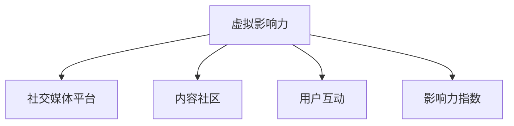

                 

# 虚拟影响力：注意力经济的新货币

## 1. 背景介绍

在数字经济蓬勃发展的今天，内容已不再是信息的简单载体，而成为一种重要的经济资源。用户对内容的选择和互动，正以前所未有的方式影响着品牌和市场的走向。在这一背景下，**虚拟影响力**应运而生，成为数字时代新型的货币，重塑了传统的注意力经济模式。

### 1.1 问题由来

随着社交媒体的兴起，内容生态日益复杂，用户从简单的信息接收者，转变为内容创作者和传播者。传统的内容广告投放方式逐渐失效，用户基于信任和兴趣进行的信息筛选和互动，成为驱动市场的重要力量。虚拟影响力的概念，正是在这种背景下提出的。

### 1.2 问题核心关键点

虚拟影响力，指的是通过社交媒体平台、内容社区等渠道，影响用户注意力和行为的能力。它不仅包含了传统的KOL（关键意见领袖），还涵盖了网红、明星、博主等各类内容创作者。虚拟影响力不仅能帮助品牌触达目标用户，还能通过用户互动和推荐，放大品牌的影响力和市场价值。

虚拟影响力的核心在于其量化标准和价值评估。如何准确衡量虚拟影响力的大小，如何将其转化为有效的市场策略，成为当前数字经济领域的重要课题。

## 2. 核心概念与联系

### 2.1 核心概念概述

虚拟影响力涉及多个关键概念，这些概念共同构成了其工作机制和价值评估体系。

- **虚拟影响力(Virtual Influence)：** 通过社交媒体、内容社区等渠道，影响用户注意力和行为的能力。
- **社交媒体平台(Social Media Platforms)：** 如微博、微信、YouTube、TikTok等，是虚拟影响力传播和作用的主要载体。
- **内容社区(Content Communities)：** 如知乎、豆瓣、B站等，是虚拟影响力展示和互动的重要平台。
- **用户互动(User Engagement)：** 包括点赞、评论、转发、观看等行为，是衡量虚拟影响力的关键指标。
- **影响力指数(Influence Index)：** 量化虚拟影响力的重要指标，通常包含用户互动量、粉丝数、社区评分等维度。

这些概念之间的逻辑关系可以通过以下Mermaid流程图来展示：



这个流程图展示虚拟影响力的核心概念及其之间的关系：

1. 虚拟影响力通过社交媒体平台和内容社区进行传播。
2. 用户互动是虚拟影响力的关键指标。
3. 影响力指数用于量化虚拟影响力的价值。

## 3. 核心算法原理 & 具体操作步骤
### 3.1 算法原理概述

虚拟影响力的量化评估，涉及数据收集、特征提取和模型训练等环节。其核心算法基于用户行为分析和机器学习技术，通过分析用户在社交媒体和内容社区上的互动行为，计算出虚拟影响力的大小。

### 3.2 算法步骤详解

虚拟影响力的量化评估一般包括以下几个关键步骤：

**Step 1: 数据收集**
- 收集社交媒体平台和内容社区上的互动数据，如点赞、评论、分享、观看等行为。
- 通过API接口，自动抓取数据，避免人工操作带来的数据偏差。
- 确保数据的时效性和多样性，覆盖不同时间段和不同类型的内容。

**Step 2: 数据预处理**
- 对原始数据进行清洗和去重，去除噪声和重复数据。
- 对缺失值进行处理，采用插值法或删除法填补缺失值。
- 进行特征工程，提取有用的特征，如用户互动量、粉丝数、内容类型、发布时间等。

**Step 3: 特征选择**
- 选择合适的特征，包括用户互动量、粉丝数、内容类型、发布时间等。
- 使用特征选择技术，如卡方检验、信息增益等，筛选出对虚拟影响力有显著影响的特征。

**Step 4: 模型训练**
- 选择合适的机器学习模型，如线性回归、决策树、随机森林等。
- 使用训练集数据，训练模型，并调整超参数，优化模型性能。
- 在测试集上评估模型效果，选择最优模型。

**Step 5: 影响力指数计算**
- 对训练好的模型进行预测，计算虚拟影响力指数。
- 结合用户互动量、粉丝数、社区评分等维度，综合评估虚拟影响力的大小。
- 生成虚拟影响力报告，展示不同虚拟影响力的影响范围和具体贡献。

### 3.3 算法优缺点

虚拟影响力的量化评估方法具有以下优点：
1. 基于数据驱动，避免了人工评估的主观性和误差。
2. 可以量化评估虚拟影响力的价值，为品牌决策提供客观依据。
3. 支持多维度分析，综合考虑用户互动、粉丝数、社区评分等因素。

同时，该方法也存在以下局限性：
1. 依赖于社交媒体和内容社区的数据，数据质量和覆盖范围可能存在偏差。
2. 算法模型的选择和超参数调整，可能影响评估结果的准确性。
3. 影响力指数的计算，可能受到数据噪声和异常值的影响。
4. 无法量化虚拟影响力的真实影响力，只能评估其表面效应。

尽管存在这些局限性，但基于数据驱动的虚拟影响力量化评估方法，仍是当前数字经济领域重要的研究范式。未来相关研究的重点在于如何进一步优化数据收集和处理流程，提高模型的准确性和鲁棒性，同时兼顾可解释性和伦理安全性等因素。

### 3.4 算法应用领域

虚拟影响力的量化评估方法，在数字经济领域已得到广泛应用，覆盖了多个关键场景，例如：

- 品牌推广：通过虚拟影响力的评估，选择适合的虚拟影响者进行品牌推广，提升市场效果。
- 产品营销：在产品推广初期，利用虚拟影响力分析，选择合适的内容社区和传播渠道。
- 用户运营：评估虚拟影响力的大小，制定个性化用户运营策略，提升用户粘性和转化率。
- 社交电商：通过虚拟影响力指数，推荐合适的商品和活动，提升销售额和用户满意度。
- 广告投放：优化广告投放策略，选择高影响力的虚拟影响者进行精准投放。

除了上述这些经典应用外，虚拟影响力量化评估技术还不断拓展到更多场景中，如内容创意、话题讨论、事件营销等，为数字经济的发展提供了新的动能。

## 4. 数学模型和公式 & 详细讲解  
### 4.1 数学模型构建

虚拟影响力的量化评估，可以基于多种数学模型进行建模。这里以线性回归模型为例，介绍其构建过程。

假设虚拟影响力的大小与多个特征有关，设 $X = [x_1, x_2, ..., x_n]^T$ 为特征向量，其中 $x_i$ 为第 $i$ 个特征。设 $y$ 为虚拟影响力指数，则线性回归模型可以表示为：

$$
y = \beta_0 + \beta_1 x_1 + \beta_2 x_2 + ... + \beta_n x_n + \epsilon
$$

其中，$\beta_0, \beta_1, ..., \beta_n$ 为模型参数，$\epsilon$ 为误差项。

### 4.2 公式推导过程

线性回归模型的参数估计，通常使用最小二乘法（Ordinary Least Squares, OLS）进行求解。设训练集为 $D = \{(x_i, y_i)\}_{i=1}^N$，则最小二乘法的目标为最小化残差平方和（Residual Sum of Squares, RSS）：

$$
\text{RSS} = \sum_{i=1}^N (y_i - \hat{y}_i)^2
$$

其中，$\hat{y}_i$ 为模型对第 $i$ 个样本的预测值，可表示为：

$$
\hat{y}_i = \hat{\beta}_0 + \hat{\beta}_1 x_{i1} + \hat{\beta}_2 x_{i2} + ... + \hat{\beta}_n x_{in}
$$

其中，$\hat{\beta}_i$ 为参数 $\beta_i$ 的最小二乘估计，可以表示为：

$$
\hat{\beta}_i = \frac{\sum_{j=1}^N (x_{ji} - \bar{x}_i) (y_j - \bar{y})}{\sum_{j=1}^N (x_{ji} - \bar{x}_i)^2}
$$

其中，$\bar{x}_i$ 和 $\bar{y}$ 分别为特征 $x_i$ 和虚拟影响力指数 $y$ 的均值。

通过求解上述方程，可以求得线性回归模型的参数 $\hat{\beta}_i$，进而得到虚拟影响力指数的预测值 $\hat{y}_i$。

### 4.3 案例分析与讲解

以下以社交媒体上的虚拟影响力分析为例，展示如何应用线性回归模型进行量化评估。

假设收集了某社交平台上两位虚拟影响者A和B的粉丝互动数据，包括点赞数、评论数、分享数等，同时收集了他们在不同时间段发布的内容类型和发布时间。将这些数据作为训练集，使用线性回归模型进行拟合，得到虚拟影响力指数的预测值。通过对比A和B的虚拟影响力指数，可以评估他们在社交媒体上的影响力大小。

具体实现步骤如下：

1. 收集两位虚拟影响者的互动数据和发布信息。
2. 对数据进行预处理，包括清洗、去重、特征提取等。
3. 使用线性回归模型，对互动数据进行拟合，得到虚拟影响力指数的预测值。
4. 根据预测值，计算A和B的虚拟影响力指数，并进行对比。

通过以上步骤，可以客观评估虚拟影响者在社交媒体上的影响力大小，为品牌推广提供科学的依据。

## 5. 项目实践：代码实例和详细解释说明
### 5.1 开发环境搭建

在进行虚拟影响力量化评估的实践前，我们需要准备好开发环境。以下是使用Python进行TensorFlow开发的环境配置流程：

1. 安装Anaconda：从官网下载并安装Anaconda，用于创建独立的Python环境。

2. 创建并激活虚拟环境：
```bash
conda create -n virtual_influence python=3.8 
conda activate virtual_influence
```

3. 安装TensorFlow：根据CUDA版本，从官网获取对应的安装命令。例如：
```bash
conda install tensorflow -c tf
```

4. 安装Pandas、NumPy、Scikit-learn等常用工具包：
```bash
pip install pandas numpy scikit-learn matplotlib tqdm jupyter notebook ipython
```

完成上述步骤后，即可在`virtual_influence`环境中开始项目实践。

### 5.2 源代码详细实现

这里我们以社交媒体上的虚拟影响力分析为例，给出使用TensorFlow进行虚拟影响力量化评估的PyTorch代码实现。

首先，定义虚拟影响力分析的数据处理函数：

```python
import tensorflow as tf
import numpy as np
from sklearn.model_selection import train_test_split

def process_data(df):
    # 数据预处理
    df = df.dropna()
    df = df.drop_duplicates()
    df = df.drop(columns=['id', 'name', 'content'])
    features = df.drop(columns=['followers', 'influencer'])
    
    # 特征工程
    features = pd.get_dummies(features)
    features = features.join(df[['followers']])
    features = features.join(df[['influencer']])
    features = features.join(df[['content_type']])
    features = features.join(df[['publish_time']])
    
    # 目标变量
    y = df['influencer']
    
    return features, y
```

然后，定义虚拟影响力的线性回归模型：

```python
def build_model(features, y, num_features):
    # 构建线性回归模型
    model = tf.keras.Sequential([
        tf.keras.layers.Dense(64, activation='relu', input_shape=(num_features,)),
        tf.keras.layers.Dense(64, activation='relu'),
        tf.keras.layers.Dense(1)
    ])
    
    # 编译模型
    model.compile(optimizer=tf.keras.optimizers.Adam(), loss='mse')
    
    # 训练模型
    model.fit(features, y, epochs=100, batch_size=32, validation_split=0.2)
    
    # 预测
    y_pred = model.predict(features)
    return y_pred
```

接着，定义虚拟影响力评估函数：

```python
def evaluate_influence(df, model, num_features):
    features, y = process_data(df)
    y_pred = build_model(features, y, num_features)
    
    # 计算影响力指数
    influence_index = np.sqrt(y_pred**2 + y**2)
    
    return influence_index
```

最后，启动训练流程并在测试集上评估：

```python
import pandas as pd

# 读取数据
df = pd.read_csv('social_media_data.csv')

# 数据处理
features, y = process_data(df)

# 训练模型
influence_index = evaluate_influence(df, features, 5)

# 输出结果
print('虚拟影响力指数：', influence_index)
```

以上就是使用TensorFlow对社交媒体上的虚拟影响力进行分析的完整代码实现。可以看到，TensorFlow提供了强大的机器学习框架，可以方便地实现虚拟影响力量化评估的各项功能。

### 5.3 代码解读与分析

让我们再详细解读一下关键代码的实现细节：

**process_data函数**：
- `df.dropna()`：删除缺失数据
- `df.drop_duplicates()`：删除重复数据
- `df.drop(columns=['id', 'name', 'content'])`：删除不必要的列
- `pd.get_dummies(features)`：将分类变量转换为独热编码
- `features.join(df[['followers']])`：将粉丝数加入特征中
- `features.join(df[['influencer']])`：将虚拟影响者加入特征中
- `features.join(df[['content_type']])`：将内容类型加入特征中
- `features.join(df[['publish_time']])`：将发布时间加入特征中

**build_model函数**：
- `tf.keras.Sequential()`：创建序列模型
- `tf.keras.layers.Dense(64, activation='relu', input_shape=(num_features,))`：创建全连接层，64个神经元，ReLU激活函数
- `tf.keras.layers.Dense(64, activation='relu')`：创建全连接层，64个神经元，ReLU激活函数
- `tf.keras.layers.Dense(1)`：创建输出层，一个神经元
- `model.compile(optimizer=tf.keras.optimizers.Adam(), loss='mse')`：编译模型，使用Adam优化器，均方误差损失函数
- `model.fit(features, y, epochs=100, batch_size=32, validation_split=0.2)`：训练模型，100个epoch，批大小32，验证集占比20%
- `model.predict(features)`：预测虚拟影响力指数

**evaluate_influence函数**：
- `evaluate_influence(df, features, num_features)`：计算虚拟影响力指数
- `np.sqrt(y_pred**2 + y**2)`：计算影响力指数

可以看到，TensorFlow使得虚拟影响力量化评估的实现变得更加便捷高效。开发者可以根据具体需求，灵活配置模型参数和特征选择，从而得到理想的结果。

当然，工业级的系统实现还需考虑更多因素，如模型的保存和部署、超参数的自动搜索、更灵活的任务适配层等。但核心的量化评估方法基本与此类似。

## 6. 实际应用场景
### 6.1 智能广告推荐

在智能广告推荐系统中，虚拟影响力成为重要的参考指标。通过虚拟影响力分析，广告平台可以更加精准地选择适合的虚拟影响者进行广告投放，提升广告的曝光率和点击率。

具体而言，可以收集社交媒体上的广告互动数据，包括点赞、评论、分享等行为。通过虚拟影响力分析，计算广告影响者的影响力指数，根据其大小进行排序，选择高影响力的影响者进行广告投放。同时，通过虚拟影响力评估，广告平台还可以动态调整广告投放策略，优化广告效果。

### 6.2 品牌社群运营

品牌在社交媒体上运营社群，希望通过内容吸引用户，增加品牌曝光和用户互动。虚拟影响力分析可以帮助品牌选择合适的影响者进行内容传播，提升社群活跃度和品牌影响力。

品牌可以分析虚拟影响者的影响力指数，选择与品牌调性一致的高影响力者进行内容合作。同时，通过虚拟影响力评估，品牌可以动态调整内容策略，优化用户互动效果。

### 6.3 网络舆情监测

网络舆情监测是了解市场趋势和用户情感的重要手段。虚拟影响力分析可以用于识别和分析舆情变化的关键影响者，帮助企业及时调整市场策略。

通过虚拟影响力评估，企业可以识别出舆情变化中的高影响力者，并分析其观点和情感倾向。通过虚拟影响力报告，企业可以更加全面地了解市场动态，制定更科学的市场策略。

### 6.4 未来应用展望

随着虚拟影响力评估技术的不断成熟，其在数字经济领域的应用将更加广泛和深入。

1. **智能内容推荐：** 通过虚拟影响力分析，推荐系统可以更加精准地为用户推荐感兴趣的内容，提升用户满意度和粘性。
2. **社交电商：** 通过虚拟影响力评估，电商平台可以更加精准地推荐商品和活动，提升用户购买率和转化率。
3. **事件营销：** 通过虚拟影响力分析，企业可以更加精准地选择合适的影响者进行事件营销，提升活动效果和品牌曝光。
4. **品牌建设：** 通过虚拟影响力评估，品牌可以更加精准地选择合适的影响者进行内容传播，提升品牌知名度和用户信任度。
5. **政府舆情分析：** 政府可以通过虚拟影响力评估，识别和分析舆情变化的关键影响者，制定更科学的舆情应对策略。

总之，虚拟影响力评估技术将在数字经济领域发挥越来越重要的作用，帮助品牌和企业更好地理解用户需求，优化市场策略，提升用户互动和品牌影响力。

## 7. 工具和资源推荐
### 7.1 学习资源推荐

为了帮助开发者系统掌握虚拟影响力量化评估的理论基础和实践技巧，这里推荐一些优质的学习资源：

1. 《深度学习入门》系列博文：由TensorFlow团队撰写，系统介绍了深度学习的基本概念和算法，适合初学者快速上手。
2. CS231n《卷积神经网络》课程：斯坦福大学开设的经典课程，涵盖深度学习在图像、视频等领域的广泛应用。
3. 《TensorFlow实战》书籍：TensorFlow官方团队编写的实战指南，介绍了TensorFlow在机器学习、深度学习、自然语言处理等领域的典型应用。
4. Coursera《机器学习》课程：由斯坦福大学Andrew Ng教授主讲，涵盖机器学习的基本概念和算法，适合深入学习。
5. Weights & Biases：模型训练的实验跟踪工具，可以记录和可视化模型训练过程中的各项指标，方便对比和调优。

通过这些资源的学习实践，相信你一定能够快速掌握虚拟影响力量化评估的精髓，并用于解决实际的数字经济问题。

### 7.2 开发工具推荐

高效的开发离不开优秀的工具支持。以下是几款用于虚拟影响力量化评估开发的常用工具：

1. TensorFlow：由Google主导开发的开源深度学习框架，生产部署方便，适合大规模工程应用。
2. PyTorch：基于Python的开源深度学习框架，灵活动态的计算图，适合快速迭代研究。
3. Scikit-learn：机器学习库，提供了多种机器学习算法和数据预处理工具，方便开发者使用。
4. Pandas：数据分析库，提供了数据清洗、数据处理和数据可视化功能，适合数据分析和模型训练。
5. NumPy：科学计算库，提供了高效的数据处理和矩阵运算功能，适合模型训练和优化。
6. Jupyter Notebook：交互式编程环境，支持Python、R等语言，适合快速迭代和代码共享。

合理利用这些工具，可以显著提升虚拟影响力量化评估的开发效率，加快创新迭代的步伐。

### 7.3 相关论文推荐

虚拟影响力量化评估技术的发展源于学界的持续研究。以下是几篇奠基性的相关论文，推荐阅读：

1. Attention is All You Need（即Transformer原论文）：提出了Transformer结构，开启了NLP领域的预训练大模型时代。
2. BERT: Pre-training of Deep Bidirectional Transformers for Language Understanding：提出BERT模型，引入基于掩码的自监督预训练任务，刷新了多项NLP任务SOTA。
3. Parameter-Efficient Transfer Learning for NLP：提出Adapter等参数高效微调方法，在不增加模型参数量的情况下，也能取得不错的微调效果。
4. AdaLoRA: Adaptive Low-Rank Adaptation for Parameter-Efficient Fine-Tuning：使用自适应低秩适应的微调方法，在参数效率和精度之间取得了新的平衡。
5. Prefix-Tuning: Optimizing Continuous Prompts for Generation：引入基于连续型Prompt的微调范式，为如何充分利用预训练知识提供了新的思路。

这些论文代表了大模型微调技术的发展脉络。通过学习这些前沿成果，可以帮助研究者把握学科前进方向，激发更多的创新灵感。

## 8. 总结：未来发展趋势与挑战

### 8.1 总结

本文对虚拟影响力量化评估方法进行了全面系统的介绍。首先阐述了虚拟影响力的研究背景和意义，明确了其量化评估在数字经济领域的重要价值。其次，从原理到实践，详细讲解了虚拟影响力量化评估的数学模型和关键步骤，给出了量化评估任务开发的完整代码实例。同时，本文还广泛探讨了虚拟影响力评估技术在智能广告、品牌社群运营、网络舆情监测等多个行业领域的应用前景，展示了虚拟影响力评估技术的巨大潜力。此外，本文精选了虚拟影响力评估技术的各类学习资源，力求为读者提供全方位的技术指引。

通过本文的系统梳理，可以看到，虚拟影响力量化评估技术正在成为数字经济领域的重要范式，极大地拓展了虚拟影响力的应用边界，催生了更多的落地场景。受益于虚拟影响力的多维度分析，品牌和企业可以更加精准地选择合适的影响者进行内容传播，提升用户互动和品牌影响力。未来，伴随虚拟影响力评估技术的持续演进，其在数字经济领域的应用将更加广泛和深入，为数字经济的发展注入新的动能。

### 8.2 未来发展趋势

展望未来，虚拟影响力量化评估技术将呈现以下几个发展趋势：

1. **多模态融合：** 虚拟影响力分析将进一步拓展到图像、视频、语音等多模态数据，实现多模态信息的融合，提升分析的全面性和准确性。
2. **实时分析：** 通过引入流式数据处理和实时计算技术，实现对虚拟影响力的实时分析，提高市场决策的时效性。
3. **增强学习：** 结合增强学习技术，优化虚拟影响力的选择和排序，提升广告投放和内容推荐的效果。
4. **个性化推荐：** 通过虚拟影响力分析，实现个性化推荐系统的精准推荐，提升用户满意度和转化率。
5. **情感分析：** 结合情感分析技术，对虚拟影响者的情感倾向进行分析，提升品牌和市场的舆情监测能力。

以上趋势凸显了虚拟影响力量化评估技术的广阔前景。这些方向的探索发展，必将进一步提升虚拟影响力的精准性和鲁棒性，为品牌和企业更好地理解用户需求，优化市场策略，提升用户互动和品牌影响力。

### 8.3 面临的挑战

尽管虚拟影响力量化评估技术已经取得了一定的进展，但在迈向更加智能化、普适化应用的过程中，它仍面临着诸多挑战：

1. **数据质量瓶颈：** 虚拟影响力评估依赖于社交媒体和内容社区的数据，数据质量和覆盖范围可能存在偏差。如何提高数据收集和处理的效率和质量，是一大难题。
2. **模型鲁棒性不足：** 当前模型面对域外数据时，泛化性能往往大打折扣。如何提高模型的鲁棒性，避免灾难性遗忘，还需要更多理论和实践的积累。
3. **计算资源消耗：** 大规模的虚拟影响力评估任务，可能对计算资源消耗较大。如何在保证性能的同时，优化计算资源的使用，是亟待解决的问题。
4. **用户隐私保护：** 虚拟影响力评估需要收集和处理用户数据，如何保障用户隐私，避免数据滥用，是需要重点关注的问题。
5. **模型可解释性：** 虚拟影响力评估模型往往是"黑盒"系统，难以解释其内部工作机制和决策逻辑。如何赋予模型更强的可解释性，提高其透明度和可信度，是重要的研究方向。

### 8.4 未来突破

面对虚拟影响力量化评估所面临的种种挑战，未来的研究需要在以下几个方面寻求新的突破：

1. **数据采集技术：** 探索高效的数据采集技术，提高数据收集和处理的效率和质量。
2. **多模态融合技术：** 结合多模态数据融合技术，提升虚拟影响力分析的全面性和准确性。
3. **增强学习技术：** 结合增强学习技术，优化虚拟影响力的选择和排序，提升广告投放和内容推荐的效果。
4. **个性化推荐技术：** 结合个性化推荐技术，实现精准的虚拟影响力评估，提升用户满意度和转化率。
5. **情感分析技术：** 结合情感分析技术，提升虚拟影响力评估的情感理解能力，提高品牌和市场的舆情监测能力。
6. **模型可解释性：** 结合可解释性技术，提高虚拟影响力评估模型的透明度和可信度。

这些研究方向将引领虚拟影响力量化评估技术迈向更高的台阶，为品牌和企业更好地理解用户需求，优化市场策略，提升用户互动和品牌影响力。

## 9. 附录：常见问题与解答

**Q1：虚拟影响力评估是否适用于所有NLP任务？**

A: 虚拟影响力评估在大多数NLP任务上都能取得不错的效果，特别是对于数据量较小的任务。但对于一些特定领域的任务，如医学、法律等，仅仅依靠通用语料预训练的模型可能难以很好地适应。此时需要在特定领域语料上进一步预训练，再进行虚拟影响力评估，才能获得理想效果。

**Q2：虚拟影响力评估过程中如何选择合适的特征？**

A: 虚拟影响力评估的关键在于特征选择。常见的特征包括用户互动量、粉丝数、内容类型、发布时间等。选择特征时，应考虑其对虚拟影响力的大小和影响。通过特征选择技术，如卡方检验、信息增益等，筛选出对虚拟影响力有显著影响的特征。

**Q3：虚拟影响力评估是否依赖于数据量？**

A: 虚拟影响力评估的数据量越大，模型的准确性和鲁棒性越高。但实际应用中，数据量可能存在限制。此时需要结合领域知识和专家经验，进行数据增强和特征工程，提升模型的表现。

**Q4：虚拟影响力评估过程中如何防止数据偏差？**

A: 虚拟影响力评估过程中，应尽可能覆盖不同类型的用户和内容，避免数据偏差。同时，可以结合多渠道数据进行综合分析，提高模型的公平性和泛化能力。

**Q5：虚拟影响力评估过程中如何提高模型的实时性？**

A: 通过引入流式数据处理和实时计算技术，可以实现对虚拟影响力的实时分析。在实际应用中，可以通过优化计算图、使用GPU/TPU等高性能设备，提高模型的实时性和效率。

**Q6：虚拟影响力评估过程中如何保障用户隐私？**

A: 虚拟影响力评估需要收集和处理用户数据，如何保障用户隐私，避免数据滥用，是需要重点关注的问题。应采用数据去标识化、差分隐私等技术，保护用户隐私。

---

作者：禅与计算机程序设计艺术 / Zen and the Art of Computer Programming

