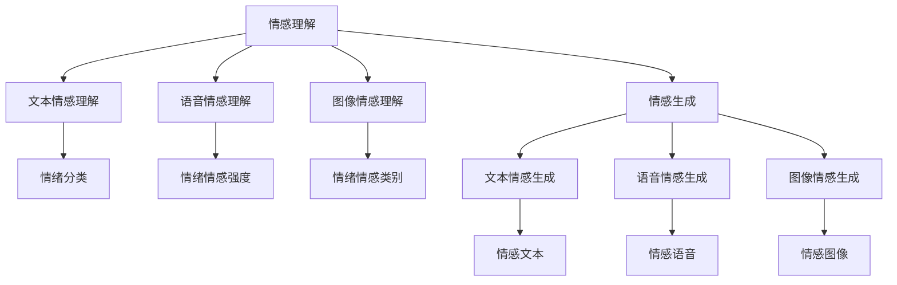

                 

# 虚拟情感智能：AI驱动的情感理解与表达

> 关键词：虚拟情感智能,情感理解,情感生成,人工智能,自然语言处理(NLP),深度学习,Transformer,自监督学习,迁移学习

## 1. 背景介绍

### 1.1 问题由来
情感智能(EAI)是近年来人工智能研究的一个热点领域，致力于使机器具备识别、理解、生成和表达情感的能力。情感智能在人工智能的发展历程中，经历了从简单的情绪分类、情感识别，到复杂的情感生成与交互演变。情感智能的实现不仅能提升人机交互体验，促进人类与机器的深度互动，还在教育、健康、娱乐、社交等诸多领域展现了广泛的应用前景。

尤其是随着自然语言处理(NLP)技术的飞速发展，基于自然语言理解的情感智能模型，能够更加精确地捕捉文本中蕴含的情感信息，推动情感智能应用的不断深入。本文将聚焦于基于虚拟情感智能模型的情感理解与生成技术，从算法原理、实际操作、应用领域等多个维度进行系统阐述，以期为开发者提供全面的技术指引。

### 1.2 问题核心关键点
虚拟情感智能的核心在于通过深度学习技术，训练机器对文本、语音、图像等多种模态数据的情感理解与生成能力。具体包括：

- **情感理解**：利用自然语言处理技术，自动分析文本、语音中的情感信息，区分正面、负面、中性等情绪类型。
- **情感生成**：基于理解到的情感信息，生成符合特定情绪色彩的文本或语音。
- **情感交互**：在对话系统中，模拟人类情感交互过程，提升人机互动的自然性和可理解性。

虚拟情感智能的研究目标在于构建一个具备自然、流畅、可控情感的智能系统，使其能够更好地理解和回应用户情感，构建和谐的人机互动环境。

### 1.3 问题研究意义
情感智能在现代社会中的广泛应用，不仅能够改善用户体验，提升人机互动的质量，还能在多领域提供有价值的服务，如情感健康咨询、情感教育指导、智能客服等。随着情感智能的不断发展，虚拟情感智能正逐渐成为推动AI技术在社会各行各业应用的重要驱动力。

## 2. 核心概念与联系

### 2.1 核心概念概述

为更好地理解虚拟情感智能的核心技术和应用，本节将介绍几个关键概念：

- **虚拟情感智能**：指基于人工智能的情感理解与生成技术，使机器具备模拟人类情感的能力，实现人机情感交互。
- **情感理解**：指机器对文本、语音等情感表达形式的理解和分类，通常基于自然语言处理技术实现。
- **情感生成**：指机器基于理解到的情感信息，自动生成符合特定情绪色彩的文本或语音，通常通过生成对抗网络、Transformer等模型实现。
- **情感交互**：指机器在对话系统中模拟人类情感交互过程，提升人机互动的自然性和可理解性，通常依赖于对话系统和情感生成技术。
- **自然语言处理(NLP)**：指使机器能够理解、分析并生成自然语言的技术，是情感智能的核心工具之一。
- **深度学习**：指利用深度神经网络模型进行数据处理和模式识别的技术，为情感智能提供了强大的计算支持。
- **Transformer模型**：一种基于自注意力机制的神经网络结构，广泛应用于文本分类、序列预测、情感智能等任务中。
- **自监督学习**：指使用无标签数据进行模型训练，利用数据自身的信息提升模型性能。
- **迁移学习**：指利用已有模型的知识，通过微调等方式在新任务上进行快速适应和性能提升。

这些概念共同构成了虚拟情感智能的体系框架，使其能够实现对文本、语音等多种模态情感信息的理解与生成。

### 2.2 核心概念原理和架构的 Mermaid 流程图



此图展示了虚拟情感智能的基本架构，情感理解模块从文本、语音、图像等多种模态数据中提取情感信息，生成模块基于理解到的情感信息生成符合特定情绪色彩的文本、语音、图像。

## 3. 核心算法原理 & 具体操作步骤
### 3.1 算法原理概述

虚拟情感智能的核心算法原理基于深度学习和自然语言处理技术，主要包括以下几个关键步骤：

1. **情感理解模型训练**：使用大规模情感标注数据集，训练深度学习模型，使其能够自动识别文本、语音等情感表达形式的情感信息。
2. **情感生成模型训练**：基于理解到的情感信息，训练生成模型，自动生成符合特定情绪色彩的文本、语音、图像等。
3. **情感交互模块设计**：在对话系统中，利用情感理解与生成模型，模拟人类情感交互过程，提升人机互动的自然性和可理解性。

以基于Transformer的情感理解模型为例，算法原理如下：

**Step 1: 数据准备**
- 收集和预处理情感标注数据集，如IMDb影评、Yelp餐厅评价、Twitter情感文本等。
- 使用BERT、GPT等预训练模型进行微调，得到情感理解模型。

**Step 2: 模型设计**
- 选择适当的Transformer模型架构，如BERT、GPT、LSTM等。
- 定义情感分类目标函数，如交叉熵损失函数。
- 设计模型层级，包括编码器-解码器结构，以及自注意力机制等。

**Step 3: 模型训练**
- 在标注数据集上进行有监督学习训练，最小化损失函数。
- 使用AdamW等优化算法，调整模型参数。
- 设定正则化技术，如L2正则、Dropout等，防止过拟合。

### 3.2 算法步骤详解

基于情感理解的虚拟情感智能算法步骤如下：

**Step 1: 数据准备**
- 收集情感标注数据集，如IMDb电影评论、Yelp餐厅评价、Twitter情感文本等。
- 使用BERT、GPT等预训练模型进行微调，得到情感理解模型。

**Step 2: 模型设计**
- 选择适当的Transformer模型架构，如BERT、GPT、LSTM等。
- 定义情感分类目标函数，如交叉熵损失函数。
- 设计模型层级，包括编码器-解码器结构，以及自注意力机制等。

**Step 3: 模型训练**
- 在标注数据集上进行有监督学习训练，最小化损失函数。
- 使用AdamW等优化算法，调整模型参数。
- 设定正则化技术，如L2正则、Dropout等，防止过拟合。

### 3.3 算法优缺点

虚拟情感智能的算法具有以下优点：
1. 高效准确：基于深度学习和大规模标注数据训练的模型，能够准确理解文本、语音等情感信息。
2. 通用性强：能够应用于文本、语音、图像等多种情感模态，具备较强的泛化能力。
3. 人机交互：能够模拟人类情感交互，提升用户体验和互动质量。

同时，该算法也存在以下缺点：
1. 数据依赖：依赖于标注数据，标注成本较高。
2. 训练复杂：需要大规模计算资源，训练过程较长。
3. 数据偏见：可能继承训练数据中的偏见，影响情感识别的准确性。
4. 可解释性差：深度学习模型通常难以解释其内部工作机制，缺乏透明性。

### 3.4 算法应用领域

虚拟情感智能的应用领域广泛，包括但不限于：

- **智能客服**：在智能客服系统中，利用情感智能进行情感理解与生成，提升客服互动的自然性和效率。
- **情感健康**：基于情感智能，提供情感健康咨询服务，帮助用户识别和管理情绪问题。
- **娱乐应用**：在影视、游戏等娱乐应用中，利用情感智能进行情感驱动的内容生成和推荐。
- **教育指导**：在教育领域，利用情感智能进行情感驱动的教学内容和课程推荐，提升学习体验和效果。
- **社交互动**：在社交平台中，利用情感智能进行情感驱动的互动和推荐，提升用户粘性和互动质量。

这些应用领域展示了虚拟情感智能的广阔前景，为人工智能技术在社会各领域的落地应用提供了新的方向。

## 4. 数学模型和公式 & 详细讲解 & 举例说明

### 4.1 数学模型构建

虚拟情感智能的核心数学模型基于深度学习和自然语言处理技术，主要包括以下几个关键组件：

- **编码器模型**：用于处理输入序列，提取情感特征，如Transformer模型。
- **分类器模型**：用于对情感特征进行分类，如Softmax分类器。
- **生成器模型**：用于生成符合特定情感色彩的文本或语音，如基于GAN的生成器模型。

以基于Transformer的情感理解模型为例，其数学模型如下：

设输入序列为 $\mathcal{X} = (x_1, x_2, ..., x_n)$，输出序列为 $\mathcal{Y} = (y_1, y_2, ..., y_n)$，情感分类器为 $f(\mathcal{X})$，其数学模型为：

$$
f(\mathcal{X}) = \text{Softmax}(W_L^T\sigma(W_{L-1}^T\sigma(...\sigma(W_1^T\sigma(X))))
$$

其中，$W_i$ 为第 $i$ 层的权重矩阵，$\sigma$ 为非线性激活函数，$L$ 为层数。

### 4.2 公式推导过程

以情感理解模型为例，其公式推导过程如下：

**Step 1: 数据准备**
- 收集情感标注数据集，如IMDb电影评论、Yelp餐厅评价、Twitter情感文本等。
- 使用BERT、GPT等预训练模型进行微调，得到情感理解模型。

**Step 2: 模型设计**
- 选择适当的Transformer模型架构，如BERT、GPT、LSTM等。
- 定义情感分类目标函数，如交叉熵损失函数。
- 设计模型层级，包括编码器-解码器结构，以及自注意力机制等。

**Step 3: 模型训练**
- 在标注数据集上进行有监督学习训练，最小化损失函数。
- 使用AdamW等优化算法，调整模型参数。
- 设定正则化技术，如L2正则、Dropout等，防止过拟合。

### 4.3 案例分析与讲解

以BERT情感理解模型为例，其在情感分类任务上的具体实现如下：

1. **数据准备**
- 使用IMDb电影评论数据集，包含25,000条电影评论，每个评论都标注了正面或负面情感。
- 将评论序列进行预处理，去除停用词、标点符号等。

2. **模型设计**
- 使用BERT作为编码器，设定层数为12，隐藏单元为768。
- 定义情感分类目标函数为交叉熵损失函数。
- 在最后一层全连接层上，输出两个类别的情感概率，即正面和负面。

3. **模型训练**
- 在训练集中进行有监督学习训练，最小化交叉熵损失。
- 使用AdamW优化算法，调整模型参数。
- 设定正则化技术，如L2正则、Dropout等，防止过拟合。

**运行结果展示**
- 在测试集上，使用准确率、精确率、召回率等指标评估模型性能。
- 可视化模型在情感分类任务上的预测结果，展示其情感理解能力。

## 5. 项目实践：代码实例和详细解释说明

### 5.1 开发环境搭建

在进行情感智能项目实践前，我们需要准备好开发环境。以下是使用Python进行PyTorch开发的环境配置流程：

1. 安装Anaconda：从官网下载并安装Anaconda，用于创建独立的Python环境。

2. 创建并激活虚拟环境：
```bash
conda create -n pytorch-env python=3.8 
conda activate pytorch-env
```

3. 安装PyTorch：根据CUDA版本，从官网获取对应的安装命令。例如：
```bash
conda install pytorch torchvision torchaudio cudatoolkit=11.1 -c pytorch -c conda-forge
```

4. 安装自然语言处理库：
```bash
pip install spacy torchtext
```

5. 安装可视化工具：
```bash
pip install matplotlib
```

6. 安装数据处理库：
```bash
pip install pandas
```

完成上述步骤后，即可在`pytorch-env`环境中开始情感智能项目的开发。

### 5.2 源代码详细实现

这里我们以基于BERT的情感分类任务为例，给出使用PyTorch进行情感智能微调的PyTorch代码实现。

```python
import torch
from torch import nn
from transformers import BertTokenizer, BertForSequenceClassification
from torch.utils.data import TensorDataset, DataLoader
import torch.optim as optim

# 定义模型和优化器
model = BertForSequenceClassification.from_pretrained('bert-base-cased', num_labels=2)
optimizer = optim.Adam(model.parameters(), lr=1e-5)

# 定义数据预处理函数
def tokenize(texts, labels):
    tokenizer = BertTokenizer.from_pretrained('bert-base-cased')
    inputs = tokenizer(texts, padding='max_length', truncation=True, max_length=128, return_tensors='pt')
    targets = torch.tensor(labels)
    return inputs, targets

# 加载数据集
train_dataset = TensorDataset(train_texts, train_labels)
test_dataset = TensorDataset(test_texts, test_labels)

# 定义数据加载器
train_dataloader = DataLoader(train_dataset, batch_size=16, shuffle=True)
test_dataloader = DataLoader(test_dataset, batch_size=16, shuffle=False)

# 训练模型
for epoch in range(3):
    model.train()
    for batch in train_dataloader:
        inputs, labels = batch
        optimizer.zero_grad()
        outputs = model(inputs)
        loss = outputs.loss
        loss.backward()
        optimizer.step()
    print(f"Epoch {epoch+1}, train loss: {loss:.3f}")

    model.eval()
    with torch.no_grad():
        correct = 0
        total = 0
        for batch in test_dataloader:
            inputs, labels = batch
            outputs = model(inputs)
            _, predicted = torch.max(outputs, dim=1)
            total += labels.size(0)
            correct += (predicted == labels).sum().item()
        print(f"Epoch {epoch+1}, test accuracy: {(100 * correct / total):.2f}%")
```

上述代码展示了基于BERT的情感分类任务的基本实现流程。

### 5.3 代码解读与分析

以下是关键代码的详细解读：

**模型定义**
- `BertForSequenceClassification.from_pretrained()`：从预训练模型库中加载BERT模型，并设定输出类别数为2。

**数据预处理**
- `tokenize()`函数：使用BERT分词器对输入文本进行分词和编码，并生成目标变量。

**数据加载器定义**
- `DataLoader`：将数据集分批次加载，设置批量大小和是否打乱数据。

**模型训练**
- 使用`model.train()`和`model.eval()`设置模型训练和评估状态。
- 在每个epoch中，对训练集和测试集分别进行训练和评估。

**运行结果展示**
- 在每个epoch结束时，输出训练集和测试集的损失和准确率。

## 6. 实际应用场景
### 6.1 智能客服系统

在智能客服系统中，利用情感智能进行情感理解与生成，能够提升客服互动的自然性和效率。具体而言：

1. **情感理解**：利用情感智能对客户的问题和反馈进行情感分析，识别其情绪状态。
2. **情感生成**：基于情感理解结果，生成符合客户情绪的回复文本。
3. **情感交互**：在对话系统中，模拟人类情感交互过程，提升客服人员的互动质量。

例如，当客户情绪低落时，客服人员可以生成更加温和、安慰的回复，提升客户的满意度。

### 6.2 情感健康应用

在情感健康应用中，利用情感智能进行情感驱动的内容推荐，能够帮助用户识别和管理情绪问题。具体而言：

1. **情感理解**：利用情感智能对用户的情感状态进行识别和分析。
2. **情感生成**：基于情感理解结果，生成推荐的内容，如文章、视频、音乐等。
3. **情感交互**：在推荐系统中，模拟人类情感交互过程，提升用户粘性和互动质量。

例如，用户可以通过情感智能应用，识别到自己的情绪低落，然后系统推荐与之匹配的放松音乐、励志文章，帮助用户缓解情绪。

### 6.3 娱乐应用

在影视、游戏等娱乐应用中，利用情感智能进行情感驱动的内容生成和推荐，能够提升用户互动体验和满意度。具体而言：

1. **情感理解**：利用情感智能对用户的情感状态进行识别和分析。
2. **情感生成**：基于情感理解结果，生成符合用户情绪的故事情节、角色对话等。
3. **情感交互**：在内容生成系统中，模拟人类情感交互过程，提升用户粘性和互动质量。

例如，在影视剧的剧情生成中，系统可以根据观众的情感反应，动态生成符合其情绪的剧情转折，增强用户的沉浸感。

### 6.4 未来应用展望

随着虚拟情感智能技术的不断发展，其应用领域将更加广泛和深入。未来，虚拟情感智能可能在以下几个方面取得新的突破：

1. **多模态情感理解**：结合文本、语音、图像等多种模态数据，提升情感智能的理解和生成能力。
2. **情感驱动的决策支持**：在金融、医疗等决策支持领域，利用情感智能进行情感驱动的策略制定和建议生成。
3. **情感智能的个性化推荐**：在电子商务、社交网络等平台，利用情感智能进行情感驱动的内容推荐，提升用户体验。
4. **情感智能的交互式设计**：在虚拟现实、增强现实等交互式设计中，利用情感智能进行情感驱动的场景生成和交互设计。
5. **情感智能的伦理与安全**：在情感智能系统中，引入伦理导向的设计理念，确保系统的安全性、隐私保护和可解释性。

## 7. 工具和资源推荐
### 7.1 学习资源推荐

为了帮助开发者系统掌握虚拟情感智能的理论基础和实践技巧，这里推荐一些优质的学习资源：

1. 《深度学习与自然语言处理》系列博文：由大模型技术专家撰写，深入浅出地介绍了深度学习与自然语言处理的基本原理和应用。

2. 斯坦福大学CS224N《自然语言处理与深度学习》课程：斯坦福大学开设的自然语言处理经典课程，涵盖自然语言处理的基本概念和前沿技术。

3. 《Natural Language Processing with Transformers》书籍：Transformer库的作者所著，全面介绍了如何使用Transformer库进行自然语言处理任务开发。

4. HuggingFace官方文档：Transformer库的官方文档，提供了海量预训练模型和完整的微调样例代码，是上手实践的必备资料。

5. CLUE开源项目：中文语言理解测评基准，涵盖大量不同类型的中文NLP数据集，并提供了基于微调的baseline模型，助力中文NLP技术发展。

通过对这些资源的学习实践，相信你一定能够快速掌握虚拟情感智能的精髓，并用于解决实际的情感智能问题。

### 7.2 开发工具推荐

高效的开发离不开优秀的工具支持。以下是几款用于情感智能开发的常用工具：

1. PyTorch：基于Python的开源深度学习框架，灵活动态的计算图，适合快速迭代研究。大部分预训练语言模型都有PyTorch版本的实现。

2. TensorFlow：由Google主导开发的开源深度学习框架，生产部署方便，适合大规模工程应用。同样有丰富的预训练语言模型资源。

3. Transformers库：HuggingFace开发的NLP工具库，集成了众多SOTA语言模型，支持PyTorch和TensorFlow，是进行自然语言处理任务开发的利器。

4. Weights & Biases：模型训练的实验跟踪工具，可以记录和可视化模型训练过程中的各项指标，方便对比和调优。与主流深度学习框架无缝集成。

5. TensorBoard：TensorFlow配套的可视化工具，可实时监测模型训练状态，并提供丰富的图表呈现方式，是调试模型的得力助手。

6. Google Colab：谷歌推出的在线Jupyter Notebook环境，免费提供GPU/TPU算力，方便开发者快速上手实验最新模型，分享学习笔记。

合理利用这些工具，可以显著提升虚拟情感智能的开发效率，加快创新迭代的步伐。

### 7.3 相关论文推荐

虚拟情感智能的研究源于学界的持续研究。以下是几篇奠基性的相关论文，推荐阅读：

1. Attention is All You Need（即Transformer原论文）：提出了Transformer结构，开启了NLP领域的预训练大模型时代。

2. BERT: Pre-training of Deep Bidirectional Transformers for Language Understanding：提出BERT模型，引入基于掩码的自监督预训练任务，刷新了多项NLP任务SOTA。

3. Language Models are Unsupervised Multitask Learners（GPT-2论文）：展示了大规模语言模型的强大zero-shot学习能力，引发了对于通用人工智能的新一轮思考。

4. Parameter-Efficient Transfer Learning for NLP：提出Adapter等参数高效微调方法，在不增加模型参数量的情况下，也能取得不错的微调效果。

5. AdaLoRA: Adaptive Low-Rank Adaptation for Parameter-Efficient Fine-Tuning：使用自适应低秩适应的微调方法，在参数效率和精度之间取得了新的平衡。

6. Seq2Seq with Attention for Content Generation：提出基于Attention的序列到序列生成模型，用于情感驱动的文本生成任务。

这些论文代表了大语言模型微调技术的发展脉络。通过学习这些前沿成果，可以帮助研究者把握学科前进方向，激发更多的创新灵感。

## 8. 总结：未来发展趋势与挑战

### 8.1 总结

本文对基于虚拟情感智能模型的情感理解与生成技术进行了全面系统的介绍。首先阐述了情感智能的研究背景和意义，明确了虚拟情感智能的核心目标。其次，从算法原理、实际操作、应用领域等多个维度，详细讲解了虚拟情感智能的数学模型和关键算法。最后，通过代码实例和案例分析，展示了虚拟情感智能的具体实现过程和应用场景。

通过本文的系统梳理，可以看到，虚拟情感智能技术在情感理解与生成方面的强大能力，以及其在智能客服、情感健康、娱乐应用等多个领域的广阔前景。未来的研究将进一步拓展情感智能在多模态数据融合、情感驱动的决策支持、个性化推荐等方面的能力，为人工智能技术在社会各行各业的应用提供新的突破。

### 8.2 未来发展趋势

展望未来，虚拟情感智能技术将呈现以下几个发展趋势：

1. **多模态情感理解**：结合文本、语音、图像等多种模态数据，提升情感智能的理解和生成能力。
2. **情感驱动的决策支持**：在金融、医疗等决策支持领域，利用情感智能进行情感驱动的策略制定和建议生成。
3. **情感智能的个性化推荐**：在电子商务、社交网络等平台，利用情感智能进行情感驱动的内容推荐，提升用户体验。
4. **情感智能的交互式设计**：在虚拟现实、增强现实等交互式设计中，利用情感智能进行情感驱动的场景生成和交互设计。
5. **情感智能的伦理与安全**：在情感智能系统中，引入伦理导向的设计理念，确保系统的安全性、隐私保护和可解释性。

这些趋势凸显了虚拟情感智能技术的广阔前景，为人工智能技术在社会各行各业的应用提供了新的方向。

### 8.3 面临的挑战

尽管虚拟情感智能技术已经取得了瞩目成就，但在迈向更加智能化、普适化应用的过程中，仍面临诸多挑战：

1. **数据依赖**：情感智能系统依赖于大量标注数据，标注成本较高。如何降低标注成本，提高数据质量，是一个亟待解决的问题。
2. **计算资源**：训练大规模情感智能模型需要大量计算资源，如何优化训练过程，提高模型训练效率，是一个重要研究方向。
3. **模型鲁棒性**：情感智能模型对输入数据的噪声敏感，如何提高模型的鲁棒性，防止模型过拟合，是一个需要解决的问题。
4. **模型可解释性**：深度学习模型通常难以解释其内部工作机制，如何提高模型的可解释性，使其更容易理解和调试，是一个重要研究方向。
5. **伦理与安全**：情感智能模型可能学习到有害信息，如何避免有害信息的传播，确保模型的安全性，是一个需要解决的问题。

### 8.4 研究展望

面对虚拟情感智能技术面临的挑战，未来的研究需要在以下几个方面寻求新的突破：

1. **无监督和半监督学习**：摆脱对大规模标注数据的依赖，利用自监督学习、主动学习等无监督和半监督范式，最大限度利用非结构化数据，实现更加灵活高效的情感智能模型。
2. **模型压缩与优化**：通过模型压缩、剪枝等技术，优化模型结构，减少计算资源消耗，实现更加轻量级、实时性的情感智能模型。
3. **多模态数据融合**：结合视觉、语音、文本等多种模态数据，提升情感智能模型的泛化能力和鲁棒性。
4. **情感驱动的策略制定**：利用情感智能进行情感驱动的策略制定和建议生成，提升情感智能在决策支持中的应用。
5. **个性化推荐与交互设计**：利用情感智能进行个性化推荐和交互式设计，提升用户体验和互动质量。
6. **模型伦理与安全**：在模型设计中引入伦理导向的设计理念，确保模型的安全性、隐私保护和可解释性。

这些研究方向的探索，必将引领虚拟情感智能技术迈向更高的台阶，为构建安全、可靠、可解释、可控的智能系统铺平道路。面向未来，虚拟情感智能技术还需要与其他人工智能技术进行更深入的融合，如知识表示、因果推理、强化学习等，多路径协同发力，共同推动自然语言理解和智能交互系统的进步。只有勇于创新、敢于突破，才能不断拓展情感智能的边界，让智能技术更好地造福人类社会。

## 9. 附录：常见问题与解答

**Q1：情感智能是否适用于所有应用场景？**

A: 情感智能在大多数应用场景中都能取得不错的效果，但对于一些特殊领域，如医疗、金融等，仅仅依靠通用语料预训练的模型可能难以很好地适应。此时需要在特定领域语料上进一步预训练，再进行微调，才能获得理想效果。

**Q2：情感智能的训练过程是否复杂？**

A: 情感智能的训练过程相对复杂，需要大量标注数据和计算资源。但随着深度学习技术的发展，训练过程已经相对自动化，开发者可以通过现成的预训练模型和框架，快速上手。

**Q3：情感智能是否需要处理输入噪声？**

A: 情感智能模型对输入噪声敏感，需要进行数据清洗和预处理，去除停用词、标点符号等，以提高模型的鲁棒性。

**Q4：情感智能的输出是否可解释？**

A: 深度学习模型通常难以解释其内部工作机制，但可以通过可视化技术，如注意力机制等，提高模型的可解释性。

**Q5：情感智能的应用场景有哪些？**

A: 情感智能的应用场景非常广泛，包括智能客服、情感健康、娱乐应用、教育指导、社交互动等多个领域。具体应用需要根据具体场景进行设计。

通过本文的系统梳理，可以看到，虚拟情感智能技术在情感理解与生成方面的强大能力，以及其在智能客服、情感健康、娱乐应用等多个领域的广阔前景。未来的研究将进一步拓展情感智能在多模态数据融合、情感驱动的决策支持、个性化推荐等方面的能力，为人工智能技术在社会各行各业的应用提供新的突破。

