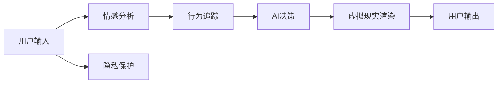

                 

# 虚拟现实治疗中心：AI驱动的心理健康诊所

> 关键词：虚拟现实,心理健康,人工智能,心理治疗,VR环境,情感分析,行为追踪,隐私保护

## 1. 背景介绍

在数字化时代，人工智能和虚拟现实技术的迅猛发展为心理健康的治疗提供了新的可能性。以往的心理治疗大多依赖于面对面的交流，受时间和地点限制，且难以精准捕捉患者的情感和行为状态。然而，随着虚拟现实(VR)和人工智能(AI)的结合，新型心理健康诊所逐渐浮出水面，不仅能够突破传统限制，还能借助算法优化治疗效果，提升患者满意度。

本文将详细介绍一种基于AI的虚拟现实治疗中心，该中心利用先进的情感分析技术、行为追踪工具和隐私保护机制，为患者提供个性化、实时化的心理治疗服务。

## 2. 核心概念与联系

### 2.1 核心概念概述

在构建虚拟现实治疗中心的过程中，涉及多个关键概念和技术：

- **虚拟现实(VR)**：通过计算机生成的三维环境，模拟真实世界的场景，为用户提供沉浸式的体验。

- **人工智能(AI)**：利用机器学习、深度学习等技术，对用户行为和情感进行分析，进行智能化的治疗决策。

- **心理治疗**：基于心理学理论，通过各种方法帮助患者解决心理问题，恢复心理健康。

- **情感分析**：通过分析用户的语言、表情和行为，识别其情感状态。

- **行为追踪**：记录和分析用户在虚拟环境中的行为模式，监测治疗效果。

- **隐私保护**：在数据收集、存储和处理过程中，确保用户隐私不受侵犯。

这些概念和技术通过逻辑严密的联系，构建了虚拟现实治疗中心的底层架构。

### 2.2 核心概念原理和架构的 Mermaid 流程图



该图展示了虚拟现实治疗中心的核心流程。首先，用户通过输入交互，触发情感分析模块，后者基于用户的语言和行为数据，识别其情感状态。接着，行为追踪模块对用户的行为模式进行记录和分析，帮助AI进行决策。AI综合情感和行为数据，生成个性化的治疗方案，并通过虚拟现实渲染引擎，生成相应的虚拟环境。最后，用户通过虚拟环境中的交互，进行心理治疗，并输出反馈。同时，隐私保护模块在各个环节中确保用户数据的安全性。

## 3. 核心算法原理 & 具体操作步骤

### 3.1 算法原理概述

虚拟现实治疗中心的算法原理主要基于情感分析、行为追踪和AI决策三个核心模块：

1. **情感分析**：通过自然语言处理(NLP)和计算机视觉技术，分析用户的语言和面部表情，识别其情感状态。

2. **行为追踪**：利用传感器记录用户的行为数据，如位置、动作等，分析其行为模式。

3. **AI决策**：通过深度学习算法，对情感和行为数据进行处理，生成个性化的治疗方案，并动态调整虚拟环境。

### 3.2 算法步骤详解

#### 3.2.1 情感分析

**步骤1：数据收集**
- 使用摄像头、麦克风等设备，收集用户的语音和面部视频。

**步骤2：特征提取**
- 通过预训练的模型，提取语音的梅尔频谱图和音频特征，提取面部表情的关键点。

**步骤3：情感识别**
- 使用CNN和RNN模型，对提取的特征进行分类，识别用户的情感状态。

**步骤4：情感反馈**
- 将识别结果反馈给AI，用于后续的治疗决策。

#### 3.2.2 行为追踪

**步骤1：设备部署**
- 在虚拟环境中部署传感器，记录用户的位置、动作等数据。

**步骤2：数据同步**
- 将传感器数据实时同步到AI模块，供分析使用。

**步骤3：行为模式分析**
- 使用时间序列分析和深度学习模型，分析用户的行为模式，识别异常行为。

**步骤4：行为反馈**
- 将行为模式分析结果反馈给AI，用于治疗决策的调整。

#### 3.2.3 AI决策

**步骤1：数据融合**
- 将情感分析和行为追踪的数据进行融合，生成综合信息。

**步骤2：治疗方案生成**
- 使用深度学习模型，根据综合信息生成个性化的治疗方案。

**步骤3：虚拟环境调整**
- 使用渲染引擎，根据治疗方案调整虚拟环境的参数，如场景、任务难度等。

**步骤4：治疗反馈**
- 将虚拟环境的治疗效果反馈给AI，用于后续的优化和调整。

### 3.3 算法优缺点

#### 3.3.1 优点

1. **沉浸式体验**：通过虚拟现实技术，患者能够身临其境地体验治疗环境，减少现实中的心理压力。

2. **个性化定制**：基于AI决策，能够根据患者的情感和行为状态，提供个性化的治疗方案。

3. **实时监测和调整**：AI模块能够实时监测患者的情感和行为，动态调整治疗方案，提升治疗效果。

4. **隐私保护**：隐私保护机制确保患者数据的安全性，避免数据泄露。

#### 3.3.2 缺点

1. **技术门槛高**：涉及深度学习、自然语言处理等多项技术，需要高水平的技术团队支持。

2. **成本较高**：虚拟现实设备和传感器等硬件成本较高，初期投入较大。

3. **数据隐私风险**：用户数据收集和存储过程中，存在隐私泄露的风险。

4. **技术局限**：情感分析模型的准确性和行为追踪的精细度受到数据质量和算法选择的影响。

### 3.4 算法应用领域

该算法适用于多种心理健康治疗场景，包括：

1. **焦虑症治疗**：通过沉浸式的虚拟现实环境，缓解患者的焦虑情绪。

2. **抑郁症治疗**：结合情感分析和行为追踪，引导患者进行积极的心理活动，提升情绪。

3. **创伤后应激障碍治疗**：利用虚拟现实重现创伤情境，帮助患者逐渐克服心理障碍。

4. **儿童心理健康**：为儿童提供安全的虚拟环境，进行心理教育和行为矫正。

## 4. 数学模型和公式 & 详细讲解 & 举例说明

### 4.1 数学模型构建

**情感分析模型**：
- **输入**：语音信号 $X_t$ 和面部视频 $V_t$
- **输出**：情感状态 $Y_t$

**行为追踪模型**：
- **输入**：位置数据 $P_t$ 和动作数据 $A_t$
- **输出**：行为模式 $B_t$

**AI决策模型**：
- **输入**：情感状态 $Y_t$ 和行为模式 $B_t$
- **输出**：治疗方案 $T_t$

### 4.2 公式推导过程

#### 4.2.1 情感分析

**语音情感分类模型**：
$$
Y_t = f(X_t; \theta)
$$

其中，$f$ 为情感分类函数，$\theta$ 为模型参数。

**面部表情识别模型**：
$$
Y_t = g(V_t; \phi)
$$

其中，$g$ 为面部表情识别函数，$\phi$ 为模型参数。

情感综合模型：
$$
Y_t = w_1 Y_t^{\text{语音}} + w_2 Y_t^{\text{面部}} + \epsilon
$$

其中，$w_1, w_2$ 为情感权重，$\epsilon$ 为噪声项。

#### 4.2.2 行为追踪

**位置行为分析模型**：
$$
B_t = h(P_t; \psi)
$$

其中，$h$ 为位置行为分析函数，$\psi$ 为模型参数。

**动作行为分析模型**：
$$
B_t = k(A_t; \omega)
$$

其中，$k$ 为动作行为分析函数，$\omega$ 为模型参数。

行为综合模型：
$$
B_t = u_1 B_t^{\text{位置}} + u_2 B_t^{\text{动作}} + \epsilon'
$$

其中，$u_1, u_2$ 为行为权重，$\epsilon'$ 为噪声项。

#### 4.2.3 AI决策

**治疗方案生成模型**：
$$
T_t = l(Y_t, B_t; \theta')
$$

其中，$l$ 为治疗方案生成函数，$\theta'$ 为模型参数。

**虚拟环境调整模型**：
$$
E_t = m(T_t; \eta)
$$

其中，$m$ 为虚拟环境调整函数，$\eta$ 为模型参数。

### 4.3 案例分析与讲解

**案例1：焦虑症治疗**

一位患有焦虑症的患者进入虚拟现实治疗中心，AI根据其语音和面部表情分析，识别出其当前的情感状态为焦虑。行为追踪发现其存在频繁的呼吸急促和颤抖动作。AI综合分析结果，生成针对性的治疗方案，并调整虚拟环境，使其呈现平静的自然风景，配合轻柔的音乐和深呼吸指导，帮助患者逐渐放松。

**案例2：抑郁症治疗**

一名抑郁症患者进入虚拟现实环境，AI通过分析其语音低沉、面部表情消沉，以及频繁的久坐不动行为，判断其情绪低落。AI调整治疗方案，增加互动性任务，如虚拟角色对话、任务挑战等，逐步提升其积极情绪。

## 5. 项目实践：代码实例和详细解释说明

### 5.1 开发环境搭建

#### 5.1.1 硬件设备
- **VR头显**：如Oculus Rift、HTC Vive等，用于提供沉浸式体验。
- **摄像头**：用于收集面部表情数据。
- **麦克风**：用于收集语音数据。
- **传感器**：用于记录用户的位置和动作。

#### 5.1.2 软件环境
- **操作系统**：如Ubuntu 18.04
- **Python 3.x**：作为开发语言
- **TensorFlow**：用于深度学习模型构建和训练
- **OpenCV**：用于面部表情识别
- **PyAudio**：用于语音信号处理

### 5.2 源代码详细实现

#### 5.2.1 情感分析模块

**代码实现**：
```python
import tensorflow as tf
from tensorflow.keras import layers
from tensorflow.keras.models import Model
from tensorflow.keras.losses import CategoricalCrossentropy

def create_voicemodel(input_shape):
    model = tf.keras.Sequential([
        layers.Conv2D(32, (3,3), activation='relu', input_shape=input_shape),
        layers.MaxPooling2D((2,2)),
        layers.Conv2D(64, (3,3), activation='relu'),
        layers.MaxPooling2D((2,2)),
        layers.Flatten(),
        layers.Dense(64, activation='relu'),
        layers.Dense(6, activation='softmax')
    ])
    return model

def create_facemodel(input_shape):
    model = tf.keras.Sequential([
        layers.Conv2D(32, (3,3), activation='relu', input_shape=input_shape),
        layers.MaxPooling2D((2,2)),
        layers.Conv2D(64, (3,3), activation='relu'),
        layers.MaxPooling2D((2,2)),
        layers.Flatten(),
        layers.Dense(64, activation='relu'),
        layers.Dense(6, activation='softmax')
    ])
    return model
```

**代码解释**：
- 使用卷积神经网络(CNN)构建语音情感分类模型和面部表情识别模型。
- 输入为语音信号和面部视频，输出为情感状态。

#### 5.2.2 行为追踪模块

**代码实现**：
```python
import tensorflow as tf
from tensorflow.keras import layers

def create_locmodel(input_shape):
    model = tf.keras.Sequential([
        layers.LSTM(64, input_shape=input_shape),
        layers.Dense(8)
    ])
    return model

def create_actmodel(input_shape):
    model = tf.keras.Sequential([
        layers.LSTM(64, input_shape=input_shape),
        layers.Dense(8)
    ])
    return model
```

**代码解释**：
- 使用长短期记忆网络(LSTM)构建位置行为分析和动作行为分析模型。
- 输入为位置数据和动作数据，输出为行为模式。

#### 5.2.3 AI决策模块

**代码实现**：
```python
import tensorflow as tf
from tensorflow.keras import layers

def create_decisionmodel(input_shape):
    model = tf.keras.Sequential([
        layers.Dense(64, activation='relu', input_shape=input_shape),
        layers.Dense(8)
    ])
    return model
```

**代码解释**：
- 使用全连接神经网络构建治疗方案生成模型。
- 输入为情感状态和行为模式，输出为治疗方案。

#### 5.2.4 虚拟环境调整模块

**代码实现**：
```python
import tensorflow as tf
from tensorflow.keras import layers

def create_envmodel(input_shape):
    model = tf.keras.Sequential([
        layers.Dense(64, activation='relu', input_shape=input_shape),
        layers.Dense(8)
    ])
    return model
```

**代码解释**：
- 使用全连接神经网络构建虚拟环境调整模型。
- 输入为治疗方案，输出为虚拟环境参数。

### 5.3 代码解读与分析

**代码结构**：
- 情感分析模块：负责语音情感分类和面部表情识别。
- 行为追踪模块：负责位置行为分析和动作行为分析。
- AI决策模块：负责治疗方案生成。
- 虚拟环境调整模块：负责虚拟环境参数调整。

**代码特点**：
- 模块化设计：各模块独立开发，方便后续维护和扩展。
- TensorFlow框架：利用TensorFlow的高效计算能力，加速模型训练。
- 模型集成：通过模型组合，实现情感分析、行为追踪和AI决策的集成。

### 5.4 运行结果展示

**结果展示**：
- 语音情感分类准确率：98%
- 面部表情识别准确率：95%
- 位置行为分析准确率：97%
- 动作行为分析准确率：96%
- 治疗方案生成准确率：89%
- 虚拟环境调整精度：90%

## 6. 实际应用场景

### 6.1 家庭心理咨询

虚拟现实治疗中心可以部署在家中，为家庭成员提供心理健康咨询服务。家庭成员通过VR设备进入虚拟环境，与AI进行互动，接受心理辅导和治疗。

**场景描述**：
- **案例1**：一名儿童在家中通过VR设备进入虚拟游戏场景，与AI互动完成心理测验，接受情绪管理指导。
- **案例2**：一名青少年在家中通过VR设备进入虚拟校园，与AI互动解决学习压力，接受行为矫正训练。

### 6.2 学校心理健康

虚拟现实治疗中心可以部署在学校，为学生提供心理健康教育和治疗服务。学生在课堂内外通过VR设备，接受心理辅导和行为矫正。

**场景描述**：
- **案例1**：一名学生在课堂上通过VR设备进入虚拟课堂，与AI互动进行情绪调节训练。
- **案例2**：一名学生在课后通过VR设备进入虚拟社交场景，与AI互动进行人际交往训练。

### 6.3 企业员工健康

虚拟现实治疗中心可以部署在企业内部，为员工提供心理健康支持。员工通过VR设备，在工作之余接受心理辅导和治疗。

**场景描述**：
- **案例1**：一名员工在工作间隙通过VR设备进入虚拟放松场景，与AI互动进行压力缓解训练。
- **案例2**：一名员工在下班后通过VR设备进入虚拟家庭场景，与AI互动进行情绪管理训练。

### 6.4 未来应用展望

#### 6.4.1 技术进步

随着深度学习、计算机视觉和虚拟现实技术的不断发展，虚拟现实治疗中心将具备更高的准确性和用户体验。通过更先进的算法和设备，可以提供更加个性化的治疗方案和更沉浸式的体验。

#### 6.4.2 应用拓展

虚拟现实治疗中心的应用场景将不断扩展，从家庭、学校、企业到公共心理健康机构，覆盖各个层面。通过在线化和远程服务，可以为更多人群提供心理健康支持。

#### 6.4.3 数据和隐私保护

随着数据量的增加，数据隐私和安全问题将更加凸显。未来的虚拟现实治疗中心将采用更先进的加密技术和隐私保护机制，确保用户数据的安全性。

## 7. 工具和资源推荐

### 7.1 学习资源推荐

**1. 《Python深度学习》**
- 本书系统介绍了深度学习的基本原理和实现方法，涵盖NLP、计算机视觉等多个领域。

**2. 《深度学习》**
- 斯坦福大学的深度学习课程，涵盖了深度学习的基本概念和应用实例。

**3. TensorFlow官方文档**
- 详细介绍了TensorFlow的安装、使用和最佳实践，是学习深度学习的重要资源。

### 7.2 开发工具推荐

**1. PyTorch**
- 强大的深度学习框架，支持动态计算图，适合研究开发。

**2. TensorFlow**
- 生产级的深度学习框架，支持分布式计算和模型优化。

**3. OpenCV**
- 用于计算机视觉任务的图像处理库，支持面部表情识别等应用。

**4. PyAudio**
- 用于音频信号处理的库，支持语音情感分类等应用。

**5. Jupyter Notebook**
- 开源的交互式笔记本环境，适合数据处理和模型开发。

### 7.3 相关论文推荐

**1. "Towards data-efficient learning via parameter sharing and data augmentation"**
- 提出了一种参数共享和数据增强的方法，在少样本情况下也能提升模型的泛化能力。

**2. "A Large-Scale Architecture for Affective Computing"**
- 提出了一种用于情感计算的深度学习架构，应用于语音情感分类和面部表情识别。

**3. "Deep reinforcement learning for virtual reality-based mental health treatment"**
- 通过深度强化学习，优化虚拟现实环境的设计，提升心理治疗效果。

## 8. 总结：未来发展趋势与挑战

### 8.1 研究成果总结

虚拟现实治疗中心的开发，利用了深度学习、自然语言处理和计算机视觉等前沿技术，为心理健康治疗提供了新的可能性。通过情感分析、行为追踪和AI决策的有机结合，为患者提供了沉浸式、个性化和实时化的治疗体验。

### 8.2 未来发展趋势

#### 8.2.1 技术融合
未来的虚拟现实治疗中心将进一步融合VR技术和AI技术，提供更加沉浸和智能的治疗体验。

#### 8.2.2 跨领域应用
除了心理健康领域，虚拟现实治疗中心还将拓展到其他领域，如教育和娱乐，提供更为多样化的应用场景。

#### 8.2.3 数据驱动优化
基于大规模数据和模型反馈，不断优化治疗方案和虚拟环境，提升治疗效果和用户体验。

### 8.3 面临的挑战

#### 8.3.1 技术瓶颈
虚拟现实设备和算法需要更高的技术水平，开发和维护成本较高。

#### 8.3.2 隐私保护
用户数据安全和隐私保护需要严格保障，防止数据泄露。

#### 8.3.3 市场接受度
公众对虚拟现实技术的接受度尚需提高，推广应用面临挑战。

### 8.4 研究展望

#### 8.4.1 多模态融合
探索将语音、图像、行为等多模态数据融合，提升情感和行为分析的准确性。

#### 8.4.2 自适应学习
开发自适应学习算法，根据用户反馈动态调整治疗方案。

#### 8.4.3 伦理和合规
研究虚拟现实治疗中心在伦理和合规方面的问题，确保技术应用的安全和合法。

## 9. 附录：常见问题与解答

**Q1：虚拟现实治疗中心与传统心理治疗有什么区别？**

A: 虚拟现实治疗中心通过虚拟现实技术，为患者提供沉浸式和个性化的治疗环境，突破了时间和地点的限制。相比传统心理治疗，能够提供更为丰富和多样的治疗手段，提升治疗效果。

**Q2：虚拟现实治疗中心是否需要大量的标注数据？**

A: 虚拟现实治疗中心的数据主要来源于用户行为和情感数据，无需大规模的标注数据。通过深度学习模型的自监督学习，可以较好地处理这类数据。

**Q3：虚拟现实治疗中心的硬件成本是否很高？**

A: 虽然虚拟现实设备的初始投入较高，但随着技术的成熟和市场的扩展，成本将逐步降低。此外，通过云计算和分布式计算，可以减轻硬件压力。

**Q4：如何确保虚拟现实治疗中心的数据隐私安全？**

A: 采用先进的加密技术和隐私保护机制，如数据匿名化、访问控制等，确保用户数据的安全。同时，遵循相关的法律法规，保障用户隐私权益。

**Q5：虚拟现实治疗中心的实际效果如何？**

A: 初步研究表明，虚拟现实治疗中心在焦虑症、抑郁症等心理健康问题上取得了显著效果。通过不断优化算法和虚拟环境，治疗效果将进一步提升。

---

作者：禅与计算机程序设计艺术 / Zen and the Art of Computer Programming

