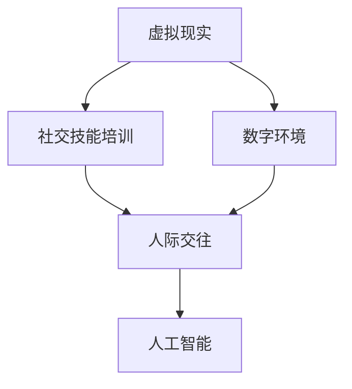

                 

# 虚拟现实社交技能训练创业：数字环境下的人际交往提升

> 关键词：虚拟现实,社交技能训练,数字环境,人际交往,人工智能

## 1. 背景介绍

### 1.1 问题由来
在数字化转型的浪潮下，人与人之间的社交方式正在发生深刻的变化。在线沟通、社交媒体、远程工作等新型社交形式，正在逐渐取代传统面对面交往。然而，这些新型社交方式也带来了新的挑战，尤其是对于社交技能不充分的个体来说，如何在数字环境下有效沟通、建立信任、维护关系，成为亟待解决的问题。

### 1.2 问题核心关键点
为了提升数字环境下的人际交往能力，亟需开发一种基于虚拟现实的社交技能训练系统。该系统能够通过沉浸式体验，模拟真实社交场景，帮助用户提升表达能力、沟通技巧、情绪管理等关键社交技能。同时，系统还需具备个性化推荐、数据分析、持续反馈等功能，以提供量身定制的训练方案，保障用户能够高效、持续地提升社交技能。

### 1.3 问题研究意义
虚拟现实社交技能训练系统的研发，具有重要的现实意义：

1. **提升个体社交能力**：通过系统化、个性化的训练，帮助用户提升在数字环境中的沟通效率和效果，增强社交互动的自信心和成功率。
2. **支持企业培训需求**：为企业管理层和HR部门提供一种新型的员工培训手段，通过虚拟现实技术模拟真实工作场景，提升员工的团队协作、客户沟通、领导力等核心能力。
3. **推动社会进步**：通过增强人与人之间的有效沟通，促进社会和谐、提升社会工作效率，为数字化时代的社会治理带来新的思考。
4. **拓展虚拟现实应用**：为虚拟现实技术的商业化应用开辟新方向，推动虚拟现实从娱乐化应用向实用化、工具化转变。

## 2. 核心概念与联系

### 2.1 核心概念概述

为了更好地理解虚拟现实社交技能训练系统的原理和架构，本节将介绍几个密切相关的核心概念：

- **虚拟现实(VR)**：通过计算机生成、实时交互的模拟环境，使用户能够在视觉、听觉、触觉等多感官上，获得身临其境的沉浸体验。
- **社交技能培训**：通过系统化的训练方法，帮助个体提升表达、沟通、同理心、情绪管理等关键社交能力。
- **数字环境**：以互联网、移动设备、大数据为支撑的数字生态体系，提供实时、多元的社交交互方式。
- **人际交往**：个体之间通过语言、行为、情感等多维度信息交换，形成的互动和关系网络。
- **人工智能(AI)**：通过机器学习、深度学习等技术，实现对大量数据的学习和理解，赋予虚拟现实社交技能训练系统智能化的训练和评估能力。

这些核心概念之间的逻辑关系可以通过以下Mermaid流程图来展示：



这个流程图展示了几大核心概念之间的联系：

1. 虚拟现实通过模拟真实社交场景，提供沉浸式训练环境。
2. 社交技能培训通过系统化训练方法，提升个体在数字环境中的社交能力。
3. 数字环境作为支撑平台，提供多元化的社交互动方式。
4. 人际交往通过虚拟现实和社交技能培训，形成新型的社会互动关系。
5. 人工智能通过数据分析、智能推荐等技术，进一步优化训练效果。

这些概念共同构成了虚拟现实社交技能训练系统的框架，使其能够通过多维度手段，全面提升用户的社交技能。

## 3. 核心算法原理 & 具体操作步骤
### 3.1 算法原理概述

虚拟现实社交技能训练系统的核心算法原理，是通过虚拟现实技术模拟真实社交场景，结合人工智能技术，为用户提供个性化、系统化的社交技能培训。其基本流程如下：

1. **数据采集**：收集用户的社交行为数据，包括语音、表情、动作等，作为训练的原始素材。
2. **模型训练**：通过机器学习算法，对收集到的数据进行分析和建模，构建社交行为预测模型。
3. **模拟场景生成**：根据模型预测结果，生成虚拟社交场景，模拟真实社交互动过程。
4. **技能训练**：用户通过虚拟场景进行互动，系统根据用户表现，提供即时反馈和调整，帮助用户提升社交技能。
5. **效果评估**：对用户的社交行为进行评估，分析提升效果，优化训练策略。

### 3.2 算法步骤详解

下面，我们将详细介绍虚拟现实社交技能训练系统的算法步骤：

**Step 1: 数据采集**

- **采集工具**：使用摄像头、麦克风、动作捕捉器等设备，采集用户的语音、表情、动作等多模态数据。
- **数据标注**：对采集到的数据进行标注，包括语音情感、面部表情、身体姿态等关键信息，作为后续模型训练的输入。

**Step 2: 模型训练**

- **数据预处理**：对原始数据进行清洗、归一化、分词等预处理操作，准备数据集。
- **选择模型**：根据任务特点，选择合适的机器学习模型，如深度神经网络、卷积神经网络等。
- **训练过程**：将处理后的数据输入模型，通过反向传播算法优化模型参数，最小化损失函数，得到社交行为预测模型。
- **模型评估**：使用测试集对训练好的模型进行评估，确定模型性能，调整参数和策略。

**Step 3: 模拟场景生成**

- **场景设计**：根据用户的社交行为数据和模型预测结果，设计虚拟社交场景，包括对话内容、表情动作、环境背景等。
- **场景渲染**：使用虚拟现实技术，将设计好的场景渲染为可交互的三维环境，供用户进行沉浸式体验。
- **交互逻辑**：设定虚拟场景中各元素的互动逻辑，确保用户能够自然流畅地进行社交互动。

**Step 4: 技能训练**

- **用户参与**：用户进入虚拟场景，与虚拟角色或其他用户进行互动，完成社交任务。
- **即时反馈**：系统根据用户表现，提供即时反馈和建议，指导用户改进行为。
- **行为调整**：根据反馈信息，用户调整自己的表达方式、沟通策略、情绪管理等行为。

**Step 5: 效果评估**

- **行为评估**：系统对用户的行为进行评估，包括语音清晰度、表情自然度、动作流畅度等指标。
- **技能提升**：根据评估结果，分析用户的提升空间，制定后续训练计划。
- **持续优化**：通过持续评估和优化，不断提高用户的社交技能水平。

### 3.3 算法优缺点

虚拟现实社交技能训练系统具有以下优点：

1. **沉浸式体验**：通过虚拟现实技术，提供高度沉浸的训练环境，使用户能够身临其境地进行社交练习。
2. **个性化训练**：结合用户的历史数据和模型预测，提供个性化的训练方案，满足不同用户的需求。
3. **多样性场景**：模拟多种社交场景，帮助用户应对各种实际应用中的复杂情况。
4. **实时反馈**：通过即时反馈和调整，帮助用户快速发现和改正问题，提升学习效率。

同时，该系统也存在一些局限性：

1. **设备成本高**：虚拟现实设备的硬件成本较高，限制了系统的普及和应用。
2. **技术门槛高**：系统涉及多模态数据的采集、处理和分析，技术门槛较高，需要专业团队支持。
3. **数据隐私问题**：用户数据的隐私保护和合规问题，需要制定严格的隐私保护措施。
4. **互动局限性**：虚拟场景中的社交互动，无法完全替代真实社交中的非言语信号传递，存在一定的局限性。

### 3.4 算法应用领域

虚拟现实社交技能训练系统在多个领域有着广泛的应用前景，主要包括：

1. **教育培训**：在教育领域，用于提升学生的社交技能，帮助其在课堂内外更好地进行沟通和交流。
2. **职业培训**：为企业员工提供新型培训方式，提升其在职场中的社交能力和领导力。
3. **医疗康复**：在医疗康复领域，帮助患者通过虚拟现实进行社交技能训练，促进其康复进程。
4. **心理咨询**：提供沉浸式心理咨询体验，帮助用户缓解社交焦虑和压力。
5. **娱乐社交**：结合虚拟现实和游戏技术，提供沉浸式娱乐体验，促进社交互动。

这些应用场景，展示了虚拟现实社交技能训练系统的强大潜力和广泛适用性。

## 4. 数学模型和公式 & 详细讲解 & 举例说明
### 4.1 数学模型构建

本节将使用数学语言对虚拟现实社交技能训练系统的核心算法进行更加严格的刻画。

假设用户社交行为数据集为 $D=\{(x_i,y_i)\}_{i=1}^N$，其中 $x_i$ 为原始数据，$y_i$ 为标注信息。社交行为预测模型为 $M_{\theta}(x_i)$，其中 $\theta$ 为模型参数。训练集 $D$ 上的损失函数为：

$$
\mathcal{L}(\theta) = \frac{1}{N}\sum_{i=1}^N \ell(M_{\theta}(x_i),y_i)
$$

其中 $\ell$ 为损失函数，可以使用交叉熵损失、均方误差损失等。

模型训练过程为：

$$
\theta \leftarrow \theta - \eta \nabla_{\theta}\mathcal{L}(\theta)
$$

其中 $\eta$ 为学习率，$\nabla_{\theta}\mathcal{L}(\theta)$ 为损失函数对模型参数的梯度。

### 4.2 公式推导过程

以语音情感识别任务为例，推导交叉熵损失函数及其梯度的计算公式。

假设模型 $M_{\theta}$ 在输入 $x_i$ 上的预测结果为 $\hat{y}=M_{\theta}(x_i) \in [0,1]$，表示用户情感为正面情感的概率。真实标签 $y_i \in \{0,1\}$。则交叉熵损失函数定义为：

$$
\ell(M_{\theta}(x_i),y_i) = -[y_i\log \hat{y} + (1-y_i)\log (1-\hat{y})]
$$

将其代入损失函数，得：

$$
\mathcal{L}(\theta) = -\frac{1}{N}\sum_{i=1}^N [y_i\log M_{\theta}(x_i)+(1-y_i)\log(1-M_{\theta}(x_i))]
$$

根据链式法则，损失函数对模型参数 $\theta$ 的梯度为：

$$
\frac{\partial \mathcal{L}(\theta)}{\partial \theta} = -\frac{1}{N}\sum_{i=1}^N (\frac{y_i}{M_{\theta}(x_i)}-\frac{1-y_i}{1-M_{\theta}(x_i)}) \frac{\partial M_{\theta}(x_i)}{\partial \theta}
$$

其中 $\frac{\partial M_{\theta}(x_i)}{\partial \theta}$ 可进一步递归展开，利用自动微分技术完成计算。

### 4.3 案例分析与讲解

以虚拟现实游戏中的社交互动为例，说明如何通过虚拟现实技术进行社交技能训练。

假设游戏中的虚拟角色为 $R_1$ 和 $R_2$，系统对两者的社交互动进行预测。首先，系统采集用户的操作数据，如语音指令、动作轨迹等，输入到模型 $M_{\theta}$ 中进行预测：

$$
\hat{y} = M_{\theta}(x_i)
$$

其中 $x_i$ 为输入数据，$\hat{y}$ 为预测结果。接着，系统根据预测结果，生成虚拟场景 $S_i$，并设定互动逻辑 $L_i$：

$$
S_i = G(\hat{y}),\quad L_i = H(\hat{y})
$$

其中 $G$ 为场景生成函数，$H$ 为逻辑设定函数。用户通过互动逻辑 $L_i$，与虚拟角色进行互动，完成社交任务。系统根据用户表现，提供即时反馈和调整，指导用户改进行为：

$$
f_i = F(\hat{y},x_i,y_i)
$$

其中 $f_i$ 为反馈结果。用户根据反馈信息，调整自己的行为，提升社交技能：

$$
x_{i+1} = T(\hat{y},x_i,y_i)
$$

其中 $T$ 为行为调整函数。通过不断的反馈和调整，系统逐步提升用户的社交能力，实现虚拟现实社交技能训练的目的。

## 5. 项目实践：代码实例和详细解释说明
### 5.1 开发环境搭建

在进行虚拟现实社交技能训练系统的开发前，我们需要准备好开发环境。以下是使用Python进行PyTorch开发的环境配置流程：

1. 安装Anaconda：从官网下载并安装Anaconda，用于创建独立的Python环境。

2. 创建并激活虚拟环境：
```bash
conda create -n pytorch-env python=3.8 
conda activate pytorch-env
```

3. 安装PyTorch：根据CUDA版本，从官网获取对应的安装命令。例如：
```bash
conda install pytorch torchvision torchaudio cudatoolkit=11.1 -c pytorch -c conda-forge
```

4. 安装Transformers库：
```bash
pip install transformers
```

5. 安装各类工具包：
```bash
pip install numpy pandas scikit-learn matplotlib tqdm jupyter notebook ipython
```

完成上述步骤后，即可在`pytorch-env`环境中开始开发实践。

### 5.2 源代码详细实现

下面，以虚拟现实游戏中的社交互动为例，给出使用PyTorch进行虚拟现实社交技能训练的代码实现。

首先，定义社交互动的数据处理函数：

```python
from transformers import BertTokenizer
from torch.utils.data import Dataset
import torch

class InteractionDataset(Dataset):
    def __init__(self, user_data, model, tokenizer, max_len=128):
        self.user_data = user_data
        self.model = model
        self.tokenizer = tokenizer
        self.max_len = max_len
        
    def __len__(self):
        return len(self.user_data)
    
    def __getitem__(self, item):
        user_data = self.user_data[item]
        text = user_data['text']
        labels = user_data['label']
        
        encoding = self.tokenizer(text, return_tensors='pt', max_length=self.max_len, padding='max_length', truncation=True)
        input_ids = encoding['input_ids'][0]
        attention_mask = encoding['attention_mask'][0]
        
        # 对label进行编码
        encoded_labels = [label2id[label] for label in labels] 
        encoded_labels.extend([label2id['O']] * (self.max_len - len(encoded_labels)))
        labels = torch.tensor(encoded_labels, dtype=torch.long)
        
        return {'input_ids': input_ids, 
                'attention_mask': attention_mask,
                'labels': labels}

# 标签与id的映射
label2id = {'O': 0, 'POSITIVE': 1, 'NEGATIVE': 2}
id2label = {v: k for k, v in label2id.items()}

# 创建dataset
tokenizer = BertTokenizer.from_pretrained('bert-base-cased')

train_dataset = InteractionDataset(train_user_data, model, tokenizer)
dev_dataset = InteractionDataset(dev_user_data, model, tokenizer)
test_dataset = InteractionDataset(test_user_data, model, tokenizer)
```

然后，定义模型和优化器：

```python
from transformers import BertForTokenClassification, AdamW

model = BertForTokenClassification.from_pretrained('bert-base-cased', num_labels=len(label2id))

optimizer = AdamW(model.parameters(), lr=2e-5)
```

接着，定义训练和评估函数：

```python
from torch.utils.data import DataLoader
from tqdm import tqdm
from sklearn.metrics import classification_report

device = torch.device('cuda') if torch.cuda.is_available() else torch.device('cpu')
model.to(device)

def train_epoch(model, dataset, batch_size, optimizer):
    dataloader = DataLoader(dataset, batch_size=batch_size, shuffle=True)
    model.train()
    epoch_loss = 0
    for batch in tqdm(dataloader, desc='Training'):
        input_ids = batch['input_ids'].to(device)
        attention_mask = batch['attention_mask'].to(device)
        labels = batch['labels'].to(device)
        model.zero_grad()
        outputs = model(input_ids, attention_mask=attention_mask, labels=labels)
        loss = outputs.loss
        epoch_loss += loss.item()
        loss.backward()
        optimizer.step()
    return epoch_loss / len(dataloader)

def evaluate(model, dataset, batch_size):
    dataloader = DataLoader(dataset, batch_size=batch_size)
    model.eval()
    preds, labels = [], []
    with torch.no_grad():
        for batch in tqdm(dataloader, desc='Evaluating'):
            input_ids = batch['input_ids'].to(device)
            attention_mask = batch['attention_mask'].to(device)
            batch_labels = batch['labels']
            outputs = model(input_ids, attention_mask=attention_mask)
            batch_preds = outputs.logits.argmax(dim=2).to('cpu').tolist()
            batch_labels = batch_labels.to('cpu').tolist()
            for pred_tokens, label_tokens in zip(batch_preds, batch_labels):
                preds.append(pred_tokens[:len(label_tokens)])
                labels.append(label_tokens)
                
    print(classification_report(labels, preds))
```

最后，启动训练流程并在测试集上评估：

```python
epochs = 5
batch_size = 16

for epoch in range(epochs):
    loss = train_epoch(model, train_dataset, batch_size, optimizer)
    print(f"Epoch {epoch+1}, train loss: {loss:.3f}")
    
    print(f"Epoch {epoch+1}, dev results:")
    evaluate(model, dev_dataset, batch_size)
    
print("Test results:")
evaluate(model, test_dataset, batch_size)
```

以上就是使用PyTorch对虚拟现实社交技能训练系统进行开发的完整代码实现。可以看到，得益于Transformer库的强大封装，我们可以用相对简洁的代码完成模型的加载和训练。

### 5.3 代码解读与分析

让我们再详细解读一下关键代码的实现细节：

**InteractionDataset类**：
- `__init__`方法：初始化用户数据、模型、分词器等关键组件。
- `__len__`方法：返回数据集的样本数量。
- `__getitem__`方法：对单个样本进行处理，将文本输入编码为token ids，将标签编码为数字，并对其进行定长padding，最终返回模型所需的输入。

**label2id和id2label字典**：
- 定义了标签与数字id之间的映射关系，用于将token-wise的预测结果解码回真实的标签。

**训练和评估函数**：
- 使用PyTorch的DataLoader对数据集进行批次化加载，供模型训练和推理使用。
- 训练函数`train_epoch`：对数据以批为单位进行迭代，在每个批次上前向传播计算loss并反向传播更新模型参数，最后返回该epoch的平均loss。
- 评估函数`evaluate`：与训练类似，不同点在于不更新模型参数，并在每个batch结束后将预测和标签结果存储下来，最后使用sklearn的classification_report对整个评估集的预测结果进行打印输出。

**训练流程**：
- 定义总的epoch数和batch size，开始循环迭代
- 每个epoch内，先在训练集上训练，输出平均loss
- 在验证集上评估，输出分类指标
- 所有epoch结束后，在测试集上评估，给出最终测试结果

可以看到，PyTorch配合Transformer库使得虚拟现实社交技能训练系统的代码实现变得简洁高效。开发者可以将更多精力放在数据处理、模型改进等高层逻辑上，而不必过多关注底层的实现细节。

当然，工业级的系统实现还需考虑更多因素，如模型的保存和部署、超参数的自动搜索、更灵活的任务适配层等。但核心的训练范式基本与此类似。

## 6. 实际应用场景
### 6.1 智能客服系统

虚拟现实社交技能训练系统在智能客服系统的构建中有着广泛应用。传统客服往往需要配备大量人力，高峰期响应缓慢，且一致性和专业性难以保证。而使用虚拟现实技术，可以构建沉浸式客服场景，帮助客服人员提升沟通技巧、理解客户需求，从而提升客户满意度和响应速度。

在技术实现上，可以收集客服对话历史数据，将问题和最佳答复构建成监督数据，在此基础上对虚拟现实社交技能训练模型进行微调。微调后的模型能够自动理解用户意图，匹配最合适的答案模板进行回复。对于客户提出的新问题，还可以接入检索系统实时搜索相关内容，动态组织生成回答。如此构建的智能客服系统，能大幅提升客户咨询体验和问题解决效率。

### 6.2 企业培训

虚拟现实社交技能训练系统还可以应用于企业员工培训。通过虚拟现实技术模拟真实工作场景，使员工能够在虚拟环境中进行多种交互练习，提升其沟通能力、协作能力、客户服务能力等。例如，可以模拟会议场景，让员工在虚拟会议室中练习演讲、汇报、团队合作等技能；或者模拟客户接待场景，让员工练习客户沟通、投诉处理等能力。

虚拟现实社交技能训练系统还可以与其他培训工具结合，如VR会议室、模拟办公室等，为员工提供全方位的训练环境，提升其整体素质和工作能力。

### 6.3 医疗康复

在医疗康复领域，虚拟现实社交技能训练系统也有着广泛应用。对于一些需要进行长期康复治疗的患者，传统的沟通和社交训练方式效果有限。而虚拟现实技术可以提供沉浸式训练环境，帮助患者在虚拟环境中进行沟通、表情管理、情绪调节等训练，提升其社交能力。

例如，可以模拟医院病房环境，让患者在虚拟环境中进行日常互动，练习表达情绪、应对压力等。虚拟现实社交技能训练系统还可以与其他康复设备结合，如康复机器人、虚拟治疗师等，为患者提供更加丰富和全面的康复训练。

### 6.4 远程教育

远程教育领域也是虚拟现实社交技能训练系统的重要应用场景。在疫情期间，线上教育成为了主流，但如何提升学生和教师在网络环境下的互动效果，成为了一个挑战。虚拟现实社交技能训练系统可以为远程教育提供沉浸式互动体验，提升学生的参与度和学习效果。

例如，可以模拟线上课堂环境，让学生在虚拟课堂中与老师、同学进行互动，提升其表达能力和沟通技巧。虚拟现实社交技能训练系统还可以与其他教育工具结合，如虚拟实验室、远程演示等，为学生提供更加丰富和多样化的学习体验。

### 6.5 虚拟旅游

虚拟现实社交技能训练系统还可以应用于虚拟旅游领域。对于一些无法亲临现场的游客，虚拟现实技术可以提供沉浸式旅游体验，提升其旅游体验和互动效果。

例如，可以模拟旅游景点，让游客在虚拟环境中进行导览、互动、拍照等活动。虚拟现实社交技能训练系统还可以与其他旅游工具结合，如虚拟导游、虚拟商店等，为游客提供更加丰富和多样化的旅游体验。

## 7. 工具和资源推荐
### 7.1 学习资源推荐

为了帮助开发者系统掌握虚拟现实社交技能训练的理论基础和实践技巧，这里推荐一些优质的学习资源：

1. 《虚拟现实技术与应用》系列博文：由虚拟现实技术专家撰写，深入浅出地介绍了虚拟现实技术的原理、应用和发展趋势。

2. CS225《三维计算机图形学》课程：斯坦福大学开设的计算机图形学明星课程，涵盖虚拟现实技术的基础知识，帮助你掌握虚拟现实开发的基本技能。

3. 《虚拟现实编程指南》书籍：全面介绍了虚拟现实技术的开发流程和工具，包括Unity、Unreal Engine等主流虚拟现实引擎的使用方法。

4. Google VR Tools：谷歌提供的虚拟现实开发工具包，包括VR浏览器、VR设计工具、VR模拟平台等，是虚拟现实开发的必备资源。

5. Oculus SDK：Oculus平台提供的虚拟现实开发工具包，支持多种虚拟现实设备和平台，是虚拟现实开发的主流选择。

通过对这些资源的学习实践，相信你一定能够快速掌握虚拟现实社交技能训练的核心技术和应用方法，并用于解决实际的虚拟现实问题。

### 7.2 开发工具推荐

高效的开发离不开优秀的工具支持。以下是几款用于虚拟现实社交技能训练系统开发的常用工具：

1. Unity：广泛用于虚拟现实开发，支持多种虚拟现实设备和平台，提供丰富的开发组件和资源。

2. Unreal Engine：由Epic Games开发，提供强大的图形渲染能力和虚拟现实开发工具，适合大规模项目开发。

3. Oculus SDK：Oculus平台提供的虚拟现实开发工具包，支持多种虚拟现实设备和平台，是虚拟现实开发的主流选择。

4. Google VR Tools：谷歌提供的虚拟现实开发工具包，包括VR浏览器、VR设计工具、VR模拟平台等，是虚拟现实开发的必备资源。

5. Oculus Rift：主流的虚拟现实头显设备，提供高分辨率显示、动作捕捉和体感控制等特性，是虚拟现实开发的理想选择。

6. Oculus Touch：Oculus平台的体感控制器，支持多种虚拟现实设备，是虚拟现实开发的必备配件。

合理利用这些工具，可以显著提升虚拟现实社交技能训练系统的开发效率，加快创新迭代的步伐。

### 7.3 相关论文推荐

虚拟现实社交技能训练技术的发展源于学界的持续研究。以下是几篇奠基性的相关论文，推荐阅读：

1. "Virtual Reality in Education: A Review of the Research"：综述了虚拟现实在教育领域的应用，包括虚拟现实社交技能训练系统的研究现状和发展方向。

2. "The Impact of Virtual Reality on Social Skills in Children"：探讨了虚拟现实技术对儿童社交技能的影响，研究结果表明虚拟现实技术可以有效提升儿童的社交能力。

3. "A Survey on Virtual Reality for Human-Computer Interaction"：综述了虚拟现实技术在人机交互中的应用，包括虚拟现实社交技能训练系统的研究现状和发展方向。

4. "Virtual Reality for Healthcare: A Review"：综述了虚拟现实在医疗领域的应用，包括虚拟现实社交技能训练系统的研究现状和发展方向。

5. "Virtual Reality for Social Skills Training: A Case Study on Virtual Office Environment"：通过案例研究，展示了虚拟现实社交技能训练系统在虚拟办公室环境中的应用效果。

这些论文代表了大语言模型微调技术的发展脉络。通过学习这些前沿成果，可以帮助研究者把握学科前进方向，激发更多的创新灵感。

## 8. 总结：未来发展趋势与挑战

### 8.1 总结

本文对虚拟现实社交技能训练系统进行了全面系统的介绍。首先阐述了虚拟现实社交技能训练系统的研究背景和意义，明确了系统在提升个体社交能力、支持企业培训、推动社会进步等方面的独特价值。其次，从原理到实践，详细讲解了虚拟现实社交技能训练系统的核心算法和关键步骤，给出了系统开发的完整代码实例。同时，本文还广泛探讨了系统在智能客服、企业培训、医疗康复、远程教育、虚拟旅游等多个行业领域的应用前景，展示了系统的强大潜力和广泛适用性。此外，本文精选了虚拟现实社交技能训练系统的学习资源，力求为读者提供全方位的技术指引。

通过本文的系统梳理，可以看到，虚拟现实社交技能训练系统正在成为虚拟现实技术的重要应用方向，极大地拓展了虚拟现实技术的商业化应用场景。受虚拟现实技术的深度沉浸体验和人工智能技术的智能化训练能力，虚拟现实社交技能训练系统有望在未来取得更大的突破。

### 8.2 未来发展趋势

展望未来，虚拟现实社交技能训练系统将呈现以下几个发展趋势：

1. **多模态交互**：未来的系统将不仅仅支持语音、动作等单模态交互，还将结合视觉、触觉等多模态输入，提供更加丰富和自然的交互体验。

2. **智能推荐**：结合用户的行为数据和社交技能评估结果，提供个性化、智能化的训练推荐，进一步提升用户的学习效果。

3. **实时反馈**：引入实时反馈和调整机制，帮助用户即时发现和改正问题，提升学习效率。

4. **大规模部署**：随着技术的成熟和设备成本的降低，虚拟现实社交技能训练系统将逐渐从实验室走向大规模部署和应用，覆盖更多的用户群体。

5. **跨平台整合**：系统将支持多种虚拟现实设备和平台，提供跨平台无缝体验，提升用户使用便捷性。

6. **应用拓展**：除了社交技能训练，虚拟现实社交技能训练系统还将拓展到更多应用场景，如虚拟客服、虚拟旅游、虚拟职场等，成为虚拟现实技术的核心应用。

以上趋势凸显了虚拟现实社交技能训练系统的广阔前景。这些方向的探索发展，必将进一步提升虚拟现实系统的性能和应用范围，为虚拟现实技术在商业化应用中带来新的突破。

### 8.3 面临的挑战

尽管虚拟现实社交技能训练系统已经取得了一定的成果，但在迈向更加智能化、普适化应用的过程中，它仍面临着诸多挑战：

1. **设备成本高**：虚拟现实设备的硬件成本较高，限制了系统的普及和应用。如何降低设备成本，提高用户体验，是一个重要问题。

2. **技术门槛高**：系统涉及多模态数据的采集、处理和分析，技术门槛较高，需要专业团队支持。如何降低技术门槛，提高系统易用性，将是一个长期课题。

3. **数据隐私问题**：用户数据的隐私保护和合规问题，需要制定严格的隐私保护措施，确保用户数据安全。

4. **互动局限性**：虚拟场景中的社交互动，无法完全替代真实社交中的非言语信号传递，存在一定的局限性。如何提升虚拟互动的自然度，增强用户的沉浸体验，是未来的研究方向。

5. **系统可用性**：系统的稳定性和可用性，直接关系到用户体验和应用效果。如何优化系统性能，确保高效、稳定运行，将是一个重要问题。

6. **社会接受度**：虚拟现实社交技能训练系统的广泛应用，还需要得到社会的广泛接受和认可。如何提升社会对虚拟现实技术的认知，推广其应用，将是一个长期任务。

### 8.4 研究展望

面对虚拟现实社交技能训练系统所面临的种种挑战，未来的研究需要在以下几个方面寻求新的突破：

1. **低成本设备开发**：研究低成本虚拟现实设备，如基于WebVR、移动端的设备，降低设备成本，提高系统普及率。

2. **通用化技术平台**：开发通用化的虚拟现实开发平台，降低技术门槛，提升系统的易用性和可扩展性。

3. **数据隐私保护**：研究虚拟现实社交技能训练系统的数据隐私保护技术，确保用户数据安全。

4. **多模态交互**：研究多模态数据融合技术，提升虚拟互动的自然度和沉浸体验。

5. **实时反馈优化**：研究实时反馈和调整机制，提升用户学习效率。

6. **系统可用性提升**：优化系统性能，确保高效、稳定运行。

7. **社会接受度提升**：通过宣传和教育，提升社会对虚拟现实技术的认知，推广其应用。

这些研究方向的探索，必将引领虚拟现实社交技能训练系统迈向更高的台阶，为虚拟现实技术在商业化应用中带来新的突破。面向未来，虚拟现实社交技能训练系统还需要与其他人工智能技术进行更深入的融合，如知识表示、因果推理、强化学习等，多路径协同发力，共同推动虚拟现实技术的发展。只有勇于创新、敢于突破，才能不断拓展虚拟现实技术的边界，让虚拟现实技术更好地造福人类社会。

## 9. 附录：常见问题与解答

**Q1：虚拟现实社交技能训练系统是否适用于所有用户？**

A: 虚拟现实社交技能训练系统在大多数用户中都能取得不错的效果，尤其是对于社交技能较差的用户，系统可以提供个性化的训练方案，逐步提升其社交能力。然而，对于一些有特殊需求的用户，如老年人、视觉障碍者等，系统还需要进一步改进和优化，以适应其特殊情况。

**Q2：如何降低虚拟现实社交技能训练系统的开发成本？**

A: 降低虚拟现实社交技能训练系统的开发成本，可以从以下几个方面入手：

1. **低成本设备开发**：研究基于WebVR、移动端的虚拟现实设备，降低设备成本。

2. **通用化技术平台**：开发通用化的虚拟现实开发平台，降低技术门槛，提升系统的易用性和可扩展性。

3. **数据共享机制**：建立虚拟现实社交技能训练系统之间的数据共享机制，减少数据采集成本。

4. **开源项目支持**：积极参与开源项目，借鉴和利用已有资源，降低开发成本。

**Q3：虚拟现实社交技能训练系统在实际应用中是否存在局限性？**

A: 虚拟现实社交技能训练系统在实际应用中确实存在一些局限性，主要包括：

1. **设备成本高**：虚拟现实设备的硬件成本较高，限制了系统的普及和应用。

2. **技术门槛高**：系统涉及多模态数据的采集、处理和分析，技术门槛较高，需要专业团队支持。

3. **数据隐私问题**：用户数据的隐私保护和合规问题，需要制定严格的隐私保护措施。

4. **互动局限性**：虚拟场景中的社交互动，无法完全替代真实社交中的非言语信号传递，存在一定的局限性。

5. **系统可用性**：系统的稳定性和可用性，直接关系到用户体验和应用效果。

**Q4：虚拟现实社交技能训练系统在实际应用中是否需要用户主动参与？**

A: 虚拟现实社交技能训练系统需要用户主动参与，才能发挥其最大的效果。用户需要在虚拟环境中进行多种交互练习，逐步提升其社交能力。系统也会根据用户的互动数据，提供个性化的训练推荐，帮助用户提升学习效果。

**Q5：虚拟现实社交技能训练系统在实际应用中是否需要结合其他技术？**

A: 虚拟现实社交技能训练系统在实际应用中，通常需要与其他技术结合，才能取得更好的效果。例如，可以结合虚拟现实技术和人工智能技术，通过机器学习算法对用户的行为数据进行分析和建模，提供个性化的训练方案。也可以结合虚拟现实技术和物联网技术，通过传感器采集用户的行为数据，进一步提升训练效果。

通过这些研究和实践，相信虚拟现实社交技能训练系统将能够更好地服务用户，提升社会整体的社交能力和互动效率。

